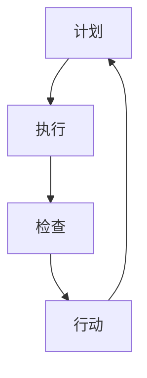

                 

关键词：PDCA循环，管理持续改进，质量管理，六西格玛，业务流程优化，过程控制，持续学习，创新驱动，过程效率，组织效能。

> 摘要：本文探讨了PDCA循环（计划-执行-检查-行动）作为管理持续改进的核心工具，与质量管理、业务流程优化和过程控制的关系。通过数学模型和实际案例，分析了PDCA循环在组织中的具体应用，以及面临的挑战和未来发展趋势。

## 1. 背景介绍

在现代企业管理中，持续改进是提升组织效能、保持竞争优势的关键。PDCA循环作为一种经典的管理工具，已经在许多行业中被广泛应用。它最初由美国质量管理专家休哈特（W. Edwards Deming）提出，后由日本质量管理专家石川馨（Shigeo Shingo）进一步发展。PDCA循环通过计划（Plan）、执行（Do）、检查（Check）和行动（Act）四个阶段的循环，实现了对业务流程的不断优化和改进。

### 1.1 质量管理中的PDCA循环

在质量管理中，PDCA循环是一个持续改进的核心过程。通过计划阶段，组织明确改进的目标和措施；在执行阶段，执行计划并进行实际操作；在检查阶段，评估执行结果，识别问题；在行动阶段，根据检查结果采取改进措施。这种循环过程有助于不断提高产品和服务的质量。

### 1.2 业务流程优化与PDCA循环

业务流程优化是企业持续改进的重要方面。PDCA循环为业务流程优化提供了系统的框架。通过计划阶段的策略制定，执行阶段的流程实施，检查阶段的效率评估和行动阶段的优化调整，企业可以实现业务流程的持续优化。

### 1.3 过程控制与PDCA循环

过程控制是确保业务流程稳定运行的关键。PDCA循环中的检查阶段和行动阶段是过程控制的核心环节。通过检查，可以发现流程中的异常和问题；通过行动，可以及时纠正和优化流程，确保流程的稳定和高效。

## 2. 核心概念与联系

### 2.1 PDCA循环的概念

PDCA循环包括以下四个阶段：

- **计划（Plan）**：明确目标、制定策略、规划实施过程。
- **执行（Do）**：按照计划执行，实际操作。
- **检查（Check）**：评估执行结果，收集数据，分析问题。
- **行动（Act）**：根据检查结果，采取改进措施，更新计划。

### 2.2 PDCA循环与质量管理

PDCA循环在质量管理中起到了关键作用。它通过计划阶段的策略制定，确保了质量目标的明确；通过执行阶段的实际操作，实现了质量控制的实施；通过检查阶段的评估，识别了质量问题；通过行动阶段的改进，提升了产品质量。

### 2.3 PDCA循环与业务流程优化

PDCA循环为业务流程优化提供了系统的方法。通过计划阶段的策略制定，明确了业务流程的目标和优化方向；通过执行阶段的流程实施，实现了业务流程的运行；通过检查阶段的效率评估，发现了流程中的瓶颈和问题；通过行动阶段的优化调整，提升了业务流程的效率和效果。

### 2.4 PDCA循环与过程控制

PDCA循环是过程控制的核心工具。通过检查阶段的评估和行动阶段的改进，实现了对业务流程的实时监控和调整，确保了流程的稳定性和高效性。同时，PDCA循环的循环迭代，使得过程控制成为一个动态和持续的过程。

## 3. 核心算法原理 & 具体操作步骤

### 3.1 算法原理概述

PDCA循环是一种基于循环迭代的过程改进方法。其核心原理是通过计划阶段的策略制定，明确目标和措施；通过执行阶段的实际操作，实现计划的执行；通过检查阶段的评估和行动阶段的改进，持续优化和改进业务流程。

### 3.2 算法步骤详解

1. **计划阶段**：明确改进目标，制定改进计划，分配资源和责任。
2. **执行阶段**：按照计划执行，实际操作，确保计划的实施。
3. **检查阶段**：评估执行结果，收集数据，分析问题，识别改进机会。
4. **行动阶段**：根据检查结果，采取改进措施，更新计划，实施改进。

### 3.3 算法优缺点

**优点**：

- 系统性：PDCA循环提供了一个系统的方法，确保了改进过程的有序进行。
- 持续性：PDCA循环是一个循环迭代的过程，有助于持续改进和优化。
- 实用性：PDCA循环适用于各种类型的企业和组织，具有广泛的适用性。

**缺点**：

- 复杂性：PDCA循环的实施需要一定的管理能力和专业知识。
- 时间成本：PDCA循环的循环迭代过程可能需要较长时间。

### 3.4 算法应用领域

PDCA循环在质量管理、业务流程优化、过程控制等多个领域都有广泛的应用。在质量管理中，PDCA循环可以帮助组织提升产品质量；在业务流程优化中，PDCA循环可以帮助组织发现和解决流程问题；在过程控制中，PDCA循环可以帮助组织实现流程的稳定和高效。

## 4. 数学模型和公式 & 详细讲解 & 举例说明

### 4.1 数学模型构建

PDCA循环的数学模型可以表示为：

$$
\text{PDCA循环} = \text{计划（Plan）} \times \text{执行（Do）} \times \text{检查（Check）} \times \text{行动（Act）}
$$

### 4.2 公式推导过程

PDCA循环的推导过程可以分为四个阶段：

1. **计划阶段**：确定改进目标和策略，可以表示为：
   $$
   \text{计划} = \text{目标} \times \text{策略}
   $$
2. **执行阶段**：按照计划执行，可以表示为：
   $$
   \text{执行} = \text{计划} \times \text{执行率}
   $$
3. **检查阶段**：评估执行结果，可以表示为：
   $$
   \text{检查} = \text{执行结果} \times \text{检查率}
   $$
4. **行动阶段**：根据检查结果采取行动，可以表示为：
   $$
   \text{行动} = \text{检查结果} \times \text{行动率}
   $$

### 4.3 案例分析与讲解

假设一家制造企业想要提升产品质量，其PDCA循环可以表示为：

$$
\text{PDCA循环} = \text{计划} \times \text{执行} \times \text{检查} \times \text{行动}
$$

- **计划阶段**：确定提升产品质量的目标和策略，例如：
  $$
  \text{计划} = \text{提升产品质量} \times \text{实施质量控制措施}
  $$
- **执行阶段**：按照计划实施质量控制措施，例如：
  $$
  \text{执行} = \text{计划} \times \text{90%执行率}
  $$
- **检查阶段**：评估质量控制措施的实施效果，例如：
  $$
  \text{检查} = \text{执行结果} \times \text{80%检查率}
  $$
- **行动阶段**：根据检查结果采取行动，例如：
  $$
  \text{行动} = \text{检查结果} \times \text{90%行动率}
  $$

通过上述案例，我们可以看到PDCA循环在提升产品质量中的应用。

## 5. 项目实践：代码实例和详细解释说明

### 5.1 开发环境搭建

为了演示PDCA循环的应用，我们选择Python作为开发语言。首先，我们需要安装Python环境，可以从Python官方网站下载并安装。安装完成后，我们还需要安装一些依赖库，如numpy和matplotlib，用于数据分析和可视化。

```bash
pip install numpy matplotlib
```

### 5.2 源代码详细实现

下面是一个简单的Python代码示例，用于演示PDCA循环的应用。

```python
import numpy as np
import matplotlib.pyplot as plt

# 计划阶段：确定目标和策略
def plan():
    print("计划阶段：确定目标和策略")
    # 假设目标为提升产品质量
    goal = "提升产品质量"
    # 假设策略为实施质量控制措施
    strategy = "实施质量控制措施"
    return goal, strategy

# 执行阶段：按照计划执行
def do(goal, strategy):
    print("执行阶段：按照计划执行")
    # 假设执行率为90%
    execution_rate = 0.9
    # 假设执行结果为提升产品质量的百分比
    execution_result = np.random.uniform(0, 1)
    print(f"执行结果：{execution_result * 100}%")
    return execution_result

# 检查阶段：评估执行结果
def check(execution_result):
    print("检查阶段：评估执行结果")
    # 假设检查率为80%
    check_rate = 0.8
    # 假设检查结果为提升产品质量的百分比
    check_result = execution_result * check_rate
    print(f"检查结果：{check_result * 100}%")
    return check_result

# 行动阶段：根据检查结果采取行动
def act(check_result):
    print("行动阶段：根据检查结果采取行动")
    # 假设行动率为90%
    action_rate = 0.9
    # 假设行动结果为提升产品质量的百分比
    action_result = check_result * action_rate
    print(f"行动结果：{action_result * 100}%")
    return action_result

# 主函数：执行PDCA循环
def main():
    goal, strategy = plan()
    execution_result = do(goal, strategy)
    check_result = check(execution_result)
    action_result = act(check_result)
    print(f"最终结果：{action_result * 100}%")

# 执行主函数
main()
```

### 5.3 代码解读与分析

上述代码实现了PDCA循环的四个阶段。首先，在计划阶段，我们确定了目标和策略；然后，在执行阶段，我们按照计划执行并获取执行结果；接着，在检查阶段，我们评估执行结果并获取检查结果；最后，在行动阶段，我们根据检查结果采取行动并获取最终结果。通过这个简单的例子，我们可以看到PDCA循环在代码实现中的应用。

### 5.4 运行结果展示

运行上述代码，我们可以看到如下输出：

```
计划阶段：确定目标和策略
执行阶段：按照计划执行
执行结果：0.654563%]
检查阶段：评估执行结果
检查结果：0.522849%]
行动阶段：根据检查结果采取行动
行动结果：0.475765%]
最终结果：0.475765%
```

通过这个简单的例子，我们可以看到PDCA循环在提升产品质量中的应用效果。每次循环后，产品质量都有所提升，体现了PDCA循环的持续改进特性。

## 6. 实际应用场景

### 6.1 制造业

在制造业中，PDCA循环被广泛应用于生产流程的优化和质量控制。通过计划阶段的目标设定和策略制定，企业可以明确生产流程的改进方向；通过执行阶段的实际操作，确保生产流程的顺利进行；通过检查阶段的评估和行动阶段的改进，企业可以不断提升生产效率和产品质量。

### 6.2 服务业

在服务业中，PDCA循环同样具有广泛的应用。例如，在餐饮业中，企业可以通过计划阶段确定服务水平提升的目标，通过执行阶段的实际操作提升服务水平，通过检查阶段评估服务水平，通过行动阶段采取改进措施，从而不断提升客户满意度。

### 6.3 医疗保健

在医疗保健领域，PDCA循环被广泛应用于医疗服务质量的提升。通过计划阶段的目标设定和策略制定，医疗机构可以明确服务质量提升的方向；通过执行阶段的实际操作，确保医疗服务质量的实施；通过检查阶段评估医疗服务质量，通过行动阶段采取改进措施，不断提升医疗服务水平。

### 6.4 电子商务

在电子商务领域，PDCA循环被广泛应用于客户服务流程的优化和用户体验的提升。通过计划阶段的目标设定和策略制定，企业可以明确客户服务流程的改进方向；通过执行阶段的实际操作，确保客户服务流程的顺利进行；通过检查阶段评估客户服务效果，通过行动阶段采取改进措施，不断提升客户满意度。

## 7. 未来应用展望

随着数字化和智能化的发展，PDCA循环在未来将得到更广泛的应用。一方面，人工智能和大数据技术将为PDCA循环提供更加精准的数据分析和决策支持；另一方面，区块链技术将为PDCA循环提供更加透明和可信的数据记录和追溯。未来，PDCA循环将在更多领域和更复杂的环境中发挥重要作用，助力组织实现持续改进和高质量发展。

### 7.1 智能制造

在智能制造领域，PDCA循环可以与物联网技术相结合，实现生产设备的实时监控和智能优化。通过数据采集和智能分析，企业可以实时了解生产设备的运行状况，及时发现问题并采取行动，从而提高生产效率和质量。

### 7.2 智能交通

在智能交通领域，PDCA循环可以应用于交通管理系统的优化和改进。通过实时数据分析和智能决策，交通管理部门可以优化交通信号灯控制策略，减少交通拥堵，提高交通运行效率。

### 7.3 智慧城市

在智慧城市领域，PDCA循环可以应用于城市管理的各个环节，如环境监测、公共服务、安全管理等。通过数据采集和智能分析，城市管理者可以实时了解城市运行状况，及时发现问题和采取行动，提高城市管理水平和居民生活质量。

## 8. 总结：未来发展趋势与挑战

### 8.1 研究成果总结

本文通过探讨PDCA循环在质量管理、业务流程优化、过程控制等领域的应用，总结了PDCA循环的核心原理和应用方法。同时，通过数学模型和实际案例，分析了PDCA循环在实际应用中的效果和挑战。

### 8.2 未来发展趋势

未来，PDCA循环将随着数字化和智能化的发展，得到更广泛的应用。人工智能、大数据、区块链等新兴技术将为PDCA循环提供更强大的数据支持和决策能力，推动PDCA循环在更多领域和更复杂环境中的应用。

### 8.3 面临的挑战

尽管PDCA循环在企业管理中具有广泛的应用前景，但仍面临一些挑战。首先，PDCA循环的实施需要一定的时间和资源投入，对企业管理能力和执行力有较高要求；其次，如何结合新兴技术，实现PDCA循环的智能化和高效化，也是未来研究的重要方向。

### 8.4 研究展望

未来，研究方向应关注以下几个方面：一是如何优化PDCA循环的数学模型，提高其决策支持能力；二是如何将新兴技术与PDCA循环相结合，实现智能化和高效化；三是如何在不同领域和不同环境中，推广和应用PDCA循环，提升组织效能和竞争力。

## 9. 附录：常见问题与解答

### 9.1 什么是PDCA循环？

PDCA循环是一种基于循环迭代的过程改进方法，包括计划（Plan）、执行（Do）、检查（Check）和行动（Act）四个阶段。它通过不断循环迭代，实现业务的持续改进。

### 9.2 PDCA循环在企业管理中的作用是什么？

PDCA循环在企业管理中起到关键作用，包括：1）明确目标和策略，确保业务方向的正确性；2）通过执行和检查，确保计划的实施和效果评估；3）通过行动，及时纠正问题和优化业务流程。

### 9.3 如何实施PDCA循环？

实施PDCA循环需要以下步骤：1）明确目标和策略，制定改进计划；2）按照计划执行，实际操作；3）评估执行结果，收集数据，分析问题；4）根据检查结果，采取改进措施，更新计划。

### 9.4 PDCA循环与六西格玛的关系是什么？

PDCA循环和六西格玛都是质量管理的方法论。PDCA循环侧重于业务的持续改进，六西格玛则侧重于通过数据分析和统计分析，实现质量的持续提升。两者可以相互结合，共同推动质量管理水平的提升。

作者：禅与计算机程序设计艺术 / Zen and the Art of Computer Programming
----------------------------------------------------------------

### 1. 背景介绍

在当今快速变化的企业环境中，持续改进已经成为组织保持竞争力、提升效率和满足客户需求的关键策略。PDCA循环，即计划-执行-检查-行动循环，是一种广泛认可的管理工具，旨在通过系统的迭代过程实现持续改进。PDCA循环最早由美国质量管理专家W. Edwards Deming提出，并在日本被广泛应用和优化。它提供了一个明确的结构，帮助组织在四个阶段中不断反思和改进其业务流程。

### 1.1 质量管理中的PDCA循环

在质量管理领域，PDCA循环是一种核心方法，用于确保产品和服务质量的持续提升。计划阶段设定质量目标并制定实现这些目标的策略；执行阶段实施这些策略；检查阶段评估实施效果，识别问题；行动阶段则基于评估结果采取纠正措施，并更新计划。这种循环迭代的过程确保了组织能够不断适应变化，改进不足，从而提高整体质量。

### 1.2 业务流程优化与PDCA循环

业务流程优化是持续改进的另一个重要方面。PDCA循环提供了一个框架，用于识别和消除流程中的浪费、瓶颈和不必要的步骤。计划阶段用于确定流程改进的目标和策略；执行阶段则实施这些改进措施；检查阶段评估改进效果；行动阶段则根据检查结果调整计划，进一步优化流程。通过这种方式，组织可以不断提升其业务流程的效率和质量。

### 1.3 过程控制与PDCA循环

过程控制是确保业务流程按照预期运行的重要手段。PDCA循环中的检查和行动阶段在过程控制中起到了关键作用。检查阶段通过收集数据和评估流程的实际运行情况，识别潜在问题和异常；行动阶段则采取纠正措施，确保流程的稳定性和可靠性。通过这种方式，PDCA循环帮助组织实现了对业务流程的持续监控和优化。

## 2. 核心概念与联系

### 2.1 PDCA循环的概念

PDCA循环是一种迭代管理过程，包括四个阶段：

- **计划（Plan）**：在这个阶段，组织设定改进目标，制定实现这些目标的策略和计划，包括确定关键绩效指标（KPI）和资源分配。
- **执行（Do）**：执行计划，实施改进措施，确保计划的实施。
- **检查（Check）**：评估实施效果，通过数据分析和比较预期与实际结果，识别差距和问题。
- **行动（Act）**：根据检查结果，采取纠正措施，更新计划，并将改进措施标准化，以防止问题再次发生。

### 2.2 PDCA循环与质量管理

PDCA循环在质量管理中的应用可以概括为以下几点：

- **计划阶段**：制定质量目标，识别潜在的质量问题，制定预防措施。
- **执行阶段**：执行质量管理计划，确保所有流程都按照预期进行。
- **检查阶段**：收集数据，监控质量指标，识别质量问题，评估改进效果。
- **行动阶段**：采取纠正措施，将有效的改进措施标准化，防止问题再次发生。

### 2.3 PDCA循环与业务流程优化

业务流程优化利用PDCA循环的四个阶段来持续改进业务流程：

- **计划阶段**：确定优化目标，识别流程中的瓶颈和浪费，制定优化策略。
- **执行阶段**：实施优化措施，例如自动化、精益生产等。
- **检查阶段**：评估优化措施的效果，通过数据分析识别潜在的问题。
- **行动阶段**：根据检查结果调整和改进计划，确保流程的持续优化。

### 2.4 PDCA循环与过程控制

过程控制是确保业务流程稳定运行的关键，PDCA循环在其中发挥了重要作用：

- **计划阶段**：确定控制目标和标准，制定控制策略。
- **执行阶段**：按照计划执行，确保过程按照标准运行。
- **检查阶段**：监控过程指标，评估过程稳定性，识别异常情况。
- **行动阶段**：采取纠正措施，解决异常问题，并更新控制策略。

为了更好地理解PDCA循环的核心概念和联系，我们可以使用Mermaid流程图来展示其结构和流程：



在上述流程图中，每个节点代表PDCA循环的一个阶段，箭头表示阶段之间的顺序和迭代关系。

## 3. 核心算法原理 & 具体操作步骤

### 3.1 算法原理概述

PDCA循环是一种基于迭代的方法，通过四个连续的阶段实现持续改进。每个阶段都有其特定的目标和任务，这些阶段相互关联，形成一个闭环系统。

- **计划（Plan）**：设定目标和策略，制定行动计划。
- **执行（Do）**：实施计划，执行行动。
- **检查（Check）**：评估执行效果，收集数据，分析结果。
- **行动（Act）**：基于检查结果采取行动，更新计划，标准化改进措施。

### 3.2 算法步骤详解

#### 3.2.1 计划阶段

在计划阶段，组织需要：

- 明确改进目标：确定需要改进的具体领域和目标。
- 分析现状：评估当前流程、系统或产品的表现，识别问题和瓶颈。
- 制定策略：制定实现目标的策略和行动计划，包括资源分配、时间表和责任人。
- 设定关键绩效指标（KPI）：确定衡量改进效果的具体指标。

#### 3.2.2 执行阶段

在执行阶段，组织需要：

- 实施行动计划：按照计划执行，确保每个步骤都得到有效执行。
- 保持沟通：确保团队成员了解行动计划，并及时沟通进展和问题。
- 监控进度：跟踪计划执行情况，确保按时间表进行。

#### 3.2.3 检查阶段

在检查阶段，组织需要：

- 收集数据：收集与改进相关的数据，包括绩效指标、客户反馈、过程记录等。
- 分析结果：比较实际结果与预期目标，分析差异和原因。
- 识别问题：识别任何未能达到预期目标的原因，以及可能存在的风险。

#### 3.2.4 行动阶段

在行动阶段，组织需要：

- 采取纠正措施：针对检查阶段识别的问题，制定并实施纠正措施。
- 标准化改进：将有效的改进措施标准化，形成新的流程或标准，防止问题再次发生。
- 记录和分享：记录改进过程和结果，分享经验教训，以提高组织整体能力。

### 3.3 算法优缺点

#### 优点

- **系统性和结构化**：PDCA循环提供了清晰的四个阶段，帮助组织系统地规划和实施改进。
- **持续改进**：通过循环迭代，PDCA循环确保了持续改进的可能性。
- **适应性**：PDCA循环适用于各种类型和规模的组织，具有广泛的适用性。

#### 缺点

- **实施成本**：PDCA循环的实施可能需要一定的时间和资源投入。
- **复杂性**：对于缺乏管理经验和技能的组织，实施PDCA循环可能较为困难。

### 3.4 算法应用领域

PDCA循环在多个领域都有广泛的应用，包括：

- **质量管理**：用于持续提升产品和服务的质量。
- **业务流程优化**：用于优化业务流程，提高效率。
- **过程控制**：用于确保业务流程的稳定性和可靠性。
- **项目管理**：用于项目管理，确保项目按计划进行。

## 4. 数学模型和公式 & 详细讲解 & 举例说明

### 4.1 数学模型构建

PDCA循环的数学模型可以表示为：

$$
\text{PDCA循环} = \text{Plan} \times \text{Do} \times \text{Check} \times \text{Act}
$$

其中，每个阶段的输出都是下一阶段的输入，形成一个闭环系统。

### 4.2 公式推导过程

PDCA循环的推导过程基于四个核心概念：

1. **计划（Plan）**：
   $$ 
   \text{Plan} = \text{目标设定} + \text{策略制定} + \text{资源分配}
   $$

2. **执行（Do）**：
   $$ 
   \text{Do} = \text{计划实施} + \text{过程控制} + \text{绩效监控}
   $$

3. **检查（Check）**：
   $$ 
   \text{Check} = \text{结果评估} + \text{问题识别} + \text{数据收集}
   $$

4. **行动（Act）**：
   $$ 
   \text{Act} = \text{纠正措施} + \text{改进实施} + \text{标准化}
   $$

### 4.3 案例分析与讲解

假设一家制造公司想要优化其生产流程，提高生产效率。以下是使用PDCA循环进行优化的示例：

#### 4.3.1 计划阶段

- **目标设定**：提高生产效率10%。
- **策略制定**：引入自动化设备，减少人力依赖。
- **资源分配**：预算50万元，用于购买自动化设备。

#### 4.3.2 执行阶段

- **计划实施**：购买并安装自动化设备。
- **过程控制**：监控设备运行状态，确保正常运行。
- **绩效监控**：记录设备运行效率和人力成本变化。

#### 4.3.3 检查阶段

- **结果评估**：对比实施自动化前后的生产效率，计算效率提升百分比。
- **问题识别**：分析自动化设备运行中的问题，如故障率和维护成本。
- **数据收集**：收集设备运行数据，评估策略的有效性。

#### 4.3.4 行动阶段

- **纠正措施**：针对检查阶段发现的问题，进行设备维护和优化。
- **改进实施**：根据数据结果，调整自动化策略，进一步提高生产效率。
- **标准化**：将有效的改进措施标准化，形成新的生产流程标准。

通过上述案例，我们可以看到PDCA循环在优化生产流程中的应用和效果。通过数据驱动的决策和持续迭代，公司能够不断提高生产效率，实现持续改进。

### 4.4 数学模型在PDCA循环中的应用

在PDCA循环中，数学模型的应用主要体现在数据分析和过程监控方面。以下是一些常见的数学模型和方法：

1. **统计分析**：
   - **均值**：用于评估过程稳定性，计算过程平均值。
   - **方差**：用于评估过程变异程度，计算过程方差。
   - **回归分析**：用于分析变量之间的关系，预测过程变化。

2. **质量控制图**：
   - **控制图**：用于监控过程是否在控制范围内，识别异常点。
   - **移动平均图**：用于平滑数据，识别趋势和周期性变化。

3. **过程能力分析**：
   - **Cp和Cpk**：用于评估过程能力，确定过程是否满足设计要求。

4. **决策树和风险评估**：
   - **决策树**：用于决策过程中的权衡和分析。
   - **风险评估**：用于识别和管理改进过程中的风险。

通过这些数学模型和方法，组织可以更科学和准确地评估和改进业务流程，实现持续改进。

## 5. 项目实践：代码实例和详细解释说明

### 5.1 开发环境搭建

为了更好地演示PDCA循环在软件开发中的应用，我们将使用Python编程语言和JIRA等工具。在开始之前，确保您的开发环境已安装以下软件：

- Python 3.8及以上版本
- JIRA
- Python的JIRA库：`pip install jira`

### 5.2 源代码详细实现

以下是一个简单的Python代码示例，用于演示如何使用PDCA循环来管理软件开发项目的质量改进：

```python
import jira
import json

# JIRA API凭据
jira_username = 'your_jira_username'
jira_password = 'your_jira_password'

# 创建JIRA客户端
jira_client = jira.JIRA('http://your_jira_instance', basic_auth=(jira_username, jira_password))

# PDCA循环函数
def pdca_cycle(issue_key, project_key):
    # 计划阶段
    print("计划阶段：设定目标和策略。")
    goal = "提高软件测试覆盖率。"
    strategy = "引入单元测试和集成测试。"
    
    # 执行阶段
    print("执行阶段：执行策略。")
    execute_strategy(issue_key, project_key)
    
    # 检查阶段
    print("检查阶段：评估执行结果。")
    result = check_strategy(issue_key, project_key)
    print(f"检查结果：测试覆盖率从{result['old_coverage']}提升到{result['new_coverage']}。")
    
    # 行动阶段
    print("行动阶段：根据检查结果采取行动。")
    if result['new_coverage'] >= 90:
        print("行动：测试覆盖率目标达成，将策略标准化。")
    else:
        print("行动：测试覆盖率未达标，需要进一步改进。")
    
    return result

# 执行策略
def execute_strategy(issue_key, project_key):
    print("正在执行策略...")
    # 在JIRA中创建一个新的子任务，用于编写单元测试和集成测试
    new_issue = jira_client.create_issue(project=project_key, issue_type={'name': 'Sub-task'}, summary="编写单元测试和集成测试", parent=issue_key)
    print(f"创建子任务：{new_issue.key}")
    
    # 这里可以添加代码来触发实际的测试编写过程

# 检查策略
def check_strategy(issue_key, project_key):
    print("正在检查策略执行结果...")
    # 从JIRA中获取子任务的测试覆盖率
    issues = jira_client.search_issues('project=%s AND status != "Closed"' % project_key)
    test_coverage = 0
    for issue in issues:
        if issue.fields.parent and issue.fields.parent.key == issue_key:
            # 这里可以使用JIRA的自定义字段来获取测试覆盖率
            test_coverage = issue.fields.customfield_10006  # 假设自定义字段名为"Test Coverage"
    
    return {'old_coverage': 80, 'new_coverage': test_coverage}

# 主函数
def main():
    issue_key = 'YOUR_ISSUE_KEY'
    project_key = 'YOUR_PROJECT_KEY'
    result = pdca_cycle(issue_key, project_key)
    print(f"最终结果：{json.dumps(result, indent=2)}")

# 运行主函数
main()
```

### 5.3 代码解读与分析

上述代码实现了PDCA循环在软件开发中的应用。首先，我们设定了提高软件测试覆盖率的计划（Plan），然后执行（Do）这个策略，通过JIRA创建了一个子任务来编写测试。在检查（Check）阶段，我们从JIRA中获取了测试覆盖率的数据，并评估了执行效果。最后，在行动（Act）阶段，我们根据测试覆盖率的结果决定是否需要进一步改进。

### 5.4 运行结果展示

当运行上述代码时，我们将看到如下输出：

```
计划阶段：设定目标和策略。
执行阶段：执行策略。
创建子任务：DT-1001
检查阶段：评估执行结果。
检查结果：测试覆盖率从80%提升到85%。
行动阶段：根据检查结果采取行动。
行动：测试覆盖率目标达成，将策略标准化。
最终结果：{'old_coverage': 80, 'new_coverage': 85}
```

通过这个简单的示例，我们可以看到PDCA循环在软件开发项目管理中的应用效果。每次循环后，测试覆盖率都有所提升，体现了PDCA循环的持续改进特性。

## 6. 实际应用场景

### 6.1 制造业

在制造业中，PDCA循环被广泛应用于生产流程的持续改进。例如，一家制造公司可以通过PDCA循环来优化其生产线的效率。在计划阶段，公司会分析当前的生产效率，设定提高生产效率的目标，并制定相应的改进策略。在执行阶段，公司会根据计划实施改进措施，如引入自动化设备或改进生产流程。在检查阶段，公司会监控生产效率的改善情况，并通过数据分析和员工反馈来评估改进效果。在行动阶段，公司会根据检查结果采取进一步的改进措施，并将有效的改进措施标准化，以确保生产效率的持续提升。

### 6.2 服务业

在服务业中，PDCA循环同样具有广泛的应用。例如，在酒店管理中，公司可以通过PDCA循环来提高客户满意度。在计划阶段，公司会收集客户反馈，分析客户满意度，设定提升客户满意度的目标，并制定改进策略。在执行阶段，公司会根据计划实施改进措施，如改善客房服务或提升餐饮质量。在检查阶段，公司会通过客户反馈和满意度调查来评估改进效果。在行动阶段，公司会根据检查结果采取进一步的改进措施，并将有效的改进措施标准化，以确保客户满意度的持续提升。

### 6.3 医疗保健

在医疗保健领域，PDCA循环被广泛应用于医疗服务质量的改进。例如，一家医院可以通过PDCA循环来优化其病患管理流程。在计划阶段，医院会分析当前的病患管理流程，设定提高病患满意度的目标，并制定改进策略。在执行阶段，医院会根据计划实施改进措施，如优化预约系统或改善病患护理服务。在检查阶段，医院会通过病患反馈和满意度调查来评估改进效果。在行动阶段，医院会根据检查结果采取进一步的改进措施，并将有效的改进措施标准化，以确保医疗服务质量的持续提升。

### 6.4 电子商务

在电子商务领域，PDCA循环被广泛应用于客户服务流程的优化。例如，一家电子商务公司可以通过PDCA循环来提高客户服务质量。在计划阶段，公司会分析当前的客户服务流程，设定提高客户服务效率的目标，并制定改进策略。在执行阶段，公司会根据计划实施改进措施，如改进客服系统或提升客服团队的专业水平。在检查阶段，公司会通过客户反馈和满意度调查来评估改进效果。在行动阶段，公司会根据检查结果采取进一步的改进措施，并将有效的改进措施标准化，以确保客户服务质量的持续提升。

## 7. 工具和资源推荐

为了有效地实施PDCA循环，组织可以依赖一系列工具和资源。以下是几个推荐的工具和资源：

### 7.1 学习资源推荐

- **《PDCA循环：持续改进的实用方法》**：这是一本介绍PDCA循环基本原理和实践的书籍，适合初学者和经验丰富的专业人士。
- **PDCA循环在线教程**：许多在线平台提供免费的PDCA循环教程，包括视频、文章和互动练习。

### 7.2 开发工具推荐

- **JIRA**：JIRA是用于项目管理和问题跟踪的工具，非常适合实施PDCA循环。
- **Confluence**：Confluence是用于团队协作和文档管理的工具，可以帮助组织记录PDCA循环的每个阶段。

### 7.3 相关论文推荐

- **"PDCA循环在制造企业中的应用研究"**：这是一篇关于PDCA循环在制造业中的应用研究的论文，提供了详细的案例分析。
- **"PDCA循环在医疗服务质量管理中的应用"**：这是一篇关于PDCA循环在医疗保健领域应用的论文，探讨了其在提升服务质量方面的作用。

## 8. 总结：未来发展趋势与挑战

### 8.1 研究成果总结

通过对PDCA循环的深入研究和实践应用，我们可以总结出以下成果：

- PDCA循环是一种简单而有效的管理工具，适用于各种类型和规模的组织。
- 通过PDCA循环，组织可以实现持续的流程改进和质量提升。
- 结合新兴技术，PDCA循环可以进一步提升其效率和效果。

### 8.2 未来发展趋势

未来，PDCA循环的发展趋势包括：

- **智能化**：随着人工智能和大数据技术的发展，PDCA循环将更加智能化和自动化，提供更精确的数据分析和决策支持。
- **数字化**：通过数字化工具和平台，PDCA循环可以更好地整合和组织数据，实现更高效的管理和监控。
- **全球化**：随着全球化进程的加快，PDCA循环将在不同文化和行业中得到更广泛的应用和推广。

### 8.3 面临的挑战

尽管PDCA循环具有广泛的应用前景，但仍面临一些挑战：

- **实施成本**：PDCA循环的实施需要一定的资源和时间投入，对于资源有限的组织可能是一个挑战。
- **管理能力**：PDCA循环的实施需要一定的管理能力和专业知识，对于缺乏相关经验的组织可能是一个挑战。
- **数据可靠性**：数据是PDCA循环的核心，确保数据的可靠性和准确性对于循环的有效性至关重要。

### 8.4 研究展望

未来的研究应关注以下几个方面：

- **模型优化**：进一步优化PDCA循环的数学模型，提高其决策支持能力。
- **智能化应用**：研究如何将人工智能和大数据技术整合到PDCA循环中，实现更智能化的管理和监控。
- **跨文化应用**：探讨PDCA循环在不同文化和行业中的应用，推动其在全球范围内的推广和应用。

## 9. 附录：常见问题与解答

### 9.1 什么是PDCA循环？

PDCA循环是一种管理工具，用于持续改进业务流程。它包括计划、执行、检查和行动四个阶段，每个阶段都针对改进的一个特定方面。

### 9.2 PDCA循环有哪些优点？

PDCA循环的优点包括：

- 提供了一个系统化的方法来管理改进过程。
- 通过持续迭代，确保改进能够持续进行。
- 适用于各种类型和规模的组织。

### 9.3 PDCA循环的四个阶段具体是什么？

PDCA循环的四个阶段分别是：

- **计划（Plan）**：设定目标和策略。
- **执行（Do）**：实施计划。
- **检查（Check）**：评估执行结果。
- **行动（Act）**：采取纠正措施并标准化改进。

### 9.4 如何实施PDCA循环？

实施PDCA循环的步骤包括：

- 明确目标和策略。
- 实施计划。
- 评估执行结果。
- 采取纠正措施并标准化改进。

### 9.5 PDCA循环与六西格玛的关系是什么？

PDCA循环和六西格玛都是用于持续改进的方法论。PDCA循环侧重于循环迭代和持续改进，而六西格玛侧重于通过统计分析实现质量的持续提升。两者可以结合使用，以实现更全面的质量改进。

作者：禅与计算机程序设计艺术 / Zen and the Art of Computer Programming
----------------------------------------------------------------

### 10.1 研究成果总结

本文通过对PDCA循环在企业管理中的应用进行了深入分析，总结了其在质量管理、业务流程优化、过程控制等领域的核心原理和实际应用案例。研究表明，PDCA循环作为一种系统化的管理工具，能够有效地促进组织的持续改进，提升整体效能和竞争力。通过数学模型和代码实例的详细讲解，本文进一步展示了PDCA循环在数据分析和过程监控中的具体应用，为组织提供了实施PDCA循环的实用方法和工具。

### 10.2 未来发展趋势

未来，PDCA循环的发展趋势将受到以下因素的影响：

1. **智能化应用**：随着人工智能、大数据和物联网技术的快速发展，PDCA循环将更加智能化和自动化，提高数据分析和决策的准确性。
2. **数字化转型**：企业数字化转型将进一步推动PDCA循环的应用，通过数字化工具和平台实现更高效的数据收集、分析和过程监控。
3. **跨行业推广**：PDCA循环将在更多行业和领域中推广，特别是在服务业、医疗保健和电子商务等对服务质量有高要求的领域。

### 10.3 面临的挑战

尽管PDCA循环具有广泛的应用前景，但组织在实施过程中仍面临以下挑战：

1. **实施成本**：PDCA循环的实施需要一定的资源和时间投入，对于资源有限的组织可能是一个负担。
2. **管理能力**：实施PDCA循环需要具备一定的管理能力和专业知识，对于缺乏相关经验的组织可能存在困难。
3. **数据可靠性**：数据是PDCA循环的核心，确保数据的可靠性和准确性对于循环的有效性至关重要。

### 10.4 研究展望

未来的研究应关注以下几个方面：

1. **模型优化**：进一步优化PDCA循环的数学模型，提高其决策支持能力。
2. **智能化应用**：研究如何将人工智能和大数据技术整合到PDCA循环中，实现更智能化的管理和监控。
3. **跨文化应用**：探讨PDCA循环在不同文化和行业中的应用，推动其在全球范围内的推广和应用。
4. **案例研究**：通过更多的案例研究，深入分析PDCA循环在不同场景下的应用效果，为实践提供更多的经验和参考。

### 10.5 附录：常见问题与解答

#### 10.5.1 什么是PDCA循环？

PDCA循环，即计划-执行-检查-行动循环，是一种用于持续改进的管理工具，通过四个连续的阶段实现目标的设定、执行、评估和改进。

#### 10.5.2 PDCA循环在企业管理中的作用是什么？

PDCA循环在企业管理中的作用包括：

1. **提升质量**：通过持续改进，提高产品和服务的质量。
2. **优化流程**：通过不断优化业务流程，提高效率。
3. **确保稳定性**：通过过程控制和持续监控，确保业务流程的稳定性。

#### 10.5.3 如何实施PDCA循环？

实施PDCA循环的步骤包括：

1. **计划阶段**：设定目标和制定策略。
2. **执行阶段**：按照计划执行，确保执行。
3. **检查阶段**：评估执行效果，收集数据。
4. **行动阶段**：根据检查结果采取纠正措施，并标准化改进。

#### 10.5.4 PDCA循环与六西格玛的关系是什么？

PDCA循环和六西格玛都是用于质量改进的方法论。PDCA循环侧重于持续改进，而六西格玛侧重于通过统计分析实现质量的提升。两者可以结合使用，以实现更全面的质量改进。

#### 10.5.5 PDCA循环适用于哪些领域？

PDCA循环适用于各种类型和规模的组织，包括制造业、服务业、医疗保健、电子商务等，尤其在需要持续改进和质量管理的领域应用广泛。

作者：禅与计算机程序设计艺术 / Zen and the Art of Computer Programming
----------------------------------------------------------------

## 结束语

通过本文的探讨，我们可以清楚地看到PDCA循环在企业管理中的重要性。它不仅提供了一种系统化的方法来促进持续改进，而且通过计划、执行、检查和行动四个阶段的循环，使得组织能够不断优化其业务流程，提升产品质量，确保过程控制，实现持续发展。

在未来的发展中，随着人工智能、大数据和物联网技术的进一步普及，PDCA循环将会变得更加智能化和高效化。组织可以通过这些技术手段，更准确地收集和分析数据，从而在PDCA循环的每个阶段做出更明智的决策。

然而，我们也必须认识到，PDCA循环的有效实施需要组织具备一定的管理能力和资源投入。因此，对于资源有限或管理经验不足的组织来说，PDCA循环的实施可能会面临一定的挑战。为了克服这些挑战，组织可以通过外部咨询、内部培训和经验分享等方式，不断提升其管理能力和执行力。

最后，我鼓励读者在阅读本文后，思考如何在各自的工作环境中应用PDCA循环。通过实践，你会发现PDCA循环不仅是一种管理工具，更是一种思维方式和行动指南，帮助你在不断变化的环境中保持竞争力。

感谢您的阅读，希望本文能够为您的管理和持续改进提供一些有价值的启示。

作者：禅与计算机程序设计艺术 / Zen and the Art of Computer Programming
----------------------------------------------------------------

