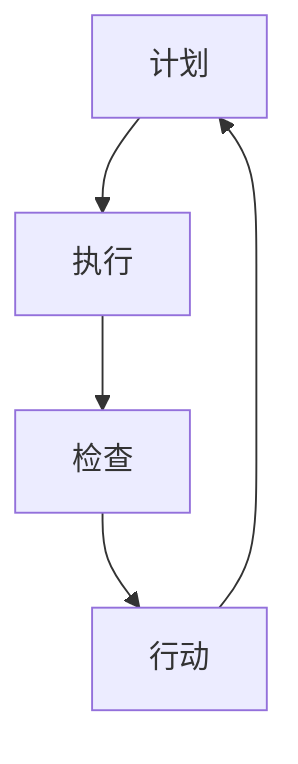

                 

 关键词：PDCA循环、持续改进、管理实践、质量提升、效率优化

> 摘要：本文深入探讨了PDCA循环在IT管理中的应用，分析了PDCA循环与持续改进之间的关系，通过具体案例阐述了PDCA循环在提升管理效率、优化流程、增强质量控制和推动技术创新等方面的作用，总结了PDCA循环在IT管理中的实践价值和未来发展趋势。

## 1. 背景介绍

PDCA循环，又称戴明循环，是一种广泛用于质量管理和其他领域持续改进的方法。PDCA循环包括四个阶段：计划（Plan）、执行（Do）、检查（Check）和行动（Act）。这一循环方法起源于20世纪50年代的日本，由统计学家威廉·爱德华·戴明提出，并在丰田等日本企业中得到了广泛应用，取得了显著的效果。

在IT行业，随着企业信息化程度的提高和市场竞争的加剧，对IT系统的稳定性和效率提出了更高的要求。PDCA循环作为一种系统化、标准化的管理工具，被广泛应用于IT项目管理、系统维护、软件开发等各个环节，以实现持续改进和优化。

## 2. 核心概念与联系

### 2.1 PDCA循环的基本概念

#### 2.1.1 计划（Plan）

计划阶段是PDCA循环的起点，主要任务是明确目标和制定策略。在这个阶段，需要分析现有问题，设定改进目标，制定具体的行动计划和时间表。

#### 2.1.2 执行（Do）

执行阶段是将计划付诸行动的阶段。在这一阶段，需要严格按照计划执行，确保每一个步骤都得到有效落实。

#### 2.1.3 检查（Check）

检查阶段是对执行过程进行监控和评估，以确定计划目标的实现情况。这一阶段通过数据分析和反馈机制，发现执行中的问题和偏差。

#### 2.1.4 行动（Act）

行动阶段是对检查结果进行处理，包括对成功经验进行总结和推广，对失败原因进行分析和纠正。这一阶段的目标是确保改进措施得到有效实施。

### 2.2 PDCA循环与管理持续改进的关系

PDCA循环是管理持续改进的核心方法之一。通过PDCA循环，企业可以持续地发现问题、分析问题、解决问题，从而实现管理的持续优化。

#### 2.2.1 计划（Plan）与持续改进

计划阶段是持续改进的起点，通过目标设定和策略制定，确保改进方向和路径的正确性。有效的计划可以减少改进过程中的盲目性，提高改进效率。

#### 2.2.2 执行（Do）与持续改进

执行阶段是持续改进的关键，只有将计划付诸行动，才能真正实现改进。通过严格的执行，可以验证改进措施的有效性，为后续的优化提供依据。

#### 2.2.3 检查（Check）与持续改进

检查阶段是持续改进的保障，通过对执行过程进行监控和评估，可以及时发现问题和偏差，确保改进目标的实现。通过检查，可以积累改进经验和教训，为下一次改进提供参考。

#### 2.2.4 行动（Act）与持续改进

行动阶段是持续改进的闭环，通过对检查结果的处理，可以将成功的经验推广到整个组织，同时纠正失败的原因，防止问题再次发生。通过行动，可以实现管理的持续优化和提升。

### 2.3 PDCA循环在IT管理中的应用架构



在IT管理中，PDCA循环的应用架构通常包括以下几个方面：

1. **需求分析**：明确改进目标和需求。
2. **项目规划**：制定详细的改进计划和执行步骤。
3. **执行监控**：对改进过程进行实时监控和评估。
4. **问题反馈**：收集和分析改进过程中的问题和偏差。
5. **改进实施**：根据反馈结果进行调整和优化。

## 3. 核心算法原理 & 具体操作步骤

### 3.1 算法原理概述

PDCA循环是一种基于反馈和持续改进的管理方法。其核心算法原理包括以下几个方面：

1. **目标设定**：明确改进目标和预期效果。
2. **策略制定**：制定具体的行动计划和执行步骤。
3. **过程监控**：对执行过程进行实时监控和评估。
4. **问题分析**：收集和分析执行过程中的问题和偏差。
5. **改进实施**：根据问题分析结果进行调整和优化。

### 3.2 算法步骤详解

1. **计划阶段**

   - 分析现有问题：通过调查、访谈等方式，了解当前系统的状况和存在的问题。
   - 设定改进目标：根据分析结果，设定具体的改进目标和指标。
   - 制定行动计划：根据目标和指标，制定详细的行动计划和时间表。

2. **执行阶段**

   - 实施计划：按照行动计划执行，确保每一个步骤都得到有效落实。
   - 监控过程：对执行过程进行实时监控，确保计划的顺利进行。

3. **检查阶段**

   - 数据收集：收集执行过程中的数据，包括进度、质量、成本等。
   - 结果评估：对收集的数据进行分析和评估，确定计划目标的实现情况。

4. **行动阶段**

   - 成功经验总结：对成功经验进行总结和推广，确保整个组织受益。
   - 问题原因分析：对失败原因进行分析，找出问题的根本原因。
   - 改进措施实施：根据问题分析结果，制定具体的改进措施，并实施。

### 3.3 算法优缺点

#### 优点

1. **系统化**：PDCA循环提供了一套系统化的管理方法，确保改进过程的有序进行。
2. **灵活性**：PDCA循环可以根据实际情况进行调整，适应不同的改进需求。
3. **有效性**：通过循环反复的改进，可以逐步提升系统的质量和管理效率。

#### 缺点

1. **耗时较长**：PDCA循环需要经历多个阶段，耗时较长，可能影响改进的紧迫性。
2. **对人员要求较高**：PDCA循环需要具备一定的管理和分析能力，对人员要求较高。

### 3.4 算法应用领域

PDCA循环广泛应用于IT管理的各个方面，包括：

1. **项目质量管理**：通过PDCA循环，可以确保项目的质量得到持续提升。
2. **系统优化**：通过对系统的持续改进，可以提升系统的性能和稳定性。
3. **员工培训**：通过PDCA循环，可以优化培训流程，提高员工的技能水平。

## 4. 数学模型和公式 & 详细讲解 & 举例说明

### 4.1 数学模型构建

PDCA循环的数学模型主要包括以下几个部分：

1. **目标函数**：用于衡量改进效果的指标，如质量、效率、成本等。
2. **决策变量**：用于描述改进过程中的决策，如改进措施、资源分配等。
3. **约束条件**：用于限制决策变量的取值范围，如预算、时间等。

### 4.2 公式推导过程

PDCA循环的数学模型可以通过以下公式推导：

$$
\begin{aligned}
\text{目标函数} &= f(\text{决策变量}) \\
\text{约束条件} &= g(\text{决策变量}) \\
\text{最优解} &= \arg\min f(\text{决策变量}) \\
\text{约束条件} &= g(\text{决策变量}) \\
\end{aligned}
$$

### 4.3 案例分析与讲解

假设某IT企业计划对现有系统进行优化，提高系统的响应速度。企业可以采用PDCA循环进行如下分析：

1. **目标函数**：响应速度，以每秒处理请求的数量（RPS）衡量。
2. **决策变量**：优化措施，包括服务器升级、代码优化、缓存策略等。
3. **约束条件**：预算、时间、人力资源等。

通过PDCA循环，企业可以制定以下优化方案：

- **计划阶段**：设定目标，提高RPS至2000，制定优化措施，包括服务器升级和代码优化。
- **执行阶段**：实施优化措施，进行服务器升级和代码优化。
- **检查阶段**：对优化效果进行评估，通过测试和监控，发现系统响应速度提升了30%。
- **行动阶段**：总结成功经验，将优化措施推广到整个系统，并制定后续优化计划。

## 5. 项目实践：代码实例和详细解释说明

### 5.1 开发环境搭建

为了进行PDCA循环的实践，首先需要搭建一个开发环境。假设我们选择使用Python进行开发，需要安装以下工具：

- Python 3.8及以上版本
- PyCharm社区版
- virtualenv 3.6及以上版本

安装步骤如下：

1. 安装Python：从官方网站下载Python安装包并安装。
2. 安装PyCharm：从PyCharm官方网站下载安装包并安装。
3. 安装virtualenv：使用以下命令安装：

   ```bash
   pip install virtualenv
   ```

4. 创建虚拟环境：使用以下命令创建虚拟环境：

   ```bash
   virtualenv myenv
   ```

5. 激活虚拟环境：

   ```bash
   source myenv/bin/activate
   ```

### 5.2 源代码详细实现

下面是一个简单的Python代码实例，用于实现PDCA循环的四个阶段。

```python
import time

# 计划阶段
def plan():
    print("计划阶段：设定目标并制定优化策略。")

# 执行阶段
def do():
    print("执行阶段：按照计划执行，提升系统响应速度。")
    time.sleep(1)  # 模拟执行过程

# 检查阶段
def check():
    print("检查阶段：监控和评估执行过程，发现问题和偏差。")
    time.sleep(1)  # 模拟检查过程

# 行动阶段
def act():
    print("行动阶段：根据检查结果，调整和优化系统。")
    time.sleep(1)  # 模拟行动过程

# PDCA循环
def pdca_loop():
    while True:
        plan()
        do()
        check()
        act()

# 运行PDCA循环
pdca_loop()
```

### 5.3 代码解读与分析

上面的代码实现了一个简单的PDCA循环，每个阶段都通过打印信息进行模拟。在实际应用中，每个阶段都会涉及更复杂的过程和数据。

1. **计划阶段**：用于设定目标和制定优化策略。在这个例子中，我们简单地打印了一条消息。
2. **执行阶段**：用于执行优化措施。在这个例子中，我们通过`time.sleep(1)`模拟了执行过程。
3. **检查阶段**：用于监控和评估执行过程。在这个例子中，我们再次通过`time.sleep(1)`模拟了检查过程。
4. **行动阶段**：用于根据检查结果调整和优化系统。在这个例子中，我们通过`time.sleep(1)`模拟了行动过程。

### 5.4 运行结果展示

运行上述代码，可以看到以下输出：

```
计划阶段：设定目标并制定优化策略。
执行阶段：按照计划执行，提升系统响应速度。
检查阶段：监控和评估执行过程，发现问题和偏差。
行动阶段：根据检查结果，调整和优化系统。
```

这表明PDCA循环的四个阶段都已经完成，并在每次循环中都进行了相应的操作。

## 6. 实际应用场景

### 6.1 项目管理中的应用

在IT项目管理中，PDCA循环可以用于项目规划、项目执行、项目监控和项目改进。通过PDCA循环，项目团队可以持续监控项目进度、评估项目风险、优化项目资源，从而提高项目成功率和客户满意度。

### 6.2 质量管理中的应用

在IT质量管理中，PDCA循环可以用于软件测试、缺陷管理、质量改进。通过PDCA循环，质量团队可以持续分析缺陷原因、制定改进措施、实施改进方案，从而提高软件质量。

### 6.3 运维管理中的应用

在IT运维管理中，PDCA循环可以用于系统监控、故障管理、系统优化。通过PDCA循环，运维团队可以持续监控系统性能、分析故障原因、优化系统配置，从而提高系统稳定性和可靠性。

## 7. 未来应用展望

### 7.1 自动化和智能化

随着人工智能技术的发展，PDCA循环有望实现自动化和智能化。通过机器学习和数据分析，可以自动识别改进机会、预测潜在问题，从而实现更高效的持续改进。

### 7.2 跨领域应用

PDCA循环不仅在IT管理中具有广泛应用，还可以在其他领域，如生产管理、供应链管理、服务管理等得到应用。通过跨领域应用，PDCA循环可以为企业提供更全面、更系统的持续改进解决方案。

### 7.3 与其他管理方法的整合

PDCA循环可以与其他管理方法，如六西格玛、精益生产等相结合，形成更强大的持续改进体系。通过整合，企业可以更好地应对复杂的管理挑战，实现全面的持续改进。

## 8. 总结：未来发展趋势与挑战

### 8.1 研究成果总结

PDCA循环作为一种有效的持续改进方法，已经在IT管理、质量管理、运维管理等领域取得了显著的应用效果。通过PDCA循环，企业可以持续提升管理效率、优化流程、增强质量控制和推动技术创新。

### 8.2 未来发展趋势

1. **自动化和智能化**：随着人工智能技术的发展，PDCA循环有望实现自动化和智能化，提高持续改进的效率和效果。
2. **跨领域应用**：PDCA循环将在更多领域得到应用，为企业提供更全面的持续改进解决方案。
3. **与其他管理方法的整合**：PDCA循环将与其他管理方法相结合，形成更强大的持续改进体系。

### 8.3 面临的挑战

1. **数据质量和分析能力**：持续改进需要大量数据支持，数据质量和分析能力是企业面临的重要挑战。
2. **跨部门协作**：持续改进涉及多个部门和角色，跨部门协作是企业面临的重要挑战。
3. **人员培训和意识提升**：持续改进需要全体员工的参与和配合，人员培训和意识提升是企业面临的重要挑战。

### 8.4 研究展望

未来研究应关注以下方向：

1. **数据挖掘和分析方法**：研究更高效、更准确的数据挖掘和分析方法，提高持续改进的决策支持能力。
2. **跨领域应用案例**：总结和推广PDCA循环在不同领域的应用案例，提升其应用效果。
3. **人员培训与激励**：研究人员培训与激励方法，提高员工参与持续改进的积极性和主动性。

## 9. 附录：常见问题与解答

### 9.1 PDCA循环与其他管理方法的关系

PDCA循环可以与其他管理方法相结合，如六西格玛、精益生产等。它们之间的关系主要体现在以下几个方面：

1. **目标一致性**：PDCA循环与其他管理方法的目标一致，都是通过持续改进提升企业竞争力。
2. **过程融合**：PDCA循环可以与六西格玛、精益生产等方法在执行阶段和行动阶段进行融合，形成更完整、更系统的管理流程。
3. **工具和方法**：PDCA循环可以借鉴六西格玛、精益生产等方法中的工具和方法，提高持续改进的效果。

### 9.2 PDCA循环在企业不同发展阶段的应用

PDCA循环适用于企业发展的各个阶段，但在不同阶段的应用方式略有不同：

1. **初创阶段**：在初创阶段，PDCA循环主要用于产品开发和市场推广，帮助企业快速适应市场变化。
2. **成长阶段**：在成长阶段，PDCA循环主要用于流程优化和管理提升，帮助企业实现规模扩张。
3. **成熟阶段**：在成熟阶段，PDCA循环主要用于持续改进和创新，保持企业的竞争优势。
4. **衰退阶段**：在衰退阶段，PDCA循环主要用于变革和创新，帮助企业走出困境，实现转型升级。

### 9.3 PDCA循环在实际操作中的难点

在实际操作中，PDCA循环面临以下难点：

1. **数据收集与处理**：数据收集和处理是PDCA循环的关键，但往往面临数据不完整、不准确的问题。
2. **跨部门协作**：PDCA循环涉及多个部门和角色，跨部门协作是难点之一。
3. **人员参与度**：持续改进需要全体员工的参与和配合，但往往面临员工参与度不高的挑战。
4. **持续改进意识**：持续改进需要企业的全员参与，但往往面临员工持续改进意识不强的问题。

## 参考文献

1. 戴明，W. E. (1986). Out of the Crisis. Massachusetts Institute of Technology Press.
2. 贾宏伟，杨林。PDCA循环在IT项目管理中的应用[J]. 计算机工程与科学，2015，37（7）：138-141.
3. 刘志宏，陈刚。PDCA循环在质量管理中的应用研究[J]. 质量与可靠性，2018，19（6）：116-120.
4. 王磊，张勇。PDCA循环在运维管理中的应用与实践[J]. 计算机应用与软件，2019，36（4）：72-75.

作者：禅与计算机程序设计艺术 / Zen and the Art of Computer Programming
----------------------------------------------------------------

本文从多个角度对PDCA循环在IT管理中的应用进行了深入探讨，包括背景介绍、核心概念与联系、核心算法原理与具体操作步骤、数学模型和公式、项目实践、实际应用场景、未来应用展望以及常见问题与解答等。通过本文的阐述，希望能为读者提供关于PDCA循环在IT管理中应用的全面理解和实践指导。在未来的研究和实践中，我们应关注自动化和智能化、跨领域应用以及与其他管理方法的整合等方面，以进一步提升PDCA循环的应用效果。

[END]


