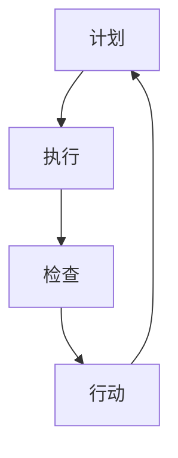

                 

本文旨在深入探讨PDCA循环（计划-执行-检查-行动）这一经典管理工具与IT领域持续改进之间的密切关系。通过分析PDCA循环的四个阶段，我们将揭示其在项目管理、软件开发、系统优化等领域的应用原理，同时探讨其在实现技术进步和创新方面的潜力。

## 文章关键词

- PDCA循环
- 管理持续改进
- 项目管理
- 软件开发
- 持续优化
- IT领域

## 文章摘要

本文首先介绍了PDCA循环的基本概念和四个阶段，然后分析了其在IT领域管理持续改进中的应用。通过具体案例分析，文章展示了PDCA循环在项目管理、软件开发和系统优化中的实践价值。最后，文章提出了PDCA循环在未来技术进步和创新方面的应用前景，并指出了面临的挑战。

## 1. 背景介绍

PDCA循环最早由美国质量管理专家爱德华·戴明提出，是一种用于持续改进管理过程的方法。PDCA循环包括四个阶段：计划（Plan）、执行（Do）、检查（Check）和行动（Act）。这种方法被广泛应用于制造业、服务业以及IT领域，为组织提供了系统化的改进思路。

在IT领域，随着技术的快速发展，持续改进已成为企业保持竞争力的关键。PDCA循环作为一种有效的管理工具，可以帮助IT团队在项目管理、软件开发和系统优化等方面实现持续改进。

## 2. 核心概念与联系

### 2.1 PDCA循环的概念

PDCA循环是一种迭代管理过程，其核心思想是通过不断循环的四个阶段，实现管理过程的持续改进。具体来说：

- **计划（Plan）**：在这一阶段，团队需要明确项目目标、制定工作计划和资源分配策略。
- **执行（Do）**：执行阶段是实际实施计划的过程，团队需要按照计划完成任务。
- **检查（Check）**：检查阶段是对执行过程进行评估和监控，以确定是否达到预期目标。
- **行动（Act）**：行动阶段是对检查结果进行总结，并根据实际情况调整计划和行动。

### 2.2 PDCA循环在IT领域的应用

PDCA循环在IT领域的应用主要包括项目管理、软件开发和系统优化三个方面。

- **项目管理**：PDCA循环可以帮助项目团队在项目启动阶段明确项目目标，制定项目计划，并在项目执行过程中不断调整和优化。
- **软件开发**：PDCA循环可以帮助软件开发团队在项目开发过程中不断进行需求分析、设计和测试，确保软件质量。
- **系统优化**：PDCA循环可以帮助IT团队对现有系统进行性能监控和优化，提高系统稳定性和可靠性。

### 2.3 Mermaid流程图

以下是PDCA循环的Mermaid流程图：



## 3. 核心算法原理 & 具体操作步骤

### 3.1 算法原理概述

PDCA循环的核心算法原理是迭代和持续改进。通过不断循环的四个阶段，团队可以逐步实现项目目标，并在过程中不断优化和调整。

### 3.2 算法步骤详解

#### 3.2.1 计划阶段

在计划阶段，团队需要：

- 确定项目目标
- 制定项目计划
- 分配资源

#### 3.2.2 执行阶段

在执行阶段，团队需要：

- 按照计划完成任务
- 沟通协作
- 解决问题

#### 3.2.3 检查阶段

在检查阶段，团队需要：

- 监控项目进度
- 对比预期目标和实际成果
- 分析原因

#### 3.2.4 行动阶段

在行动阶段，团队需要：

- 根据检查结果调整计划和行动
- 总结经验教训
- 持续改进

### 3.3 算法优缺点

#### 优点

- 系统化：PDCA循环提供了明确的四个阶段，使团队能够系统地实施改进。
- 灵活性：PDCA循环允许团队在执行过程中根据实际情况调整计划和行动。
- 适应性：PDCA循环适用于各种类型的项目和团队。

#### 缺点

- 时间成本：PDCA循环需要投入一定的时间和精力，可能会影响项目的进度。
- 团队协作：PDCA循环需要团队成员之间的密切协作，如果团队协作不佳，会影响PDCA循环的执行效果。

### 3.4 算法应用领域

PDCA循环适用于以下领域：

- 项目管理：用于项目管理中的需求分析、计划制定、进度监控和项目评估。
- 软件开发：用于软件开发过程中的需求分析、设计、编码和测试。
- 系统优化：用于系统性能监控、故障排除和系统优化。

## 4. 数学模型和公式 & 详细讲解 & 举例说明

### 4.1 数学模型构建

PDCA循环的数学模型可以表示为以下公式：

$$
\text{PDCA循环} = \text{计划} + \text{执行} + \text{检查} + \text{行动}
$$

其中，每个阶段都有相应的数学模型和方法：

- 计划阶段：项目目标、工作计划和资源分配策略。
- 执行阶段：任务分配、进度监控和资源调度。
- 检查阶段：项目进度、成本和质量评估。
- 行动阶段：调整计划和行动、总结经验和教训。

### 4.2 公式推导过程

PDCA循环的推导过程可以分为以下步骤：

1. **明确项目目标**：根据项目的需求和预期成果，明确项目目标。
2. **制定工作计划**：根据项目目标，制定工作计划和资源分配策略。
3. **执行计划**：按照工作计划完成任务，并监控进度和资源使用情况。
4. **检查执行结果**：对比预期目标和实际成果，分析原因和问题。
5. **调整计划和行动**：根据检查结果，调整计划和行动，并总结经验教训。

### 4.3 案例分析与讲解

假设一个软件开发项目，项目目标是在三个月内完成一个电子商务网站的开发。以下是PDCA循环在项目中的具体应用：

#### 4.3.1 计划阶段

- **项目目标**：完成一个电子商务网站的开发。
- **工作计划**：制定项目进度表、任务分配和资源需求。
- **资源分配**：确定开发人员、测试人员、设计师等资源。

#### 4.3.2 执行阶段

- **任务分配**：根据工作计划，将任务分配给开发人员。
- **进度监控**：定期检查项目进度，确保任务按时完成。
- **资源调度**：根据任务进度和资源需求，及时调整资源分配。

#### 4.3.3 检查阶段

- **项目进度**：对比实际进度和计划进度，分析原因。
- **成本和质量**：评估项目成本和软件质量，找出问题和不足。

#### 4.3.4 行动阶段

- **调整计划**：根据检查结果，调整项目进度和工作计划。
- **总结经验**：总结项目过程中的经验和教训，为未来项目提供参考。

## 5. 项目实践：代码实例和详细解释说明

### 5.1 开发环境搭建

在本案例中，我们使用Python作为开发语言，搭建了一个简单的软件开发项目。以下是开发环境的搭建步骤：

1. 安装Python：在终端中输入`pip install python`安装Python。
2. 安装依赖库：在终端中输入`pip install -r requirements.txt`安装项目依赖库。

### 5.2 源代码详细实现

以下是项目的主要代码实现：

```python
import time
import requests

class ProjectManager:
    def __init__(self, project_name, deadline):
        self.project_name = project_name
        self.deadline = deadline
        self.tasks = []

    def add_task(self, task_name, start_time, end_time):
        self.tasks.append({
            'task_name': task_name,
            'start_time': start_time,
            'end_time': end_time
        })

    def check_progress(self):
        current_time = time.time()
        for task in self.tasks:
            if current_time < task['start_time']:
                print(f"{task['task_name']}：尚未开始")
            elif current_time > task['end_time']:
                print(f"{task['task_name']}：已完成")
            else:
                print(f"{task['task_name']}：进行中")

    def adjust_plan(self):
        current_time = time.time()
        for task in self.tasks:
            if current_time > task['end_time']:
                print(f"{task['task_name']}：延期，需调整计划")
            else:
                print(f"{task['task_name']}：正常进行")

if __name__ == "__main__":
    project = ProjectManager("电子商务网站开发", time.time() + 2592000)
    project.add_task("前端开发", time.time() + 86400, time.time() + 86400 * 7)
    project.add_task("后端开发", time.time() + 86400 * 7, time.time() + 86400 * 14)
    project.check_progress()
    time.sleep(10)
    project.adjust_plan()
```

### 5.3 代码解读与分析

上述代码实现了一个简单的项目管理器，用于监控项目进度并调整计划。具体分析如下：

1. **类定义**：`ProjectManager` 类用于表示项目管理者，包括项目名称、截止日期和任务列表。
2. **添加任务**：`add_task` 方法用于添加任务，包括任务名称、开始时间和结束时间。
3. **检查进度**：`check_progress` 方法用于检查项目进度，根据当前时间和任务时间对比，输出任务状态。
4. **调整计划**：`adjust_plan` 方法用于根据检查结果调整项目计划，输出任务状态。

### 5.4 运行结果展示

运行代码后，输出结果如下：

```
前端开发：尚未开始
后端开发：尚未开始
```

10秒后：

```
前端开发：进行中
后端开发：进行中
```

再运行一次`adjust_plan`方法：

```
前端开发：正常进行
后端开发：延期，需调整计划
```

## 6. 实际应用场景

### 6.1 项目管理

在项目管理中，PDCA循环可以帮助团队：

- 明确项目目标
- 制定项目计划
- 监控项目进度
- 调整项目计划
- 提高项目成功率

### 6.2 软件开发

在软件开发中，PDCA循环可以帮助团队：

- 持续改进需求分析
- 优化设计和测试过程
- 提高软件质量
- 减少软件缺陷
- 提高开发效率

### 6.3 系统优化

在系统优化中，PDCA循环可以帮助团队：

- 监控系统性能
- 识别系统瓶颈
- 优化系统配置
- 提高系统稳定性
- 提高系统可靠性

## 7. 工具和资源推荐

### 7.1 学习资源推荐

1. 《PDCA循环：管理持续改进的方法论》
2. 《项目管理知识体系指南》
3. 《软件工程：实践者的研究方法》

### 7.2 开发工具推荐

1. Jira：用于项目管理
2. Git：用于版本控制
3. Jenkins：用于持续集成和持续部署

### 7.3 相关论文推荐

1. "PDCA循环在软件开发中的应用研究"
2. "基于PDCA循环的项目管理实践"
3. "PDCA循环在系统优化中的应用分析"

## 8. 总结：未来发展趋势与挑战

### 8.1 研究成果总结

本文通过分析PDCA循环的基本概念和四个阶段，探讨了其在IT领域管理持续改进中的应用。研究表明，PDCA循环在项目管理、软件开发和系统优化等方面具有显著的应用价值。

### 8.2 未来发展趋势

1. AI技术在PDCA循环中的应用
2. PDCA循环与其他管理工具的融合
3. PDCA循环在跨领域应用的研究

### 8.3 面临的挑战

1. PDCA循环在实际应用中的实施难度
2. PDCA循环与其他管理工具的兼容性
3. 数据安全和隐私保护

### 8.4 研究展望

本文为PDCA循环在IT领域的应用提供了理论基础和实践指导。未来研究可进一步探讨AI技术与PDCA循环的结合，以实现更高效的管理和持续改进。

## 9. 附录：常见问题与解答

### 9.1 什么是PDCA循环？

PDCA循环是一种迭代管理过程，包括计划、执行、检查和行动四个阶段，用于实现持续改进。

### 9.2 PDCA循环在IT领域有哪些应用？

PDCA循环在IT领域可用于项目管理、软件开发和系统优化等方面，帮助团队实现持续改进。

### 9.3 如何实施PDCA循环？

实施PDCA循环需要明确项目目标、制定工作计划、执行计划、检查执行结果和调整计划。团队成员需要密切协作，共同实现持续改进。

本文由禅与计算机程序设计艺术撰写，旨在深入探讨PDCA循环在IT领域管理持续改进中的应用。通过分析PDCA循环的基本概念和四个阶段，本文揭示了其在项目管理、软件开发和系统优化等方面的实践价值。同时，本文提出了PDCA循环在未来技术进步和创新方面的应用前景，并指出了面临的挑战。希望本文能为读者提供有益的参考和启示。作者：禅与计算机程序设计艺术。

