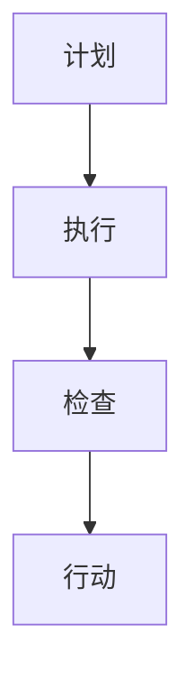

                 

关键词：PDCA循环、质量管理、持续改进、系统化思维、行动计划、执行与监控

> 摘要：本文将探讨PDCA戴明环，即计划（Plan）、执行（Do）、检查（Check）和行动（Act）循环，作为一种系统化思维方式在IT领域的应用。通过详细解析PDCA环的每个阶段，本文旨在帮助读者理解如何通过这一法宝实现行动的落地，提升项目管理和质量控制的效率。

## 1. 背景介绍

PDCA戴明环，也称为戴明循环，是由美国质量管理专家爱德华·戴明（W. Edwards Deming）提出的。它是一种用于持续改进和管理的工具，广泛用于各种领域，包括制造业、服务业和教育。PDCA循环的理念是，通过不断地计划、执行、检查和行动，组织可以逐步提升其效率和效果。

在IT领域，PDCA环同样具有重要的应用价值。IT项目通常涉及复杂的技术实现、多变的业务需求和较高的风险。通过PDCA循环，IT团队可以系统化地规划项目、实施改进措施，确保项目按时交付并满足质量要求。

## 2. 核心概念与联系

### 2.1. 计划（Plan）

在PDCA循环的第一个阶段，即计划阶段，团队需要明确项目的目标、范围、资源需求、时间表以及所需的技能和知识。这一阶段的工作可以分为以下几个步骤：

1. **目标设定**：明确项目的目标，使其具有明确、可衡量和可实现性。
2. **范围定义**：确定项目的范围，明确哪些工作包含在项目中，哪些不包含。
3. **资源规划**：识别项目所需的人力、物资、技术和资金等资源。
4. **时间表制定**：制定项目的时间表，确保项目能够按时完成。
5. **风险评估**：评估项目可能面临的风险，并制定相应的应对措施。

### 2.2. 执行（Do）

计划制定完毕后，进入执行阶段。在这个阶段，团队将按照计划执行各项工作，确保项目按部就班地进行。执行阶段的关键点包括：

1. **任务分解**：将项目任务分解为可管理的子任务。
2. **资源分配**：根据任务需求，合理分配资源。
3. **沟通与协作**：保持团队成员之间的有效沟通，确保工作顺利进行。
4. **质量监控**：对项目的质量进行实时监控，确保达到预期标准。

### 2.3. 检查（Check）

在执行阶段完成后，团队需要进入检查阶段，对项目的结果进行评估和审核。检查阶段的主要任务包括：

1. **结果评估**：根据项目目标和标准，评估项目的实际成果。
2. **偏差分析**：分析实际结果与预期目标之间的偏差，找出问题所在。
3. **质量审核**：对项目的工作过程和结果进行质量审核，确保符合质量要求。

### 2.4. 行动（Act）

在检查阶段结束后，团队将进入行动阶段，根据检查结果采取相应的措施。行动阶段的工作包括：

1. **纠正措施**：针对发现的问题，制定并实施纠正措施。
2. **持续改进**：总结经验教训，持续改进项目管理和执行过程。
3. **文档更新**：更新项目文档，记录改进措施和经验。

### 2.5. Mermaid 流程图



## 3. 核心算法原理 & 具体操作步骤

### 3.1. 算法原理概述

PDCA循环是一种迭代的、循环的管理方法，每个阶段都是相互关联的。计划阶段为执行阶段提供了明确的路线和目标，执行阶段通过实际工作验证计划的可行性，检查阶段对执行结果进行评估，行动阶段则根据检查结果进行改进。

### 3.2. 算法步骤详解

1. **计划阶段**：
   - 确定项目目标。
   - 定义项目范围。
   - 规划资源。
   - 制定时间表。
   - 评估风险。

2. **执行阶段**：
   - 分解任务。
   - 分配资源。
   - 确保沟通协作。
   - 监控质量。

3. **检查阶段**：
   - 评估结果。
   - 分析偏差。
   - 进行质量审核。

4. **行动阶段**：
   - 实施纠正措施。
   - 持续改进。
   - 更新文档。

### 3.3. 算法优缺点

**优点**：
- **系统性**：PDCA环提供了一个系统化的框架，使项目管理和改进过程更加有序。
- **灵活性**：通过迭代的方式，可以灵活地调整计划并应对变化。
- **有效性**：有助于提高项目的质量和效率。

**缺点**：
- **执行难度**：需要团队成员具有高度的自我管理能力和责任心。
- **时间成本**：每个循环阶段都需要投入一定的时间和精力。

### 3.4. 算法应用领域

PDCA环在IT领域有多种应用场景，包括：
- **软件开发**：用于项目规划和质量控制。
- **IT服务管理**：用于改进服务质量和响应速度。
- **IT项目管理**：用于提升项目执行效率和风险管理。

## 4. 数学模型和公式 & 详细讲解 & 举例说明

### 4.1. 数学模型构建

PDCA循环可以用以下数学模型表示：

$$
PDCA = \{P, D, C, A\}
$$

其中，$P$ 代表计划（Plan），$D$ 代表执行（Do），$C$ 代表检查（Check），$A$ 代表行动（Act）。

### 4.2. 公式推导过程

PDCA循环的推导过程基于以下原则：
- **迭代性**：每个阶段的结果都影响下一个阶段。
- **反馈机制**：通过检查和行动，不断调整和优化过程。

### 4.3. 案例分析与讲解

假设一个IT团队正在开发一款软件，使用PDCA环进行项目管理。以下是每个阶段的案例：

1. **计划阶段**：
   - 目标：开发一款满足用户需求的软件。
   - 范围：包括前端、后端和移动端。
   - 资源：2名前端开发人员、1名后端开发人员、1名测试人员。
   - 时间表：3个月。

2. **执行阶段**：
   - 前端开发：完成任务A、B、C。
   - 后端开发：完成任务D、E、F。
   - 测试：完成任务G、H、I。

3. **检查阶段**：
   - 结果评估：发现前端任务B存在一些性能问题。
   - 偏差分析：性能问题影响了用户体验。
   - 质量审核：需要优化前端代码。

4. **行动阶段**：
   - 实施纠正措施：对任务B进行优化。
   - 持续改进：总结经验，改进开发流程。
   - 文档更新：记录纠正措施和改进经验。

## 5. 项目实践：代码实例和详细解释说明

### 5.1. 开发环境搭建

为了实现一个基于PDCA环的项目管理工具，我们首先需要搭建开发环境。以下是所需步骤：

1. 安装Python 3.8及以上版本。
2. 安装Django框架。
3. 安装PostgreSQL数据库。

### 5.2. 源代码详细实现

以下是使用Django框架实现的PDCA环管理系统的部分代码：

```python
# models.py
from django.db import models

class Plan(models.Model):
    title = models.CharField(max_length=255)
    description = models.TextField()

class Do(models.Model):
    plan = models.ForeignKey(Plan, on_delete=models.CASCADE)
    task = models.CharField(max_length=255)
    status = models.CharField(max_length=50)

class Check(models.Model):
    do = models.ForeignKey(Do, on_delete=models.CASCADE)
    result = models.TextField()
    status = models.CharField(max_length=50)

class Act(models.Model):
    check = models.ForeignKey(Check, on_delete=models.CASCADE)
    correction = models.TextField()
    status = models.CharField(max_length=50)
```

### 5.3. 代码解读与分析

上述代码定义了四个模型：Plan（计划）、Do（执行）、Check（检查）和Act（行动）。每个模型都包含了相关的字段，如标题、描述、任务、结果等。

- **Plan** 模型用于存储项目的计划信息。
- **Do** 模型用于存储执行任务的信息。
- **Check** 模型用于存储检查结果的信息。
- **Act** 模型用于存储行动措施的信息。

通过这些模型，我们可以实现PDCA环的管理功能。

### 5.4. 运行结果展示

运行代码后，我们可以通过Django后台管理系统对PDCA环进行管理，包括创建计划、执行任务、检查结果和行动措施。

## 6. 实际应用场景

PDCA环在IT领域有广泛的应用场景，以下是一些具体实例：

- **软件开发**：用于项目规划和质量控制，确保项目按时交付并满足质量要求。
- **IT服务管理**：用于改进服务质量和响应速度，提高客户满意度。
- **IT项目管理**：用于提升项目执行效率和风险管理，降低项目风险。

## 7. 未来应用展望

随着技术的发展，PDCA环将在更多领域得到应用。未来，PDCA环有望与人工智能、大数据等新兴技术结合，进一步提升项目管理和质量控制的效果。

## 8. 总结：未来发展趋势与挑战

### 8.1. 研究成果总结

PDCA环作为一种系统化的管理工具，已在多个领域得到广泛应用。研究表明，PDCA环有助于提升项目的质量和效率，降低项目风险。

### 8.2. 未来发展趋势

未来，PDCA环将向更智能化、自动化方向发展。借助人工智能和大数据技术，PDCA环将能够更准确地预测项目风险，提供更高效的改进措施。

### 8.3. 面临的挑战

尽管PDCA环具有显著的优势，但在实际应用中仍面临一些挑战，如执行难度、时间成本等。

### 8.4. 研究展望

未来，研究应重点关注PDCA环与人工智能、大数据等新兴技术的融合，以实现更高效的项目管理和质量控制。

## 9. 附录：常见问题与解答

### 问题1：PDCA环是否适用于所有项目？

解答：PDCA环适用于多种类型的项目，但并非所有项目都适合。对于复杂、高风险的项目，PDCA环的效果更为显著。

### 问题2：PDCA环与项目管理方法有哪些区别？

解答：PDCA环是一种迭代的管理方法，强调持续改进和反馈。项目管理方法则更侧重于项目规划、执行和监控。

## 作者署名

作者：禅与计算机程序设计艺术 / Zen and the Art of Computer Programming
----------------------------------------------------------------
### 结语

通过本文，我们深入探讨了PDCA戴明环在IT领域的应用。从计划、执行、检查到行动，PDCA环为我们提供了一个系统化的思维方式和行动框架，有助于提升项目管理和质量控制的效率。希望本文能够帮助您更好地理解和应用PDCA环，实现项目的成功落地。在未来的项目中，不妨尝试运用PDCA环，相信您会收获意想不到的效果。再次感谢您的阅读，祝您在IT领域取得更加辉煌的成就！
----------------------------------------------------------------
### 附录：常见问题与解答

#### 问题1：PDCA环是否适用于所有项目？

PDCA环是一种通用管理工具，理论上适用于各种类型的项目，无论项目的规模大小或复杂程度。然而，对于不同类型的项目，PDCA环的应用方式可能会有所不同。例如，在简单的项目或日常工作中，PDCA环的某些阶段可能可以合并或简化。对于复杂的项目，特别是那些涉及高风险和高不确定性的项目，PDCA环能够提供更详细的指导和控制。

#### 问题2：PDCA环与项目管理方法有哪些区别？

PDCA环和项目管理方法（如PMBOK指南）都是用于指导和控制项目过程的方法论。主要区别在于：

- **目的**：PDCA环主要侧重于持续改进和问题解决，而项目管理方法更侧重于项目的整体规划和执行。
- **结构**：PDCA环是迭代的，每个循环包括四个阶段：计划、执行、检查和行动。项目管理方法通常包括更多阶段，如项目启动、规划、执行、监控和收尾。
- **应用范围**：PDCA环可以应用于项目生命周期中的各个阶段，也可以应用于日常工作和持续改进。项目管理方法通常更适用于完整的项目生命周期管理。

#### 问题3：如何确保PDCA环的有效实施？

确保PDCA环的有效实施需要以下几个关键要素：

- **领导支持**：高层管理者的支持是PDCA环成功实施的关键。
- **团队协作**：团队成员需要积极参与并承担责任。
- **持续培训**：定期对团队成员进行PDCA环的培训，确保他们理解和掌握相关技能。
- **反馈机制**：建立有效的反馈机制，及时收集和分析数据，以便在检查和行动阶段做出改进。
- **文件记录**：详细记录每个阶段的活动和结果，以便进行跟踪和持续改进。

#### 问题4：PDCA环与六西格玛（Six Sigma）有何关系？

PDCA环和六西格玛都是用于持续改进和质量管理的工具。六西格玛是一种基于统计学的改进方法，旨在通过减少过程中的变异性和缺陷来提高质量和效率。PDCA环是六西格玛实施中的一个关键组成部分，用于指导改进过程。在六西格玛中，PDCA环通常用于DMAIC（定义、测量、分析、改进、控制）方法的各个阶段，以确保持续改进的实施。

#### 问题5：如何将PDCA环与敏捷开发（Agile Development）结合使用？

PDCA环与敏捷开发方法有很多相似之处，都是基于迭代和反馈的持续改进原则。将PDCA环与敏捷开发结合使用，可以增强敏捷团队的持续改进能力。具体做法包括：

- 在敏捷冲刺（Sprint）的每个阶段应用PDCA环，确保在每个迭代周期内进行有效的计划、执行、检查和行动。
- 使用PDCA环来管理敏捷过程中的风险管理，确保及时发现和解决问题。
- 在迭代结束时，使用PDCA环的检查和行动阶段来评估迭代结果，并根据反馈进行改进。
- 在整个敏捷开发过程中，持续应用PDCA环，以推动整个项目的改进和优化。

通过结合PDCA环和敏捷开发，团队能够在快速变化的环境中实现更高的质量和效率。

