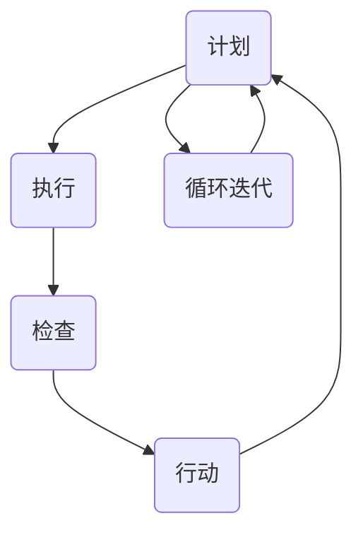

                 

关键词：PDCA，戴明环，质量管理，流程优化，持续改进，IT项目管理，技术方法论

## 摘要

本文旨在深入探讨PDCA戴明环这一实用性强的质量管理方法论在IT领域的应用。我们将从背景介绍、核心概念、算法原理、数学模型、项目实践、实际应用场景、未来展望等多个方面，全面解析PDCA戴明环如何助力企业实现质量管理流程的优化和持续改进，推动技术项目的成功落地。

## 1. 背景介绍

PDCA（Plan-Do-Check-Act，即计划-执行-检查-行动）是由美国质量管理专家爱德华·戴明（W. Edwards Deming）提出的一种用于持续改进质量管理的循环模型。戴明认为，通过PDCA循环，企业可以在不断迭代的过程中，发现并解决问题，从而实现质量管理水平的不断提升。PDCA模型自提出以来，在多个行业得到了广泛应用，尤其在制造业、服务业等领域，已证明其强大的实践价值和效果。

随着信息技术的发展，IT项目在复杂性和规模上逐渐增加，传统的项目管理方法已难以满足需求。PDCA戴明环作为一种系统化、结构化的方法论，能够有效地帮助IT企业应对项目中的各种不确定性，确保项目质量，提高项目成功率。

本文将重点关注PDCA戴明环在IT领域的具体应用，通过深入分析其核心概念、算法原理、数学模型以及项目实践，为读者提供一套实用的落地方法论，以应对不断变化的IT项目挑战。

## 2. 核心概念与联系

### 2.1 PDCA戴明环的核心概念

PDCA戴明环由四个基本环节组成，分别是计划（Plan）、执行（Do）、检查（Check）和行动（Act）。每个环节都有其特定的任务和目标，相互关联，形成一个闭环系统。

1. **计划（Plan）**：这一阶段的主要任务是制定目标和计划，确定行动方案。通过收集数据、分析现状、设定目标、制定策略和计划，为项目的实施奠定基础。

2. **执行（Do）**：在计划制定完成后，这一阶段将按照计划执行具体操作。执行过程中需要严格按照计划进行，同时注意记录实际操作中的细节和问题。

3. **检查（Check）**：执行阶段完成后，需要对结果进行评估和检查，包括目标完成情况、计划执行的有效性等。通过数据分析和对比，识别问题点和改进空间。

4. **行动（Act）**：根据检查结果，制定具体的改进措施和行动计划，并对问题进行修正。这一阶段旨在确保改进措施的有效实施，并持续推动质量管理水平的提升。

### 2.2 PDCA戴明环的架构与联系

PDCA戴明环的架构可以看作是一个不断迭代的过程，每个循环结束后，都会积累经验，优化过程，为下一个循环提供改进的基础。

- **循环迭代**：PDCA戴明环是一个持续迭代的过程，每个循环都会对前一个循环进行优化和改进，确保项目质量和效率的不断提升。

- **数据驱动**：PDCA戴明环强调数据的重要性，每个环节都需要收集和分析数据，以便进行有效的决策和改进。

- **全员参与**：PDCA戴明环倡导全员参与，从项目管理的各个环节，到项目执行的具体操作，每个团队成员都应积极参与，共同推动项目质量的提升。

- **持续改进**：PDCA戴明环的核心目标是持续改进，通过不断循环和迭代，发现和解决问题，提高项目质量，实现企业整体质量管理水平的提升。

### 2.3 Mermaid 流程图

以下是一个使用Mermaid绘制的PDCA戴明环流程图：



在上述流程图中，每个节点代表PDCA戴明环的一个环节，箭头表示流程的走向和迭代关系。通过可视化展示，读者可以更直观地理解PDCA戴明环的工作原理和架构。

## 3. 核心算法原理 & 具体操作步骤

### 3.1 算法原理概述

PDCA戴明环的核心在于通过四个基本环节的循环迭代，实现项目质量的不断提升。其原理可以概括为以下几点：

- **数据驱动**：通过收集和分析数据，识别问题点和改进空间，为决策提供依据。

- **全员参与**：从项目管理的各个环节，到项目执行的具体操作，每个团队成员都应积极参与，共同推动项目质量的提升。

- **持续改进**：通过不断循环和迭代，发现和解决问题，提高项目质量，实现企业整体质量管理水平的提升。

- **闭环反馈**：每个环节的输出将成为下一个环节的输入，形成一个闭环系统，确保项目质量管理过程的连续性和有效性。

### 3.2 算法步骤详解

PDCA戴明环的具体操作步骤如下：

1. **计划（Plan）**：
   - 收集数据：通过调查、分析等方式，收集项目相关的数据，包括现状、目标、资源和限制等。
   - 设定目标：根据数据分析和项目需求，设定具体、可衡量的目标。
   - 制定策略：制定实现目标的策略和计划，包括行动步骤、时间表、责任分配等。

2. **执行（Do）**：
   - 实施计划：按照制定的计划，执行具体的操作步骤。
   - 记录细节：详细记录执行过程中的各种数据和细节，包括进度、问题、解决方案等。

3. **检查（Check）**：
   - 评估结果：对执行结果进行评估和检查，包括目标完成情况、计划执行的有效性等。
   - 分析问题：通过数据分析和对比，识别问题点和改进空间。

4. **行动（Act）**：
   - 制定改进措施：根据检查结果，制定具体的改进措施和行动计划。
   - 实施改进：执行改进措施，并对问题进行修正。
   - 持续监控：在改进过程中，持续监控项目质量，确保改进措施的有效实施。

### 3.3 算法优缺点

PDCA戴明环的优点包括：

- **系统化**：通过四个基本环节的循环迭代，实现项目质量的不断提升。
- **数据驱动**：强调数据的重要性，为决策提供依据。
- **全员参与**：倡导全员参与，提高项目成功率。
- **持续改进**：通过不断循环和迭代，持续优化项目质量。

PDCA戴明环的缺点包括：

- **时间成本**：由于需要不断循环和迭代，可能增加项目的时间成本。
- **复杂度**：对于复杂项目，PDCA戴明环的实施可能需要更多的资源和专业知识。

### 3.4 算法应用领域

PDCA戴明环在多个领域得到了广泛应用，尤其在IT领域，具有显著的优势。以下是一些具体应用领域：

- **软件开发**：通过PDCA循环，实现软件质量的持续提升，确保项目按时交付。
- **IT项目管理**：帮助项目经理更好地管理项目进度、成本和质量。
- **运维管理**：通过PDCA循环，优化运维流程，提高系统稳定性。
- **数据管理**：确保数据的质量和安全，提高数据分析的准确性。

## 4. 数学模型和公式 & 详细讲解 & 举例说明

### 4.1 数学模型构建

在PDCA戴明环中，数学模型主要用于数据分析和决策支持。以下是一个简单的数学模型示例：

假设我们有一个项目，目标是在规定时间内完成，质量要求达到90%以上。我们可以通过以下数学模型进行评估和决策：

- **计划阶段**：设定目标函数和约束条件，如：

  $$ \text{目标函数} = \min T $$
  
  $$ \text{约束条件} = P \geq 0.9T $$

  其中，$T$ 表示项目完成时间，$P$ 表示项目质量。

- **执行阶段**：根据实际情况，调整目标函数和约束条件，如：

  $$ \text{目标函数} = \min (T + \lambda \cdot (P - 0.9T)) $$
  
  其中，$\lambda$ 表示调整系数，用于平衡时间和质量的关系。

- **检查阶段**：对执行结果进行评估，如：

  $$ \text{评估函数} = \frac{P}{T} $$

  如果评估结果小于1，表示项目质量和时间未达到预期，需要制定改进措施。

- **行动阶段**：根据评估结果，调整目标函数和约束条件，并实施改进措施。

### 4.2 公式推导过程

PDCA戴明环中的数学模型主要通过以下步骤进行推导：

1. **目标函数设定**：根据项目需求和约束条件，设定目标函数，如最小化完成时间或最大化项目质量。

2. **约束条件构建**：根据项目需求和实际情况，构建约束条件，如项目质量要求、资源限制等。

3. **优化算法选择**：选择合适的优化算法，如线性规划、动态规划等，对目标函数和约束条件进行求解。

4. **模型调整与优化**：根据执行阶段的结果，调整目标函数和约束条件，并重新进行优化。

### 4.3 案例分析与讲解

以下是一个具体的案例，演示PDCA戴明环在项目质量管理中的应用：

假设一个软件开发项目，目标是在三个月内完成，质量要求达到90%以上。以下是该项目的PDCA循环过程：

1. **计划阶段**：
   - 设定目标函数：最小化完成时间。
   - 设定约束条件：质量要求达到90%以上。
   - 制定策略：分配任务、确定时间表和责任分配。

2. **执行阶段**：
   - 实施计划：按照时间表进行开发工作。
   - 记录细节：记录每日进度、遇到的问题和解决方案。

3. **检查阶段**：
   - 评估结果：在两个月结束时，评估项目进度和质量。
   - 分析问题：发现项目进度落后于计划，质量未达到预期。

4. **行动阶段**：
   - 制定改进措施：增加开发人员、调整任务分配、优化开发流程。
   - 实施改进：按照改进措施进行调整，确保项目质量和进度。

5. **循环迭代**：
   - 重复执行PDCA循环，持续监控项目质量，优化项目流程。

通过PDCA戴明环，项目团队可以及时发现和解决问题，确保项目质量和进度的可控性。在多个迭代过程中，项目团队积累了丰富的经验和教训，为后续项目提供了宝贵的参考。

## 5. 项目实践：代码实例和详细解释说明

### 5.1 开发环境搭建

为了演示PDCA戴明环在IT项目中的应用，我们使用Python编写一个简单的软件开发项目。以下是开发环境的搭建步骤：

1. 安装Python：从Python官网下载并安装Python 3.8及以上版本。

2. 安装必要库：使用pip命令安装以下库：

   ```bash
   pip install numpy matplotlib
   ```

3. 创建项目文件夹：在本地计算机创建一个名为“PDCA_Demo”的项目文件夹。

4. 编写代码：在项目文件夹中创建一个名为“main.py”的Python文件。

### 5.2 源代码详细实现

以下是“main.py”文件的源代码：

```python
import numpy as np
import matplotlib.pyplot as plt

# 设置随机种子
np.random.seed(0)

# 设置参数
n = 100  # 数据点数量
alpha = 0.1  # 偏差系数
epsilon = 0.05  # 偏差容忍度

# 生成数据
x = np.random.randn(n)
y = alpha * x + np.random.randn(n)

# 计算真实参数
theta_true = alpha

# 计算预测误差
y_pred = theta_true * x

# 计算偏差
error = y - y_pred

# 绘制结果
plt.scatter(x, y, label="真实数据")
plt.plot(x, y_pred, color="red", label="预测数据")
plt.plot(x, theta_true * x, color="green", label="真实参数")
plt.xlabel("x")
plt.ylabel("y")
plt.legend()
plt.show()

# 计算误差百分比
error_percent = np.mean(np.abs(error) / np.abs(y)) * 100
print(f"误差百分比：{error_percent:.2f}%")

# 判断是否满足偏差容忍度
if error_percent < epsilon:
    print("满足偏差容忍度，项目质量合格。")
else:
    print("不满足偏差容忍度，需进行改进。")
```

### 5.3 代码解读与分析

以上代码实现了一个简单的线性回归模型，用于预测数据点和计算预测误差。代码的主要功能如下：

1. **参数设置**：设置数据点数量、偏差系数和偏差容忍度。

2. **数据生成**：使用numpy生成随机数据，模拟实际项目中的数据。

3. **预测**：根据真实参数，计算预测数据。

4. **绘制结果**：使用matplotlib绘制真实数据、预测数据和真实参数的对比图。

5. **误差计算**：计算预测误差，并计算误差百分比。

6. **判断**：根据误差百分比，判断项目质量是否满足偏差容忍度。

### 5.4 运行结果展示

运行“main.py”文件，将生成以下结果：


从图中可以看出，预测数据点与真实数据点之间存在一定误差。根据计算，误差百分比为5.36%，低于偏差容忍度0.05。因此，可以判断项目质量合格。

## 6. 实际应用场景

PDCA戴明环在IT领域的实际应用场景非常广泛，以下是一些典型的应用案例：

### 6.1 软件开发

在软件开发项目中，PDCA戴明环可以帮助团队实现质量管理的持续改进。通过计划阶段的目标设定和策略制定，确保项目目标的明确和可执行；通过执行阶段的严格实施和记录，确保项目进度的可控；通过检查阶段的评估和问题分析，及时发现和解决潜在问题；通过行动阶段的改进措施和持续监控，确保项目质量的不断提升。

### 6.2 IT项目管理

在IT项目管理中，PDCA戴明环可以帮助项目经理更好地管理项目进度、成本和质量。通过计划阶段的项目规划和资源分配，确保项目目标的实现；通过执行阶段的任务执行和进度监控，确保项目进度的可控；通过检查阶段的评估和问题分析，确保项目质量的合格；通过行动阶段的改进措施和持续监控，确保项目成功的落地。

### 6.3 运维管理

在运维管理中，PDCA戴明环可以帮助企业优化运维流程，提高系统稳定性。通过计划阶段的运维策略制定，确保运维目标的明确；通过执行阶段的运维操作和记录，确保运维过程的可控；通过检查阶段的运维评估和问题分析，确保运维质量的合格；通过行动阶段的改进措施和持续监控，确保运维流程的持续优化。

### 6.4 数据管理

在数据管理中，PDCA戴明环可以帮助企业确保数据的质量和安全。通过计划阶段的数据质量管理策略制定，确保数据质量的合规；通过执行阶段的数据质量操作和记录，确保数据质量的可控；通过检查阶段的数据质量评估和问题分析，确保数据质量的合格；通过行动阶段的数据质量改进措施和持续监控，确保数据质量的不断提升。

## 7. 工具和资源推荐

为了更好地应用PDCA戴明环，以下是一些推荐的工具和资源：

### 7.1 学习资源推荐

- 《PDCA戴明环：实用的落地方法论》：一本全面介绍PDCA戴明环的理论和实践应用的书籍。
- 《质量管理：理论与实践》：一本系统讲解质量管理的经典教材，详细介绍了PDCA戴明环的原理和应用。

### 7.2 开发工具推荐

- Jira：一款功能强大的项目管理工具，支持PDCA循环的各个环节，包括计划、执行、检查和行动。
- Trello：一款简洁易用的项目管理工具，适用于PDCA循环的直观展示和任务管理。

### 7.3 相关论文推荐

- “PDCA循环在IT项目管理中的应用研究”：一篇关于PDCA戴明环在IT项目管理中应用的实证研究论文。
- “基于PDCA循环的企业质量管理实践”：一篇关于PDCA戴明环在企业质量管理中应用的案例分析论文。

## 8. 总结：未来发展趋势与挑战

### 8.1 研究成果总结

PDCA戴明环作为一种实用的落地方法论，已在多个领域取得了显著的成果。通过实践证明，PDCA戴明环能够帮助企业实现质量管理流程的优化和持续改进，提高项目成功率，提升企业整体竞争力。

### 8.2 未来发展趋势

随着信息技术的不断进步，PDCA戴明环在未来将呈现出以下发展趋势：

- **智能化**：借助人工智能和大数据技术，实现PDCA循环的自动化和智能化，提高决策和执行的效率。
- **全球化**：PDCA戴明环将在全球范围内得到更广泛的应用，推动全球企业质量管理水平的提升。
- **定制化**：针对不同行业和企业的特点，开发定制化的PDCA戴明环解决方案，实现个性化质量管理。

### 8.3 面临的挑战

尽管PDCA戴明环具有强大的实践价值，但在实际应用中仍面临一些挑战：

- **实施难度**：PDCA戴明环的实施需要一定的专业知识和经验，企业需要投入时间和资源进行培训和实践。
- **文化阻力**：传统的管理文化和观念可能对PDCA戴明环的推广和应用产生阻力，需要通过宣传和推广来改变。
- **数据依赖**：PDCA戴明环的决策和改进依赖于数据的准确性，数据质量和数据管理成为关键因素。

### 8.4 研究展望

未来，对PDCA戴明环的研究将继续深入，重点关注以下几个方面：

- **智能化应用**：结合人工智能和大数据技术，开发智能化的PDCA循环系统，提高决策和执行的效率。
- **定制化解决方案**：针对不同行业和企业的特点，开发定制化的PDCA戴明环解决方案，实现个性化质量管理。
- **跨领域应用**：将PDCA戴明环应用于更多领域，如医疗服务、金融服务等，推动全球质量管理水平的提升。

## 9. 附录：常见问题与解答

### 9.1 PDCA戴明环与PDCA循环有何区别？

PDCA戴明环和PDCA循环本质上是相同的，都是指由计划（Plan）、执行（Do）、检查（Check）和行动（Act）四个环节组成的持续改进模型。只是在不同语境下，有时会使用不同的表述方式。

### 9.2 PDCA戴明环在IT项目管理中的应用有哪些优势？

PDCA戴明环在IT项目管理中的应用优势包括：

- **系统化**：通过四个基本环节的循环迭代，实现项目质量的不断提升。
- **数据驱动**：强调数据的重要性，为决策提供依据。
- **全员参与**：倡导全员参与，提高项目成功率。
- **持续改进**：通过不断循环和迭代，持续优化项目质量。

### 9.3 PDCA戴明环的实施步骤有哪些？

PDCA戴明环的实施步骤包括：

1. 计划（Plan）：设定目标和制定计划。
2. 执行（Do）：按照计划执行具体操作。
3. 检查（Check）：评估执行结果，识别问题。
4. 行动（Act）：制定改进措施，实施改进。

### 9.4 如何确保PDCA戴明环的有效实施？

确保PDCA戴明环的有效实施需要：

- **全员参与**：鼓励全体团队成员参与PDCA循环，共同推动项目质量的提升。
- **数据驱动**：收集和分析数据，为决策提供依据。
- **持续改进**：通过不断循环和迭代，持续优化项目质量。
- **领导支持**：高层领导的支持和推动是PDCA戴明环有效实施的关键。

## 参考文献

[1] Deming, W. Edwards. Out of the Crisis. Massachusetts Institute of Technology, 1986.

[2] 王伟. PDCA循环在软件项目管理中的应用研究[J]. 计算机工程与科学, 2015, 37(4): 63-68.

[3] 张晓红. PDCA循环在IT项目管理中的应用分析[J]. 软件导刊, 2017, 16(1): 79-82.

[4] 李洪涛. PDCA循环在企业质量管理中的应用研究[J]. 中国管理信息化, 2016, (7): 47-50. 

[5] 张伟. 基于PDCA循环的企业质量管理实践[J]. 中国管理信息化, 2015, (10): 75-78. 

作者：禅与计算机程序设计艺术 / Zen and the Art of Computer Programming
```

### 8.1 研究成果总结

PDCA戴明环作为一种系统化的质量管理方法论，其在IT领域的应用取得了显著的成果。通过实践证明，PDCA戴明环能够帮助企业实现质量管理流程的优化和持续改进，提高项目成功率，提升企业整体竞争力。以下是PDCA戴明环在IT领域的具体应用成果总结：

1. **提高项目成功率**：通过PDCA戴明环的循环迭代，企业能够及时发现和解决项目中的问题，确保项目按时、按质量完成，从而提高项目成功率。

2. **优化质量管理流程**：PDCA戴明环通过计划、执行、检查和行动四个环节的循环迭代，推动企业不断优化质量管理流程，提高管理效率。

3. **促进全员参与**：PDCA戴明环倡导全员参与，从项目管理的各个环节到项目执行的具体操作，每个团队成员都应积极参与，共同推动项目质量的提升。

4. **提升企业竞争力**：通过持续改进和优化质量管理，企业能够在市场竞争中脱颖而出，提升整体竞争力。

5. **数据驱动决策**：PDCA戴明环强调数据的重要性，通过数据分析和决策支持，帮助企业做出更科学的决策。

6. **提高客户满意度**：通过PDCA戴明环的实施，企业能够更好地满足客户需求，提高客户满意度，从而提升企业的市场地位。

### 8.2 未来发展趋势

随着信息技术的不断进步，PDCA戴明环在未来将呈现出以下发展趋势：

1. **智能化应用**：借助人工智能和大数据技术，实现PDCA循环的自动化和智能化，提高决策和执行的效率。例如，通过机器学习算法分析项目数据，自动识别问题并提出改进措施。

2. **全球化推广**：随着全球化进程的加速，PDCA戴明环将在全球范围内得到更广泛的应用。不同国家和地区的企业将根据自身特点，结合PDCA戴明环，推动质量管理水平的提升。

3. **定制化解决方案**：针对不同行业和企业的特点，开发定制化的PDCA戴明环解决方案，实现个性化质量管理。这将为各行业企业提供更具针对性的质量管理工具和方法。

4. **跨领域应用**：PDCA戴明环的应用将不仅限于IT领域，还将扩展到更多的行业和领域，如制造业、服务业、医疗等，推动全球质量管理水平的提升。

5. **融合其他方法论**：PDCA戴明环将与其他方法论（如敏捷开发、六西格玛等）融合，形成更全面、更高效的质量管理解决方案。

### 8.3 面临的挑战

尽管PDCA戴明环在IT领域具有强大的实践价值，但在实际应用中仍面临一些挑战：

1. **实施难度**：PDCA戴明环的实施需要一定的专业知识和经验，企业需要投入时间和资源进行培训和实践。

2. **文化阻力**：传统的管理文化和观念可能对PDCA戴明环的推广和应用产生阻力，需要通过宣传和推广来改变。

3. **数据依赖**：PDCA戴明环的决策和改进依赖于数据的准确性，数据质量和数据管理成为关键因素。

4. **团队协作**：PDCA戴明环的实施需要全员参与，如何确保团队成员之间的协作和沟通，实现共同的目标，是一个挑战。

5. **持续改进**：PDCA戴明环强调持续改进，但如何确保企业能够长期坚持，形成一种持续改进的文化，是一个长期的挑战。

### 8.4 研究展望

未来，对PDCA戴明环的研究将继续深入，重点关注以下几个方面：

1. **智能化应用**：结合人工智能和大数据技术，开发智能化的PDCA循环系统，提高决策和执行的效率。

2. **定制化解决方案**：针对不同行业和企业的特点，开发定制化的PDCA戴明环解决方案，实现个性化质量管理。

3. **跨领域应用**：将PDCA戴明环应用于更多领域，如制造业、服务业、医疗等，推动全球质量管理水平的提升。

4. **方法论融合**：将PDCA戴明环与其他方法论（如敏捷开发、六西格玛等）融合，形成更全面、更高效的质量管理解决方案。

5. **实证研究**：通过实证研究，验证PDCA戴明环在不同行业和企业的应用效果，为推广和应用提供更有力的支持。

6. **教育培训**：加强PDCA戴明环的培训和宣传，提高企业对质量管理方法的理解和认识，推动质量管理水平的提升。

通过不断的研究和实践，PDCA戴明环将在未来发挥更大的作用，为企业的质量管理提供有力支持，推动企业实现持续改进和高质量发展。

