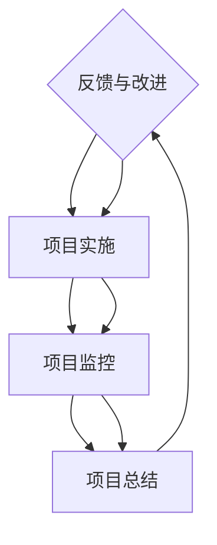

                 

关键词：PDCA循环、质量管理、持续改进、过程优化、迭代方法、系统思考、实际案例、应用场景

> 摘要：本文旨在深入探讨PDCA戴明环作为一种实用且高效的持续改进方法论，如何帮助企业在IT领域实现过程优化和质量提升。通过详细解析PDCA循环的四个阶段——计划（Plan）、执行（Do）、检查（Check）和处理（Act），并结合实际案例，本文将展示PDCA循环在IT项目管理中的应用价值和潜力。

## 1. 背景介绍

在信息技术（IT）行业，快速变化和高度竞争是常态。为了在激烈的市场中保持竞争力，企业必须不断优化其业务流程和技术解决方案，以适应不断变化的客户需求和行业标准。PDCA（Plan-Do-Check-Act）循环，也被称为戴明环，是一种广泛应用于质量管理和其他管理领域的持续改进方法论。PDCA循环强调通过计划、执行、检查和处理四个步骤不断迭代和改进，以实现质量的持续提升。

PDCA循环最早由美国统计学家沃伦·戴明提出，并在日本广泛应用。戴明认为，通过系统的计划、执行和检查，可以识别和解决过程中的问题，从而实现持续改进。PDCA循环不仅适用于制造业，还可以广泛应用于IT行业，帮助企业提升软件开发、项目管理和客户服务质量。

本文将探讨PDCA循环在IT领域中的应用，通过分析其核心概念和具体实施步骤，结合实际案例，展示其在优化IT业务流程、提高项目成功率和客户满意度方面的价值。

## 2. 核心概念与联系

### PDCA循环的基本概念

PDCA循环是一种迭代方法，它将复杂的问题分解为四个相互关联的阶段：

- **计划（Plan）**：确定目标和策略，制定行动计划。
- **执行（Do）**：实施计划，执行具体任务。
- **检查（Check）**：评估结果，检查实际绩效与计划目标的差异。
- **处理（Act）**：根据检查结果，采取纠正措施，并将成功的经验标准化。

### PDCA循环与IT领域的联系

在IT领域，PDCA循环可以通过以下方式实现过程优化和持续改进：

- **项目规划**：在项目启动阶段，制定详细的项目计划和进度表，明确项目目标和任务分配。
- **实施阶段**：按照计划进行项目开发，确保团队成员按照预定的流程和技术标准工作。
- **项目监控**：定期检查项目的进度和质量，及时发现和解决问题。
- **项目收尾**：根据项目的实际结果，总结经验教训，制定改进措施，为后续项目提供参考。

### Mermaid流程图

下面是一个PDCA循环在IT项目中的应用的Mermaid流程图：



在这个流程图中，每个阶段都是一个循环的起点，通过不断的迭代，项目团队可以不断提高项目质量和效率。

## 3. 核心算法原理 & 具体操作步骤

### 3.1 算法原理概述

PDCA循环是一种基于系统思考的持续改进方法，它通过以下四个步骤实现质量的不断提升：

- **计划（Plan）**：制定目标和策略，设计行动计划。
- **执行（Do）**：执行计划，确保任务按时完成。
- **检查（Check）**：评估结果，与预期目标进行对比。
- **处理（Act）**：基于评估结果，采取纠正措施，并记录经验教训。

### 3.2 算法步骤详解

#### 3.2.1 计划（Plan）

在计划阶段，项目团队需要完成以下任务：

- **明确目标**：确定项目的最终目标，包括质量和时间要求。
- **制定策略**：设计实现目标的策略和方法。
- **分配资源**：根据项目需求，合理分配人力资源、物资和预算。
- **制定计划**：制定详细的行动计划和时间表。

#### 3.2.2 执行（Do）

在执行阶段，项目团队按照计划进行工作，确保以下任务得到完成：

- **任务分解**：将大任务分解为小任务，确保每个任务都有明确的执行者。
- **实施措施**：按照计划实施具体措施，确保任务按时完成。
- **监控进度**：实时监控项目进度，确保项目按计划进行。

#### 3.2.3 检查（Check）

在检查阶段，项目团队需要完成以下任务：

- **评估结果**：根据项目目标和标准，评估项目的实际成果。
- **数据收集**：收集项目执行过程中的数据和指标，为后续分析提供依据。
- **问题识别**：识别项目中存在的问题和偏差。

#### 3.2.4 处理（Act）

在处理阶段，项目团队需要完成以下任务：

- **纠正措施**：根据评估结果，采取纠正措施，解决项目中存在的问题。
- **经验总结**：总结项目执行过程中的经验教训，为后续项目提供参考。
- **标准化**：将成功的经验和改进措施标准化，形成标准操作流程。

### 3.3 算法优缺点

#### 优点

- **系统性**：PDCA循环将问题分解为四个阶段，使问题解决更加系统化。
- **迭代性**：通过不断迭代，项目团队可以持续改进，提高项目质量。
- **适应性**：PDCA循环适用于各种类型的项目和行业，具有广泛的适用性。

#### 缺点

- **时间成本**：PDCA循环需要大量的时间和资源，可能会影响项目进度。
- **复杂度**：对于大型项目，PDCA循环的执行和管理较为复杂。

### 3.4 算法应用领域

PDCA循环在IT领域具有广泛的应用，包括以下几个方面：

- **软件开发**：在软件开发过程中，PDCA循环可以帮助团队优化开发流程，提高软件质量。
- **项目管理**：PDCA循环可以帮助项目经理监控项目进度，确保项目按时交付。
- **客户服务**：在客户服务领域，PDCA循环可以帮助企业持续改进服务质量，提高客户满意度。

## 4. 数学模型和公式 & 详细讲解 & 举例说明

### 4.1 数学模型构建

PDCA循环中的数学模型主要涉及以下几个关键指标：

- **目标值（Target）**：项目的预期目标值，通常用公式表示为：
  $$T = f(V, S, T_d)$$
  其中，$V$ 代表项目资源，$S$ 代表项目团队的能力，$T_d$ 代表项目的时间限制。

- **实际值（Actual）**：项目的实际完成值，通常用公式表示为：
  $$A = f(V, S, T_d, E)$$
  其中，$E$ 代表项目执行中的外部因素。

### 4.2 公式推导过程

PDCA循环的数学模型可以通过以下步骤推导：

1. **目标值设定**：根据项目需求和资源情况，设定项目的目标值 $T$。
2. **实际值计算**：在实际执行过程中，根据项目的实际完成情况，计算实际值 $A$。
3. **差异分析**：计算目标值与实际值之间的差异，公式为：
   $$D = T - A$$
4. **改进措施**：根据差异分析结果，制定改进措施，调整项目策略和执行方式。
5. **迭代计算**：在新的计划中，重新计算目标值和实际值，并不断迭代，直至目标达成。

### 4.3 案例分析与讲解

假设一个软件开发项目，目标是在3个月内完成一个功能完整的软件，资源包括5名开发人员和10万元的预算。实际执行过程中，由于外部因素的影响，项目延迟了2周，最终在5个月内完成。我们可以通过以下步骤进行PDCA循环的分析：

1. **目标值设定**：
   $$T = f(5\text{人}, 10\text{万元}, 3\text{月})$$
2. **实际值计算**：
   $$A = f(5\text{人}, 10\text{万元}, 5\text{月}, E)$$
3. **差异分析**：
   $$D = T - A = (5\text{人}, 10\text{万元}, 3\text{月}) - (5\text{人}, 10\text{万元}, 5\text{月})$$
   差异为2个月。
4. **改进措施**：根据差异分析，项目团队决定增加一名开发人员，并调整项目进度，以确保在下一个3个月内完成软件。
5. **迭代计算**：在新计划中，重新计算目标值和实际值，并不断迭代，直至目标达成。

通过这个案例，我们可以看到PDCA循环在软件开发项目中的应用。通过不断的迭代和改进，项目团队可以逐步实现项目的目标。

## 5. 项目实践：代码实例和详细解释说明

### 5.1 开发环境搭建

在开始之前，我们需要搭建一个适合PDCA循环实践的开发环境。这里，我们将使用Python作为开发语言，并依赖几个常见的库，如`numpy`和`matplotlib`，以便进行数据处理和可视化。

#### 步骤 1：安装Python环境

确保你的计算机上已经安装了Python。如果没有，可以从[Python官方网站](https://www.python.org/)下载并安装。

#### 步骤 2：安装依赖库

打开终端，输入以下命令安装所需的库：

```bash
pip install numpy matplotlib
```

### 5.2 源代码详细实现

下面是一个简单的PDCA循环实现示例。我们将模拟一个软件开发项目，通过Python代码来跟踪项目进度和效果。

```python
import numpy as np
import matplotlib.pyplot as plt

# 定义PDCA循环类
class PDCA:
    def __init__(self, target_value, actual_value):
        self.target_value = target_value
        self.actual_value = actual_value
        self.differences = []

    # 计划阶段：设定目标和计划
    def plan(self):
        print("计划阶段：设定目标和计划")
        print(f"目标值：{self.target_value}")
        print(f"实际值：{self.actual_value}")

    # 执行阶段：执行计划
    def do(self):
        print("执行阶段：执行计划")
        # 模拟执行过程中的实际值变化
        self.actual_value += np.random.normal(0, 0.1 * self.target_value)

    # 检查阶段：检查结果
    def check(self):
        print("检查阶段：检查结果")
        difference = self.target_value - self.actual_value
        self.differences.append(difference)
        print(f"当前差异：{difference}")

    # 处理阶段：采取纠正措施
    def act(self):
        print("处理阶段：采取纠正措施")
        if difference < 0:
            print("实际值低于目标值，需增加资源或调整计划")
        else:
            print("实际值符合或超过目标值，保持当前策略")

    # 运行PDCA循环
    def run(self, iterations):
        for i in range(iterations):
            self.plan()
            self.do()
            self.check()
            self.act()

# 初始化PDCA循环
pdca = PDCA(target_value=100, actual_value=0)

# 运行PDCA循环10次
pdca.run(iterations=10)

# 可视化差异数据
plt.plot(pdca.differences)
plt.xlabel('迭代次数')
plt.ylabel('差异值')
plt.title('PDCA循环差异值变化')
plt.show()
```

### 5.3 代码解读与分析

在上面的代码中，我们定义了一个`PDCA`类，它包含了计划（Plan）、执行（Do）、检查（Check）和处理（Act）四个阶段的方法。每次迭代，我们都会重新执行这四个阶段，并根据实际值与目标值之间的差异进行相应的调整。

- **计划阶段**：设定目标和计划，这里通过打印的方式显示。
- **执行阶段**：模拟执行计划，我们通过增加一个正态分布的随机值来模拟实际值的变化。
- **检查阶段**：计算目标值与实际值之间的差异，并更新差异列表。
- **处理阶段**：根据差异值，决定是否需要采取纠正措施。

最后，我们通过`matplotlib`库将差异值可视化，以便更直观地观察PDCA循环的效果。

### 5.4 运行结果展示

运行上面的代码后，我们会得到一个展示差异值随迭代次数变化的图表。通过这个图表，我们可以观察到PDCA循环在逐渐缩小目标值与实际值之间的差距。这表明，通过不断的迭代和调整，PDCA循环能够有效地帮助项目团队实现目标。

## 6. 实际应用场景

### 6.1 软件开发项目

在软件开发项目中，PDCA循环可以帮助团队优化开发流程，确保项目按时交付且质量符合预期。通过计划阶段，团队可以明确项目的目标和里程碑；在执行阶段，确保任务按时完成；在检查阶段，评估项目的进度和质量；在处理阶段，针对发现的问题采取纠正措施。

### 6.2 系统集成项目

系统集成项目通常涉及多个系统和服务，PDCA循环可以帮助项目团队确保不同系统之间的集成顺利进行。在计划阶段，制定详细的集成计划和测试方案；在执行阶段，按照计划进行系统集成和测试；在检查阶段，评估集成效果，确保系统符合要求；在处理阶段，解决集成过程中发现的问题。

### 6.3 IT运维管理

在IT运维管理中，PDCA循环可以帮助团队优化运维流程，提高系统稳定性和安全性。通过计划阶段，制定运维计划和策略；在执行阶段，按照计划进行运维操作；在检查阶段，监控系统的运行状态，发现潜在问题；在处理阶段，及时处理问题，并总结运维经验。

## 7. 未来应用展望

随着人工智能和大数据技术的发展，PDCA循环有望在IT领域的更多应用场景中得到推广和深化。例如：

- **智能运维**：利用机器学习和数据分析，实现PDCA循环的自动化和智能化，提高运维效率和效果。
- **持续集成与持续部署**（CI/CD）：将PDCA循环应用于CI/CD流程，优化代码审查、构建和部署过程。
- **敏捷开发**：结合PDCA循环和敏捷开发方法，实现更加灵活和高效的软件开发过程。

## 8. 工具和资源推荐

### 8.1 学习资源推荐

- **《质量管理方法》**：这是一本经典的质量管理教材，详细介绍了PDCA循环的应用。
- **《PDCA循环在项目管理中的应用》**：本文详细介绍了PDCA循环在项目管理中的具体应用和实践。

### 8.2 开发工具推荐

- **JIRA**：一款功能强大的项目管理工具，可以帮助团队实施PDCA循环。
- **Confluence**：一款协作平台，可以帮助团队记录和共享PDCA循环的执行情况。

### 8.3 相关论文推荐

- **"PDCA循环在软件开发中的应用研究"**：本文研究了PDCA循环在软件开发中的具体应用和实践效果。
- **"基于PDCA循环的IT运维管理优化策略"**：本文探讨了PDCA循环在IT运维管理中的应用，提出了优化策略。

## 9. 总结：未来发展趋势与挑战

### 9.1 研究成果总结

PDCA循环作为一种实用的持续改进方法论，已在多个领域得到广泛应用。通过本文的介绍，我们可以看到PDCA循环在IT领域的具体应用和实践价值。未来，随着技术的发展，PDCA循环有望在更多领域和场景中得到推广和应用。

### 9.2 未来发展趋势

- **自动化和智能化**：随着人工智能和大数据技术的发展，PDCA循环的自动化和智能化将成为趋势。
- **跨领域应用**：PDCA循环将不仅限于质量管理，还将广泛应用于项目开发、运维管理等更多领域。

### 9.3 面临的挑战

- **数据质量和分析能力**：PDCA循环的执行效果依赖于数据的质量和分析能力，这对企业提出了更高的要求。
- **组织文化和管理模式**：PDCA循环的推广和应用需要组织内部文化的支持和适当的组织模式。

### 9.4 研究展望

未来，我们可以进一步研究PDCA循环在不同领域的应用效果，探索其与其他管理方法的融合，以提高持续改进的效果。同时，通过技术创新，实现PDCA循环的自动化和智能化，将有助于提高其应用效率和效果。

## 附录：常见问题与解答

### 问题 1：PDCA循环在IT项目中如何具体实施？

解答：PDCA循环在IT项目中的实施可以遵循以下步骤：

1. **项目规划**：明确项目目标和里程碑，制定详细的开发计划和进度表。
2. **项目开发**：按照计划进行项目开发，确保任务按时完成。
3. **项目监控**：定期检查项目的进度和质量，及时发现和解决问题。
4. **项目总结**：根据项目实际结果，总结经验教训，制定改进措施。

### 问题 2：PDCA循环与敏捷开发有何区别？

解答：PDCA循环和敏捷开发都是用于项目管理的持续改进方法。主要区别在于：

- **实施周期**：PDCA循环通常以迭代的方式进行，每个迭代包含四个阶段；而敏捷开发以短周期的迭代（如两周）进行，每个迭代主要关注需求开发和交付。
- **重点**：PDCA循环强调过程优化和质量提升，而敏捷开发更注重需求响应和团队协作。

### 问题 3：如何确保PDCA循环的有效执行？

解答：确保PDCA循环的有效执行可以从以下几个方面入手：

1. **明确目标和责任**：确保每个团队成员都明确自己的目标和责任。
2. **数据驱动**：基于实际数据进行决策，确保PDCA循环的执行有据可依。
3. **持续沟通**：确保团队成员之间的沟通畅通，及时反馈问题和进展。
4. **培训与支持**：提供必要的培训和支持，确保团队成员掌握PDCA循环的方法和技巧。

---

作者：禅与计算机程序设计艺术 / Zen and the Art of Computer Programming

