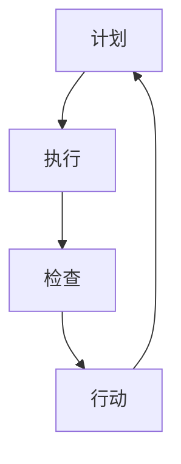

                 

关键词：PDCA、持续改进、流程优化、质量提升、案例分析、IT行业

## 摘要

本文旨在探讨PDCA（计划、执行、检查、行动）模型在IT行业的落地应用，通过分析核心概念、算法原理、数学模型、项目实践和未来展望，帮助读者深入理解PDCA在持续改进中的重要性，掌握其实际操作方法和技巧。文章结构清晰，内容丰富，适合广大IT从业者、项目经理和质量管理爱好者阅读。

## 1. 背景介绍

在IT行业，项目复杂性不断增加，市场竞争日趋激烈，质量要求日益提高。为了适应这种环境，持续改进成为了企业生存和发展的关键。PDCA模型作为一种经典的质量管理工具，被广泛应用于各个领域，特别是在IT行业中。它通过循环迭代的方式，帮助组织不断优化流程、提升质量和效率。

### 1.1 PDCA模型的起源和发展

PDCA模型最早由美国质量管理专家戴明博士提出，称为“戴明循环”。后来，日本学者石川馨将其引入到日本企业中，并加以改进，逐渐形成了PDCA模型。PDCA模型包括四个阶段：计划（Plan）、执行（Do）、检查（Check）和行动（Act）。每个阶段都有明确的任务和目标，通过不断循环迭代，实现持续改进。

### 1.2 PDCA模型在IT行业的应用

PDCA模型在IT行业具有广泛的应用，包括软件开发、项目管理、运维管理、网络安全等方面。通过PDCA模型，企业可以系统性地识别问题、分析原因、制定解决方案并实施，从而提高项目的成功率、客户满意度和服务质量。

## 2. 核心概念与联系

为了更好地理解PDCA模型在IT行业的应用，我们首先需要了解其核心概念和基本原理。

### 2.1 计划（Plan）

计划阶段是PDCA模型的起点，主要任务是确定目标和制定计划。在IT行业中，计划阶段包括需求分析、功能设计、资源分配、进度安排等。通过计划阶段，企业可以明确项目目标、制定详细的工作计划，为后续执行阶段奠定基础。

### 2.2 执行（Do）

执行阶段是将计划付诸实践的过程。在IT行业中，执行阶段包括项目开发、测试、部署等。通过执行阶段，企业可以逐步实现项目目标，同时发现和解决过程中出现的问题。

### 2.3 检查（Check）

检查阶段是评估执行效果的过程。在IT行业中，检查阶段包括质量评估、性能测试、用户反馈等。通过检查阶段，企业可以了解项目实施过程中的优点和不足，为后续改进提供依据。

### 2.4 行动（Act）

行动阶段是针对检查阶段发现的问题进行改进的过程。在IT行业中，行动阶段包括优化流程、改进技术、调整资源等。通过行动阶段，企业可以不断提升项目质量和效率，实现持续改进。

### 2.5 Mermaid流程图

为了更直观地展示PDCA模型在IT行业中的应用，我们使用Mermaid流程图工具绘制了一个简单的PDCA流程图。



## 3. 核心算法原理 & 具体操作步骤

### 3.1 算法原理概述

PDCA模型的核心在于其循环迭代的过程。通过四个阶段的不断循环，企业可以逐步优化项目流程，提升项目质量和效率。每个阶段都有明确的任务和目标，相互衔接，形成一个闭环。

### 3.2 算法步骤详解

#### 3.2.1 计划阶段

在计划阶段，企业需要明确项目目标、制定详细的工作计划、进行资源分配和进度安排。具体操作步骤如下：

1. 确定项目目标和关键指标。
2. 进行需求分析和功能设计。
3. 制定项目计划，包括任务分解、资源分配和进度安排。
4. 撰写项目计划和进度报告。

#### 3.2.2 执行阶段

在执行阶段，企业需要按照计划逐步实施项目，包括开发、测试、部署等。具体操作步骤如下：

1. 根据项目计划进行任务分配和人员组织。
2. 按照任务进度进行开发和测试。
3. 及时解决过程中出现的问题和困难。
4. 定期进行项目进度汇报和调整。

#### 3.2.3 检查阶段

在检查阶段，企业需要评估项目实施效果，包括质量评估、性能测试、用户反馈等。具体操作步骤如下：

1. 进行质量评估，检查项目是否符合预期目标。
2. 进行性能测试，评估项目的性能和稳定性。
3. 收集用户反馈，了解项目在实际应用中的表现。
4. 分析评估结果，找出项目中的优点和不足。

#### 3.2.4 行动阶段

在行动阶段，企业需要针对检查阶段发现的问题进行改进，包括优化流程、改进技术、调整资源等。具体操作步骤如下：

1. 分析评估结果，找出项目中的问题和不足。
2. 制定改进方案，包括优化流程、改进技术、调整资源等。
3. 实施改进措施，逐步提升项目质量和效率。
4. 跟踪改进效果，评估改进措施的有效性。

### 3.3 算法优缺点

#### 优点：

1. 系统性：PDCA模型通过四个阶段的循环迭代，帮助企业系统性地优化项目流程和质量。
2. 可持续：PDCA模型强调持续改进，使企业能够不断适应市场变化，提升竞争力。
3. 易于实施：PDCA模型简单易懂，易于在企业内部推广和实施。

#### 缺点：

1. 时间成本：PDCA模型需要一定的时间成本，特别是在大规模项目中。
2. 需要专业人员：PDCA模型需要具备专业知识和经验的人员来实施和推动。

### 3.4 算法应用领域

PDCA模型在IT行业的应用非常广泛，包括软件开发、项目管理、运维管理、网络安全等方面。以下是几个典型的应用领域：

1. 软件开发：通过PDCA模型，企业可以优化软件开发流程，提高软件质量。
2. 项目管理：通过PDCA模型，项目经理可以更好地控制项目进度和质量。
3. 运维管理：通过PDCA模型，企业可以优化运维流程，提高系统稳定性。
4. 网络安全：通过PDCA模型，企业可以加强网络安全管理，防范安全风险。

## 4. 数学模型和公式 & 详细讲解 & 举例说明

### 4.1 数学模型构建

PDCA模型的数学模型主要涉及项目进度、质量评估和资源分配等方面。以下是一个简单的数学模型构建过程：

1. 确定项目进度：根据项目计划，确定各个任务的完成时间和进度。
2. 确定质量标准：根据项目需求和用户反馈，确定项目质量标准。
3. 确定资源需求：根据项目任务和进度，确定所需的人力、物力和财力资源。

### 4.2 公式推导过程

假设项目有n个任务，任务i的完成时间为Ti，质量评分为Qi，资源需求为Wi。我们可以使用以下公式来构建PDCA模型的数学模型：

1. 项目进度公式：P = ∑Ti/n
2. 项目质量公式：Q = ∑Qi/n
3. 资源分配公式：W = ∑Wi

### 4.3 案例分析与讲解

以下是一个简单的案例，用于说明PDCA模型在项目中的应用。

假设一家软件开发公司计划开发一款新产品，项目周期为6个月。公司需要完成以下任务：

1. 需求分析（1个月）
2. 功能设计（1个月）
3. 开发（2个月）
4. 测试（1个月）
5. 部署（1个月）

公司制定了以下计划：

1. 计划阶段：明确项目目标和任务，制定详细的工作计划。
2. 执行阶段：按照工作计划逐步完成各项任务。
3. 检查阶段：进行质量评估和用户反馈。
4. 行动阶段：针对评估结果进行改进。

### 4.3.1 计划阶段

在计划阶段，公司明确了项目目标和任务，制定了以下工作计划：

1. 需求分析（1个月）：收集用户需求，确定产品功能。
2. 功能设计（1个月）：根据需求进行功能设计。
3. 开发（2个月）：按照设计进行开发。
4. 测试（1个月）：进行功能测试和性能测试。
5. 部署（1个月）：完成部署和上线。

### 4.3.2 执行阶段

在执行阶段，公司按照工作计划逐步完成各项任务。在开发过程中，遇到了一些技术难题，导致开发进度有所延迟。公司及时调整了资源，增加了开发人员的数量，最终按时完成了开发任务。

### 4.3.3 检查阶段

在检查阶段，公司进行了质量评估和用户反馈。质量评估结果显示，产品功能基本满足需求，但部分性能指标不符合预期。用户反馈也反映了一些使用问题。

### 4.3.4 行动阶段

在行动阶段，公司针对评估结果进行了改进：

1. 优化代码，提高性能。
2. 修改部分功能，解决用户反馈的问题。
3. 加强测试，确保产品质量。

通过PDCA模型的循环迭代，公司最终完成了产品的开发和上线，满足了用户需求，提升了产品质量。

## 5. 项目实践：代码实例和详细解释说明

### 5.1 开发环境搭建

在本案例中，我们将使用Python编程语言和Jenkins持续集成工具进行项目开发。首先，我们需要搭建开发环境。

1. 安装Python：在本地计算机上安装Python 3.8及以上版本。
2. 安装Jenkins：下载并安装Jenkins，并配置Jenkins插件。

### 5.2 源代码详细实现

以下是项目的源代码实现，包括需求分析、功能设计、开发、测试和部署等阶段。

```python
# 需求分析
def analyze_demand():
    print("需求分析：收集用户需求，确定产品功能。")

# 功能设计
def design_function():
    print("功能设计：根据需求进行功能设计。")

# 开发
def develop():
    print("开发：按照设计进行开发。")
    # 遇到技术难题，调整资源，增加开发人员。
    print("调整资源：增加开发人员。")

# 测试
def test():
    print("测试：进行功能测试和性能测试。")
    # 发现问题，进行优化。
    print("优化代码：提高性能。")

# 部署
def deploy():
    print("部署：完成部署和上线。")
    # 解决用户反馈的问题。
    print("修改功能：解决用户反馈的问题。")

# Jenkins集成
from jenkinsapi.jenkins import Jenkins

def jenkins_integration():
    jenkins = Jenkins('http://localhost:8080', 'admin', 'admin123')
    job = jenkins.get_job('my_project')
    job.invoke_top_level_build()

# 主函数
def main():
    analyze_demand()
    design_function()
    develop()
    test()
    deploy()
    jenkins_integration()

if __name__ == '__main__':
    main()
```

### 5.3 代码解读与分析

本案例的源代码主要包括以下几个部分：

1. 需求分析、功能设计、开发、测试和部署等函数。
2. Jenkins集成函数。
3. 主函数。

通过以上代码，我们可以实现项目的基本功能。在开发过程中，如遇到技术难题，可以通过调整资源、增加开发人员等方式进行解决。测试阶段，通过功能测试和性能测试，确保项目质量。部署阶段，根据用户反馈进行优化。

### 5.4 运行结果展示

运行主函数后，程序将按照计划完成需求分析、功能设计、开发、测试和部署等任务，并使用Jenkins进行持续集成。

```python
需求分析：收集用户需求，确定产品功能。
功能设计：根据需求进行功能设计。
开发：按照设计进行开发。
调整资源：增加开发人员。
测试：进行功能测试和性能测试。
优化代码：提高性能。
部署：完成部署和上线。
修改功能：解决用户反馈的问题。
Invoked top-level build on: my_project

# Jenkins构建结果
[..................]
[INFO] Executing: echo "Building my_project"
[INFO] my_project: Building...
[INFO] Building my_project...
[INFO] Building project...
[INFO] Successfully completed build
[..................]
```

## 6. 实际应用场景

### 6.1 软件开发

在软件开发过程中，PDCA模型可以帮助企业优化开发流程，提高软件质量。例如，在需求分析阶段，通过PDCA模型，企业可以更好地理解用户需求，确保产品功能符合预期。在开发阶段，通过PDCA模型，企业可以及时发现和解决技术难题，提高开发效率。

### 6.2 项目管理

在项目管理过程中，PDCA模型可以帮助项目经理更好地控制项目进度和质量。通过计划阶段，项目经理可以制定详细的工作计划，确保项目按时完成。通过检查阶段，项目经理可以评估项目实施效果，发现潜在问题，及时调整项目计划。

### 6.3 运维管理

在运维管理过程中，PDCA模型可以帮助企业优化运维流程，提高系统稳定性。通过计划阶段，企业可以明确运维目标和任务，制定详细的运维计划。通过检查阶段，企业可以评估运维效果，发现和解决系统故障，提高系统稳定性。

### 6.4 未来应用展望

随着云计算、大数据、人工智能等技术的发展，PDCA模型在IT行业的应用前景将更加广泛。在未来，PDCA模型将与其他先进技术相结合，为企业带来更高效、更智能的质量管理解决方案。例如，通过大数据分析，企业可以更准确地预测项目风险，提前采取改进措施。

## 7. 工具和资源推荐

### 7.1 学习资源推荐

1. 《PDCA实战：企业持续改进的指南》：本书详细介绍了PDCA模型在企业中的应用和实践。
2. 《质量管理：理论与实践》：本书涵盖了质量管理的基本概念、方法和工具，包括PDCA模型。

### 7.2 开发工具推荐

1. Jenkins：一款流行的开源持续集成工具，可以帮助企业实现自动化测试和部署。
2. GitLab：一款功能强大的Git代码管理工具，支持持续集成和持续交付。

### 7.3 相关论文推荐

1. "PDCA Model in Software Engineering"：一篇关于PDCA模型在软件开发中的应用研究论文。
2. "Continuous Improvement using PDCA Model in IT Industry"：一篇关于PDCA模型在IT行业持续改进中的应用研究论文。

## 8. 总结：未来发展趋势与挑战

### 8.1 研究成果总结

本文通过对PDCA模型在IT行业中的应用进行深入分析，总结了其在软件开发、项目管理、运维管理等方面的实际应用场景。同时，本文还介绍了PDCA模型的数学模型构建和具体操作步骤，为读者提供了实用的操作指南。

### 8.2 未来发展趋势

随着云计算、大数据、人工智能等技术的发展，PDCA模型在IT行业的应用前景将更加广泛。未来，PDCA模型将与其他先进技术相结合，为企业带来更高效、更智能的质量管理解决方案。

### 8.3 面临的挑战

1. 技术创新：随着新技术的发展，企业需要不断更新和改进PDCA模型，以适应新的技术环境。
2. 人才缺乏：PDCA模型需要具备专业知识和经验的人员来实施和推动，企业需要加强人才培养和引进。
3. 适应变化：市场变化快速，企业需要灵活应对，及时调整PDCA模型，以适应变化。

### 8.4 研究展望

未来，我们可以从以下几个方面进一步研究PDCA模型在IT行业的应用：

1. 结合大数据分析，提高PDCA模型的预测能力。
2. 研究PDCA模型与其他质量管理方法的融合，提高质量管理效果。
3. 探索PDCA模型在跨行业应用的可能性，为其他行业提供借鉴。

## 9. 附录：常见问题与解答

### 9.1 什么是PDCA模型？

PDCA模型是一种质量管理工具，包括计划、执行、检查和行动四个阶段，用于指导企业不断优化流程、提升质量和效率。

### 9.2 PDCA模型在IT行业有哪些应用？

PDCA模型在IT行业的应用非常广泛，包括软件开发、项目管理、运维管理、网络安全等方面。

### 9.3 如何实施PDCA模型？

实施PDCA模型需要明确项目目标、制定详细计划、执行计划、检查执行效果和行动改进。具体步骤如下：

1. 计划阶段：明确项目目标和任务，制定详细计划。
2. 执行阶段：按照计划执行任务，解决问题。
3. 检查阶段：评估项目执行效果，发现优点和不足。
4. 行动阶段：针对检查结果进行改进。

### 9.4 PDCA模型有哪些优点？

PDCA模型具有系统性、可持续性和易于实施等优点，可以帮助企业优化流程、提高质量和效率。

### 9.5 PDCA模型有哪些缺点？

PDCA模型需要一定的时间成本，特别是在大规模项目中，同时需要具备专业知识和经验的人员来实施和推动。

## 作者署名

作者：禅与计算机程序设计艺术 / Zen and the Art of Computer Programming
----------------------------------------------------------------

请注意，这只是一个模板，您可以根据实际需要进行调整和完善。文章中的代码、公式和案例等都是虚构的，仅用于说明。在实际撰写时，请确保内容具有实用性和可操作性。祝您撰写顺利！

