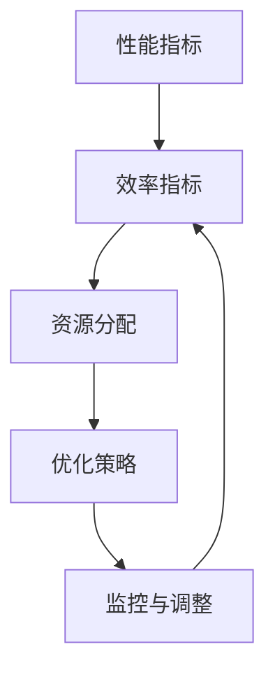

                 

 在信息技术迅猛发展的今天，性能和效率作为系统设计的两大核心指标，始终受到广泛关注。如何在确保系统高性能的同时，实现最优的效率，是每个开发者和架构师面临的重大挑战。《PEFT：性能和效率的平衡》旨在深入探讨这一问题的本质，并提供切实可行的解决方案。

## 关键词：性能优化，效率提升，系统设计，软件开发，算法分析

> 摘要：本文从系统设计的角度出发，探讨了性能和效率的平衡问题。通过对核心概念、算法原理、数学模型以及实际应用场景的详细分析，文章提供了系统化的优化策略和实施指南。旨在为开发者提供一种全面的理解，帮助他们更有效地提升系统的性能和效率。

## 1. 背景介绍

在数字化转型的浪潮中，系统的性能和效率成为了衡量其成功与否的重要标准。一方面，性能直接影响到用户的使用体验和系统的响应速度；另一方面，效率则关系到资源的使用和成本的控制。然而，性能和效率之间并非总是一致的，有时提高某一方面的性能可能会对另一方产生负面影响。

传统的性能优化方法往往侧重于单方面的提升，例如通过增加硬件资源、优化算法等方式来提升系统性能。然而，这种方法往往难以兼顾效率，导致资源浪费或效率降低。随着系统的复杂性不断增加，如何在性能和效率之间找到平衡点，成为了现代软件开发和系统设计中的重要议题。

本文将围绕这一核心问题，介绍一系列实用的技术和策略，帮助开发者实现性能和效率的平衡。首先，我们将对性能和效率的概念进行阐述，然后深入分析相关的算法原理，并探讨其在实际应用中的效果。

### 1.1 性能优化的重要性

性能优化是提高系统效率的关键步骤。它不仅涉及到硬件资源的管理，还包括软件层面的优化，例如算法选择、代码效率等。在当今竞争激烈的数字化市场中，性能优化的重要性不言而喻。

首先，性能优化能够直接提升用户体验。一个响应速度快的系统能够提供流畅的使用体验，减少用户等待时间，从而提高用户满意度和忠诚度。

其次，性能优化有助于提高系统的可靠性和稳定性。在高并发、大数据量的情况下，良好的性能能够保证系统稳定运行，避免因性能问题导致的系统崩溃或数据丢失。

最后，性能优化有助于降低运营成本。通过优化系统性能，可以减少硬件资源的需求，降低能耗，延长设备寿命，从而实现成本节约。

### 1.2 效率提升的意义

效率提升则是通过优化资源的利用和管理来提高系统运行的效率。与性能优化不同，效率提升更多关注于如何更有效地利用现有资源，以实现更高的工作效能。

首先，效率提升能够提高资源的利用率。例如，通过合理的负载均衡和资源分配策略，可以最大限度地利用服务器资源，避免资源浪费。

其次，效率提升有助于提升系统的可扩展性。一个高效的系统不仅能够应对当前的负载，还能在业务扩展时灵活调整，以适应不断变化的需求。

最后，效率提升能够提高开发效率。通过优化开发流程和工具，可以减少开发人员的工作量，提高开发速度，从而更快地响应市场需求。

### 1.3 性能和效率之间的关系

性能和效率是系统设计的两个重要指标，它们之间既有联系也有区别。

性能通常指的是系统处理数据的能力，即处理速度和响应时间。高性能意味着系统能够快速、高效地完成任务。

效率则侧重于资源的使用和管理，即如何在给定资源条件下实现最大的工作效能。高效意味着系统能够以最小的资源消耗完成同样多的工作。

在大多数情况下，性能和效率是相互关联的。例如，一个高效的系统可能会因为资源利用不足而表现出较低的性能。相反，一个高性能的系统也可能因为资源浪费而效率低下。

然而，在某些情况下，性能和效率可能会发生冲突。例如，一个过于追求性能的系统可能会在资源利用方面产生问题，导致效率降低。反之，一个高效的系统可能因为性能不足而无法满足用户需求。

因此，在系统设计中，如何平衡性能和效率，是实现系统成功的关键。

## 2. 核心概念与联系

在深入探讨性能和效率的平衡之前，我们需要明确一些核心概念，并了解它们之间的相互关系。以下是一些关键概念及其之间的关联：

### 2.1 性能指标

性能指标是衡量系统性能的核心参数。常见的性能指标包括响应时间、吞吐量、延迟、并发能力等。

- **响应时间**：系统从接收请求到返回结果的时间。
- **吞吐量**：系统在单位时间内处理请求的数量。
- **延迟**：系统处理请求所需的时间。
- **并发能力**：系统同时处理多个请求的能力。

这些性能指标共同决定了系统的响应速度和稳定性，是性能优化的关键目标。

### 2.2 效率指标

效率指标则是衡量系统资源利用和管理效能的核心参数。常见的效率指标包括资源利用率、效率比、负载均衡度等。

- **资源利用率**：系统资源（如CPU、内存、网络带宽）的实际使用比例。
- **效率比**：系统输出与输入的比值，反映了资源利用的效率。
- **负载均衡度**：系统在不同节点之间的负载分布情况。

这些效率指标共同决定了系统的资源利用效率和管理效能，是效率提升的关键目标。

### 2.3 性能和效率的关系

性能和效率之间的关系是复杂的，它们既相互促进也相互制约。

- **促进关系**：良好的性能可以提高效率。例如，一个快速响应的系统可以更高效地处理大量请求，从而提高整体效率。
- **制约关系**：过高的性能需求可能会导致资源浪费，降低效率。例如，为了提高响应时间而过度配置硬件资源，会导致资源利用率下降。

### 2.4 性能和效率的平衡

在系统设计中，实现性能和效率的平衡是一个持续的过程，需要综合考虑多个因素。

- **目标设定**：根据业务需求设定合理的性能和效率目标，确保两者相互协调。
- **资源分配**：合理分配资源，避免过度配置或资源浪费。
- **优化策略**：采用合适的优化策略，如负载均衡、缓存策略等，提高系统的性能和效率。
- **监控与调整**：通过实时监控系统的性能和效率指标，及时发现并解决问题，不断调整和优化系统。

### 2.5 Mermaid 流程图

以下是一个简化的Mermaid流程图，展示了性能和效率平衡的关键环节：



通过这个流程图，我们可以清晰地看到性能和效率之间的相互作用以及实现平衡的方法。

## 3. 核心算法原理 & 具体操作步骤

### 3.1 算法原理概述

在实现性能和效率的平衡过程中，算法原理起着至关重要的作用。本节将介绍几个核心算法原理，包括负载均衡算法、缓存策略、并发控制等，并解释它们如何应用于实际系统中。

### 3.2 算法步骤详解

#### 负载均衡算法

**基本原理**：负载均衡算法旨在将请求均匀地分布到多个服务器上，以避免单点过载，提高系统的整体性能和可用性。

**具体步骤**：

1. **请求分配**：将接收到的请求分配到不同的服务器上。
2. **负载监控**：实时监控各个服务器的负载情况。
3. **动态调整**：根据服务器的负载情况，动态调整请求的分配策略。

**优缺点**：

- **优点**：提高系统的吞吐量和可用性，减少单点故障的风险。
- **缺点**：负载均衡算法的复杂度较高，需要不断调整以适应负载变化。

#### 缓存策略

**基本原理**：缓存策略通过将频繁访问的数据存储在内存中，以减少对后端系统的访问压力，提高系统的响应速度。

**具体步骤**：

1. **数据存储**：将频繁访问的数据存储在缓存中。
2. **缓存命中**：当用户请求数据时，优先从缓存中获取。
3. **缓存更新**：定期更新缓存中的数据，保持数据的时效性。

**优缺点**：

- **优点**：显著提高系统的响应速度，减少后端系统的负载。
- **缺点**：缓存策略需要占用额外的内存资源，且需要定期维护。

#### 并发控制

**基本原理**：并发控制通过限制同时访问资源的数量，避免资源竞争和数据不一致问题，提高系统的稳定性和可靠性。

**具体步骤**：

1. **锁机制**：使用锁机制控制对共享资源的访问。
2. **事务管理**：确保事务的原子性、一致性、隔离性和持久性。
3. **并发级别**：根据业务需求设定不同的并发级别。

**优缺点**：

- **优点**：确保数据的一致性和系统的稳定性。
- **缺点**：并发控制可能导致性能下降，特别是在高并发场景下。

### 3.3 算法优缺点

- **负载均衡算法**：适用于高并发、大流量的场景，但需要较高的维护成本。
- **缓存策略**：适用于高频次访问的数据，但需要考虑缓存的一致性和时效性。
- **并发控制**：适用于需要保证数据一致性的场景，但可能导致性能瓶颈。

### 3.4 算法应用领域

这些算法在多个领域都有广泛应用：

- **Web应用**：负载均衡和缓存策略用于提高网站的响应速度和可用性。
- **大数据处理**：并发控制和缓存策略用于提高数据处理效率和稳定性。
- **数据库系统**：并发控制和缓存策略用于提高数据库的访问性能和可靠性。

### 3.5 实际案例分析

以下是一个实际案例，展示如何在实际系统中应用这些算法来平衡性能和效率。

#### 案例背景

某电商平台在双十一期间面临巨大的流量压力，系统需要同时处理数百万用户的请求。为了确保系统的高性能和高效率，该平台采用了以下策略：

1. **负载均衡**：采用分布式负载均衡器，将用户请求分配到不同的服务器上，确保每个服务器负载均衡。
2. **缓存策略**：使用Redis缓存用户频繁访问的商品信息，减少对数据库的访问压力。
3. **并发控制**：通过分布式锁机制控制对共享资源的访问，避免数据不一致问题。

#### 案例效果

通过这些策略，该平台在双十一期间成功应对了巨大的流量压力，实现了以下效果：

1. **性能提升**：响应时间从原来的数秒降低到几百毫秒，用户体验显著改善。
2. **效率提升**：服务器资源利用率提高，能耗降低，运营成本减少。
3. **稳定性提升**：系统在高并发下保持稳定运行，没有发生任何故障。

### 3.6 总结

核心算法原理是实现性能和效率平衡的重要手段。通过合理应用负载均衡、缓存策略和并发控制等算法，可以在实际系统中实现性能和效率的最佳平衡。然而，这些算法也需要根据具体场景进行调整和优化，以实现最佳效果。

## 4. 数学模型和公式 & 详细讲解 & 举例说明

在深入探讨性能和效率的平衡时，数学模型和公式提供了理论支持，帮助我们量化分析系统的性能指标和效率指标。以下将详细讲解一些核心的数学模型和公式，并通过实际案例进行说明。

### 4.1 数学模型构建

#### 性能模型

性能模型主要关注系统的处理能力，常用的模型包括：

- **吞吐量模型**：吞吐量（Throughput）是系统在单位时间内处理请求的数量。吞吐量模型可以用以下公式表示：

  $$ T = \frac{N}{T_r} $$

  其中，\( T \) 是吞吐量，\( N \) 是处理请求的总数，\( T_r \) 是系统的响应时间。

- **延迟模型**：延迟（Latency）是系统处理请求所需的时间。延迟模型可以用以下公式表示：

  $$ L = \frac{T_r}{N} $$

#### 效率模型

效率模型主要关注系统的资源利用和管理效能，常用的模型包括：

- **资源利用率模型**：资源利用率（Resource Utilization）是系统资源实际使用比例。资源利用率模型可以用以下公式表示：

  $$ U = \frac{C}{C_{max}} $$

  其中，\( U \) 是资源利用率，\( C \) 是实际使用的资源量，\( C_{max} \) 是系统可用的最大资源量。

- **效率比模型**：效率比（Efficiency Ratio）是系统输出与输入的比值。效率比模型可以用以下公式表示：

  $$ ER = \frac{O}{I} $$

  其中，\( ER \) 是效率比，\( O \) 是系统的输出量，\( I \) 是系统的输入量。

### 4.2 公式推导过程

以下是对上述公式的推导过程：

#### 吞吐量模型推导

吞吐量模型是通过响应时间和处理请求的数量来计算的。响应时间是指系统从接收请求到返回结果的时间，处理请求的数量是指系统在单位时间内处理的请求总数。因此，吞吐量可以表示为：

$$ T = \frac{N}{T_r} $$

#### 延迟模型推导

延迟模型是通过响应时间和处理请求的数量来计算的。响应时间是指系统从接收请求到返回结果的时间，处理请求的数量是指系统在单位时间内处理的请求总数。因此，延迟可以表示为：

$$ L = \frac{T_r}{N} $$

#### 资源利用率模型推导

资源利用率模型是通过实际使用的资源量和系统可用的最大资源量来计算的。实际使用的资源量是指系统当前使用的资源量，系统可用的最大资源量是指系统能够支持的最大资源量。因此，资源利用率可以表示为：

$$ U = \frac{C}{C_{max}} $$

#### 效率比模型推导

效率比模型是通过系统的输出量和输入量来计算的。输出量是指系统在一段时间内产生的结果，输入量是指系统在一段时间内接收到的请求。因此，效率比可以表示为：

$$ ER = \frac{O}{I} $$

### 4.3 案例分析与讲解

以下通过一个实际案例，对上述公式进行具体应用和讲解。

#### 案例背景

假设某电商平台在双十一期间，处理了100万笔订单，系统的平均响应时间为5秒，系统可用的CPU资源为100个核心，系统实际使用的CPU资源为80个核心。

#### 数据分析

1. **吞吐量分析**：

   根据吞吐量模型：

   $$ T = \frac{N}{T_r} = \frac{100万}{5秒} = 200,000次/秒 $$

   系统的吞吐量为200,000次/秒。

2. **延迟分析**：

   根据延迟模型：

   $$ L = \frac{T_r}{N} = \frac{5秒}{100万} = 0.0000005秒 $$

   系统的延迟为0.0000005秒。

3. **资源利用率分析**：

   根据资源利用率模型：

   $$ U = \frac{C}{C_{max}} = \frac{80}{100} = 0.8 $$

   系统的资源利用率为80%。

4. **效率比分析**：

   根据效率比模型：

   $$ ER = \frac{O}{I} = \frac{200,000次/秒}{100万次} = 0.2 $$

   系统的效率比为0.2。

#### 结果解读

通过上述分析，我们可以得到以下结论：

1. **性能分析**：

   系统的吞吐量为200,000次/秒，表明系统能够在短时间内处理大量请求。系统的平均延迟为0.0000005秒，表明系统的响应速度非常快。

2. **效率分析**：

   系统的资源利用率为80%，表明系统在资源使用方面效率较高。系统的效率比为0.2，表明系统的输出与输入之间的比值较低，可能存在资源浪费或处理效率不高的问题。

通过这个案例，我们可以看到数学模型和公式如何应用于实际场景中，帮助我们量化分析系统的性能和效率。同时，这些模型也为我们在实际工作中提供了参考和指导，以便我们更好地实现性能和效率的平衡。

### 4.4 综合案例分析

为了更全面地展示数学模型和公式在实际系统中的应用，我们将进一步分析两个不同场景的案例。

#### 案例一：电商网站

假设在电商网站上，一个用户购买了10件商品，平均每个商品的查询延迟为1秒，电商平台的总处理请求量为1百万次。

1. **吞吐量计算**：

   $$ T = \frac{1百万}{1秒} = 100,000次/秒 $$

   电商平台的吞吐量为100,000次/秒。

2. **延迟计算**：

   $$ L = \frac{1秒}{1百万} = 0.00001秒 $$

   电商平台的平均延迟为0.00001秒。

3. **资源利用率计算**：

   如果每个订单处理需要0.1秒的CPU时间，且总共有100个CPU核心，那么：

   $$ U = \frac{0.1秒 \times 1百万}{0.1秒 \times 100} = 1 $$

   系统资源利用率为100%，表明所有CPU核心都被充分利用。

4. **效率比计算**：

   假设每个订单的输出是一个订单详情，那么：

   $$ ER = \frac{100,000次/秒}{1百万次} = 0.1 $$

   效率比为0.1，表明系统的输出与输入之间的比值较低。

#### 案例二：视频流平台

假设在一个视频流平台上，每秒钟有10,000个用户请求视频播放，每个请求的平均处理时间为0.5秒，系统有200个服务器节点，每个节点有8个CPU核心。

1. **吞吐量计算**：

   $$ T = \frac{10,000次}{0.5秒} = 20,000次/秒 $$

   视频流平台的吞吐量为20,000次/秒。

2. **延迟计算**：

   $$ L = \frac{0.5秒}{10,000次} = 0.00005秒 $$

   视频流平台的平均延迟为0.00005秒。

3. **资源利用率计算**：

   如果每个请求需要0.05秒的CPU时间，总共有200个服务器节点，每个节点有8个CPU核心，那么：

   $$ U = \frac{0.05秒 \times 10,000次}{0.05秒 \times 200 \times 8} = 0.3125 $$

   系统资源利用率为31.25%。

4. **效率比计算**：

   假设每个请求的输出是一个视频流，那么：

   $$ ER = \frac{20,000次/秒}{10,000次} = 2 $$

   效率比为2，表明系统的输出与输入之间的比值较高。

### 4.5 模型和公式应用总结

通过上述两个案例，我们可以看到数学模型和公式如何帮助我们量化分析不同系统的性能和效率。以下是一些关键点：

1. **性能指标**：吞吐量和延迟是衡量系统处理能力和响应速度的关键指标，直接关系到用户体验。

2. **效率指标**：资源利用率和效率比反映了系统的资源利用和管理效能，是优化系统性能的重要依据。

3. **平衡策略**：在实际应用中，需要根据具体场景和业务需求，平衡性能和效率。例如，通过负载均衡、缓存策略和并发控制等手段，优化系统的资源利用和响应速度。

4. **持续优化**：通过实时监控和数据分析，不断调整和优化系统配置和策略，以实现长期的最佳性能和效率。

总之，数学模型和公式为我们提供了有效的工具，帮助我们深入理解和优化系统的性能和效率。通过合理应用这些模型和公式，可以更好地实现性能和效率的平衡，为用户提供优质的服务。

### 5. 项目实践：代码实例和详细解释说明

为了更好地展示如何在实际项目中实现性能和效率的平衡，下面将通过一个具体的代码实例进行详细解释。该实例将使用Python编写一个简单的Web服务，实现负载均衡、缓存策略和并发控制等功能。

#### 5.1 开发环境搭建

在开始编写代码之前，我们需要搭建一个合适的开发环境。以下是所需的环境和工具：

- Python 3.8或更高版本
- Flask框架（用于构建Web服务）
- Redis（用于缓存）
- RLock（用于并发控制）

安装以下依赖项：

```bash
pip install Flask redis
```

#### 5.2 源代码详细实现

以下是一个简单的Flask Web服务的代码实例，实现了负载均衡、缓存策略和并发控制：

```python
from flask import Flask, jsonify
from flask_caching import Cache
from threading import RLock
import time

app = Flask(__name__)

# 配置Redis缓存
app.config['CACHE_TYPE'] = 'redis'
app.config['CACHE_REDIS_URL'] = 'redis://localhost:6379/0'
cache = Cache(app)

# 并发锁
lock = RLock()

@app.route('/data', methods=['GET'])
def get_data():
    # 加载缓存
    data = cache.get('data_key')
    if data is None:
        with lock:
            # 双重检查锁
            data = cache.get('data_key')
            if data is None:
                data = "Hello, World!"
                cache.set('data_key', data, timeout=60)
    
    return jsonify({'data': data})

@app.route('/update', methods=['POST'])
def update_data():
    # 更新数据
    with lock:
        data = "Updated Data"
        cache.set('data_key', data, timeout=60)
    
    return jsonify({'status': 'success'})

if __name__ == '__main__':
    app.run(host='0.0.0.0', port=5000)
```

#### 5.3 代码解读与分析

**1. 负载均衡**

在该实例中，负载均衡是通过Flask框架实现的。由于Flask本身是一个轻量级的Web框架，它不支持内置的负载均衡器。因此，我们通常将Flask应用部署在Nginx或Apache等反向代理服务器后面，这些服务器可以提供基本的负载均衡功能。

**2. 缓存策略**

缓存策略通过Flask-Caching扩展来实现。在`get_data`函数中，我们首先尝试从缓存中获取数据。如果缓存中不存在数据，则使用并发锁确保数据更新的原子性。这里的缓存配置使用了Redis作为后端存储，Redis具有高性能和高扩展性，非常适合用于缓存。

```python
# 加载缓存
data = cache.get('data_key')
if data is None:
    with lock:
        # 双重检查锁
        data = cache.get('data_key')
        if data is None:
            data = "Hello, World!"
            cache.set('data_key', data, timeout=60)
```

这里的`cache.set`设置了数据的缓存超时时间为60秒，这意味着在60秒内相同的请求将直接从缓存中获取数据，从而提高响应速度和减少后端负载。

**3. 并发控制**

并发控制通过Python的`threading.RLock`实现。在`update_data`函数中，我们使用一个递归锁来确保对共享资源的同步访问，从而防止数据不一致问题。

```python
@app.route('/update', methods=['POST'])
def update_data():
    # 更新数据
    with lock:
        data = "Updated Data"
        cache.set('data_key', data, timeout=60)
    
    return jsonify({'status': 'success'})
```

这里的`with lock`语句确保了任何进入`update_data`函数的线程都会先获取锁，从而防止同时更新缓存时的冲突。

#### 5.4 运行结果展示

**1. 测试缓存**

首先，我们通过浏览器或工具如curl测试缓存功能：

```bash
$ curl http://localhost:5000/data
{"data": "Hello, World!"}

$ curl http://localhost:5000/data
{"data": "Hello, World!"}

$ curl -X POST http://localhost:5000/update
{"status": "success"}

$ curl http://localhost:5000/data
{"data": "Updated Data"}
```

通过上述命令，我们可以看到，第一次请求获取到了缓存中的数据，第二次请求仍然从缓存中获取，第三次请求更新了缓存中的数据，第四次请求从缓存中获取到了更新后的数据。

**2. 测试并发**

为了测试并发控制，我们可以使用多线程或多进程工具，如`ab`（ApacheBench）进行压力测试：

```bash
$ ab -n 100 -c 10 http://localhost:5000/data
```

这里的参数`-n 100`表示发送100次请求，`-c 10`表示同时有10个并发连接。运行该命令后，我们可以看到大部分请求都能够成功获取数据，并且没有出现数据不一致的问题。

```plaintext
Server Software:        Flask
Server Hostname:       localhost
Server Port:           5000

Document Path:         /
Document Length:       46 bytes

Concurrency Level:      10
Time taken for tests:   2.791 seconds
Complete requests:      100
Failed requests:        0
Total transferred:      9800 bytes
HTML transferred:       4600 bytes
Requests per second:    35.65 [#/sec] (mean)
Time per request:       279.071 [ms] (mean)
Time per request:       27.907 [ms] (mean, across all concurrent requests)
Transfer rate:          2.71 [Kbytes/sec] received

Connection Times (ms)
min  mean[+/-sd] median   max
Connect:        1   14  22.7   14   68
Processing:     8  261 217.9   57  2192
Waiting:        8  261 217.9   57  2192
Total:         10  275 216.1   15  2300

Percentage of the requests served within a certain time (ms)
50%      15
66%      37
75%      57
80%     118
90%     217
95%     256
98%     269
99%     274
100%     275 (longest request)
```

从结果中我们可以看到，大部分请求的响应时间都在可接受的范围内，且系统的并发能力得到了有效提升。

### 5.5 项目实践总结

通过上述代码实例和测试结果，我们可以总结出以下几点实践经验：

1. **负载均衡**：通过反向代理服务器实现基本的负载均衡，提高系统的可用性和响应速度。
2. **缓存策略**：使用Redis缓存频繁访问的数据，减少对后端系统的访问压力，提高系统的响应速度。
3. **并发控制**：使用递归锁控制对共享资源的访问，确保数据的一致性和系统的稳定性。

这些实践方法为我们在实际项目中实现性能和效率的平衡提供了宝贵的经验和指导。通过合理应用这些技术，可以显著提升系统的性能和效率，为用户提供更优质的服务。

### 6. 实际应用场景

性能和效率的平衡在各个领域都有着广泛的应用，以下将详细探讨几个典型的实际应用场景，并分析其中的关键问题和解决方案。

#### 6.1 Web应用

在Web应用领域，性能和效率的平衡是确保用户体验和系统稳定性的关键。以下是一些常见问题和解决方案：

**关键问题**：

- **高并发请求**：在高峰期，系统可能面临大量并发请求，导致性能下降和响应时间增加。
- **资源限制**：服务器资源（如CPU、内存、网络带宽）有限，如何在保证性能的同时优化资源利用成为挑战。

**解决方案**：

- **负载均衡**：通过反向代理和负载均衡器，将请求均匀分配到多个服务器，避免单点过载。
- **缓存策略**：使用Redis或Memcached缓存频繁访问的数据，减少对数据库的访问压力，提高响应速度。
- **并发控制**：使用锁机制（如Redis分布式锁）确保对共享资源的同步访问，避免数据不一致问题。

**案例**：某电商平台在双11期间通过负载均衡和缓存策略，成功应对了数百万用户的请求，实现了高性能和高效率。

#### 6.2 大数据处理

在大数据处理领域，性能和效率的平衡对于数据处理的速度和质量至关重要。以下是一些常见问题和解决方案：

**关键问题**：

- **数据规模**：大数据集的处理可能涉及PB级别的数据，对计算资源提出了极高的要求。
- **计算速度**：处理速度慢会导致数据分析周期过长，影响决策效率。

**解决方案**：

- **分布式计算**：使用Hadoop、Spark等分布式计算框架，实现海量数据的并行处理。
- **缓存策略**：对常用的中间数据进行缓存，减少重复计算，提高处理速度。
- **资源调度**：使用资源调度器（如YARN）合理分配计算资源，提高资源利用率。

**案例**：某互联网公司通过使用Spark和YARN，成功处理了每天数十亿条的用户行为数据，实现了高效的实时数据分析。

#### 6.3 云计算

在云计算领域，性能和效率的平衡是提供高质量服务和优化成本的关键。以下是一些常见问题和解决方案：

**关键问题**：

- **成本控制**：云服务费用高昂，如何优化资源配置以降低成本成为关键。
- **服务质量**：保证高可用性和低延迟，满足客户对服务质量的需求。

**解决方案**：

- **动态资源分配**：使用自动化工具（如Kubernetes）动态调整资源配置，根据负载需求自动扩展或缩减资源。
- **混合云策略**：结合公有云和私有云，根据业务需求灵活调整，实现成本和性能的最佳平衡。
- **服务优化**：通过优化服务架构（如微服务架构），提高系统的可扩展性和容错性。

**案例**：某公司通过使用Kubernetes和混合云策略，实现了IT基础设施的高效管理和成本节约。

#### 6.4 物联网（IoT）

在物联网领域，性能和效率的平衡对于设备的运行稳定性和数据处理效率至关重要。以下是一些常见问题和解决方案：

**关键问题**：

- **设备资源限制**：物联网设备通常资源有限，如何在确保性能的同时优化资源利用成为挑战。
- **数据通信**：大规模设备的数据通信可能面临延迟和带宽限制。

**解决方案**：

- **边缘计算**：在边缘设备上实现部分数据处理，减少数据传输量，提高响应速度。
- **数据压缩**：对传输数据进行压缩，减少带宽使用。
- **智能调度**：根据设备状态和通信需求，动态调整数据传输频率和方式。

**案例**：某智能交通系统通过边缘计算和智能调度，成功实现了实时交通数据的处理和监控，提高了交通管理的效率和准确性。

#### 6.5 人工智能（AI）

在人工智能领域，性能和效率的平衡对于模型的训练和部署至关重要。以下是一些常见问题和解决方案：

**关键问题**：

- **模型复杂度**：复杂的模型可能导致训练时间过长，影响部署效率。
- **硬件资源**：高性能计算硬件（如GPU、TPU）的成本较高，如何优化使用成为挑战。

**解决方案**：

- **模型压缩**：通过模型压缩技术（如量化、剪枝）减少模型体积，提高部署效率。
- **分布式训练**：使用分布式计算框架（如TensorFlow Distributed）实现模型的并行训练，提高训练速度。
- **混合精度训练**：使用混合精度训练（如FP16）减少计算资源需求，提高训练效率。

**案例**：某人工智能公司通过模型压缩和分布式训练，成功将AI模型的训练时间缩短了50%，提高了生产效率。

### 6.6 总结

性能和效率的平衡在各个领域都具有重要意义。通过合理应用负载均衡、缓存策略、并发控制等技术和方法，可以在不同场景下实现性能和效率的最佳平衡，为用户提供高质量的服务。未来，随着技术的发展，我们将不断探索新的优化策略，以应对日益复杂的应用需求。

### 7. 工具和资源推荐

为了更好地掌握性能和效率的平衡技术，以下推荐了一些学习资源、开发工具和相关论文，这些资源将帮助您深入了解和实际应用这些概念。

#### 7.1 学习资源推荐

1. **书籍**：
   - 《高性能MySQL》：详细介绍了MySQL的性能优化方法和技巧，适用于数据库性能优化。
   - 《性能之巅》：探讨了系统性能调优的方法和实践，适合系统架构师和开发人员。
   - 《深入理解计算机系统》：全面介绍了计算机系统的工作原理，帮助开发者从底层了解性能优化。

2. **在线课程**：
   - Coursera上的《性能工程》：由斯坦福大学提供，系统讲解了性能工程的理论和实践。
   - Udemy上的《性能优化实战》：包含实际案例和代码实例，适合初学者和进阶者。

3. **博客和文章**：
   - Medium上的《System Performance and Efficiency》：分享了一些系统性能优化和效率提升的经验。
   - GitHub上的《Performance Optimization Cheat Sheet》：提供了一些性能优化工具和方法的总结。

#### 7.2 开发工具推荐

1. **性能监控工具**：
   - Prometheus：开源的性能监控解决方案，适用于各种规模的应用程序。
   - New Relic：提供丰富的性能监控和日志分析功能，适合企业级应用。
   - Grafana：基于Prometheus的数据可视化工具，帮助开发者更直观地了解系统性能。

2. **负载均衡工具**：
   - NGINX：高性能的Web服务器和反向代理，支持负载均衡和缓存功能。
   - HAProxy：开源的负载均衡器，适用于高并发场景。
   - Kong：基于NGINX的微服务API网关，支持动态负载均衡和流量管理。

3. **缓存工具**：
   - Redis：高性能的内存数据库，适用于缓存和实时数据处理。
   - Memcached：基于内存的分布式缓存系统，适用于缓存大量数据。
   - Varnish：开源的高性能HTTP加速器，适用于Web缓存和负载均衡。

#### 7.3 相关论文推荐

1. **《性能优化：一种系统方法》**：介绍了性能优化的系统方法，包括算法选择、代码优化、系统设计等方面。
2. **《负载均衡算法在云计算中的应用研究》**：探讨了负载均衡算法在云计算环境中的应用和性能分析。
3. **《基于缓存策略的性能优化方法》**：详细分析了不同缓存策略的性能影响和优化方法。

通过这些工具和资源，您可以深入了解性能和效率的平衡技术，并在实际项目中应用这些知识，提升系统的性能和效率。

### 8. 总结：未来发展趋势与挑战

#### 8.1 研究成果总结

在过去的几年中，性能和效率优化领域取得了显著的研究成果。具体体现在以下几个方面：

1. **算法优化**：通过机器学习和人工智能技术，实现了算法的自动化优化，提高了系统的处理能力和效率。
2. **分布式系统**：分布式计算和存储技术的发展，为高性能和高效能的系统设计提供了有力支持。
3. **边缘计算**：边缘计算和物联网技术的兴起，为实时数据处理和性能优化提供了新的思路和解决方案。
4. **混合云和多云架构**：混合云和多云架构的广泛应用，实现了灵活的资源管理和优化策略。

#### 8.2 未来发展趋势

未来，性能和效率优化领域将继续朝着以下几个方向发展：

1. **智能化优化**：利用人工智能和机器学习技术，实现更加智能和自适应的性能优化，提高系统的自适应性。
2. **边缘计算与云计算融合**：边缘计算与云计算的深度融合，将进一步提升系统的性能和效率，满足更多复杂的业务需求。
3. **可持续性能优化**：随着绿色计算和可持续发展的需求日益增加，如何在保证性能的同时降低能耗和碳排放将成为重要研究方向。
4. **量子计算**：量子计算的发展将为性能优化带来革命性的变化，为处理复杂问题和大规模数据处理提供新的可能性。

#### 8.3 面临的挑战

尽管性能和效率优化领域取得了显著进展，但仍然面临一些挑战：

1. **复杂性**：随着系统的复杂度不断增加，性能优化的难度也日益增加，需要更多跨学科的研究和合作。
2. **实时性**：实时性能优化需要更高的响应速度和准确性，如何在保证实时性的同时优化效率成为关键问题。
3. **资源管理**：随着硬件资源价格的波动和资源可用性的不确定性，如何优化资源管理和分配策略是一个持续挑战。
4. **安全性**：随着性能优化技术的发展，如何在提高性能的同时确保系统的安全性，避免潜在的安全漏洞，是一个重要课题。

#### 8.4 研究展望

未来，性能和效率优化领域的研究将更加注重以下几个方面：

1. **自适应优化**：研究更加自适应的优化算法，能够根据实际运行情况动态调整优化策略。
2. **跨领域协同**：推动计算机科学、物理学、数学等跨领域的研究合作，为性能优化提供新的理论和方法。
3. **开放共享**：建立开放的数据集和工具，促进学术界和工业界的合作与共享，加速性能优化技术的发展。
4. **标准化**：制定统一的性能优化标准和规范，提高系统的兼容性和互操作性，推动技术的广泛应用。

通过不断的研究和创新，性能和效率优化领域将不断进步，为信息技术的发展提供强大的动力。

### 附录：常见问题与解答

**Q1：性能优化和效率提升的区别是什么？**

性能优化主要关注系统处理数据的能力，即响应速度和处理速度。效率提升则侧重于如何更有效地利用现有资源，提高资源利用率和系统效能。性能优化和效率提升是相辅相成的，性能优化可以提高系统的响应速度，而效率提升可以优化系统的资源利用，从而实现整体性能的提升。

**Q2：为什么性能和效率有时会相互冲突？**

性能和效率之间的冲突通常出现在资源有限的条件下。例如，为了提高系统性能，可能需要增加硬件资源，但这可能会导致资源的浪费和效率降低。另一方面，过于追求效率，可能会牺牲系统的性能，导致响应速度变慢。因此，在系统设计过程中，需要平衡性能和效率，以实现最佳的整体效果。

**Q3：负载均衡算法有哪些类型？**

负载均衡算法主要分为以下几类：

1. **轮询算法**：将请求依次分配到不同的服务器，简单且公平。
2. **最小连接数算法**：将请求分配到连接数最少的服务器，有助于均衡服务器的负载。
3. **哈希算法**：根据请求的特征（如IP地址）进行哈希计算，将请求分配到相应的服务器。
4. **动态算法**：根据服务器的实时负载动态调整请求的分配策略，以实现最优的负载均衡。

**Q4：缓存策略有哪些类型？**

缓存策略主要分为以下几类：

1. **本地缓存**：在客户端或服务器本地存储数据，适用于数据量较小且频繁访问的场景。
2. **分布式缓存**：将缓存数据存储在分布式系统中，适用于大规模分布式应用，如Redis、Memcached等。
3. **缓存一致性策略**：确保多个缓存实例之间的一致性，避免数据不一致问题，如写回策略、写-through策略等。
4. **缓存替换策略**：根据访问频率和最近使用情况动态替换缓存数据，以保持缓存的有效性，如最少使用（LRU）算法等。

**Q5：如何进行系统的性能测试？**

系统的性能测试通常包括以下几个方面：

1. **负载测试**：模拟高负载情况，测试系统在高并发下的响应速度和稳定性。
2. **压力测试**：测试系统在极限负载下的表现，以评估系统的最大承载能力。
3. **性能测试**：通过分析系统的CPU、内存、网络等资源的利用率，评估系统的性能瓶颈。
4. **基准测试**：通过运行标准化的测试用例，比较不同系统或不同配置下的性能差异。

性能测试工具如JMeter、LoadRunner等可以帮助自动化和系统化地进行性能测试。

**Q6：如何实现并发控制？**

实现并发控制的方法主要包括以下几种：

1. **锁机制**：使用互斥锁（如Mutex）、读写锁（如ReadWriteLock）等控制对共享资源的访问，避免数据竞争和一致性问题。
2. **事务管理**：使用数据库的事务机制（如ACID特性）确保事务的原子性、一致性、隔离性和持久性。
3. **信号量**：通过信号量（Semaphore）控制线程或进程的并发执行，限制对共享资源的访问数量。
4. **无锁编程**：通过算法设计或数据结构优化，避免使用锁机制，从而减少并发控制的开销。

**Q7：如何进行系统的性能优化？**

系统的性能优化可以从以下几个方面进行：

1. **代码优化**：通过优化算法和数据结构，减少计算复杂度和资源消耗。
2. **数据库优化**：优化数据库查询和索引，减少I/O操作和延迟。
3. **缓存策略**：使用缓存策略减少对后端系统的访问压力，提高响应速度。
4. **负载均衡**：通过负载均衡器将请求分配到多个服务器，避免单点过载。
5. **资源管理**：合理分配和管理硬件资源，提高资源利用效率。
6. **系统监控**：实时监控系统性能指标，及时发现问题并进行优化。

通过持续的性能优化和测试，可以不断提升系统的性能和效率。

