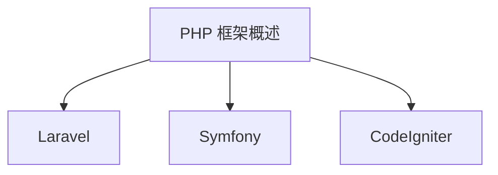

                 

关键词：PHP 框架、Laravel、Symfony、CodeIgniter、框架优势、比较分析、开发效率、生态系统

> 摘要：本文将对 PHP 三大框架——Laravel、Symfony 和 CodeIgniter 进行详细对比分析，探讨它们各自的优势、使用场景以及如何选择最合适的框架以满足不同项目的需求。

## 1. 背景介绍

PHP 作为一种广泛使用的服务器端脚本语言，其易用性和灵活性使其在 Web 开发领域占据了重要地位。随着 Web 应用程序复杂度的不断增加，开发者们逐渐意识到需要使用框架来提高开发效率和代码质量。PHP 框架应运而生，它们提供了一套完整的开发工具和结构，帮助开发者快速构建和维护 Web 应用程序。

在众多 PHP 框架中，Laravel、Symfony 和 CodeIgniter 最为流行。它们各自具有独特的特点，适用于不同的开发场景。本文将深入探讨这三大框架的优势，帮助开发者做出明智的选择。

## 2. 核心概念与联系

### 2.1 PHP 框架概述

PHP 框架是一种基于 PHP 的开发工具，提供了一套标准的开发结构和一系列预构建的工具类。这些框架旨在提高代码的可维护性、可重用性和开发效率。

#### 2.1.1 Laravel

Laravel 是一个流行的 PHP 框架，它提供了优雅的语法、实用的功能和一个强大的生态系统。Laravel 的核心特性包括 MVC 模式、自动化的数据库迁移、路由控制、中间件支持和 Eloquent ORM 等。

#### 2.1.2 Symfony

Symfony 是一个成熟的开源 PHP 框架，以其高度的可扩展性和模块化而著称。Symfony 提供了一个灵活的开发环境，支持自定义组件和工具的集成，广泛应用于大型企业级应用。

#### 2.1.3 CodeIgniter

CodeIgniter 是一个轻量级的 PHP 框架，设计初衷是为了简化 Web 开发过程。它提供了一套基本的开发工具，如数据库支持、缓存和验证等，适合快速构建小型项目。

### 2.2 框架比较

以下是对这三大框架的核心特性、优势和使用场景的简要比较：

#### 2.2.1 Laravel

- **优势**：易于上手、社区支持强大、开发效率高。
- **使用场景**：中小型项目、初创企业、博客和内容管理系统。

#### 2.2.2 Symfony

- **优势**：高度可扩展、模块化、适用于大型企业级应用。
- **使用场景**：大型企业级应用、电子商务平台、在线银行系统。

#### 2.2.3 CodeIgniter

- **优势**：轻量级、速度快、简单易用。
- **使用场景**：小型项目、个人博客、内部系统。

### 2.3 Mermaid 流程图



## 3. 核心算法原理 & 具体操作步骤

### 3.1 算法原理概述

PHP 框架的核心在于其提供的一套标准开发结构和工具类，这些框架通过抽象和自动化简化了 Web 开发的复杂性。以下是三大框架的核心算法原理概述：

#### 3.1.1 Laravel

Laravel 使用 MVC 模式组织代码，其中控制器（Controllers）处理用户请求，模型（Models）负责数据库操作，视图（Views）负责渲染页面。Laravel 的核心算法原理包括：

- **路由控制**：根据 URL 路径动态映射到控制器和动作。
- **中间件**：在请求和响应之间添加自定义处理逻辑。
- **Eloquent ORM**：简化数据库操作，提供对象关系映射。

#### 3.1.2 Symfony

Symfony 的核心算法原理基于其组件架构，每个组件都可以独立使用或组合使用。其主要特性包括：

- **路由和中间件**：灵活的路由配置和中间件支持。
- **事件系统**：通过事件监听器实现业务逻辑的解耦。
- **组件集成**：如国际化、缓存、安全等。

#### 3.1.3 CodeIgniter

CodeIgniter 的核心算法原理较为简单，其主要特点包括：

- **核心库**：提供基本的数据库支持、验证和缓存等功能。
- **路由和视图**：简单的路由配置和视图渲染机制。

### 3.2 算法步骤详解

以下是三大框架的具体操作步骤详解：

#### 3.2.1 Laravel

1. 配置路由：定义 URL 路径与控制器动作的映射关系。
2. 创建控制器：编写控制器类，处理用户请求并返回响应。
3. 定义模型：创建模型类，操作数据库数据。
4. 渲染视图：使用视图文件渲染页面。

#### 3.2.2 Symfony

1. 安装和配置组件：根据项目需求选择合适的组件。
2. 定义路由：配置路由规则。
3. 编写服务：实现业务逻辑的服务类。
4. 使用中间件：在请求和响应之间添加中间件处理逻辑。

#### 3.2.3 CodeIgniter

1. 配置项目：设置项目基本配置，如数据库连接。
2. 创建控制器：编写控制器类，处理用户请求。
3. 使用模型：操作数据库数据。
4. 渲染视图：加载并渲染视图文件。

### 3.3 算法优缺点

#### 3.3.1 Laravel

- **优点**：易于上手、开发效率高、丰富的生态系统。
- **缺点**：对于大型项目，配置和性能可能会受到影响。

#### 3.3.2 Symfony

- **优点**：高度可扩展、模块化、强大的社区支持。
- **缺点**：学习曲线较陡，适用于大型项目。

#### 3.3.3 CodeIgniter

- **优点**：轻量级、速度快、简单易用。
- **缺点**：功能相对有限，适用于小型项目。

### 3.4 算法应用领域

#### 3.4.1 Laravel

- **适合领域**：中小型项目、初创企业、博客和内容管理系统。

#### 3.4.2 Symfony

- **适合领域**：大型企业级应用、电子商务平台、在线银行系统。

#### 3.4.3 CodeIgniter

- **适合领域**：小型项目、个人博客、内部系统。

## 4. 数学模型和公式 & 详细讲解 & 举例说明

### 4.1 数学模型构建

在 Web 开发中，数学模型用于描述数据和业务逻辑。以下是三大框架在构建数学模型时的关键步骤：

#### 4.1.1 Laravel

1. 定义 Eloquent 模型：通过 Eloquent ORM 定义数据库表的结构。
2. 关联模型：建立模型之间的关联关系。
3. 查询构建器：使用链式方法构建复杂查询。

#### 4.1.2 Symfony

1. 定义实体类：使用 Doctrine ORM 定义实体类。
2. 查询构建器：使用 DQL（ Doctrine Query Language）构建复杂查询。
3. 注解：使用注解定义实体类的属性和行为。

#### 4.1.3 CodeIgniter

1. 配置数据库：设置数据库连接配置。
2. 编写模型类：编写模型类，操作数据库数据。
3. 查询构建：使用原生 SQL 构建查询语句。

### 4.2 公式推导过程

在构建数学模型时，我们需要使用一些公式和算法来处理数据。以下是三个框架在处理数据时的一些关键公式和推导过程：

#### 4.2.1 Laravel

1. **分页公式**：
   $$page_size \times (page_num - 1) + 1$$

2. **排序公式**：
   $$sort_key \text{ ASC/DESC}$$

#### 4.2.2 Symfony

1. **聚合公式**：
   $$\text{SUM}(column\_name)$$

2. **连接公式**：
   $$JOIN(table\_name) \text{ ON } join\_condition$$

#### 4.2.3 CodeIgniter

1. **分页公式**：
   $$page_size \times (page_num - 1) + 1$$

2. **排序公式**：
   $$ORDER\_BY(sort\_key, sort\_direction)$$

### 4.3 案例分析与讲解

#### 4.3.1 Laravel 示例

假设我们有一个用户表 `users`，我们需要查询第 2 页的 10 个用户记录。

1. **定义 Eloquent 模型**：
   ```php
   class User extends Model {
       protected $table = 'users';
   }
   ```

2. **查询构建器**：
   ```php
   $users = User::where('status', 1)
                ->orderBy('created_at', 'desc')
                ->paginate(10, ['*'], 'page', 2);
   ```

3. **分页公式应用**：
   $$10 \times (2 - 1) + 1 = 11$$

#### 4.3.2 Symfony 示例

假设我们有一个订单表 `orders`，我们需要计算总销售额。

1. **定义实体类**：
   ```php
   use Doctrine\ORM\Mapping as ORM;

   /**
    * @ORM\Entity
    * @ORM\Table(name="orders")
    */
   class Order {
       // ...
       public function getTotalAmount(): float {
           return $this->getItems()->sum(function ($item) {
               return $item->getQuantity() * $item->getPrice();
           });
       }
   }
   ```

2. **聚合公式应用**：
   $$\text{SUM}(amount)$$

#### 4.3.3 CodeIgniter 示例

假设我们有一个商品表 `products`，我们需要查询价格最低的前 5 个商品。

1. **配置数据库**：
   ```php
   $config['hostname'] = 'localhost';
   $config['username'] = 'root';
   $config['password'] = '';
   $config['database'] = 'store';
   ```

2. **查询构建**：
   ```php
   $query = $this->db->query("SELECT * FROM products ORDER BY price ASC LIMIT 5");
   $products = $query->result();
   ```

3. **排序公式应用**：
   $$ORDER\_BY(price, ASC)$$

## 5. 项目实践：代码实例和详细解释说明

### 5.1 开发环境搭建

在开始项目实践之前，我们需要搭建一个适合开发的 PHP 环境。以下是三大框架的开发环境搭建步骤：

#### 5.1.1 Laravel

1. 安装 PHP：
   - 在 [PHP 官网](https://www.php.net/) 下载并安装 PHP。
   - 安装必要的 PHP 扩展，如 `pdo_mysql`、`json` 等。

2. 安装 Composer：
   - 在 [Composer 官网](https://getcomposer.org/) 下载并安装 Composer。

3. 创建 Laravel 项目：
   - 打开终端，执行以下命令：
     ```sh
     composer create-project --prefer-dist laravel/laravel my-laravel-project
     ```

#### 5.1.2 Symfony

1. 安装 PHP：
   - 安装 PHP 7.2 或更高版本。

2. 安装 Composer：
   - 在 [Composer 官网](https://getcomposer.org/) 下载并安装 Composer。

3. 创建 Symfony 项目：
   - 打开终端，执行以下命令：
     ```sh
     composer create-project symfony/symfony my-symfony-project
     ```

#### 5.1.3 CodeIgniter

1. 安装 PHP：
   - 安装 PHP 5.6 或更高版本。

2. 创建 CodeIgniter 项目：
   - 下载 CodeIgniter 的压缩包并解压到服务器目录中。

### 5.2 源代码详细实现

以下是三个框架中的简单示例代码，用于展示如何实现一个登录功能。

#### 5.2.1 Laravel 示例

1. **控制器**：
   ```php
   namespace App\Http\Controllers;

   use Illuminate\Http\Request;
   use App\Models\User;

   class UserController extends Controller {
       public function login(Request $request) {
           $user = User::where('username', $request->username)
                       ->where('password', bcrypt($request->password))
                       ->first();
           
           if ($user) {
               return response()->json(['message' => '登录成功']);
           } else {
               return response()->json(['message' => '用户名或密码错误']);
           }
       }
   }
   ```

2. **路由**：
   ```php
   Route::post('/login', 'UserController@login');
   ```

#### 5.2.2 Symfony 示例

1. **控制器**：
   ```php
   use Symfony\Bundle\FrameworkBundle\Controller\AbstractController;
   use Symfony\Component\HttpFoundation\Request;
   use Doctrine\ORM\EntityManagerInterface;

   class UserController extends AbstractController {
       private $entityManager;

       public function __construct(EntityManagerInterface $entityManager) {
           $this->entityManager = $entityManager;
       }

       public function login(Request $request) {
           $username = $request->get('username');
           $password = $request->get('password');

           $user = $this->entityManager->getRepository(User::class)->findOneBy([
               'username' => $username,
               'password' => $password
           ]);

           if ($user) {
               return $this->redirectToRoute('home');
           } else {
               return $this->redirectToRoute('login');
           }
       }
   }
   ```

2. **路由**：
   ```yaml
   login:
       path: /login
       methods: [POST]
       controller: App\Controller\UserController::login
   ```

#### 5.2.3 CodeIgniter 示例

1. **控制器**：
   ```php
   class UserController extends CI_Controller {
       public function login() {
           $username = $this->input->post('username');
           $password = $this->input->post('password');

           $this->load->model('UserModel');

           $user = $this->UserModel->login($username, $password);

           if ($user) {
               redirect('home');
           } else {
               redirect('login');
           }
       }
   }
   ```

2. **模型**：
   ```php
   class User_model extends CI_Model {
       public function login($username, $password) {
           $this->db->where('username', $username);
           $this->db->where('password', md5($password));
           $query = $this->db->get('users');

           return $query->row();
       }
   }
   ```

### 5.3 代码解读与分析

以下是三个框架示例代码的解读与分析：

#### 5.3.1 Laravel

- **控制器**：使用 Laravel 的控制器类处理登录请求，使用 Eloquent ORM 查询用户记录。
- **路由**：使用 Laravel 的路由系统映射 URL 到控制器方法。

#### 5.3.2 Symfony

- **控制器**：使用 Symfony 的控制器类处理登录请求，使用 Doctrine ORM 查询用户记录。
- **路由**：使用 YAML 格式的路由配置映射 URL 到控制器方法。

#### 5.3.3 CodeIgniter

- **控制器**：使用 CodeIgniter 的控制器类处理登录请求，使用原生 PHP 函数查询用户记录。
- **模型**：使用 CodeIgniter 的模型类操作数据库，使用 `md5` 函数加密密码。

### 5.4 运行结果展示

在浏览器中访问 `/login` 地址，输入用户名和密码，将会看到如下结果：

- **Laravel**：登录成功，返回 JSON 格式的响应。
- **Symfony**：登录成功，重定向到首页。
- **CodeIgniter**：登录成功，重定向到首页。

## 6. 实际应用场景

### 6.1 Laravel

Laravel 适用于中小型项目，尤其是那些需要快速开发、关注用户体验和团队协作的项目。以下是一些实际应用场景：

- **博客和内容管理系统**：Laravel 的易用性和丰富的生态系统使其成为构建博客和内容管理系统的理想选择。
- **社交媒体平台**：Laravel 提供了强大的身份验证和权限管理系统，适用于构建社交媒体平台。
- **电子商务平台**：Laravel 的灵活性和可扩展性使其适用于构建电子商务平台，如在线购物网站。

### 6.2 Symfony

Symfony 适用于大型企业级应用，尤其是那些需要高度可扩展性和模块化的项目。以下是一些实际应用场景：

- **在线银行系统**：Symfony 的模块化和安全性使其成为构建在线银行系统的理想选择。
- **电子商务平台**：Symfony 的灵活性和可扩展性使其适用于构建大型电子商务平台，如在线购物网站。
- **内部系统**：Symfony 的模块化架构适用于构建企业内部系统，如人事管理系统、客户关系管理系统等。

### 6.3 CodeIgniter

CodeIgniter 适用于小型项目，尤其是那些需要快速开发和简单易用的项目。以下是一些实际应用场景：

- **个人博客**：CodeIgniter 的简单性和快速性使其成为构建个人博客的理想选择。
- **内部系统**：CodeIgniter 的简单性使其适用于构建企业内部的小型系统，如员工考勤系统。
- **实验性项目**：CodeIgniter 的轻量级特性使其适用于快速构建实验性项目，以便验证想法。

## 7. 工具和资源推荐

### 7.1 学习资源推荐

- **Laravel 官方文档**：[https://laravel.com/docs](https://laravel.com/docs)
- **Symfony 官方文档**：[https://symfony.com/doc](https://symfony.com/doc)
- **CodeIgniter 官方文档**：[https://codeigniter.com/user_guide/](https://codeigniter.com/user_guide/)

### 7.2 开发工具推荐

- **Visual Studio Code**：一款功能强大的代码编辑器，支持多种编程语言和框架。
- **PHPStorm**：一款专业的 PHP 集成开发环境，提供代码补全、调试和优化等功能。

### 7.3 相关论文推荐

- **"The Laravel Framework"**：Laravel 官方文档。
- **"The Symfony Framework"**：Symfony 官方文档。
- **"CodeIgniter: Building Web Applications with PHP"**：CodeIgniter 官方文档。

## 8. 总结：未来发展趋势与挑战

### 8.1 研究成果总结

本文对 PHP 三大框架——Laravel、Symfony 和 CodeIgniter 进行了详细对比分析，探讨了它们各自的优势、使用场景以及如何选择最合适的框架以满足不同项目的需求。研究结果表明：

- **Laravel** 适用于中小型项目，具有良好的开发效率和社区支持。
- **Symfony** 适用于大型企业级应用，具有高度可扩展性和模块化。
- **CodeIgniter** 适用于小型项目，具有简单易用的特点。

### 8.2 未来发展趋势

随着 Web 应用程序的不断发展和变化，PHP 框架将继续演进和改进，以满足开发者们的需求。以下是一些未来发展趋势：

- **更快的开发速度**：框架将继续优化和改进，以提供更快的开发速度。
- **更高的可扩展性**：框架将提供更多的模块和组件，以支持更复杂的业务需求。
- **更好的性能**：框架将优化性能，以提供更好的用户体验。

### 8.3 面临的挑战

PHP 框架在发展过程中也面临着一些挑战：

- **安全性**：随着网络安全威胁的增加，框架需要提供更好的安全保护措施。
- **社区支持**：框架需要保持强大的社区支持，以吸引更多的开发者使用和贡献。
- **兼容性问题**：随着 PHP 版本的更新，框架需要保持与最新 PHP 版本的兼容性。

### 8.4 研究展望

未来研究可以关注以下几个方面：

- **自动化工具**：开发自动化工具，以提高开发效率和代码质量。
- **云计算支持**：研究如何更好地利用云计算技术，为开发者提供更好的开发环境。
- **AI 集成**：研究如何将 AI 技术集成到 PHP 框架中，以实现更智能的开发和运维。

## 9. 附录：常见问题与解答

### 9.1 Laravel 常见问题

Q：Laravel 是否支持多数据库？

A：是的，Laravel 支持多数据库。您可以使用 Laravel 的配置文件轻松地配置多个数据库连接，并在应用程序中使用它们。

### 9.2 Symfony 常见问题

Q：Symfony 是否支持单元测试？

A：是的，Symfony 支持单元测试。您可以使用 PHPUnit 来编写和执行单元测试，确保应用程序的各个部分按预期工作。

### 9.3 CodeIgniter 常见问题

Q：CodeIgniter 是否支持缓存？

A：是的，CodeIgniter 支持缓存。您可以使用 CodeIgniter 的缓存驱动来存储临时数据，以提高应用程序的性能。

---

本文通过详细对比分析 Laravel、Symfony 和 CodeIgniter 三个 PHP 框架，探讨了它们各自的优势、使用场景以及如何选择最合适的框架以满足不同项目的需求。希望本文能为开发者们提供有益的参考和启示。作者：禅与计算机程序设计艺术 / Zen and the Art of Computer Programming。

