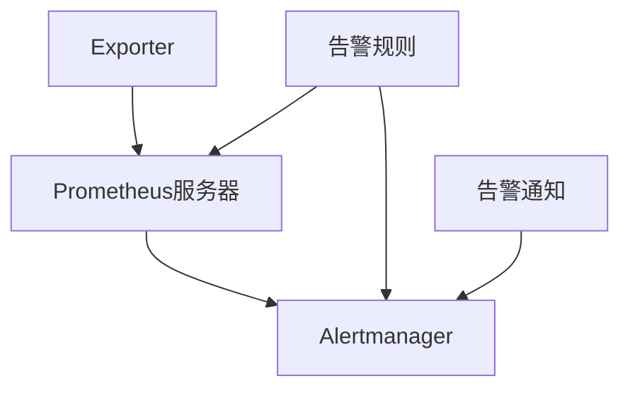

                 

关键词：Prometheus、监控、告警配置、优化、系统稳定性、性能提升

> 摘要：本文将深入探讨Prometheus监控系统的告警配置优化策略，分析现有配置的不足，并提出具体的优化方案，旨在提高系统的监控准确性和告警效率，确保系统的高可用性。

## 1. 背景介绍

Prometheus是一种开源的监控解决方案，它凭借其强大的数据采集、告警管理、可视化分析等功能，在云计算和容器化环境中得到了广泛的应用。Prometheus的基本架构包括 exporter、pushgateway、Prometheus服务器和Alertmanager等组件。

告警是监控系统的重要组成部分，它能在系统性能下降或出现故障时及时通知相关人员。然而，在实际部署中，告警配置往往存在各种问题，如误报、漏报、告警过多等，这些问题会影响系统的稳定性，甚至导致业务中断。因此，优化Prometheus的告警配置具有很高的实际价值。

## 2. 核心概念与联系

### Prometheus架构

Prometheus的基本架构如下：

- **Exporter**：数据采集组件，通过HTTP暴露metrics，Prometheus定期抓取。
- **Pushgateway**：用于临时或批量收集数据。
- **Prometheus服务器**：存储时间序列数据，通过拉取或推送方式收集数据。
- **Alertmanager**：处理告警通知，支持多种通知方式，如邮件、短信、Webhook等。

### 告警配置

告警配置主要涉及以下几方面：

- **Rules**：定义告警规则，包含阈值、评估周期、告警发送等。
- **Recorders**：定义如何记录和存储metrics。
- **Notifiers**：配置告警通知方式。

### Mermaid流程图



## 3. 核心算法原理 & 具体操作步骤

### 3.1 算法原理概述

Prometheus告警系统基于表达式语言进行规则配置，支持多种运算符和函数，能实现复杂的告警逻辑。

### 3.2 算法步骤详解

1. **定义告警规则**：在Prometheus配置文件中添加告警规则。
2. **配置Recorders**：确保metrics能被正确采集。
3. **配置Notifiers**：设置告警通知方式。
4. **测试告警规则**：验证告警规则的正确性。

### 3.3 算法优缺点

**优点**：

- **灵活性**：支持自定义告警规则。
- **可扩展性**：易于添加新的告警通知方式。

**缺点**：

- **配置复杂**：需要对Prometheus有深入的理解。
- **性能影响**：大量告警规则可能会影响系统性能。

### 3.4 算法应用领域

Prometheus广泛应用于云计算、容器化、微服务架构等场景，其告警系统能够实时监控系统性能，提高系统的稳定性。

## 4. 数学模型和公式 & 详细讲解 & 举例说明

### 4.1 数学模型构建

假设我们定义了一个告警规则，当某个系统的CPU使用率超过90%时触发告警。我们可以使用以下数学模型来表示：

\[ CPU\_ utilization > 90\% \]

### 4.2 公式推导过程

\[ CPU\_ utilization = \frac{CPU\_used}{CPU\_total} \]

当\[ CPU\_ utilization > 90\% \]时，我们有：

\[ \frac{CPU\_used}{CPU\_total} > 90\% \]

### 4.3 案例分析与讲解

假设一个系统的CPU总容量为1000个单位，当前使用量为950个单位，我们可以计算出：

\[ CPU\_ utilization = \frac{950}{1000} = 95\% \]

由于\[ 95\% > 90\% \]，该系统触发告警。

## 5. 项目实践：代码实例和详细解释说明

### 5.1 开发环境搭建

在本文中，我们将使用Prometheus 2.34.0版本。请确保已安装了Prometheus服务器和Alertmanager。

### 5.2 源代码详细实现

以下是一个简单的告警规则配置示例：

```yaml
groups:
- name: my-alerts
  rules:
  - alert: HighCPUUtilization
    expr: cpu_usage{job="my-system"} > 0.9
    for: 1m
    labels:
      severity: critical
    annotations:
      summary: "High CPU utilization on {{ $labels.job }}"
```

### 5.3 代码解读与分析

该配置文件定义了一个名为`HighCPUUtilization`的告警规则。该规则检查名为`my-system`的作业中的`cpu_usage`指标，当其值超过90%时，触发告警。告警的严重性标签为`critical`，告警摘要包含作业名称。

### 5.4 运行结果展示

当系统CPU使用率超过90%时，Alertmanager会发送告警通知。例如，使用钉钉作为通知渠道：

```yaml
alertmanager:
  global:
    resolve_time: 5m
  route:
    receiver: dingtalk
    matchers:
      - exact: "severity=critical"
    group_by: ['job']
    repeat_interval: 1h
    resolver: 'my-resolver'
  receivers:
  - name: dingtalk
    dingtalk_configs:
    - url: https://oapi.dingtalk.com/robot/send?access_token=<您的access_token>
      secret: <您的secret>
      msgtype: markdown
      markdown: |
        # High CPU Utilization Alert
        - **Job**: {{ $labels.job }}
        - **Time**: {{ $start }}
        - **CPU Utilization**: {{ $value }}%
```

该配置会将所有`severity`为`critical`的告警分组发送到钉钉群组。

## 6. 实际应用场景

Prometheus告警系统在实际应用中能够有效监控系统的关键指标，如CPU使用率、内存使用率、磁盘空间等。以下是几个应用场景：

- **云服务器监控**：监控云服务器的性能指标，确保系统稳定运行。
- **容器化环境监控**：监控Docker、Kubernetes等容器化环境，及时发现故障。
- **微服务监控**：监控微服务的健康状态，确保服务的高可用性。

## 7. 工具和资源推荐

### 7.1 学习资源推荐

- **官方文档**：[Prometheus官方文档](https://prometheus.io/docs/introduction/whatis/)
- **入门教程**：[Prometheus官方入门教程](https://www.prometheus.io/tutorials/)
- **书籍推荐**：《Prometheus：分布式系统监控之道》

### 7.2 开发工具推荐

- **Prometheus Web界面**：用于监控和可视化。
- **Grafana**：结合Prometheus，提供强大的可视化功能。

### 7.3 相关论文推荐

- **论文1**：《Prometheus: An Open Source Systems Monitoring and Alerting Toolkit》
- **论文2**：《Grafana: The Open Platform for Monitoring and Analytics》

## 8. 总结：未来发展趋势与挑战

### 8.1 研究成果总结

本文探讨了Prometheus监控告警配置的优化策略，分析了现有配置的问题，并提出了具体的优化方案。

### 8.2 未来发展趋势

随着云计算和容器化技术的不断发展，Prometheus监控告警系统将变得更加重要。未来发展趋势包括：

- **自动化告警配置**：通过AI技术实现自动化告警配置，降低人工配置的复杂度。
- **多维度监控**：结合更多监控指标，实现全方位的系统监控。

### 8.3 面临的挑战

- **性能优化**：如何在高负载下保持监控系统的高性能。
- **告警策略优化**：如何设计更加合理的告警策略，避免误报和漏报。

### 8.4 研究展望

未来研究可以关注以下几个方面：

- **智能化监控**：结合AI技术，实现智能化的监控和告警。
- **跨平台监控**：支持更多平台的监控，提高监控的覆盖范围。

## 9. 附录：常见问题与解答

- **Q：如何降低误报率？**
  **A：** 通过调整告警阈值和评估周期，结合历史数据进行分析和调整。

- **Q：如何处理大量告警？**
  **A：** 可以使用Alertmanager的告警分组和抑制策略，减少告警数量。

- **Q：如何实现自动化告警配置？**
  **A：** 可以使用PromQL的表达式语言和Prometheus的API，结合自动化脚本实现自动化配置。

**作者：禅与计算机程序设计艺术 / Zen and the Art of Computer Programming**  
----------------------------------------------------------------
本文旨在为读者提供关于Prometheus监控告警配置优化的全面指导，帮助提高系统的稳定性和性能。希望本文能对您的监控系统建设有所帮助。在未来的技术发展中，我们期待看到更加智能化、高效的监控解决方案。

