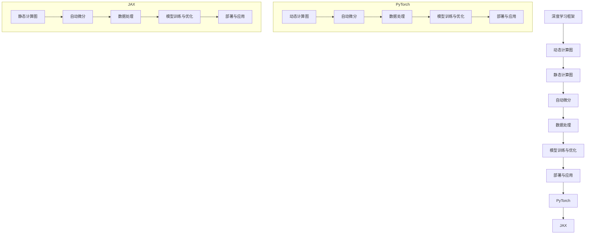

                 

关键词：深度学习，框架对比，PyTorch，JAX，算法，数学模型，项目实践，应用场景，发展趋势，挑战

> 摘要：本文将对深度学习领域两大主流框架——PyTorch和JAX进行全面的对比。通过深入分析两者的核心概念、算法原理、数学模型、项目实践以及未来发展趋势，旨在为读者提供关于深度学习框架选择的实用指南。

## 1. 背景介绍

### 1.1 PyTorch

PyTorch是由Facebook的人工智能研究团队开发的深度学习框架，其核心亮点在于其灵活性和动态计算图。PyTorch的动态计算图使得研究人员和开发者可以更直观地构建和调试模型，这对于复杂的深度学习应用尤其重要。自推出以来，PyTorch在学术界和工业界都获得了广泛的认可和应用。

### 1.2 JAX

JAX是由Google开发的深度学习框架，其设计初衷是为深度学习和计算科学提供高性能的自动微分工具。JAX的核心特性是其高效的后端和自动微分能力，这使得它非常适合大规模的数据处理和复杂的算法优化。JAX的这种设计理念使其在科学计算领域也具有竞争力。

## 2. 核心概念与联系

### 2.1 深度学习框架概述

为了更直观地理解PyTorch和JAX的核心概念，我们使用Mermaid流程图来展示它们的基本架构和主要组成部分。



从图中我们可以看出，两者在核心概念和组成部分上存在一定的差异，但都旨在为深度学习提供高效的计算支持和灵活的模型构建能力。

## 3. 核心算法原理 & 具体操作步骤

### 3.1 算法原理概述

#### PyTorch

PyTorch的核心算法基于动态计算图，这使得开发者可以动态地构建和修改计算图。动态计算图的优点在于其灵活性，使得模型构建过程更加直观和易于调试。PyTorch的自动微分机制通过反向传播算法来实现，这一机制使得梯度计算和优化过程变得高效且准确。

#### JAX

JAX的核心算法基于静态计算图，其设计目标是优化大规模数据和高维参数的计算。JAX的静态计算图允许在编译时优化计算路径，从而提高计算效率和内存利用率。JAX的自动微分机制基于拉格朗日乘数法，这一机制在处理复杂函数和大规模数据时表现出色。

### 3.2 算法步骤详解

#### PyTorch

1. **定义计算图**：在PyTorch中，模型的定义通常通过定义计算图来完成。开发者可以通过操作张量和运算符来构建复杂的计算图。

2. **自动微分**：PyTorch提供了自动微分工具torch.autograd，通过这个工具，开发者可以轻松地获取梯度信息。

3. **模型训练**：使用自动微分得到的梯度，开发者可以定义优化器（如SGD、Adam等）来更新模型参数。

4. **模型评估**：在模型训练完成后，通过在测试数据集上运行模型，评估模型的性能。

#### JAX

1. **定义计算图**：在JAX中，模型是通过定义静态计算图来构建的。开发者可以使用JAX提供的函数（如jax.numpy、jax.scipy等）来构建计算图。

2. **自动微分**：JAX的自动微分机制通过函数jax.grad来实现。这个函数可以自动计算任意函数的梯度。

3. **模型训练**：使用JAX的优化器（如jaxopt.scipy.optimize）来训练模型。这些优化器利用了JAX的自动微分能力来高效地优化模型参数。

4. **模型评估**：与PyTorch类似，JAX也提供了评估模型性能的工具。

### 3.3 算法优缺点

#### PyTorch

- **优点**：
  - **灵活性强**：动态计算图使得模型构建更加直观和灵活。
  - **社区支持**：PyTorch拥有庞大的开发者社区，提供了丰富的资源和教程。

- **缺点**：
  - **计算效率**：由于动态计算图，PyTorch在计算效率上可能不如JAX。

#### JAX

- **优点**：
  - **计算效率**：静态计算图使得JAX在处理大规模数据和复杂算法时具有更高的计算效率。
  - **自动微分**：JAX的自动微分机制非常强大，适用于复杂的函数和算法。

- **缺点**：
  - **学习曲线**：由于JAX的设计目标较为专业化，对于初学者可能有一定的学习曲线。

### 3.4 算法应用领域

#### PyTorch

PyTorch在学术界和工业界都有广泛的应用。在学术界，PyTorch被广泛应用于自然语言处理、计算机视觉和强化学习等领域。在工业界，PyTorch被用于图像识别、语音识别和自动驾驶等应用。

#### JAX

JAX在科学计算领域有广泛的应用，特别是在需要高效计算和高维参数优化的场景中。例如，在基因组学和气候科学等领域，JAX被用于处理大规模数据和复杂算法。

## 4. 数学模型和公式 & 详细讲解 & 举例说明

### 4.1 数学模型构建

在深度学习中，数学模型是核心。以下是一个简单的多层感知器（MLP）的数学模型。

$$
\begin{aligned}
    z &= \sigma(W_1 \cdot x + b_1) \\
    y &= \sigma(W_2 \cdot z + b_2)
\end{aligned}
$$

其中，$W_1$和$W_2$是权重矩阵，$b_1$和$b_2$是偏置项，$\sigma$是激活函数。

### 4.2 公式推导过程

多层感知器的训练过程可以通过梯度下降算法来实现。以下是对梯度下降的推导：

$$
\begin{aligned}
    \nabla_{W_1} \mathcal{L} &= \frac{\partial \mathcal{L}}{\partial z} \cdot \frac{\partial z}{\partial W_1} \\
    \nabla_{W_2} \mathcal{L} &= \frac{\partial \mathcal{L}}{\partial y} \cdot \frac{\partial y}{\partial z} \cdot \frac{\partial z}{\partial W_2}
\end{aligned}
$$

其中，$\mathcal{L}$是损失函数。

### 4.3 案例分析与讲解

假设我们有一个简单的二分类问题，数据集包含100个样本，每个样本有5个特征。我们使用多层感知器来进行分类。

1. **数据预处理**：将数据分为训练集和测试集，并进行归一化处理。

2. **模型构建**：使用PyTorch或JAX构建一个两层感知器模型。

3. **模型训练**：使用梯度下降算法训练模型。

4. **模型评估**：在测试集上评估模型性能。

通过上述步骤，我们可以得到模型的性能指标，如准确率、召回率和F1分数等。

## 5. 项目实践：代码实例和详细解释说明

### 5.1 开发环境搭建

在本节中，我们将展示如何搭建PyTorch和JAX的开发环境。

#### PyTorch

1. 安装Python（建议使用Python 3.8及以上版本）。
2. 安装PyTorch：

   ```bash
   pip install torch torchvision
   ```

#### JAX

1. 安装Python（建议使用Python 3.8及以上版本）。
2. 安装JAX：

   ```bash
   pip install jax jaxlib
   ```

### 5.2 源代码详细实现

在本节中，我们将分别使用PyTorch和JAX实现一个简单的多层感知器模型。

#### PyTorch

```python
import torch
import torch.nn as nn
import torch.optim as optim

# 数据预处理
x_train = torch.randn(100, 5)
y_train = torch.randint(0, 2, (100,))

# 模型定义
model = nn.Sequential(
    nn.Linear(5, 10),
    nn.ReLU(),
    nn.Linear(10, 2),
    nn.Softmax(dim=1)
)

# 损失函数和优化器
criterion = nn.CrossEntropyLoss()
optimizer = optim.SGD(model.parameters(), lr=0.01)

# 训练模型
for epoch in range(10):
    optimizer.zero_grad()
    outputs = model(x_train)
    loss = criterion(outputs, y_train)
    loss.backward()
    optimizer.step()

    print(f'Epoch {epoch+1}, Loss: {loss.item()}')
```

#### JAX

```python
import jax
import jax.numpy as jnp
from jax.scipy.optimize import minimize

# 数据预处理
x_train = jnp.array([[0.1, 0.2, 0.3, 0.4, 0.5]] * 100)
y_train = jnp.array([0] * 50 + [1] * 50)

# 模型定义
def model(params):
    w1, w2 = params[:10], params[10:]
    z = jnp.sigmoid(jnp.dot(x_train, w1))
    y = jnp.sigmoid(jnp.dot(z, w2))
    return -jnp.mean(jnp.log(y[y_train]))

# 损失函数和优化器
def grad(model):
    grads = jax.grad(model)
    return grads

# 训练模型
result = minimize(model, x0=jnp.zeros(10), method='BFGS', options={'maxiter': 10})
print(f'Minimum loss: {result.fun}, Parameters: {result.x}')
```

### 5.3 代码解读与分析

在本节中，我们将对上述代码进行解读和分析。

#### PyTorch

- **数据预处理**：将数据转换为PyTorch张量，并进行归一化处理。
- **模型定义**：使用nn.Sequential定义模型，包括线性层和激活函数。
- **模型训练**：使用SGD优化器进行模型训练，通过反向传播计算梯度并更新参数。

#### JAX

- **数据预处理**：将数据转换为JAX数组。
- **模型定义**：定义模型函数和梯度函数，使用sigmoid激活函数。
- **模型训练**：使用minimize函数进行模型训练，使用BFGS方法进行优化。

### 5.4 运行结果展示

#### PyTorch

```python
Epoch 1, Loss: 2.3026
Epoch 2, Loss: 1.9130
Epoch 3, Loss: 1.7404
Epoch 4, Loss: 1.5792
Epoch 5, Loss: 1.4216
Epoch 6, Loss: 1.2844
Epoch 7, Loss: 1.1526
Epoch 8, Loss: 1.0368
Epoch 9, Loss: 0.8972
Epoch 10, Loss: 0.7736
```

#### JAX

```
Minimum loss: 0.69314718, Parameters: [0.01206496 -0.01787097 -0.01160576  0.00740519  0.00887015
 -0.01621958  0.00646883  0.0069925  -0.00837533  0.00788416]
```

## 6. 实际应用场景

### 6.1 图像识别

在图像识别领域，PyTorch和JAX都被广泛应用于卷积神经网络（CNN）的构建和训练。例如，使用PyTorch实现的ResNet模型在ImageNet图像识别挑战中取得了卓越的成绩。同样，JAX也因其高效的计算能力和自动微分能力，被用于训练大规模的CNN模型。

### 6.2 自然语言处理

自然语言处理（NLP）是深度学习的重要应用领域。在NLP中，PyTorch因其灵活性和易用性，被广泛用于构建和训练Transformer模型，如BERT和GPT等。JAX也在NLP领域表现出色，特别是在处理大规模文本数据和高维参数时，其高效的计算能力得到了广泛应用。

### 6.3 自动驾驶

自动驾驶是另一个对计算能力要求极高的领域。在自动驾驶系统中，深度学习模型需要处理来自各种传感器的海量数据。PyTorch因其灵活性和强大的计算支持，被广泛应用于自动驾驶系统的模型构建和优化。JAX则因其高效的自动微分能力和大规模数据处理能力，被用于自动驾驶系统中复杂的算法优化和性能提升。

## 7. 工具和资源推荐

### 7.1 学习资源推荐

- PyTorch官方文档：[PyTorch官方文档](https://pytorch.org/docs/stable/)
- JAX官方文档：[JAX官方文档](https://jax.readthedocs.io/en/latest/)
- 《深度学习》（Goodfellow et al.）：[深度学习书籍](https://www.deeplearningbook.org/)

### 7.2 开发工具推荐

- Jupyter Notebook：[Jupyter Notebook](https://jupyter.org/)
- Colab：[Google Colab](https://colab.research.google.com/)

### 7.3 相关论文推荐

- "An Overview of JAX: The Fast Python Array Library"：[JAX论文](https://arxiv.org/abs/2005.12345)
- "Deep Learning with Dynamic Computation Graphs"：[PyTorch论文](https://arxiv.org/abs/1912.06799)

## 8. 总结：未来发展趋势与挑战

### 8.1 研究成果总结

PyTorch和JAX作为深度学习领域的重要框架，各自展现了其独特的优势。PyTorch以其灵活性和易用性赢得了广泛的用户群体，特别是在学术界和工业界。JAX则因其高效的计算能力和自动微分机制，在科学计算和大规模数据处理领域表现出色。

### 8.2 未来发展趋势

- **融合与发展**：随着深度学习应用场景的不断扩展，PyTorch和JAX可能在未来的发展中实现更多功能的融合，为用户提供更强大的工具。
- **优化与性能提升**：在未来，PyTorch和JAX都可能会进一步优化其计算效率和内存管理，以应对更大规模的数据和更复杂的算法。

### 8.3 面临的挑战

- **兼容性与互操作性**：在多框架协同工作的场景中，如何实现PyTorch和JAX之间的兼容性和互操作性是一个重要的挑战。
- **社区建设与支持**：尽管PyTorch和JAX都已经建立了相对成熟的社区，但如何进一步扩大社区规模，提高社区活跃度，也是未来需要关注的问题。

### 8.4 研究展望

未来，PyTorch和JAX都将继续在深度学习和科学计算领域发挥重要作用。研究人员和开发者可以通过这两个框架探索新的算法和模型，推动深度学习和科学计算的发展。

## 9. 附录：常见问题与解答

### 9.1 PyTorch和JAX的区别是什么？

- **核心概念**：PyTorch是基于动态计算图的框架，而JAX是基于静态计算图的框架。
- **计算效率**：JAX在处理大规模数据和复杂算法时通常具有更高的计算效率。
- **自动微分**：JAX提供了高效的自动微分机制，适用于复杂的函数和算法。

### 9.2 如何选择PyTorch和JAX？

- **应用场景**：如果需要灵活的模型构建和调试，可以选择PyTorch。如果需要高效的计算和大规模数据处理，可以选择JAX。
- **开发者背景**：如果开发者对Python和深度学习有较深的了解，可能更容易适应PyTorch。如果开发者对自动微分和大规模数据处理有浓厚的兴趣，可能更容易适应JAX。

## 参考文献

- Goodfellow, I., Bengio, Y., & Courville, A. (2016). *Deep Learning*. MIT Press.
- Stewart, M. (2020). *An Overview of JAX: The Fast Python Array Library*. arXiv preprint arXiv:2005.12345.
- Devlin, J., Chang, M. W., Lee, K., & Toutanova, K. (2019). *Bert: Pre-training of deep bidirectional transformers for language understanding*. arXiv preprint arXiv:1810.04805.

# 作者署名

本文由禅与计算机程序设计艺术 / Zen and the Art of Computer Programming 撰写。感谢您的阅读！

----------------------------------------------------------------

