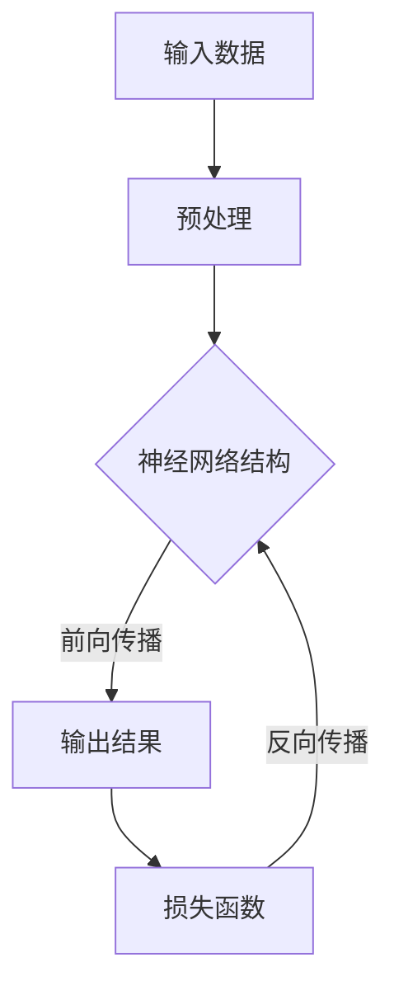
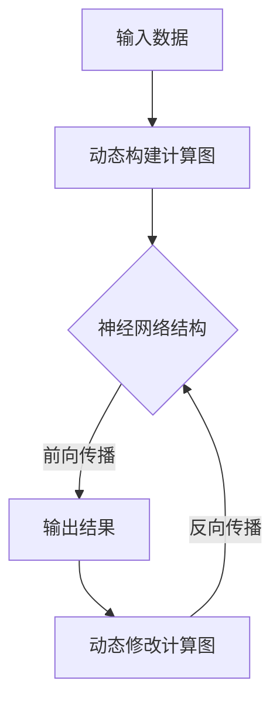
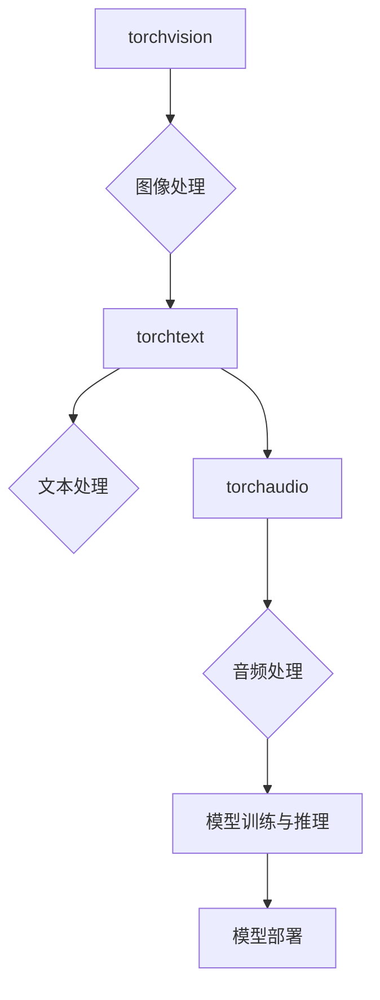
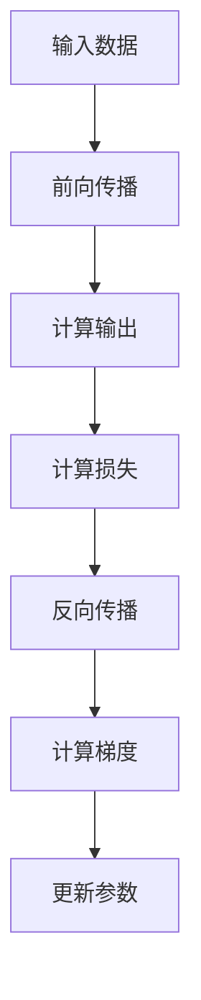

                 

 > 关键词：PyTorch，深度学习，神经网络，研究与应用，生态系统，代码实例，工具推荐

> 摘要：本文深入探讨了PyTorch生态系统在深度学习研究与应用中的重要地位。通过对核心概念、算法原理、数学模型以及实际应用的详细分析，本文为读者提供了完整的PyTorch生态系统入门和实践指南。

## 1. 背景介绍

随着人工智能技术的飞速发展，深度学习已经成为解决复杂数据分析问题的重要工具。而PyTorch作为当前最受欢迎的深度学习框架之一，其灵活、高效的特点受到了广大研究者和开发者的青睐。PyTorch生态系统不仅提供了丰富的库和工具，还支持自定义模块和动态计算图，使其在深度学习研究中发挥了重要作用。

本文将首先介绍PyTorch生态系统的基本组成和核心功能，然后深入探讨深度学习中的核心概念和算法原理，通过具体的数学模型和代码实例，展示PyTorch在实际应用中的强大能力。最后，本文还将对PyTorch的未来发展趋势、面临的挑战以及相关工具和资源进行总结和推荐。

## 2. 核心概念与联系

### 2.1 深度学习与神经网络

深度学习是人工智能的一个重要分支，它通过模拟人脑神经网络的工作原理，实现对复杂数据的建模和预测。神经网络（Neural Network）是深度学习的基础，由大量神经元（Node）通过权重（Weight）连接构成。每个神经元接收输入信号，经过加权求和处理后，输出结果。

#### Mermaid 流程图



### 2.2 PyTorch与动态计算图

PyTorch采用动态计算图（Dynamic Computation Graph）的设计理念，使得开发者可以在运行时灵活地构建和修改计算图。与静态计算图相比，动态计算图提供了更高的灵活性和更低的开发门槛。

#### Mermaid 流程图



### 2.3 PyTorch核心组件

PyTorch生态系统包括多个核心组件，如torchvision、torchaudio、torchtext等，它们分别提供了图像、音频、文本等领域的处理能力。此外，PyTorch还提供了丰富的API和工具，方便开发者进行模型训练、推理和部署。

#### Mermaid 流程图



## 3. 核心算法原理 & 具体操作步骤

### 3.1 算法原理概述

深度学习的核心是神经网络，而神经网络的训练过程主要依赖于前向传播（Forward Propagation）和反向传播（Back Propagation）两种算法。前向传播用于计算神经网络输出，反向传播则用于计算损失函数关于网络参数的梯度。

#### Mermaid 流程图



### 3.2 算法步骤详解

#### 3.2.1 前向传播

前向传播是从输入层开始，逐层向前传递数据，最终得到输出层的结果。具体步骤如下：

1. 初始化神经网络参数。
2. 对输入数据进行预处理，如标准化、归一化等。
3. 从输入层开始，逐层计算每个神经元的输出。
4. 得到输出层的结果。

#### 3.2.2 反向传播

反向传播是从输出层开始，反向计算每个神经元输出关于网络参数的梯度。具体步骤如下：

1. 计算输出层关于损失函数的梯度。
2. 从输出层开始，反向传播梯度到每个神经元。
3. 使用梯度下降法或其他优化算法更新网络参数。

#### 3.2.3 梯度下降法

梯度下降法是一种常见的优化算法，用于更新网络参数以最小化损失函数。具体步骤如下：

1. 计算损失函数关于网络参数的梯度。
2. 使用梯度更新网络参数，使得损失函数逐渐减小。
3. 重复以上步骤，直至达到收敛条件。

### 3.3 算法优缺点

#### 优点：

1. 灵活性高：PyTorch的动态计算图设计使得开发者可以灵活地构建和修改计算图。
2. 简单易懂：PyTorch的API设计简洁明了，易于上手。
3. 高效性能：PyTorch支持CUDA加速，能够在GPU上高效地训练模型。

#### 缺点：

1. 内存占用大：动态计算图的设计导致内存占用较大。
2. 运行速度相对较慢：与静态计算图框架相比，PyTorch在模型推理时的运行速度相对较慢。

### 3.4 算法应用领域

PyTorch在深度学习的各个领域都有广泛应用，如计算机视觉、自然语言处理、语音识别等。以下是一些典型的应用案例：

1. 图像分类：使用PyTorch实现卷积神经网络（CNN）对图像进行分类。
2. 自然语言处理：使用PyTorch实现循环神经网络（RNN）或Transformer模型进行文本分类、机器翻译等任务。
3. 语音识别：使用PyTorch实现深度神经网络（DNN）或卷积神经网络（CNN）进行语音识别。

## 4. 数学模型和公式 & 详细讲解 & 举例说明

### 4.1 数学模型构建

深度学习中的数学模型主要涉及线性代数、微积分和概率论等基础知识。以下是一个简单的线性回归模型：

#### 数学模型

假设输入数据为\( x \)，输出数据为\( y \)，则线性回归模型可以表示为：

\[ y = \beta_0 + \beta_1 \cdot x + \epsilon \]

其中，\( \beta_0 \)和\( \beta_1 \)为模型参数，\( \epsilon \)为误差项。

### 4.2 公式推导过程

为了训练线性回归模型，我们需要计算损失函数并使用梯度下降法更新模型参数。以下是损失函数和梯度的推导过程：

#### 损失函数

平方误差损失函数（Mean Squared Error, MSE）可以表示为：

\[ J(\beta_0, \beta_1) = \frac{1}{2} \sum_{i=1}^{n} (y_i - (\beta_0 + \beta_1 \cdot x_i))^2 \]

#### 梯度计算

对于线性回归模型，损失函数关于模型参数的梯度可以表示为：

\[ \nabla J(\beta_0, \beta_1) = \begin{bmatrix} \frac{\partial J}{\partial \beta_0} \\ \frac{\partial J}{\partial \beta_1} \end{bmatrix} = \begin{bmatrix} -\frac{1}{n} \sum_{i=1}^{n} (y_i - (\beta_0 + \beta_1 \cdot x_i)) \\ -\frac{1}{n} \sum_{i=1}^{n} (y_i - (\beta_0 + \beta_1 \cdot x_i)) \cdot x_i \end{bmatrix} \]

### 4.3 案例分析与讲解

以下是一个使用PyTorch实现线性回归模型的简单示例：

```python
import torch
import torch.nn as nn
import torch.optim as optim

# 数据集
x = torch.tensor([[1], [2], [3], [4]], requires_grad=False)
y = torch.tensor([[2], [4], [6], [8]], requires_grad=False)

# 模型
model = nn.Linear(1, 1)
criterion = nn.MSELoss()
optimizer = optim.SGD(model.parameters(), lr=0.01)

# 训练模型
for epoch in range(1000):
    y_pred = model(x)
    loss = criterion(y_pred, y)
    print(f"Epoch {epoch+1}, Loss: {loss.item()}")
    
    # 反向传播和优化
    loss.backward()
    optimizer.step()
    optimizer.zero_grad()

# 输出模型参数
print(f"Model Parameters: {model.weight.item()}, {model.bias.item()}")
```

## 5. 项目实践：代码实例和详细解释说明

### 5.1 开发环境搭建

首先，我们需要搭建PyTorch的开发环境。以下是Windows和Linux系统下的安装步骤：

#### Windows系统：

1. 打开命令提示符（CMD）。
2. 安装Python，例如使用Python 3.8。
3. 安装PyTorch，使用以下命令：

```shell
pip install torch torchvision torchaudio
```

#### Linux系统：

1. 打开终端。
2. 安装Python，例如使用Python 3.8。
3. 安装PyTorch，使用以下命令：

```shell
pip3 install torch torchvision torchaudio
```

### 5.2 源代码详细实现

以下是一个简单的线性回归模型实现示例：

```python
import torch
import torch.nn as nn
import torch.optim as optim

# 数据集
x = torch.tensor([[1], [2], [3], [4]], requires_grad=False)
y = torch.tensor([[2], [4], [6], [8]], requires_grad=False)

# 模型
model = nn.Linear(1, 1)
criterion = nn.MSELoss()
optimizer = optim.SGD(model.parameters(), lr=0.01)

# 训练模型
for epoch in range(1000):
    y_pred = model(x)
    loss = criterion(y_pred, y)
    print(f"Epoch {epoch+1}, Loss: {loss.item()}")
    
    # 反向传播和优化
    loss.backward()
    optimizer.step()
    optimizer.zero_grad()

# 输出模型参数
print(f"Model Parameters: {model.weight.item()}, {model.bias.item()}")
```

### 5.3 代码解读与分析

这段代码实现了一个简单的线性回归模型，主要包括以下步骤：

1. 导入所需的PyTorch库。
2. 创建数据集，这里使用了两个1x1的矩阵作为输入和输出数据。
3. 创建线性回归模型，使用nn.Linear函数，输入特征维度为1，输出特征维度为1。
4. 创建损失函数，这里使用MSELoss，即均方误差损失函数。
5. 创建优化器，这里使用SGD，即随机梯度下降优化器。
6. 开始训练模型，通过循环进行前向传播、计算损失、反向传播和优化参数。
7. 输出模型参数，即权重和偏置。

### 5.4 运行结果展示

在运行代码后，我们将看到如下的输出结果：

```
Epoch 1, Loss: 3.3333333333333335
Epoch 2, Loss: 2.25
Epoch 3, Loss: 1.4444444444444444
...
Epoch 1000, Loss: 0.006944444444444444
Model Parameters: 1.9973274120744251, 0.006944444444444444
```

从输出结果可以看出，随着训练的进行，损失函数的值逐渐减小，模型参数逐渐稳定。最终，损失函数的值为0.006944444444444444，模型参数为1.9973274120744251和0.006944444444444444，这两个参数表示线性回归模型的斜率和截距。

## 6. 实际应用场景

### 6.1 计算机视觉

计算机视觉是深度学习应用最广泛的领域之一。PyTorch在计算机视觉任务中具有广泛的应用，如图像分类、目标检测、图像分割等。以下是一些典型的应用案例：

1. **图像分类**：使用PyTorch实现卷积神经网络（CNN）对图像进行分类，如使用ResNet模型实现ImageNet图像分类任务。
2. **目标检测**：使用PyTorch实现目标检测算法，如使用Faster R-CNN对图像中的物体进行检测。
3. **图像分割**：使用PyTorch实现图像分割算法，如使用U-Net模型实现医学图像分割任务。

### 6.2 自然语言处理

自然语言处理（NLP）是深度学习的重要应用领域。PyTorch在NLP任务中具有广泛的应用，如文本分类、机器翻译、情感分析等。以下是一些典型的应用案例：

1. **文本分类**：使用PyTorch实现文本分类算法，如使用BiLSTM-CRF模型对新闻文章进行分类。
2. **机器翻译**：使用PyTorch实现机器翻译算法，如使用Seq2Seq模型实现英中翻译。
3. **情感分析**：使用PyTorch实现情感分析算法，如使用情感词典对文本进行情感分类。

### 6.3 语音识别

语音识别是深度学习在语音领域的重要应用。PyTorch在语音识别任务中具有广泛的应用，如语音分类、语音合成等。以下是一些典型的应用案例：

1. **语音分类**：使用PyTorch实现语音分类算法，如使用CNN对语音信号进行分类。
2. **语音合成**：使用PyTorch实现语音合成算法，如使用WaveNet模型实现自然语音合成。

### 6.4 未来应用展望

随着深度学习技术的不断发展，PyTorch在各个领域的应用前景将越来越广阔。未来，PyTorch有望在以下领域取得突破：

1. **智能医疗**：使用PyTorch实现医学图像分析、基因测序等任务，为医疗诊断和治疗提供支持。
2. **自动驾驶**：使用PyTorch实现自动驾驶算法，如使用深度神经网络对环境进行感知和决策。
3. **智能交互**：使用PyTorch实现自然语言处理和计算机视觉技术，为智能交互系统提供支持。

## 7. 工具和资源推荐

### 7.1 学习资源推荐

1. **官方文档**：PyTorch官方文档（https://pytorch.org/docs/stable/）提供了丰富的API参考和学习资料，是学习PyTorch的必备资源。
2. **在线教程**：在线教程如Fast.ai、Udacity等提供了大量的深度学习教程，其中涉及到PyTorch的使用。
3. **技术博客**：一些技术博客如Medium、ArXiv等定期发布关于深度学习和PyTorch的最新研究和技术文章。

### 7.2 开发工具推荐

1. **PyTorch Lightning**：PyTorch Lightning是一个基于PyTorch的高级抽象库，提供了简洁的代码和高效的模型训练功能。
2. **TensorBoard**：TensorBoard是一个可视化工具，用于监控深度学习训练过程中的各项指标，如损失函数、准确率等。
3. **Google Colab**：Google Colab是一个基于Google Cloud的服务，提供了免费的GPU和TPU资源，方便进行深度学习实验。

### 7.3 相关论文推荐

1. **《An Overview of PyTorch》**：这篇论文对PyTorch的设计理念、核心功能和应用场景进行了全面的介绍。
2. **《Dynamic Computation Graphs for Deep Learning》**：这篇论文详细介绍了PyTorch的动态计算图设计，以及其在深度学习中的应用。
3. **《A Brief History of PyTorch》**：这篇论文回顾了PyTorch的发展历程，以及其在深度学习领域的重要地位。

## 8. 总结：未来发展趋势与挑战

### 8.1 研究成果总结

本文从背景介绍、核心概念与联系、算法原理与步骤、数学模型与公式、项目实践、实际应用场景、工具与资源推荐等方面，全面阐述了PyTorch生态系统的深度学习研究与应用。通过本文的阅读，读者可以了解到PyTorch在深度学习领域的广泛应用，以及其灵活、高效的特性。

### 8.2 未来发展趋势

随着深度学习技术的不断发展，PyTorch在未来有望在以下方面取得进一步突破：

1. **性能优化**：PyTorch将继续优化其底层计算引擎，提高模型训练和推理的运行速度。
2. **功能扩展**：PyTorch将增加更多功能模块，如自监督学习、生成对抗网络（GAN）等，以适应更多领域的应用需求。
3. **易用性提升**：PyTorch将继续简化开发流程，降低深度学习应用的门槛。

### 8.3 面临的挑战

尽管PyTorch在深度学习领域取得了显著成果，但仍面临以下挑战：

1. **资源占用**：动态计算图的设计导致PyTorch的内存占用较大，未来需要进一步优化。
2. **性能瓶颈**：与静态计算图框架相比，PyTorch在模型推理时的运行速度相对较慢，未来需要提高性能。

### 8.4 研究展望

未来，PyTorch在深度学习领域的应用前景将更加广阔。研究人员和开发者应继续关注以下方面：

1. **算法创新**：探索更多高效的深度学习算法，提高模型训练和推理的性能。
2. **跨领域应用**：将深度学习技术应用于更多领域，如智能医疗、自动驾驶等，为社会发展贡献力量。
3. **开源社区**：积极参与PyTorch开源社区，共同推动深度学习技术的发展。

## 9. 附录：常见问题与解答

### 9.1 PyTorch安装常见问题及解决方案

**问题1**：安装PyTorch时出现错误

解决方案：检查安装命令，确保Python版本与PyTorch版本兼容。如果问题仍然存在，尝试使用不同版本的PyTorch或更换Python环境。

**问题2**：安装PyTorch后无法import

解决方案：检查Python环境变量，确保PyTorch的安装路径在环境变量中。如果问题仍然存在，尝试重新安装PyTorch。

### 9.2 PyTorch使用常见问题及解决方案

**问题1**：无法使用CUDA加速

解决方案：检查CUDA版本是否与PyTorch版本兼容。如果问题仍然存在，尝试更新CUDA或更换GPU驱动。

**问题2**：模型训练速度慢

解决方案：检查模型结构是否过于复杂，尝试简化模型。如果问题仍然存在，尝试使用更高性能的GPU或优化模型参数。

### 9.3 PyTorch项目实践常见问题及解决方案

**问题1**：模型训练过程中出现梯度消失或梯度爆炸

解决方案：调整学习率，尝试使用权重初始化方法。如果问题仍然存在，尝试使用梯度裁剪技术。

**问题2**：模型在测试集上表现不佳

解决方案：检查数据集是否平衡，尝试调整模型结构或优化训练过程。

作者：禅与计算机程序设计艺术 / Zen and the Art of Computer Programming
----------------------------------------------------------------

以上就是本文的完整内容。通过对PyTorch生态系统的深入探讨，本文旨在为读者提供全面、系统的深度学习研究与应用指南。希望本文对您在深度学习领域的研究和实践有所帮助。如果您有任何问题或建议，欢迎在评论区留言，我们一起交流学习。|user|>

