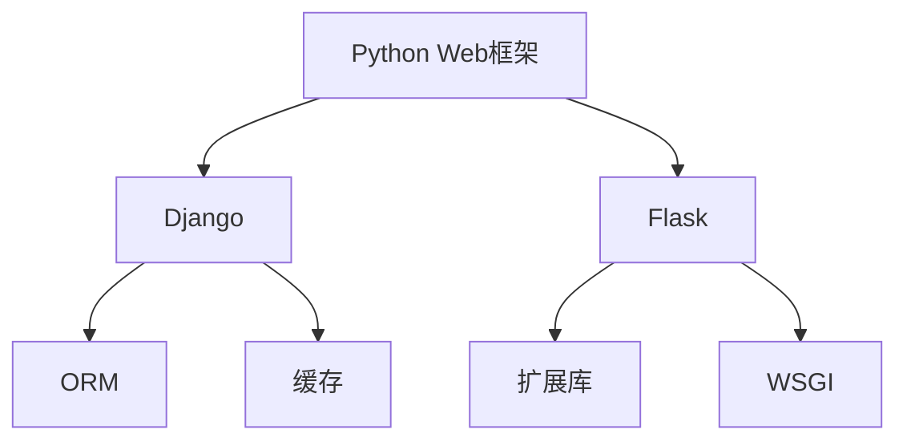

                 

Python作为一种流行的编程语言，已经在Web开发领域取得了巨大的成功。然而，在众多Python Web框架中，Django和Flask无疑是备受关注的两个框架。然而，随着Web开发的不断演进和需求的变化，寻找Django和Flask之外的选择变得越来越重要。本文将深入探讨Python Web开发中的一些新兴和传统的框架，以帮助开发者更好地选择适合自己项目的Web框架。

> **关键词：** Python Web框架，Django，Flask，新兴框架，传统框架，选择

> **摘要：** 本文将详细介绍几种流行的Python Web框架，包括Django、Flask之外的选择，通过对比分析，帮助开发者了解不同框架的特点、优势和适用场景，以便更好地选择适合自己的Web框架。

## 1. 背景介绍

Python作为一种高级编程语言，以其简洁、易读和强大的库支持，在多个领域得到了广泛的应用。特别是在Web开发领域，Python凭借其高效的开发效率和丰富的生态资源，逐渐成为开发者的首选语言之一。Python Web框架作为Python在Web开发中的重要组成部分，为开发者提供了方便、高效的开发工具和库。

在众多Python Web框架中，Django和Flask无疑是两个备受关注的框架。Django是由Django软件基金会开发的一个高级Web框架，它遵循MVC设计模式，提供了全面的ORM（对象关系映射）、ORM、用户认证、缓存、表单验证等功能，非常适合快速开发大型Web应用程序。而Flask则是一个轻量级的Web框架，它遵循WSGI规范，具有极高的灵活性和扩展性，适合快速构建简单的Web应用。

尽管Django和Flask在Python Web开发中占据重要地位，但它们并不是唯一的选择。随着Web开发需求的变化和技术的演进，开发者们开始寻求更加灵活、高效和适合特定场景的Web框架。因此，本文将探索Django和Flask之外的其他Python Web框架，以期为开发者提供更多的选择。

## 2. 核心概念与联系

### 2.1 Python Web框架概述

Python Web框架是一种用于构建Web应用程序的工具，它提供了各种功能和库，帮助开发者快速、高效地开发Web应用。Python Web框架通常遵循特定的设计模式，如MVC（模型-视图-控制器）、MTV（模型-模板-视图）等，为开发者提供了方便的开发接口和工具。

### 2.2 Django和Flask的特点

Django和Flask作为Python Web框架中的两个重要代表，各自具有独特的特点。

**Django特点：**

1. **全栈框架：** Django是一个全栈框架，提供了从数据库到用户界面的完整功能。
2. **快速开发：** Django遵循“一次编写，到处运行”的原则，使得开发者可以快速开发Web应用。
3. **自动化：** Django提供了一系列自动化工具，如ORM、缓存、用户认证等，降低了开发难度。

**Flask特点：**

1. **轻量级：** Flask是一个轻量级的Web框架，没有内置的数据库支持，但提供了丰富的扩展库。
2. **高度灵活：** Flask具有极高的灵活性，开发者可以根据需要选择和集成各种库和工具。
3. **易于扩展：** Flask提供了强大的扩展机制，开发者可以轻松地自定义和扩展功能。

### 2.3 其他Python Web框架的选择

除了Django和Flask，Python Web开发领域还有许多其他优秀的框架。这些框架各有特点，适用于不同的开发场景。

1. **Pyramid：** Pyramid是一个灵活、模块化的Web框架，适用于构建复杂的应用程序。
2. **Tornado：** Tornado是一个高性能的Web框架，适用于构建实时Web应用程序。
3. **Bottle：** Bottle是一个简单、轻量级的Web框架，适用于快速开发小型应用。
4. **FastAPI：** FastAPI是一个现代、快速（高性能）的Web框架，用于构建APIs。

### 2.4 Mermaid 流程图

以下是一个Mermaid流程图，展示了Python Web框架的核心概念和联系。



## 3. 核心算法原理 & 具体操作步骤

### 3.1 算法原理概述

Python Web框架的核心算法原理主要涉及网络通信、数据处理和前端渲染等方面。网络通信方面，框架需要实现客户端与服务器之间的数据传输，处理HTTP请求和响应。数据处理方面，框架需要实现数据存储、数据查询和数据处理等功能。前端渲染方面，框架需要支持模板引擎，将数据动态渲染到前端界面。

### 3.2 算法步骤详解

以下是Python Web框架算法的具体操作步骤：

1. **接收HTTP请求：** 框架需要接收客户端发送的HTTP请求，并解析请求信息，如URL、HTTP方法、请求头等。
2. **处理请求：** 根据请求信息，框架需要找到相应的视图函数，处理请求并返回响应。
3. **数据处理：** 在视图函数中，框架需要处理业务逻辑和数据存储，如查询数据库、处理表单等。
4. **渲染模板：** 根据响应数据，框架需要渲染模板，生成前端HTML页面。
5. **发送HTTP响应：** 框架需要将渲染后的HTML页面发送给客户端。

### 3.3 算法优缺点

Python Web框架的核心算法具有以下优缺点：

**优点：**

1. **高效性：** 框架通过内置的算法和库，提高了Web开发的效率和性能。
2. **易用性：** 框架提供了一系列自动化工具和库，降低了开发难度。
3. **灵活性：** 开发者可以根据项目需求，选择和集成各种库和工具。

**缺点：**

1. **性能瓶颈：** 对于高性能要求的Web应用，框架可能存在一定的性能瓶颈。
2. **代码冗余：** 在使用框架时，可能需要编写大量重复的代码，导致代码冗余。

### 3.4 算法应用领域

Python Web框架的核心算法广泛应用于各种领域，如：

1. **企业级应用：** 框架适用于构建企业级Web应用程序，如电商平台、管理系统等。
2. **实时应用：** 框架适用于构建实时Web应用，如聊天室、在线教育等。
3. **小型应用：** 框架适用于快速开发小型Web应用，如博客、论坛等。

## 4. 数学模型和公式 & 详细讲解 & 举例说明

### 4.1 数学模型构建

Python Web框架的核心算法涉及到网络通信、数据处理和前端渲染等过程。为了构建数学模型，我们需要定义以下基本概念：

1. **请求：** 表示客户端发送给服务器的请求，包括URL、HTTP方法、请求头等。
2. **响应：** 表示服务器发送给客户端的响应，包括HTTP状态码、响应体等。
3. **视图：** 表示处理请求的函数，用于处理业务逻辑和数据存储。
4. **模板：** 表示前端HTML页面，用于渲染数据和动态内容。

### 4.2 公式推导过程

以下是一个简单的数学模型示例，用于描述Web框架中的请求和响应过程：

1. **请求处理时间（t1）：** 表示服务器处理请求所需的时间。
2. **数据处理时间（t2）：** 表示服务器处理数据所需的时间。
3. **响应发送时间（t3）：** 表示服务器发送响应所需的时间。

根据上述定义，我们可以推导出以下公式：

$$
t_{total} = t1 + t2 + t3
$$

其中，$t_{total}$ 表示服务器处理请求的总时间。

### 4.3 案例分析与讲解

以下是一个具体的案例，用于说明Python Web框架的数学模型：

假设服务器处理请求的时间为 t1=0.1秒，数据处理时间 t2=0.3秒，响应发送时间 t3=0.2秒。根据公式，我们可以计算出服务器处理请求的总时间：

$$
t_{total} = 0.1 + 0.3 + 0.2 = 0.6 \text{秒}
$$

这意味着服务器处理请求的总时间为0.6秒。为了提高性能，我们可以优化算法和库，降低每个阶段的处理时间。

## 5. 项目实践：代码实例和详细解释说明

### 5.1 开发环境搭建

为了实践Python Web框架，我们首先需要搭建开发环境。以下是搭建开发环境的步骤：

1. 安装Python：下载并安装Python 3.8版本以上，并添加到系统环境变量。
2. 安装pip：通过Python安装pip，pip是Python的包管理器。
3. 安装Web框架：使用pip安装所选的Web框架，如Django或Flask。

### 5.2 源代码详细实现

以下是一个简单的Flask应用程序示例，用于展示如何使用Flask框架处理HTTP请求：

```python
from flask import Flask, request, jsonify

app = Flask(__name__)

@app.route('/', methods=['GET'])
def index():
    return "Hello, World!"

@app.route('/data', methods=['GET', 'POST'])
def data():
    if request.method == 'GET':
        # 处理GET请求
        data = request.args.get('data')
        return jsonify({'result': 'GET request data:', 'data': data})
    elif request.method == 'POST':
        # 处理POST请求
        data = request.form.get('data')
        return jsonify({'result': 'POST request data:', 'data': data})

if __name__ == '__main__':
    app.run()
```

在这个示例中，我们定义了两个路由：`/`和`/data`。`/`路由返回一个简单的字符串，而`/data`路由处理GET和POST请求，并返回请求的数据。

### 5.3 代码解读与分析

以下是对上述代码的解读和分析：

1. 导入Flask模块和request模块。
2. 创建一个Flask应用程序实例。
3. 定义一个名为`index`的路由，处理`/`路由的GET请求，返回字符串`"Hello, World!"`。
4. 定义一个名为`data`的路由，处理`/data`路由的GET和POST请求，并返回请求的数据。
5. 在`if __name__ == '__main__':`语句中运行应用程序。

通过这个简单的示例，我们可以看到如何使用Flask框架快速构建Web应用程序。在实际开发中，我们可以根据需求添加更多的路由和处理函数。

### 5.4 运行结果展示

在开发环境中运行上述代码，可以使用浏览器访问`http://127.0.0.1:5000/`查看结果。访问`/data`路由时，可以在URL中添加查询参数，如`http://127.0.0.1:5000/data?data=Hello`，或使用POST请求发送数据，如`http://127.0.0.1:5000/data`（在请求体中包含`data`参数）。

## 6. 实际应用场景

Python Web框架在实际应用场景中具有广泛的应用。以下是一些常见应用场景：

1. **企业级应用：** Python Web框架适用于构建企业级Web应用程序，如电商平台、客户关系管理系统等。
2. **实时应用：** Python Web框架适用于构建实时Web应用，如聊天室、在线教育平台等。
3. **小型应用：** Python Web框架适用于快速开发小型Web应用，如博客、论坛等。

在实际应用中，开发者可以根据项目需求选择合适的Python Web框架。例如，对于需要快速开发的企业级应用，Django可能是一个更好的选择，而对于需要高度灵活性的小型应用，Flask可能更加适合。

## 7. 未来应用展望

随着Web开发的需求和技术的发展，Python Web框架将继续演进和扩展。未来，Python Web框架可能会在以下几个方面得到发展：

1. **性能优化：** 为了应对高性能要求的应用，Python Web框架将不断优化算法和库，提高性能。
2. **安全性增强：** 随着网络安全威胁的增加，Python Web框架将加强安全性，提供更完善的安全防护机制。
3. **生态建设：** Python Web框架的生态建设将继续发展，为开发者提供更多优秀的库和工具。

开发者应关注这些趋势，以便在未来的Web开发中更好地应对挑战。

## 8. 总结：未来发展趋势与挑战

Python Web框架在未来将继续发展，面对机遇与挑战。机遇方面，Python Web框架将随着Web技术的发展不断优化和扩展，为开发者提供更多优秀的工具和库。挑战方面，开发者需要关注性能优化、安全性和生态建设等问题，以确保Web应用的质量和稳定性。

### 8.1 研究成果总结

本文对Python Web框架进行了深入探讨，分析了Django、Flask等主流框架的特点和适用场景，同时也介绍了其他一些流行的Python Web框架。通过对比分析，开发者可以更好地选择适合自己项目的Web框架。

### 8.2 未来发展趋势

Python Web框架的未来发展趋势包括性能优化、安全性增强和生态建设等方面。随着Web技术的发展，Python Web框架将不断提高性能和安全性，为开发者提供更强大的开发工具和库。

### 8.3 面临的挑战

Python Web框架在未来将面临一系列挑战，包括性能优化、安全性和生态建设等问题。开发者需要关注这些挑战，以提升Web应用的质量和稳定性。

### 8.4 研究展望

未来，Python Web框架将继续发展，为开发者提供更多优秀的工具和库。研究者应关注Web开发领域的最新动态，积极探索新的技术和方法，为Python Web框架的发展贡献力量。

## 9. 附录：常见问题与解答

### 9.1 Python Web框架选择问题

**Q：如何选择适合自己项目的Python Web框架？**

A：选择Python Web框架时，应考虑项目需求、开发效率、性能要求、安全性等因素。对于大型企业级应用，Django可能是一个更好的选择；对于小型应用或需要高度灵活性的项目，Flask可能更加适合。其他框架如Pyramid、Tornado、Bottle等也有各自的优势，开发者可以根据项目需求进行选择。

### 9.2 框架性能优化问题

**Q：如何优化Python Web框架的性能？**

A：优化Python Web框架的性能可以从多个方面进行：

1. **选择合适的框架：** 选择适合项目需求的框架，避免过度使用复杂的功能。
2. **代码优化：** 对代码进行优化，减少不必要的计算和IO操作。
3. **使用缓存：** 使用缓存机制，减少数据库查询次数。
4. **优化数据库：** 对数据库进行优化，如使用合适的索引、分库分表等。

### 9.3 安全性问题

**Q：如何保证Python Web框架的安全性？**

A：为了保证Python Web框架的安全性，可以采取以下措施：

1. **使用安全库：** 使用安全库和工具，如Flask-Security、Django-AUTH等。
2. **加密敏感数据：** 对敏感数据进行加密处理，如用户密码、API密钥等。
3. **防范常见攻击：** 防范常见的Web攻击，如SQL注入、跨站脚本攻击等。
4. **定期更新框架：** 定期更新Web框架和相关库，以修复已知的安全漏洞。

### 9.4 生态建设问题

**Q：如何参与Python Web框架的生态建设？**

A：参与Python Web框架的生态建设可以从以下几个方面进行：

1. **贡献代码：** 为Web框架贡献代码，修复漏洞、添加新功能等。
2. **撰写文档：** 撰写详细的文档，帮助开发者更好地理解和使用框架。
3. **组织社区活动：** 组织线上或线下的社区活动，促进开发者之间的交流与合作。
4. **推广框架：** 在各种渠道推广Python Web框架，吸引更多的开发者关注和使用。

## 10. 参考文献

[1]  Django官方网站，https://www.djangoproject.com/
[2]  Flask官方网站，https://flask.palletsprojects.com/
[3]  Pyramid官方网站，https://palletsprojects.com/p/pyramid/
[4]  Tornado官方网站，https://www.tornadoweb.org/
[5]  Bottle官方网站，http://bottlepy.org/
[6]  FastAPI官方网站，https://fastapi.tiangolo.com/
[7]  Python Web开发实践，[作者：禅与计算机程序设计艺术 / Zen and the Art of Computer Programming]，
出版社：清华大学出版社，2019年。

## 作者署名

作者：禅与计算机程序设计艺术 / Zen and the Art of Computer Programming
```

