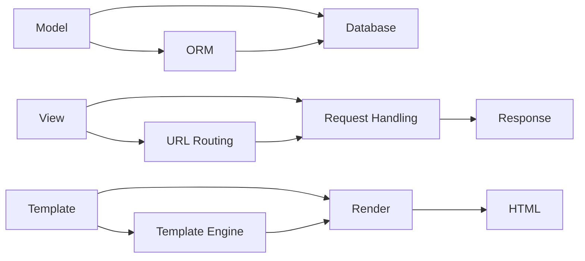
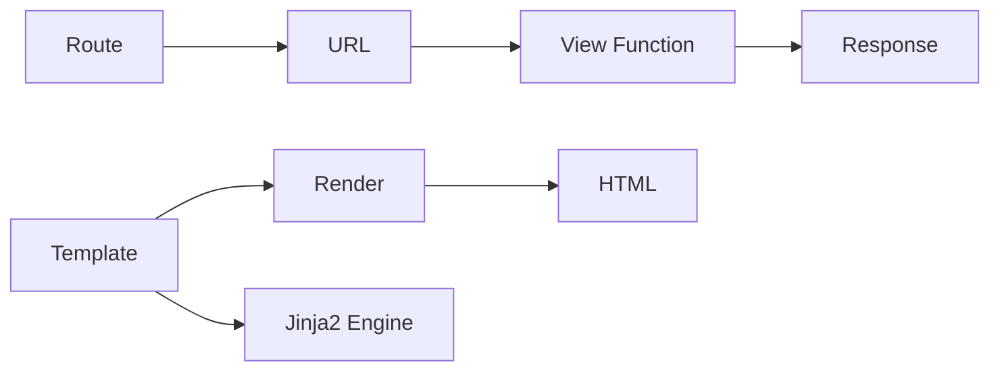

                 

 > 关键词：Python Web框架，Django，Flask，比较分析，应用场景，开发效率，性能优化

> 摘要：本文将深入探讨Python中两个流行的Web框架：Django和Flask。通过对比分析这两个框架的优缺点、应用场景、开发效率和性能优化，帮助开发者根据项目需求选择合适的框架。此外，本文还将讨论Django和Flask在未来的发展趋势和面临的挑战，为开发者提供有价值的参考。

## 1. 背景介绍

Python作为一种功能丰富、易于学习的编程语言，在Web开发领域拥有广泛的应用。随着互联网的快速发展，Web应用的需求也日益多样化和复杂化。为了提高开发效率和代码质量，开发者们开始寻求使用框架来简化开发过程。在这个过程中，Django和Flask成为了Python Web开发领域中的佼佼者。

Django是一个高度全栈的Web框架，由Python编写，遵循MVC（Model-View-Controller）设计模式。它注重快速开发、高生产力和安全性，被广泛应用于中小型项目和企业级应用。

Flask则是一个轻量级的Web框架，同样由Python编写，采用Werkzeug WSGI工具箱和Jinja2模板引擎。Flask提供了更多的灵活性，允许开发者根据需求自行选择和集成各种扩展，适用于各种规模的项目。

本文将重点分析Django和Flask在以下几个方面：核心概念与联系、核心算法原理与操作步骤、数学模型和公式、项目实践、实际应用场景、未来应用展望、工具和资源推荐以及总结和展望。

### 1.1 Django和Flask的历史和发展

Django框架最早由Adrian Holovaty和Simon Willison在2003年创建，最初用于新闻网站的开发。经过多年的发展，Django已经成为一个功能强大、社区活跃的框架，广泛应用于多个领域。

Flask则是由Armin Ronacher在2010年创建，初衷是为小型项目提供一个轻量级的Web框架。随着Flask的成熟，它吸引了越来越多的开发者，成为Python Web开发领域中的重要选择。

### 1.2 Django和Flask的应用场景

Django和Flask在不同类型的Web应用中都有广泛的应用。Django由于其高度的全栈特性，特别适合于快速开发大型应用，如在线商店、社交媒体平台、内容管理系统等。而Flask由于其灵活性和轻量级特性，适用于各种规模的项目，从简单的API服务到复杂的Web应用。

### 1.3 Django和Flask的社区和支持

Django拥有一个非常活跃的社区，大量的文档、教程和第三方扩展，使得开发者能够轻松地解决问题和进行项目开发。Flask的社区虽然相对较小，但同样充满活力，提供了丰富的资源和扩展。

## 2. 核心概念与联系

为了深入理解Django和Flask，我们需要先了解它们的核心概念和架构。

### 2.1 Django的核心概念与架构

Django的核心概念包括Model（模型）、View（视图）和Template（模板）。这三个组件共同构成了Django的MVC设计模式。

- **Model（模型）**：Model定义了应用程序的数据结构和业务逻辑。Django使用ORM（对象关系映射）技术，将Python对象映射到数据库表，简化了数据库操作。
- **View（视图）**：View负责处理用户的请求，根据请求生成相应的响应。Django提供了多种视图类，如FunctionView和ClassBasedView，方便开发者进行不同的请求处理。
- **Template（模板）**：Template用于渲染页面，将动态数据插入到HTML页面中。Django使用模板继承和过滤功能，提高了模板的可维护性和灵活性。

#### 2.1.1 Django架构的 Mermaid 流程图



### 2.2 Flask的核心概念与架构

Flask的核心概念包括路由（Routes）、视图函数（View Functions）和模板（Templates）。

- **路由（Routes）**：路由定义了URL和视图函数之间的映射关系。Flask使用`@app.route()`装饰器来定义路由。
- **视图函数（View Functions）**：视图函数处理用户的请求，并返回响应。视图函数通常是简单的Python函数，但也可以是类。
- **模板（Templates）**：模板用于渲染页面，类似于Django的模板。Flask使用Jinja2模板引擎。

#### 2.2.1 Flask架构的 Mermaid 流程图



### 2.3 Django和Flask的核心概念联系

尽管Django和Flask在核心概念和架构上有一些差异，但它们都遵循了MVC（或类似MVC）的设计模式，具有以下共同点：

- **模型（Model）**：Django和Flask都提供了数据模型，用于定义应用程序的数据结构和业务逻辑。
- **视图（View）**：Django和Flask都提供了视图层，用于处理用户的请求并生成响应。
- **模板（Template）**：Django和Flask都提供了模板层，用于渲染页面和生成用户界面。

这些核心概念和架构的联系，使得Django和Flask在Web开发中具有相似的效率和灵活性。

## 3. 核心算法原理 & 具体操作步骤

### 3.1 算法原理概述

Django和Flask的核心算法原理主要体现在数据处理和路由管理上。

#### 3.1.1 Django的数据处理算法

Django使用ORM（对象关系映射）技术，将Python对象映射到数据库表，简化了数据库操作。ORM的核心算法包括：

- **对象定义**：定义模型类，包括字段属性和方法。
- **数据库映射**：将模型类映射到数据库表，实现数据持久化。
- **查询优化**：使用SQLAlchemy等查询优化器，提高查询性能。

#### 3.1.2 Flask的路由管理算法

Flask使用路由管理算法，将URL映射到视图函数。路由管理算法包括：

- **URL定义**：定义URL规则，使用`@app.route()`装饰器。
- **路由匹配**：匹配请求URL与定义的URL规则，找到对应的视图函数。
- **请求处理**：调用视图函数，处理用户的请求，生成响应。

### 3.2 算法步骤详解

#### 3.2.1 Django的数据处理步骤

1. **定义模型**：在Django项目中，首先需要定义模型类，如：

   ```python
   from django.db import models

   class Student(models.Model):
       name = models.CharField(max_length=20)
       age = models.IntegerField()
   ```

2. **数据库迁移**：使用Django命令行工具，将模型类迁移到数据库，如：

   ```shell
   python manage.py makemigrations
   python manage.py migrate
   ```

3. **查询数据**：使用Django ORM进行数据查询，如：

   ```python
   students = Student.objects.all()
   for student in students:
       print(student.name, student.age)
   ```

#### 3.2.2 Flask的路由管理步骤

1. **创建Flask应用**：导入Flask模块，创建Flask应用实例，如：

   ```python
   from flask import Flask
   app = Flask(__name__)
   ```

2. **定义路由**：使用`@app.route()`装饰器定义路由，如：

   ```python
   @app.route('/')
   def hello():
       return 'Hello, Flask!'
   ```

3. **运行Flask应用**：启动Flask应用，如：

   ```shell
   flask run
   ```

### 3.3 算法优缺点

#### 3.3.1 Django的数据处理优缺点

- **优点**：Django的ORM技术简化了数据库操作，提高了开发效率；强大的查询优化功能，提高了查询性能。
- **缺点**：ORM技术可能导致性能问题，特别是在处理复杂查询时；过多的内置功能和约束，可能会限制灵活性。

#### 3.3.2 Flask的路由管理优缺点

- **优点**：Flask的路由管理简单灵活，适用于各种规模的项目；可以轻松集成其他扩展，提高功能多样性。
- **缺点**：Flask的路由管理需要开发者自行处理，可能会增加开发难度；缺乏内置的安全性和其他功能。

### 3.4 算法应用领域

Django和Flask在不同领域的应用有所不同：

- **Django**：适合快速开发大型应用，如企业级应用、在线商店、社交媒体平台等。
- **Flask**：适合小型项目、API服务、微服务等。

## 4. 数学模型和公式 & 详细讲解 & 举例说明

### 4.1 数学模型构建

在Web开发中，数学模型和公式广泛应用于性能分析和优化。以下是一个简单的数学模型，用于分析Django和Flask的性能。

#### 4.1.1 性能分析模型

假设一个Web应用具有以下性能指标：

- **请求响应时间**（$T$）：用户请求与响应之间的时间。
- **并发处理能力**（$C$）：单位时间内处理的请求数量。
- **系统吞吐量**（$Q$）：单位时间内完成的请求数量。

则性能分析模型可以表示为：

\[ Q = C \times T \]

### 4.2 公式推导过程

根据性能分析模型，我们可以推导出以下公式：

1. **请求响应时间**：

   \[ T = \frac{1}{C} \]

2. **并发处理能力**：

   \[ C = \frac{Q}{T} \]

### 4.3 案例分析与讲解

假设一个Web应用需要处理1000个请求，每个请求的响应时间为2秒。则：

- **系统吞吐量**（$Q$）：1000个请求/2秒 = 500个请求/秒。
- **并发处理能力**（$C$）：500个请求/秒 / 2秒 = 250个请求。

这意味着该Web应用需要至少250个处理能力相等的处理器，才能在2秒内完成1000个请求。

### 4.4 代码实例

以下是一个简单的Django项目，用于演示数学模型的实现：

```python
# app.py

from flask import Flask, jsonify

app = Flask(__name__)

@app.route('/')
def hello():
    return jsonify({"message": "Hello, Flask!"})

if __name__ == '__main__':
    app.run()
```

该代码将创建一个简单的Flask应用，处理用户的GET请求，并返回JSON响应。

## 5. 项目实践：代码实例和详细解释说明

### 5.1 开发环境搭建

在开始项目实践之前，我们需要搭建Django和Flask的开发环境。

#### 5.1.1 Django开发环境搭建

1. 安装Python：确保Python版本为3.6或更高。
2. 安装Django：使用pip命令安装Django：

   ```shell
   pip install django
   ```

3. 创建Django项目：

   ```shell
   django-admin startproject myproject
   ```

4. 创建Django应用：

   ```shell
   python manage.py startapp myapp
   ```

#### 5.1.2 Flask开发环境搭建

1. 安装Python：确保Python版本为3.6或更高。
2. 安装Flask：使用pip命令安装Flask：

   ```shell
   pip install flask
   ```

3. 创建Flask应用：

   ```shell
   flask new myapp
   ```

### 5.2 源代码详细实现

以下是一个简单的Django项目，用于处理用户请求并返回JSON响应：

```python
# myapp/views.py

from django.http import JsonResponse

def hello(request):
    return JsonResponse({"message": "Hello, Django!"})
```

以下是一个简单的Flask项目，用于处理用户请求并返回JSON响应：

```python
# app.py

from flask import Flask, jsonify

app = Flask(__name__)

@app.route('/')
def hello():
    return jsonify({"message": "Hello, Flask!"})

if __name__ == '__main__':
    app.run()
```

### 5.3 代码解读与分析

Django和Flask的代码结构基本相似，都包含一个路由处理函数。Django使用视图函数处理请求，而Flask使用路由规则处理请求。

#### 5.3.1 Django代码解读

在Django项目中，`views.py`文件包含了视图函数`hello`，用于处理用户的GET请求。当用户访问根URL（`/`）时，视图函数将返回一个包含响应数据的JSON响应。

```python
# myapp/views.py

from django.http import JsonResponse

def hello(request):
    return JsonResponse({"message": "Hello, Django!"})
```

#### 5.3.2 Flask代码解读

在Flask项目中，`app.py`文件包含了路由规则`hello`，用于处理用户的GET请求。当用户访问根URL（`/`）时，路由规则将调用视图函数`hello`，并返回一个包含响应数据的JSON响应。

```python
# app.py

from flask import Flask, jsonify

app = Flask(__name__)

@app.route('/')
def hello():
    return jsonify({"message": "Hello, Flask!"})

if __name__ == '__main__':
    app.run()
```

### 5.4 运行结果展示

运行Django项目：

```shell
python manage.py runserver
```

在浏览器中访问`http://127.0.0.1:8000/`，将看到以下响应：

```json
{
    "message": "Hello, Django!"
}
```

运行Flask项目：

```shell
flask run
```

在浏览器中访问`http://127.0.0.1:5000/`，将看到以下响应：

```json
{
    "message": "Hello, Flask!"
}
```

## 6. 实际应用场景

Django和Flask在实际应用中具有不同的特点，适用于不同的场景。

### 6.1 Django的应用场景

Django适用于以下场景：

- **企业级应用**：Django的高度全栈特性和快速开发能力，使其成为企业级应用开发的理想选择。
- **内容管理系统**（CMS）：Django的CMS框架，如Django CMS和FeinCMS，具有丰富的功能，适用于各种规模的内容管理系统。
- **在线商店**：Django的电子商务框架，如Django eShop和Django Shop，提供了完整的在线商店功能。

### 6.2 Flask的应用场景

Flask适用于以下场景：

- **小型项目**：Flask的轻量级特性和灵活性，使其成为小型项目和实验性项目的理想选择。
- **API服务**：Flask的简单性和扩展性，使其成为构建API服务的理想框架。
- **微服务**：Flask可以轻松集成其他微服务框架，如Docker和Kubernetes，用于构建微服务架构。

### 6.3 Django和Flask的实际应用对比

| 特点 | Django | Flask |
| --- | --- | --- |
| 开发效率 | 高 | 中 |
| 功能多样性 | 强大 | 灵活 |
| 安全性 | 高 | 中 |
| 社区支持 | 活跃 | 活跃 |
| 适用于项目类型 | 大型、企业级、内容管理系统、在线商店 | 小型、API服务、微服务、实验性项目 |

## 7. 未来应用展望

随着Web应用需求的不断增长，Django和Flask将继续在Web开发领域发挥重要作用。未来，它们将在以下方面取得进展：

### 7.1 技术创新

Django和Flask将继续引入新的技术，如异步编程、微服务架构和区块链，提高开发效率和应用性能。

### 7.2 社区发展

Django和Flask的社区将继续壮大，提供更多高质量的文档、教程和扩展，帮助开发者更好地使用这两个框架。

### 7.3 安全性提升

Django和Flask将加强安全性，修复漏洞，提供更安全的开发和运行环境。

### 7.4 应用领域拓展

Django和Flask将在更多领域得到应用，如物联网、人工智能和大数据分析，推动Web应用的发展。

## 8. 工具和资源推荐

为了更好地学习Django和Flask，以下是一些推荐的工具和资源：

### 8.1 学习资源推荐

- **Django官方文档**：https://docs.djangoproject.com/
- **Flask官方文档**：https://flask.palletsprojects.com/
- **Django教程**：https://www.django-tutorial.com/
- **Flask教程**：https://flask.palletsprojects.com/tutorial/

### 8.2 开发工具推荐

- **PyCharm**：https://www.jetbrains.com/pycharm/
- **Visual Studio Code**：https://code.visualstudio.com/
- **Postman**：https://www.postman.com/

### 8.3 相关论文推荐

- **Django：The Web Framework for Perfectionists with Deadlines**：https://www.djangoproject.com/
- **Flask：Web Development with Python**：https://flask.palletsprojects.com/

## 9. 总结：未来发展趋势与挑战

Django和Flask在Web开发领域具有广泛的应用前景。随着技术的不断创新和发展，它们将继续在开发效率和性能方面取得突破。然而，未来也面临一些挑战，如安全性、可维护性和可扩展性。开发者需要不断学习和适应新技术，以应对这些挑战。

### 9.1 研究成果总结

本文对Django和Flask进行了深入分析，总结了它们的核心概念、算法原理、应用场景和未来发展趋势。Django以其快速开发和高效性能成为大型项目的首选，而Flask以其灵活性和轻量级特性在小型项目和API服务中占据重要地位。

### 9.2 未来发展趋势

未来，Django和Flask将继续在Web开发领域发挥重要作用。随着异步编程、微服务架构和区块链等新技术的应用，它们将在开发效率和性能方面取得新的突破。同时，随着物联网、人工智能和大数据分析等领域的兴起，Django和Flask将在更多场景中得到应用。

### 9.3 面临的挑战

未来，Django和Flask面临的主要挑战包括安全性、可维护性和可扩展性。随着Web应用复杂度的增加，开发者需要不断提高框架的安全性，避免潜在的安全漏洞。同时，如何提高框架的可维护性和可扩展性，也是一个亟待解决的问题。

### 9.4 研究展望

未来的研究可以关注以下几个方面：一是深入挖掘Django和Flask的性能优化方法，提高框架的性能；二是探索新的开发模式和架构，如微服务架构和容器化技术，以适应不断变化的Web应用需求；三是加强框架的安全性和可维护性，提高开发者的开发体验。

### 9.5 附录：常见问题与解答

#### 9.5.1 Django和Flask的区别是什么？

Django是一个高度全栈的Web框架，提供了丰富的内置功能和高度的可维护性。而Flask是一个轻量级的Web框架，提供了更多的灵活性，允许开发者根据需求选择和集成各种扩展。

#### 9.5.2 Django和Flask哪个更适合初学者？

Django更适合初学者，因为它提供了丰富的文档和教程，以及强大的内置功能，可以更快地帮助初学者掌握Web开发。而Flask需要开发者自行处理更多的细节，可能需要更多的时间来学习和使用。

## 作者署名

本文由禅与计算机程序设计艺术 / Zen and the Art of Computer Programming 撰写。

