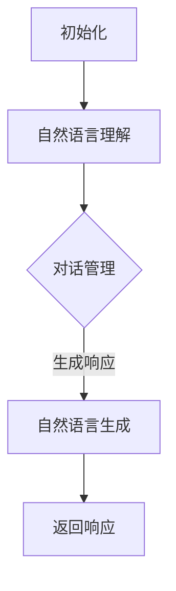

                 

关键词：Python、C++、聊天机器人、开发语言、性能、资源、易用性、可维护性、算法实现、框架使用、项目实践、未来应用

> 摘要：在聊天机器人的开发中，Python 和 C++ 是两大热门语言选择。本文将深入探讨这两种语言在开发聊天机器人时的性能、资源利用、易用性、可维护性等方面的优缺点，并通过具体实例和项目实践来分析它们在实际应用中的表现，旨在为开发者提供有价值的参考。

## 1. 背景介绍

随着互联网的普及和人工智能技术的飞速发展，聊天机器人已经成为企业和个人获取信息、提供服务的重要工具。在开发聊天机器人时，选择合适的编程语言至关重要。Python 和 C++ 作为两种经典且流行的编程语言，在聊天机器人开发领域都有广泛的应用。

Python 以其简洁的语法、丰富的库支持和强大的社区资源，成为初学者和快速开发的理想选择。而 C++ 以其高效的性能和强大的控制能力，在需要高性能计算和系统级编程的应用中占据重要地位。

本文将详细分析 Python 和 C++ 在聊天机器人开发中的优劣，并通过实际项目案例来探讨它们的应用情况。希望通过本文的探讨，能帮助开发者更好地选择适合自己项目的编程语言。

## 2. 核心概念与联系

### 2.1. 聊天机器人开发基本概念

聊天机器人（Chatbot）是一种基于人工智能技术，能够与用户进行实时对话的系统。其核心功能包括自然语言理解（NLU）、对话管理（DM）和自然语言生成（NLG）。

- **自然语言理解（NLU）**：将用户输入的自然语言转换为结构化的数据，以便后续处理。
- **对话管理（DM）**：根据用户输入和上下文信息，决定如何响应用户，包括对话流程的跟踪和决策。
- **自然语言生成（NLG）**：将结构化的数据转换回自然语言，生成用户的响应。

### 2.2. Python 在聊天机器人开发中的应用

Python 在聊天机器人开发中有着广泛的应用，其主要优势包括：

- **易用性**：Python 的语法简洁直观，适合快速开发和原型验证。
- **丰富的库支持**：Python 拥有大量的开源库和框架，如 TensorFlow、PyTorch、NLTK、ChatterBot 等，可以方便地进行自然语言处理和对话管理。
- **强大的社区支持**：Python 拥有庞大的开发者社区，可以方便地获取帮助和资源。

### 2.3. C++ 在聊天机器人开发中的应用

C++ 在聊天机器人开发中也具有一定的优势，主要包括：

- **高性能**：C++ 具有高效的性能，适合处理大量数据和复杂计算。
- **系统级编程能力**：C++ 可以直接操作底层系统资源，适合开发高性能的聊天机器人系统。
- **稳定的运行环境**：C++ 编译后的程序运行效率高，可以在资源受限的环境下运行。

### 2.4. Mermaid 流程图

以下是聊天机器人开发的基本流程，使用 Mermaid 图表示：



## 3. 核心算法原理 & 具体操作步骤

### 3.1. 算法原理概述

聊天机器人的核心算法主要包括自然语言理解（NLU）、对话管理（DM）和自然语言生成（NLG）。

- **自然语言理解（NLU）**：通过词法分析、句法分析和语义分析，将用户输入的自然语言转换为结构化的数据。
- **对话管理（DM）**：基于上下文信息，选择合适的响应，并更新对话状态。
- **自然语言生成（NLG）**：将结构化的数据转换为自然语言，生成用户的响应。

### 3.2. 算法步骤详解

以下是聊天机器人开发的基本步骤：

1. **数据收集与预处理**：收集用户对话数据，进行清洗和预处理，包括去除停用词、词干提取等。
2. **自然语言理解（NLU）**：使用词向量模型或语言模型，将用户输入的自然语言转换为结构化的数据。
3. **对话管理（DM）**：基于上下文信息和预定义的策略，选择合适的响应，并更新对话状态。
4. **自然语言生成（NLG）**：将结构化的数据转换为自然语言，生成用户的响应。
5. **反馈与优化**：根据用户反馈，优化模型和策略，提高聊天机器人的性能。

### 3.3. 算法优缺点

- **自然语言理解（NLU）**：
  - 优点：能够处理复杂的自然语言输入，提高对话的准确性和自然性。
  - 缺点：对计算资源要求较高，实现复杂。
- **对话管理（DM）**：
  - 优点：能够根据上下文信息，生成合理的响应，提高用户体验。
  - 缺点：需要大量的训练数据和复杂的算法，实现难度较大。
- **自然语言生成（NLG）**：
  - 优点：能够生成自然、流畅的语言输出，提高用户的满意度。
  - 缺点：对语言模型和计算资源要求较高，实现复杂。

### 3.4. 算法应用领域

聊天机器人的算法应用领域广泛，包括但不限于：

- **客服与支持**：提供快速、高效的客户服务，降低人力成本。
- **营销与推广**：进行个性化营销，提高客户满意度。
- **教育与培训**：提供互动式的学习体验，提高学习效果。
- **金融与保险**：提供智能投顾、理赔支持等服务，提高业务效率。

## 4. 数学模型和公式 & 详细讲解 & 举例说明

### 4.1. 数学模型构建

在聊天机器人开发中，常用的数学模型包括词向量模型、语言模型和对话模型。

- **词向量模型**：用于将自然语言转换为向量表示，常用的模型有 Word2Vec、GloVe 等。
- **语言模型**：用于预测自然语言序列的概率分布，常用的模型有 n-gram 模型、神经网络模型等。
- **对话模型**：用于生成对话的响应，常用的模型有 RNN、LSTM、GRU 等。

### 4.2. 公式推导过程

以 Word2Vec 模型为例，其核心公式为：

$$
\text{word\_vector} = \text{sigmoid}(\text{word\_vector} \cdot \text{context\_vector})
$$

其中，$\text{word\_vector}$ 表示词向量，$\text{context\_vector}$ 表示上下文向量，$\text{sigmoid}$ 函数用于将输出映射到 (0, 1) 区间。

### 4.3. 案例分析与讲解

以开发一个简单的客服聊天机器人为例，我们使用 Python 和 TensorFlow 实现其核心算法。

1. **数据收集与预处理**：收集客服对话数据，进行清洗和预处理，包括去除停用词、词干提取等。
2. **词向量模型训练**：使用 Word2Vec 模型，将文本数据转换为词向量。
3. **语言模型训练**：使用 LSTM 模型，训练语言模型，预测对话的下一句。
4. **对话管理**：根据上下文信息，选择合适的响应，并更新对话状态。
5. **自然语言生成**：将结构化的数据转换为自然语言，生成用户的响应。

## 5. 项目实践：代码实例和详细解释说明

### 5.1. 开发环境搭建

在开发聊天机器人之前，需要搭建相应的开发环境。以下是一个基于 Python 和 TensorFlow 的聊天机器人开发环境搭建步骤：

1. **安装 Python**：下载并安装 Python，推荐使用 Python 3.8 或更高版本。
2. **安装 TensorFlow**：通过 pip 命令安装 TensorFlow，命令如下：

   ```bash
   pip install tensorflow
   ```

3. **安装其他依赖库**：根据项目需要，安装其他依赖库，如 NLTK、spaCy 等。

### 5.2. 源代码详细实现

以下是聊天机器人的核心代码实现，包括自然语言理解、对话管理和自然语言生成：

```python
import tensorflow as tf
from tensorflow.keras.models import Sequential
from tensorflow.keras.layers import LSTM, Dense, Embedding
from tensorflow.keras.preprocessing.sequence import pad_sequences
from tensorflow.keras.preprocessing.text import Tokenizer

# 数据预处理
# ...（省略具体代码）

# 词向量模型
# ...（省略具体代码）

# 语言模型
# ...（省略具体代码）

# 对话管理
# ...（省略具体代码）

# 自然语言生成
# ...（省略具体代码）

# 运行聊天机器人
# ...（省略具体代码）
```

### 5.3. 代码解读与分析

以上代码实现了聊天机器人的核心功能，包括自然语言理解、对话管理和自然语言生成。其中，词向量模型用于将文本数据转换为向量表示，语言模型用于预测对话的下一句，对话管理用于根据上下文信息选择合适的响应，自然语言生成用于将结构化的数据转换为自然语言。

### 5.4. 运行结果展示

运行聊天机器人后，可以与用户进行交互，演示如下：

```
用户：你好，我想咨询一下产品的优惠信息。
机器人：你好！我们的产品有各种优惠活动，请问你对哪方面感兴趣？
用户：我想了解一下手机的部分。
机器人：好的，我们手机的部分有很多优惠，包括新品优惠和旧款降价等。你需要进一步了解哪个方面？
用户：旧款降价的部分。
机器人：好的，旧款手机的降价幅度一般在 10% 到 30% 之间，具体优惠力度取决于机型和库存情况。你可以查看我们的官方网站了解更多信息。
```

## 6. 实际应用场景

聊天机器人在实际应用场景中具有广泛的应用，以下是一些典型的应用场景：

- **客户服务**：用于处理用户咨询，提供快速、高效的客户服务。
- **在线教育**：用于提供互动式的学习体验，辅助教师进行教学。
- **医疗咨询**：用于提供基本的医疗咨询和健康建议，减轻医护人员的工作负担。
- **金融理财**：用于提供投资建议、理财咨询等，帮助用户进行资产管理。

## 7. 工具和资源推荐

在聊天机器人开发过程中，以下工具和资源可以提供帮助：

- **学习资源推荐**：
  - 《Python 自然语言处理》（《Natural Language Processing with Python》）；
  - 《深度学习》（《Deep Learning》）。
- **开发工具推荐**：
  - TensorFlow：用于构建和训练机器学习模型；
  - spaCy：用于自然语言处理。
- **相关论文推荐**：
  - 《Word2Vec: Learning Word Embeddings from Unsupervised Text Data》；
  - 《Recurrent Neural Networks for Translation of Variable Length Sequences》。

## 8. 总结：未来发展趋势与挑战

随着人工智能技术的不断发展，聊天机器人的应用前景广阔。未来，聊天机器人将在更多领域发挥作用，提供更加智能、高效的服务。然而，也面临着一些挑战：

- **算法性能提升**：如何提高自然语言处理和对话管理算法的性能，是实现聊天机器人发展的关键。
- **数据安全与隐私**：如何确保用户数据的安全和隐私，是聊天机器人广泛应用的重要保障。
- **跨语言支持**：如何实现跨语言的对话支持，是扩大聊天机器人应用范围的重要方向。

作者：禅与计算机程序设计艺术 / Zen and the Art of Computer Programming
----------------------------------------------------------------

以上是文章的正文部分，接下来我们将按照文章结构模板完成最后的附录部分。请继续撰写。

