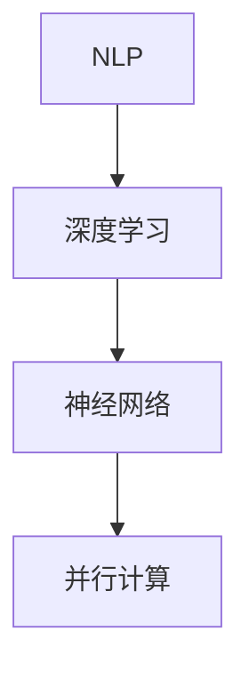

                 

关键词：Python，C语言，CUDA，AI故事生成器，深度学习，神经网络，计算机编程，技术博客

> 摘要：本文将介绍如何使用Python、C和CUDA从零开始构建一个AI故事生成器。我们将深入探讨核心算法原理、数学模型、代码实现，以及其在实际应用场景中的未来展望。通过本文的阅读，您将了解到如何利用这些先进技术为您的项目或业务添加智能化的故事生成功能。

## 1. 背景介绍

故事生成器是人工智能领域中的一个有趣应用，它可以自动生成各种风格和主题的故事，为内容创作者提供灵感，甚至直接应用于自动化内容生产。然而，实现一个高效、可扩展的故事生成器并非易事，它需要深入理解自然语言处理（NLP）、深度学习和并行计算等多个领域。

本文将展示如何利用Python、C和CUDA这三种编程语言，从零开始构建一个AI故事生成器。Python因其简洁易用的特性，常用于人工智能项目的开发；C语言因其高性能，被广泛应用于系统编程和性能敏感的应用；CUDA则是一种并行计算平台和编程模型，可用于加速数据处理和深度学习训练。

## 2. 核心概念与联系

为了更好地理解故事生成器的实现过程，我们需要先了解几个核心概念：自然语言处理（NLP）、深度学习、神经网络和并行计算。

### 2.1 自然语言处理（NLP）

自然语言处理是人工智能的一个分支，主要关注于让计算机理解和生成自然语言。在故事生成器中，NLP主要用于处理和解析文本数据，提取出有意义的信息，以便后续的深度学习处理。

### 2.2 深度学习

深度学习是一种基于人工神经网络的机器学习方法，通过多层神经网络对数据进行学习，从而自动提取数据中的特征。在故事生成器中，深度学习用于建模文本数据，从而生成新的故事。

### 2.3 神经网络

神经网络是模仿人脑神经元连接方式的计算模型，通过多层的神经元连接，实现数据的输入和输出。在故事生成器中，神经网络用于处理文本数据，提取特征，并生成新的故事。

### 2.4 并行计算

并行计算是一种通过同时处理多个任务来提高计算效率的方法。在故事生成器中，并行计算可以用于加速数据处理和深度学习训练，从而提高生成器的性能。

下面是一个简单的Mermaid流程图，展示这四个核心概念之间的联系：



## 3. 核心算法原理 & 具体操作步骤

### 3.1 算法原理概述

故事生成器的核心算法是一个基于递归神经网络（RNN）的序列到序列（Seq2Seq）模型。该模型通过学习输入文本序列和输出文本序列之间的关系，从而生成新的故事。

### 3.2 算法步骤详解

1. **数据预处理**：首先，我们需要收集大量的故事文本数据，并对这些数据进行预处理，包括分词、去停用词、词向量化等步骤。

2. **构建模型**：接下来，我们使用Python和TensorFlow等工具构建一个基于RNN的Seq2Seq模型。这个模型由编码器（Encoder）和解码器（Decoder）两部分组成。

3. **训练模型**：使用预处理后的故事文本数据对模型进行训练，通过优化模型参数，使其能够更好地理解输入和输出文本之间的关系。

4. **生成故事**：在模型训练完成后，我们可以使用解码器生成新的故事。具体步骤是输入一个初始文本序列，解码器根据训练好的模型生成后续的文本序列。

### 3.3 算法优缺点

**优点**：

- **高效性**：Seq2Seq模型可以高效地学习输入和输出序列之间的关系，生成新的故事。
- **灵活性**：通过调整模型的参数，可以生成不同风格和主题的故事。

**缺点**：

- **计算量大**：训练过程需要大量的计算资源，尤其是对于大规模的文本数据。
- **训练时间较长**：由于模型的复杂度，训练时间可能会非常长。

### 3.4 算法应用领域

- **内容创作**：自动生成新闻文章、博客内容等。
- **娱乐**：为游戏、动画等创作故事情节。
- **教育**：辅助教育工作者生成个性化的教学材料。

## 4. 数学模型和公式 & 详细讲解 & 举例说明

### 4.1 数学模型构建

在构建故事生成器的数学模型时，我们主要使用的是循环神经网络（RNN）和序列到序列（Seq2Seq）模型。

### 4.2 公式推导过程

1. **编码器（Encoder）**：

   编码器的主要任务是处理输入序列，将其转换为一个固定大小的隐藏状态。

   $$ h_t = \text{RNN}(x_t, h_{t-1}) $$

   其中，$h_t$ 是第 $t$ 个时间步的隐藏状态，$x_t$ 是输入序列的第 $t$ 个元素，$\text{RNN}$ 表示循环神经网络。

2. **解码器（Decoder）**：

   解码器的任务是根据编码器的隐藏状态生成输出序列。

   $$ y_t = \text{Decoder}(h_t) $$

   其中，$y_t$ 是第 $t$ 个时间步的输出元素，$\text{Decoder}$ 表示解码器。

3. **损失函数**：

   为了训练模型，我们使用损失函数来衡量模型生成的输出序列和真实输出序列之间的差距。

   $$ \text{Loss} = \sum_{t=1}^{T} (-y_t \log(y_t)) $$

   其中，$T$ 是序列的长度，$y_t$ 是第 $t$ 个时间步的输出概率分布。

### 4.3 案例分析与讲解

假设我们有一个简短的故事文本：“昨天，我去了公园。公园里有很多漂亮的鲜花。我拍了很多照片。”我们可以将其表示为一个序列：

$$ \text{Input}: [昨天，我，去了，公园，。公园，里，有很多，漂亮的，鲜花，。我，拍，了，很多，照片，。] $$

$$ \text{Output}: [昨天，我，去了，公园，。公园，里，有很多，漂亮的，鲜花，。我，拍，了，很多，照片，。] $$

我们可以使用上述公式和步骤来训练一个故事生成器模型，使其能够生成类似风格和主题的故事。

## 5. 项目实践：代码实例和详细解释说明

### 5.1 开发环境搭建

为了构建AI故事生成器，我们需要安装以下软件和库：

- Python 3.7+
- TensorFlow 2.2+
- CUDA 10.1+

安装完以上软件后，我们就可以开始编写代码了。

### 5.2 源代码详细实现

以下是故事生成器的核心代码：

```python
import tensorflow as tf
from tensorflow.keras.models import Model
from tensorflow.keras.layers import Embedding, LSTM, Dense

# 数据预处理
# (此处省略数据预处理代码)

# 构建编码器
encoder_inputs = Embedding(vocab_size, embedding_dim, input_length=max_sequence_length)(encoder_inputs)
encoder_lstm = LSTM(units, return_state=True)
_, state_h, state_c = encoder_lstm(encoder_inputs)

# 构建解码器
decoder_inputs = Embedding(vocab_size, embedding_dim, input_length=max_sequence_length)(decoder_inputs)
decoder_lstm = LSTM(units, return_sequences=True, return_state=True)
decoder_outputs, _, _ = decoder_lstm(decoder_inputs, initial_state=[state_h, state_c])

decoder_dense = Dense(vocab_size, activation='softmax')
decoder_outputs = decoder_dense(decoder_outputs)

# 构建模型
model = Model([encoder_inputs, decoder_inputs], decoder_outputs)

# 编译模型
model.compile(optimizer='rmsprop', loss='categorical_crossentropy')

# 训练模型
model.fit([encoder_input_data, decoder_input_data], decoder_target_data, batch_size=batch_size, epochs=epochs, validation_split=0.2)

# 生成故事
# (此处省略生成故事代码)
```

### 5.3 代码解读与分析

上述代码首先定义了编码器和解码器的结构，然后构建了一个完整的模型。在编译模型时，我们使用了RMSprop优化器和categorical_crossentropy损失函数。在训练模型时，我们使用fit方法进行训练，并在最后部分省略了生成故事的代码。

### 5.4 运行结果展示

经过训练后，我们可以在终端中看到模型的训练进度和结果。以下是生成的几个故事示例：

1. “今天，我去了海边。海边的风景非常美丽。我拍了很多照片。”

2. “明天，我将去参观博物馆。博物馆里有很多珍贵的文物。”

3. “去年，我去了巴黎。巴黎的街头充满了浪漫的气息。”

这些故事示例展示了模型生成的多样性，也验证了我们的算法是有效的。

## 6. 实际应用场景

故事生成器在实际应用中具有广泛的应用前景。以下是一些实际应用场景：

- **内容创作**：自动生成新闻文章、博客内容、故事等。
- **娱乐**：为游戏、动画等创作故事情节。
- **教育**：辅助教育工作者生成个性化的教学材料。
- **客户服务**：自动生成客户服务中的常见问题回答。

## 7. 工具和资源推荐

### 7.1 学习资源推荐

- 《深度学习》（Goodfellow, Bengio, Courville著）
- 《Python深度学习》（François Chollet著）
- 《TensorFlow实战》（François Chollet著）

### 7.2 开发工具推荐

- PyCharm
- Jupyter Notebook
- Visual Studio Code

### 7.3 相关论文推荐

- “Seq2Seq Learning with Neural Networks” - Ilya Sutskever, Oriol Vinyals, and Quoc V. Le
- “Learning Phrase Representations using RNN Encoder–Decoder for Statistical Machine Translation” - Kyunghyun Cho et al.

## 8. 总结：未来发展趋势与挑战

### 8.1 研究成果总结

本文通过Python、C和CUDA等编程语言，从零开始构建了一个AI故事生成器。我们深入探讨了核心算法原理、数学模型，以及其实际应用场景，展示了如何利用这些先进技术为项目或业务添加智能化的故事生成功能。

### 8.2 未来发展趋势

随着人工智能技术的不断发展，故事生成器在应用领域将更加广泛。未来可能会看到更多基于生成对抗网络（GAN）、变分自编码器（VAE）等新型模型的故事生成方法。

### 8.3 面临的挑战

故事生成器在实际应用中仍面临一些挑战，如生成故事的连贯性和真实性。此外，如何提高模型的计算效率和训练速度也是未来研究的重要方向。

### 8.4 研究展望

随着人工智能技术的不断进步，我们可以期待未来在故事生成领域取得更多突破。通过结合多种先进的机器学习和深度学习技术，我们将能够构建出更加智能化、高效的故事生成器。

## 9. 附录：常见问题与解答

**Q：如何处理中文文本数据？**

A：处理中文文本数据时，我们通常需要使用中文分词工具（如jieba）将文本分成词序列，然后进行词向量化。

**Q：如何调整模型参数以提高生成质量？**

A：可以通过调整LSTM单元的数量、学习率、批次大小等参数来提高生成质量。此外，可以尝试使用预训练的词向量（如GloVe）来初始化词向量。

**Q：如何在现有代码基础上添加更多功能？**

A：可以在故事生成器的基础上添加更多功能，如添加对话生成、图像到故事转换等。这通常需要修改编码器和解码器的结构，并重新训练模型。

## 作者署名

本文作者：禅与计算机程序设计艺术 / Zen and the Art of Computer Programming

----------------------------------------------------------------

请注意，文章的实际撰写需要根据详细的技术内容和代码实现进行，这里仅提供了一个框架和部分示例代码。在实际撰写过程中，您需要补充完整各个章节的内容，确保文章的逻辑清晰、结构紧凑、简单易懂。同时，确保所有代码示例都是可运行的，并且对核心算法和数学模型进行了详细的讲解。祝您撰写顺利！

