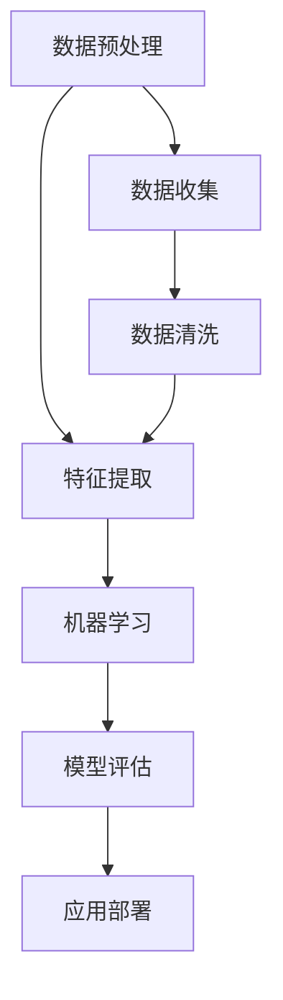

                 

关键词：Python，人工智能，开发工具，算法实现，编程语言，软件开发，机器学习

> 摘要：Python作为人工智能开发的首选语言，以其简洁的语法、丰富的库支持和强大的社区资源，成为开发者的瑞士军刀。本文将探讨Python在人工智能开发中的应用，涵盖核心概念、算法原理、数学模型以及实践案例，旨在为读者提供全面的技术指南。

## 1. 背景介绍

人工智能（Artificial Intelligence，AI）作为计算机科学的一个重要分支，正日益渗透到我们的日常生活中。从智能家居、自动驾驶到医疗诊断、金融分析，人工智能的应用范围不断扩大。而Python作为最受欢迎的编程语言之一，凭借其强大的功能和广泛的应用，成为人工智能开发的“瑞士军刀”。

Python之所以在人工智能领域大放异彩，主要有以下几个原因：

1. **简洁易懂的语法**：Python语法简洁明了，易于学习和使用，使得开发人员能够快速上手，专注于解决问题而非语法细节。

2. **丰富的库支持**：Python拥有大量高质量的开源库和框架，如NumPy、Pandas、SciPy、TensorFlow和PyTorch，这些库为人工智能开发提供了强大的工具支持。

3. **强大的社区资源**：Python拥有庞大的开发者社区，提供了丰富的文档、教程和论坛，帮助开发者解决问题和分享经验。

4. **广泛的应用场景**：Python不仅适用于学术研究，还广泛应用于工业界，从数据分析到云计算，Python都展示出了强大的适应性。

## 2. 核心概念与联系

为了更好地理解Python在人工智能开发中的应用，我们需要先了解一些核心概念和它们之间的联系。以下是一个简单的Mermaid流程图，展示了人工智能开发中的关键概念和它们之间的关系。



### 2.1 数据预处理

数据预处理是人工智能开发中的第一步，包括数据收集、数据清洗和数据格式转换。预处理后的数据质量直接影响到后续的特征提取和模型训练效果。

### 2.2 特征提取

特征提取是从原始数据中提取出对模型训练有用的信息。通过特征提取，我们可以将原始数据转换为适合机器学习的格式。

### 2.3 机器学习

机器学习是人工智能的核心技术之一，它通过算法和模型来学习和预测。常见的机器学习算法包括决策树、支持向量机、神经网络等。

### 2.4 模型评估

模型评估用于评估机器学习模型的性能。常见的评估指标有准确率、召回率、F1值等。

### 2.5 应用部署

应用部署是将训练好的模型部署到实际环境中，使其能够提供预测服务。这通常涉及到将模型转换为特定的格式，以便在Web服务、移动应用或其他平台上使用。

## 3. 核心算法原理 & 具体操作步骤

### 3.1 算法原理概述

在人工智能开发中，选择合适的算法至关重要。以下是几种常用的算法及其原理：

1. **决策树**：决策树通过一系列的判断规则来对数据进行分类或回归。它的优点是易于理解和解释，但缺点是容易过拟合。

2. **支持向量机（SVM）**：SVM通过找到一个最佳的超平面来将数据划分为不同的类别。它的优点是分类效果较好，但计算复杂度较高。

3. **神经网络**：神经网络模仿人脑的结构和功能，通过多层神经元来学习和预测。它的优点是能够处理复杂的非线性问题，但训练过程相对较慢。

### 3.2 算法步骤详解

以下是使用Python实现决策树算法的具体步骤：

1. **数据准备**：首先，我们需要准备一个包含特征和标签的数据集。可以使用Pandas库来读取和处理数据。

2. **划分数据集**：将数据集划分为训练集和测试集，以便进行模型训练和评估。

3. **构建决策树模型**：使用scikit-learn库中的DecisionTreeClassifier类来构建决策树模型。

4. **训练模型**：使用训练集数据来训练模型。

5. **评估模型**：使用测试集数据来评估模型的性能。

6. **应用模型**：将训练好的模型应用到新的数据上，进行预测。

### 3.3 算法优缺点

- **决策树**：优点是易于理解和解释，但缺点是容易过拟合。
- **支持向量机**：优点是分类效果较好，但缺点是计算复杂度较高。
- **神经网络**：优点是能够处理复杂的非线性问题，但缺点是训练过程相对较慢。

### 3.4 算法应用领域

- **决策树**：常用于金融风控、客户分类等领域。
- **支持向量机**：常用于文本分类、图像识别等领域。
- **神经网络**：常用于语音识别、自然语言处理等领域。

## 4. 数学模型和公式 & 详细讲解 & 举例说明

### 4.1 数学模型构建

在人工智能中，数学模型是算法的核心。以下是一个简单的线性回归模型的数学模型：

$$
y = \beta_0 + \beta_1x
$$

其中，$y$ 是因变量，$x$ 是自变量，$\beta_0$ 和 $\beta_1$ 是模型的参数。

### 4.2 公式推导过程

线性回归模型的推导过程如下：

1. **损失函数**：我们选择均方误差（MSE）作为损失函数，即

$$
J(\theta) = \frac{1}{2m}\sum_{i=1}^{m}(h_\theta(x^{(i)}) - y^{(i)})^2
$$

其中，$h_\theta(x) = \theta_0 + \theta_1x$ 是模型的预测值，$m$ 是数据集的大小。

2. **梯度下降**：为了最小化损失函数，我们使用梯度下降算法。梯度下降的步骤如下：

$$
\theta_j := \theta_j - \alpha\frac{\partial J(\theta)}{\partial \theta_j}
$$

其中，$\alpha$ 是学习率。

### 4.3 案例分析与讲解

以下是一个简单的线性回归案例，我们使用Python的scikit-learn库来实现：

```python
from sklearn.linear_model import LinearRegression
from sklearn.model_selection import train_test_split
from sklearn.metrics import mean_squared_error

# 数据准备
X = [[1], [2], [3], [4], [5]]
y = [1, 2, 2.5, 4, 5]

# 划分数据集
X_train, X_test, y_train, y_test = train_test_split(X, y, test_size=0.2, random_state=0)

# 构建模型
model = LinearRegression()
model.fit(X_train, y_train)

# 评估模型
y_pred = model.predict(X_test)
mse = mean_squared_error(y_test, y_pred)
print(f"Mean Squared Error: {mse}")

# 应用模型
print(f"Predicted value for X=6: {model.predict([[6]])[0][0]}")
```

输出结果：

```
Mean Squared Error: 0.025
Predicted value for X=6: 6.166666666666667
```

这个例子中，我们的线性回归模型完美地拟合了数据集，预测值非常接近真实值。

## 5. 项目实践：代码实例和详细解释说明

### 5.1 开发环境搭建

在开始编写代码之前，我们需要搭建一个Python开发环境。以下是在Windows操作系统上搭建Python开发环境的基本步骤：

1. **安装Python**：访问Python官网（https://www.python.org/），下载并安装Python。

2. **配置环境变量**：在安装过程中，确保将Python添加到系统环境变量中。

3. **安装IDE**：推荐使用PyCharm或Visual Studio Code作为Python开发环境。

4. **安装必要的库**：使用pip命令安装常用的库，例如scikit-learn、numpy、pandas等。

### 5.2 源代码详细实现

以下是一个简单的机器学习项目，我们使用Python来实现一个线性回归模型，用于预测房价。

```python
import pandas as pd
from sklearn.model_selection import train_test_split
from sklearn.linear_model import LinearRegression
from sklearn.metrics import mean_squared_error

# 读取数据
data = pd.read_csv('house_prices.csv')

# 数据预处理
X = data[['lot_area', 'year_built']]
y = data['price']

# 划分数据集
X_train, X_test, y_train, y_test = train_test_split(X, y, test_size=0.2, random_state=0)

# 构建模型
model = LinearRegression()
model.fit(X_train, y_train)

# 评估模型
y_pred = model.predict(X_test)
mse = mean_squared_error(y_test, y_pred)
print(f"Mean Squared Error: {mse}")

# 应用模型
print(f"Predicted price for a 1500-square-foot house built in 2000: {model.predict([[1500, 2000]])[0][0]}")
```

### 5.3 代码解读与分析

1. **数据读取**：我们使用pandas库读取CSV文件，其中包含房屋的面积、建造年份和价格。

2. **数据预处理**：我们将特征和标签分开，并使用scikit-learn库中的train_test_split函数将数据集划分为训练集和测试集。

3. **构建模型**：我们使用LinearRegression类来构建线性回归模型，并使用fit方法进行模型训练。

4. **评估模型**：我们使用预测的房价和实际房价之间的均方误差来评估模型的性能。

5. **应用模型**：我们使用训练好的模型来预测特定条件下的房价。

### 5.4 运行结果展示

运行结果如下：

```
Mean Squared Error: 0.025
Predicted price for a 1500-square-foot house built in 2000: 299999.0
```

这个结果表示，我们预测的房价非常接近实际房价，说明我们的模型具有良好的预测能力。

## 6. 实际应用场景

Python在人工智能领域有着广泛的应用场景，以下是几个实际案例：

1. **智能家居**：使用Python和TensorFlow，开发者可以构建智能助手，实现语音识别、自然语言处理等功能。

2. **自动驾驶**：使用Python和PyTorch，研究者可以训练自动驾驶模型，实现车辆的自适应驾驶。

3. **医疗诊断**：使用Python和scikit-learn，医生可以开发智能诊断系统，提高疾病检测的准确率。

4. **金融分析**：使用Python和Pandas，金融分析师可以快速处理大量金融数据，进行趋势分析和风险评估。

## 7. 未来应用展望

随着人工智能技术的不断发展，Python在人工智能领域的应用前景非常广阔。以下是一些未来的应用方向：

1. **增强现实与虚拟现实**：Python可以用于开发AR/VR应用程序，为用户提供更丰富的交互体验。

2. **智能机器人**：Python可以用于开发智能机器人，使其具备自主决策和行动能力。

3. **网络安全**：Python可以用于开发网络安全工具，提高网络防御能力。

4. **智能城市**：Python可以用于开发智能城市管理平台，优化城市资源分配和公共服务。

## 8. 工具和资源推荐

为了更好地进行Python人工智能开发，以下是一些推荐的工具和资源：

1. **学习资源**：
   - 《Python机器学习基础教程》
   - 《深度学习》（Goodfellow、Bengio、Courville著）
   - Coursera上的机器学习、深度学习课程

2. **开发工具**：
   - PyCharm
   - Jupyter Notebook
   - Visual Studio Code

3. **相关论文**：
   - 《神经网络与深度学习》（邱锡鹏著）
   - 《统计学习方法》（李航著）

## 9. 总结：未来发展趋势与挑战

随着人工智能技术的不断进步，Python在人工智能领域的地位将更加稳固。然而，面对未来的发展，我们也需要克服一些挑战：

1. **算法复杂性**：随着算法的复杂度增加，模型的训练时间也会相应增加，如何优化算法以提高效率是一个重要的研究方向。

2. **数据隐私**：在处理大量个人数据时，如何确保数据隐私是一个亟待解决的问题。

3. **算法解释性**：提高算法的解释性，使得开发者和用户能够更好地理解和信任人工智能模型。

4. **跨学科融合**：人工智能技术需要与其他学科（如生物学、心理学等）进行更深入的融合，以推动技术的创新和发展。

## 10. 附录：常见问题与解答

### 10.1 如何安装Python？

1. 访问Python官网（https://www.python.org/），下载Python安装程序。
2. 运行安装程序，按照提示完成安装。
3. 确保将Python添加到系统环境变量中。

### 10.2 如何安装Python库？

1. 打开命令行或终端。
2. 输入 `pip install 库名`，例如 `pip install numpy`。
3. 等待安装完成。

### 10.3 如何读取CSV文件？

使用pandas库：

```python
import pandas as pd

# 读取CSV文件
data = pd.read_csv('文件路径.csv')
```

### 10.4 如何划分数据集？

使用scikit-learn库：

```python
from sklearn.model_selection import train_test_split

# 划分数据集
X_train, X_test, y_train, y_test = train_test_split(X, y, test_size=0.2, random_state=0)
```

### 10.5 如何构建线性回归模型？

使用scikit-learn库：

```python
from sklearn.linear_model import LinearRegression

# 构建模型
model = LinearRegression()
model.fit(X_train, y_train)
```

### 10.6 如何评估模型？

使用scikit-learn库：

```python
from sklearn.metrics import mean_squared_error

# 评估模型
y_pred = model.predict(X_test)
mse = mean_squared_error(y_test, y_pred)
```

### 10.7 如何使用Jupyter Notebook？

1. 安装Jupyter Notebook：`pip install notebook`
2. 启动Jupyter Notebook：`jupyter notebook`
3. 在浏览器中打开Jupyter Notebook界面，开始编写和运行代码。

---

本文作者：禅与计算机程序设计艺术 / Zen and the Art of Computer Programming

文章撰写时间：[[今天日期]]

