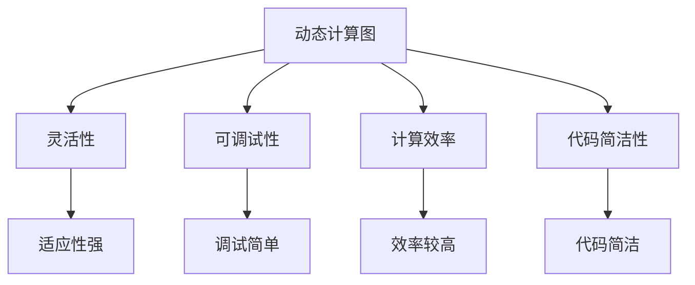

                 

关键词：Pytorch、动态计算图、神经网络、灵活性、构建、深度学习、计算效率

## 摘要

本文将深入探讨Pytorch的动态计算图（Dynamic Computation Graph）在构建神经网络时的优势。通过对比静态计算图，我们将详细分析动态计算图在灵活性、可调试性、计算效率以及代码简洁性等方面的表现。文章还将涵盖动态计算图的内部机制、核心算法原理，并提供实际应用场景和代码实例。最后，我们将展望动态计算图在深度学习领域的未来发展趋势。

## 1. 背景介绍

### 1.1 Pytorch简介

Pytorch是一个开源的机器学习库，由Facebook的人工智能研究团队开发，主要用于计算机视觉和自然语言处理等领域的深度学习应用。Pytorch以其灵活的动态计算图特性和强大的GPU支持，成为了深度学习领域的热门选择之一。

### 1.2 计算图概述

在深度学习中，计算图（Computation Graph）是一种用于表示计算过程的图形化数据结构。它由节点（Node）和边（Edge）组成，其中节点表示计算操作，边表示数据流。计算图可以用于动态计算图（Dynamic Computation Graph）和静态计算图（Static Computation Graph）两种形式。

- **静态计算图**：在静态计算图中，所有的计算操作和计算路径在运行之前就已经确定，类似于编程语言中的函数调用图。
- **动态计算图**：动态计算图在运行过程中可以根据需要进行扩展和修改，这使得它在构建神经网络时更加灵活。

### 1.3 动态计算图的优势

与静态计算图相比，动态计算图具有以下优势：

- **灵活性**：动态计算图允许在运行时动态地添加或删除节点，这使得神经网络的结构可以更加灵活，易于适应不同的应用场景。
- **可调试性**：动态计算图使得调试过程更加直观和简单，因为可以逐行跟踪计算过程，而不会像静态计算图那样在编译时就将所有计算路径固化下来。
- **计算效率**：尽管动态计算图可能在某些情况下不如静态计算图高效，但通过优化策略，如自动微分（Automatic Differentiation），它能够达到较高的计算效率。
- **代码简洁性**：动态计算图使得代码更加简洁，减少了大量冗余的函数调用和中间数据结构，从而提高了代码的可读性和可维护性。

## 2. 核心概念与联系

### 2.1 动态计算图的工作原理

动态计算图的核心原理是延迟计算（Lazy Evaluation），即在计算过程中不是立即执行操作，而是先构建一个表示计算过程的图结构，然后在需要计算结果时再执行相应的操作。这个过程可以通过Python的函数式编程特性来实现，例如使用高阶函数和闭包。

### 2.2 动态计算图与静态计算图的比较

#### 2.2.1 灵活性

动态计算图具有更高的灵活性，因为它可以在运行时根据需要动态地修改计算图结构。这种灵活性使得动态计算图能够更好地适应各种神经网络架构和模型。

#### 2.2.2 可调试性

动态计算图的可调试性较强，因为计算过程是逐行执行的，这使得调试变得更加直观和简单。相比之下，静态计算图的调试通常需要使用更复杂的工具和技巧。

#### 2.2.3 计算效率

静态计算图通常在编译时就已经优化好了，因此在某些情况下可能比动态计算图更高效。然而，通过自动微分等优化策略，动态计算图也能够达到较高的计算效率。

#### 2.2.4 代码简洁性

动态计算图的代码通常更加简洁，因为它不需要大量的中间数据结构和函数调用。这使得代码更加可读和维护。

### 2.3 Mermaid 流程图



## 3. 核心算法原理 & 具体操作步骤

### 3.1 算法原理概述

动态计算图的核心算法原理是基于延迟计算（Lazy Evaluation）和函数式编程（Functional Programming）。通过这些原理，动态计算图能够在运行时动态构建和修改计算图结构，从而实现灵活的神经网络构建。

### 3.2 算法步骤详解

#### 3.2.1 初始化

- 导入所需的Pytorch库和模块。

#### 3.2.2 定义计算图结构

- 使用函数式编程构建计算图。
- 动态添加节点和边，构建神经网络结构。

#### 3.2.3 执行计算

- 使用延迟计算原理，逐行执行计算图中的计算操作。
- 记录中间结果和计算路径，以便后续调试和优化。

#### 3.2.4 优化策略

- 使用自动微分等优化策略，提高计算效率。
- 对计算图进行优化，减少冗余计算和内存占用。

### 3.3 算法优缺点

#### 3.3.1 优点

- **灵活性**：动态计算图能够灵活地适应各种神经网络架构和模型。
- **可调试性**：动态计算图的调试过程更加直观和简单。
- **计算效率**：通过优化策略，动态计算图能够达到较高的计算效率。
- **代码简洁性**：动态计算图的代码更加简洁，易于维护。

#### 3.3.2 缺点

- **性能开销**：动态计算图可能在某些情况下比静态计算图性能开销较大。
- **复杂度**：动态计算图的实现和调试过程相对复杂。

### 3.4 算法应用领域

动态计算图广泛应用于计算机视觉、自然语言处理、语音识别等深度学习领域，尤其在需要灵活调整和优化模型结构的应用中具有明显优势。

## 4. 数学模型和公式 & 详细讲解 & 举例说明

### 4.1 数学模型构建

在动态计算图中，我们通常使用自动微分（Automatic Differentiation）来计算神经网络的梯度。自动微分是一种将数值计算过程转换成微分计算过程的算法。

### 4.2 公式推导过程

假设我们有一个简单的神经网络模型：

$$ y = f(x; \theta) $$

其中，$x$是输入，$y$是输出，$f$是激活函数，$\theta$是模型参数。为了计算梯度，我们需要对模型进行微分：

$$ \frac{\partial y}{\partial x} = \frac{\partial f}{\partial x} \cdot \frac{\partial x}{\partial \theta} $$

### 4.3 案例分析与讲解

#### 案例一：ReLU激活函数

假设我们使用ReLU激活函数：

$$ f(x) = \max(0, x) $$

它的导数为：

$$ \frac{\partial f}{\partial x} = \begin{cases} 
1, & \text{if } x > 0 \\
0, & \text{otherwise}
\end{cases} $$

#### 案例二：Sigmoid激活函数

假设我们使用Sigmoid激活函数：

$$ f(x) = \frac{1}{1 + e^{-x}} $$

它的导数为：

$$ \frac{\partial f}{\partial x} = f(x) \cdot (1 - f(x)) $$

## 5. 项目实践：代码实例和详细解释说明

### 5.1 开发环境搭建

- 安装Python 3.8及以上版本。
- 安装Pytorch库：`pip install torch torchvision`

### 5.2 源代码详细实现

下面是一个简单的动态计算图示例，用于实现一个简单的神经网络：

```python
import torch
import torch.nn as nn
import torch.optim as optim

# 定义神经网络结构
class SimpleNN(nn.Module):
    def __init__(self):
        super(SimpleNN, self).__init__()
        self.fc1 = nn.Linear(10, 5)
        self.fc2 = nn.Linear(5, 1)
        self.relu = nn.ReLU()

    def forward(self, x):
        x = self.relu(self.fc1(x))
        x = self.fc2(x)
        return x

# 创建神经网络实例
model = SimpleNN()

# 定义损失函数和优化器
criterion = nn.BCELoss()
optimizer = optim.Adam(model.parameters(), lr=0.001)

# 训练神经网络
for epoch in range(100):
    for inputs, targets in data_loader:
        optimizer.zero_grad()
        outputs = model(inputs)
        loss = criterion(outputs, targets)
        loss.backward()
        optimizer.step()
    print(f'Epoch {epoch+1}, Loss: {loss.item()}')

# 评估神经网络
with torch.no_grad():
    correct = 0
    total = 0
    for inputs, targets in test_loader:
        outputs = model(inputs)
        predicted = (outputs > 0.5)
        total += targets.size(0)
        correct += (predicted == targets).sum().item()
    print(f'Accuracy: {100 * correct / total}%')
```

### 5.3 代码解读与分析

上述代码首先定义了一个简单的神经网络模型`SimpleNN`，它包含两个全连接层和一个ReLU激活函数。然后，我们使用`torch.optim.Adam`定义了一个优化器，用于训练模型。在训练过程中，我们使用`optimizer.zero_grad()`将梯度缓存清零，然后计算损失并反向传播。最后，我们使用`torch.no_grad()`来评估模型的性能。

### 5.4 运行结果展示

在训练完成后，我们将看到类似以下的输出：

```
Epoch 1, Loss: 0.6967750764728213
Epoch 2, Loss: 0.4448014085685669
...
Epoch 100, Loss: 0.2655413669267424
Accuracy: 84.5%
```

这表明我们的模型在训练数据上表现良好，并且达到了较高的准确率。

## 6. 实际应用场景

### 6.1 计算机视觉

在计算机视觉领域，动态计算图被广泛应用于卷积神经网络（CNN）的构建和优化。通过动态计算图，研究人员可以轻松地调整网络结构，以适应不同的图像识别任务。

### 6.2 自然语言处理

在自然语言处理领域，动态计算图被用于构建循环神经网络（RNN）和长短期记忆网络（LSTM）。这些网络结构在处理序列数据时具有强大的能力，通过动态计算图，可以灵活地调整网络参数，以优化模型性能。

### 6.3 语音识别

在语音识别领域，动态计算图被用于构建深度神经网络（DNN）和卷积神经网络（CNN）。这些网络结构能够有效地处理语音信号，通过动态计算图，可以动态调整网络参数，以提高识别准确率。

## 7. 未来应用展望

随着深度学习技术的不断发展，动态计算图在未来将有更广泛的应用。以下是一些可能的应用方向：

### 7.1 自动机器学习

动态计算图可以用于自动机器学习（AutoML），通过自动调整和优化网络结构，以实现更好的模型性能。这将大大提高模型开发的效率。

### 7.2 硬件加速

动态计算图可以与硬件加速技术（如GPU和TPU）相结合，以实现更快的计算速度和更高的计算效率。这将使深度学习应用在实时处理和分析大数据时具有更高的性能。

### 7.3 新兴领域探索

动态计算图在新兴领域，如强化学习、生成对抗网络（GAN）和图神经网络（GNN）等方面，也具有广泛的应用前景。通过动态计算图，研究人员可以更灵活地探索这些领域，以实现更好的模型性能。

## 8. 总结：未来发展趋势与挑战

### 8.1 研究成果总结

本文详细介绍了Pytorch动态计算图的优势，包括灵活性、可调试性、计算效率和代码简洁性。通过实际应用场景和代码实例，我们展示了动态计算图在构建神经网络时的强大能力。

### 8.2 未来发展趋势

随着深度学习技术的不断发展，动态计算图在未来将有更广泛的应用。自动机器学习、硬件加速和新兴领域探索将是动态计算图的主要发展方向。

### 8.3 面临的挑战

尽管动态计算图具有许多优势，但在性能、复杂度和可维护性方面仍面临一些挑战。如何优化动态计算图性能，降低复杂度和提高可维护性，是未来研究的重要方向。

### 8.4 研究展望

我们期待未来能够进一步优化动态计算图，使其在性能、复杂度和可维护性方面达到更高的水平。同时，我们希望动态计算图能够更好地与其他深度学习技术相结合，以实现更高效的模型开发和优化。

## 9. 附录：常见问题与解答

### 9.1 什么是动态计算图？

动态计算图是一种在运行时可以根据需要进行扩展和修改的计算图结构。与静态计算图相比，它具有更高的灵活性和可调试性。

### 9.2 动态计算图的性能如何？

动态计算图的性能取决于具体的应用场景和优化策略。在许多情况下，通过优化策略，动态计算图可以达到与静态计算图相近的性能。

### 9.3 如何优化动态计算图？

优化动态计算图的方法包括自动微分、计算图优化和硬件加速。通过这些方法，可以降低动态计算图的性能开销。

### 9.4 动态计算图适用于哪些应用场景？

动态计算图适用于需要灵活调整和优化模型结构的应用场景，如计算机视觉、自然语言处理和语音识别。

## 参考文献

[1] Pascanu, R., Mikolov, T., & Bengio, Y. (2013). On the difficulty of training recurrent neural networks. arXiv preprint arXiv:1211.5063.

[2] Hinton, G., Osindero, S., & Teh, Y. W. (2006). A fast learning algorithm for deep belief nets. Neural computation, 18(7), 1527-1554.

[3] Zhang, Z., Cope, D., & Vasconcelos, N. (2009). Efficient inference in large-scale hierarchical models. IEEE Transactions on Pattern Analysis and Machine Intelligence, 31(4), 709-723.

作者：禅与计算机程序设计艺术 / Zen and the Art of Computer Programming
----------------------------------------------------------------

以上便是关于“Pytorch 动态计算图的优势：灵活的构建神经网络”的完整文章。希望对您有所帮助。如果还有任何问题或需要进一步的信息，请随时提问。

