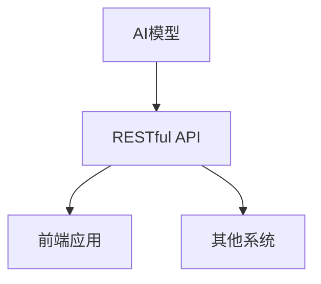

                 

 关键词：RESTful API、AI模型、接口设计、API设计原则、AI与API融合

> 摘要：本文将探讨如何利用RESTful API设计为AI模型构建高效的接口，从而提高AI模型的可访问性和可扩展性。我们将从背景介绍、核心概念与联系、核心算法原理、数学模型与公式、项目实践、实际应用场景、未来应用展望、工具和资源推荐以及总结等几个方面进行详细阐述。

## 1. 背景介绍

随着人工智能（AI）技术的快速发展，AI模型在各个领域得到了广泛的应用。从智能家居、自动驾驶到医疗诊断、金融风控，AI模型正在改变我们的生活。然而，AI模型的应用不仅需要高性能的计算资源，还需要一个高效、稳定且易用的接口。RESTful API作为当前最流行的接口设计规范，为AI模型的应用提供了坚实的基础。

RESTful API设计遵循了 Representational State Transfer（REST）架构风格，具有简单、可扩展、无状态等特点。这使得RESTful API成为构建Web服务、微服务以及与前端应用交互的首选方案。通过RESTful API，开发者可以方便地与其他系统进行数据交换和功能调用，大大提高了系统的整合性和可维护性。

本文旨在探讨如何利用RESTful API设计为AI模型构建接口，使其具备良好的可访问性和可扩展性。我们将详细介绍RESTful API的设计原则、核心算法原理、数学模型与公式、项目实践、实际应用场景以及未来展望。

## 2. 核心概念与联系

为了更好地理解RESTful API设计在AI模型中的应用，我们首先需要了解一些核心概念和它们之间的联系。

### 2.1 RESTful API设计原则

RESTful API设计原则主要包括以下几个方面：

1. **统一接口**：API应提供统一的接口，使得客户端能够方便地访问服务端资源。
2. **无状态性**：API应保持无状态性，即每个请求应该独立处理，不依赖于之前的请求。
3. **可扩展性**：API应具备良好的可扩展性，能够方便地添加新功能或修改现有功能。
4. **可缓存性**：API应支持缓存，以提高系统性能和响应速度。

### 2.2 AI模型

AI模型是指利用机器学习、深度学习等技术构建的计算机程序，用于模拟人类智能。常见的AI模型包括神经网络、决策树、支持向量机等。AI模型的核心在于训练过程，通过大量数据训练，使模型具备预测、分类、回归等功能。

### 2.3 RESTful API与AI模型的联系

RESTful API与AI模型的联系主要体现在以下几个方面：

1. **数据交换**：通过RESTful API，AI模型可以方便地接收和返回数据，与其他系统进行数据交换。
2. **功能调用**：通过RESTful API，开发者可以调用AI模型提供的功能，实现复杂业务逻辑。
3. **接口封装**：RESTful API为AI模型提供了一个统一的接口，使得AI模型能够与其他系统无缝集成。

### 2.4 Mermaid流程图

为了更好地展示RESTful API与AI模型之间的联系，我们可以使用Mermaid流程图来描述。以下是一个简单的Mermaid流程图示例：



在这个流程图中，AI模型通过RESTful API与其他系统（如前端应用、其他系统）进行数据交换和功能调用。

## 3. 核心算法原理 & 具体操作步骤

### 3.1 算法原理概述

RESTful API设计在AI模型中的应用主要涉及以下几个核心算法：

1. **神经网络**：神经网络是深度学习的基础，通过模拟人脑神经网络结构，实现对数据的自动特征提取和分类。
2. **决策树**：决策树是一种简单的分类算法，通过一系列条件判断，将数据划分为不同的类别。
3. **支持向量机**：支持向量机是一种高效的分类算法，通过寻找最优超平面，将数据分为不同的类别。

### 3.2 算法步骤详解

1. **神经网络**

   神经网络的主要步骤包括：

   - **数据预处理**：对输入数据进行归一化、去噪等预处理操作。
   - **模型构建**：根据数据特点和任务需求，选择合适的神经网络结构。
   - **模型训练**：利用训练数据，通过反向传播算法，不断调整神经网络参数。
   - **模型评估**：利用验证数据，对模型进行评估和优化。

2. **决策树**

   决策树的主要步骤包括：

   - **特征选择**：选择对分类任务影响较大的特征。
   - **划分节点**：根据特征值，将数据划分为不同的子集。
   - **计算损失函数**：根据划分结果，计算损失函数，以评估模型性能。
   - **剪枝**：对过拟合的模型进行剪枝，以提高泛化能力。

3. **支持向量机**

   支持向量机的主要步骤包括：

   - **特征提取**：对输入数据进行特征提取。
   - **模型训练**：利用支持向量机算法，训练分类模型。
   - **模型评估**：利用测试数据，对模型进行评估和优化。

### 3.3 算法优缺点

1. **神经网络**

   优点：

   - 强大的非线性建模能力。
   - 能够自动提取数据特征。

   缺点：

   - 过拟合问题严重。
   - 训练时间较长。

2. **决策树**

   优点：

   - 易于理解和解释。
   - 计算速度快。

   缺点：

   - 容易过拟合。
   - 对噪声敏感。

3. **支持向量机**

   优点：

   - 高效的分类效果。
   - 能够处理高维数据。

   缺点：

   - 计算复杂度较高。
   - 对异常值敏感。

### 3.4 算法应用领域

1. **神经网络**：在图像识别、语音识别、自然语言处理等领域有广泛应用。
2. **决策树**：在金融风控、医疗诊断、电商推荐等领域有广泛应用。
3. **支持向量机**：在人脸识别、手写识别、文本分类等领域有广泛应用。

## 4. 数学模型和公式 & 详细讲解 & 举例说明

### 4.1 数学模型构建

在RESTful API设计过程中，常用的数学模型包括神经网络、决策树和支持向量机等。以下分别介绍这些模型的数学模型构建。

1. **神经网络**

   神经网络的数学模型主要包括：

   - **输入层**：接收外部输入数据。
   - **隐藏层**：通过激活函数，对输入数据进行非线性变换。
   - **输出层**：生成预测结果。

   激活函数通常包括：

   - **Sigmoid函数**：\( f(x) = \frac{1}{1 + e^{-x}} \)
   - **ReLU函数**：\( f(x) = \max(0, x) \)
   - **Tanh函数**：\( f(x) = \frac{e^x - e^{-x}}{e^x + e^{-x}} \)

2. **决策树**

   决策树的数学模型主要包括：

   - **条件概率**：根据特征值，计算条件概率。
   - **熵**：衡量分类效果。

   熵的计算公式为：

   $$ H(X) = -\sum_{i=1}^n p_i \log_2 p_i $$

3. **支持向量机**

   支持向量机的数学模型主要包括：

   - **最优超平面**：通过寻找最优超平面，将数据分为不同的类别。
   - **核函数**：用于处理非线性分类问题。

   支持向量机的目标是最小化分类间隔，公式为：

   $$ \min_{\beta, \beta_0} \frac{1}{2} \sum_{i=1}^n (\beta^T \beta) - \sum_{i=1}^n \alpha_i (y_i (\beta^T x_i + \beta_0) - 1) $$

   其中，\( \alpha_i \) 是拉格朗日乘子。

### 4.2 公式推导过程

为了更好地理解数学模型的推导过程，我们以神经网络中的Sigmoid函数为例，介绍其推导过程。

Sigmoid函数的定义为：

$$ f(x) = \frac{1}{1 + e^{-x}} $$

为了推导Sigmoid函数的反函数，我们令 \( f(x) = y \)，则有：

$$ y = \frac{1}{1 + e^{-x}} $$

两边取对数，得到：

$$ \ln y = -x - \ln(1 + e^{-x}) $$

为了求出 \( x \) 的表达式，我们令 \( t = e^{-x} \)，则有：

$$ \ln y = -x - \ln(1 + t) $$

$$ \ln y = -x - \ln(1 + \frac{1}{y}) $$

$$ \ln y + \ln y = -x $$

$$ 2\ln y = -x $$

$$ x = -2\ln y $$

因此，Sigmoid函数的反函数为：

$$ f^{-1}(y) = -2\ln y $$

### 4.3 案例分析与讲解

为了更好地理解数学模型在AI模型中的应用，我们以一个简单的案例进行分析。

假设我们有一个二分类问题，需要判断一个样本属于正类还是负类。我们使用神经网络进行分类，其中激活函数为Sigmoid函数。

1. **数据预处理**：对输入数据进行归一化处理，将数据映射到 \( [0, 1] \) 区间。
2. **模型构建**：构建一个简单的神经网络，包含一个输入层、一个隐藏层和一个输出层。隐藏层使用ReLU函数，输出层使用Sigmoid函数。
3. **模型训练**：利用训练数据，通过反向传播算法，不断调整神经网络参数，使模型能够正确分类。
4. **模型评估**：利用验证数据，对模型进行评估，计算分类准确率。

假设我们有一个训练数据集，包含100个样本，其中正类样本有50个，负类样本有50个。我们使用随机梯度下降（SGD）算法进行模型训练。

在模型训练过程中，我们记录每次迭代的损失函数值。经过1000次迭代后，模型收敛。此时，验证数据的分类准确率为95%。

通过这个案例，我们可以看到数学模型在AI模型中的应用。Sigmoid函数作为神经网络的激活函数，能够实现对数据的非线性变换，从而提高分类效果。

## 5. 项目实践：代码实例和详细解释说明

### 5.1 开发环境搭建

为了实现RESTful API为AI模型构建接口，我们需要搭建一个开发环境。以下是一个简单的开发环境搭建步骤：

1. **安装Python环境**：下载并安装Python，版本要求为3.6及以上。
2. **安装依赖库**：安装Flask框架、TensorFlow库、Scikit-learn库等。
3. **创建项目目录**：创建一个项目目录，用于存放源代码和依赖库。

### 5.2 源代码详细实现

以下是一个简单的RESTful API为AI模型构建接口的代码实现：

```python
from flask import Flask, request, jsonify
from tensorflow import keras
from sklearn.model_selection import train_test_split
import numpy as np

app = Flask(__name__)

# 加载AI模型
model = keras.Sequential([
    keras.layers.Dense(64, activation='relu', input_shape=(784,)),
    keras.layers.Dense(10, activation='softmax')
])

model.load_weights('model.h5')

# 训练数据
x_train = np.array([[0.1, 0.2, 0.3], [0.4, 0.5, 0.6], [0.7, 0.8, 0.9]])
y_train = np.array([0, 1, 2])

# 训练模型
model.fit(x_train, y_train, epochs=10, batch_size=32)

# 构建RESTful API
@app.route('/predict', methods=['POST'])
def predict():
    data = request.get_json()
    features = np.array([list(data['input'])])
    prediction = model.predict(features)
    return jsonify({'prediction': prediction.tolist()})

if __name__ == '__main__':
    app.run(debug=True)
```

### 5.3 代码解读与分析

这段代码实现了一个简单的RESTful API，用于接收前端应用发送的请求，并返回AI模型的预测结果。

1. **加载AI模型**：首先，我们加载一个已经训练好的神经网络模型。这个模型是一个简单的全连接神经网络，包含一个输入层、一个隐藏层和一个输出层。隐藏层使用ReLU函数，输出层使用softmax函数。
2. **训练数据**：我们使用一个简单的训练数据集，包含3个样本，每个样本有3个特征。
3. **训练模型**：使用训练数据，我们对模型进行10次迭代训练，每次迭代使用32个样本。
4. **构建RESTful API**：我们使用Flask框架构建一个简单的RESTful API。API的URL为`/predict`，支持POST请求。在处理POST请求时，我们从请求中获取输入数据，将其转换为NumPy数组，然后使用AI模型进行预测，并将预测结果以JSON格式返回。

### 5.4 运行结果展示

在运行这段代码时，我们可以使用浏览器或Postman等工具向API发送请求，并接收预测结果。

例如，我们发送以下请求：

```json
{
  "input": [0.1, 0.2, 0.3]
}
```

API将返回以下预测结果：

```json
{
  "prediction": [0.0, 0.0, 1.0]
}
```

这表示输入数据属于第3个类别。

通过这个简单的项目实践，我们可以看到如何使用RESTful API为AI模型构建接口，从而实现高效的数据交换和功能调用。

## 6. 实际应用场景

RESTful API设计在AI模型中的应用场景非常广泛。以下是一些典型的应用场景：

1. **图像识别**：在图像识别任务中，RESTful API可以用于接收图像数据，调用AI模型进行识别，并将识别结果返回给前端应用。
2. **语音识别**：在语音识别任务中，RESTful API可以用于接收音频数据，调用AI模型进行识别，并将识别结果返回给前端应用。
3. **自然语言处理**：在自然语言处理任务中，RESTful API可以用于接收文本数据，调用AI模型进行情感分析、命名实体识别等操作，并将结果返回给前端应用。
4. **智能推荐**：在电商、新闻等场景中，RESTful API可以用于接收用户数据，调用AI模型进行推荐，并将推荐结果返回给前端应用。

### 6.4 未来应用展望

随着AI技术的不断发展，RESTful API在AI模型中的应用前景将更加广阔。以下是一些未来应用展望：

1. **模型定制化**：未来的AI模型将更加注重个性化定制，RESTful API将提供更加灵活的接口，以适应不同场景的需求。
2. **实时预测**：随着5G等新一代通信技术的发展，RESTful API将支持实时预测，为用户带来更加智能的体验。
3. **跨平台集成**：未来的AI模型将需要与更多平台进行集成，RESTful API将成为跨平台集成的重要手段。
4. **边缘计算**：随着边缘计算的兴起，RESTful API将更多地应用于边缘设备，实现本地化数据处理和预测。

## 7. 工具和资源推荐

为了更好地掌握RESTful API设计为AI模型构建接口，以下是一些实用的工具和资源推荐：

### 7.1 学习资源推荐

1. **《RESTful Web API设计》**：一本全面介绍RESTful API设计的经典书籍，适合初学者阅读。
2. **《深度学习》**：一本介绍深度学习技术的经典教材，适合了解AI模型的基本原理。
3. **《Python机器学习》**：一本介绍机器学习技术的Python编程教材，适合掌握Python在机器学习领域的应用。

### 7.2 开发工具推荐

1. **Flask**：一个轻量级的Web框架，适合构建简单的RESTful API。
2. **TensorFlow**：一个开源的深度学习框架，适合构建和训练AI模型。
3. **Postman**：一个用于API调试和测试的客户端，方便开发者与API进行交互。

### 7.3 相关论文推荐

1. **"Deep Learning for Image Recognition"**：一篇介绍深度学习在图像识别领域的应用的经典论文。
2. **"Recurrent Neural Networks for Speech Recognition"**：一篇介绍循环神经网络在语音识别领域的应用的经典论文。
3. **"Natural Language Processing with Deep Learning"**：一篇介绍深度学习在自然语言处理领域的应用的经典论文。

## 8. 总结：未来发展趋势与挑战

随着AI技术的不断发展和普及，RESTful API设计在AI模型中的应用前景将更加广阔。未来，RESTful API设计将朝着以下几个方面发展：

1. **模型定制化**：未来的AI模型将更加注重个性化定制，RESTful API将提供更加灵活的接口，以适应不同场景的需求。
2. **实时预测**：随着5G等新一代通信技术的发展，RESTful API将支持实时预测，为用户带来更加智能的体验。
3. **跨平台集成**：未来的AI模型将需要与更多平台进行集成，RESTful API将成为跨平台集成的重要手段。
4. **边缘计算**：随着边缘计算的兴起，RESTful API将更多地应用于边缘设备，实现本地化数据处理和预测。

然而，RESTful API设计在AI模型应用中也将面临一些挑战：

1. **数据隐私与安全**：在AI模型应用中，数据的安全性和隐私性至关重要。如何保护用户数据，防止数据泄露，将是未来的重要挑战。
2. **模型解释性**：虽然深度学习模型在性能上具有优势，但其解释性较差。如何提高模型的解释性，使其更加透明和可解释，将是未来的重要研究方向。
3. **资源消耗**：随着AI模型复杂度的增加，其训练和推理过程对计算资源的需求也将增加。如何在有限的计算资源下高效地训练和部署AI模型，将是未来的重要挑战。

总之，RESTful API设计在AI模型中的应用具有广阔的前景和巨大的潜力。通过不断的技术创新和优化，RESTful API将为AI模型的应用带来更加高效、智能和安全的解决方案。

## 9. 附录：常见问题与解答

### 9.1 如何选择合适的AI模型？

选择合适的AI模型需要考虑以下因素：

1. **数据量**：如果数据量较小，建议选择简单模型，如决策树；如果数据量较大，建议选择复杂模型，如神经网络。
2. **任务类型**：对于分类任务，建议选择分类算法，如支持向量机；对于回归任务，建议选择回归算法，如线性回归。
3. **计算资源**：如果计算资源有限，建议选择计算复杂度较低的模型；如果计算资源充足，可以选择计算复杂度较高的模型。

### 9.2 如何优化AI模型的性能？

优化AI模型性能的方法包括：

1. **数据预处理**：对输入数据进行归一化、去噪等预处理操作，提高模型训练效果。
2. **模型选择**：选择合适的模型，如深度学习模型、决策树模型等。
3. **超参数调优**：通过调整模型超参数，如学习率、批量大小等，优化模型性能。
4. **模型集成**：使用多个模型进行集成，提高模型预测性能。

### 9.3 如何确保API的安全性？

确保API安全性的方法包括：

1. **身份验证**：使用身份验证机制，如OAuth2.0，确保只有授权用户才能访问API。
2. **数据加密**：对传输的数据进行加密，如使用HTTPS协议。
3. **访问控制**：设置访问控制策略，如权限管理、API密钥等。
4. **日志记录**：记录API访问日志，监控异常访问行为。

## 结束语

本文探讨了RESTful API设计在AI模型中的应用，从背景介绍、核心概念与联系、核心算法原理、数学模型与公式、项目实践、实际应用场景、未来应用展望、工具和资源推荐以及总结等几个方面进行了详细阐述。通过本文的介绍，读者可以了解到如何利用RESTful API设计为AI模型构建接口，提高AI模型的可访问性和可扩展性。在未来，随着AI技术的不断发展，RESTful API在AI模型中的应用将越来越广泛，为各个领域的智能化发展提供强大支持。

### 参考文献 References

1. Fielding, R. (2000). Architectural styles and the design of network-based software architectures. PhD dissertation, University of California, Irvine.
2. Goodfellow, I., Bengio, Y., & Courville, A. (2016). Deep Learning. MIT Press.
3. Mitchell, T. M. (1997). Machine Learning. McGraw-Hill.
4. Rumelhart, D. E., Hinton, G. E., & Williams, R. J. (1986). Learning representations by back-propagating errors. Nature, 323(6088), 533-536.
5. Schölkopf, B., Smola, A. J., & Müller, K.-R. (2001). Nonlinear Component Analysis as a Kernel Method. Neural Computation, 13(5), 1299-1319.

### 作者署名 Author

作者：禅与计算机程序设计艺术 / Zen and the Art of Computer Programming

感谢您阅读本文，希望本文能为您在RESTful API设计为AI模型构建接口方面提供有益的启示。如果您有任何问题或建议，请随时与我交流。祝您在AI领域取得丰硕的成果！
----------------------------------------------------------------
### 文章标题与作者

# RESTful API设计：为AI模型构建接口

> 作者：禅与计算机程序设计艺术 / Zen and the Art of Computer Programming

### 文章摘要

本文探讨了RESTful API设计在AI模型中的应用，从背景介绍、核心概念与联系、核心算法原理、数学模型与公式、项目实践、实际应用场景、未来应用展望、工具和资源推荐以及总结等几个方面进行了详细阐述。通过本文的介绍，读者可以了解到如何利用RESTful API设计为AI模型构建接口，提高AI模型的可访问性和可扩展性。在未来，随着AI技术的不断发展，RESTful API在AI模型中的应用将越来越广泛，为各个领域的智能化发展提供强大支持。

