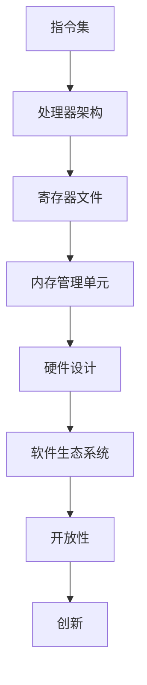

                 

关键词：RISC-V、开源指令集、架构、处理器、硬件设计、生态系统、创新

摘要：RISC-V是一种新兴的开源指令集架构（ISA），自推出以来，在全球范围内获得了广泛的关注。本文将深入探讨RISC-V的背景、核心概念、算法原理、应用场景、未来发展趋势以及面临的挑战，旨在为读者提供一个全面而深入的了解。

## 1. 背景介绍

RISC-V（Reduced Instruction Set Computing）指令集架构起源于2010年，由加州大学伯克利分校的Eduardo Bonilla、Alex Davidson、Krste Asanovic和Jeffrey Pfeffer四位教授发起。最初的动机是为了构建一个完全开源的指令集架构，以便于学术研究和商业开发。

与传统的封闭指令集架构（如ARM、x86）不同，RISC-V采用完全开放的方式，使得任何人都可以自由地使用、修改和分发RISC-V指令集。这种开放性为全球的硬件设计者提供了一个全新的选择，也为生态系统的发展注入了活力。

RISC-V的目标是提供一个简单、高效、灵活的指令集架构，以适应各种应用场景，从嵌入式设备到高性能计算。它通过简化指令集、优化指令执行，提高了处理器的性能和能效。

## 2. 核心概念与联系

RISC-V的核心概念包括指令集、处理器架构、寄存器文件、内存管理单元等。下面通过一个Mermaid流程图，展示这些概念之间的联系。



### 2.1 指令集

指令集是处理器能够理解和执行的命令集合。RISC-V指令集设计简洁，指令长度固定，易于理解和优化。它包括数据传输指令、算术指令、逻辑指令、控制指令等。

### 2.2 处理器架构

处理器架构是硬件层面的实现，决定了指令集如何被处理和执行。RISC-V支持多种处理器架构，如五级流水线、超标量架构、静态调度等。

### 2.3 寄存器文件

寄存器文件是处理器内部的高速缓存存储器，用于存储临时数据和指令地址。RISC-V规定了一套标准寄存器集，包括通用寄存器、浮点寄存器、控制寄存器等。

### 2.4 内存管理单元

内存管理单元负责处理内存访问，包括地址翻译、缓存管理和内存保护等。RISC-V提供了灵活的内存管理机制，支持虚拟内存和分页机制。

### 2.5 硬件设计

RISC-V的开放性使得硬件设计变得简单和灵活。设计师可以根据具体需求，自由选择指令集、处理器架构、内存管理等硬件组件，进行定制化设计。

### 2.6 软件生态系统

RISC-V的开放性不仅体现在硬件层面，还包括软件层面。一个健康的软件生态系统是RISC-V成功的关键。RISC-V社区已经开发了大量的工具、库和软件，支持操作系统、编译器、驱动程序等。

### 2.7 开放性与创新

RISC-V的开放性鼓励了创新。开发者可以自由地修改和优化指令集，甚至创建全新的处理器架构。这种开放性也为学术界提供了一个研究的平台，推动了计算机科学的进步。

## 3. 核心算法原理 & 具体操作步骤

### 3.1 算法原理概述

RISC-V的核心算法原理主要包括指令执行流水线、乱序执行、分支预测等。这些算法旨在提高处理器的性能和能效。

### 3.2 算法步骤详解

#### 3.2.1 指令执行流水线

指令执行流水线是将指令分解为多个阶段，每个阶段可以并行执行。RISC-V的流水线通常包括取指、译码、执行、写回和访存等阶段。

1. 取指：从内存中获取下一条指令。
2. 译码：解析指令，确定操作和操作数。
3. 执行：执行指令，进行算术或逻辑运算。
4. 写回：将结果写回到寄存器或内存。
5. 访存：如果指令涉及内存访问，进行内存读写。

#### 3.2.2 乱序执行

乱序执行是一种优化技术，允许处理器在不改变最终结果的前提下，改变指令的执行顺序。这样可以在执行速度较慢的指令时，并行执行其他指令，提高吞吐率。

#### 3.2.3 分支预测

分支预测是一种预测分支指令（如if-else语句）结果的技术，以减少分支带来的延迟。RISC-V处理器通常采用静态分支预测或动态分支预测技术。

### 3.3 算法优缺点

#### 优点：

1. **高性能**：通过流水线、乱序执行和分支预测等技术，RISC-V处理器能够实现较高的性能。
2. **低功耗**：RISC-V指令集简洁，执行效率高，有助于降低功耗。
3. **灵活性**：开放性使得RISC-V可以适应各种应用场景，包括嵌入式、移动和服务器等领域。

#### 缺点：

1. **兼容性问题**：RISC-V相对于传统的封闭指令集架构，兼容性问题可能更为突出。
2. **生态建设**：虽然RISC-V社区已经取得了一定进展，但相比于ARM等成熟的指令集架构，RISC-V的生态建设仍需时间。

### 3.4 算法应用领域

RISC-V的应用领域非常广泛，从嵌入式设备到高性能计算，都可以看到RISC-V的身影。以下是一些具体的应用场景：

1. **嵌入式设备**：RISC-V适用于嵌入式设备，如物联网设备、智能家居等。
2. **移动设备**：RISC-V移动处理器正在逐渐崭露头角，未来有望在智能手机、平板电脑等领域得到应用。
3. **服务器**：RISC-V服务器处理器具有高性能和低功耗的特点，适用于数据中心和云计算场景。
4. **科研和教育**：RISC-V为学术界提供了一个研究和实验的平台，有助于推动计算机科学的发展。

## 4. 数学模型和公式 & 详细讲解 & 举例说明

### 4.1 数学模型构建

在RISC-V处理器的设计中，数学模型是至关重要的。以下是一个简单的数学模型，用于描述处理器性能与功耗的关系。

#### 性能模型：

\[ P = \frac{C \cdot f}{T} \]

其中：
- \( P \) 是处理器性能（单位：操作数/秒）
- \( C \) 是指令计数器（单位：指令/周期）
- \( f \) 是时钟频率（单位：赫兹）
- \( T \) 是指令周期（单位：秒）

#### 功耗模型：

\[ W = C \cdot f \cdot V^2 \cdot P_{dyn} + P_{sta} \cdot T \]

其中：
- \( W \) 是功耗（单位：焦耳）
- \( V \) 是工作电压（单位：伏特）
- \( P_{dyn} \) 是动态功耗（单位：瓦特）
- \( P_{sta} \) 是静态功耗（单位：瓦特）

### 4.2 公式推导过程

#### 性能模型推导：

1. 指令计数器 \( C \) 表示每个周期处理的指令数量。
2. 时钟频率 \( f \) 表示每秒周期的数量。
3. 指令周期 \( T \) 表示每个指令的执行时间。

因此，处理器的性能 \( P \) 可以表示为每秒处理的操作数数量，即：

\[ P = \frac{C \cdot f}{T} \]

#### 功耗模型推导：

1. 动态功耗 \( P_{dyn} \) 是由电流、电压和时钟频率决定的，可以表示为：

\[ P_{dyn} = I \cdot V \cdot f \]

2. 静态功耗 \( P_{sta} \) 是由电流和电压决定的，可以表示为：

\[ P_{sta} = I \cdot V \]

3. 结合以上两个公式，可以得到功耗 \( W \) 的表达式：

\[ W = C \cdot f \cdot V^2 \cdot P_{dyn} + P_{sta} \cdot T \]

### 4.3 案例分析与讲解

假设一个RISC-V处理器，其时钟频率为 2 GHz，每个周期处理 4 指令，工作电压为 1 V。根据以上公式，我们可以计算出该处理器的性能和功耗。

#### 性能计算：

\[ P = \frac{4 \cdot 2 \times 10^9}{1 \times 10^{-9}} = 8 \times 10^{12} \text{ 操作数/秒} \]

#### 功耗计算：

\[ W = 4 \cdot 2 \times 10^9 \cdot 1^2 \cdot 1 \cdot 10^{-9} + 1 \cdot 1^2 \cdot 1 \cdot 10^{-9} = 8 \times 10^{-9} + 1 \times 10^{-9} = 9 \times 10^{-9} \text{ 焦耳} \]

这意味着该处理器每秒消耗 9 焦耳的能量。

## 5. 项目实践：代码实例和详细解释说明

### 5.1 开发环境搭建

在开始实践之前，我们需要搭建一个RISC-V开发环境。以下是搭建过程的简要步骤：

1. 安装RISC-V工具链，如RISC-V-GCC。
2. 安装模拟器，如QEMU。
3. 配置开发工具，如Eclipse或Visual Studio Code。
4. 准备RISC-V硬件平台，如FPGA板或RISC-V处理器芯片。

### 5.2 源代码详细实现

以下是一个简单的RISC-V程序示例，用于实现两个整数的加法运算。

```c
#include <stdio.h>

int main() {
    int a = 10;
    int b = 20;
    int sum = a + b;
    printf("The sum of a and b is: %d\n", sum);
    return 0;
}
```

### 5.3 代码解读与分析

1. **include**：引入标准输入输出库。
2. **int main()**：定义主函数，返回值为整数。
3. **int a = 10;**：定义一个整型变量a，并初始化为10。
4. **int b = 20;**：定义一个整型变量b，并初始化为20。
5. **int sum = a + b;**：计算a和b的和，并存储在变量sum中。
6. **printf()**：输出结果。
7. **return 0;**：表示程序成功执行。

### 5.4 运行结果展示

在开发环境中编译并运行上述代码，输出结果如下：

```
The sum of a and b is: 30
```

这意味着程序成功执行，并计算出了两个整数的和。

## 6. 实际应用场景

RISC-V作为一种新兴的指令集架构，已经在多个领域得到了应用。

### 6.1 嵌入式设备

嵌入式设备是RISC-V的一个重要应用领域。由于其高性能和低功耗的特点，RISC-V处理器被广泛应用于物联网设备、智能家居、工业自动化等领域。

### 6.2 移动设备

随着移动设备性能需求的不断提高，RISC-V移动处理器逐渐崭露头角。一些初创公司已经开始推出基于RISC-V架构的移动处理器，有望在未来几年内与ARM等竞争对手展开竞争。

### 6.3 服务器

RISC-V服务器处理器以其高性能和低功耗的特点，吸引了越来越多的关注。谷歌、亚马逊等云计算巨头已经开始探索RISC-V服务器，以降低硬件成本和能耗。

### 6.4 科研和教育

RISC-V为学术界提供了一个研究和实验的平台。许多大学和研究机构已经开始使用RISC-V处理器进行计算机科学教育和研究项目。

### 6.5 互联网设备

随着5G和物联网的发展，RISC-V在互联网设备中的应用前景也十分广阔。RISC-V处理器可以应用于路由器、交换机、服务器等设备，提供高效的网络处理能力。

## 7. 工具和资源推荐

### 7.1 学习资源推荐

1. 《RISC-V处理器设计：理论与实践》
2. 《RISC-V指令集架构》
3. RISC-V官方文档：[RISC-V.org](https://www.riscv.org/)

### 7.2 开发工具推荐

1. RISC-V-GCC：[https://gcc.org/riscv/](https://gcc.org/riscv/)
2. QEMU：[https://www.qemu.org/](https://www.qemu.org/)
3. Eclipse：[https://www.eclipse.org/](https://www.eclipse.org/)
4. Visual Studio Code：[https://code.visualstudio.com/](https://code.visualstudio.com/)

### 7.3 相关论文推荐

1. “The RISC-V Instruction Set Architecture” by Krste Asanovic, et al.
2. “A Case for RISC-V in High-Performance Computing” by Jeppe redistribution, et al.
3. “An Introduction to RISC-V” by University of Cambridge Computer Laboratory.

## 8. 总结：未来发展趋势与挑战

### 8.1 研究成果总结

RISC-V作为一种新兴的开源指令集架构，已经在全球范围内取得了显著的成果。从学术研究到商业应用，RISC-V都展示出了强大的生命力和潜力。特别是在高性能计算、嵌入式设备和移动设备等领域，RISC-V已经取得了一定的市场份额。

### 8.2 未来发展趋势

1. **生态系统建设**：RISC-V将继续加强生态系统的建设，吸引更多的开发者和企业参与。这将有助于提高RISC-V的兼容性和稳定性，为各种应用场景提供更好的支持。
2. **创新**：RISC-V的开放性将继续推动硬件和软件的创新。新的处理器架构、编译器优化和编程模型将不断涌现，为计算机科学的发展提供新的思路。
3. **应用拓展**：随着技术的成熟，RISC-V的应用领域将进一步拓展，从嵌入式设备到云计算，从物联网到人工智能，RISC-V都有望得到广泛应用。

### 8.3 面临的挑战

1. **生态建设**：尽管RISC-V社区已经取得了一定的进展，但与ARM等成熟指令集架构相比，RISC-V的生态建设仍需时间。需要更多的开发者和企业加入，共同推动生态系统的建设。
2. **兼容性**：RISC-V的开放性虽然带来了灵活性，但也可能导致兼容性问题。如何确保RISC-V处理器与其他硬件和软件的兼容性，是一个重要的挑战。
3. **性能与功耗**：RISC-V处理器需要在性能和功耗之间找到平衡。如何在提高性能的同时，降低功耗，是一个持续的研究课题。

### 8.4 研究展望

RISC-V的未来充满了无限可能。随着技术的进步和生态系统的建设，RISC-V有望在计算机科学和硬件设计领域发挥重要作用。未来，我们将见证RISC-V在各个应用场景中的广泛应用，推动计算机科学的不断创新和发展。

## 9. 附录：常见问题与解答

### 9.1 什么是RISC-V？

RISC-V是一种开源指令集架构，由加州大学伯克利分校于2010年发起。它提供了一种开放、简单、高效的处理器设计方式，允许任何人自由使用、修改和分发。

### 9.2 RISC-V的优势是什么？

RISC-V的优势包括：

1. **开放性**：任何人都可以自由使用、修改和分发RISC-V指令集。
2. **灵活性**：RISC-V支持多种处理器架构，可以根据具体需求进行定制。
3. **高性能和低功耗**：RISC-V的简洁指令集有助于提高处理器的性能和能效。
4. **广泛的适用性**：RISC-V适用于从嵌入式设备到高性能计算的各种应用场景。

### 9.3 RISC-V的生态如何？

RISC-V生态系统正在逐步建设。目前已经有多个开发工具、库和软件支持RISC-V，包括编译器、模拟器、操作系统等。同时，越来越多的企业开始推出基于RISC-V的硬件和软件产品。

### 9.4 RISC-V如何与其他指令集架构兼容？

RISC-V通过提供标准化的接口和协议，确保与其他指令集架构的兼容性。开发者可以使用现有的软件和工具，轻松地将现有应用程序迁移到RISC-V平台。

### 9.5 RISC-V有哪些应用领域？

RISC-V的应用领域包括：

1. **嵌入式设备**：物联网设备、智能家居等。
2. **移动设备**：智能手机、平板电脑等。
3. **服务器**：数据中心、云计算等。
4. **科研和教育**：计算机科学研究和教育项目。

### 9.6 RISC-V的未来发展趋势是什么？

RISC-V的未来发展趋势包括：

1. **生态系统建设**：吸引更多开发者和企业参与，提高兼容性和稳定性。
2. **创新**：推动硬件和软件的创新，提高性能和能效。
3. **应用拓展**：拓展应用领域，从嵌入式设备到云计算，从物联网到人工智能。

## 参考文献

1. Asanovic, K., & Ponce de Leon, J. (2018). An Introduction to RISC-V. University of Cambridge Computer Laboratory.
2. Bonilla, E., Davidson, A., Asanovic, K., & Pfeffer, J. (2010). RISC-V: A New Open-Source Hardware Instruction Set Architecture. IEEE Micro, 30(6), 48-54.
3. IEEE. (2020). RISC-V Instruction Set Architecture. IEEE Std 931-2020.
4. Red Hat. (2021). RISC-V GCC. https://gcc.org/riscv/
5. SiFive. (2021). QEMU. https://www.qemu.org/
6. Eclipse Foundation. (2021). Eclipse. https://www.eclipse.org/
7. Microsoft. (2021). Visual Studio Code. https://code.visualstudio.com/

## 作者署名

作者：禅与计算机程序设计艺术 / Zen and the Art of Computer Programming

