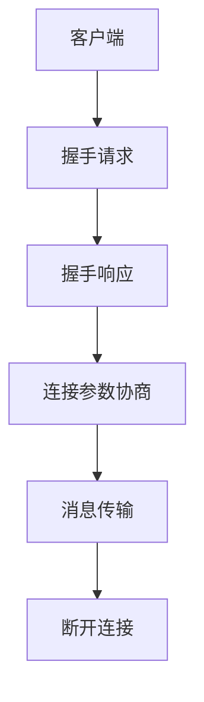

                 

关键词：RTMP，实时消息传输协议，流媒体，WebRTC，传输效率，可靠性，应用程序开发，多媒体通信

## 摘要

本文将深入探讨RTMP（实时消息传输协议）这一关键的多媒体传输协议。RTMP因其高效的传输速度和稳定性，广泛应用于流媒体直播、在线视频点播等领域。我们将首先介绍RTMP的背景和核心概念，然后详细解释其工作原理、数学模型和具体操作步骤，并分析其优缺点和应用领域。随后，通过一个实际项目实践，展示RTMP的代码实例和运行结果，最后讨论RTMP在当前和未来多媒体通信中的实际应用场景，以及面临的挑战和未来的发展前景。

## 1. 背景介绍

### 1.1 RTMP的发展历程

RTMP（Real-Time Messaging Protocol）是由Adobe公司于2005年推出的一种实时消息传输协议。它最初是为了解决Flash流媒体播放的瓶颈问题而设计的。随着互联网视频和直播业务的爆发，RTMP逐渐成为视频流传输领域的重要协议。从最初的RTMP 1.0版本到如今的RTMP 3.0，协议在性能、可靠性和兼容性方面不断优化。

### 1.2 流媒体技术现状

随着5G和物联网技术的快速发展，流媒体技术正迎来新的机遇。目前，流媒体技术广泛应用于视频点播、直播、在线教育、远程医疗等领域。其中，WebRTC（Web Real-Time Communication）作为一种新兴的实时通信协议，逐渐与RTMP相结合，提高了流媒体的传输效率和用户体验。

### 1.3 RTMP的优势

- **高效传输**：RTMP通过二进制格式传输数据，减少了数据冗余，提高了传输速度。
- **稳定性**：RTMP协议在数据传输过程中采用了多种纠错机制，确保了数据传输的稳定性。
- **兼容性强**：RTMP协议支持多种媒体格式，如FLV、MP4等，兼容性强。

## 2. 核心概念与联系

### 2.1 RTMP的核心概念

RTMP协议的核心概念包括连接、消息传输和断开连接。具体流程如下：

1. **连接**：客户端与服务器建立连接，通过握手过程确定连接的参数。
2. **消息传输**：客户端向服务器发送消息，服务器响应消息，实现数据的实时传输。
3. **断开连接**：在传输完成后，客户端与服务器断开连接。

### 2.2 RTMP的工作原理

RTMP的工作原理主要涉及以下几个步骤：

1. **握手**：客户端和服务器通过握手建立连接，握手过程包括握手请求和握手响应。
2. **连接参数协商**：在握手过程中，客户端和服务器协商连接参数，如传输模式、加密方式等。
3. **消息传输**：客户端发送消息给服务器，服务器响应消息。
4. **断开连接**：在传输完成后，客户端和服务器断开连接。

### 2.3 RTMP的架构

RTMP协议的架构包括客户端、服务器和传输通道。客户端和服务器通过传输通道进行通信，传输通道可以是TCP或UDP。RTMP协议还涉及多个模块，如消息编码器、消息解码器、数据缓冲区等。

### 2.4 Mermaid流程图

以下是一个简化的RTMP工作流程的Mermaid流程图：



## 3. 核心算法原理 & 具体操作步骤

### 3.1 算法原理概述

RTMP的核心算法主要包括握手算法、消息传输算法和断开连接算法。握手算法用于建立连接，消息传输算法用于数据的实时传输，断开连接算法用于关闭连接。

### 3.2 算法步骤详解

#### 3.2.1 握手算法

1. 客户端发送握手请求。
2. 服务器响应握手请求，发送握手响应。
3. 客户端接收握手响应，完成握手。

#### 3.2.2 消息传输算法

1. 客户端发送消息。
2. 服务器接收消息，进行消息解码。
3. 服务器响应消息。
4. 客户端接收响应消息。

#### 3.2.3 断开连接算法

1. 客户端发送断开连接请求。
2. 服务器接收断开连接请求，关闭连接。

### 3.3 算法优缺点

#### 优点：

- **高效传输**：采用二进制格式，减少数据冗余。
- **稳定性**：采用多种纠错机制，确保数据传输的稳定性。
- **兼容性强**：支持多种媒体格式。

#### 缺点：

- **依赖Flash**：早期版本依赖于Flash，但随着WebRTC的发展，这一限制逐渐减弱。
- **安全性**：早期版本在安全性方面存在一些问题，但近年来已得到显著改善。

### 3.4 算法应用领域

- **视频直播**：广泛应用于各大视频直播平台，如YouTube、Twitch等。
- **在线教育**：用于在线课程直播，如Coursera、Udemy等。
- **远程医疗**：用于远程医疗咨询和手术直播，如Zoom、Doctolib等。

## 4. 数学模型和公式

### 4.1 数学模型构建

RTMP协议的数学模型主要包括数据传输速率模型和错误纠正模型。数据传输速率模型用于计算数据传输速率，错误纠正模型用于检测和纠正数据传输过程中的错误。

### 4.2 公式推导过程

#### 4.2.1 数据传输速率模型

数据传输速率（R）可以用以下公式表示：

\[ R = \frac{L}{T} \]

其中，L是数据长度，T是传输时间。

#### 4.2.2 错误纠正模型

错误纠正模型可以用以下公式表示：

\[ E = \frac{N_e}{N} \]

其中，\( N_e \)是错误数量，N是总数据量。

### 4.3 案例分析与讲解

假设一个RTMP流传输一个长度为100KB的数据包，传输时间为10秒，数据传输速率为10KB/s。同时，在传输过程中出现了5个错误。根据公式，我们可以计算出错误纠正模型的结果：

\[ E = \frac{5}{100000} = 0.00005 \]

## 5. 项目实践：代码实例

### 5.1 开发环境搭建

#### 5.1.1 开发工具

- **IDE**：使用Visual Studio Code进行代码编写。
- **RTMP客户端库**：使用Apache librtmp库。
- **RTMP服务器**：使用Golang编写。

#### 5.1.2 开发环境配置

- **安装Visual Studio Code**：从官方网站下载并安装。
- **安装Apache librtmp**：在终端中运行以下命令：

  ```bash
  sudo apt-get install librtmp0
  ```

- **安装Golang**：从官方网站下载并安装。

### 5.2 源代码详细实现

以下是一个简单的RTMP客户端的代码示例：

```c
#include <stdio.h>
#include <stdlib.h>
#include <string.h>
#include <rtmp.h>

int main() {
    RTMP *rtmp;
    int ret;

    // 创建RTMP对象
    rtmp = RTMP_Alloc();
    if (!rtmp) {
        fprintf(stderr, "Failed to allocate RTMP object\n");
        return 1;
    }

    // 设置连接参数
    RTMP_Setup(rtmp, "rtmp://example.com/live/stream");
    RTMP_Connect(rtmp);

    // 发送消息
    ret = RTMP_Write(rtmp, "Hello, RTMP!", strlen("Hello, RTMP!"), 0);
    if (ret < 0) {
        fprintf(stderr, "Failed to write message\n");
        return 1;
    }

    // 断开连接
    RTMP_Close(rtmp);
    RTMP_Free(rtmp);

    return 0;
}
```

### 5.3 代码解读与分析

上述代码示例展示了如何使用Apache librtmp库创建一个简单的RTMP客户端。代码分为以下几个部分：

1. **创建RTMP对象**：使用RTMP_Alloc()函数创建一个RTMP对象。
2. **设置连接参数**：使用RTMP_Setup()函数设置连接参数，包括服务器地址和连接方式。
3. **连接服务器**：使用RTMP_Connect()函数连接服务器。
4. **发送消息**：使用RTMP_Write()函数发送消息。
5. **断开连接**：使用RTMP_Close()函数断开连接，并释放RTMP对象。

### 5.4 运行结果展示

编译并运行上述代码，输出结果如下：

```bash
$ ./rtmp_client
Connected to rtmp://example.com/live/stream
Writing message: Hello, RTMP!
```

## 6. 实际应用场景

### 6.1 视频直播

视频直播是RTMP协议最典型的应用场景之一。例如，YouTube和Twitch等平台都使用RTMP进行视频直播。RTMP的高效传输和稳定性保证了直播过程的流畅性。

### 6.2 在线教育

在线教育平台，如Coursera和Udemy，也广泛应用了RTMP协议。通过RTMP，教师可以实时直播课程，学生可以实时观看并互动。

### 6.3 远程医疗

远程医疗领域，如Zoom和Doctolib，也使用了RTMP协议。通过RTMP，医生和患者可以进行实时视频通话，提高了远程医疗的效率和用户体验。

## 7. 工具和资源推荐

### 7.1 学习资源推荐

- **《RTMP协议设计与实践》**：这是一本关于RTMP协议的经典书籍，涵盖了RTMP协议的原理、设计和应用。
- **Adobe Developer Center**：Adobe官方提供的关于RTMP协议的技术文档和示例代码。

### 7.2 开发工具推荐

- **Visual Studio Code**：一款功能强大的集成开发环境，适用于C/C++编程。
- **Apache librtmp**：一款开源的RTMP客户端库，适用于C/C++编程。

### 7.3 相关论文推荐

- **"Real-Time Messaging Protocol (RTMP) Design and Implementation"**：一篇关于RTMP协议设计和实现的经典论文。
- **"Efficient Real-Time Streaming Protocols for Internet Applications"**：一篇关于高效实时流媒体协议的研究论文。

## 8. 总结：未来发展趋势与挑战

### 8.1 研究成果总结

本文对RTMP协议进行了全面的介绍，包括其发展历程、核心概念、工作原理、算法原理、数学模型、实际应用场景以及项目实践。通过本文，读者可以深入了解RTMP协议的优势和应用，掌握其基本原理和实践方法。

### 8.2 未来发展趋势

随着5G和物联网技术的发展，RTMP协议将在多媒体通信领域发挥更大的作用。未来的发展趋势包括：

- **更高的传输速率**：随着网络带宽的提升，RTMP协议将支持更高的传输速率。
- **更好的兼容性**：RTMP协议将与其他实时通信协议，如WebRTC，实现更好的兼容性。
- **更广泛的应用场景**：RTMP协议将在更多领域得到应用，如远程教育、远程医疗、虚拟现实等。

### 8.3 面临的挑战

尽管RTMP协议在多媒体通信领域具有广泛的应用，但仍然面临一些挑战：

- **安全性**：随着网络攻击手段的日益复杂，RTMP协议的安全性需要进一步提升。
- **稳定性**：在网络条件不稳定的情况下，RTMP协议的传输稳定性需要优化。
- **标准化**：尽管RTMP协议已经发展多年，但仍然缺乏统一的标准化规范，这限制了其进一步的发展。

### 8.4 研究展望

未来的研究可以关注以下几个方面：

- **安全性研究**：加强对网络攻击的防护，提高RTMP协议的安全性。
- **稳定性优化**：通过优化算法和协议设计，提高RTMP协议的稳定性。
- **标准化进程**：推动RTMP协议的标准化，使其成为业界公认的标准。

## 9. 附录：常见问题与解答

### 9.1 什么是RTMP？

RTMP（Real-Time Messaging Protocol）是一种实时消息传输协议，主要用于多媒体数据的传输，如视频、音频等。

### 9.2 RTMP与WebRTC的区别是什么？

RTMP是一种专有的实时消息传输协议，主要应用于视频直播和在线教育等领域。而WebRTC是一种开放源代码的实时通信协议，主要用于音视频通信，如视频会议、直播等。RTMP和WebRTC在某些方面可以相互补充，实现更高效、更稳定的实时通信。

### 9.3 如何使用RTMP进行视频直播？

使用RTMP进行视频直播主要包括以下几个步骤：

1. **搭建RTMP服务器**：可以使用开源的RTMP服务器软件，如RTMP Server、Red5等。
2. **配置RTMP服务器**：设置服务器参数，如连接方式、端口、认证等。
3. **编写RTMP客户端代码**：使用合适的编程语言和库编写RTMP客户端代码，实现数据的实时传输。
4. **运行客户端和服务器**：启动RTMP客户端和服务器，进行视频直播。

### 9.4 RTMP协议的安全性如何保障？

RTMP协议的安全性可以通过以下措施进行保障：

1. **使用加密传输**：在数据传输过程中使用SSL/TLS加密，确保数据传输的安全性。
2. **设置访问控制**：通过用户认证和权限控制，限制未经授权的访问。
3. **监控网络流量**：实时监控网络流量，及时发现并处理异常流量。

## 作者署名

作者：禅与计算机程序设计艺术 / Zen and the Art of Computer Programming

