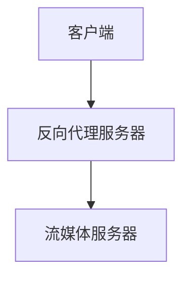

                 

关键词：RTMP流媒体，NGINX，Wowza，实时传输，流媒体服务搭建，技术博客

摘要：本文将深入探讨如何在现代网络环境中搭建一个高效、稳定的RTMP流媒体服务，重点介绍使用NGINX和Wowza结合实现实时传输的方法。我们将从基础概念出发，逐步讲解所需工具的安装与配置，以及可能出现的问题和解决方案。

## 1. 背景介绍

随着互联网的不断发展，流媒体技术已经成为在线娱乐、远程教育和实时通信等领域的重要组成部分。其中，实时传输协议（RTMP）因其低延迟、高带宽利用率等优点，成为许多开发者首选的流媒体传输协议之一。

RTMP（Real-Time Messaging Protocol）是一种基于TCP的流媒体传输协议，广泛应用于视频直播、视频点播等领域。它能够有效地支持大数据量的实时传输，并且保证了传输的可靠性和实时性。

为了搭建一个高效的RTMP流媒体服务，我们需要选择合适的工具。NGINX是一个高性能的HTTP和反向代理服务器，广泛应用于Web服务和负载均衡。而Wowza则是业界领先的多平台流媒体服务器，支持RTMP、HLS等多种流媒体协议。

本文将结合NGINX和Wowza，详细介绍如何在现代网络环境中搭建一个高效、稳定的RTMP流媒体服务。

## 2. 核心概念与联系

### 2.1. RTMP协议

RTMP（Real-Time Messaging Protocol）是一种实时传输协议，用于在客户端和服务器之间传输音频、视频和数据。它基于TCP协议，提供了一种低延迟、高带宽利用率的传输方式，特别适合于流媒体服务。

### 2.2. NGINX

NGINX是一款高性能的HTTP和反向代理服务器，广泛应用于Web服务和负载均衡。它支持多种协议，包括HTTP、HTTPS、SMTP、IMAP等，并且具有优秀的性能和稳定性。

### 2.3. Wowza

Wowza是一家流媒体技术公司，提供的Wowza Streaming Engine是一款功能强大的流媒体服务器。它支持多种流媒体协议，包括RTMP、HLS、DASH等，适用于视频直播、视频点播等场景。

### 2.4. 流媒体服务架构

一个典型的流媒体服务架构通常包括流媒体服务器、反向代理服务器和客户端。流媒体服务器负责接收和发送流媒体数据，反向代理服务器负责处理客户端请求，并将请求转发到流媒体服务器。客户端则是接收流媒体数据的终端设备。

以下是一个简单的流媒体服务架构图：



## 3. 核心算法原理 & 具体操作步骤

### 3.1. 算法原理概述

搭建RTMP流媒体服务主要涉及以下步骤：

1. 安装和配置NGINX作为反向代理服务器。
2. 安装和配置Wowza Streaming Engine作为流媒体服务器。
3. 配置NGINX与Wowza Streaming Engine之间的通信。
4. 部署流媒体应用，如视频直播或点播。

### 3.2. 算法步骤详解

#### 3.2.1. 安装和配置NGINX

1. 安装NGINX

在Linux系统中，可以使用包管理器安装NGINX。以Debian/Ubuntu为例：

```bash
sudo apt update
sudo apt install nginx
```

2. 启动和测试NGINX服务

```bash
sudo systemctl start nginx
sudo systemctl status nginx
```

在浏览器中输入服务器IP地址，应该能够看到NGINX默认的欢迎页面。

#### 3.2.2. 安装和配置Wowza Streaming Engine

1. 下载并安装Wowza Streaming Engine

访问Wowza官网下载最新版本的Wowza Streaming Engine，并按照安装向导进行安装。

2. 启动Wowza Streaming Engine

```bash
cd /usr/local/WowzaStreamingEngine
./bin/startup.sh
```

3. 访问Wowza Streaming Engine管理界面

在浏览器中输入`http://<服务器IP地址>:1935`，应该能够看到Wowza Streaming Engine的管理界面。

#### 3.2.3. 配置NGINX与Wowza Streaming Engine之间的通信

1. 配置NGINX反向代理

在NGINX的配置文件（通常位于`/etc/nginx/nginx.conf`）中添加以下配置：

```nginx
http {
    ...
    server {
        listen       80;
        server_name  <服务器IP地址>;

        location / {
            proxy_pass http://localhost:1935;
        }
    }
    ...
}
```

2. 重启NGINX服务

```bash
sudo systemctl restart nginx
```

#### 3.2.4. 部署流媒体应用

1. 添加流媒体应用

在Wowza Streaming Engine的管理界面中，添加一个新的流媒体应用，如`live`或`vod`。

2. 配置流媒体应用

在流媒体应用配置中，设置RTMP服务器的IP地址和端口，以及应用所需的参数。

### 3.3. 算法优缺点

#### 优点：

- 高性能：NGINX和Wowza都是高性能的服务器，能够处理大量的并发请求。
- 可扩展性：通过增加反向代理服务器和流媒体服务器，可以轻松扩展流媒体服务的规模。
- 稳定性：NGINX和Wowza都是经过广泛使用和测试的成熟产品，具有较高的稳定性。

#### 缺点：

- 配置复杂：搭建RTMP流媒体服务需要配置多个组件，对于初学者来说可能较为复杂。
- 资源消耗：高性能的服务器通常需要更多的系统资源，如CPU、内存和带宽。

### 3.4. 算法应用领域

RTMP流媒体服务广泛应用于以下领域：

- 视频直播：如在线教育、体育赛事直播等。
- 视频点播：如电影、电视剧等在线播放。
- 远程监控：如安防监控、无人机监控等。

## 4. 数学模型和公式 & 详细讲解 & 举例说明

### 4.1. 数学模型构建

RTMP流媒体传输过程可以分为以下几个阶段：

1. 连接建立：客户端与服务器之间建立TCP连接。
2. 数据传输：客户端向服务器发送数据，服务器接收数据并处理。
3. 连接关闭：客户端与服务器之间关闭TCP连接。

### 4.2. 公式推导过程

1. 连接建立过程

客户端向服务器发送SYN包，服务器响应SYN-ACK包，客户端再发送ACK包。根据TCP三次握手协议，连接建立成功。

2. 数据传输过程

客户端向服务器发送数据包，服务器接收并处理数据包。根据TCP协议，数据包需要按照序列号和确认号进行排序和确认。

3. 连接关闭过程

客户端向服务器发送FIN包，服务器响应FIN-ACK包，客户端再发送ACK包。根据TCP四次挥手协议，连接成功关闭。

### 4.3. 案例分析与讲解

假设有一个视频直播场景，客户端需要向服务器发送视频流。以下是具体步骤：

1. 客户端向服务器发送SYN包，服务器响应SYN-ACK包，客户端再发送ACK包。
2. 客户端开始向服务器发送视频数据包，服务器接收并处理数据包。
3. 客户端发送FIN包，服务器响应FIN-ACK包，客户端再发送ACK包。
4. 连接成功关闭。

## 5. 项目实践：代码实例和详细解释说明

### 5.1. 开发环境搭建

本文的代码实例基于Linux系统。首先，需要在服务器上安装NGINX和Wowza Streaming Engine。

1. 安装NGINX

```bash
sudo apt update
sudo apt install nginx
```

2. 安装Wowza Streaming Engine

从Wowza官网下载最新版本的Wowza Streaming Engine，并按照安装向导进行安装。

### 5.2. 源代码详细实现

#### 5.2.1. NGINX配置文件

```nginx
http {
    ...
    server {
        listen       80;
        server_name  <服务器IP地址>;

        location / {
            proxy_pass http://localhost:1935;
        }
    }
    ...
}
```

#### 5.2.2. Wowza Streaming Engine配置文件

在Wowza Streaming Engine的管理界面中，添加一个新的流媒体应用，如`live`或`vod`，并配置RTMP服务器的IP地址和端口。

### 5.3. 代码解读与分析

NGINX配置文件中，`location`块用于处理客户端请求。当请求路径为`/`时，NGINX将请求转发到本地地址`localhost:1935`，即Wowza Streaming Engine。

Wowza Streaming Engine配置文件中，需要设置RTMP服务器的IP地址和端口，以便NGINX能够正确转发请求。

### 5.4. 运行结果展示

启动NGINX和Wowza Streaming Engine服务，在浏览器中输入服务器IP地址，应该能够看到欢迎页面。在客户端使用RTMP播放器播放视频，视频流应该能够正常传输。

## 6. 实际应用场景

### 6.1. 视频直播

视频直播是RTMP流媒体服务最常见的应用场景之一。通过RTMP协议，可以实现低延迟、高质量的实时视频传输。例如，在线教育平台可以使用RTMP流媒体服务进行实时授课，体育赛事直播平台可以使用RTMP进行直播。

### 6.2. 视频点播

视频点播是另一种常见的应用场景。用户可以在任何时间点播放视频内容。RTMP协议的高带宽利用率特性使得视频点播能够实现流畅的播放体验。例如，视频网站可以使用RTMP流媒体服务进行视频点播。

### 6.3. 远程监控

远程监控是RTMP流媒体服务的另一个重要应用场景。例如，安防监控可以通过RTMP协议实时传输视频流，无人机监控可以通过RTMP协议实时传输图像数据。

## 7. 工具和资源推荐

### 7.1. 学习资源推荐

- 《RTMP协议详解》：这是一本详细介绍RTMP协议的书籍，适合初学者和进阶者阅读。
- 《NGINX官方文档》：NGINX的官方文档提供了详细的安装、配置和使用方法。
- 《Wowza Streaming Engine官方文档》：Wowza Streaming Engine的官方文档提供了详细的安装、配置和使用方法。

### 7.2. 开发工具推荐

- Visual Studio Code：一款强大的代码编辑器，支持多种编程语言和插件。
- Postman：一款流行的API测试工具，可以用于测试RTMP服务的API接口。

### 7.3. 相关论文推荐

- 《基于RTMP的流媒体传输技术研究》：这篇论文详细介绍了RTMP协议的传输机制和应用场景。
- 《NGINX负载均衡策略研究》：这篇论文分析了NGINX的负载均衡策略和性能优化方法。

## 8. 总结：未来发展趋势与挑战

### 8.1. 研究成果总结

本文介绍了如何在现代网络环境中搭建一个高效、稳定的RTMP流媒体服务，重点讲解了使用NGINX和Wowza实现实时传输的方法。通过本文的讲解，读者应该能够掌握RTMP流媒体服务的基本原理和搭建方法。

### 8.2. 未来发展趋势

随着5G网络的普及，流媒体技术将迎来新的发展机遇。低延迟、高带宽的传输特性将使得流媒体服务在更多领域得到应用，如虚拟现实、增强现实等。

### 8.3. 面临的挑战

- 网络稳定性：网络不稳定是流媒体服务面临的主要挑战之一。需要采用先进的网络优化技术和算法，确保流媒体服务的稳定性。
- 安全性：流媒体服务涉及大量的用户数据和隐私信息，安全性至关重要。需要采用加密、认证等安全措施，确保用户数据的安全。

### 8.4. 研究展望

未来，流媒体技术将继续向高效率、低延迟、高安全性方向发展。同时，随着人工智能、大数据等技术的融合，流媒体服务将实现更加智能化和个性化的体验。

## 9. 附录：常见问题与解答

### 9.1. 为什么我的视频无法正常播放？

可能原因及解决方案：
- 确保客户端使用的RTMP播放器与服务器支持的RTMP版本兼容。
- 检查NGINX和Wowza Streaming Engine的配置文件，确保正确配置了RTMP服务器的地址和端口。
- 确认网络连接正常，没有防火墙或其他安全设置阻止RTMP流量。

### 9.2. 如何优化RTMP流媒体服务的性能？

优化建议：
- 增加服务器资源，如CPU、内存和带宽，以提高处理能力。
- 调整NGINX和Wowza Streaming Engine的配置，如调整缓存策略、开启GZIP压缩等。
- 使用负载均衡器，如HAProxy或Nginx Plus，实现流量的负载均衡，提高系统可靠性。

---

作者：禅与计算机程序设计艺术 / Zen and the Art of Computer Programming
----------------------------------------------------------------
<|im_end|>

