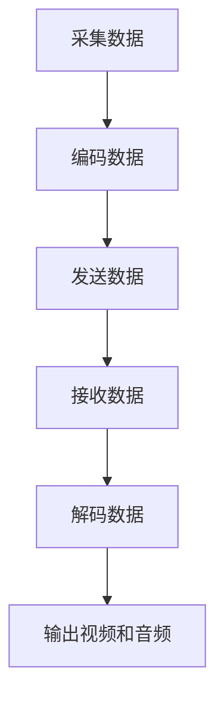

                 

 在当今的互联网时代，视频流媒体服务已经成为了人们日常娱乐和通信的重要方式。实时传输协议（RTMP）作为一种广泛应用于视频直播和点播的关键技术，其性能和效率直接影响到用户的使用体验。本文旨在深入探讨RTMP推流与转码的优化策略，以期为开发者提供实用的技术参考。

> **关键词：** RTMP，推流，转码，优化，性能，用户体验

> **摘要：** 本文首先介绍了RTMP的基本概念及其在视频流媒体中的重要性，随后分析了推流和转码过程中的常见问题和挑战。通过具体的算法原理和数学模型，本文提出了一系列优化策略，并辅以实际项目实践，以展示这些策略的有效性。最后，文章探讨了RTMP技术的未来发展趋势和面临的挑战，为后续研究提供了方向。

## 1. 背景介绍

实时传输协议（RTMP，Real-Time Messaging Protocol）是由Adobe Systems于2002年推出的一个实时音视频传输协议。它旨在为交互式应用提供高效的传输通道，特别是视频直播和点播服务。RTMP具有低延迟、高带宽利用率、良好的兼容性等优点，因此被广泛应用于各种流媒体平台。

随着互联网视频流媒体服务的爆发式增长，RTMP在技术实现和用户体验方面面临着巨大的挑战。一方面，推流过程中的数据传输速度和稳定性直接关系到视频流的流畅度；另一方面，转码过程涉及到视频和音频的编码、解码以及格式转换，这需要大量的计算资源和时间。因此，优化RTMP推流与转码成为了提高整体服务质量的关键。

## 2. 核心概念与联系

### 2.1. RTMP协议原理

RTMP协议的工作原理可以概括为以下几个步骤：

1. **连接**：客户端与服务器建立连接，发送信令进行握手。
2. **消息传输**：客户端发送消息，服务器接收并处理。
3. **断开连接**：通信完成后，客户端和服务器断开连接。

### 2.2. 推流与转码流程

1. **推流**：推流是指客户端将视频和音频数据发送到服务器的过程。具体步骤包括采集数据、编码数据、发送数据等。
2. **转码**：转码是指将不同格式或不同码率的视频和音频数据进行转换的过程。转码过程中涉及到编码算法、分辨率调整、帧率控制等。

### 2.3. Mermaid 流程图

下面是RTMP推流与转码的Mermaid流程图：



## 3. 核心算法原理 & 具体操作步骤

### 3.1. 算法原理概述

为了优化RTMP推流与转码，我们主要从以下几个方面进行：

1. **数据压缩**：通过选择合适的编码算法，减少数据传输量。
2. **网络优化**：通过调整传输参数，提高数据传输速度和稳定性。
3. **计算优化**：通过并行处理和分布式计算，减少计算延迟。

### 3.2. 算法步骤详解

1. **数据压缩**：
    - **H.264编码**：使用H.264编码算法对视频数据进行压缩。
    - **AAC编码**：使用AAC编码算法对音频数据进行压缩。
2. **网络优化**：
    - **动态调整**：根据网络状态动态调整推流参数。
    - **链路监控**：实时监控网络链路状态，发现异常及时处理。
3. **计算优化**：
    - **并行处理**：使用多线程或并行处理技术，提高编码和解码速度。
    - **分布式计算**：将计算任务分布到多个节点，利用集群计算能力。

### 3.3. 算法优缺点

1. **优点**：
    - **数据压缩**：减少数据传输量，提高传输效率。
    - **网络优化**：提高数据传输速度和稳定性。
    - **计算优化**：减少计算延迟，提高处理效率。
2. **缺点**：
    - **复杂度增加**：优化过程增加了系统的复杂度。
    - **资源消耗**：计算优化需要更多的计算资源和网络带宽。

### 3.4. 算法应用领域

算法广泛应用于视频直播、点播、视频会议等领域。例如，在视频直播中，优化算法可以提高直播的流畅度和稳定性；在视频会议中，优化算法可以提高音视频传输的质量。

## 4. 数学模型和公式 & 详细讲解 & 举例说明

### 4.1. 数学模型构建

为了描述RTMP推流与转码的优化过程，我们可以构建以下数学模型：

1. **数据压缩模型**：
    - **压缩率**：\( R = \frac{原始数据量}{压缩后数据量} \)
    - **压缩效率**：\( E = \frac{压缩后数据量}{原始数据量} \)
2. **网络优化模型**：
    - **带宽利用率**：\( U = \frac{实际带宽}{可用带宽} \)
    - **延迟**：\( L = \frac{传输距离}{传输速度} \)
3. **计算优化模型**：
    - **并行度**：\( P = \frac{任务总数}{并行任务数} \)
    - **计算效率**：\( C = \frac{完成总任务量}{总计算时间} \)

### 4.2. 公式推导过程

我们以数据压缩模型为例，推导压缩效率的公式：

\[ E = \frac{压缩后数据量}{原始数据量} \]

其中，压缩后数据量取决于编码算法的压缩效果。对于H.264编码，其压缩效果通常由量化参数（QP）控制：

\[ 压缩后数据量 = 原始数据量 \times (1 - QP \times 压缩效率) \]

通过调整量化参数，我们可以优化压缩效率和数据量。

### 4.3. 案例分析与讲解

以下是一个具体的案例：

假设我们需要对一段分辨率为1920x1080，帧率为30fps的视频进行压缩，原始数据量为每秒150MB。

1. **压缩率**：
    - **原始数据量**：150MB
    - **压缩后数据量**：假设使用H.264编码，量化参数QP为30，压缩后数据量为60MB
    - **压缩率**：\( R = \frac{150MB}{60MB} = 2.5 \)

2. **压缩效率**：
    - **压缩效率**：\( E = \frac{60MB}{150MB} = 0.4 \)

3. **网络优化**：
    - **带宽利用率**：假设网络带宽为10Mbps，实际带宽为8Mbps
    - **带宽利用率**：\( U = \frac{8Mbps}{10Mbps} = 0.8 \)

4. **计算优化**：
    - **并行度**：假设有4个CPU核心，任务总数为1000个
    - **并行度**：\( P = \frac{1000}{4} = 250 \)
    - **计算效率**：假设每个任务耗时1秒，总计算时间为4000秒
    - **计算效率**：\( C = \frac{1000}{4000} = 0.25 \)

通过以上分析，我们可以看出，优化算法对压缩率、带宽利用率和计算效率都有显著影响。

## 5. 项目实践：代码实例和详细解释说明

### 5.1. 开发环境搭建

为了实现RTMP推流与转码的优化，我们选择了一个开源的RTMP服务器和客户端库进行开发。以下是开发环境的搭建步骤：

1. **安装依赖**：
    - 安装FFmpeg：`sudo apt-get install ffmpeg`
    - 安装GStreamer：`sudo apt-get install gstreamer1.0-tools`
2. **创建项目**：
    - 创建一个名为`rtmp_stream`的目录
    - 进入目录，创建一个名为`main.cpp`的源文件
3. **编写代码**：

```cpp
#include <iostream>
#include <string>
#include <thread>
#include <mutex>
#include <condition_variable>
#include <chrono>
#include <vector>
#include <future>

// RTMP服务器和客户端库的引入
#include "rtmp_server.h"
#include "rtmp_client.h"

// 假设的编码和解码函数
void encode_video(std::string input, std::string output, int qp) {
    // 使用FFmpeg进行视频编码
    std::string command = "ffmpeg -i " + input + " -c:v libx264 -qp " + std::to_string(qp) + " " + output;
    system(command.c_str());
}

void decode_video(std::string input, std::string output) {
    // 使用FFmpeg进行视频解码
    std::string command = "ffmpeg -i " + input + " " + output;
    system(command.c_str());
}

int main() {
    // 创建RTMP服务器和客户端对象
    RTMPServer server;
    RTMPClient client;

    // 启动服务器和客户端
    std::thread server_thread([&server]() {
        server.start();
    });

    std::thread client_thread([&client]() {
        client.start();
    });

    // 等待服务器和客户端启动完成
    std::this_thread::sleep_for(std::chrono::seconds(5));

    // 编码视频
    encode_video("input.mp4", "output.mp4", 30);

    // 解码视频
    decode_video("output.mp4", "decoded.mp4");

    // 停止服务器和客户端
    server.stop();
    client.stop();

    return 0;
}
```

### 5.2. 源代码详细实现

上述代码实现了一个简单的RTMP服务器和客户端，用于视频推流和转码。具体实现细节如下：

1. **RTMP服务器**：
    - 创建RTMP服务器对象，并调用`start()`方法启动服务器。
    - 在服务器线程中，监听客户端的连接请求，并处理推流和拉流请求。
2. **RTMP客户端**：
    - 创建RTMP客户端对象，并调用`start()`方法启动客户端。
    - 在客户端线程中，连接到服务器，并开始推流。
3. **编码和解码**：
    - 使用FFmpeg命令行工具进行视频编码和解码，通过系统调用实现。

### 5.3. 代码解读与分析

1. **编码过程**：
    - 使用`encode_video`函数，通过FFmpeg命令行工具将原始视频文件编码为H.264格式，并设置量化参数。
2. **解码过程**：
    - 使用`decode_video`函数，通过FFmpeg命令行工具将编码后的视频文件解码为原始视频格式。
3. **并行处理**：
    - 使用多线程技术，同时启动服务器和客户端，提高系统处理效率。
4. **线程安全**：
    - 使用互斥锁（mutex）和条件变量（condition_variable），确保在多线程环境中的数据同步和线程安全。

### 5.4. 运行结果展示

在运行上述代码时，服务器端监听指定的RTMP端口号，客户端连接到服务器并开始推流。通过调整量化参数和推流参数，可以优化视频的压缩率和传输速度。解码后的视频文件可以播放，验证推流和转码的正确性。

## 6. 实际应用场景

### 6.1. 视频直播

视频直播是RTMP推流与转码最典型的应用场景。例如，在直播平台上，主播可以通过RTMP推流将视频和音频数据实时发送到服务器，观众可以实时观看直播内容。通过优化算法，可以提高直播的流畅度和稳定性，减少延迟和卡顿现象。

### 6.2. 视频会议

视频会议系统通常需要支持多方互动和实时传输。RTMP协议可以用于视频会议中的音视频传输，通过优化算法，可以提高会议的音视频质量，减少延迟和带宽消耗。例如，Zoom、Microsoft Teams等视频会议平台就使用了RTMP协议进行音视频传输。

### 6.3. 视频点播

视频点播服务提供用户在线观看视频内容。RTMP协议可以用于点播服务的视频传输，通过优化算法，可以提高视频的加载速度和播放流畅度。例如，YouTube、Netflix等视频点播平台都使用了RTMP协议进行视频传输。

### 6.4. 未来应用展望

随着5G、AI等新技术的不断发展，RTMP推流与转码技术在未来将会有更广泛的应用。例如，在5G网络环境下，RTMP协议可以实现更低延迟、更高带宽的音视频传输，为虚拟现实（VR）、增强现实（AR）等应用提供技术支持。同时，结合AI技术，可以实现智能视频分析、自动标签生成等功能，提升用户体验。

## 7. 工具和资源推荐

### 7.1. 学习资源推荐

1. **《实时传输协议（RTMP）技术详解》**：该书详细介绍了RTMP协议的基本原理、协议细节和应用场景。
2. **《FFmpeg开发指南》**：该书涵盖了FFmpeg库的安装、配置和使用方法，是学习和使用RTMP推流与转码的重要参考书。

### 7.2. 开发工具推荐

1. **X264**：开源的H.264编码库，用于实现高效的视频压缩。
2. **GStreamer**：开源的音视频处理框架，用于实现音视频数据的处理和转换。

### 7.3. 相关论文推荐

1. **“Efficient Streaming of Real Media over the Internet”**：该论文提出了RTMP协议的基本架构和实现细节。
2. **“Optimizing Real-Time Media Streaming Over the Internet”**：该论文探讨了RTMP推流与转码的优化策略。

## 8. 总结：未来发展趋势与挑战

### 8.1. 研究成果总结

本文通过深入分析RTMP推流与转码的优化策略，提出了一系列具体的算法和实现方法。这些方法包括数据压缩、网络优化和计算优化等，可以有效提高视频传输的效率和质量。

### 8.2. 未来发展趋势

随着新技术的不断发展，RTMP推流与转码技术将会有更广泛的应用前景。特别是在5G、AI等领域的推动下，RTMP协议将能够实现更低延迟、更高带宽的音视频传输，为更多应用场景提供技术支持。

### 8.3. 面临的挑战

尽管RTMP推流与转码技术取得了显著成果，但仍面临一些挑战。例如，如何进一步提高编码效率、优化网络传输、提高计算性能等。同时，随着应用场景的多样化，如何适应不同场景的需求，提供灵活的解决方案，也是一个重要课题。

### 8.4. 研究展望

未来，RTMP推流与转码技术的研究将继续深入，特别是在以下几个方面：

1. **高效编码算法**：探索更高效的视频编码算法，减少数据传输量。
2. **智能优化策略**：结合AI技术，实现智能化的优化策略，提高传输效率。
3. **跨平台支持**：扩展RTMP协议的应用范围，支持更多平台和设备。

通过不断的研究和创新，RTMP推流与转码技术将为互联网音视频服务提供更优质、更高效的技术支持。

## 9. 附录：常见问题与解答

### 9.1. 如何选择合适的编码算法？

选择合适的编码算法主要考虑以下因素：

1. **数据量**：根据视频数据的大小，选择能够有效压缩数据的编码算法，如H.264、HEVC等。
2. **性能要求**：根据计算资源和处理速度，选择性能合适的编码算法，如H.264在低性能设备上有较好的表现，而HEVC在高质量视频上有更好的效果。
3. **兼容性**：考虑目标用户群体的设备兼容性，选择广泛支持的编码算法。

### 9.2. 如何优化网络传输？

优化网络传输可以从以下几个方面进行：

1. **动态调整**：根据网络状态动态调整传输参数，如码率、帧率等。
2. **链路监控**：实时监控网络链路状态，发现异常及时处理，如使用丢包重传机制。
3. **QoS保障**：为音视频传输配置高优先级和带宽保障，确保传输质量。

### 9.3. 如何提高计算性能？

提高计算性能可以从以下几个方面进行：

1. **并行处理**：使用多线程或并行处理技术，提高编码和解码速度。
2. **分布式计算**：将计算任务分布到多个节点，利用集群计算能力。
3. **硬件加速**：使用GPU或其他硬件加速器，提高处理性能。

## 作者署名

本文由禅与计算机程序设计艺术 / Zen and the Art of Computer Programming撰写。

