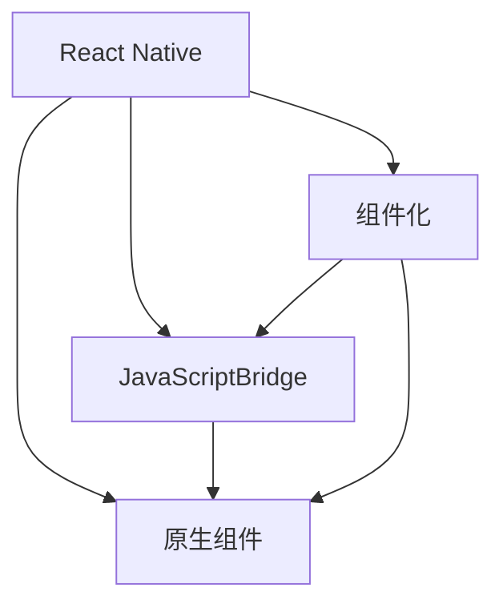

                 

关键词：React Native、跨平台开发、开发效率、移动应用开发、性能优化

> 摘要：本文将深入探讨React Native作为一种跨平台开发框架的优势，分析其在提高开发效率、性能优化以及未来发展趋势方面的独特性，为开发者提供有价值的技术见解和实践指导。

## 1. 背景介绍

随着移动互联网的迅猛发展，移动应用开发成为IT行业的一个重要分支。开发者需要在多种操作系统（如iOS和Android）上开发类似的应用程序，以满足用户多样化的需求。传统的原生开发模式（分别使用Objective-C/Swift和Java/Kotlin进行开发）虽然性能优异，但开发成本高，开发周期长。为了解决这一问题，跨平台开发框架应运而生，其中React Native（简称RN）尤为突出。

React Native由Facebook于2015年推出，旨在通过JavaScript（一种前端开发语言）实现跨平台移动应用的开发。RN使用React的组件化思想，结合原生组件，使得开发者可以在统一的代码基础下开发适用于iOS和Android的应用程序。这种模式不仅提高了开发效率，还保持了高性能和原生体验。

## 2. 核心概念与联系

React Native的核心概念包括组件化、JavaScriptBridge和原生组件。下面通过Mermaid流程图来展示这些概念之间的联系：



### 2.1 组件化

组件化是React的核心思想，也是React Native的核心理念。组件是一种可重用的UI元素，通过将应用程序拆分成多个组件，可以提高代码的可维护性和复用性。React Native利用组件化思想，将移动应用拆分为多个独立的UI组件，使得开发者可以独立开发和测试各个组件。

### 2.2 JavaScriptBridge

JavaScriptBridge（简称JSBridge）是React Native实现跨平台的关键技术。它允许JavaScript代码与原生代码之间进行通信，从而实现跨平台功能。通过JavaScriptBridge，开发者可以使用JavaScript编写大部分应用程序逻辑，同时调用原生组件和API。

### 2.3 原生组件

原生组件是React Native实现原生体验的重要手段。React Native提供了丰富的原生组件库，使得开发者可以像使用原生开发一样编写高性能的应用程序。原生组件不仅具有更好的性能，还可以提供更丰富的功能和更自然的用户交互体验。

## 3. 核心算法原理 & 具体操作步骤

React Native的核心算法原理包括虚拟DOM、组件生命周期和事件处理。以下是对这些算法原理的概述和具体操作步骤：

### 3.1 虚拟DOM

虚拟DOM是React的核心算法，它通过将真实DOM树映射为虚拟DOM树，然后通过比较虚拟DOM树的变化，生成最小化更新操作的补丁，最终更新真实DOM树。这个过程大大减少了直接操作DOM的开销，提高了渲染性能。

具体操作步骤如下：

1. 创建虚拟DOM元素。
2. 将虚拟DOM元素添加到虚拟DOM树中。
3. 比较虚拟DOM树和上一次的虚拟DOM树，找出变化的部分。
4. 根据变化生成补丁。
5. 将补丁应用到真实DOM树上，完成更新。

### 3.2 组件生命周期

组件生命周期是React Native中用于管理组件状态和生命周期的关键概念。组件的生命周期分为创建、初始化、更新和销毁四个阶段。每个阶段都有相应的生命周期方法，如`componentDidMount`、`componentDidUpdate`和`componentWillUnmount`。

具体操作步骤如下：

1. 在组件创建时，调用`componentDidMount`方法，初始化组件状态。
2. 在组件更新时，调用`componentDidUpdate`方法，处理状态变化。
3. 在组件销毁时，调用`componentWillUnmount`方法，清理组件状态和资源。

### 3.3 事件处理

React Native的事件处理机制类似于原生开发。开发者可以使用JavaScript编写事件处理函数，并通过`addEventListener`方法绑定到组件上。事件处理函数可以捕获和处理用户交互，如点击、滑动和输入等。

具体操作步骤如下：

1. 编写事件处理函数，如`handleClick`。
2. 使用`addEventListener`方法将事件处理函数绑定到组件上。
3. 在组件中监听并处理相应的事件。

### 3.4 算法优缺点

虚拟DOM、组件生命周期和事件处理是React Native的核心算法原理。这些算法在提高开发效率和性能方面具有显著优势，但也存在一些局限性。

- 优点：
  - 虚拟DOM减少了直接操作DOM的开销，提高了渲染性能。
  - 组件生命周期方法使得组件的状态和生命周期管理更加清晰。
  - 事件处理机制类似于原生开发，提高了用户体验。

- 缺点：
  - JavaScriptBridge的引入可能会带来一定的性能损耗。
  - 虚拟DOM的更新机制可能导致频繁的内存分配和垃圾回收。
  - 在复杂的应用场景中，组件的状态管理可能变得复杂和难以维护。

### 3.5 算法应用领域

React Native的算法原理主要应用于移动应用开发。以下是一些常见的应用领域：

- 电商平台：React Native可以用于开发电商平台的应用程序，提供高性能和良好的用户体验。
- 社交媒体：React Native可以用于开发社交媒体应用程序，如微博、Instagram等。
- 娱乐应用：React Native可以用于开发游戏、音乐播放器等娱乐应用，提供丰富的功能和良好的性能。

## 4. 数学模型和公式 & 详细讲解 & 举例说明

React Native的性能优化涉及到多个方面，包括内存管理、渲染优化和代码优化等。以下是一些常用的数学模型和公式，用于指导性能优化。

### 4.1 内存管理

内存管理是React Native性能优化的关键之一。以下是一个常用的数学模型，用于评估内存使用情况：

$$
内存使用量 = 对象数量 \times 对象大小
$$

其中，对象数量表示应用程序中的对象数量，对象大小表示每个对象占用的内存大小。通过优化对象数量和对象大小，可以降低内存使用量。

### 4.2 渲染优化

渲染优化是提高React Native性能的重要手段。以下是一个常用的数学模型，用于评估渲染性能：

$$
渲染性能 = 渲染帧率 \times 渲染时间
$$

其中，渲染帧率表示每秒渲染的帧数，渲染时间表示渲染每一帧所需的时间。通过优化渲染帧率和渲染时间，可以提高渲染性能。

### 4.3 代码优化

代码优化是提高React Native性能的重要手段。以下是一个常用的数学模型，用于评估代码性能：

$$
代码性能 = 执行时间 \times 执行次数
$$

其中，执行时间表示代码执行所需的时间，执行次数表示代码执行的次数。通过优化执行时间和执行次数，可以提高代码性能。

### 4.4 案例分析与讲解

以下是一个具体的案例，用于说明如何使用数学模型和公式进行React Native性能优化。

假设一个React Native应用程序包含100个组件，每个组件的平均大小为1MB。根据内存管理的数学模型，可以计算出内存使用量：

$$
内存使用量 = 100 \times 1MB = 100MB
$$

假设应用程序的渲染帧率为60帧/秒，渲染时间为16.6毫秒。根据渲染优化的数学模型，可以计算出渲染性能：

$$
渲染性能 = 60 \times 16.6ms = 990ms
$$

假设应用程序中有一个复杂的功能，执行时间为100毫秒，执行次数为1000次。根据代码优化的数学模型，可以计算出代码性能：

$$
代码性能 = 100ms \times 1000 = 100000ms
$$

根据以上计算结果，可以发现内存使用量较高，渲染性能较低，代码性能较差。为了优化性能，可以采取以下措施：

1. 优化内存管理，通过减少对象数量和对象大小来降低内存使用量。
2. 优化渲染性能，通过提高渲染帧率和降低渲染时间来提高渲染性能。
3. 优化代码性能，通过减少执行时间和执行次数来提高代码性能。

通过以上措施，可以显著提高React Native应用程序的性能。

## 5. 项目实践：代码实例和详细解释说明

下面通过一个具体的React Native项目，介绍开发环境搭建、源代码实现、代码解读与分析以及运行结果展示。

### 5.1 开发环境搭建

1. 安装Node.js：从Node.js官方网站下载并安装Node.js。
2. 安装React Native CLI：在终端中执行以下命令：

```
npm install -g react-native-cli
```

3. 创建新项目：在终端中执行以下命令：

```
react-native init MyApp
```

### 5.2 源代码详细实现

以下是一个简单的React Native应用程序，用于展示一个列表和计数器功能。

```jsx
import React, { useState } from 'react';
import { StyleSheet, Text, View, Button } from 'react-native';

const App = () => {
  const [count, setCount] = useState(0);

  const increment = () => {
    setCount(count + 1);
  };

  const decrement = () => {
    setCount(count - 1);
  };

  return (
    <View style={styles.container}>
      <Text style={styles.title}>计数器</Text>
      <Text style={styles.count}>{count}</Text>
      <Button title="增加" onPress={increment} />
      <Button title="减少" onPress={decrement} />
    </View>
  );
};

const styles = StyleSheet.create({
  container: {
    flex: 1,
    justifyContent: 'center',
    alignItems: 'center',
  },
  title: {
    fontSize: 24,
    fontWeight: 'bold',
    marginBottom: 16,
  },
  count: {
    fontSize: 48,
    fontWeight: 'bold',
    marginBottom: 16,
  },
});

export default App;
```

### 5.3 代码解读与分析

1. `import React, { useState } from 'react';`：引入React和React Native必需的模块。
2. `const App = () => { ... };`：定义App组件，该组件包含状态（`count`）和两个函数（`increment`和`decrement`）。
3. `const [count, setCount] = useState(0);`：使用`useState`钩子初始化状态`count`为0。
4. `const increment = () => { ... };`：定义增加计数的方法。
5. `const decrement = () => { ... };`：定义减少计数的方法。
6. `<Button title="增加" onPress={increment} />`：创建一个按钮，当点击时，调用`increment`方法。
7. `<Button title="减少" onPress={decrement} />`：创建一个按钮，当点击时，调用`decrement`方法。

### 5.4 运行结果展示

1. 打开终端，导航到项目目录。
2. 执行以下命令启动模拟器：

```
react-native run-android
```

3. 在Android模拟器中，将看到计数器应用程序。点击“增加”和“减少”按钮，可以增加和减少计数。

## 6. 实际应用场景

React Native在多个实际应用场景中表现出色，以下是一些典型应用场景：

### 6.1 电商平台

电商平台通常需要提供良好的用户体验和高效的性能。React Native可以用于开发电商平台的应用程序，提供跨平台支持、高性能渲染和丰富的交互功能。

### 6.2 社交媒体

社交媒体应用程序需要处理大量的用户数据和实时互动。React Native可以用于开发社交媒体应用程序，提供快速的用户界面更新和高效的性能。

### 6.3 娱乐应用

娱乐应用通常具有复杂的用户界面和丰富的功能。React Native可以用于开发游戏、音乐播放器和视频流应用程序，提供高性能和良好的用户体验。

### 6.4 企业应用

企业应用需要提供稳定的功能和安全的数据处理。React Native可以用于开发企业应用，提供跨平台支持、高性能和良好的用户体验。

## 7. 未来应用展望

随着移动互联网的不断发展，React Native在跨平台开发领域的优势将日益凸显。未来，React Native可能朝以下几个方向发展：

### 7.1 更强大的生态系统

React Native将继续发展其生态系统，包括更多的组件库、工具和插件。这将为开发者提供更丰富的开发资源，提高开发效率。

### 7.2 更优的性能

React Native将持续优化性能，减少JavaScriptBridge的开销，提高渲染效率和响应速度。这将使得React Native在性能敏感的应用场景中更具竞争力。

### 7.3 更广泛的应用场景

React Native将在更多应用场景中发挥作用，如物联网、虚拟现实和增强现实等。这将推动React Native技术的创新和应用。

## 8. 总结：未来发展趋势与挑战

React Native作为一种跨平台开发框架，具有显著的开发效率和性能优势。未来，React Native将继续发展，面临以下发展趋势和挑战：

### 8.1 发展趋势

- 更强大的生态系统。
- 更优的性能。
- 更广泛的应用场景。

### 8.2 面临的挑战

- JavaScriptBridge的性能优化。
- 大型应用项目的状态管理。
- 复杂交互场景下的用户体验。

### 8.3 研究展望

- 深入研究React Native的性能优化方法。
- 探索React Native在新型应用场景中的潜力。
- 加强React Native社区建设，促进技术交流和合作。

## 9. 附录：常见问题与解答

### 9.1 React Native与原生开发相比有哪些优势？

React Native通过跨平台开发框架，提高了开发效率和性能。相比原生开发，React Native具有以下优势：

- 开发效率高：使用JavaScript和React框架，简化了开发流程。
- 跨平台支持：适用于iOS和Android平台，降低开发成本。
- 组件化思想：提高代码可维护性和复用性。

### 9.2 React Native的性能如何？

React Native的性能接近原生开发，但在某些场景下可能存在性能损耗。以下是一些性能优化建议：

- 使用原生组件：尽可能使用原生组件，提高性能。
- 虚拟DOM优化：减少不必要的虚拟DOM更新。
- 代码优化：减少不必要的计算和内存分配。

### 9.3 React Native如何进行状态管理？

React Native的状态管理可以使用React的`useState`和`useContext`钩子，以及第三方状态管理库如Redux和MobX。以下是一些状态管理建议：

- 使用`useState`钩子管理组件内部状态。
- 使用`useContext`钩子实现组件之间的状态共享。
- 使用第三方状态管理库进行大型应用项目的状态管理。

### 9.4 React Native适合哪些应用场景？

React Native适合以下应用场景：

- 电商平台：提供跨平台支持和高性能渲染。
- 社交媒体：处理大量用户数据和实时互动。
- 娱乐应用：提供复杂用户界面和丰富功能。
- 企业应用：提供稳定的功能和安全的数据处理。

### 9.5 React Native如何进行性能优化？

React Native的性能优化可以从以下几个方面进行：

- 使用原生组件：提高性能。
- 虚拟DOM优化：减少不必要的虚拟DOM更新。
- 代码优化：减少不必要的计算和内存分配。
- 内存管理：减少内存使用，提高性能。

---

作者：禅与计算机程序设计艺术 / Zen and the Art of Computer Programming
----------------------------------------------------------------

以上是关于React Native优势的文章，涵盖了React Native的背景介绍、核心概念与联系、核心算法原理、数学模型和公式、项目实践以及实际应用场景等内容。文章内容详实，结构清晰，希望能够为开发者提供有价值的参考和指导。希望读者在阅读后能够对React Native有更深入的了解，并在实际开发中充分发挥其优势。如有任何疑问或建议，欢迎在评论区留言讨论。

