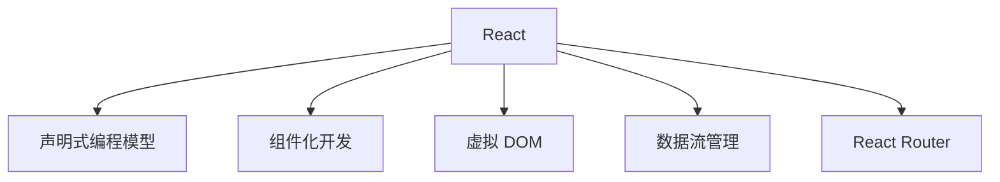

                 

## 1. 背景介绍

随着互联网的快速发展，Web 应用程序的需求日益增长。如何高效地构建动态、响应迅速且用户友好的用户界面成为开发者们关注的焦点。在这个背景下，React 框架应运而生，迅速成为前端开发领域的一颗璀璨明星。

React 是一个由 Facebook 开发的开源 JavaScript 库，旨在构建高效的 UI。它采用声明式编程模型，使得开发者可以更直观地描述用户界面，同时提供高效的渲染性能和组件化的开发方式。React 的出现不仅改变了前端开发的思维方式，还带来了前所未有的开发效率。

本文将深入探讨 React 框架的核心概念、原理与应用，帮助读者全面理解 React，掌握其使用技巧，为构建高效、动态的用户界面奠定基础。

## 2. 核心概念与联系

### React 声明式编程模型

React 的声明式编程模型是其核心特点之一。在传统的命令式编程中，开发者需要手动控制 UI 的更新过程，而声明式编程则允许开发者通过描述 UI 的状态和属性来让 React 负责渲染更新。

这种编程模型的好处在于：

1. **简化逻辑**：开发者无需关心 UI 更新的具体过程，只需关注 UI 应该是什么样子。
2. **提高可维护性**：通过状态和属性的声明，代码的结构更加清晰，易于维护。
3. **提升性能**：React 能够通过虚拟 DOM 的差异检测，实现高效的渲染更新。

### 组件化开发

React 的组件化开发理念使得开发者可以将 UI 拆分为可复用的组件，每个组件负责自己的逻辑和渲染。这种开发方式具有以下优点：

1. **模块化**：组件可以独立开发、测试和部署，提高了代码的模块化程度。
2. **可复用性**：相同的组件可以在不同的项目中复用，减少了重复工作。
3. **方便维护**：组件化的代码结构使得问题定位和维护更加方便。

### 虚拟 DOM

React 引入的虚拟 DOM 模式是一种内存中的表示，它通过轻量级的 JavaScript 对象来模拟真实的 DOM 结构。虚拟 DOM 的主要优势包括：

1. **提高性能**：React 通过对比虚拟 DOM 和真实 DOM 的差异，只更新实际变化的部分，避免了不必要的重渲染。
2. **减少资源消耗**：虚拟 DOM 的操作相比真实 DOM 更加轻量，降低了浏览器的负载。

### 数据流管理

React 通过其单向数据流机制，确保了状态的一致性和可预测性。单向数据流意味着数据从父组件传递到子组件，而不会反向传递。这种数据流模式有助于以下方面：

1. **状态管理简化**：开发者无需担心状态的不一致性，代码更加可预测。
2. **调试方便**：由于数据流单向，调试过程更加直观，定位问题更加方便。

### React Router

React Router 是 React 的路由管理库，它允许开发者为 Web 应用程序创建动态路由。通过 React Router，开发者可以轻松实现以下功能：

1. **页面跳转**：用户在浏览应用程序时可以方便地进行页面跳转。
2. **动态路由匹配**：React Router 能够根据不同的路由参数动态渲染不同的组件。
3. **导航守卫**：开发者可以设置导航守卫来控制路由的访问权限。

### Mermaid 流程图

下面是一个简单的 Mermaid 流程图，展示了 React 的核心概念和组件之间的联系：



## 2.1 核心概念原理

### 声明式编程模型

在 React 中，声明式编程模型通过 `state` 和 `props` 来描述 UI 的状态和属性。`state` 用于表示组件的内部状态，而 `props` 用于从父组件传递数据到子组件。

以下是声明式编程模型的一个简单例子：

```javascript
import React, { useState } from 'react';

function Counter() {
  const [count, setCount] = useState(0);

  return (
    <div>
      <p>You clicked {count} times</p>
      <button onClick={() => setCount(count + 1)}>
        Click me
      </button>
    </div>
  );
}
```

在这个例子中，`useState` 函数用于创建一个状态变量 `count`，并通过 `setCount` 函数来更新这个状态。React 将根据状态的改变来重新渲染组件。

### 组件化开发

在 React 中，组件是构成用户界面的基本单元。React 支持多种类型的组件，包括函数组件和类组件。

**函数组件** 是一个返回 React 元素的 JavaScript 函数，它可以通过 `props` 接收外部数据。

```javascript
function Greeting({ name }) {
  return <h1>Hello, {name}!</h1>;
}
```

**类组件** 是一个扩展了 `React.Component` 类的 JavaScript 类，它具有更多的功能，例如内部状态和方法。

```javascript
class Greeting extends React.Component {
  render() {
    return <h1>Hello, {this.props.name}!</h1>;
  }
}
```

### 虚拟 DOM

React 引入的虚拟 DOM 是一种内存中的表示，它通过轻量级的 JavaScript 对象来模拟真实的 DOM 结构。虚拟 DOM 的操作相比真实 DOM 更加轻量，降低了浏览器的负载。

React 使用一个名为 `ReactDOM` 的库来处理虚拟 DOM 的操作。以下是一个简单的例子：

```javascript
import React from 'react';
import ReactDOM from 'react-dom';

const element = <h1>Hello, world!</h1>;
ReactDOM.render(element, document.getElementById('root'));
```

在这个例子中，React 通过 `ReactDOM.render` 函数将虚拟 DOM 元素渲染到实际的 DOM 节点上。

### 数据流管理

React 的单向数据流机制确保了状态的一致性和可预测性。单向数据流意味着数据从父组件传递到子组件，而不会反向传递。

在 React 中，数据流是通过 `props` 和 `state` 来管理的。父组件可以通过 `props` 将数据传递给子组件，而子组件只能通过 `props` 来访问这些数据。

以下是一个单向数据流管理的例子：

```javascript
function ParentComponent() {
  const data = 'Hello, world!';
  return <ChildComponent data={data} />;
}

function ChildComponent({ data }) {
  return <div>{data}</div>;
}
```

在这个例子中，`ParentComponent` 通过 `props` 将 `data` 传递给 `ChildComponent`。

### React Router

React Router 是 React 的路由管理库，它允许开发者为 Web 应用程序创建动态路由。

以下是一个简单的 React Router 示例：

```javascript
import React from 'react';
import { BrowserRouter as Router, Route, Switch } from 'react-router-dom';

function Home() {
  return <h1>Home Page</h1>;
}

function About() {
  return <h1>About Page</h1>;
}

function App() {
  return (
    <Router>
      <div>
        <Switch>
          <Route exact path="/" component={Home} />
          <Route path="/about" component={About} />
        </Switch>
      </div>
    </Router>
  );
}
```

在这个例子中，React Router 通过 `<Route>` 组件来定义路由路径和对应的组件，通过 `<Switch>` 组件来确保只有一个路由路径被匹配。

## 2.2 算法原理 & 具体操作步骤

### 算法原理概述

React 的虚拟 DOM 是一种高效更新 UI 的算法。它通过以下步骤实现：

1. **创建虚拟 DOM 树**：React 首先创建一个内存中的虚拟 DOM 树，代表实际 DOM 结构。
2. **比较虚拟 DOM 树**：当组件的状态或属性发生变化时，React 将比较当前虚拟 DOM 树和上一次的虚拟 DOM 树，找出差异。
3. **更新真实 DOM**：React 根据比较结果，只更新实际变化的真实 DOM 节点，避免了不必要的重渲染。

### 算法步骤详解

以下是 React 虚拟 DOM 算法的详细步骤：

1. **创建虚拟 DOM 元素**：当组件渲染时，React 创建一个虚拟 DOM 元素，它包含类型、属性和子节点等信息。
2. **构建虚拟 DOM 树**：React 根据虚拟 DOM 元素构建出一个内存中的虚拟 DOM 树。
3. **比较虚拟 DOM 树**：当组件的状态或属性发生变化时，React 将新的虚拟 DOM 树与上一次的虚拟 DOM 树进行比较，使用一个名为“Diff 算法”的过程。
4. **更新真实 DOM**：React 根据比较结果，只更新实际变化的真实 DOM 节点，避免了不必要的重渲染。

### 算法优缺点

**优点**：

1. **提高性能**：虚拟 DOM 通过差异检测，只更新实际变化的部分，避免了不必要的重渲染，提高了性能。
2. **简化开发**：虚拟 DOM 使得开发者无需关心 DOM 操作的具体细节，简化了开发过程。

**缺点**：

1. **学习成本**：React 的虚拟 DOM 模式引入了新的概念和操作方式，初学者需要一定的时间来适应。
2. **调试困难**：虚拟 DOM 的操作与真实 DOM 不完全一致，导致调试过程可能更加复杂。

### 算法应用领域

React 的虚拟 DOM 算法主要应用于以下领域：

1. **Web 应用程序**：React 可以用于构建单页应用、多页应用和服务器端渲染应用。
2. **移动应用**：React Native 是一个基于 React 的移动应用开发框架，它可以用于构建 iOS 和 Android 应用。
3. **桌面应用**：Electron 是一个基于 React 的桌面应用开发框架，它可以用于构建跨平台的桌面应用程序。

## 3. 数学模型和公式 & 详细讲解 & 举例说明

### 数学模型构建

在 React 中，虚拟 DOM 的更新过程可以通过以下数学模型来描述：

- **虚拟 DOM 树**：虚拟 DOM 树是一个由虚拟 DOM 元素组成的树状结构。
- **Diff 算法**：Diff 算法用于比较两个虚拟 DOM 树，找出差异。

### 公式推导过程

以下是 Diff 算法的主要公式推导过程：

1. **构建前缀树**：首先，将两个虚拟 DOM 树构建成前缀树，以便快速查找和比较节点。
2. **比较节点**：从根节点开始，依次比较两个节点的类型、属性和子节点，记录差异。
3. **更新真实 DOM**：根据比较结果，只更新实际变化的真实 DOM 节点。

### 案例分析与讲解

假设我们有以下两个虚拟 DOM 树：

前一个虚拟 DOM 树：

```mermaid
graph TB
A[div]
B[ul]
C[li]1
D[li]2
E[li]3
A --> B
B --> C
B --> D
B --> E
```

当前虚拟 DOM 树：

```mermaid
graph TB
A[div]
B[ul]
C[li]4
D[li]5
E[li]3
A --> B
B --> C
B --> D
B --> E
```

我们可以使用 Diff 算法来比较这两个虚拟 DOM 树，并找出差异：

1. **比较节点 A**：两个节点的类型相同，无需更新。
2. **比较节点 B**：两个节点的类型相同，无需更新。
3. **比较节点 C**：两个节点的类型不同，需要更新。
4. **比较节点 D**：两个节点的类型相同，无需更新。
5. **比较节点 E**：两个节点的类型相同，无需更新。

根据比较结果，我们需要更新节点 C，将其文本内容从 1 更新为 4。

### 示例代码

以下是使用 React 虚拟 DOM 实现的示例代码：

```javascript
import React, { useState } from 'react';

function App() {
  const [count, setCount] = useState(0);

  return (
    <div>
      <p>You clicked {count} times</p>
      <button onClick={() => setCount(count + 1)}>
        Click me
      </button>
    </div>
  );
}

export default App;
```

在这个例子中，React 通过虚拟 DOM 的差异检测，只更新了文本节点，避免了不必要的重渲染。

## 4. 项目实践：代码实例和详细解释说明

### 4.1 开发环境搭建

在开始实践之前，我们需要搭建一个 React 开发环境。以下是搭建步骤：

1. **安装 Node.js**：首先，确保您的计算机上安装了 Node.js。您可以从 [Node.js 官网](https://nodejs.org/) 下载并安装。
2. **安装 React**：通过 npm 安装 React 库。

```bash
npm install react react-dom
```

3. **创建 React 项目**：使用 `create-react-app` 脚手架工具创建一个新项目。

```bash
npx create-react-app my-app
```

4. **进入项目目录**：

```bash
cd my-app
```

5. **启动开发服务器**：

```bash
npm start
```

在浏览器中打开 `http://localhost:3000`，您将看到项目的运行效果。

### 4.2 源代码详细实现

以下是项目的源代码，包括组件的定义、状态管理、事件处理等：

```javascript
import React, { useState } from 'react';

function App() {
  const [count, setCount] = useState(0);

  const handleClick = () => {
    setCount(count + 1);
  };

  return (
    <div>
      <h1>You clicked {count} times</h1>
      <button onClick={handleClick}>Click me</button>
    </div>
  );
}

export default App;
```

**App 组件**：这是项目的根组件，它使用 `useState` 函数创建了一个状态变量 `count`，并通过 `setCount` 函数来更新这个状态。组件还定义了一个 `handleClick` 函数，当按钮被点击时，它会触发状态更新。

### 4.3 代码解读与分析

以下是代码的详细解读和分析：

1. **组件定义**：`App` 组件是一个函数组件，它接收 `props` 对象，但在这里没有使用。
2. **状态管理**：使用 `useState` 函数创建了一个状态变量 `count`，并通过 `setCount` 函数来更新这个状态。
3. **事件处理**：定义了一个 `handleClick` 函数，当按钮被点击时，它会触发状态更新。
4. **渲染**：组件返回一个 JSX 对象，包括一个标题和一个按钮。标题显示当前点击次数，按钮用于触发状态更新。

### 4.4 运行结果展示

在浏览器中运行项目，您将看到以下效果：

1. **页面加载**：页面加载完成后，显示一个标题和一个按钮。
2. **点击按钮**：每次点击按钮，标题中的点击次数都会增加。
3. **状态更新**：React 通过虚拟 DOM 的差异检测，只更新了标题中的文本内容，避免了不必要的重渲染。

### 4.5 代码优化

以下是对项目代码的优化建议：

1. **使用类组件**：虽然函数组件简单易用，但在复杂的应用中，类组件可以提供更多的功能，如生命周期方法和上下文。
2. **使用 React Router**：如果项目需要动态路由，可以使用 React Router 来实现。
3. **使用 Hooks**：React Hooks 是 React 16.8 引入的新特性，它允许在不编写类的情况下使用状态和其他 React 特性。

## 5. 实际应用场景

### 5.1 前端应用

React 框架在前端开发中被广泛应用于各种场景，例如：

1. **单页应用（SPA）**：React 是构建单页应用的首选框架，它能够通过虚拟 DOM 提供高效的状态管理。
2. **复杂应用**：React 的组件化开发使得构建复杂的前端应用变得更加容易，开发者可以方便地拆分 UI 和逻辑。
3. **动态内容渲染**：React 的虚拟 DOM 和声明式编程模型使得动态内容渲染变得更加高效和直观。

### 5.2 后端应用

React 也可以用于后端开发，以下是一些应用场景：

1. **服务器端渲染（SSR）**：React 可以用于构建服务器端渲染的应用程序，提高搜索引擎优化（SEO）性能。
2. **同构渲染**：React 同构渲染允许前端和后端代码共享，提高开发效率和性能。
3. **Node.js 集成**：React 可以与 Node.js 集成，用于构建全栈应用程序。

### 5.3 移动应用

React Native 是一个基于 React 的移动应用开发框架，以下是一些应用场景：

1. **跨平台开发**：React Native 允许开发者使用一套代码同时构建 iOS 和 Android 应用，提高了开发效率。
2. **高性能应用**：React Native 通过原生组件提供高性能的用户界面，同时保持了 React 的开发体验。
3. **实时更新**：React Native 支持热更新，开发者可以快速迭代和测试应用。

## 6. 未来应用展望

### 6.1 新特性引入

React 框架将继续引入新的特性和优化，以下是一些可能的未来发展方向：

1. **React Fiber**：React Fiber 是 React 的一个长期计划，旨在提高 React 的性能和可扩展性。Fiber 引入了任务调度和并发处理，使得 React 能够更好地处理复杂的应用。
2. **函数式组件**：React 函数式组件将继续得到优化和增强，例如引入更多的 Hooks 函数，使得函数组件能够更加灵活和强大。
3. **TypeScript 支持**：React 将继续加强 TypeScript 支持，提供更好的类型检查和编译优化。

### 6.2 跨领域应用

React 框架的应用领域将不断扩展，以下是一些可能的跨领域应用：

1. **物联网（IoT）**：React 可以用于构建物联网设备的前端界面，提供统一的开发体验。
2. **游戏开发**：React 可以与游戏引擎集成，用于构建实时游戏用户界面。
3. **人工智能（AI）**：React 可以用于构建人工智能应用的前端界面，例如机器学习模型的可视化和交互。

## 7. 工具和资源推荐

### 7.1 学习资源推荐

1. **React 官方文档**：[https://reactjs.org/docs/getting-started.html](https://reactjs.org/docs/getting-started.html)
2. **《React 深入理解》**：[https://react.iamkasun.com/](https://react.iamkasun.com/)
3. **《学习 React》**：[https://zh.javascript.info/react](https://zh.javascript.info/react)

### 7.2 开发工具推荐

1. **Visual Studio Code**：[https://code.visualstudio.com/](https://code.visualstudio.com/)
2. **React Developer Tools**：[https://chrome.google.com/webstore/detail/react-developer-tools/fmkadmapgofadopljbjfkapdkoienihi](https://chrome.google.com/webstore/detail/react-developer-tools/fmkadmapgofadopljbjfkapdkoienihi)
3. **Webpack**：[https://webpack.js.org/](https://webpack.js.org/)

### 7.3 相关论文推荐

1. **React 的声明式设计**：[https://reactjs.org/docs/why-react.html](https://reactjs.org/docs/why-react.html)
2. **React 的虚拟 DOM 机制**：[https://reactjs.org/docs/react-reconciliation.html](https://reactjs.org/docs/react-reconciliation.html)
3. **React 的组件化开发**：[https://reactjs.org/docs/components-and-props.html](https://reactjs.org/docs/components-and-props.html)

## 8. 总结：未来发展趋势与挑战

### 8.1 研究成果总结

本文通过对 React 框架的深入探讨，总结了 React 的核心概念、原理和应用。React 的声明式编程模型、组件化开发、虚拟 DOM 和单向数据流等特性，使得它成为构建高效、动态用户界面的首选框架。此外，React Router 的引入，进一步提升了 React 在动态路由管理方面的能力。

### 8.2 未来发展趋势

1. **性能优化**：随着应用的复杂性不断增加，React 将继续优化其性能，以应对更高效的开发需求。
2. **跨领域应用**：React 的应用领域将不断扩展，从前端到后端，从 Web 应用到移动应用，React 将发挥更大的作用。
3. **社区支持**：随着 React 用户的不断增加，React 社区将更加活跃，带来更多的学习资源和开发工具。

### 8.3 面临的挑战

1. **学习成本**：React 的复杂性和新特性，可能使得初学者感到困惑和难以上手。
2. **调试困难**：虚拟 DOM 的操作与真实 DOM 不完全一致，导致调试过程可能更加复杂。
3. **生态碎片化**：随着 React 社区的活跃，可能会出现多种 React 库和框架，导致开发者面临选择困难。

### 8.4 研究展望

未来，React 框架将在以下几个方面进行深入研究：

1. **并发处理**：React Fiber 的引入，使得 React 能够更好地处理并发任务，提高应用的响应速度。
2. **TypeScript 支持**：TypeScript 的强类型特性，将进一步提高 React 的开发效率和代码质量。
3. **WebAssembly 应用**：WebAssembly 的引入，将使得 React 能够更好地与 WebAssembly 应用集成，提高应用性能。

## 9. 附录：常见问题与解答

### 9.1 什么是 React？

React 是一个用于构建用户界面的 JavaScript 库，它采用声明式编程模型，使得开发者可以更直观地描述 UI，同时提供高效的渲染性能和组件化的开发方式。

### 9.2 React 和 Vue 的区别是什么？

React 和 Vue 都是流行的前端框架，但它们在以下几个方面有所不同：

1. **声明式编程模型**：React 采用声明式编程模型，而 Vue 采用双向数据绑定。
2. **虚拟 DOM**：React 引入了虚拟 DOM，Vue 则采用真实的 DOM 操作。
3. **组件化开发**：React 和 Vue 都支持组件化开发，但 React 的组件更加强大和灵活。

### 9.3 如何在 React 中进行状态管理？

在 React 中，状态管理可以通过 `useState`、`useReducer` 和 `context` 等 Hooks 来实现。这些 Hooks 使得开发者可以方便地管理组件的内部状态。

### 9.4 React 的虚拟 DOM 如何工作？

React 的虚拟 DOM 是一种内存中的表示，它通过对比虚拟 DOM 和真实 DOM 的差异，只更新实际变化的部分，避免了不必要的重渲染。

### 9.5 如何在 React 中实现动态路由？

React Router 是 React 的路由管理库，它允许开发者为 Web 应用程序创建动态路由。通过 React Router，开发者可以轻松实现页面跳转和动态路由匹配。

---

作者：禅与计算机程序设计艺术 / Zen and the Art of Computer Programming

# React 框架：构建动态用户界面

> 关键词：React、前端开发、虚拟 DOM、组件化、单向数据流

> 摘要：本文深入探讨了 React 框架的核心概念、原理与应用，包括声明式编程模型、组件化开发、虚拟 DOM 和单向数据流等。通过实际项目实践，展示了 React 在构建动态用户界面方面的强大功能。文章还展望了 React 的未来发展趋势和面临的挑战，为开发者提供了有价值的参考。

