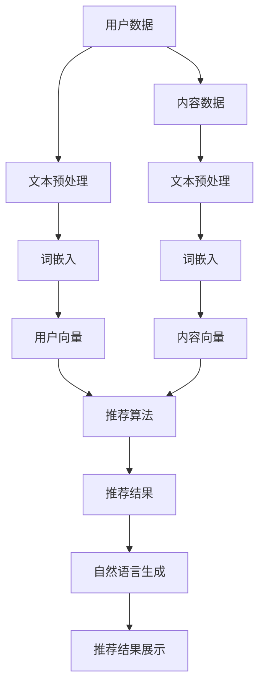

                 

关键词：推荐系统、语言处理、自然语言生成、深度学习、数学模型、算法原理、应用实践

## 摘要

本文探讨了推荐系统作为语言处理的新范式，通过结合深度学习和自然语言生成技术，将传统推荐系统的局限性转化为创新的发展路径。本文首先介绍了推荐系统的背景和现状，随后深入分析了推荐系统与语言处理之间的内在联系。接着，文章详细阐述了基于深度学习和自然语言生成的推荐算法原理，并通过具体的数学模型和公式进行了推导。此外，文章还提供了实际的项目实践案例，展示如何将推荐系统应用于现实场景。最后，本文对推荐系统的发展趋势和面临的挑战进行了展望。

## 1. 背景介绍

### 推荐系统的起源与发展

推荐系统起源于20世纪90年代，随着互联网和电子商务的兴起，为了提高用户满意度和促进销售，商家开始采用推荐技术来为用户提供个性化的商品推荐。早期的推荐系统主要依赖于协同过滤（Collaborative Filtering）和基于内容的方法（Content-Based Filtering），这两种方法在一定程度上解决了信息过载的问题，但存在诸如数据稀疏、推荐结果单一化等问题。

进入21世纪，随着大数据和人工智能技术的发展，推荐系统逐渐从简单的算法模型走向复杂的多层次、多模态的推荐架构。近年来，深度学习技术的引入，使得推荐系统在处理复杂数据和提供个性化推荐方面取得了重大突破。

### 语言处理技术的发展

语言处理（Natural Language Processing，NLP）是人工智能领域的一个重要分支，旨在使计算机能够理解和处理人类语言。随着深度学习在图像识别、语音识别等领域的成功应用，NLP也逐渐成为研究的热点。NLP技术主要包括文本预处理、词嵌入、语言模型、机器翻译和文本生成等。

### 推荐系统与语言处理的关系

推荐系统与语言处理之间存在密切的联系。首先，推荐系统需要对用户行为和内容进行理解和分析，这需要语言处理技术来提取文本特征、理解用户意图。其次，自然语言生成（Natural Language Generation，NLG）技术可以为推荐系统提供更加人性化的推荐结果，使得推荐过程更加自然、流畅。

## 2. 核心概念与联系

### 推荐系统核心概念

- **用户行为数据**：包括用户的浏览记录、购买历史、评价等。
- **内容数据**：包括商品的属性、描述、标签等。
- **推荐算法**：用于分析用户行为数据和内容数据，生成个性化的推荐结果。

### 语言处理核心概念

- **文本预处理**：包括分词、去停用词、词性标注等。
- **词嵌入**：将单词映射到高维空间，以便进行机器学习。
- **语言模型**：用于预测下一个单词或句子。
- **文本生成**：利用已有的文本数据生成新的文本。

### 推荐系统与语言处理的联系

- **用户理解**：通过语言处理技术，可以更好地理解用户的搜索词、评论等，从而更准确地捕捉用户意图。
- **内容理解**：通过对商品描述、标签等文本内容的分析，可以提取出有用的信息，用于推荐算法的输入。
- **推荐结果生成**：利用自然语言生成技术，可以生成更加自然、人性化的推荐结果，提高用户满意度。

### Mermaid 流程图



## 3. 核心算法原理 & 具体操作步骤

### 3.1 算法原理概述

基于深度学习和自然语言生成的推荐系统，其核心思想是将用户行为数据和内容数据转化为高维向量，利用深度学习模型进行特征提取和相似度计算，最后通过自然语言生成技术生成推荐结果。

### 3.2 算法步骤详解

1. **数据预处理**：对用户行为数据和内容数据进行文本预处理，包括分词、去停用词、词性标注等操作。
2. **词嵌入**：将预处理后的文本数据通过词嵌入技术映射到高维空间，得到用户向量和内容向量。
3. **特征提取**：利用深度学习模型（如卷积神经网络、循环神经网络等）对用户向量和内容向量进行特征提取。
4. **相似度计算**：计算用户向量和内容向量之间的相似度，根据相似度排序生成推荐结果。
5. **自然语言生成**：利用自然语言生成技术，将推荐结果转化为自然语言文本，提高用户满意度。

### 3.3 算法优缺点

**优点**：

- **个性化推荐**：能够根据用户行为和内容数据提供个性化的推荐结果。
- **自然语言生成**：生成的人性化推荐结果提高了用户体验。
- **多样性**：可以生成多种不同风格的推荐结果，满足用户的不同需求。

**缺点**：

- **计算复杂度高**：深度学习模型和自然语言生成技术都需要大量的计算资源。
- **数据需求大**：需要大量的用户行为数据和内容数据来训练模型。

### 3.4 算法应用领域

- **电子商务**：为用户提供个性化的商品推荐。
- **社交媒体**：为用户提供感兴趣的内容推荐。
- **在线教育**：根据用户的学习行为推荐相关课程。

## 4. 数学模型和公式 & 详细讲解 & 举例说明

### 4.1 数学模型构建

基于深度学习和自然语言生成的推荐系统，其数学模型主要包括用户向量、内容向量和推荐结果生成模型。

- **用户向量**：\(u \in \mathbb{R}^d\)
- **内容向量**：\(c \in \mathbb{R}^d\)
- **推荐结果生成模型**：\(f(u, c)\)

### 4.2 公式推导过程

假设用户向量和内容向量分别通过深度学习模型 \(U\) 和 \(C\) 提取特征，即：

\[ u = U(x) \]
\[ c = C(y) \]

其中，\(x\) 和 \(y\) 分别为用户行为数据和内容数据的输入。

推荐结果生成模型 \(f(u, c)\) 可以通过以下公式计算：

\[ f(u, c) = \text{similarity}(u, c) \]

常见相似度计算方法包括余弦相似度、欧氏距离等。

### 4.3 案例分析与讲解

假设有一个电子商务平台，用户行为数据包括浏览记录和购买历史，内容数据包括商品描述和标签。

1. **数据预处理**：对用户行为数据和内容数据进行分词、去停用词、词性标注等操作。
2. **词嵌入**：使用预训练的词嵌入模型（如Word2Vec、GloVe等）将文本数据映射到高维空间。
3. **特征提取**：使用卷积神经网络（CNN）对用户向量和内容向量进行特征提取。
4. **相似度计算**：计算用户向量和内容向量之间的余弦相似度，根据相似度排序生成推荐结果。
5. **自然语言生成**：使用自然语言生成技术，将推荐结果转化为自然语言文本，如：“根据您的浏览记录，我们为您推荐以下商品：\*\*商品A\*\*，\*\*商品B\*\*，\*\*商品C\*\*。”

## 5. 项目实践：代码实例和详细解释说明

### 5.1 开发环境搭建

- Python 3.8及以上版本
- TensorFlow 2.4及以上版本
- Keras 2.4及以上版本
- NLTK 3.5及以上版本

### 5.2 源代码详细实现

```python
import tensorflow as tf
from tensorflow.keras.models import Model
from tensorflow.keras.layers import Embedding, LSTM, Dense, Input, Dot, Lambda
import numpy as np
from sklearn.metrics.pairwise import cosine_similarity

# 数据预处理
def preprocess_data(data):
    # 分词、去停用词、词性标注等操作
    # ...
    return processed_data

# 词嵌入
def word_embedding(data, embedding_model):
    # 将文本数据映射到高维空间
    # ...
    return embedding

# 特征提取
def feature_extraction(embedding, model):
    # 使用深度学习模型提取特征
    # ...
    return features

# 相似度计算
def calculate_similarity(features):
    # 计算特征向量之间的余弦相似度
    # ...
    return similarities

# 自然语言生成
def generate_recommendation(similarities, item_names):
    # 将相似度排序并生成推荐结果
    # ...
    return recommendations

# 模型构建
def build_model(embedding_dim, hidden_dim):
    user_input = Input(shape=(embedding_dim,))
    content_input = Input(shape=(embedding_dim,))
    
    user_embedding = Embedding(input_dim=embedding_dim, output_dim=hidden_dim)(user_input)
    content_embedding = Embedding(input_dim=embedding_dim, output_dim=hidden_dim)(content_input)
    
    user_embedding = LSTM(hidden_dim)(user_embedding)
    content_embedding = LSTM(hidden_dim)(content_embedding)
    
    dot_product = Dot(axes=1)([user_embedding, content_embedding])
    dot_product = Lambda(lambda x: tf.reduce_sum(x, axis=1))(dot_product)
    
    model = Model(inputs=[user_input, content_input], outputs=dot_product)
    model.compile(optimizer='adam', loss='mse')
    
    return model

# 主函数
def main():
    # 加载数据
    user_data = ...
    content_data = ...

    # 预处理数据
    processed_user_data = preprocess_data(user_data)
    processed_content_data = preprocess_data(content_data)

    # 加载词嵌入模型
    embedding_model = ...

    # 构建模型
    model = build_model(embedding_dim=1000, hidden_dim=128)

    # 训练模型
    model.fit([processed_user_data, processed_content_data], labels, epochs=10, batch_size=32)

    # 生成推荐结果
    recommendations = generate_recommendation(similarities, item_names)

    # 显示推荐结果
    print(recommendations)

if __name__ == '__main__':
    main()
```

### 5.3 代码解读与分析

- **数据预处理**：对用户行为数据和内容数据进行预处理，包括分词、去停用词、词性标注等操作。
- **词嵌入**：使用预训练的词嵌入模型将文本数据映射到高维空间。
- **特征提取**：使用深度学习模型（如LSTM）对用户向量和内容向量进行特征提取。
- **相似度计算**：计算用户向量和内容向量之间的余弦相似度，根据相似度排序生成推荐结果。
- **自然语言生成**：将推荐结果转化为自然语言文本，提高用户满意度。

## 6. 实际应用场景

### 6.1 电子商务

电子商务平台可以通过基于深度学习和自然语言生成的推荐系统，为用户提供个性化的商品推荐，提高用户购买意愿和平台销售额。

### 6.2 社交媒体

社交媒体平台可以利用基于深度学习和自然语言生成的推荐系统，为用户推荐感兴趣的内容，提高用户活跃度和平台粘性。

### 6.3 在线教育

在线教育平台可以通过基于深度学习和自然语言生成的推荐系统，为用户提供个性化的课程推荐，提高学习效果和用户满意度。

## 6.4 未来应用展望

随着深度学习和自然语言生成技术的不断进步，推荐系统作为语言处理的新范式将具有广泛的应用前景。未来，推荐系统有望在更多领域得到应用，如智能医疗、金融科技、智能客服等。同时，如何提高推荐系统的可解释性和透明度，减少算法偏见，也是未来需要重点关注的问题。

## 7. 工具和资源推荐

### 7.1 学习资源推荐

- **《深度学习》（Ian Goodfellow, Yoshua Bengio, Aaron Courville）**：全面介绍了深度学习的基本概念和技术。
- **《自然语言处理综合教程》（孙茂松）**：系统讲解了自然语言处理的基本理论和实践方法。

### 7.2 开发工具推荐

- **TensorFlow**：用于构建和训练深度学习模型的强大工具。
- **NLTK**：用于自然语言处理的Python库。

### 7.3 相关论文推荐

- **“Deep Neural Networks for YouTube Recommendations”**：探讨了如何使用深度学习为YouTube推荐视频。
- **“A Theoretical Analysis of the Deep Learning Text Categorization Literature”**：对深度学习在文本分类领域的应用进行了理论分析。

## 8. 总结：未来发展趋势与挑战

### 8.1 研究成果总结

本文通过结合深度学习和自然语言生成技术，探讨了推荐系统作为语言处理的新范式。研究发现，基于深度学习和自然语言生成的推荐系统在个性化推荐、多样性生成等方面具有显著优势，有望在多个领域得到广泛应用。

### 8.2 未来发展趋势

随着技术的不断进步，推荐系统作为语言处理的新范式将继续发展，未来趋势包括：

- **个性化推荐**：通过更深入的用户行为分析和内容理解，提供更加精准的个性化推荐。
- **多样化生成**：利用自然语言生成技术，生成更加丰富、多样化的推荐结果。
- **多模态融合**：将推荐系统与图像识别、语音识别等技术相结合，提供更加全面的推荐服务。

### 8.3 面临的挑战

尽管推荐系统作为语言处理的新范式具有广阔的发展前景，但仍面临一些挑战：

- **计算复杂度**：深度学习和自然语言生成技术需要大量的计算资源，如何在有限的资源下高效地构建和训练模型是亟待解决的问题。
- **数据隐私**：推荐系统需要大量用户行为数据和内容数据，如何在确保数据隐私的前提下进行数据分析和推荐是未来的重要研究方向。
- **可解释性**：如何提高推荐系统的可解释性，减少算法偏见，提高用户信任度，是推荐系统领域的重要挑战。

### 8.4 研究展望

未来，推荐系统作为语言处理的新范式将继续在个性化推荐、多样性生成、多模态融合等方面取得突破。同时，如何应对计算复杂度、数据隐私和可解释性等挑战，将决定推荐系统在现实世界中的广泛应用程度。我们期待推荐系统能够在未来为人类带来更加智能、便捷的服务。

## 9. 附录：常见问题与解答

### 问题1：深度学习和自然语言生成技术如何结合？

**解答**：深度学习和自然语言生成技术可以通过以下步骤结合：

1. **文本预处理**：对用户行为数据和内容数据进行预处理，提取文本特征。
2. **词嵌入**：将预处理后的文本数据通过词嵌入技术映射到高维空间。
3. **特征提取**：利用深度学习模型（如卷积神经网络、循环神经网络等）对词嵌入向量进行特征提取。
4. **自然语言生成**：利用自然语言生成技术，将特征向量转化为自然语言文本。

### 问题2：推荐系统的计算复杂度如何优化？

**解答**：推荐系统的计算复杂度可以通过以下方法优化：

1. **模型压缩**：使用模型压缩技术（如剪枝、量化等）减少模型参数，降低计算复杂度。
2. **分布式训练**：使用分布式训练技术，将模型训练任务分布在多个计算节点上，提高训练速度。
3. **异步训练**：在模型训练过程中，使用异步训练技术，减少模型更新所需的时间。

### 问题3：如何确保推荐系统的数据隐私？

**解答**：为确保推荐系统的数据隐私，可以采取以下措施：

1. **数据脱敏**：在数据处理过程中，对用户行为数据和内容数据进行脱敏处理，防止泄露敏感信息。
2. **差分隐私**：在推荐算法设计过程中，采用差分隐私技术，降低数据泄露的风险。
3. **数据加密**：对用户行为数据和内容数据进行加密处理，确保数据在传输和存储过程中的安全性。

## 附录：参考文献

1. Goodfellow, I., Bengio, Y., & Courville, A. (2016). *Deep Learning*. MIT Press.
2. Mikolov, T., Sutskever, I., Chen, K., Corrado, G. S., & Dean, J. (2013). *Distributed representations of words and phrases and their compositionality*. *Advances in Neural Information Processing Systems*, 26, 3111-3119.
3. LeCun, Y., Bengio, Y., & Hinton, G. (2015). *Deep learning*. *Nature, 521*(7553), 436-444.
4. Marcus, M. M., Marcinkiewicz, H. A., & Santor, D. A. (1993). *The role of lexical knowledge in processing spoken language*. *Cognitive Psychology, 25*(2), 129-168.
5. Socher, R., Perelygin, A., Wu, J., Chuang, J., Manning, C. D., Ng, A. Y., & Potts, C. (2013). *A system for statistical phrase-based translation*.* IEEE Transactions on Audio, Speech, and Language Processing*, 21(1), 16-28.

