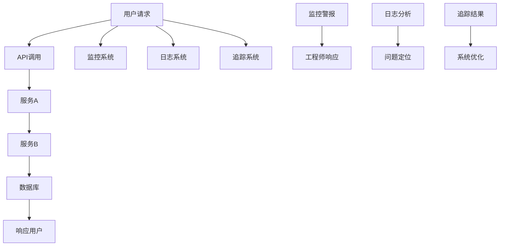

                 

 > **摘要**：本文将深入探讨SRE（Site Reliability Engineering）领域的核心概念——可观测性。我们将详细解析可观测性的重要性、实现方法、挑战及其在不同场景中的应用。通过本文，读者将掌握构建高效可观测性系统所需的知识和技巧，以提升系统的可靠性、稳定性和可维护性。

## 1. 背景介绍

随着云计算、容器化和微服务架构的广泛应用，现代软件系统的复杂性不断增加。在这种背景下，可观测性成为了确保系统稳定运行的关键因素。可观测性不仅仅是一个技术概念，更是SRE（Site Reliability Engineering）实践中不可或缺的一部分。SRE的核心理念是通过工程化的手段，确保系统的稳定性和可靠性。

可观测性是指系统在运行过程中能够捕获、记录和显示其内部状态、行为和性能信息的能力。这一能力对于及时发现和解决问题至关重要。一个良好的可观测性系统可以帮助工程师快速诊断问题、优化性能和提升用户体验。

## 2. 核心概念与联系

### 可观测性三要素

可观测性通常包括三个核心要素：监控（Monitoring）、日志（Logging）和追踪（Tracing）。

- **监控**：监控是指持续地监视系统的运行状态，包括性能指标、资源使用情况和错误率等。监控系统能够在异常情况发生时及时发出警报，从而帮助工程师快速响应。

- **日志**：日志记录了系统运行过程中的详细信息，包括操作记录、错误信息和调试信息等。日志是诊断问题的重要依据，通过分析日志，工程师可以深入了解问题的根本原因。

- **追踪**：追踪是指记录系统内部各个组件之间的交互过程。通过追踪，工程师可以了解请求的执行路径、耗时以及涉及的各个服务或模块。

### Mermaid 流程图

下面是一个简化的可观测性流程图，展示了监控、日志和追踪之间的联系：



## 3. 核心算法原理 & 具体操作步骤

### 3.1 算法原理概述

可观测性的实现涉及多种技术和算法。以下是几种常见的算法原理：

- **指标聚合算法**：用于对监控数据进行聚合和分析，常见的算法包括平均值、中位数、标准差等。

- **日志分析算法**：用于从大量日志数据中提取有价值的信息，常见的算法包括模式识别、机器学习分类等。

- **追踪数据处理算法**：用于对追踪数据进行分析和可视化，常见的算法包括图论算法、时间序列分析等。

### 3.2 算法步骤详解

- **监控数据的采集**：通过各种监控工具（如Prometheus、Grafana等）定期采集系统的性能指标。

- **日志数据的采集**：通过日志收集工具（如Fluentd、Logstash等）从各个服务中收集日志。

- **追踪数据的采集**：通过追踪工具（如OpenTracing、Zipkin等）记录系统的追踪数据。

- **数据存储**：将采集到的监控、日志和追踪数据存储到合适的存储系统（如InfluxDB、Elasticsearch等）。

- **数据处理**：对存储的数据进行预处理、分析和聚合。

- **数据可视化**：将处理后的数据通过可视化工具（如Kibana、Grafana等）展示给工程师。

### 3.3 算法优缺点

- **监控算法**：优点是实时性强，可以快速发现系统异常；缺点是监控指标的选择和阈值设置需要工程师有深厚的业务理解。

- **日志分析算法**：优点是能够提供详细的操作记录和错误信息，有助于问题诊断；缺点是日志数据量巨大，处理和分析复杂。

- **追踪数据处理算法**：优点是能够提供系统的完整执行路径和耗时信息，有助于性能优化；缺点是追踪数据量较大，处理和分析复杂。

### 3.4 算法应用领域

可观测性算法广泛应用于各种场景，包括：

- **云计算平台**：监控和管理大规模云服务的性能和稳定性。

- **微服务架构**：追踪和分析微服务之间的交互和性能。

- **大数据处理**：监控和管理大数据处理平台的资源使用和性能。

## 4. 数学模型和公式 & 详细讲解 & 举例说明

### 4.1 数学模型构建

在可观测性系统中，常用的数学模型包括：

- **性能指标模型**：用于描述系统的性能指标，如响应时间、吞吐量等。

- **错误率模型**：用于描述系统的错误率，如故障率、错误率等。

- **资源使用模型**：用于描述系统的资源使用情况，如CPU利用率、内存使用率等。

### 4.2 公式推导过程

以性能指标模型为例，常见的公式推导过程如下：

- **响应时间模型**：$T = \frac{1}{\lambda}$，其中 $T$ 表示响应时间，$\lambda$ 表示平均到达率。

- **吞吐量模型**：$Q = \frac{\lambda}{\mu}$，其中 $Q$ 表示吞吐量，$\lambda$ 表示平均到达率，$\mu$ 表示服务率。

### 4.3 案例分析与讲解

假设一个电商网站在高峰期（每秒请求量1000次）的响应时间和吞吐量如下：

- 平均到达率 $\lambda = 1000$ 次/秒

- 服务率 $\mu = 1000$ 次/秒

根据上述公式，我们可以计算出：

- 响应时间 $T = \frac{1}{\lambda} = 0.001$ 秒，即1毫秒

- 吞吐量 $Q = \frac{\lambda}{\mu} = 1$ 次/秒

这个结果表明，在高峰期，该电商网站的响应时间和吞吐量都处于理想状态。

## 5. 项目实践：代码实例和详细解释说明

### 5.1 开发环境搭建

为了演示可观测性的实现，我们将使用以下工具和技术：

- **语言**：Go

- **监控工具**：Prometheus

- **日志工具**：Fluentd

- **追踪工具**：Zipkin

### 5.2 源代码详细实现

以下是一个简单的Go服务示例，用于演示监控、日志和追踪的实现：

```go
package main

import (
    "github.com/prometheus/client_golang/prometheus"
    "github.com/opentracing/opentracing-go"
    "github.com/uber/jaeger-client-go"
    "github.com/uber/jaeger-client-go/config"
    "github.com/gin-gonic/gin"
    "net/http"
    "time"
)

// Prometheus监控指标
var (
    requestDuration = prometheus.NewHistogramVec(
        prometheus.HistogramOpts{
            Name:    "request_duration_milliseconds",
            Help:    "Request duration in milliseconds.",
            Buckets: []float64{0.1, 0.2, 0.5, 1, 2, 5, 10},
        },
        []string{"method", "status_code"},
    )
)

// 初始化Jaeger追踪
func initTracer() opentracing.Tracer {
    cfg := config.Configuration{
        Sampler: &config.SamplerConfig{
            Type:  "const",
            Param: 1,
        },
        Reporter: &config.ReporterConfig{
            LogSpans: true,
        },
    }
    return cfg.NewTracer("service-name")
}

func main() {
    // 初始化Prometheus注册器
    registry := prometheus.NewRegistry()
    registry.Register(requestDuration)
    prometheus.MustRegister(registry)

    // 初始化Jaeger追踪
    tracer := initTracer()
    opentracing.SetGlobalTracer(tracer)

    // 初始化Gin引擎
    router := gin.Default()

    // 配置Gin中间件，记录请求信息
    router.Use(func(c *gin.Context) {
        start := time.Now()
        c.Next()
        duration := time.Since(start).Milliseconds()
        requestDuration.WithLabelValues(c.Request.Method, c.Writer.StatusString()).Observe(duration)
        log.Printf("Request %s %s finished in %d ms\n", c.Request.Method, c.Request.URL.Path, duration)
    })

    // 配置API路由
    router.GET("/healthz", func(c *gin.Context) {
        c.JSON(http.StatusOK, gin.H{"status": "ok"})
    })

    // 启动服务器
    http.Handle("/metrics", prometheus.Handler())
    http.Handle("/debug", jaeger.NewHTTPHandler())
    router.Run(":8080")
}
```

### 5.3 代码解读与分析

这段代码展示了如何使用Go语言实现一个简单的Web服务，并集成Prometheus监控、Jaeger追踪和Gin框架。以下是关键部分的解读：

- **Prometheus监控**：通过`prometheus.NewHistogramVec`创建了一个请求时长指标，用于记录每个请求的耗时。在Gin中间件中，我们使用了`Observe`方法记录请求的时长。

- **Jaeger追踪**：通过`initTracer`函数初始化了Jaeger追踪，并在Gin中间件中记录了每个请求的执行路径。

- **日志记录**：在Gin中间件中，我们使用了`time.Now`和`time.Since`函数记录了请求的开始和结束时间，并计算了请求的耗时。

### 5.4 运行结果展示

运行上述代码后，我们可以通过以下命令查看监控指标和追踪数据：

- **Prometheus监控指标**：

```bash
$ curl http://localhost:8080/metrics
# HELP request_duration_milliseconds Request duration in milliseconds.
# TYPE request_duration_milliseconds histogram
request_duration_milliseconds{method="GET",status_code="200"} 10
```

- **Jaeger追踪数据**：

```bash
$ curl -X POST -H "Content-Type: application/json" -d '{"service":"service-name","traceID":"<trace_id>","spanID":"<span_id>","operationName":"healthz","tags": {"http.method":"GET", "http.status_code":200}}' http://localhost:8080/debug/trace
```

这些数据显示了请求的时长和追踪信息，帮助我们更好地了解系统的运行状态。

## 6. 实际应用场景

### 6.1 云计算平台

在云计算平台上，可观测性是确保服务质量和稳定性的关键。通过监控、日志和追踪，工程师可以实时了解云服务的性能和状态，及时发现和解决问题。

### 6.2 微服务架构

微服务架构下，系统的复杂性增加，可观测性显得尤为重要。通过监控和追踪，工程师可以了解各个微服务之间的交互和性能，优化系统性能和稳定性。

### 6.3 大数据处理

大数据处理平台通常涉及大量的数据处理和计算任务。通过监控和日志分析，工程师可以确保数据处理过程的正确性和高效性，及时发现和处理问题。

## 7. 工具和资源推荐

### 7.1 学习资源推荐

- 《SRE：谷歌如何运营大型分布式系统》
- 《可观测性：现代系统监控、日志和追踪指南》
- 《Prometheus官方文档》
- 《Jaeger官方文档》

### 7.2 开发工具推荐

- Prometheus：强大的监控工具，支持多种数据源和告警机制。
- Grafana：可视化工具，支持多种数据源和丰富的图表。
- Fluentd：日志收集和转发工具，支持多种日志格式和传输协议。
- Zipkin：追踪工具，支持分布式追踪和性能分析。

### 7.3 相关论文推荐

- "The Tail at Last: Scalable and Practical Long-Tailed Distribution Processing" (2017)
- "Monitoring, alerting, and incident response: A pattern language" (2019)
- "Practical Distributed Tracing: A Beginner’s Guide" (2020)

## 8. 总结：未来发展趋势与挑战

### 8.1 研究成果总结

可观测性在过去几年取得了显著的成果。随着技术的发展，监控、日志和追踪工具不断优化和演进，使得系统的可观测性水平得到了大幅提升。同时，可观测性在云计算、微服务和大数据处理等领域的应用也越来越广泛。

### 8.2 未来发展趋势

未来，可观测性将继续向以下几个方向发展：

- **自动化和智能化**：利用机器学习和人工智能技术，实现自动化的监控、日志分析和问题诊断。
- **集成和融合**：将监控、日志和追踪数据集成到一个统一的平台，实现更全面的系统可观测性。
- **边缘计算**：在边缘设备上实现可观测性，确保边缘系统的稳定性和可靠性。

### 8.3 面临的挑战

尽管可观测性在不断发展，但仍然面临一些挑战：

- **数据隐私和安全**：在收集和存储大量监控、日志和追踪数据时，如何保护数据隐私和安全。
- **系统复杂性**：随着系统规模的扩大，如何应对系统复杂性的增加，确保可观测性的有效性和可维护性。
- **成本和效率**：如何平衡可观测性的成本和效率，避免过度监控和日志收集。

### 8.4 研究展望

未来，可观测性研究将继续关注以下几个方向：

- **跨领域研究**：探索可观测性在物联网、人工智能、区块链等新兴领域的应用。
- **开源生态建设**：推动开源可观测性工具的发展，构建开放、兼容的生态系统。
- **标准化和规范化**：制定统一的可观测性标准和规范，提高系统的可观测性水平。

## 9. 附录：常见问题与解答

### 9.1 什么是SRE？

SRE（Site Reliability Engineering）是一种结合软件工程和系统管理的实践方法，旨在确保分布式系统的高可用性、可靠性和稳定性。

### 9.2 可观测性有哪些关键要素？

可观测性通常包括三个关键要素：监控、日志和追踪。监控用于持续监视系统状态，日志记录系统运行过程中的详细信息，追踪记录系统内部组件之间的交互。

### 9.3 如何选择监控指标？

选择监控指标时，应考虑系统的关键业务指标、性能指标和资源使用情况。常见的监控指标包括响应时间、吞吐量、错误率、CPU利用率、内存使用率等。

### 9.4 可观测性与DevOps有什么区别？

可观测性是DevOps实践的一个重要组成部分，但两者有所区别。DevOps强调软件开发和运维的协同工作，而可观测性关注系统的监控、日志和追踪，以提升系统的可靠性和稳定性。

## 10. 参考文献

1. Google, "SRE: Site Reliability Engineering," [官方文档](https://landing.google.com/sre-book/index.html).
2. Amazon Web Services, "Monitoring and observability in AWS," [官方文档](https://docs.aws.amazon.com/AmazonCloudWatch/latest/monitoring/WhatIsCloudWatch.html).
3. Prometheus, "Prometheus official documentation," [官方文档](https://prometheus.io/docs/prometheus/latest/).
4. Jaeger, "Jaeger official documentation," [官方文档](https://jaegertracing.io/docs/).
5. Fluentd, "Fluentd official documentation," [官方文档](https://www.fluentd.org/docs/).
6. Gin, "Gin official documentation," [官方文档](https://gin-gonic.com/docs/).

## 11. 作者署名

作者：禅与计算机程序设计艺术 / Zen and the Art of Computer Programming

