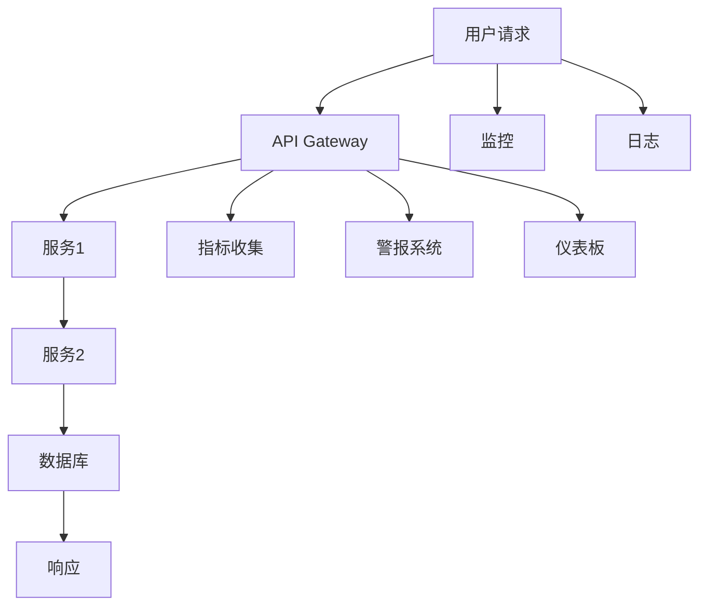

                 

关键词：SRE，可观测性，DevOps，监控，故障恢复，自动化

> 摘要：本文将探讨SRE（Site Reliability Engineering）中的可观测性最佳实践，分析其在现代软件工程中的重要性，并提供一套完整的实施指南，帮助开发团队构建健壮、可伸缩的系统。本文将涵盖核心概念、算法原理、数学模型、项目实践和未来展望，旨在为SRE从业者提供有价值的参考。

## 1. 背景介绍

### 1.1 SRE的概念

SRE（Site Reliability Engineering）是一种结合软件开发和系统管理的工程实践。其核心目的是确保系统的高可用性和稳定性，同时保持快速迭代的开发速度。SRE不同于传统的系统管理员，他们更加关注如何通过工程化的手段提高系统的可靠性，而不是仅仅进行故障修复。

### 1.2 可观测性的重要性

可观测性是SRE中的关键概念之一。它指的是系统在运行时能够提供足够的信息，使得团队能够快速识别、诊断和修复问题。高可观测性有助于减少系统故障对用户体验的影响，提高系统的可靠性和维护效率。

## 2. 核心概念与联系

### 2.1 监控与日志

监控和日志是可观测性的两个核心组成部分。监控是指定期检查系统的状态，以确定系统是否正常运行。日志记录了系统在运行期间的所有事件，包括正常操作和异常情况。

### 2.2 指标、警报和仪表板

指标是衡量系统性能的数值，如响应时间、吞吐量、错误率等。警报是基于指标的异常通知，当指标超出预期范围时，系统会自动发送警报。仪表板是一个可视化工具，用于展示系统的实时状态和历史数据。

### 2.3 Mermaid 流程图

以下是可观测性架构的 Mermaid 流程图：



## 3. 核心算法原理 & 具体操作步骤

### 3.1 算法原理概述

可观测性算法的核心在于如何有效地收集、存储、分析和展示系统数据。以下是一些常见的算法原理：

- 数据聚合：将来自多个来源的数据进行汇总，以便进行更高效的分析。
- 异常检测：使用统计方法或机器学习算法识别异常模式。
- 历史回溯：追踪历史数据，以便在问题发生时快速定位根源。

### 3.2 算法步骤详解

1. 数据收集：使用各种工具（如Prometheus、Grafana、ELK堆栈等）收集系统数据。
2. 数据存储：将数据存储在数据库或时间序列数据库中，以便长期存储和分析。
3. 数据分析：使用统计分析或机器学习算法对数据进行分析，以识别异常模式。
4. 警报和仪表板：根据分析结果设置警报和仪表板，以便团队快速响应。

### 3.3 算法优缺点

优点：

- 提高系统的可靠性和可维护性。
- 减少人为错误。
- 提高故障响应速度。

缺点：

- 需要大量的资源和人力投入。
- 需要专业的技能和知识。

### 3.4 算法应用领域

可观测性算法广泛应用于金融、电子商务、云计算等领域。这些领域对系统的稳定性和可靠性要求极高，因此可观测性成为了不可或缺的一部分。

## 4. 数学模型和公式 & 详细讲解 & 举例说明

### 4.1 数学模型构建

可观测性数学模型通常包括以下几个方面：

- 指标计算：如平均响应时间、错误率等。
- 异常检测：如标准差、箱线图等。
- 预测：如时间序列预测、回归分析等。

### 4.2 公式推导过程

以平均响应时间为例，其计算公式为：

$$
\text{平均响应时间} = \frac{\sum_{i=1}^{n} t_i}{n}
$$

其中，$t_i$ 是第 $i$ 次请求的响应时间，$n$ 是请求次数。

### 4.3 案例分析与讲解

假设一个电子商务系统在一段时间内接收了1000个请求，其响应时间分别为（秒）：[1, 2, 3, 4, 5]。那么，平均响应时间为：

$$
\text{平均响应时间} = \frac{1+2+3+4+5}{5} = 3
$$

如果设置一个阈值，当响应时间超过4秒时触发警报，那么在这1000个请求中，有2个请求会触发警报。

## 5. 项目实践：代码实例和详细解释说明

### 5.1 开发环境搭建

在本文中，我们将使用Grafana、Prometheus和ELK堆栈来搭建一个可观测性系统。以下是一个简化的步骤：

1. 安装Grafana。
2. 安装Prometheus。
3. 安装ELK堆栈（Elasticsearch、Logstash、Kibana）。

### 5.2 源代码详细实现

这里提供一个简单的Prometheus配置文件示例：

```yaml
global:
  scrape_interval: 15s
scrape_configs:
  - job_name: 'prometheus'
    static_configs:
      - targets: ['localhost:9090']
  - job_name: 'webserver'
    static_configs:
      - targets: ['webserver:80']
```

这个配置文件定义了两个数据源：Prometheus自身和Web服务器。Prometheus会每隔15秒从这些数据源收集数据。

### 5.3 代码解读与分析

这个配置文件的主要部分是 `scrape_configs`，它定义了Prometheus需要从哪些数据源收集数据。每个数据源都通过一个 `job_name` 标识，并在 `static_configs` 下定义。在这个例子中，我们定义了两个作业：

- `prometheus`：从本地的9090端口收集数据。
- `webserver`：从Web服务器的80端口收集数据。

### 5.4 运行结果展示

配置完成后，我们可以在Grafana中创建仪表板，并使用各种图表来展示系统的实时状态和历史数据。例如，我们可以创建一个图表，显示Web服务器的响应时间和错误率。

## 6. 实际应用场景

### 6.1 高可用性系统

在构建高可用性系统时，可观测性至关重要。通过监控和日志分析，团队能够快速识别潜在的问题，并在问题发生前进行预防。

### 6.2 容器化环境

在容器化环境中，如Kubernetes集群，可观测性能够帮助团队更有效地管理大规模的分布式系统。

### 6.3 云服务

在云服务中，如AWS、Azure和Google Cloud，可观测性是确保服务可靠性的关键。

## 7. 未来应用展望

随着云计算、容器化和微服务架构的普及，可观测性将在未来继续发挥重要作用。未来的发展趋势包括：

- 自动化：自动化工具将进一步提高可观测性的效率和准确性。
- 人工智能：利用人工智能技术进行智能分析和预测。
- 分布式系统：在分布式系统中，可观测性将变得更加复杂和重要。

## 8. 工具和资源推荐

### 7.1 学习资源推荐

- 《Site Reliability Engineering: How Google Runs Production Systems》
- 《Monitoring with Prometheus and Grafana》
- 《Building a Real-Time Analytics Stack with Kubernetes, Prometheus, and Grafana》

### 7.2 开发工具推荐

- Prometheus
- Grafana
- ELK堆栈（Elasticsearch、Logstash、Kibana）
- Datadog
- New Relic

### 7.3 相关论文推荐

- "Principles of Distributed Systems"
- "Recovering a Broken Cloud: Lessons Learned from an Amazon Elastic Compute Cloud (EC2) Failure"
- "Fault Injection in Large-Scale Distributed Systems"

## 9. 总结：未来发展趋势与挑战

### 9.1 研究成果总结

本文探讨了SRE可观测性的核心概念、算法原理、数学模型和实际应用场景，为SRE从业者提供了有价值的参考。

### 9.2 未来发展趋势

随着技术的不断进步，可观测性将在未来发挥更大的作用。自动化和人工智能技术的引入将进一步提高系统的可靠性和可维护性。

### 9.3 面临的挑战

未来，SRE团队将面临以下挑战：

- 分布式系统的复杂性。
- 数据安全性和隐私保护。
- 资源管理和成本控制。

### 9.4 研究展望

可观测性研究将继续深入分布式系统和人工智能领域，为构建更加可靠、高效和安全的软件系统提供支持。

## 10. 附录：常见问题与解答

### 10.1 可观测性与监控的区别是什么？

可观测性是一个更广泛的范畴，它包括监控、日志和追踪等。监控主要关注系统当前状态的健康程度，而可观测性则关注如何有效地收集、存储、分析和利用系统数据。

### 10.2 如何平衡监控的详细度和性能？

平衡监控的详细度和性能是一个挑战。通常，通过以下方法来实现平衡：

- 选择关键指标：只监控对业务有重要影响的指标。
- 数据采样：对日志和指标进行采样，以减少数据量。
- 使用高效存储和分析工具：选择能够高效处理大量数据的工具。

---

作者：禅与计算机程序设计艺术 / Zen and the Art of Computer Programming
----------------------------------------------------------------

