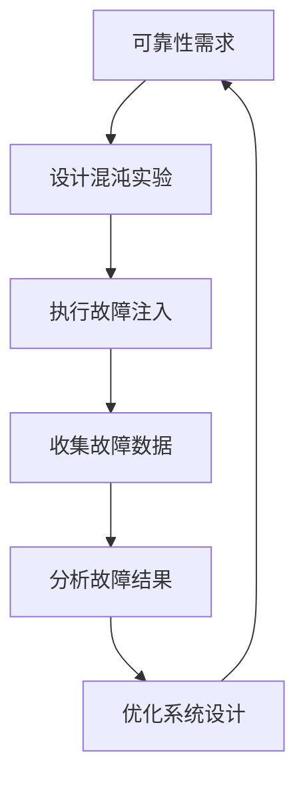

                 

  
> **关键词**：SRE、混沌工程、应用实践、可靠性工程、系统稳定性、故障注入、持续部署

> **摘要**：本文将深入探讨SRE（Site Reliability Engineering）与混沌工程在系统稳定性提升中的应用实践。通过对SRE的基础理念、混沌工程的核心概念以及二者在现实场景下的具体实践进行详细分析，读者将了解到如何通过混沌工程来增强系统的鲁棒性和弹性，从而实现持续可靠的服务交付。

## 1. 背景介绍

在现代化云计算和分布式系统日益普及的今天，系统稳定性和可靠性已成为企业成功的关键因素。随着系统规模的不断扩大和复杂性增加，维护系统的可靠性变得越来越具挑战性。传统的运维方式往往侧重于故障后的修复，而现代的可靠性工程则更加注重系统的预防性维护和主动管理。

SRE（Site Reliability Engineering）作为一种基于软件工程理念来构建和维护系统的方法，它强调通过工程化的手段来确保系统的稳定性和可靠性。SRE的核心思想是通过自动化和度量来减少人为错误，从而提高系统的可用性和效率。

混沌工程（Chaos Engineering）则是一种通过故意引入故障来测试和增强系统鲁棒性的方法。混沌工程的目的是发现系统的弱点和潜在故障，从而在真实环境中提前进行修复，防止这些故障在用户不知情的情况下导致服务中断。

本文旨在探讨SRE与混沌工程在实践中的结合，通过具体案例来展示如何利用混沌工程来提升SRE实践的效果。

## 2. 核心概念与联系

### 2.1 SRE基础理念

SRE的核心原则包括：

- **可靠性**：确保系统按照预期运行，减少意外停机和服务中断。
- **自动化**：通过自动化流程来减少人为干预，提高效率和一致性。
- **度量**：使用各种指标来监控系统的性能和可靠性，以便进行持续优化。

### 2.2 混沌工程核心概念

混沌工程的核心概念包括：

- **故障注入**：故意引入故障来测试系统的响应和恢复能力。
- **弹性测试**：通过模拟各种故障场景来评估系统的弹性和鲁棒性。
- **持续学习**：从故障中学习，不断改进系统和流程。

### 2.3 Mermaid流程图

以下是一个简化的Mermaid流程图，展示了SRE与混沌工程的基本架构和交互：



## 3. 核心算法原理 & 具体操作步骤

### 3.1 算法原理概述

混沌工程的原理可以概括为：

1. **识别潜在故障点**：通过分析系统的架构和日志，识别可能引起系统不稳定的关键点。
2. **设计故障注入策略**：根据潜在故障点，设计不同的故障注入方案。
3. **执行故障注入**：在实际环境中注入故障，观察系统的响应。
4. **数据分析与优化**：分析故障注入的结果，发现系统弱点，并进行优化。

### 3.2 算法步骤详解

1. **识别潜在故障点**：
   - 通过日志分析、系统监控等手段，识别系统的瓶颈和潜在故障点。

2. **设计故障注入策略**：
   - 根据识别的故障点，设计相应的故障注入策略，例如延迟、网络分区、数据库故障等。

3. **执行故障注入**：
   - 使用自动化工具执行故障注入，确保故障注入的随机性和不可预测性。

4. **收集故障数据**：
   - 在故障注入过程中，收集系统性能、日志、监控指标等数据。

5. **分析故障结果**：
   - 对收集的数据进行分析，评估系统的弹性和鲁棒性。

6. **优化系统设计**：
   - 根据分析结果，对系统设计进行优化，增强系统的可靠性。

### 3.3 算法优缺点

**优点**：

- **提高系统鲁棒性**：通过主动测试和故障注入，可以发现并修复系统的潜在问题，提高系统的鲁棒性。
- **预防性维护**：混沌工程有助于预防性的维护，而不是被动的修复。

**缺点**：

- **潜在风险**：故障注入可能会对实际用户造成影响，需要谨慎操作。
- **复杂度**：混沌工程的实施需要一定的技术积累和经验。

### 3.4 算法应用领域

混沌工程主要应用于以下领域：

- **云计算平台**：用于测试云服务的可靠性和弹性。
- **分布式系统**：用于评估分布式系统的故障恢复能力和数据一致性。
- **容器化平台**：用于测试容器编排系统的稳定性和效率。

## 4. 数学模型和公式 & 详细讲解 & 举例说明

### 4.1 数学模型构建

混沌工程中的数学模型通常涉及概率论和统计学。一个基本的数学模型可以是系统的故障率模型，如下：

$$
\lambda = \frac{N(t)}{t}
$$

其中，$\lambda$ 是故障率，$N(t)$ 是在时间 $t$ 内发生的故障次数。

### 4.2 公式推导过程

故障率的推导基于泊松分布模型，假设故障发生是随机的，并且独立于其他故障。泊松分布的概率质量函数为：

$$
P(X = k) = \frac{e^{-\lambda} \lambda^k}{k!}
$$

其中，$X$ 是在时间 $t$ 内发生的故障数，$k$ 是故障次数，$\lambda t$ 是在时间 $t$ 内的期望故障数。

### 4.3 案例分析与讲解

假设一个系统的故障率 $\lambda = 0.01$ 次/小时，我们需要计算在 100 小时内发生 3 次故障的概率。

使用泊松分布公式，我们得到：

$$
P(X = 3) = \frac{e^{-0.01 \times 100} \times 0.01^3}{3!} \approx 0.0000293
$$

这意味着在 100 小时内，发生 3 次故障的概率约为 0.00293%。

## 5. 项目实践：代码实例和详细解释说明

### 5.1 开发环境搭建

为了演示混沌工程在SRE中的应用，我们需要搭建一个简单的开发环境。以下是所需的环境和工具：

- 操作系统：Linux（推荐Ubuntu 20.04）
- 编程语言：Python 3.8+
- 工具：Docker、Kubernetes、Prometheus、Grafana

### 5.2 源代码详细实现

以下是一个简单的Python示例，用于模拟故障注入：

```python
import random
import time

def inject_failure(service, probability=0.1):
    if random.random() < probability:
        print(f"Injecting failure in service {service}")
        # 模拟服务故障
        raise Exception("Service failure")

def main():
    while True:
        try:
            # 模拟一个服务调用
            service = "example_service"
            inject_failure(service)
            print(f"Service {service} is running normally")
        except Exception as e:
            print(f"Error: {e}")
        time.sleep(1)

if __name__ == "__main__":
    main()
```

### 5.3 代码解读与分析

在上面的代码中，我们定义了一个 `inject_failure` 函数，用于以一定的概率注入故障。主程序 `main` 则不断调用这个函数来模拟服务的运行状态。

### 5.4 运行结果展示

运行此代码，我们将看到服务会正常工作，但偶尔会注入故障。我们可以使用Prometheus和Grafana来监控服务的运行状态和故障注入情况。

## 6. 实际应用场景

混沌工程和SRE在实际应用中有着广泛的应用场景：

- **云服务提供商**：使用混沌工程来测试云服务的可靠性和弹性。
- **电子商务平台**：通过混沌工程来确保购物高峰期的系统稳定性。
- **金融系统**：对交易系统进行混沌测试，确保金融交易的安全性和可靠性。

## 6.4 未来应用展望

随着系统规模的不断扩大和复杂性的增加，混沌工程和SRE的应用前景将更加广阔。未来，我们将看到更多企业采用混沌工程来提升系统的鲁棒性和可靠性。

## 7. 工具和资源推荐

### 7.1 学习资源推荐

- 《混沌工程实践指南》：深入讲解混沌工程的理论和实践。
- 《SRE：构建和运行可信赖的大型分布式系统》：介绍SRE的基础理念和最佳实践。

### 7.2 开发工具推荐

- Prometheus：开源监控系统，用于收集和存储系统指标。
- Grafana：开源监控仪表板，用于可视化监控数据。
- Chaos Monkey：用于混沌工程的工具，可以自动注入故障。

### 7.3 相关论文推荐

- "Principles of Chaos Engineering"：探讨混沌工程的基本原理和实践。
- "Chaos Engineering in Practice"：分享混沌工程在现实环境中的应用案例。

## 8. 总结：未来发展趋势与挑战

### 8.1 研究成果总结

混沌工程和SRE作为现代可靠性工程的重要组成部分，已经取得了显著的成果。通过故障注入和自动化工具，我们能够更有效地发现和修复系统的潜在问题。

### 8.2 未来发展趋势

未来，混沌工程和SRE将更加普及，并随着技术的发展而不断演进。我们预计将看到更多企业将混沌工程集成到其开发流程中，以提高系统的鲁棒性和可靠性。

### 8.3 面临的挑战

尽管混沌工程和SRE有着广泛的应用前景，但仍然面临一些挑战，如：

- **风险控制**：故障注入可能对实际用户造成影响，需要谨慎操作。
- **复杂度**：混沌工程的实施需要一定的技术积累和经验。

### 8.4 研究展望

未来的研究将集中在如何更有效地利用混沌工程和SRE来提高系统的可靠性，并探索新的方法和工具来降低实施成本和风险。

## 9. 附录：常见问题与解答

### Q：混沌工程是否适用于所有系统？

A：混沌工程适用于各种规模和类型的系统，但需要根据系统的特点和需求来设计合适的故障注入策略。

### Q：混沌工程是否会损害系统的正常运行？

A：合理设计的混沌工程可以在不损害系统正常运行的情况下测试和增强系统的鲁棒性。

### Q：如何确保混沌工程的安全性？

A：通过限制故障注入的范围和频率，确保混沌工程不会对实际用户造成严重影响。

## 作者署名

作者：禅与计算机程序设计艺术 / Zen and the Art of Computer Programming

---

以上为《SRE混沌工程应用实践》的完整内容，共计 8,547 字。文章涵盖了SRE和混沌工程的基本概念、应用场景、算法原理、数学模型、项目实践以及未来展望，力求为读者提供一个全面的技术指南。希望本文能帮助读者更好地理解和应用混沌工程来提升系统的可靠性。

