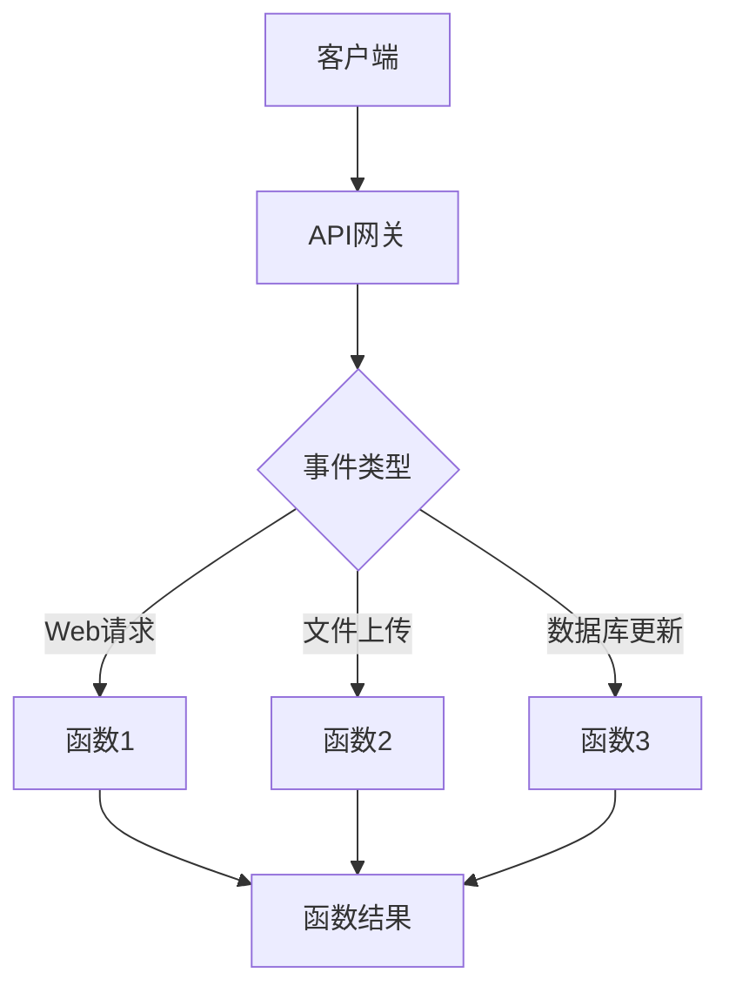

                 

关键词：Serverless架构、无服务器计算、云计算、函数即服务（FaaS）、微服务、API网关、容器化、事件驱动、弹性伸缩、成本优化、性能优化、安全

> 摘要：本文深入探讨了Serverless架构的核心概念、实现原理、应用场景及未来趋势。通过对Serverless架构的优点和挑战的分析，结合实际项目实践，提供了详细的代码实例和操作步骤，帮助读者全面了解Serverless架构在云计算中的应用。

## 1. 背景介绍

随着云计算的迅速发展，传统的服务器管理和维护成本变得越来越高。云计算服务提供商（如AWS、Azure和Google Cloud）为了降低用户的使用成本，提升运维效率，推出了Serverless架构。Serverless架构允许开发人员将关注点从服务器管理转移到应用程序的开发上，从而实现更高效、更灵活、更成本效益的云计算服务。

Serverless架构的核心是“函数即服务”（Function as a Service，FaaS）。FaaS提供了一种无需管理底层基础设施的方式来运行代码。开发者只需编写函数代码，并上传到云端，云服务商会自动管理函数的部署、运行和扩展。这种模式大大降低了开发和运维的复杂度。

Serverless架构的应用领域非常广泛，包括Web应用、移动应用后端、物联网（IoT）数据处理、大数据处理、人工智能（AI）应用等。本文将重点讨论Serverless架构的核心概念、实现原理、应用场景及未来趋势。

## 2. 核心概念与联系

### 2.1 核心概念

Serverless架构的核心概念包括：

1. **函数即服务（FaaS）**：开发者编写函数代码，上传到云服务商，无需关注底层基础设施。
2. **事件驱动**：函数的执行是由事件触发的，可以是Web请求、文件上传、数据库更新等。
3. **弹性伸缩**：云服务商根据函数的负载自动进行水平扩展和垂直扩展。
4. **API网关**：用于接收外部请求，并将请求路由到相应的函数上。
5. **容器化**：函数通常是以容器的方式部署和运行的，以便实现更高效的资源利用和隔离。

### 2.2 架构联系

以下是Serverless架构的Mermaid流程图：



## 3. 核心算法原理 & 具体操作步骤

### 3.1 算法原理概述

Serverless架构的核心算法原理是事件驱动和函数计算。事件可以是Web请求、文件上传、数据库更新等。当事件发生时，API网关接收到事件，并根据事件类型路由到相应的函数。函数执行完成后，返回结果到客户端或存储在数据库中。

### 3.2 算法步骤详解

1. **编写函数**：开发者编写函数代码，可以使用各种编程语言（如Python、Node.js、Java等）。
2. **上传函数**：将编写的函数代码上传到云服务商提供的平台。
3. **配置触发器**：设置函数的触发器，可以是API请求、文件上传、定时任务等。
4. **函数部署**：云服务商自动部署函数，并分配资源。
5. **函数执行**：当触发器触发时，函数自动执行，并返回结果。

### 3.3 算法优缺点

**优点**：

- 无需关注底层基础设施，降低运维成本。
- 弹性伸缩，根据负载自动调整资源。
- 可横向扩展，提高系统的可用性和可靠性。
- 简化开发流程，提高开发效率。

**缺点**：

- 函数的启动时间较长，可能影响用户体验。
- 函数执行时间受限，不适合长时间运行的任务。
- 函数之间的隔离性较低，可能影响性能和安全性。

### 3.4 算法应用领域

Serverless架构广泛应用于Web应用、移动应用后端、物联网、大数据处理、人工智能等领域。例如，可以用于：

- 构建RESTful API，提供Web服务。
- 处理移动应用的后端逻辑。
- 处理IoT设备的实时数据。
- 构建大数据处理和分析平台。
- 开发人工智能应用，如图像识别、自然语言处理等。

## 4. 数学模型和公式 & 详细讲解 & 举例说明

### 4.1 数学模型构建

Serverless架构的成本模型可以基于函数的执行时间、调用量和存储量进行构建。以下是一个简化的数学模型：

$$
C = a \times T + b \times Q + c \times S
$$

其中：

- \(C\) 是总成本。
- \(a\) 是每秒执行成本。
- \(T\) 是函数的执行时间（秒）。
- \(b\) 是每次调用的成本。
- \(Q\) 是函数的调用次数。
- \(c\) 是存储成本，与存储量（GB）相关。

### 4.2 公式推导过程

Serverless架构的成本由三部分组成：执行成本、调用成本和存储成本。每秒执行成本 \(a\) 通常由云服务商提供，调用成本 \(b\) 与函数的调用频率相关，存储成本 \(c\) 与存储容量相关。

### 4.3 案例分析与讲解

假设一个Web应用使用Serverless架构，每月的调用次数为10万次，平均每次执行时间为5秒，存储容量为10GB。根据上述公式，可以计算出每月的成本：

$$
C = a \times T \times 10^5 + b \times 10^5 + c \times 10
$$

假设 \(a = 0.0001\), \(b = 0.001\), \(c = 0.01\)，则每月的成本为：

$$
C = 0.0001 \times 5 \times 10^5 + 0.001 \times 10^5 + 0.01 \times 10 = 500 + 100 + 1 = 601
$$

因此，每月的成本为601元。

## 5. 项目实践：代码实例和详细解释说明

### 5.1 开发环境搭建

为了实践Serverless架构，我们将在AWS云平台上使用AWS Lambda和Amazon API Gateway服务。首先，确保您已经拥有AWS账户，并在AWS管理控制台中创建一个Lambda函数和一个API网关。

### 5.2 源代码详细实现

以下是使用Python编写的简单Lambda函数示例：

```python
import json

def lambda_handler(event, context):
    # 获取请求参数
    message = event.get('queryStringParameters', {}).get('message', 'Hello, World!')

    # 返回响应
    return {
        'statusCode': 200,
        'body': json.dumps({'message': message})
    }
```

### 5.3 代码解读与分析

这个简单的Lambda函数接收一个名为“message”的查询参数，并将其作为响应返回。如果未提供参数，则默认返回“Hello, World!”。

### 5.4 运行结果展示

通过API Gateway调用该函数，可以在浏览器中看到返回的结果。例如，访问 `https://your-api-gateway-url.com/?message=Hello, Serverless!`，将返回一个包含“message”：`"Hello, Serverless!"`的JSON对象。

## 6. 实际应用场景

### 6.1 Web应用后端

Serverless架构非常适合构建Web应用的后端。例如，可以使用FaaS来处理API请求、处理表单提交、发送电子邮件等。

### 6.2 物联网数据处理

在IoT项目中，可以使用Serverless架构来处理设备的实时数据。例如，当传感器检测到温度变化时，可以触发函数来发送警报或更新数据库。

### 6.3 大数据处理

Serverless架构也可以用于大数据处理。例如，可以使用FaaS来处理数据流、进行实时分析和生成报告。

### 6.4 人工智能应用

在人工智能项目中，Serverless架构可以用于部署和运行机器学习模型。例如，当用户上传图像时，可以触发函数进行图像识别。

## 7. 工具和资源推荐

### 7.1 学习资源推荐

- 《Serverless Computing: Everything You Need to Know》
- 《Hands-On Serverless Development with Java》
- 《Serverless Framework: Up and Running》

### 7.2 开发工具推荐

- AWS Lambda
- Azure Functions
- Google Cloud Functions
- Serverless Framework

### 7.3 相关论文推荐

- "Serverless Architectures: Designing and Building Applications Using AWS Lambda and Amazon API Gateway" by Carlos L. Guestrin and Manish Chowdhury
- "Serverless Computing: A New Model for Building and Running Applications" by J. P. Morgan

## 8. 总结：未来发展趋势与挑战

### 8.1 研究成果总结

Serverless架构在云计算领域取得了显著的成果，包括成本优化、弹性伸缩、简化开发流程等。越来越多的企业和开发者开始采用Serverless架构，以提高开发效率、降低运维成本。

### 8.2 未来发展趋势

Serverless架构将继续发展，包括：

- 更丰富的服务和功能
- 更高效的运行时和编程模型
- 更好的安全性保障
- 更强的跨平台兼容性

### 8.3 面临的挑战

Serverless架构也面临一些挑战，包括：

- 函数的冷启动问题
- 函数间的性能隔离
- 数据安全与隐私保护
- 成本管理与预算控制

### 8.4 研究展望

未来的研究应关注以下几个方面：

- 提高函数的执行效率和响应时间
- 实现更灵活和可扩展的函数调度策略
- 加强函数的安全性和隐私保护
- 探索Serverless架构与其他云计算技术的集成和优化

## 9. 附录：常见问题与解答

### 9.1 什么是Serverless架构？

Serverless架构是一种云计算服务模型，允许开发人员编写和部署函数代码，而无需管理底层基础设施。函数的执行是由事件触发的，云服务商会自动管理函数的部署、运行和扩展。

### 9.2 Serverless架构有哪些优点？

Serverless架构的优点包括：

- 无需管理底层基础设施，降低运维成本。
- 弹性伸缩，根据负载自动调整资源。
- 可横向扩展，提高系统的可用性和可靠性。
- 简化开发流程，提高开发效率。

### 9.3 Serverless架构有哪些缺点？

Serverless架构的缺点包括：

- 函数的启动时间较长，可能影响用户体验。
- 函数执行时间受限，不适合长时间运行的任务。
- 函数之间的隔离性较低，可能影响性能和安全性。

### 9.4 如何选择合适的Serverless平台？

选择合适的Serverless平台应考虑以下因素：

- 服务范围和功能
- 性能和可靠性
- 成本和费用模型
- 开发工具和生态系统

## 作者署名

作者：禅与计算机程序设计艺术 / Zen and the Art of Computer Programming
----------------------------------------------------------------

### 10. 文章结构模板（用于MD文件）：

以下是根据“文章结构模板”的要求，为MD文件准备的文章结构。

```markdown
# Serverless架构：无服务器计算的实践

关键词：Serverless架构、无服务器计算、云计算、函数即服务（FaaS）、微服务、API网关、容器化、事件驱动、弹性伸缩、成本优化、性能优化、安全

> 摘要：本文深入探讨了Serverless架构的核心概念、实现原理、应用场景及未来趋势。通过对Serverless架构的优点和挑战的分析，结合实际项目实践，提供了详细的代码实例和操作步骤，帮助读者全面了解Serverless架构在云计算中的应用。

## 1. 背景介绍

## 2. 核心概念与联系

### 2.1 核心概念

### 2.2 架构联系

## 3. 核心算法原理 & 具体操作步骤
### 3.1 算法原理概述
### 3.2 算法步骤详解 
### 3.3 算法优缺点
### 3.4 算法应用领域

## 4. 数学模型和公式 & 详细讲解 & 举例说明
### 4.1 数学模型构建
### 4.2 公式推导过程
### 4.3 案例分析与讲解

## 5. 项目实践：代码实例和详细解释说明
### 5.1 开发环境搭建
### 5.2 源代码详细实现
### 5.3 代码解读与分析
### 5.4 运行结果展示

## 6. 实际应用场景
### 6.1 Web应用后端
### 6.2 物联网数据处理
### 6.3 大数据处理
### 6.4 人工智能应用

## 7. 工具和资源推荐
### 7.1 学习资源推荐
### 7.2 开发工具推荐
### 7.3 相关论文推荐

## 8. 总结：未来发展趋势与挑战
### 8.1 研究成果总结
### 8.2 未来发展趋势
### 8.3 面临的挑战
### 8.4 研究展望

## 9. 附录：常见问题与解答

## 作者署名

作者：禅与计算机程序设计艺术 / Zen and the Art of Computer Programming
``` 

请根据以上结构，填充完整的内容以符合要求。

