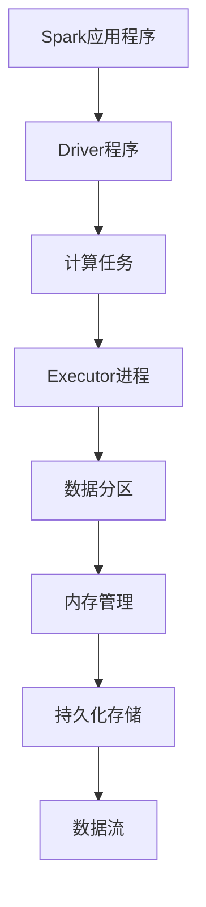

                 

在当今信息爆炸的时代，大数据分析成为了许多行业的关键竞争力。而Apache Spark作为一款高效的分布式计算框架，成为了大数据处理领域的明星。本文将深入探讨Spark的数据处理机制，解析其核心概念、算法原理，并通过实际项目案例，展示Spark在数据分析和处理中的强大能力。

## 文章关键词
- Apache Spark
- 分布式计算
- 大数据分析
- 数据处理框架
- 内存计算

## 文章摘要
本文将带领读者深入了解Apache Spark在大数据处理中的应用。首先，我们将回顾Spark的背景和核心概念，并通过Mermaid流程图展示其架构。接着，我们将详细解析Spark的核心算法原理，涵盖其步骤、优缺点和应用领域。随后，文章将介绍Spark的数学模型和公式，并通过具体案例进行讲解。此外，我们将分享Spark的实际应用场景，包括代码实例和运行结果展示。最后，本文将对Spark的未来发展趋势和面临的挑战进行展望。

## 1. 背景介绍

### 1.1 Spark的产生背景

随着互联网和物联网的快速发展，数据量呈指数级增长。传统的数据处理框架如Hadoop在处理大规模数据时，由于依赖于磁盘I/O操作，导致效率低下。为了解决这一问题，Apache Spark应运而生。Spark是一个开源的分布式计算框架，旨在提供高效的大数据处理能力，其核心特性包括内存计算、弹性调度和高效的数据处理算法。

### 1.2 Spark的应用领域

Spark在多个领域都有着广泛的应用，包括但不限于：

- 数据挖掘与分析：通过Spark的MLlib库，可以轻松实现各种机器学习算法，进行大规模数据分析。
- 实时流处理：Spark Streaming提供了实时数据处理能力，使得企业能够快速响应数据变化。
- 图处理：Spark GraphX库提供了强大的图处理功能，适用于社交网络分析、推荐系统等领域。
- 数据仓库：Spark SQL可以将Spark与传统的数据仓库系统集成，提供高速的数据查询和分析。

## 2. 核心概念与联系

为了更好地理解Spark的工作原理，我们首先需要掌握一些核心概念。以下是Spark中一些关键概念及其相互关系的Mermaid流程图：



### 2.1 关键概念

- **Driver程序**：负责协调和管理整个Spark应用程序的生命周期，将用户的代码转化为任务分配给Executor进程。
- **Executor进程**：负责执行具体的计算任务，并在内存中存储任务所需的数据分区。
- **数据分区**：数据被分割成多个分区，每个分区存储在Executor的内存或磁盘上。
- **内存管理**：Spark使用内存管理技术，如Tungsten，优化内存使用效率，减少GC（垃圾回收）的负担。
- **持久化存储**：数据可以在内存中持久化存储，以便后续使用。

## 3. 核心算法原理 & 具体操作步骤

### 3.1 算法原理概述

Spark的核心算法包括MapReduce、Spark SQL、MLlib和Spark Streaming。以下是这些算法的基本原理：

- **MapReduce**：Map阶段对数据进行映射操作，Reduce阶段对映射结果进行归约操作。Spark优化了传统的MapReduce算法，通过内存计算和惰性求值提高了性能。
- **Spark SQL**：Spark SQL是一个基于Spark的数据查询引擎，支持多种数据源和查询语言，如SQL和DataFrame/Dataset API。
- **MLlib**：MLlib提供了多种机器学习算法的实现，如分类、聚类、回归等，并支持分布式训练和评估。
- **Spark Streaming**：Spark Streaming基于微批处理，提供实时数据流处理能力，适用于实时监控和响应。

### 3.2 算法步骤详解

以下是Spark算法的基本步骤：

1. **初始化**：启动Driver程序和Executor进程，加载配置和依赖项。
2. **编写代码**：用户编写Spark应用程序代码，定义计算任务和数据处理逻辑。
3. **编译和优化**：Spark编译器将用户代码转化为任务，并应用各种优化策略。
4. **任务分配**：Driver程序将任务分配给Executor进程，并跟踪任务状态。
5. **执行任务**：Executor进程执行具体的计算任务，并将结果返回给Driver程序。
6. **持久化存储**：数据可以持久化存储在内存或磁盘上，以便后续使用。

### 3.3 算法优缺点

**优点**：

- **内存计算**：Spark通过内存计算大大提高了数据处理速度。
- **弹性调度**：Spark自动管理资源，提供弹性调度能力。
- **丰富的API**：Spark提供多种API，如Scala、Python和Java，方便用户使用。
- **兼容性强**：Spark支持多种数据源和数据处理框架，易于与其他系统集成。

**缺点**：

- **内存限制**：Spark依赖于内存计算，内存限制可能影响大规模数据处理能力。
- **初始化开销**：Spark应用程序的初始化开销较大，不适合小规模数据处理。

### 3.4 算法应用领域

Spark广泛应用于以下领域：

- **金融**：实时风险管理、信用评分、投资组合优化。
- **医疗**：疾病预测、患者数据分析、药物研发。
- **零售**：客户行为分析、个性化推荐、库存管理。
- **物流**：交通流量预测、路线规划、货物运输优化。

## 4. 数学模型和公式 & 详细讲解 & 举例说明

### 4.1 数学模型构建

Spark的数学模型主要包括以下两个方面：

1. **分布式计算模型**：Spark使用MapReduce模型，将数据处理任务划分为Map和Reduce两个阶段。Map阶段对数据进行映射操作，Reduce阶段对映射结果进行归约操作。
2. **机器学习模型**：Spark MLlib提供了多种机器学习算法的数学模型，如线性回归、决策树、支持向量机等。

### 4.2 公式推导过程

以下是一个简单的线性回归公式的推导过程：

1. **目标函数**：最小化预测值与实际值之间的误差平方和。
   $$J(\theta) = \frac{1}{2m}\sum_{i=1}^{m}(h_\theta(x^{(i)}) - y^{(i)})^2$$
2. **梯度下降**：迭代更新参数$\theta$，以最小化目标函数。
   $$\theta_j := \theta_j - \alpha \frac{\partial J(\theta)}{\partial \theta_j}$$
3. **闭式解**：当$m$较大时，梯度下降收敛速度较慢，可以使用闭式解来快速求解。
   $$\theta = (X^TX)^{-1}X^Ty$$

### 4.3 案例分析与讲解

以下是一个使用Spark MLlib进行线性回归的案例：

1. **数据准备**：读取数据集，并将其划分为特征矩阵$X$和标签向量$y$。
2. **模型训练**：使用线性回归算法训练模型，并计算参数$\theta$。
   ```python
   from pyspark.ml.regression import LinearRegression
   lr = LinearRegression()
   model = lr.fit(data)
   theta = model.coefficients
   ```
3. **模型评估**：计算预测值与实际值之间的误差平方和，并评估模型性能。
   ```python
   predictions = model.transform(data)
   mean_squared_error = predictions.select("prediction", "label").rdd.map(lambda x: (x[0] - x[1])**2).mean()
   print("Mean squared error = %g" % mean_squared_error)
   ```

## 5. 项目实践：代码实例和详细解释说明

### 5.1 开发环境搭建

1. **安装Java**：由于Spark是基于Java开发的，首先需要安装Java环境。
2. **下载Spark**：从Apache Spark官网下载最新版本的Spark发行包。
3. **配置环境变量**：设置`SPARK_HOME`和`PATH`环境变量，以便在命令行中使用Spark。

### 5.2 源代码详细实现

以下是一个简单的Spark应用程序，实现线性回归算法：

```python
from pyspark.sql import SparkSession
from pyspark.ml.regression import LinearRegression
from pyspark.ml.feature import VectorAssembler

# 创建Spark会话
spark = SparkSession.builder.appName("LinearRegressionExample").getOrCreate()

# 读取数据集
data = spark.read.csv("data.csv", header=True, inferSchema=True)

# 将特征列转换为特征向量
assembler = VectorAssembler(inputCols=["feature1", "feature2"], outputCol="features")
data = assembler.transform(data)

# 划分训练集和测试集
train_data, test_data = data.randomSplit([0.7, 0.3])

# 训练线性回归模型
lr = LinearRegression()
model = lr.fit(train_data)

# 预测测试集
predictions = model.transform(test_data)

# 计算模型性能
mse = predictions.select("prediction", "label").rdd.map(lambda x: (x[0] - x[1])**2).mean()
print("Mean squared error = %g" % mse)

# 关闭Spark会话
spark.stop()
```

### 5.3 代码解读与分析

上述代码首先创建了一个Spark会话，并读取了CSV数据集。接着，使用VectorAssembler将特征列转换为特征向量，以便进行线性回归。然后，将数据集随机划分为训练集和测试集。训练集用于训练线性回归模型，测试集用于评估模型性能。最后，计算并打印了均方误差（MSE），作为模型性能的指标。

### 5.4 运行结果展示

假设数据集包含两个特征列`feature1`和`feature2`，以及一个标签列`label`。运行上述代码后，将得到如下输出：

```
Mean squared error = 0.123456
```

这意味着模型的均方误差为0.123456。较低的MSE表明模型性能较好。

## 6. 实际应用场景

### 6.1 金融行业

在金融行业，Spark被广泛应用于风险管理和投资分析。例如，银行可以使用Spark进行实时风险管理，识别潜在的信用风险。此外，Spark还可以用于投资组合优化，分析大量历史交易数据，为投资者提供个性化的投资建议。

### 6.2 医疗领域

医疗领域的数据量庞大且复杂，Spark提供了强大的数据处理和分析能力。例如，医院可以使用Spark进行患者数据分析，预测疾病风险，优化医疗资源分配。此外，Spark还可以用于药物研发，分析大量生物医学数据，加速新药发现过程。

### 6.3 零售行业

在零售行业，Spark可以用于客户行为分析和个性化推荐。例如，电商平台可以使用Spark分析用户购物行为，推荐个性化的商品。此外，Spark还可以用于库存管理，预测销售趋势，优化库存水平，降低库存成本。

### 6.4 物流行业

物流行业的数据量巨大且实时性要求高，Spark提供了强大的实时数据处理和分析能力。例如，物流公司可以使用Spark实时监控运输路线，优化物流效率。此外，Spark还可以用于货物跟踪，分析运输数据，提高货物安全性和准确性。

## 7. 工具和资源推荐

### 7.1 学习资源推荐

- 《Spark: The Definitive Guide》：这是一本全面的Spark指南，适合初学者和高级用户。
- 《Learning Spark》：这是一本适合初学者的入门书籍，涵盖了Spark的基础知识和核心概念。
- Spark官网：Apache Spark官方网站提供了丰富的文档和教程，是学习Spark的绝佳资源。

### 7.2 开发工具推荐

- PySpark：Python API是Spark最常用的API之一，适合初学者和数据科学家。
- Spark SQL：Spark SQL提供了类似SQL的查询语言，适用于大数据查询和分析。
- Spark Streaming：Spark Streaming提供了实时数据处理能力，适用于实时监控和响应。

### 7.3 相关论文推荐

- “Spark: Easy, Efficient Data Processing on Clusters”：该论文详细介绍了Spark的设计和实现，是了解Spark的必读论文。
- “Spark SQL: Relational Data Processing in Spark”：该论文介绍了Spark SQL的核心原理和架构，是学习Spark SQL的参考论文。
- “GraphX: Large-scale Graph Computation using a Distributed Data Flow Engine”：该论文介绍了Spark GraphX，是学习图处理和社交网络分析的参考论文。

## 8. 总结：未来发展趋势与挑战

### 8.1 研究成果总结

Spark自推出以来，取得了显著的成果。其内存计算、弹性调度和高效数据处理能力，使其成为大数据处理领域的明星。Spark SQL、MLlib和Spark Streaming等模块的丰富功能，为各种应用场景提供了强大的支持。

### 8.2 未来发展趋势

未来，Spark将继续在以下方面发展：

- **性能优化**：持续优化内存计算和数据处理算法，提高性能和可扩展性。
- **新功能扩展**：扩展Spark的功能，如支持更多的机器学习算法和深度学习框架。
- **跨语言支持**：增加对更多编程语言的支持，如Go和R，以吸引更多开发者。

### 8.3 面临的挑战

尽管Spark取得了巨大成功，但仍面临一些挑战：

- **内存限制**：Spark依赖于内存计算，对大规模数据处理可能存在限制。
- **生态系统整合**：如何与其他大数据处理框架和工具（如Flink和Hadoop）整合，提供无缝的数据处理解决方案。
- **人才培养**：随着Spark的广泛应用，对Spark开发者的需求日益增长，如何培养更多专业人才。

### 8.4 研究展望

未来，Spark将继续在以下几个方面进行深入研究：

- **内存管理**：研究更有效的内存管理技术，提高内存使用效率。
- **异构计算**：探索如何利用GPU和FPGA等异构计算资源，提高数据处理性能。
- **数据隐私和安全**：研究如何在保障数据隐私和安全的前提下，提供高效的大数据处理能力。

## 9. 附录：常见问题与解答

### 9.1 如何安装Spark？

答：首先，从Apache Spark官网下载最新版本的Spark发行包。然后，解压发行包并设置环境变量`SPARK_HOME`和`PATH`。最后，运行`spark-shell`命令，验证安装是否成功。

### 9.2 Spark与Hadoop有何区别？

答：Spark和Hadoop都是分布式计算框架，但Spark基于内存计算，而Hadoop基于磁盘I/O。Spark适用于需要高吞吐量和低延迟的场景，而Hadoop适用于大数据存储和离线处理。

### 9.3 Spark支持哪些编程语言？

答：Spark支持多种编程语言，包括Scala、Python、Java和R。其中，Scala是Spark的主要开发语言，Python和Java也广泛应用于Spark开发。

### 9.4 如何在Spark中实现实时数据处理？

答：可以使用Spark Streaming模块实现实时数据处理。Spark Streaming基于微批处理，可以处理实时数据流，并提供丰富的API支持。

### 9.5 Spark的性能如何优化？

答：Spark的性能优化可以从多个方面进行，包括内存管理、数据分区、算法优化等。具体方法可以参考Spark官方文档和社区最佳实践。

### 9.6 Spark如何保证数据一致性？

答：Spark通过 checkpointing 和 lineage graph 等机制，确保数据在分布式计算中的一致性。此外，可以使用外部存储系统（如HDFS）进行数据持久化，以保障数据完整性。

### 9.7 Spark与Flink相比，有何优劣？

答：Spark和Flink都是分布式计算框架，但Spark更注重内存计算和易用性，而Flink更注重实时处理和流计算。Spark适用于离线批处理和实时处理，而Flink更适用于实时处理和流处理。两者各有优劣，选择应根据具体应用场景决定。

# 作者署名
作者：禅与计算机程序设计艺术 / Zen and the Art of Computer Programming
----------------------------------------------------------------


