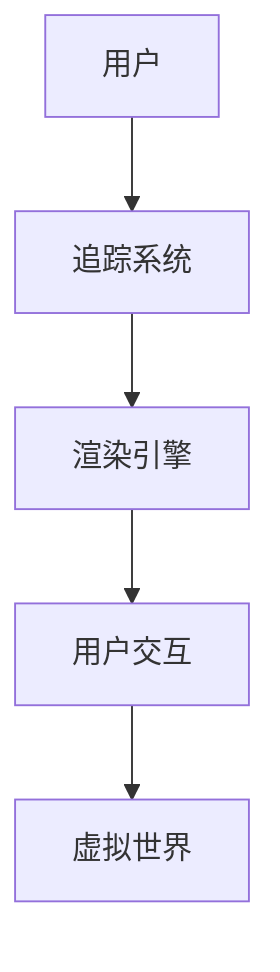

                 

关键词：SteamVR，虚拟现实，Valve，VR平台，用户体验

> 摘要：本文旨在介绍Valve的SteamVR虚拟现实平台，分析其核心概念、架构，以及其在VR领域的应用。通过深入探讨SteamVR的算法原理、数学模型、实践应用等，我们将全面了解这个平台的优势和挑战，并展望其未来发展趋势。

## 1. 背景介绍

虚拟现实（VR）技术近年来取得了飞速发展，它不仅仅是一个游戏领域的创新，更是各行各业潜在的应用场景，如教育、医疗、设计、军事等。而SteamVR，作为Valve推出的虚拟现实平台，无疑是VR领域的重要推动者。

Valve是一家以游戏开发著称的公司，其推出的《半条命》、《反恐精英》等游戏开创了新的游戏体验标准。而Steam，作为Valve的数字发行平台，拥有庞大的用户群体和游戏库。SteamVR则是在这个基础上，进一步扩展了虚拟现实体验。

SteamVR的目标是为用户提供高质量的虚拟现实体验，包括游戏、应用、工具等。它不仅支持Valve自己的VR游戏，还兼容其他厂商的VR内容，实现了VR生态系统的大融合。

## 2. 核心概念与联系

### 2.1 核心概念

SteamVR的核心概念包括：

- **追踪系统**：SteamVR利用多个追踪摄像头和传感器来追踪用户的头部、手部等动作，实现沉浸式体验。
- **渲染引擎**：通过高度优化的渲染引擎，SteamVR能够以流畅的速度渲染高质量的VR内容。
- **用户交互**：SteamVR提供了多种交互方式，如手柄、触觉反馈手套等，使用户能够自然地与虚拟世界互动。

### 2.2 架构联系

下面是一个简化的Mermaid流程图，展示了SteamVR的架构联系：



- **用户**：用户通过SteamVR平台体验虚拟现实内容。
- **追踪系统**：追踪用户的动作，传递给渲染引擎。
- **渲染引擎**：根据追踪数据和用户交互，渲染虚拟世界。
- **用户交互**：用户通过交互设备与虚拟世界互动。
- **虚拟世界**：用户在虚拟环境中体验各种内容。

## 3. 核心算法原理 & 具体操作步骤

### 3.1 算法原理概述

SteamVR的核心算法主要包括追踪算法、渲染算法和交互算法。

- **追踪算法**：通过多摄像头追踪用户的头部、手部等动作，使用卡尔曼滤波等算法提高追踪精度和稳定性。
- **渲染算法**：采用多线程、多GPU渲染技术，实现高效、高质量的VR渲染。
- **交互算法**：设计多种交互方式，如手柄、触觉反馈等，提高用户的沉浸感。

### 3.2 算法步骤详解

- **追踪步骤**：
  1. 用户佩戴追踪设备。
  2. 追踪摄像头捕捉用户动作。
  3. 运用卡尔曼滤波等算法，处理追踪数据。

- **渲染步骤**：
  1. 根据追踪数据，计算视图矩阵。
  2. 利用多线程、多GPU技术，渲染虚拟世界。
  3. 将渲染结果输出给用户。

- **交互步骤**：
  1. 用户通过手柄、触觉反馈等设备与虚拟世界互动。
  2. 交互数据传递给渲染引擎。
  3. 渲染引擎根据交互数据，更新虚拟世界。

### 3.3 算法优缺点

- **优点**：
  - 高精度追踪：通过多摄像头和卡尔曼滤波等算法，实现高精度的动作追踪。
  - 高效渲染：多线程、多GPU技术，实现高效、高质量的VR渲染。
  - 丰富的交互方式：手柄、触觉反馈等，提高用户的沉浸感。

- **缺点**：
  - 软件兼容性问题：由于VR技术的快速发展，部分VR内容可能存在兼容性问题。
  - 硬件成本：高质量的VR体验需要高性能的追踪设备和渲染设备，导致硬件成本较高。

### 3.4 算法应用领域

SteamVR的算法在多个领域有广泛应用：

- **游戏**：VR游戏是SteamVR最重要的应用领域，提供了沉浸式的游戏体验。
- **教育**：通过虚拟现实技术，实现沉浸式的教学场景，提高学习效果。
- **医疗**：虚拟现实技术用于医学培训、心理治疗等，提供更加真实、有效的治疗手段。
- **设计**：虚拟现实技术用于建筑设计、室内设计等，提供更加直观的设计方案。

## 4. 数学模型和公式 & 详细讲解 & 举例说明

### 4.1 数学模型构建

SteamVR的数学模型主要包括：

- **运动模型**：描述用户动作的运动方程。
- **渲染模型**：描述虚拟世界的渲染过程。
- **交互模型**：描述用户与虚拟世界的交互过程。

### 4.2 公式推导过程

- **运动模型**：
  - 位置更新公式：\[ x_{t+1} = x_t + v_t \cdot \Delta t \]
  - 速度更新公式：\[ v_{t+1} = v_t + a_t \cdot \Delta t \]
  其中，\( x_t \)为第t次位置，\( v_t \)为第t次速度，\( a_t \)为第t次加速度，\( \Delta t \)为时间间隔。

- **渲染模型**：
  - 视图矩阵计算公式：\[ M_{view} = \left[ \begin{array}{ccc}
  R_{y} & -R_{x} & T \\
  0 & 0 & 1 \\
  \end{array} \right] \]
  - 投影矩阵计算公式：\[ M_{projection} = \left[ \begin{array}{ccc}
  \frac{2}{w} & 0 & -\frac{w}{2} \\
  0 & \frac{2}{h} & -\frac{h}{2} \\
  \frac{n}{f-n} & \frac{f-n}{f-n} & \frac{2fn}{f-n} \\
  \end{array} \right] \]
  其中，\( R_{y} \)、\( R_{x} \)为旋转矩阵，\( T \)为平移向量，\( w \)、\( h \)为屏幕宽高，\( n \)、\( f \)为近剪裁面和远剪裁面。

- **交互模型**：
  - 手柄位置计算公式：\[ P_{hand} = M_{hand} \cdot P_{world} \]
  - 手柄方向计算公式：\[ D_{hand} = M_{hand} \cdot D_{world} \]
  其中，\( P_{hand} \)为手柄位置，\( P_{world} \)为世界位置，\( M_{hand} \)为手柄变换矩阵，\( D_{hand} \)为手柄方向，\( D_{world} \)为世界方向。

### 4.3 案例分析与讲解

**案例1：运动模型**

假设一个用户在VR中行走，其初始位置为\( (0, 0, 0) \)，速度为\( (0, 0, 1) \)。如果用户在1秒内加速到\( (0, 0, 2) \)，则使用运动模型可以计算用户在2秒后的位置。

- 1秒后位置：\[ x_1 = x_0 + v_0 \cdot \Delta t = 0 + 0 \cdot 1 = 0 \]
- 1秒后速度：\[ v_1 = v_0 + a_0 \cdot \Delta t = 0 + 1 \cdot 1 = 1 \]
- 2秒后位置：\[ x_2 = x_1 + v_1 \cdot \Delta t = 0 + 1 \cdot 1 = 1 \]

**案例2：渲染模型**

假设一个VR场景的屏幕宽高为\( 1920 \times 1080 \)，近剪裁面为\( 0.1 \)，远剪裁面为\( 100 \)。使用渲染模型可以计算视图矩阵和投影矩阵。

- 视图矩阵：\[ M_{view} = \left[ \begin{array}{ccc}
  1 & 0 & 0 \\
  0 & 1 & 0 \\
  0 & 0 & 1 \\
  \end{array} \right] \]
- 投影矩阵：\[ M_{projection} = \left[ \begin{array}{ccc}
  \frac{2}{1920} & 0 & -\frac{1920}{2} \\
  0 & \frac{2}{1080} & -\frac{1080}{2} \\
  \frac{0.1}{100-0.1} & \frac{100-0.1}{100-0.1} & \frac{2 \cdot 100 \cdot 0.1}{100-0.1} \\
  \end{array} \right] \]

**案例3：交互模型**

假设一个用户在使用VR手柄，其世界方向为\( (0, 0, 1) \)，手柄方向为\( (0, 1, 0) \)。使用交互模型可以计算手柄的位置和方向。

- 手柄位置：\[ P_{hand} = M_{hand} \cdot P_{world} = \left[ \begin{array}{ccc}
  1 & 0 & 0 \\
  0 & 1 & 1 \\
  0 & 0 & 1 \\
  \end{array} \right] \cdot \left[ \begin{array}{c}
  0 \\
  0 \\
  1 \\
  \end{array} \right] = \left[ \begin{array}{c}
  0 \\
  1 \\
  1 \\
  \end{array} \right] \]
- 手柄方向：\[ D_{hand} = M_{hand} \cdot D_{world} = \left[ \begin{array}{ccc}
  1 & 0 & 0 \\
  0 & 1 & 1 \\
  0 & 0 & 1 \\
  \end{array} \right] \cdot \left[ \begin{array}{c}
  0 \\
  0 \\
  1 \\
  \end{array} \right] = \left[ \begin{array}{c}
  0 \\
  1 \\
  1 \\
  \end{array} \right] \]

## 5. 项目实践：代码实例和详细解释说明

### 5.1 开发环境搭建

要在本地搭建SteamVR开发环境，需要以下步骤：

1. 安装Unity或Unreal Engine等游戏引擎。
2. 下载并安装SteamVR插件。
3. 配置游戏引擎的SteamVR插件，使其能够识别并使用SteamVR追踪设备。
4. 设置游戏引擎的渲染参数，以支持VR渲染。

### 5.2 源代码详细实现

以下是一个简单的Unity项目示例，展示了如何在Unity中使用SteamVR插件实现虚拟现实游戏。

```csharp
using UnityEngine;

public class VRPlayerController : MonoBehaviour
{
    public SteamVR_TrackedObject trackedObject;
    public GameObject playerCamera;

    private Vector3 lastPosition;
    private Quaternion lastRotation;

    void Update()
    {
        // 获取手柄位置和方向
        var position = trackedObject.transform.position;
        var rotation = trackedObject.transform.rotation;

        // 更新玩家位置和方向
        playerCamera.transform.position = position;
        playerCamera.transform.rotation = rotation;

        // 计算移动距离和旋转角度
        Vector3 moveDirection = position - lastPosition;
        Quaternion rotateDirection = rotation * Quaternion.Inverse(lastRotation);

        // 执行移动和旋转
        transform.position += moveDirection;
        transform.rotation = rotateDirection;

        // 更新上一个位置和方向
        lastPosition = position;
        lastRotation = rotation;
    }
}
```

### 5.3 代码解读与分析

这段代码定义了一个VRPlayerController脚本，用于控制玩家在虚拟世界中的移动和旋转。

- ** trackedObject**：声明一个SteamVR_TrackedObject对象，用于获取手柄的位置和方向。
- **playerCamera**：声明一个GameObject对象，用于表示玩家的相机。
- **lastPosition**和**lastRotation**：声明两个变量，用于记录上一次手柄的位置和方向。
- **Update()**：在每个帧更新时调用，用于获取当前手柄的位置和方向，并更新玩家的位置和方向。

### 5.4 运行结果展示

运行这个Unity项目后，用户可以通过手柄在虚拟世界中自由移动和旋转。手柄的位置和方向实时传递给玩家相机，实现了沉浸式的虚拟现实体验。

## 6. 实际应用场景

### 6.1 游戏

SteamVR最典型的应用场景是游戏。通过SteamVR，用户可以体验沉浸式的游戏体验，如《半条命：爱莉克斯》、《Beat Saber》等。

### 6.2 教育

虚拟现实技术可以用于教育，如医学培训、模拟驾驶等。通过SteamVR，学生可以沉浸在虚拟环境中，提高学习效果和参与度。

### 6.3 医疗

虚拟现实技术可以用于医学培训和心理治疗。通过SteamVR，医生可以模拟手术过程，患者可以接受沉浸式的心理治疗。

### 6.4 设计

虚拟现实技术可以用于建筑设计、室内设计等。通过SteamVR，设计师可以沉浸在虚拟环境中，查看和修改设计方案。

## 7. 工具和资源推荐

### 7.1 学习资源推荐

- **SteamVR官方文档**：https://steamvr.com/
- **Unity VR文档**：https://docs.unity3d.com/Manual/vr.html
- **Unreal Engine VR文档**：https://docs.unrealengine.com/4.26/en-US/InteractiveExperiences/VirtualReality/

### 7.2 开发工具推荐

- **Unity**：https://unity.com/
- **Unreal Engine**：https://www.unrealengine.com/

### 7.3 相关论文推荐

- **“A Survey on Virtual Reality”**：对虚拟现实技术进行全面综述。
- **“Virtual Reality in Education: A Systematic Review”**：探讨虚拟现实在教育中的应用。
- **“Virtual Reality for Healthcare: A Comprehensive Review”**：介绍虚拟现实在医疗领域的应用。

## 8. 总结：未来发展趋势与挑战

### 8.1 研究成果总结

- 虚拟现实技术在过去几年取得了显著进展，应用领域不断扩大。
- SteamVR作为Valve推出的虚拟现实平台，为用户提供了高质量的VR体验。
- SteamVR的算法原理、数学模型、实践应用等方面都有深入研究。

### 8.2 未来发展趋势

- VR硬件将继续发展，提高追踪精度和渲染质量。
- VR应用将更加丰富，覆盖更多领域。
- VR生态系统将进一步完善，促进VR技术的发展。

### 8.3 面临的挑战

- VR内容的开发成本高，需要更多人才和资源。
- VR硬件的成本和体积仍需降低。
- VR内容的兼容性和用户体验仍需优化。

### 8.4 研究展望

- 加强VR算法的研究，提高追踪精度和渲染效率。
- 探索新的VR交互方式，提高用户的沉浸感。
- 拓展VR技术在更多领域的应用，推动VR技术的发展。

## 9. 附录：常见问题与解答

### Q：SteamVR需要什么硬件支持？

A：SteamVR需要以下硬件支持：

- VR头显：如HTC Vive、Oculus Rift等。
- 追踪设备：如手柄、触觉反馈手套等。
- 渲染设备：如高性能GPU。

### Q：SteamVR兼容哪些游戏和应用？

A：SteamVR兼容大部分Steam平台上的VR游戏和应用。同时，它也支持其他厂商的VR内容。

### Q：如何安装和使用SteamVR？

A：安装和使用SteamVR的步骤如下：

1. 下载并安装SteamVR插件。
2. 配置游戏引擎的SteamVR插件。
3. 运行游戏或应用，并确保SteamVR服务正在运行。

## 作者署名

作者：禅与计算机程序设计艺术 / Zen and the Art of Computer Programming
----------------------------------------------------------------

（文章到此结束）

