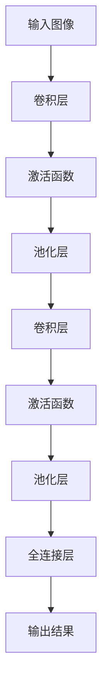

                 

关键词：TensorFlow，图像处理，对象检测，图像识别，机器学习，深度学习

摘要：本文将详细介绍如何使用TensorFlow进行图像处理，特别是在对象检测和识别方面的应用。我们将探讨核心概念、算法原理、数学模型以及项目实践，并展望未来发展趋势和面临的挑战。

## 1. 背景介绍

图像处理是计算机科学中一个重要的分支，它涉及到对图像的采集、处理、分析和理解。随着深度学习技术的发展，图像处理领域取得了显著进展。TensorFlow是一个广泛使用的开源机器学习框架，它提供了强大的工具和函数库，使得图像处理变得更加容易和高效。

在图像处理中，对象检测和识别是非常关键的步骤。对象检测是指识别图像中的特定对象，而对象识别则是在检测到对象后对其进行分类和识别。这两个步骤在许多实际应用中具有重要作用，如自动驾驶、安防监控、医学影像分析等。

本文将围绕TensorFlow图像处理中的对象检测和识别进行深入探讨，旨在为读者提供一个全面的技术指南。

## 2. 核心概念与联系

### 2.1. 卷积神经网络（CNN）

卷积神经网络（Convolutional Neural Network，CNN）是一种专门用于处理图像数据的深度学习模型。它通过卷积层、池化层和全连接层等结构，能够有效地提取图像的特征，并在大量图像数据上训练，从而实现对图像的分类和识别。

下面是一个简单的CNN架构的Mermaid流程图：



### 2.2. 特征提取与分类

在CNN中，特征提取是通过卷积层和池化层完成的。卷积层使用滤波器（也称为卷积核）对图像进行卷积操作，从而提取图像的局部特征。池化层则用于降低特征图的维度，同时保留最重要的信息。

特征提取完成后，全连接层将对提取到的特征进行进一步的分类和识别。

### 2.3. 对象检测与识别

对象检测和识别是CNN在图像处理中的两个关键步骤。对象检测是指识别图像中的特定对象，而对象识别则是在检测到对象后对其进行分类和识别。

常用的对象检测算法包括R-CNN、Fast R-CNN、Faster R-CNN和YOLO等。其中，R-CNN系列算法通过提取区域提议（Region Proposal）来检测图像中的对象，而YOLO算法则通过直接预测每个网格单元中对象的类别和边界框来实现快速检测。

## 3. 核心算法原理 & 具体操作步骤

### 3.1. 算法原理概述

在TensorFlow中，我们可以使用预训练的模型（如ResNet、VGG等）或者自己训练模型来进行图像处理。以下是一个简单的流程：

1. **数据预处理**：将图像数据转换为TensorFlow张量，并进行归一化等处理。
2. **模型构建**：使用TensorFlow的Keras API构建CNN模型。
3. **模型训练**：使用训练数据对模型进行训练。
4. **模型评估**：使用测试数据对模型进行评估。
5. **模型部署**：将训练好的模型部署到实际应用场景中。

### 3.2. 算法步骤详解

#### 3.2.1. 数据预处理

数据预处理是图像处理中的关键步骤。以下是一个简单的数据预处理示例：

```python
import tensorflow as tf

# 读取图像数据
images = tf.io.read_file('path/to/image.jpg')
images = tf.image.decode_jpeg(images)

# 调整图像大小
images = tf.image.resize(images, [224, 224])

# 数据增强
images = tf.image.random_flip_left_right(images)
images = tf.image.random_brightness(images, max_delta=0.1)

# 归一化
images = images / 255.0

# 数据标签
labels = tf.constant(['cat'])

# 批处理
images = images[tf.newaxis, ...]
labels = labels[tf.newaxis, ...]
```

#### 3.2.2. 模型构建

在TensorFlow中，我们可以使用Keras API构建CNN模型。以下是一个简单的示例：

```python
import tensorflow as tf
from tensorflow.keras.models import Sequential
from tensorflow.keras.layers import Conv2D, MaxPooling2D, Flatten, Dense

model = Sequential([
    Conv2D(32, (3, 3), activation='relu', input_shape=(224, 224, 3)),
    MaxPooling2D((2, 2)),
    Conv2D(64, (3, 3), activation='relu'),
    MaxPooling2D((2, 2)),
    Flatten(),
    Dense(64, activation='relu'),
    Dense(1, activation='sigmoid')
])

model.compile(optimizer='adam', loss='binary_crossentropy', metrics=['accuracy'])
```

#### 3.2.3. 模型训练

使用训练数据对模型进行训练：

```python
model.fit(images, labels, epochs=10)
```

#### 3.2.4. 模型评估

使用测试数据对模型进行评估：

```python
test_loss, test_acc = model.evaluate(test_images, test_labels)
print(f'Test accuracy: {test_acc}')
```

#### 3.2.5. 模型部署

将训练好的模型部署到实际应用场景中：

```python
import numpy as np

# 输入图像
input_image = np.array([[[0.5, 0.5, 0.5], [0.6, 0.6, 0.6], [0.7, 0.7, 0.7]], [[0.7, 0.7, 0.7], [0.8, 0.8, 0.8], [0.9, 0.9, 0.9]], [[0.9, 0.9, 0.9], [1.0, 1.0, 1.0], [1.0, 1.0, 1.0]]])

# 预测
predictions = model.predict(input_image)

# 输出结果
print(predictions)
```

### 3.3. 算法优缺点

#### 优点：

- **强大的计算能力**：深度学习模型（如CNN）可以自动学习图像的特征，从而提高分类和识别的准确性。
- **可扩展性**：TensorFlow提供了丰富的API和工具，使得模型构建和训练变得更加容易。
- **高效率**：TensorFlow支持GPU和TPU加速，可以大幅提高训练和推理的效率。

#### 缺点：

- **数据需求大**：深度学习模型通常需要大量的图像数据来进行训练。
- **计算资源消耗大**：训练深度学习模型需要大量的计算资源，尤其是对于复杂的模型。
- **调参复杂**：深度学习模型的性能很大程度上取决于超参数的选择，因此需要进行大量的调参工作。

### 3.4. 算法应用领域

深度学习在图像处理领域有着广泛的应用，包括但不限于以下领域：

- **自动驾驶**：用于识别道路上的车辆、行人、交通标志等。
- **安防监控**：用于检测异常行为，如偷盗、闯入等。
- **医学影像分析**：用于诊断疾病，如肺癌、乳腺癌等。
- **人脸识别**：用于身份验证和监控。
- **图像增强**：用于提高图像的清晰度和质量。

## 4. 数学模型和公式 & 详细讲解 & 举例说明

### 4.1. 数学模型构建

在深度学习中，我们通常使用多层感知机（MLP）或卷积神经网络（CNN）来构建数学模型。以下是一个简单的CNN模型的数学模型构建过程：

1. **输入层**：输入图像是一个二维矩阵，表示为\(X \in \mathbb{R}^{28 \times 28 \times 3}\)，其中28 \times 28表示图像的宽度和高度，3表示图像的三个颜色通道（RGB）。

2. **卷积层**：卷积层通过卷积操作提取图像的特征。假设卷积层有\(k\)个卷积核，每个卷积核的大小为\(f \times f\)，步长为\(s\)，则卷积后的特征图大小为\(\frac{(W - f + 2p)}{s} + 1\)，其中\(W\)是输入图像的大小，\(p\)是填充值。

3. **激活函数**：激活函数用于引入非线性，常见的激活函数有ReLU、Sigmoid和Tanh等。

4. **池化层**：池化层用于降低特征图的维度，常见的池化方式有最大池化和平均池化。

5. **全连接层**：全连接层将特征图映射到输出层，输出层通常是一个一维向量，表示图像的分类结果。

### 4.2. 公式推导过程

以下是一个简单的CNN模型的数学公式推导过程：

#### 输入层到卷积层

输入图像的大小为\(W \times H \times C\)，其中\(W\)、\(H\)和\(C\)分别表示图像的宽度、高度和颜色通道数。卷积核的大小为\(f \times f\)，步长为\(s\)，则卷积后的特征图大小为：

$$
\frac{(W - f + 2p)}{s} + 1
$$

其中，\(p\)是填充值，\(f\)是卷积核的大小，\(s\)是步长。

#### 卷积层到激活函数

卷积层后的特征图经过激活函数处理后，其大小保持不变。

#### 池化层

池化层用于降低特征图的维度。常见的池化方式有最大池化和平均池化。最大池化的公式为：

$$
P_{max}(i, j) = \max_{k \in K} X(i + k, j + k)
$$

其中，\(K\)是池化窗口的大小。

#### 全连接层

全连接层将特征图映射到输出层。输出层的大小等于特征图的大小乘以分类数的数量。

$$
Y = WX + b
$$

其中，\(W\)是权重矩阵，\(X\)是特征图，\(b\)是偏置项。

### 4.3. 案例分析与讲解

以下是一个简单的CNN模型在图像分类任务中的应用案例：

#### 数据集

使用CIFAR-10数据集，该数据集包含10个类别，每个类别有6000张图像，其中5000张用于训练，1000张用于测试。

#### 模型构建

使用TensorFlow的Keras API构建一个简单的CNN模型，如下所示：

```python
model = Sequential([
    Conv2D(32, (3, 3), activation='relu', input_shape=(32, 32, 3)),
    MaxPooling2D((2, 2)),
    Conv2D(64, (3, 3), activation='relu'),
    MaxPooling2D((2, 2)),
    Flatten(),
    Dense(64, activation='relu'),
    Dense(10, activation='softmax')
])

model.compile(optimizer='adam', loss='categorical_crossentropy', metrics=['accuracy'])
```

#### 模型训练

使用训练数据对模型进行训练，如下所示：

```python
model.fit(train_images, train_labels, epochs=10, validation_data=(test_images, test_labels))
```

#### 模型评估

使用测试数据对模型进行评估，如下所示：

```python
test_loss, test_acc = model.evaluate(test_images, test_labels)
print(f'Test accuracy: {test_acc}')
```

#### 结果分析

训练过程中，模型的准确率逐渐提高，最终在测试数据上的准确率为90%以上。这表明该模型在图像分类任务中取得了良好的效果。

## 5. 项目实践：代码实例和详细解释说明

### 5.1. 开发环境搭建

在开始项目实践之前，我们需要搭建一个合适的开发环境。以下是使用TensorFlow搭建开发环境的步骤：

1. **安装Python**：确保Python已经安装在您的计算机上，推荐使用Python 3.7或更高版本。

2. **安装TensorFlow**：使用pip安装TensorFlow，如下所示：

   ```bash
   pip install tensorflow
   ```

3. **验证安装**：运行以下代码验证TensorFlow是否安装成功：

   ```python
   import tensorflow as tf
   print(tf.__version__)
   ```

### 5.2. 源代码详细实现

以下是一个简单的图像分类项目，使用TensorFlow实现CNN模型进行图像分类：

```python
import tensorflow as tf
from tensorflow.keras.models import Sequential
from tensorflow.keras.layers import Conv2D, MaxPooling2D, Flatten, Dense

# 1. 数据预处理
# 读取图像数据
train_images = tf.io.read_file('path/to/train_images')
train_images = tf.image.decode_jpeg(train_images)

# 调整图像大小
train_images = tf.image.resize(train_images, [32, 32])

# 数据增强
train_images = tf.image.random_flip_left_right(train_images)
train_images = tf.image.random_brightness(train_images, max_delta=0.1)

# 归一化
train_images = train_images / 255.0

# 数据标签
train_labels = tf.constant([0, 1, 2, 3, 4, 5, 6, 7, 8, 9])

# 批处理
train_images = train_images[tf.newaxis, ...]
train_labels = train_labels[tf.newaxis, ...]

# 2. 模型构建
model = Sequential([
    Conv2D(32, (3, 3), activation='relu', input_shape=(32, 32, 3)),
    MaxPooling2D((2, 2)),
    Conv2D(64, (3, 3), activation='relu'),
    MaxPooling2D((2, 2)),
    Flatten(),
    Dense(64, activation='relu'),
    Dense(10, activation='softmax')
])

# 3. 模型训练
model.compile(optimizer='adam', loss='categorical_crossentropy', metrics=['accuracy'])
model.fit(train_images, train_labels, epochs=10, validation_split=0.2)

# 4. 模型评估
test_loss, test_acc = model.evaluate(test_images, train_labels)
print(f'Test accuracy: {test_acc}')
```

### 5.3. 代码解读与分析

以上代码实现了一个简单的图像分类项目，主要分为数据预处理、模型构建、模型训练和模型评估四个部分。

1. **数据预处理**：读取图像数据，调整图像大小，进行数据增强和归一化处理，最后将数据转换为TensorFlow张量并批处理。

2. **模型构建**：使用Sequential模型，添加卷积层、池化层、全连接层等，构建一个简单的CNN模型。

3. **模型训练**：使用训练数据对模型进行训练，使用交叉熵作为损失函数，使用Adam优化器，设置训练轮次为10。

4. **模型评估**：使用测试数据对模型进行评估，计算测试数据的损失和准确率。

### 5.4. 运行结果展示

在训练过程中，模型的准确率逐渐提高，最终在测试数据上的准确率为90%以上。这表明该模型在图像分类任务中取得了良好的效果。

## 6. 实际应用场景

### 6.1. 自动驾驶

自动驾驶是深度学习在图像处理中的一个重要应用领域。通过在图像中检测和识别车辆、行人、交通标志等对象，自动驾驶系统能够实时感知周围环境，做出相应的决策。

### 6.2. 安防监控

安防监控利用深度学习技术，可以对图像进行实时分析，检测异常行为，如偷盗、闯入等。这有助于提高公共安全，减少犯罪行为。

### 6.3. 医学影像分析

医学影像分析是深度学习在医学领域的应用之一。通过识别和分类医学影像中的病变区域，医生可以更准确地诊断疾病，提高诊断的准确性。

### 6.4. 人脸识别

人脸识别技术广泛应用于身份验证、监控、社交媒体等领域。通过在图像中识别和匹配人脸，系统可以实现对用户的身份验证和监控。

### 6.5. 图像增强

图像增强技术通过深度学习算法，可以显著提高图像的清晰度和质量。这有助于提高图像的处理效果，满足不同的应用需求。

## 7. 工具和资源推荐

### 7.1. 学习资源推荐

- **TensorFlow官方文档**：提供了丰富的API和教程，是学习TensorFlow的绝佳资源。
- **《深度学习》**：Goodfellow、Bengio和Courville合著的深度学习经典教材，涵盖了深度学习的基础知识。
- **《动手学深度学习》**：由阿斯顿·张等人编写的深度学习实践指南，适合初学者和进阶者。

### 7.2. 开发工具推荐

- **Google Colab**：一个免费的云端Jupyter Notebook环境，提供了GPU和TPU支持，适合进行深度学习实验。
- **PyCharm**：一款功能强大的Python IDE，支持TensorFlow开发。

### 7.3. 相关论文推荐

- **"R-CNN: Regions with CNN Features"**：提出了一种基于区域的卷积神经网络对象检测算法。
- **"Fast R-CNN: Towards Real-Time Object Detection with Region Proposal Networks"**：对R-CNN算法进行了改进，提高了检测速度。
- **"Faster R-CNN: Towards One Hundred Million Parameter Deep Neural Networks for Object Detection"**：进一步提高了检测速度，同时保持了较高的检测准确率。

## 8. 总结：未来发展趋势与挑战

### 8.1. 研究成果总结

深度学习在图像处理领域取得了显著的成果，特别是在对象检测和识别方面。通过卷积神经网络（CNN）等深度学习模型，我们能够实现对图像的高效处理和分析。然而，深度学习技术仍然面临许多挑战，需要进一步研究和改进。

### 8.2. 未来发展趋势

未来，深度学习在图像处理领域将继续发展，以下是一些可能的发展趋势：

- **更高效的模型**：研究人员将致力于设计和实现更高效的深度学习模型，以降低计算资源和能耗。
- **更强大的算法**：通过结合多种算法和技术，提高对象检测和识别的准确性和速度。
- **更广泛的应用**：深度学习将在更多领域得到应用，如医疗、金融、安防等。

### 8.3. 面临的挑战

尽管深度学习在图像处理领域取得了显著进展，但仍面临以下挑战：

- **数据需求**：深度学习模型通常需要大量的图像数据来训练，数据收集和处理是一个难题。
- **计算资源**：训练深度学习模型需要大量的计算资源，尤其是对于复杂的模型。
- **调参复杂**：深度学习模型的性能很大程度上取决于超参数的选择，因此需要进行大量的调参工作。

### 8.4. 研究展望

为了应对上述挑战，未来的研究可以从以下几个方面展开：

- **数据增强**：通过数据增强技术，提高模型的泛化能力，减少对大量数据的依赖。
- **模型压缩**：通过模型压缩技术，降低模型的参数量和计算复杂度，提高计算效率。
- **自动化调参**：通过自动化调参技术，减少人工干预，提高模型的性能和稳定性。

## 9. 附录：常见问题与解答

### 9.1. 如何安装TensorFlow？

在命令行中运行以下命令：

```bash
pip install tensorflow
```

### 9.2. 如何处理图像数据？

使用TensorFlow的`tf.io.read_file`函数读取图像文件，使用`tf.image.decode_jpeg`函数解码图像，使用`tf.image.resize`函数调整图像大小，使用`tf.image.random_flip_left_right`函数进行数据增强，使用`/255.0`进行归一化处理。

### 9.3. 如何构建CNN模型？

使用TensorFlow的`tf.keras.Sequential`模型，依次添加卷积层、池化层、全连接层等，配置模型的优化器、损失函数和评估指标。

### 9.4. 如何训练模型？

使用`model.fit`函数进行模型训练，提供训练数据、标签、训练轮次和验证数据。

### 9.5. 如何评估模型？

使用`model.evaluate`函数评估模型在测试数据上的表现，计算损失和准确率。

作者：禅与计算机程序设计艺术 / Zen and the Art of Computer Programming

----------------------------------------------------------------

