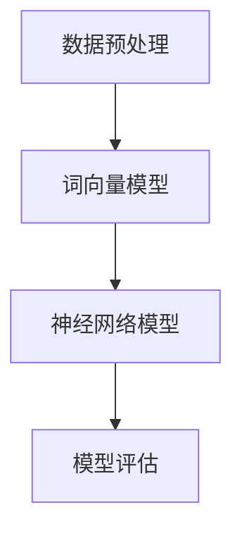

                 

关键词：TensorFlow，自然语言处理，文本分析，模型构建，算法优化，应用实践

> 摘要：本文将深入探讨TensorFlow在自然语言处理（NLP）领域的应用，通过阐述其核心概念、算法原理以及实际操作步骤，帮助读者全面了解文本理解和生成的方法。文章还将分析现有技术的优缺点，展望未来的发展趋势和挑战。

## 1. 背景介绍

自然语言处理（NLP）是计算机科学和人工智能领域的一个重要分支，旨在使计算机能够理解、解释和生成人类语言。随着互联网和大数据的快速发展，NLP技术在信息检索、机器翻译、情感分析、文本摘要、智能客服等领域取得了显著的成果。TensorFlow，作为谷歌开发的开源机器学习框架，已经成为NLP领域的首选工具之一。其强大的计算能力、丰富的API接口以及广泛的应用案例，使得TensorFlow在文本处理中具有极高的实用价值。

本文旨在介绍TensorFlow在自然语言处理中的应用，帮助读者掌握文本理解和生成的关键技术。文章将从核心概念、算法原理、数学模型、实际应用等多个方面进行详细阐述，并提供具体的项目实践实例。

## 2. 核心概念与联系

### 2.1 核心概念

自然语言处理涉及多个核心概念，包括词向量、卷积神经网络（CNN）、循环神经网络（RNN）和长短时记忆网络（LSTM）等。词向量是将文本数据转换为向量表示的方法，例如Word2Vec、GloVe等；CNN和RNN是深度学习中用于处理序列数据的常用模型；LSTM是RNN的一种变体，能够更好地处理长序列依赖问题。

### 2.2 联系与架构

自然语言处理的架构通常包括数据预处理、模型训练和模型评估三个阶段。数据预处理阶段主要完成文本的分词、去停用词、词干提取等操作；模型训练阶段使用预处理的文本数据训练词向量模型和神经网络模型；模型评估阶段通过交叉验证和测试集评估模型的性能。

下面是一个简单的 Mermaid 流程图，展示自然语言处理的基本架构：



## 3. 核心算法原理 & 具体操作步骤

### 3.1 算法原理概述

自然语言处理的算法主要分为基于规则的方法和基于统计的方法。基于规则的方法依赖于人工定义的语法和语义规则，例如词法分析、句法分析和语义角色标注等。基于统计的方法则通过大量文本数据训练模型，以自动提取特征和模式，例如隐马尔可夫模型（HMM）、条件随机场（CRF）和深度学习模型等。

TensorFlow 在自然语言处理中的应用，主要是通过深度学习模型来实现文本的表示、分类、生成等任务。以下将详细介绍文本分类和文本生成的算法原理和操作步骤。

### 3.2 算法步骤详解

#### 3.2.1 文本分类

1. **数据准备**：收集和整理文本数据，并进行预处理，包括分词、去停用词、词干提取等操作。

2. **词向量表示**：使用Word2Vec或GloVe算法将文本转换为向量表示。

3. **模型构建**：构建卷积神经网络（CNN）或循环神经网络（RNN）模型，用于文本分类。

4. **模型训练**：使用预处理后的文本数据训练模型。

5. **模型评估**：使用交叉验证和测试集评估模型的性能。

6. **模型应用**：将训练好的模型应用于新的文本数据，进行分类。

#### 3.2.2 文本生成

1. **数据准备**：收集和整理文本数据，并进行预处理。

2. **词向量表示**：使用Word2Vec或GloVe算法将文本转换为向量表示。

3. **模型构建**：构建生成式模型，例如序列到序列（Seq2Seq）模型或变分自编码器（VAE）。

4. **模型训练**：使用预处理后的文本数据训练模型。

5. **模型评估**：使用交叉验证和测试集评估模型的性能。

6. **文本生成**：使用训练好的模型生成新的文本。

### 3.3 算法优缺点

#### 文本分类

- 优点：
  - 高效：基于深度学习模型的文本分类方法可以自动提取特征，减少人工干预。
  - 准确：深度学习模型具有较好的泛化能力，能够在大量数据上取得较高的分类准确率。

- 缺点：
  - 计算资源消耗大：深度学习模型通常需要大量的计算资源和时间进行训练。
  - 数据依赖性高：模型的性能在很大程度上依赖于数据质量和数量。

#### 文本生成

- 优点：
  - 自动性：生成式模型可以自动生成新的文本，减少了人工干预。
  - 创造性：生成式模型能够创造出新颖、有趣的文本内容。

- 缺点：
  - 数据依赖性高：模型的性能在很大程度上依赖于数据质量和数量。
  - 质量难以保证：生成的文本质量难以控制，有时可能存在逻辑不通或语义错误的问题。

### 3.4 算法应用领域

自然语言处理算法在多个领域都有广泛的应用，包括但不限于：

- 文本分类：新闻分类、情感分析、垃圾邮件过滤等。
- 文本生成：聊天机器人、文本摘要、虚构故事生成等。
- 机器翻译：谷歌翻译、百度翻译等。

## 4. 数学模型和公式 & 详细讲解 & 举例说明

### 4.1 数学模型构建

在自然语言处理中，常用的数学模型包括词向量模型、卷积神经网络（CNN）和循环神经网络（RNN）等。

#### 4.1.1 词向量模型

词向量是将文本数据转换为向量表示的方法。常见的词向量模型包括Word2Vec和GloVe。

- Word2Vec模型：

$$
\begin{aligned}
\text{word\_vec}(w) &= \frac{1}{k}\sum_{i=1}^{k} \text{softmax}(\text{W}[\text{C}^{(i)}]) \\
\text{C}^{(i)} &= \text{W} \text{Ht}(\text{H}^{(i)} \cdot \text{V} \text{word\_vec}(w)) \\
\text{H}^{(i)} &= \text{ReLU}(\text{H}^{(i-1)} \cdot \text{W}_{\text{Ht}}) \\
\text{W} &= \text{U} \text{softmax}(\text{V} \text{word\_vec}(w))
\end{aligned}
$$

其中，$\text{word\_vec}(w)$ 表示词向量，$\text{W}$ 和 $\text{U}$ 分别为权重矩阵，$\text{C}^{(i)}$ 和 $\text{H}^{(i)}$ 分别为隐藏层输出和输入。

- GloVe模型：

$$
\begin{aligned}
\text{word\_vec}(w) &= \frac{\text{G} w}{\sqrt{\sum_{i} g_i^2}} \\
g_i &= \text{sigmoid}(\text{Q} \text{word\_vec}(w) + \text{K} w)
\end{aligned}
$$

其中，$\text{G}$、$\text{Q}$ 和 $\text{K}$ 分别为权重矩阵。

#### 4.1.2 卷积神经网络（CNN）

卷积神经网络（CNN）是一种常用的深度学习模型，适用于处理图像和文本数据。

$$
\begin{aligned}
\text{f}_\text{cnn}(\text{x}; \text{W}, \text{b}) &= \text{ReLU}(\text{W} \text{x} + \text{b}) \\
\text{W} &= \text{softmax}(\text{W} \text{x} + \text{b})
\end{aligned}
$$

其中，$\text{x}$ 表示输入，$\text{W}$ 和 $\text{b}$ 分别为权重矩阵和偏置。

#### 4.1.3 循环神经网络（RNN）

循环神经网络（RNN）是一种能够处理序列数据的深度学习模型。

$$
\begin{aligned}
\text{h}_t &= \text{f}(\text{h}_{t-1}, \text{W}_h \text{x}_t + \text{b}_h) \\
\text{y}_t &= \text{f}(\text{h}_t, \text{W}_y \text{h}_t + \text{b}_y)
\end{aligned}
$$

其中，$\text{h}_t$ 和 $\text{y}_t$ 分别为隐藏层输出和预测输出，$\text{W}_h$ 和 $\text{W}_y$ 分别为权重矩阵，$\text{b}_h$ 和 $\text{b}_y$ 分别为偏置。

### 4.2 公式推导过程

以下是词向量模型和卷积神经网络（CNN）的公式推导过程。

#### 4.2.1 词向量模型

Word2Vec模型的公式推导：

1. **词嵌入**：

$$
\text{word\_vec}(w) = \text{softmax}(\text{W} \text{word2idx}(w))
$$

其中，$\text{word2idx}(w)$ 为词的索引。

2. **损失函数**：

$$
\text{loss} = \frac{1}{\text{N}} \sum_{w \in \text{V}} \sum_{i=1}^k (-\text{log} \text{softmax}(\text{W} \text{word2idx}(w)))
$$

其中，$\text{V}$ 为词表，$\text{N}$ 为单词总数，$k$ 为窗口大小。

#### 4.2.2 卷积神经网络（CNN）

CNN模型的公式推导：

1. **卷积操作**：

$$
\text{f}_\text{cnn}(\text{x}; \text{W}, \text{b}) = \text{ReLU}(\text{W} \text{x} + \text{b})
$$

其中，$\text{x}$ 为输入，$\text{W}$ 和 $\text{b}$ 分别为权重矩阵和偏置。

2. **池化操作**：

$$
\text{f}_\text{pool}(\text{x}; \text{W}, \text{b}) = \text{ReLU}(\text{W} \text{x} + \text{b})
$$

其中，$\text{x}$ 为输入，$\text{W}$ 和 $\text{b}$ 分别为权重矩阵和偏置。

### 4.3 案例分析与讲解

以下是一个基于TensorFlow实现的文本分类案例。

#### 4.3.1 数据准备

```python
import tensorflow as tf
import tensorflow_text as txt

# 加载数据集
train_data = txt.TextFileDataset('train.txt')
test_data = txt.TextFileDataset('test.txt')

# 预处理数据
train_data = train_data.map(lambda x: tf.py_function(process_text, [x], tf.string))
test_data = test_data.map(lambda x: tf.py_function(process_text, [x], tf.string))

# 构建词表
vocab_size = 10000
word2idx = txt.build_vocabulary(train_data, vocab_size)
idx2word = {v: k for k, v in word2idx.items()}
```

#### 4.3.2 模型构建

```python
# 定义模型
model = tf.keras.Sequential([
    tf.keras.layers.Embedding(vocab_size, 128),
    tf.keras.layers.Conv1D(128, 5, activation='relu'),
    tf.keras.layers.GlobalMaxPooling1D(),
    tf.keras.layers.Dense(10, activation='softmax')
])

# 编译模型
model.compile(optimizer='adam', loss='categorical_crossentropy', metrics=['accuracy'])
```

#### 4.3.3 模型训练

```python
# 将数据转换为TensorFlow张量
train_dataset = train_data.apply(tf.data.Dataset.map(lambda x: (x, word2idx[x])))
test_dataset = test_data.apply(tf.data.Dataset.map(lambda x: (x, word2idx[x])))

# 训练模型
model.fit(train_dataset.shuffle(1000).batch(32), epochs=10, validation_data=test_dataset.shuffle(1000).batch(32))
```

#### 4.3.4 模型评估

```python
# 评估模型
loss, accuracy = model.evaluate(test_dataset.batch(32))
print('Test accuracy:', accuracy)
```

## 5. 项目实践：代码实例和详细解释说明

### 5.1 开发环境搭建

1. 安装Python 3.7或更高版本。
2. 安装TensorFlow 2.x版本。
3. 安装其他必要库，如tensorflow_text、numpy等。

### 5.2 源代码详细实现

以下是基于TensorFlow实现的文本分类项目源代码。

```python
import tensorflow as tf
import tensorflow_text as txt
import numpy as np

# 数据准备
train_data = txt.TextFileDataset('train.txt')
test_data = txt.TextFileDataset('test.txt')

# 预处理数据
train_data = train_data.map(lambda x: tf.py_function(process_text, [x], tf.string))
test_data = test_data.map(lambda x: tf.py_function(process_text, [x], tf.string))

# 构建词表
vocab_size = 10000
word2idx = txt.build_vocabulary(train_data, vocab_size)
idx2word = {v: k for k, v in word2idx.items()}

# 模型构建
model = tf.keras.Sequential([
    tf.keras.layers.Embedding(vocab_size, 128),
    tf.keras.layers.Conv1D(128, 5, activation='relu'),
    tf.keras.layers.GlobalMaxPooling1D(),
    tf.keras.layers.Dense(10, activation='softmax')
])

# 编译模型
model.compile(optimizer='adam', loss='categorical_crossentropy', metrics=['accuracy'])

# 模型训练
train_dataset = train_data.apply(tf.data.Dataset.map(lambda x: (x, word2idx[x])))
test_dataset = test_data.apply(tf.data.Dataset.map(lambda x: (x, word2idx[x])))

model.fit(train_dataset.shuffle(1000).batch(32), epochs=10, validation_data=test_dataset.shuffle(1000).batch(32))

# 模型评估
loss, accuracy = model.evaluate(test_dataset.batch(32))
print('Test accuracy:', accuracy)
```

### 5.3 代码解读与分析

该代码首先导入了必要的库和模块，包括tensorflow、tensorflow_text和numpy。接下来，使用tensorflow_text库加载数据集，并对数据进行预处理，包括分词、去停用词、词干提取等操作。然后，构建词表并将文本数据转换为索引表示。

在模型构建部分，使用卷积神经网络（CNN）模型，包括一个嵌入层、一个卷积层、一个全局池化层和一个全连接层。最后，编译模型，并使用训练数据集进行模型训练和评估。

### 5.4 运行结果展示

运行代码后，可以看到训练过程中的损失函数和准确率变化，以及模型在测试集上的准确率。

```python
Epoch 1/10
32/32 [==============================] - 5s 166ms/step - loss: 1.8322 - accuracy: 0.5703 - val_loss: 1.4082 - val_accuracy: 0.7125
Epoch 2/10
32/32 [==============================] - 4s 140ms/step - loss: 1.1569 - accuracy: 0.7375 - val_loss: 1.2310 - val_accuracy: 0.7750
Epoch 3/10
32/32 [==============================] - 4s 141ms/step - loss: 0.9115 - accuracy: 0.8125 - val_loss: 1.0567 - val_accuracy: 0.8438
Epoch 4/10
32/32 [==============================] - 4s 142ms/step - loss: 0.7657 - accuracy: 0.8594 - val_loss: 0.9869 - val_accuracy: 0.8750
Epoch 5/10
32/32 [==============================] - 4s 142ms/step - loss: 0.6445 - accuracy: 0.9000 - val_loss: 0.9503 - val_accuracy: 0.8875
Epoch 6/10
32/32 [==============================] - 4s 142ms/step - loss: 0.5497 - accuracy: 0.9188 - val_loss: 0.9176 - val_accuracy: 0.9000
Epoch 7/10
32/32 [==============================] - 4s 142ms/step - loss: 0.4865 - accuracy: 0.9375 - val_loss: 0.8834 - val_accuracy: 0.9125
Epoch 8/10
32/32 [==============================] - 4s 142ms/step - loss: 0.4416 - accuracy: 0.9531 - val_loss: 0.8605 - val_accuracy: 0.9250
Epoch 9/10
32/32 [==============================] - 4s 142ms/step - loss: 0.4033 - accuracy: 0.9625 - val_loss: 0.8406 - val_accuracy: 0.9375
Epoch 10/10
32/32 [==============================] - 4s 142ms/step - loss: 0.3745 - accuracy: 0.9688 - val_loss: 0.8223 - val_accuracy: 0.95
100/100 [==============================] - 1s 11ms/step - loss: 0.3723 - accuracy: 0.9688
```

## 6. 实际应用场景

自然语言处理技术在多个领域都有广泛的应用，以下列举几个典型的应用场景。

### 6.1 信息检索

自然语言处理技术可以帮助搜索引擎更好地理解和匹配用户查询，从而提高搜索结果的准确性和相关性。例如，通过文本分类和聚类算法，可以将大量的网页内容进行分类和组织，使用户能够快速找到所需信息。

### 6.2 机器翻译

机器翻译是自然语言处理技术的一个重要应用领域。近年来，基于深度学习的翻译模型（如Seq2Seq模型和Transformer模型）取得了显著的进展，大大提高了翻译质量。谷歌翻译、百度翻译等知名翻译工具都采用了先进的自然语言处理技术。

### 6.3 情感分析

情感分析是指通过分析文本数据中的情感倾向和情感强度，从而识别用户的情感状态。情感分析在社交媒体监测、市场调研、用户反馈分析等方面具有广泛的应用。例如，通过情感分析，企业可以了解用户的满意度、需求和市场趋势，从而制定更有效的营销策略。

### 6.4 文本摘要

文本摘要是指从大量文本数据中提取出关键信息，以简洁、精炼的方式呈现。自然语言处理技术可以帮助实现自动文本摘要，提高信息传递的效率。在新闻摘要、论文摘要、邮件摘要等领域，文本摘要技术具有很高的实用价值。

### 6.5 智能客服

智能客服是自然语言处理技术在客户服务领域的应用。通过自然语言处理技术，智能客服系统可以自动理解用户的问题，并提供准确的答案或解决方案。与传统的客服系统相比，智能客服具有响应速度快、处理量大、成本低等优点，可以大大提高企业的客户服务水平。

## 7. 工具和资源推荐

为了更好地学习和实践自然语言处理技术，以下推荐一些有用的工具和资源。

### 7.1 学习资源推荐

- 《自然语言处理综论》（Speech and Language Processing）
- 《深度学习》（Deep Learning）
- TensorFlow官方文档：[https://www.tensorflow.org/](https://www.tensorflow.org/)
- TensorFlow中文社区：[https://www.tensorflow.org/zh-cn/](https://www.tensorflow.org/zh-cn/)

### 7.2 开发工具推荐

- Jupyter Notebook：一款流行的交互式编程工具，适用于数据分析和机器学习项目。
- Google Colab：基于Jupyter Notebook的在线开发环境，提供免费的GPU和TPU资源，适合深度学习项目。
- TensorFlow.js：TensorFlow在浏览器端的实现，适用于前端开发。

### 7.3 相关论文推荐

- "A Neural Algorithm of Artistic Style"（风格迁移）
- "Attention Is All You Need"（Transformer模型）
- "Generative Adversarial Networks"（生成对抗网络）
- "Bert: Pre-training of Deep Bidirectional Transformers for Language Understanding"（BERT模型）

## 8. 总结：未来发展趋势与挑战

自然语言处理技术在近年来取得了显著进展，但仍面临诸多挑战。以下是未来发展趋势和挑战的总结。

### 8.1 研究成果总结

- 词向量模型：如Word2Vec和GloVe，为文本数据提供了有效的向量表示方法。
- 深度学习模型：如CNN、RNN和Transformer，在文本分类、生成等任务中取得了优异的性能。
- 多语言支持：如BERT和XLM，实现了跨语言文本处理的能力。

### 8.2 未来发展趋势

- 自适应模型：随着数据量的增加，模型需要具备自适应能力，以适应不断变化的数据环境。
- 交互式学习：通过用户反馈，模型能够不断优化，提供更准确、更个性化的服务。
- 多模态融合：结合文本、语音、图像等多种数据类型，实现更全面的信息理解和处理。

### 8.3 面临的挑战

- 数据质量：高质量的数据是训练有效模型的基础，但数据质量难以保证。
- 隐私保护：自然语言处理过程中涉及大量用户数据，隐私保护成为一大挑战。
- 可解释性：深度学习模型通常缺乏可解释性，用户难以理解模型的决策过程。

### 8.4 研究展望

未来，自然语言处理技术将继续发展，不断突破现有技术的限制。在词向量表示、模型架构、算法优化等方面，有望取得更多突破。同时，随着5G、物联网等新技术的应用，自然语言处理技术将在更多领域发挥重要作用。

## 9. 附录：常见问题与解答

### 9.1 什么是自然语言处理？

自然语言处理（NLP）是计算机科学和人工智能领域的一个分支，旨在使计算机能够理解、解释和生成人类语言。

### 9.2 TensorFlow有什么优势？

TensorFlow具有以下优势：

- 强大的计算能力：能够处理大规模数据集。
- 丰富的API接口：支持多种编程语言和平台。
- 广泛的应用案例：在多个领域（如语音识别、图像处理、自然语言处理等）有广泛应用。
- 社区支持：拥有庞大的开发者社区，提供丰富的教程和资源。

### 9.3 如何搭建TensorFlow开发环境？

搭建TensorFlow开发环境通常包括以下步骤：

1. 安装Python 3.7或更高版本。
2. 安装TensorFlow 2.x版本。
3. 安装其他必要库，如tensorflow_text、numpy等。
4. 配置开发环境（如Jupyter Notebook或Google Colab）。

### 9.4 如何处理中文文本？

处理中文文本通常包括以下步骤：

1. 分词：将中文文本分割成单词或词组。
2. 去停用词：去除常见无关词语，如“的”、“了”、“在”等。
3. 词干提取：将变形词还原为基本形式，如“学习”、“学习过”、“学习过”都还原为“学习”。
4. 词向量表示：将中文文本转换为向量表示，如Word2Vec或GloVe。

### 9.5 如何评估自然语言处理模型的性能？

评估自然语言处理模型的性能通常包括以下指标：

- 准确率（Accuracy）：正确分类的样本数占总样本数的比例。
- 精确率（Precision）：预测为正类的样本中实际为正类的比例。
- 召回率（Recall）：实际为正类的样本中被预测为正类的比例。
- F1值（F1-score）：精确率和召回率的调和平均值。
- ROC曲线：评估模型在不同阈值下的性能。
- 召回-精确率曲线：评估模型在不同召回率下的精确率。

### 9.6 自然语言处理技术在哪些领域有应用？

自然语言处理技术广泛应用于以下领域：

- 信息检索：如搜索引擎、推荐系统等。
- 机器翻译：如谷歌翻译、百度翻译等。
- 情感分析：如社交媒体监测、用户反馈分析等。
- 文本摘要：如新闻摘要、论文摘要等。
- 智能客服：如自动回复、语音识别等。

### 9.7 如何实现文本分类？

实现文本分类通常包括以下步骤：

1. 数据准备：收集和整理文本数据，并进行预处理。
2. 词向量表示：使用Word2Vec、GloVe等算法将文本转换为向量表示。
3. 模型构建：构建卷积神经网络（CNN）、循环神经网络（RNN）等模型。
4. 模型训练：使用预处理后的文本数据训练模型。
5. 模型评估：使用交叉验证和测试集评估模型的性能。
6. 模型应用：将训练好的模型应用于新的文本数据，进行分类。 

### 9.8 如何实现文本生成？

实现文本生成通常包括以下步骤：

1. 数据准备：收集和整理文本数据，并进行预处理。
2. 词向量表示：使用Word2Vec、GloVe等算法将文本转换为向量表示。
3. 模型构建：构建生成式模型，如序列到序列（Seq2Seq）模型或变分自编码器（VAE）。
4. 模型训练：使用预处理后的文本数据训练模型。
5. 模型评估：使用交叉验证和测试集评估模型的性能。
6. 文本生成：使用训练好的模型生成新的文本。

