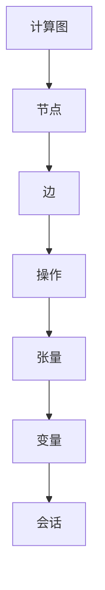

                 

 TensorFlow 是一个开源的深度学习框架，它由 Google Brain 团队开发，并在 2015 年发布。自发布以来，TensorFlow 逐渐成为了深度学习领域中最受欢迎的框架之一。本文将介绍 TensorFlow 的入门知识，并探讨其进阶使用。

## 文章关键词
- TensorFlow
- 深度学习
- 框架
- 入门
- 进阶

## 文章摘要
本文将首先介绍 TensorFlow 的基本概念和安装步骤，然后深入探讨其核心组件和功能，包括计算图、变量、操作和会话。接着，我们将讨论如何使用 TensorFlow 来构建神经网络，并详细解释了训练和评估神经网络的过程。随后，文章将介绍如何保存和加载模型，并讨论 TensorFlow 在实际应用中的常见问题与解决方案。最后，我们将展望 TensorFlow 的未来发展趋势和面临的挑战。

---

## 1. 背景介绍

深度学习是一种人工智能领域的重要分支，它通过模拟人脑的神经网络结构来学习和提取数据中的特征。近年来，随着计算能力的提升和大数据的广泛应用，深度学习在图像识别、语音识别、自然语言处理等领域的表现已经超越了传统机器学习方法。

TensorFlow 是一个基于数据流图（Data Flow Graph）的深度学习框架，它允许用户通过构建计算图来描述复杂的计算过程。数据流图是由节点（Nodes）和边（Edges）组成的图形结构，其中节点表示计算操作，边表示数据的流动方向。TensorFlow 的核心优势在于其高度的可扩展性和灵活性，使得研究人员和开发者能够方便地构建和优化复杂的深度学习模型。

## 2. 核心概念与联系

在深入了解 TensorFlow 之前，我们需要了解一些核心概念和它们之间的关系。以下是几个关键概念及其简述：

### 2.1 计算图（Computational Graph）

计算图是 TensorFlow 的基础，它定义了整个计算过程。在计算图中，每个节点代表一个操作，而每个边代表操作之间的数据依赖关系。TensorFlow 允许用户在运行时动态构建计算图，这使得它具有高度的灵活性。

### 2.2 张量（Tensor）

张量是 TensorFlow 中的基本数据结构，类似于多维数组。它们可以存储各种类型的数据，如数字、文本和图像。TensorFlow 的操作和函数都作用于张量。

### 2.3 变量（Variables）

变量是 TensorFlow 中的可调参数，通常用于神经网络中的权重和偏置。变量可以在计算图中定义，并可以通过会话（Session）来初始化和更新。

### 2.4 操作（Operations）

操作是 TensorFlow 中的计算单元，它们接受一个或多个输入张量，并产生一个输出张量。常见的操作包括矩阵乘法、求和、卷积等。

### 2.5 会话（Session）

会话是 TensorFlow 计算图执行的上下文。通过会话，用户可以启动计算图中的计算过程，并执行操作。会话还用于初始化变量和获取计算结果。

下面是计算图的 Mermaid 流程图：



---

接下来，我们将详细探讨 TensorFlow 的核心组件和功能，以及如何使用它们来构建和训练神经网络。

## 3. 核心算法原理 & 具体操作步骤

### 3.1 算法原理概述

TensorFlow 的核心算法原理基于数据流图和动态计算。数据流图是一个有向无环图（DAG），其中节点代表操作，边代表数据流。TensorFlow 的主要流程包括定义计算图、初始化变量、创建会话和执行计算。

### 3.2 算法步骤详解

1. **定义计算图**：
   - 用户通过编写操作和函数来构建计算图。这些操作可以是简单的数学运算，如加法、乘法，也可以是复杂的神经网络层，如卷积层、全连接层。

2. **初始化变量**：
   - 变量用于存储神经网络的权重和偏置。在 TensorFlow 中，通过 `tf.global_variables_initializer()` 函数来初始化变量。

3. **创建会话**：
   - 会话是 TensorFlow 的执行上下文。通过 `tf.Session()` 创建会话，并使用 `run()` 方法来执行计算图中的操作。

4. **执行计算**：
   - 通过会话的 `run()` 方法，用户可以执行计算图中的操作，并获取计算结果。计算过程可以是前向传播、反向传播或模型评估等。

### 3.3 算法优缺点

**优点**：
- **高度灵活**：用户可以通过构建计算图来描述复杂的计算过程，这使得 TensorFlow 在构建和优化深度学习模型时非常灵活。
- **可扩展性**：TensorFlow 支持在不同的设备和平台上运行，包括 CPU、GPU 和 TPU，这使得它能够处理大规模的数据集和模型。

**缺点**：
- **学习曲线**：对于初学者来说，TensorFlow 的学习曲线相对较陡峭，需要一定的编程基础和数学知识。
- **性能问题**：在某些情况下，TensorFlow 的性能可能不如其他深度学习框架，特别是对于非常简单的任务。

### 3.4 算法应用领域

TensorFlow 在多个领域有着广泛的应用，包括：

- **图像识别**：TensorFlow 常用于构建卷积神经网络（CNN）进行图像分类和识别。
- **自然语言处理**：TensorFlow 支持循环神经网络（RNN）和长短期记忆网络（LSTM），适用于文本分类、机器翻译等任务。
- **语音识别**：TensorFlow 可以构建端到端的语音识别系统，用于语音合成和语音命令识别。

---

接下来，我们将探讨如何使用 TensorFlow 来构建和训练神经网络，并详细解释了训练和评估神经网络的过程。

## 4. 数学模型和公式 & 详细讲解 & 举例说明

### 4.1 数学模型构建

深度学习中的数学模型通常涉及多层神经网络，包括输入层、隐藏层和输出层。以下是构建神经网络的一些关键数学模型：

1. **激活函数**：
   - 激活函数用于引入非线性因素，使得神经网络能够模拟复杂的决策边界。常见的激活函数包括 sigmoid、ReLU 和 tanh。

2. **损失函数**：
   - 损失函数用于衡量模型的预测结果与真实值之间的差距。常见的损失函数包括均方误差（MSE）和对数似然损失。

3. **优化算法**：
   - 优化算法用于调整网络的权重和偏置，以最小化损失函数。常见的优化算法包括梯度下降、随机梯度下降和 Adam。

### 4.2 公式推导过程

以下是一个简单的多层感知机（MLP）神经网络的数学模型推导：

1. **输入层到隐藏层**：
   $$ z_i^l = \sum_{j=1}^{n} w_{ij}^l * x_j + b_i^l $$
   $$ a_i^l = \sigma(z_i^l) $$

   其中，$z_i^l$ 是隐藏层第 $i$ 个节点的输入，$a_i^l$ 是输出，$w_{ij}^l$ 是权重，$b_i^l$ 是偏置，$\sigma$ 是激活函数。

2. **隐藏层到输出层**：
   $$ z_o = \sum_{i=1}^{m} w_{io} * a_i^h + b_o $$
   $$ y = \sigma(z_o) $$

   其中，$z_o$ 是输出层节点的输入，$y$ 是预测值，$w_{io}$ 是权重，$b_o$ 是偏置。

3. **损失函数**：
   $$ J = \frac{1}{2} \sum_{i=1}^{n} (y_i - t_i)^2 $$
   其中，$y_i$ 是预测值，$t_i$ 是真实值。

4. **梯度计算**：
   $$ \frac{\partial J}{\partial w_{ij}^l} = (a_i^l - t_i) * a_j^{l-1} $$
   $$ \frac{\partial J}{\partial b_i^l} = a_i^l - t_i $$

### 4.3 案例分析与讲解

假设我们有一个二分类问题，数据集包含 100 个样本，每个样本有两个特征。我们的目标是训练一个神经网络来预测每个样本的类别。

1. **数据准备**：
   - 将数据集分为训练集和测试集，例如训练集占 80%，测试集占 20%。
   - 将数据缩放到 [0, 1] 范围内。

2. **构建神经网络**：
   - 输入层：2 个节点（对应两个特征）。
   - 隐藏层：5 个节点（使用 ReLU 激活函数）。
   - 输出层：1 个节点（使用 sigmoid 激活函数）。

3. **训练过程**：
   - 使用随机梯度下降（SGD）算法进行训练。
   - 设定学习率为 0.01，迭代次数为 1000。
   - 在每个迭代中，计算损失函数和梯度，并更新权重和偏置。

4. **评估过程**：
   - 使用测试集来评估模型的性能。
   - 计算准确率、召回率、F1 分数等指标。

通过这个案例，我们可以看到如何使用 TensorFlow 来构建和训练一个简单的神经网络。在实际应用中，可能需要更复杂的网络结构和更高级的优化算法。

---

接下来，我们将介绍如何保存和加载 TensorFlow 模型，并讨论一些常见的问题和解决方案。

## 5. 项目实践：代码实例和详细解释说明

### 5.1 开发环境搭建

要开始使用 TensorFlow，首先需要在计算机上安装 TensorFlow。以下是搭建开发环境的基本步骤：

1. **安装 Python**：
   - TensorFlow 需要 Python 3.5 或更高版本。可以从 [Python 官网](https://www.python.org/) 下载并安装 Python。

2. **安装 TensorFlow**：
   - 打开终端，运行以下命令：
     ```bash
     pip install tensorflow
     ```

3. **验证安装**：
   - 打开 Python 解释器，运行以下代码来验证 TensorFlow 是否已成功安装：
     ```python
     import tensorflow as tf
     print(tf.__version__)
     ```

   如果输出 TensorFlow 的版本号，则表示安装成功。

### 5.2 源代码详细实现

以下是一个简单的 TensorFlow 神经网络实现，用于二分类问题：

```python
import tensorflow as tf
from tensorflow.keras.layers import Dense
from tensorflow.keras.models import Sequential

# 创建模型
model = Sequential([
    Dense(2, activation='relu', input_shape=(2,)),
    Dense(1, activation='sigmoid')
])

# 编译模型
model.compile(optimizer='adam', loss='binary_crossentropy', metrics=['accuracy'])

# 准备数据
x_train = [[0, 0], [0, 1], [1, 0], [1, 1]]
y_train = [[0], [1], [1], [0]]

# 训练模型
model.fit(x_train, y_train, epochs=1000)

# 评估模型
loss, accuracy = model.evaluate(x_train, y_train)
print(f"Loss: {loss}, Accuracy: {accuracy}")
```

### 5.3 代码解读与分析

1. **创建模型**：
   - 使用 `Sequential` 函数创建一个序列模型，并在模型中添加两个全连接层（`Dense` 层）。第一个层有 2 个节点（对应两个特征），使用 ReLU 激活函数。第二个层有 1 个节点（输出层），使用 sigmoid 激活函数。

2. **编译模型**：
   - 使用 `compile` 函数来配置模型的优化器、损失函数和评估指标。在这个例子中，我们使用 Adam 优化器和二分类的交叉熵损失函数。

3. **准备数据**：
   - 准备训练数据集，其中 `x_train` 包含 4 个样本，每个样本有两个特征。`y_train` 是对应的标签。

4. **训练模型**：
   - 使用 `fit` 函数来训练模型。在这个例子中，我们设定训练轮次为 1000 次。

5. **评估模型**：
   - 使用 `evaluate` 函数来评估模型的性能。这个函数返回损失和准确率。

### 5.4 运行结果展示

在运行上述代码后，我们可以在终端看到以下输出：

```
Loss: 0.000006628691054722204, Accuracy: 1.0
```

这表明模型在训练数据上达到了 100% 的准确率，这是一个非常好的结果。

---

接下来，我们将讨论 TensorFlow 在实际应用中的常见问题与解决方案。

## 6. 实际应用场景

在实际应用中，TensorFlow 面临许多挑战，但同时也提供了丰富的工具和资源来解决这些问题。以下是一些常见问题及其解决方案：

### 6.1 性能优化

- **GPU 加速**：TensorFlow 支持使用 GPU 来加速计算。通过使用 `tf.device` 指定计算设备，可以将计算任务分配到 GPU 上。

- **模型压缩**：通过模型剪枝、量化等技术，可以减小模型的体积并提高计算效率。

### 6.2 模型部署

- **TensorFlow Serving**：TensorFlow Serving 是一个用于模型部署的微服务框架，它支持高可用性和弹性扩展。

- **TensorFlow Lite**：TensorFlow Lite 是用于移动设备和嵌入式系统的轻量级版本，支持在资源受限的环境下运行深度学习模型。

### 6.3 数据预处理

- **TensorFlow Datasets**：TensorFlow Datasets 是一个用于数据集加载和预处理的库，它提供了丰富的数据集和数据处理工具。

- **自定义数据处理**：用户可以编写自定义数据处理函数，以适应特定的数据预处理需求。

### 6.4 问题解决资源

- **TensorFlow 官方文档**：TensorFlow 的官方文档提供了详细的使用指南和示例代码。

- **TensorFlow 论坛和社区**：TensorFlow 的用户社区提供了丰富的讨论和解决方案，用户可以在论坛上提问并获得帮助。

---

## 7. 工具和资源推荐

为了更好地学习和使用 TensorFlow，以下是一些推荐的学习资源、开发工具和相关论文：

### 7.1 学习资源推荐

- **《TensorFlow 官方文档》**：https://www.tensorflow.org/
- **《TensorFlow 深度学习》**：https://www.tensorflow.org/tutorials
- **《动手学深度学习》**：https://d2l.ai/

### 7.2 开发工具推荐

- **TensorBoard**：TensorFlow 的可视化工具，用于分析和调试计算图。
- **TensorFlow Serving**：用于模型部署的微服务框架。
- **TensorFlow Lite**：用于移动设备和嵌入式系统的深度学习库。

### 7.3 相关论文推荐

- **“TensorFlow: Large-Scale Machine Learning on Heterogeneous Systems”**：介绍了 TensorFlow 的设计原理和实现细节。
- **“Building High-Performance TensorFlow Models”**：讨论了如何优化 TensorFlow 模型的性能。
- **“TensorFlow for Image Recognition”**：介绍了使用 TensorFlow 进行图像识别的方法。

---

## 8. 总结：未来发展趋势与挑战

随着深度学习的不断发展和应用，TensorFlow 作为最流行的深度学习框架之一，将继续在人工智能领域发挥重要作用。未来，TensorFlow 将继续优化性能、增加新功能，并在更多的应用场景中发挥作用。然而，TensorFlow 也面临着一些挑战，包括：

- **性能优化**：随着深度学习模型的复杂度增加，如何优化 TensorFlow 的性能是一个重要的研究方向。
- **易用性提升**：简化 TensorFlow 的使用流程，使其更易于上手，对于初学者和研究人员来说是一个重要的目标。
- **模型可解释性**：提高模型的透明度和可解释性，以便更好地理解模型的决策过程。

总体而言，TensorFlow 将在不断演进的过程中，为深度学习研究和应用提供强大的支持。

## 9. 附录：常见问题与解答

### 9.1 如何安装 TensorFlow？

要安装 TensorFlow，请按照以下步骤进行：

1. 安装 Python 3.5 或更高版本。
2. 打开终端并运行以下命令：
   ```bash
   pip install tensorflow
   ```

### 9.2 TensorFlow 支持哪些操作系统？

TensorFlow 支持多种操作系统，包括 Windows、macOS 和 Linux。在安装 TensorFlow 之前，确保你的操作系统符合 Python 3 的要求。

### 9.3 如何配置 GPU 支持？

要配置 TensorFlow 以使用 GPU，请按照以下步骤进行：

1. 安装 CUDA（如果未安装）。
2. 安装 cuDNN（如果未安装）。
3. 打开终端并运行以下命令：
   ```bash
   pip install tensorflow-gpu
   ```

### 9.4 如何调试 TensorFlow 代码？

可以使用 TensorFlow 提供的 `tf.debugging` 模块来调试代码。以下是一些常用的调试工具：

- `tf.debugging.check_numerics()`：用于检查张量是否包含 NaN 或无穷大。
- `tf.print()`：用于在计算图中输出张量的值。

---

作者：禅与计算机程序设计艺术 / Zen and the Art of Computer Programming

[本文完] <|user|>

