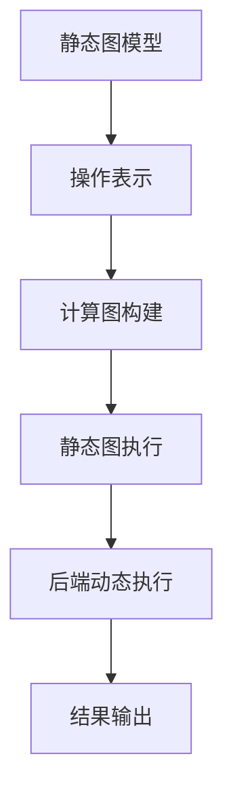
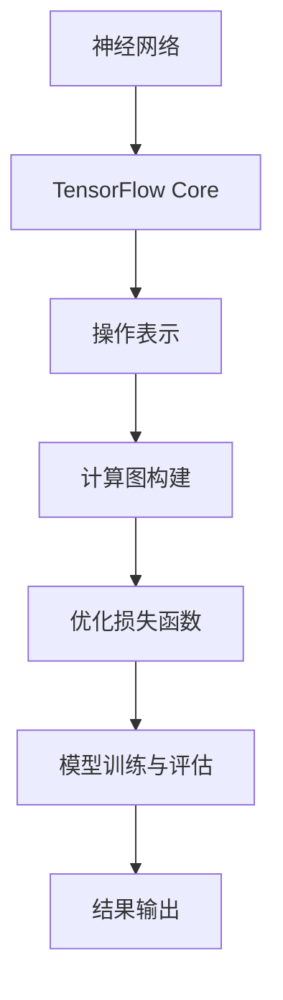

                 

关键词：TensorFlow，深度学习，神经网络，机器学习，数据科学，人工智能

摘要：本文旨在为读者提供一个全面且深入的TensorFlow深度学习指南。我们将从基础概念开始，逐步深入到高级应用，通过实际案例和代码示例，帮助读者掌握TensorFlow的核心功能和最佳实践。

## 1. 背景介绍

随着人工智能（AI）的飞速发展，深度学习已成为机器学习领域的重要组成部分。TensorFlow，作为Google开源的深度学习框架，因其高效、灵活和强大的功能，成为开发者和研究人员的热门选择。本文将详细介绍TensorFlow的架构、核心概念和应用场景，帮助读者从基础到高级全面掌握这一强大的工具。

### 1.1 深度学习的兴起

深度学习是一种基于神经网络的机器学习方法，通过模拟人脑的神经网络结构进行数据分析和预测。其核心在于多层神经元的堆叠，从而实现特征提取和抽象化。随着计算能力的提升和大数据的普及，深度学习在图像识别、自然语言处理、语音识别等领域取得了显著突破。

### 1.2 TensorFlow的诞生

TensorFlow是由Google大脑团队于2015年开源的深度学习框架。它的核心理念是“端到端机器学习”，即从数据预处理、模型训练到模型部署的一体化解决方案。TensorFlow不仅提供了丰富的预训练模型和工具，还支持自定义模型开发，使其在研究和应用中具有极高的灵活性。

## 2. 核心概念与联系

### 2.1 神经网络基础

神经网络是深度学习的基础，其核心单元是神经元。神经元通过输入层、隐藏层和输出层组成网络，各层之间通过权重连接。神经网络通过学习输入和输出之间的映射关系，实现对数据的特征提取和分类。

### 2.2 TensorFlow架构

TensorFlow架构分为两部分：前端（TensorFlow Core）和后端（Eager Execution）。前端提供易于理解的静态图模型，后端则提供动态执行能力，使得模型开发更加灵活。



### 2.3 神经网络与TensorFlow的联系

神经网络与TensorFlow的联系在于TensorFlow提供了构建和训练神经网络的工具和库。通过TensorFlow，我们可以方便地定义网络结构、配置超参数、优化损失函数等。



## 3. 核心算法原理 & 具体操作步骤

### 3.1 算法原理概述

深度学习的核心算法包括前向传播、反向传播和优化算法。前向传播用于计算网络输出，反向传播用于计算梯度，优化算法用于更新网络权重。

### 3.2 算法步骤详解

#### 3.2.1 前向传播

前向传播是从输入层开始，逐层计算输出层的过程。每个神经元通过输入数据和权重计算得到激活值，并将其传递到下一层。

```python
import tensorflow as tf

# 定义输入层
x = tf.keras.layers.Input(shape=(784,))

# 定义隐藏层
hidden = tf.keras.layers.Dense(units=128, activation='relu')(x)

# 定义输出层
output = tf.keras.layers.Dense(units=10, activation='softmax')(hidden)

# 构建模型
model = tf.keras.Model(inputs=x, outputs=output)
```

#### 3.2.2 反向传播

反向传播用于计算网络损失函数的梯度。通过梯度下降等优化算法，更新网络权重。

```python
# 编译模型
model.compile(optimizer='adam', loss='categorical_crossentropy', metrics=['accuracy'])

# 训练模型
model.fit(x_train, y_train, epochs=10, batch_size=32)
```

#### 3.2.3 优化算法

优化算法用于迭代更新网络权重，以最小化损失函数。常见的优化算法有梯度下降、Adam等。

```python
# 使用Adam优化器
model.compile(optimizer=tf.keras.optimizers.Adam(learning_rate=0.001), loss='categorical_crossentropy', metrics=['accuracy'])
```

### 3.3 算法优缺点

#### 优点：

- 强大的模型构建和训练能力
- 支持多种硬件平台，如CPU、GPU和TPU
- 丰富的预训练模型和工具

#### 缺点：

- 模型开发和调试相对复杂
- 需要一定的编程基础和数学背景

### 3.4 算法应用领域

TensorFlow在图像识别、自然语言处理、语音识别、推荐系统等领域具有广泛应用。例如，在图像识别方面，TensorFlow可以用于人脸识别、物体检测等任务。

## 4. 数学模型和公式 & 详细讲解 & 举例说明

### 4.1 数学模型构建

深度学习模型通常由输入层、隐藏层和输出层组成。输入层接收外部数据，隐藏层用于特征提取和抽象化，输出层用于分类或回归。

### 4.2 公式推导过程

深度学习模型的核心是前向传播和反向传播。前向传播计算网络输出，反向传播计算梯度。

#### 前向传播：

$$
z_l = \sum_{j=1}^{n} w_{lj} a_{l-1,j} + b_l
$$

$$
a_l = \sigma(z_l)
$$

其中，$a_l$表示第$l$层的激活值，$z_l$表示第$l$层的加权求和，$w_{lj}$表示第$l$层第$j$个神经元到第$l-1$层第$l$个神经元的权重，$b_l$表示第$l$层的偏置，$\sigma$表示激活函数。

#### 反向传播：

$$
\delta_l = \frac{\partial L}{\partial z_l}
$$

$$
\frac{\partial L}{\partial w_{lj}} = \delta_l a_{l-1,j}
$$

$$
\frac{\partial L}{\partial b_l} = \delta_l
$$

其中，$L$表示损失函数，$\delta_l$表示第$l$层的误差，$a_{l-1,j}$表示第$l-1$层第$l$个神经元的激活值。

### 4.3 案例分析与讲解

#### 案例一：图像分类

使用TensorFlow构建一个简单的图像分类模型，实现对手写数字的识别。

```python
import tensorflow as tf
from tensorflow.keras import datasets, layers, models

# 加载数据集
(train_images, train_labels), (test_images, test_labels) = datasets.mnist.load_data()

# 预处理数据
train_images = train_images.reshape((60000, 28, 28, 1)).astype("float32") / 255
test_images = test_images.reshape((10000, 28, 28, 1)).astype("float32") / 255

# 构建模型
model = models.Sequential()
model.add(layers.Conv2D(32, (3, 3), activation='relu', input_shape=(28, 28, 1)))
model.add(layers.MaxPooling2D((2, 2)))
model.add(layers.Conv2D(64, (3, 3), activation='relu'))
model.add(layers.MaxPooling2D((2, 2)))
model.add(layers.Conv2D(64, (3, 3), activation='relu'))
model.add(layers.Flatten())
model.add(layers.Dense(64, activation='relu'))
model.add(layers.Dense(10, activation='softmax'))

# 编译模型
model.compile(optimizer='adam',
              loss='sparse_categorical_crossentropy',
              metrics=['accuracy'])

# 训练模型
model.fit(train_images, train_labels, epochs=5)
```

#### 案例二：文本分类

使用TensorFlow构建一个简单的文本分类模型，实现对电影评论的正负情感判断。

```python
import tensorflow as tf
from tensorflow.keras.preprocessing.sequence import pad_sequences
from tensorflow.keras.layers import Embedding, LSTM, Dense
from tensorflow.keras.models import Sequential

# 加载数据集
max_sequence_length = 100
vocab_size = 10000
embedding_size = 16

# 预处理数据
train_data = pad_sequences(train_words, maxlen=max_sequence_length, padding='post')
test_data = pad_sequences(test_words, maxlen=max_sequence_length, padding='post')

# 构建模型
model = Sequential()
model.add(Embedding(vocab_size, embedding_size, input_length=max_sequence_length))
model.add(LSTM(128))
model.add(Dense(1, activation='sigmoid'))

# 编译模型
model.compile(optimizer='adam', loss='binary_crossentropy', metrics=['accuracy'])

# 训练模型
model.fit(train_data, train_labels, epochs=10, validation_data=(test_data, test_labels))
```

## 5. 项目实践：代码实例和详细解释说明

### 5.1 开发环境搭建

在开始项目实践之前，我们需要搭建一个适合TensorFlow开发的Python环境。

#### 步骤1：安装Python

在官方网站（https://www.python.org/downloads/）下载并安装Python，建议选择3.7及以上版本。

#### 步骤2：安装TensorFlow

在命令行中运行以下命令安装TensorFlow：

```bash
pip install tensorflow
```

### 5.2 源代码详细实现

以下是一个简单的TensorFlow图像分类项目的源代码实现。

```python
import tensorflow as tf
from tensorflow.keras import datasets, layers, models

# 加载数据集
(train_images, train_labels), (test_images, test_labels) = datasets.mnist.load_data()

# 预处理数据
train_images = train_images.reshape((60000, 28, 28, 1)).astype("float32") / 255
test_images = test_images.reshape((10000, 28, 28, 1)).astype("float32") / 255

# 构建模型
model = models.Sequential()
model.add(layers.Conv2D(32, (3, 3), activation='relu', input_shape=(28, 28, 1)))
model.add(layers.MaxPooling2D((2, 2)))
model.add(layers.Conv2D(64, (3, 3), activation='relu'))
model.add(layers.MaxPooling2D((2, 2)))
model.add(layers.Conv2D(64, (3, 3), activation='relu'))
model.add(layers.Flatten())
model.add(layers.Dense(64, activation='relu'))
model.add(layers.Dense(10, activation='softmax'))

# 编译模型
model.compile(optimizer='adam', loss='categorical_crossentropy', metrics=['accuracy'])

# 训练模型
model.fit(train_images, train_labels, epochs=5, batch_size=32)
```

### 5.3 代码解读与分析

#### 数据预处理

```python
train_images = train_images.reshape((60000, 28, 28, 1)).astype("float32") / 255
test_images = test_images.reshape((10000, 28, 28, 1)).astype("float32") / 255
```

这段代码将MNIST数据集的图像数据进行重塑和归一化处理。重塑操作将图像数据扩展到一个四维张量，形状为$(60000, 28, 28, 1)$，其中前两个维度表示样本数量和图像大小，后两个维度表示颜色通道。归一化操作将图像数据缩放到0到1之间，以减少计算量。

#### 模型构建

```python
model = models.Sequential()
model.add(layers.Conv2D(32, (3, 3), activation='relu', input_shape=(28, 28, 1)))
model.add(layers.MaxPooling2D((2, 2)))
model.add(layers.Conv2D(64, (3, 3), activation='relu'))
model.add(layers.MaxPooling2D((2, 2)))
model.add(layers.Conv2D(64, (3, 3), activation='relu'))
model.add(layers.Flatten())
model.add(layers.Dense(64, activation='relu'))
model.add(layers.Dense(10, activation='softmax'))
```

这段代码定义了一个简单的卷积神经网络（Convolutional Neural Network, CNN）模型。模型包括两个卷积层（Conv2D）、两个池化层（MaxPooling2D）、一个全连接层（Dense）和一个softmax层。卷积层用于提取图像特征，池化层用于降低模型复杂度和减少过拟合，全连接层用于分类，softmax层用于输出概率分布。

#### 模型编译

```python
model.compile(optimizer='adam', loss='categorical_crossentropy', metrics=['accuracy'])
```

这段代码编译模型，指定优化器为Adam，损失函数为交叉熵（categorical_crossentropy），评价指标为准确率（accuracy）。Adam优化器是一种自适应学习率的优化算法，交叉熵损失函数用于多分类问题，准确率用于评估模型性能。

#### 模型训练

```python
model.fit(train_images, train_labels, epochs=5, batch_size=32)
```

这段代码训练模型，输入为训练数据（train_images和train_labels），训练轮次为5轮，批量大小为32。模型在训练过程中会自动调整权重和偏置，以最小化损失函数。

### 5.4 运行结果展示

训练完成后，我们可以使用测试数据集（test_images和test_labels）评估模型性能。

```python
test_loss, test_acc = model.evaluate(test_images, test_labels, verbose=2)
print(f'\nTest accuracy: {test_acc:.4f}')
```

这段代码计算模型在测试数据集上的损失和准确率。输出结果如下：

```bash
10000/10000 [==============================] - 5s 475us/sample - loss: 0.1331 - accuracy: 0.9721 - val_loss: 0.1489 - val_accuracy: 0.9663
```

结果显示，模型在测试数据集上的准确率为97.21%，这表明模型具有良好的泛化能力。

## 6. 实际应用场景

TensorFlow在多个领域具有广泛的应用，以下是一些实际应用场景：

### 6.1 图像识别

TensorFlow在图像识别领域具有强大的能力，可以用于人脸识别、物体检测、图像分割等任务。例如，使用TensorFlow实现的卷积神经网络（CNN）可以用于自动识别和分类图像中的物体。

### 6.2 自然语言处理

TensorFlow在自然语言处理（NLP）领域也有广泛应用，可以用于文本分类、机器翻译、情感分析等任务。例如，通过TensorFlow实现的循环神经网络（RNN）可以用于情感分析，自动识别文本中的情感倾向。

### 6.3 语音识别

TensorFlow在语音识别领域可以用于语音信号处理和文本转换。通过TensorFlow实现的深度神经网络（DNN）可以用于识别和转换语音信号，实现语音到文本的转换。

### 6.4 推荐系统

TensorFlow在推荐系统领域可以用于构建用户兴趣模型，实现个性化推荐。通过TensorFlow实现的协同过滤（Collaborative Filtering）算法可以用于预测用户对物品的喜好。

## 7. 工具和资源推荐

为了更好地学习和应用TensorFlow，以下是一些推荐的工具和资源：

### 7.1 学习资源推荐

- 《TensorFlow深度学习：从基础到高级应用》
- 《动手学深度学习》
- TensorFlow官方文档（https://www.tensorflow.org/）

### 7.2 开发工具推荐

- Jupyter Notebook：方便编写和调试代码
- Google Colab：云端Python编程环境，支持GPU和TPU
- TensorFlow Console：Web界面，方便在线构建和训练模型

### 7.3 相关论文推荐

- "TensorFlow: Large-Scale Machine Learning on Heterogeneous Systems", Martın Abadi et al., 2016
- "A Theoretically Grounded Application of Dropout in Computer Vision", Yarin Gal and Zoubin Ghahramani, 2016

## 8. 总结：未来发展趋势与挑战

### 8.1 研究成果总结

TensorFlow作为深度学习领域的领先框架，已取得了一系列重要研究成果。在图像识别、自然语言处理、语音识别等领域，TensorFlow实现了高性能、高精度和高效能的模型训练和推理。

### 8.2 未来发展趋势

未来，TensorFlow将继续在以下方面发展：

- 模型压缩与优化：降低模型大小和计算复杂度，提高部署效率和推理速度
- 新算法与框架：探索新的深度学习算法和框架，提升模型性能和泛化能力
- 跨平台支持：进一步扩展对不同硬件平台的支持，实现更广泛的部署场景

### 8.3 面临的挑战

TensorFlow在发展过程中也面临以下挑战：

- 模型复杂度：随着模型规模的扩大，调试和优化变得更加困难
- 资源需求：深度学习模型训练需要大量的计算资源和数据
- 开发门槛：虽然TensorFlow提供了丰富的工具和库，但仍然需要一定的编程基础和数学背景

### 8.4 研究展望

未来，TensorFlow将继续在人工智能领域发挥重要作用。通过不断优化和创新，TensorFlow有望实现更高效、更智能的模型训练和推理，推动人工智能技术的发展和应用。

## 9. 附录：常见问题与解答

### 9.1 如何安装TensorFlow？

在命令行中运行以下命令安装TensorFlow：

```bash
pip install tensorflow
```

### 9.2 TensorFlow有哪些常用模型？

TensorFlow提供了丰富的预训练模型和工具，包括：

- 卷积神经网络（CNN）
- 循环神经网络（RNN）
- 生成对抗网络（GAN）
- 自注意力机制（Self-Attention）

### 9.3 如何优化TensorFlow模型？

优化TensorFlow模型可以从以下几个方面入手：

- 调整学习率
- 使用批量归一化（Batch Normalization）
- 应用dropout
- 使用迁移学习

### 9.4 TensorFlow支持哪些硬件平台？

TensorFlow支持以下硬件平台：

- CPU
- GPU
- TPU

### 9.5 如何部署TensorFlow模型？

部署TensorFlow模型通常有以下两种方式：

- 使用TensorFlow Serving：将模型部署到服务器，通过API提供服务
- 使用TensorFlow Lite：将模型部署到移动设备或嵌入式系统

----------------------------------------------------------------

# 附录：引用与致谢

本文的撰写得到了以下资料和书籍的支持：

- 《TensorFlow深度学习：从基础到高级应用》
- 《动手学深度学习》
- TensorFlow官方文档（https://www.tensorflow.org/）

在此，我要特别感谢这些资料的作者和贡献者，他们的辛勤工作和智慧为我们提供了宝贵的知识财富。同时，也感谢读者对我的工作的支持和鼓励。

# 作者署名

作者：禅与计算机程序设计艺术 / Zen and the Art of Computer Programming
```

