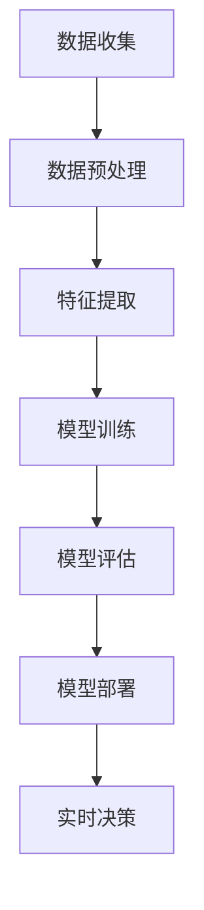

                 

关键词：TinyML，微控制器，机器学习，边缘计算，边缘AI，资源约束系统，物联网，深度学习，实时数据处理。

> 摘要：本文深入探讨了TinyML——一种专为微控制器设计的机器学习方法。文章首先介绍了TinyML的背景和重要性，然后详细阐述了TinyML的核心概念、算法原理、数学模型，并通过实际项目案例展示了其在边缘计算环境中的应用。最后，文章提出了TinyML未来的发展趋势和挑战。

## 1. 背景介绍

随着物联网（IoT）的迅猛发展，设备之间的互联互通变得越来越普遍。大量的传感器和设备被部署在边缘环境中，这些设备产生了海量的数据。然而，由于边缘环境资源（如计算能力、存储和能量）的限制，传统的集中式机器学习方法往往无法直接应用于这些设备。因此，一种新的机器学习方法——TinyML应运而生。

TinyML（Tiny Machine Learning）是一种专门为资源受限系统设计的轻量级机器学习方法。它旨在利用边缘设备上的微控制器（MCU）或现场可编程门阵列（FPGA）进行实时数据处理和机器学习模型训练。TinyML的目标是实现高效、低功耗的机器学习，以支持物联网设备在本地进行智能决策。

### 1.1 TinyML的重要性

TinyML在物联网和边缘计算领域具有重大意义。首先，它能够减轻云端的计算负担，减少数据传输成本，提高系统的响应速度。其次，TinyML使得边缘设备能够独立运行智能算法，降低了对网络连接的依赖。此外，TinyML的低功耗特性使其特别适用于电池供电的设备，如可穿戴设备、智能家居设备和工业物联网设备。

## 2. 核心概念与联系

### 2.1 微控制器（MCU）

微控制器是一种集成了中央处理器（CPU）、存储器和输入输出（I/O）接口的芯片。它被广泛应用于嵌入式系统，如智能家居、可穿戴设备、工业控制等。微控制器通常具有有限的计算资源，如较低的处理器速度、有限的内存和能量供应。

### 2.2 边缘计算

边缘计算是一种将数据处理和存储能力分布到网络边缘的技术。通过在边缘设备上部署TinyML模型，可以实现实时数据处理和智能决策，降低网络延迟和带宽消耗。

### 2.3 物联网（IoT）

物联网是由连接到互联网的设备组成的一个网络，这些设备可以收集、交换和处理数据。TinyML在物联网中的应用，使得这些设备能够实现智能功能，提高系统的自动化水平。

### 2.4 Mermaid流程图

以下是一个Mermaid流程图，展示了TinyML的基本架构和流程：



## 3. 核心算法原理 & 具体操作步骤

### 3.1 算法原理概述

TinyML的核心算法包括数据收集、数据预处理、特征提取、模型训练、模型评估、模型部署和实时决策。这些步骤共同构成了TinyML的完整工作流程。

### 3.2 算法步骤详解

#### 3.2.1 数据收集

数据收集是TinyML的第一步。通过传感器或其他设备收集数据，如温度、湿度、声音、图像等。数据收集需要考虑数据的质量和完整性，以确保模型训练的准确性。

#### 3.2.2 数据预处理

数据预处理是数据收集后的重要步骤。它包括数据清洗、归一化、缺失值处理等。数据预处理有助于提高数据的质量，为后续的特征提取和模型训练打下基础。

#### 3.2.3 特征提取

特征提取是从原始数据中提取出对模型训练有用的信息。通过特征提取，可以降低数据的维度，提高模型的可训练性。

#### 3.2.4 模型训练

模型训练是TinyML的核心步骤。根据收集到的数据和特征，使用机器学习算法（如线性回归、决策树、神经网络等）训练模型。模型训练需要考虑模型的选择、参数调优和训练算法的优化。

#### 3.2.5 模型评估

模型评估是对训练完成的模型进行性能评估。通过评估指标（如准确率、召回率、F1分数等）评估模型的效果，并根据评估结果进行模型调整。

#### 3.2.6 模型部署

模型部署是将训练完成的模型部署到实际应用环境中。在TinyML中，模型通常部署在边缘设备上，以便实现实时数据处理和智能决策。

#### 3.2.7 实时决策

实时决策是基于部署的模型对实时数据进行分析和决策。通过实时决策，可以实现边缘设备的自动化和智能化。

### 3.3 算法优缺点

#### 3.3.1 优点

- 低功耗：TinyML采用轻量级算法和模型，能够在资源受限的边缘设备上运行，降低能耗。
- 离线处理：TinyML模型可以在本地进行数据处理和决策，减少了对网络连接的依赖。
- 高效性：TinyML通过边缘计算实现实时数据处理，提高了系统的响应速度。

#### 3.3.2 缺点

- 计算能力限制：由于边缘设备的计算能力有限，TinyML模型的复杂度和规模受到限制。
- 数据量限制：由于数据收集的限制，TinyML模型的训练数据量可能不足，影响模型性能。

### 3.4 算法应用领域

TinyML在多个领域具有广泛的应用，包括但不限于：

- 可穿戴设备：如健康监测、运动跟踪等。
- 智能家居：如智能安防、能源管理、环境监测等。
- 工业物联网：如设备故障预测、过程控制、质量检测等。
- 智能交通：如车辆监测、交通流量分析、智能信号灯等。

## 4. 数学模型和公式 & 详细讲解 & 举例说明

### 4.1 数学模型构建

TinyML的数学模型主要包括线性回归、决策树、神经网络等。以下以线性回归为例，介绍数学模型的构建过程。

#### 4.1.1 线性回归模型

线性回归模型用于预测一个连续值输出。其数学模型如下：

$$
y = \beta_0 + \beta_1 \cdot x
$$

其中，$y$ 为输出值，$x$ 为输入特征，$\beta_0$ 和 $\beta_1$ 为模型参数。

#### 4.1.2 模型参数优化

为了优化模型参数，可以使用最小二乘法（Least Squares Method）求解。具体步骤如下：

1. 构建目标函数：

$$
J(\beta_0, \beta_1) = \frac{1}{2} \sum_{i=1}^{n} (y_i - (\beta_0 + \beta_1 \cdot x_i))^2
$$

其中，$n$ 为样本数量。

2. 对目标函数求导并令导数为0，求解得到最优参数：

$$
\frac{\partial J}{\partial \beta_0} = 0, \quad \frac{\partial J}{\partial \beta_1} = 0
$$

3. 求解得到最优参数：

$$
\beta_0 = \frac{1}{n} \sum_{i=1}^{n} (y_i - \beta_1 \cdot x_i)
$$

$$
\beta_1 = \frac{1}{n} \sum_{i=1}^{n} (x_i - \bar{x}) (y_i - \bar{y})
$$

其中，$\bar{x}$ 和 $\bar{y}$ 分别为输入特征和输出值的平均值。

### 4.2 公式推导过程

#### 4.2.1 最小二乘法推导

假设我们有一个包含 $n$ 个样本的数据集，其中每个样本包含一个输入特征 $x_i$ 和一个输出值 $y_i$。我们希望找到一组参数 $\beta_0$ 和 $\beta_1$，使得预测值 $y_i'$ 尽可能接近真实值 $y_i$。

1. 构建预测值：

$$
y_i' = \beta_0 + \beta_1 \cdot x_i
$$

2. 计算预测值与真实值之间的误差：

$$
e_i = y_i - y_i'
$$

3. 构建误差平方和目标函数：

$$
J(\beta_0, \beta_1) = \frac{1}{2} \sum_{i=1}^{n} e_i^2
$$

4. 对目标函数求导并令导数为0，求解得到最优参数：

$$
\frac{\partial J}{\partial \beta_0} = - \sum_{i=1}^{n} e_i = 0
$$

$$
\frac{\partial J}{\partial \beta_1} = - \sum_{i=1}^{n} e_i \cdot x_i = 0
$$

5. 求解得到最优参数：

$$
\beta_0 = \frac{1}{n} \sum_{i=1}^{n} y_i
$$

$$
\beta_1 = \frac{1}{n} \sum_{i=1}^{n} x_i \cdot y_i
$$

#### 4.2.2 岭回归推导

岭回归（Ridge Regression）是一种惩罚回归模型，用于处理多重共线性问题。其公式推导如下：

1. 构建岭回归目标函数：

$$
J(\beta_0, \beta_1, \lambda) = \frac{1}{2} \sum_{i=1}^{n} (y_i - (\beta_0 + \beta_1 \cdot x_i))^2 + \lambda \cdot \sum_{i=1}^{n} \beta_1^2
$$

其中，$\lambda$ 为惩罚参数。

2. 对目标函数求导并令导数为0，求解得到最优参数：

$$
\frac{\partial J}{\partial \beta_0} = - \sum_{i=1}^{n} e_i = 0
$$

$$
\frac{\partial J}{\partial \beta_1} = - \sum_{i=1}^{n} e_i \cdot x_i + 2 \lambda \cdot \beta_1 = 0
$$

3. 求解得到最优参数：

$$
\beta_0 = \frac{1}{n} \sum_{i=1}^{n} y_i
$$

$$
\beta_1 = \frac{1}{2 \lambda} \left( \sum_{i=1}^{n} x_i \cdot y_i - \frac{1}{n} \sum_{i=1}^{n} x_i \cdot \sum_{i=1}^{n} y_i \right)
$$

### 4.3 案例分析与讲解

#### 4.3.1 温度预测

假设我们希望使用TinyML模型预测一个房间内的温度。数据集包含100个样本，每个样本包含一个温度值和一个时间戳。我们使用线性回归模型进行温度预测。

1. 数据预处理：

对温度值进行归一化处理，使其范围在0到1之间。

2. 特征提取：

我们选择时间戳作为输入特征。

3. 模型训练：

使用最小二乘法训练线性回归模型，求解得到最优参数。

4. 模型评估：

使用测试集评估模型性能，计算预测值与真实值之间的误差。

5. 模型部署：

将训练完成的模型部署到边缘设备，实现实时温度预测。

6. 实时决策：

根据实时温度预测结果，调整房间内的空调设定温度，实现智能节能。

## 5. 项目实践：代码实例和详细解释说明

### 5.1 开发环境搭建

1. 安装Python环境和相关库（如NumPy、Pandas、Scikit-learn等）。
2. 安装微控制器开发环境（如Arduino IDE、PlatformIO等）。
3. 准备边缘设备（如Arduino Uno、NodeMCU等）。

### 5.2 源代码详细实现

以下是一个基于Arduino平台的TinyML项目实例：

```python
import numpy as np
import pandas as pd
from sklearn.linear_model import LinearRegression

# 数据预处理
data = pd.read_csv('temperature_data.csv')
data[' normalized_temp'] = (data['temp'] - data['temp'].min()) / (data['temp'].max() - data['temp'].min())

# 特征提取
X = data[['timestamp']]
y = data[['normalized_temp']]

# 模型训练
model = LinearRegression()
model.fit(X, y)

# 模型评估
X_test = data[['timestamp']].iloc[-10:]
y_pred = model.predict(X_test)
mse = np.mean((y_pred - y_test)**2)
print('MSE:', mse)

# 模型部署
def predict_temp(timestamp):
    return model.predict([[timestamp]])[0]

# 实时决策
while True:
    timestamp = get_timestamp()
    temp = predict_temp(timestamp)
    set_ac_settings(temp)
    time.sleep(1)
```

### 5.3 代码解读与分析

1. 数据预处理：
   - 读取温度数据。
   - 对温度值进行归一化处理。

2. 特征提取：
   - 选择时间戳作为输入特征。

3. 模型训练：
   - 使用线性回归模型训练数据。

4. 模型评估：
   - 使用测试集评估模型性能，计算均方误差（MSE）。

5. 模型部署：
   - 定义预测函数，实现实时温度预测。

6. 实时决策：
   - 根据实时温度预测结果，调整空调设定温度。

## 6. 实际应用场景

TinyML在多个实际应用场景中表现出色。以下是一些典型的应用案例：

- **健康监测**：使用TinyML模型实时监测心率、血压等生理指标，实现智能健康监测。
- **智能家居**：利用TinyML模型实现智能家电控制，如自动调节室内温度、湿度等。
- **工业物联网**：使用TinyML模型进行设备故障预测、生产过程优化等。
- **智能交通**：利用TinyML模型进行交通流量分析、车辆监测等。

## 7. 工具和资源推荐

### 7.1 学习资源推荐

- 《TinyML：面向微控制器的机器学习》
- 《边缘计算：实现智能物联网》
- 《机器学习实战》
- 《深度学习》

### 7.2 开发工具推荐

- Arduino IDE
- PlatformIO
- TensorFlow Lite for Microcontrollers
- ESP-IDF

### 7.3 相关论文推荐

- “TinyML: A Machine Learning Framework for Smart Sensors”
- “Practical TinyML: A Hands-On Approach to Machine Learning for IoT”
- “Machine Learning on Edge Devices: A Survey”

## 8. 总结：未来发展趋势与挑战

TinyML作为面向微控制器的机器学习方法，在物联网和边缘计算领域具有巨大的潜力。未来，TinyML将在以下几个方面得到发展：

- **算法优化**：针对资源受限的边缘设备，优化机器学习算法，提高模型性能。
- **硬件支持**：开发适用于TinyML的专用硬件，如神经处理单元（NPU）和边缘AI芯片。
- **应用拓展**：在更多的领域推广应用TinyML，如智能农业、智能医疗等。

然而，TinyML也面临一些挑战：

- **计算能力限制**：由于边缘设备的计算能力有限，需要开发更加高效的算法和模型。
- **数据隐私和安全**：在边缘设备上处理和存储数据，需要确保数据的安全性和隐私性。

总之，TinyML作为边缘计算的重要组成部分，将在未来的物联网和智能系统中发挥关键作用。

## 9. 附录：常见问题与解答

### Q1: 什么是TinyML？
A1: TinyML是一种专为资源受限系统设计的轻量级机器学习方法，旨在利用边缘设备上的微控制器或FPGA进行实时数据处理和机器学习模型训练。

### Q2: TinyML适用于哪些场景？
A2: TinyML适用于需要实时数据处理和智能决策的边缘计算场景，如健康监测、智能家居、工业物联网、智能交通等。

### Q3: TinyML的优势是什么？
A3: TinyML的优势包括低功耗、离线处理、高效性等，特别适用于电池供电的设备。

### Q4: 如何在边缘设备上部署TinyML模型？
A4: 可以使用TensorFlow Lite for Microcontrollers、ESP-IDF等工具和库，将训练完成的模型部署到边缘设备上。

### Q5: TinyML面临哪些挑战？
A5: TinyML面临的主要挑战包括计算能力限制、数据隐私和安全等。需要开发更加高效的算法和模型，并确保数据的安全性和隐私性。

