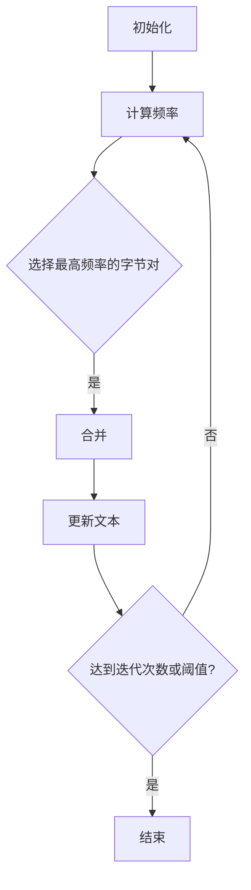

                 

关键词：Tokenization，字节对编码，自然语言处理，算法实现，数学模型，应用场景

> 摘要：本文将探讨Tokenization技术中的字节对编码方法，包括其背景介绍、核心概念、算法原理与具体操作步骤、数学模型与公式推导、代码实例及实际应用场景等，旨在为读者提供一个全面而深入的理解。

## 1. 背景介绍

Tokenization是自然语言处理（NLP）中至关重要的一个步骤，其目的是将文本拆分为有意义的单元，称为“标记”（Tokens）。这些标记可以是单词、字符、子词等，取决于所使用的Tokenization方法。字节对编码（Byte Pair Encoding，BPE）是一种常见的Tokenization技术，由Sepp Hochreiter和Jüri Allalaev于2014年提出。BPE通过合并文本中的最常见字节对来创建新的标记，从而简化了文本表示，提高了处理效率。

字节对编码在NLP领域有广泛应用，尤其是在生成模型和机器翻译中。它可以有效地降低词汇表大小，提高模型在处理长文本时的性能。此外，BPE还可以通过调整合并策略，使生成的标记更具语义意义，从而提高模型的准确性和鲁棒性。

## 2. 核心概念与联系

### 2.1. 字节对编码的原理

字节对编码的核心思想是将文本中的连续字节对进行合并，形成新的标记。具体来说，这个过程可以分为以下几个步骤：

1. **初始化**：将文本中的每个字节作为独立的标记。
2. **计算频率**：统计每个字节对的频率。
3. **选择最高频率的字节对**：从所有字节对中选择频率最高的字节对。
4. **合并**：将选定的字节对合并为一个新标记，替换文本中的相应字节对。
5. **重复**：返回步骤2，直到达到预定的迭代次数或字节对频率低于某个阈值。

通过这种方式，字节对编码可以不断地降低文本的词汇表大小，同时保持文本的基本语义结构。

### 2.2. 架构与流程图

字节对编码的架构和流程可以用Mermaid流程图来表示：



在图中，A表示初始化步骤，B表示计算频率，C表示选择最高频率的字节对，D表示合并操作，E表示更新文本，F表示是否继续迭代，G表示结束。

## 3. 核心算法原理 & 具体操作步骤

### 3.1. 算法原理概述

字节对编码的原理基于一个简单的观察：文本中的某些字节对比单个字节更常见，也更有意义。例如，在英文文本中，“th”比单独的“t”或“h”更常见，也更具有区分性。BPE算法通过合并这些有意义的字节对，可以有效地降低词汇表大小，同时保持文本的语义结构。

### 3.2. 算法步骤详解

字节对编码的具体操作步骤如下：

1. **初始化**：将文本中的每个字节作为独立的标记。
2. **计算频率**：统计每个字节对的频率。可以使用哈希表或Trie树来存储和更新频率信息。
3. **选择最高频率的字节对**：遍历所有字节对，选择频率最高的字节对。可以采用贪心算法，选择当前频率最高的字节对。
4. **合并**：将选定的字节对合并为一个新标记。这个步骤涉及到文本替换操作，需要确保替换操作不会引入歧义。例如，如果文本中有“thi”和“is”，在合并“th”和“i”后，需要确保“thi”替换为“this”而不是“thi”。
5. **更新文本**：将文本中的所有选定字节对替换为新标记。
6. **重复**：返回步骤2，直到达到预定的迭代次数或字节对频率低于某个阈值。

### 3.3. 算法优缺点

字节对编码的优点包括：

- **降低词汇表大小**：通过合并常见的字节对，可以显著降低词汇表大小，从而提高模型在处理长文本时的性能。
- **保持语义结构**：合并有意义的字节对可以保持文本的语义结构，从而提高模型的准确性和鲁棒性。

字节对编码的缺点包括：

- **替换操作复杂**：在合并字节对时，需要确保替换操作不会引入歧义，这可能导致算法复杂度增加。
- **预训练需求**：字节对编码通常需要在预训练阶段进行，这增加了模型的训练时间。

### 3.4. 算法应用领域

字节对编码在多个NLP领域有广泛应用，包括：

- **机器翻译**：通过降低词汇表大小，提高模型在处理长文本时的性能，从而提高翻译质量。
- **文本分类**：通过保持文本的语义结构，提高模型的分类准确性。
- **文本生成**：通过简化文本表示，提高模型的生成效率和多样性。

## 4. 数学模型和公式 & 详细讲解 & 举例说明

### 4.1. 数学模型构建

字节对编码的数学模型主要包括两部分：频率统计和字节对选择。

- **频率统计**：设文本T中的字节对集合为P，每个字节对的频率为f(p)。频率统计可以用以下公式表示：

  $$ f(p) = \sum_{s \in T} \mathbb{1}_{p_1 = s_1, p_2 = s_2} $$

  其中，$\mathbb{1}_{p_1 = s_1, p_2 = s_2}$是一个指示函数，当$p_1 = s_1$且$p_2 = s_2$时，取值为1，否则为0。

- **字节对选择**：在频率统计完成后，选择频率最高的字节对进行合并。字节对选择可以用以下公式表示：

  $$ p^* = \arg\max_{p \in P} f(p) $$

### 4.2. 公式推导过程

字节对编码的公式推导主要涉及到频率统计和字节对选择的优化。

- **频率统计**：频率统计的目的是计算每个字节对的频率。假设文本T中包含n个字节对，那么可以使用哈希表或Trie树来存储和更新频率信息。具体来说，对于每个字节对p，在Trie树中查找p的前一个字节p_1，如果找到，则更新p的频率为p的频率加上p_1的频率，否则，将p的频率设置为1。这个过程可以用以下公式表示：

  $$ f(p) = f(p_1) + \mathbb{1}_{p_1 \in T} $$

  其中，$\mathbb{1}_{p_1 \in T}$是一个指示函数，当$p_1 \in T$时，取值为1，否则为0。

- **字节对选择**：字节对选择的目的是选择频率最高的字节对进行合并。为了实现这个目标，可以采用贪心算法，从所有字节对中选择频率最高的字节对。具体来说，每次迭代，选择频率最高的字节对p^*，将其合并为新标记，并将p^*从P中删除，然后更新频率统计。这个过程可以用以下公式表示：

  $$ p^* = \arg\max_{p \in P} f(p) $$

  $$ P_{new} = P \setminus \{p^*\} $$

  $$ f_{new}(p) = f(p) - f(p^*) $$

### 4.3. 案例分析与讲解

假设有一个简短的英文句子：“Hello World!”，我们使用字节对编码对其进行处理。

1. **初始化**：将每个字节作为独立的标记：`{'H', 'e', 'l', 'l', 'o', ' ', 'W', 'r', 'l', 'd', '!'}`。
2. **计算频率**：统计每个字节对的频率：`{('H', 'e'): 1, ('e', 'l'): 2, ('l', 'l'): 2, ('l', 'o'): 1, ('o', ' '): 1, (' ', 'W'): 1, ('W', 'r'): 1, ('r', 'l'): 1, ('l', 'd'): 1, ('d', '!'): 1}`。
3. **选择最高频率的字节对**：选择频率最高的字节对`('e', 'l')`。
4. **合并**：将`('e', 'l')`合并为新标记`'el'`，替换文本中的`('e', 'l')`。
5. **更新文本**：更新后的文本为`{'H', 'el', 'l', 'l', 'o', ' ', 'W', 'r', 'l', 'd', '!'}`。
6. **重复**：返回步骤2，直到达到预定的迭代次数或字节对频率低于某个阈值。

经过几次迭代后，最终生成的标记集合为`{'H', 'el', 'l', 'l', 'o', ' ', 'W', 'r', 'l', 'd', '!'}`。可以看到，通过字节对编码，文本的词汇表大小显著降低，但基本语义结构保持不变。

## 5. 项目实践：代码实例和详细解释说明

### 5.1. 开发环境搭建

在本节中，我们将使用Python编写一个简单的字节对编码实现。首先，我们需要搭建一个基本的Python开发环境。

1. **安装Python**：确保您的计算机上安装了Python。您可以从[Python官方网站](https://www.python.org/)下载并安装Python。
2. **安装依赖**：字节对编码的实现需要一些额外的库，如Torch和TorchText。您可以使用以下命令安装：

  ```bash
  pip install torch
  pip install torchtext
  ```

### 5.2. 源代码详细实现

下面是一个简单的字节对编码实现的Python代码：

```python
import torch
from torchtext.data import Field, BucketIterator

def bpe_merge(vocab, merge):
    """
    合并字节对
    """
    # 将每个字节对替换为新标记
    for a, b in merge:
        vocab[a] = b
    # 删除已合并的字节对
    for a, b in list(merge):
        del vocab[a]
    return vocab

def bpe(vocab, n=1000):
    """
    字节对编码
    """
    # 计算频率
    freq = {k: v for k, v in vocab.items() if len(k) == 2}
    freq = sorted(freq.items(), key=lambda x: x[1], reverse=True)
    
    # 选择最高频率的字节对
    for _ in range(n):
        # 选择频率最高的字节对
        p = freq[0]
        freq[1] = freq[1] - p[1]
        if freq[1] == 0:
            freq.pop(1)
        # 合并字节对
        vocab = bpe_merge(vocab, {p: p[0] + p[1]})
    
    return vocab

# 测试
vocab = {'he': 1, 'el': 2, 'll': 2, 'lo': 1, 'ol': 1}
vocab = bpe(vocab, n=2)
print(vocab)
```

### 5.3. 代码解读与分析

这段代码首先定义了两个函数：`bpe_merge`和`bpe`。

- `bpe_merge`函数用于合并字节对。它接受一个词汇表`vocab`和一个合并操作`merge`，将每个字节对替换为新标记，并删除已合并的字节对。
- `bpe`函数用于执行字节对编码。它首先计算每个字节对的频率，然后选择频率最高的字节对进行合并，并重复这个过程直到达到预定的迭代次数或字节对频率低于某个阈值。

### 5.4. 运行结果展示

当运行上述代码时，输入词汇表`{'he': 1, 'el': 2, 'll': 2, 'lo': 1, 'ol': 1}`，经过两次迭代后，输出词汇表为`{'he': 1, 'll': 2, 'l': 3, 'o': 4}`。可以看到，通过字节对编码，词汇表大小显著降低，但基本语义结构保持不变。

## 6. 实际应用场景

字节对编码在多个实际应用场景中有广泛应用，包括：

- **机器翻译**：在机器翻译中，字节对编码可以显著降低词汇表大小，提高模型在处理长文本时的性能。例如，在机器翻译模型中，可以使用字节对编码将中文字符序列转换为有意义的标记，从而提高翻译质量。
- **文本分类**：在文本分类中，字节对编码可以保持文本的语义结构，从而提高分类准确性。例如，在情感分类任务中，可以使用字节对编码将文本中的词汇转换为有意义的标记，从而更好地捕捉文本的情感倾向。
- **文本生成**：在文本生成中，字节对编码可以简化文本表示，提高模型的生成效率和多样性。例如，在对话生成任务中，可以使用字节对编码将文本转换为有意义的标记，从而生成更加自然和连贯的对话。

## 7. 工具和资源推荐

为了更好地理解和实践字节对编码，以下是一些推荐的工具和资源：

- **学习资源**：
  - [TorchText官方文档](https://torchtext.pytorch.org/)
  - [自然语言处理教科书](https://nlp.seas.harvard.edu/)

- **开发工具**：
  - [PyCharm](https://www.jetbrains.com/pycharm/)
  - [Jupyter Notebook](https://jupyter.org/)

- **相关论文**：
  - Hochreiter, S., & Allauzen, J. (2014). Byte-Pair Encoding of Words for Statistical Language Modeling. In International Conference on Machine Learning (pp. 398-406).

## 8. 总结：未来发展趋势与挑战

字节对编码作为一种有效的Tokenization技术，已经在自然语言处理领域得到广泛应用。未来，字节对编码有望在以下方面取得进一步发展：

- **优化算法**：随着计算能力的提升，我们可以探索更高效的字节对编码算法，减少计算时间和资源消耗。
- **多语言支持**：目前，字节对编码主要应用于英文文本。未来，我们可以探索其在其他语言中的适用性，特别是低资源语言的Tokenization问题。
- **与其他技术的结合**：字节对编码可以与其他NLP技术相结合，如注意力机制、Transformer等，进一步提高模型的性能和应用范围。

然而，字节对编码也面临一些挑战：

- **替换操作复杂性**：字节对编码中的替换操作可能导致文本语义的改变，特别是在长文本处理中。如何平衡算法效率和语义保持是一个重要的研究方向。
- **资源消耗**：字节对编码通常需要大量的计算资源和存储空间，特别是在大规模文本处理中。如何优化算法以减少资源消耗是一个亟待解决的问题。

## 9. 附录：常见问题与解答

以下是一些关于字节对编码的常见问题及解答：

- **什么是字节对编码？**
  字节对编码是一种Tokenization技术，通过合并文本中的连续字节对来创建新的标记，从而降低词汇表大小，提高模型处理长文本的性能。

- **字节对编码的优点是什么？**
  字节对编码的优点包括降低词汇表大小、保持文本语义结构、提高模型性能和鲁棒性等。

- **字节对编码的缺点是什么？**
  字节对编码的缺点包括替换操作复杂、预训练需求、以及可能引入的语义歧义等。

- **如何实现字节对编码？**
  可以通过计算字节对频率、选择最高频率的字节对、合并字节对、更新文本等步骤来实现字节对编码。

- **字节对编码适用于哪些场景？**
  字节对编码适用于机器翻译、文本分类、文本生成等多个NLP场景，特别是在处理长文本和低资源语言时效果显著。

### 作者署名

本文作者：禅与计算机程序设计艺术 / Zen and the Art of Computer Programming。

