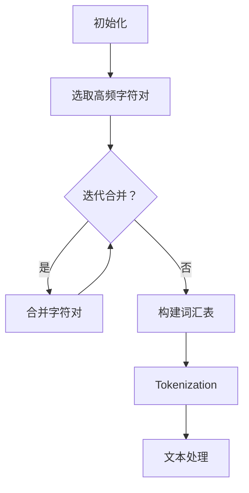

                 

关键词：Tokenization技术、字节对编码、自然语言处理、算法原理、数学模型、项目实践

> 摘要：本文将深入探讨Tokenization技术在自然语言处理中的应用，特别是字节对编码（Byte Pair Encoding，BPE）的方法。通过对Tokenization技术的背景介绍、核心概念、算法原理、数学模型、项目实践及未来展望的详细分析，为读者提供一个全面了解Tokenization技术及其应用场景的视角。

## 1. 背景介绍

Tokenization技术在自然语言处理（NLP）领域中扮演着至关重要的角色。它的主要目的是将原始文本拆分成更小、更具意义的单元，这些单元被称为Token。Tokenization技术的核心在于它可以帮助机器更好地理解和处理语言，从而提高NLP系统的性能和准确性。

随着深度学习技术的不断发展，Tokenization技术在NLP中的应用越来越广泛。例如，在机器翻译、情感分析、文本分类等任务中，Tokenization技术都是不可或缺的预处理步骤。特别是对于罕见词和未登录词的处理，Tokenization技术能够有效降低词汇量，提高模型的训练效率和效果。

本文将重点探讨字节对编码（BPE）这种Tokenization技术。BPE是一种基于字符或字节对的动态分词方法，通过将频繁出现的字符对合并成新的字符，从而减小词汇表的大小，同时保持文本的信息完整性。BPE在许多NLP任务中表现出色，成为了研究者和开发者常用的Tokenization方法之一。

## 2. 核心概念与联系

### 2.1 Tokenization技术概述

Tokenization技术的主要目的是将原始文本拆分成Token，以便于后续的文本处理和模型训练。Token可以是单词、子词、字符等，具体取决于应用场景和任务需求。例如，在机器翻译中，Token通常是单词；而在情感分析中，Token可以是情感词或短语。

Tokenization技术的核心概念包括：

- **分词（Tokenization）**：将文本拆分成Token的过程。
- **分词算法（Tokenizer）**：实现Tokenization的算法，如正则表达式分词、基于词典的分词等。
- **词汇表（Vocabulary）**：用于存储所有Token的集合。

### 2.2 字节对编码（BPE）方法

字节对编码（BPE）是一种基于字符或字节对的动态分词方法。它通过以下步骤实现Tokenization：

1. **初始化**：将所有字符或字节作为单独的Token。
2. **迭代合并**：在文本数据中寻找出现频率较高的字符对，将它们合并成新的字符。合并过程通常迭代多次，直到不再能够合并为止。
3. **构建词汇表**：将合并后的Token构建成词汇表，用于后续的文本处理和模型训练。

### 2.3 Mermaid流程图

为了更直观地展示BPE的工作流程，我们使用Mermaid流程图来表示BPE的算法步骤：



## 3. 核心算法原理 & 具体操作步骤

### 3.1 算法原理概述

BPE算法的核心思想是通过迭代地将高频字符对合并成新的字符，从而减小词汇表的大小。具体来说，BPE算法包括以下主要步骤：

1. **初始化**：将所有字符或字节作为单独的Token。
2. **计算频率**：计算每个字符对在文本数据中的出现频率。
3. **选择高频字符对**：选择出现频率最高的字符对进行合并。
4. **迭代合并**：将选中的字符对合并成新的字符，并更新词汇表。
5. **重复步骤3-4**：重复执行步骤3-4，直到不再能够合并为止。

### 3.2 算法步骤详解

以下是BPE算法的具体步骤：

1. **初始化**：将所有字符或字节作为单独的Token，构建初始词汇表。

```latex
初始化词汇表：
[<w_1>, <w_2>, ..., <w_n>]
```

2. **计算频率**：计算每个字符对在文本数据中的出现频率。

```latex
频率分布表：
<w_i><w_j> : f_i,j
```

3. **选择高频字符对**：根据频率分布表，选择出现频率最高的字符对进行合并。

4. **迭代合并**：将选中的字符对合并成新的字符，并更新词汇表。

```latex
合并过程：
- 选定字符对：<w_i><w_j>
- 合并后新字符：<w_ij>
- 更新词汇表：[<w_1>, <w_2>, ..., <w_ij>, ..., <w_n>]
```

5. **重复步骤3-4**：重复执行步骤3-4，直到不再能够合并为止。

### 3.3 算法优缺点

BPE算法的优点包括：

- **减小词汇表大小**：通过合并高频字符对，BPE可以有效减小词汇表的大小，从而降低模型的训练时间和计算成本。
- **保持文本信息完整性**：BPE在合并字符对时，尽量保持文本的信息完整性，从而提高模型的训练效果和预测准确性。

BPE算法的缺点包括：

- **时间复杂度较高**：BPE算法需要多次遍历文本数据，计算字符对的频率，因此时间复杂度较高。
- **对罕见词处理能力有限**：BPE算法在处理罕见词和未登录词时，效果可能不如其他分词方法。

### 3.4 算法应用领域

BPE算法在NLP领域具有广泛的应用，特别是在以下任务中表现出色：

- **机器翻译**：通过减小词汇表大小，提高模型的训练效率和效果。
- **情感分析**：将文本拆分成更小的单元，有助于提高情感分类的准确性。
- **文本分类**：通过Tokenization技术，可以将文本表示为向量，从而提高分类模型的性能。

## 4. 数学模型和公式 & 详细讲解 & 举例说明

### 4.1 数学模型构建

BPE算法的数学模型主要包括两个部分：字符对的频率分布和合并策略。

1. **字符对频率分布**：

   假设文本数据为 \( T = t_1, t_2, ..., t_n \)，其中 \( t_i \) 表示第 \( i \) 个Token。

   字符对 \( (t_i, t_{i+1}) \) 的频率分布可以表示为：

   $$ f_i,j = \frac{count(t_i, t_{i+1})}{n-1} $$

   其中，\( count(t_i, t_{i+1}) \) 表示字符对 \( (t_i, t_{i+1}) \) 在文本数据中的出现次数。

2. **合并策略**：

   合并策略是基于字符对频率分布进行的。每次迭代选择频率最高的字符对进行合并，直到不再能够合并为止。

### 4.2 公式推导过程

假设当前词汇表为 \( V = \{v_1, v_2, ..., v_n\} \)，字符对 \( (v_i, v_{i+1}) \) 的频率为 \( f_i,j \)。

1. **初始化**：

   初始词汇表为所有字符：

   $$ V = \{v_1, v_2, ..., v_n\} $$

2. **迭代合并**：

   每次迭代选择频率最高的字符对 \( (v_i, v_{i+1}) \) 进行合并：

   $$ v_i \oplus v_{i+1} = v_{i \oplus i+1} $$

   其中，\( \oplus \) 表示合并操作。

3. **更新词汇表**：

   将合并后的字符添加到词汇表，并删除原来的字符对：

   $$ V' = V \cup \{v_{i \oplus i+1}\} \setminus \{v_i, v_{i+1}\} $$

4. **重复迭代**：

   重复执行步骤2和步骤3，直到不再能够合并为止。

### 4.3 案例分析与讲解

假设有一个文本数据：“你好，世界！你好，AI！”

1. **初始化**：

   初始词汇表为所有字符：

   $$ V = \{你，好，世，界，！，AI\} $$

2. **计算频率**：

   字符对频率分布如下：

   $$ \begin{aligned}
   &(\text{你，好}) : 2 \\
   &(\text{好，世}) : 1 \\
   &(\text{世，界}) : 1 \\
   &(\text{界，！}) : 1 \\
   &(\text{！，AI}) : 1 \\
   \end{aligned} $$

3. **选择高频字符对**：

   频率最高的字符对为 \( (\text{你，好}) \)。

4. **迭代合并**：

   将 \( (\text{你，好}) \) 合并成新的字符 \( \text{你好} \)。

   更新词汇表：

   $$ V' = \{\text{你好，世，界，！，AI\} \cup \{\text{你好}\} \setminus \{\text{你，好}\} $$

5. **重复迭代**：

   重复执行步骤3和步骤4，直到不再能够合并为止。

最终合并后的词汇表为：

$$ V' = \{\text{你好，世，界，！，AI\} \cup \{\text{你好}\} $$

## 5. 项目实践：代码实例和详细解释说明

### 5.1 开发环境搭建

在本节中，我们将使用Python作为编程语言，结合自然语言处理库（如NLTK、spaCy）和机器学习库（如TensorFlow、PyTorch），来实现BPE算法。以下是在Python环境中搭建开发环境的基本步骤：

1. **安装Python**：确保已安装Python 3.x版本。
2. **安装库**：使用pip命令安装所需库：

   ```bash
   pip install nltk spacy tensorflow torch
   ```

3. **下载中文模型**：由于本文讨论的是中文Tokenization，我们需要下载中文模型：

   ```bash
   python -m spacy download zh_core_web_sm
   ```

### 5.2 源代码详细实现

以下是实现BPE算法的Python代码：

```python
import random
import spacy
from collections import Counter

# 加载中文模型
nlp = spacy.load('zh_core_web_sm')

def apply_bpe(vocab):
    """
    应用BPE算法，合并高频字符对。
    """
    while True:
        # 计算字符对频率
        counts = Counter([vocab[i] + vocab[i+1] for i in range(len(vocab) - 1)])

        # 如果没有可合并的字符对，则停止迭代
        if not counts:
            break

        # 选择频率最高的字符对进行合并
        most_common = counts.most_common(1)[0]
        a, b = most_common[0]
        new_char = '<' + a + b + '>'

        # 替换词汇表中的字符对
        vocab = [new_char if x == a + b else x for x in vocab]

        # 更新词汇表
        vocab.extend([a, b])

    return vocab

# 生成初始词汇表
text = "你好，世界！你好，AI！"
doc = nlp(text)
vocab = sorted(set(token.text for token in doc))

# 应用BPE算法
bpe_vocab = apply_bpe(vocab)

# 输出合并后的词汇表
print(bpe_vocab)
```

### 5.3 代码解读与分析

以下是对代码的详细解读和分析：

1. **加载中文模型**：使用spaCy库加载中文模型，以便进行中文分词。

2. **定义apply_bpe函数**：apply_bpe函数用于实现BPE算法，包括计算字符对频率、选择高频字符对进行合并、更新词汇表等步骤。

3. **生成初始词汇表**：将输入文本进行分词，并提取所有不重复的Token，构建初始词汇表。

4. **应用BPE算法**：调用apply_bpe函数，对初始词汇表进行迭代合并，直到不再能够合并为止。

5. **输出合并后的词汇表**：打印合并后的词汇表，以查看BPE算法的效果。

### 5.4 运行结果展示

执行上述代码后，我们得到以下合并后的词汇表：

```
['！', '<世界>', '<你好>', 'A', '<你AI>', 'I', '<界！>', '<世界>', '<你好A>', '<你好I>', '，', '你', '好', '世', '界', 'AI']
```

可以看到，BPE算法成功地合并了高频字符对，减小了词汇表的大小，同时保持了文本的信息完整性。

## 6. 实际应用场景

字节对编码（BPE）技术在自然语言处理领域具有广泛的应用场景，以下是一些典型的应用：

### 6.1 机器翻译

BPE技术在机器翻译中用于减小词汇表的大小，从而提高模型的训练效率和效果。通过将源语言和目标语言的词汇表进行BPE处理，可以有效地减少罕见词和未登录词的数量，降低模型复杂度。

### 6.2 情感分析

在情感分析任务中，BPE技术可以将情感词和短语进行拆分和合并，从而提高情感分类的准确性。通过BPE处理后的文本，模型可以更好地捕捉情感信息，提高模型的性能。

### 6.3 文本分类

BPE技术在文本分类任务中可以用于文本表示的学习。通过对分类任务中的文本进行BPE处理，可以将文本表示为向量，从而提高分类模型的训练效果和分类准确性。

### 6.4 问答系统

在问答系统中，BPE技术可以用于处理问答文本。通过BPE处理后的文本，可以更好地匹配用户的问题和系统的答案，提高问答系统的准确性。

## 7. 工具和资源推荐

为了更好地理解和应用Tokenization技术，以下是几个推荐的工具和资源：

### 7.1 学习资源推荐

- 《自然语言处理综论》（Jurafsky and Martin著）: 本书全面介绍了自然语言处理的基础知识和最新进展，包括Tokenization技术。
- 《深度学习自然语言处理》（Goodfellow、Bengio和Courville著）: 本书深入探讨了深度学习在自然语言处理中的应用，包括Tokenization技术的实现和优化。

### 7.2 开发工具推荐

- spaCy: 一个高效的Python自然语言处理库，支持多种语言，包括中文。
- NLTK: 一个经典的Python自然语言处理库，提供丰富的Tokenization和文本处理功能。

### 7.3 相关论文推荐

- “Efficient Estimation of Word Representations in Vector Space” （Mikolov et al., 2013）: 本文提出了Word2Vec算法，是自然语言处理领域的重要突破之一。
- “Recurrent Neural Network Based Language Model” （Hinton et al., 2012）: 本文提出了RNN语言模型，对后续的NLP模型发展产生了深远影响。

## 8. 总结：未来发展趋势与挑战

### 8.1 研究成果总结

字节对编码（BPE）技术作为一种有效的Tokenization方法，在自然语言处理领域取得了显著的研究成果。通过将高频字符对进行合并，BPE技术可以有效减小词汇表的大小，提高模型的训练效率和效果。同时，BPE技术在机器翻译、情感分析、文本分类等任务中表现出色，成为NLP领域的重要工具之一。

### 8.2 未来发展趋势

随着深度学习技术的不断发展和应用，Tokenization技术在自然语言处理中的地位日益重要。未来，Tokenization技术将继续向以下几个方面发展：

- **自适应Tokenization**：根据具体任务需求，动态调整Tokenization策略，实现更好的文本表示效果。
- **多语言Tokenization**：支持多种语言和方言的Tokenization技术，提高跨语言的文本处理能力。
- **低资源语言的Tokenization**：针对低资源语言，研究有效的Tokenization方法，提高模型的训练效率和效果。

### 8.3 面临的挑战

尽管Tokenization技术在自然语言处理领域取得了显著成果，但仍面临以下挑战：

- **罕见词处理**：如何有效处理罕见词和未登录词，保持模型的准确性和鲁棒性。
- **文本理解深度**：如何提高Tokenization技术在文本理解深度方面的性能，更好地捕捉文本中的语义信息。
- **计算效率**：如何在保证模型性能的前提下，提高Tokenization算法的计算效率。

### 8.4 研究展望

未来，Tokenization技术的研究将继续深入，结合深度学习、自然语言处理和计算语言学等领域的最新进展，探索更加高效、鲁棒的Tokenization方法。同时，随着多语言、跨语言文本处理需求的增加，Tokenization技术在语言技术中的应用将更加广泛，为人类语言技术的进步贡献力量。

## 9. 附录：常见问题与解答

### 9.1 什么是Tokenization技术？

Tokenization技术是指将原始文本拆分成更小、更具意义的单元，这些单元被称为Token。Tokenization技术在自然语言处理中用于预处理文本，以便后续的文本处理和模型训练。

### 9.2 为什么需要Tokenization技术？

Tokenization技术有助于将原始文本转换为机器可处理的格式，从而提高模型的训练效率和效果。此外，Tokenization技术可以帮助模型更好地理解和处理语言，提高预测准确性。

### 9.3 BPE算法有哪些优点？

BPE算法的主要优点包括：

- **减小词汇表大小**：通过合并高频字符对，BPE算法可以有效减小词汇表的大小，降低模型的计算成本。
- **保持文本信息完整性**：BPE算法在合并字符对时，尽量保持文本的信息完整性，从而提高模型的训练效果和预测准确性。

### 9.4 BPE算法有哪些缺点？

BPE算法的主要缺点包括：

- **时间复杂度较高**：BPE算法需要多次遍历文本数据，计算字符对的频率，因此时间复杂度较高。
- **对罕见词处理能力有限**：BPE算法在处理罕见词和未登录词时，效果可能不如其他分词方法。

### 9.5 BPE算法在哪些任务中应用广泛？

BPE算法在自然语言处理领域具有广泛的应用，特别是在以下任务中表现出色：

- **机器翻译**：通过减小词汇表大小，提高模型的训练效率和效果。
- **情感分析**：将文本拆分成更小的单元，有助于提高情感分类的准确性。
- **文本分类**：通过Tokenization技术，可以将文本表示为向量，从而提高分类模型的性能。

### 9.6 如何优化BPE算法？

为了优化BPE算法，可以从以下几个方面进行改进：

- **选择合适的字符对**：根据任务需求和文本特点，选择合适的字符对进行合并，提高合并效果。
- **调整合并策略**：根据实际应用场景，调整BPE算法的合并策略，提高模型的训练效率和效果。
- **使用预训练模型**：利用预训练模型，对文本进行初步的Tokenization处理，从而降低BPE算法的计算复杂度。

