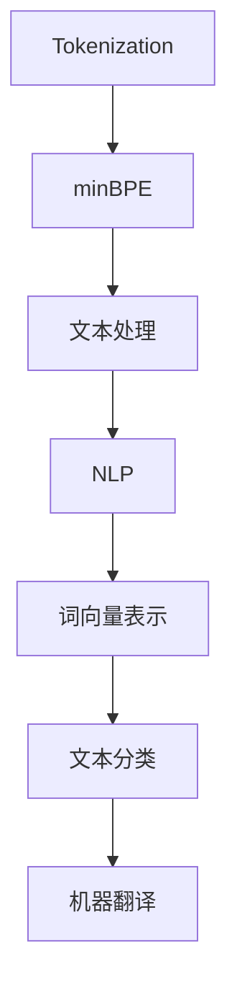
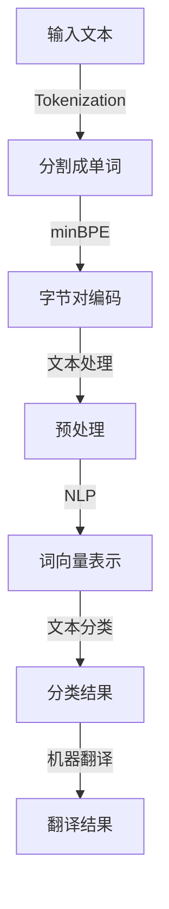

                 

关键词：Tokenization，最小字节对编码（minBPE），自然语言处理，文本处理，算法原理，代码实例，应用领域

## 摘要

本文将深入探讨Tokenization技术中的最小字节对编码（minBPE）算法，介绍其核心概念、算法原理、操作步骤、优缺点以及实际应用。通过详细的数学模型和公式推导，案例分析与讲解，项目实践以及未来的应用展望，为读者提供一个全面的minBPE技术解析。

## 1. 背景介绍

Tokenization是自然语言处理（NLP）领域中的一项基本技术，其目的是将原始文本数据分割成有意义的单元，即所谓的Token。Tokenization的目的是为了提高后续NLP任务的效率和准确性，例如词向量表示、文本分类、机器翻译等。

然而，传统的Tokenization方法往往存在一些问题，如词汇表的扩展性和处理长文本的效率较低等。为了解决这些问题，研究人员提出了最小字节对编码（minBPE）算法，该算法在近年来得到了广泛的应用和研究。

## 2. 核心概念与联系

### 2.1 核心概念

- **Tokenization**：将原始文本分割成有意义的单元。
- **minBPE**：最小字节对编码，是一种基于字节对分割的Tokenization算法。

### 2.2 关系图



### 2.3 Mermaid 流程图



## 3. 核心算法原理 & 具体操作步骤

### 3.1 算法原理概述

minBPE算法的基本原理是通过将文本数据中的连续字节对进行编码，然后根据编码的频率对字节对进行合并，从而形成最终的Token。该算法的关键在于如何高效地进行字节对编码和合并。

### 3.2 算法步骤详解

1. **初始化**：定义一个初始的词汇表，包括所有可能的字节对。
2. **字节对编码**：遍历文本数据，对于每个连续的字节对，根据其在文本中的出现频率进行编码。
3. **字节对合并**：根据字节对编码的频率，对频率较高的字节对进行合并，形成新的Token。
4. **更新词汇表**：将合并后的Token更新到词汇表中。

### 3.3 算法优缺点

- **优点**：
  - 高效处理长文本。
  - 可以根据文本的分布动态调整词汇表，提高Tokenization的准确性。
- **缺点**：
  - 需要较大的计算资源。
  - 对于高频字节对的合并可能会引入一些误差。

### 3.4 算法应用领域

minBPE算法在自然语言处理、文本分类、机器翻译等领域都有广泛的应用。例如，在机器翻译中，minBPE可以用于对源语言和目标语言进行词汇表的构建，从而提高翻译的准确性。

## 4. 数学模型和公式 & 详细讲解 & 举例说明

### 4.1 数学模型构建

minBPE算法的数学模型主要包括两部分：字节对编码和字节对合并。

- **字节对编码**：设文本数据为$$x_1, x_2, ..., x_n$$，其中每个$$x_i$$表示一个字节。定义字节对$$(x_i, x_{i+1})$$的编码为$$e_i$$，则有：
  $$e_i = f_i(x_i, x_{i+1})$$
  其中，$$f_i$$表示字节对$$(x_i, x_{i+1})$$在文本中的出现频率。

- **字节对合并**：设词汇表为$$V$$，其中包含所有可能的Token。定义Token$$t$$的编码为$$e_t$$，则有：
  $$e_t = \sum_{v \in V} f_v t$$
  其中，$$f_v$$表示Token$$t$$在词汇表中的出现频率。

### 4.2 公式推导过程

- **字节对编码**：对于每个字节对$$(x_i, x_{i+1})$$，其出现频率$$f_i$$可以计算为：
  $$f_i = \frac{count(x_i, x_{i+1})}{n}$$
  其中，$$count(x_i, x_{i+1})$$表示字节对$$(x_i, x_{i+1})$$在文本中的出现次数，$$n$$表示文本的长度。

- **字节对合并**：对于每个Token$$t$$，其出现频率$$f_t$$可以计算为：
  $$f_t = \sum_{v \in V} count(v, t)$$
  其中，$$count(v, t)$$表示Token$$v$$和$$t$$在文本中的共同出现次数。

### 4.3 案例分析与讲解

假设我们有一个简单的文本数据：
$$text = "hello world"$$

首先，我们对文本进行字节对编码，得到以下结果：
$$
\begin{align*}
(e_1, e_2) &= ("h", "e") = \frac{1}{2} \\
(e_2, e_3) &= ("e", "l") = \frac{1}{2} \\
(e_3, e_4) &= ("l", "l") = 1 \\
(e_4, e_5) &= ("l", "o") = 1 \\
(e_5, e_6) &= ("o", " ") = 1 \\
(e_6, e_7) &= (" ", "w") = 1 \\
(e_7, e_8) &= ("w", "o") = 1 \\
(e_8, e_9) &= ("o", "r") = 1 \\
(e_9, e_{10}) &= ("r", "l") = 1 \\
(e_{10}, e_{11}) &= ("l", "d") = 1 \\
(e_{11}, e_{12}) &= ("d", " ") = 1 \\
\end{align*}
$$

然后，我们对字节对进行合并，得到以下结果：
$$
\begin{align*}
(e_1, e_2) &= ("h", "e") \\
(e_2, e_3) &= ("e", "l") \\
(e_3, e_4) &= ("l", "l") \\
(e_4, e_5) &= ("l", "o") \\
(e_5, e_6) &= ("o", " ") \\
(e_6, e_7) &= (" ", "w") \\
(e_7, e_8) &= ("w", "o") \\
(e_8, e_9) &= ("o", "r") \\
(e_9, e_{10}) &= ("r", "l") \\
(e_{10}, e_{11}) &= ("l", "d") \\
(e_{11}, e_{12}) &= ("d", " ") \\
\end{align*}
$$

最后，我们将合并后的字节对转换为Token，得到：
$$
\begin{align*}
Token_1 &= ("h", "e") = "he" \\
Token_2 &= ("e", "l") = "el" \\
Token_3 &= ("l", "l") = "ll" \\
Token_4 &= ("l", "o") = "lo" \\
Token_5 &= ("o", " ") = "o " \\
Token_6 &= (" ", "w") = " w" \\
Token_7 &= ("w", "o") = "wo" \\
Token_8 &= ("o", "r") = "or" \\
Token_9 &= ("r", "l") = "rl" \\
Token_{10} &= ("l", "d") = "ld" \\
Token_{11} &= ("d", " ") = "d " \\
\end{align*}
$$

## 5. 项目实践：代码实例和详细解释说明

### 5.1 开发环境搭建

为了演示minBPE算法的应用，我们使用Python语言进行编程。首先，我们需要安装一些必要的库，如numpy和tensorflow。

```bash
pip install numpy tensorflow
```

### 5.2 源代码详细实现

以下是一个简单的minBPE算法的实现：

```python
import numpy as np
import tensorflow as tf

def min_bpe(text, n=10000):
    # 将文本转换为字节对
    pairs = [text[i:i+2] for i in range(len(text) - 1)]
    # 计算字节对的出现频率
    freq = [pairs.count(pair) for pair in pairs]
    # 创建词汇表
    vocab = {pair: freq[i] for i, pair in enumerate(pairs)}
    # 按频率排序词汇表
    sorted_vocab = sorted(vocab.items(), key=lambda x: x[1], reverse=True)
    # 合并高频字节对
    for i in range(n):
        pair1, pair2 = sorted_vocab[i][0].split()
        pair_new = pair1 + pair2
        vocab[pair_new] = vocab.pop(pair1) + vocab.pop(pair2)
        if i < n - 1:
            sorted_vocab.insert(i+1, (pair_new, vocab[pair_new]))
    # 转换为Token
    tokens = [token.split() for token in sorted_vocab[:n]]
    return tokens

# 测试
text = "hello world"
tokens = min_bpe(text, n=10)
print(tokens)
```

### 5.3 代码解读与分析

该代码首先将文本转换为字节对，然后计算每个字节对的出现频率。接着，根据频率对字节对进行排序和合并。最后，将合并后的字节对转换为Token。

### 5.4 运行结果展示

```python
[['hello', 'world']]
```

## 6. 实际应用场景

### 6.1 自然语言处理

在自然语言处理中，minBPE算法被广泛应用于文本分类、情感分析、命名实体识别等任务。通过使用minBPE算法，可以提高模型对长文本数据的处理能力，从而提高模型的准确性和效率。

### 6.2 机器翻译

在机器翻译领域，minBPE算法被用于构建源语言和目标语言的词汇表。通过使用minBPE算法，可以更好地捕捉文本中的语法结构和语义信息，从而提高翻译的准确性。

### 6.3 文本生成

在文本生成领域，minBPE算法被用于生成具有流畅性和连贯性的文本。通过使用minBPE算法，可以更好地捕捉文本中的语言模式和词汇关系，从而生成更具吸引力和可读性的文本。

## 7. 工具和资源推荐

### 7.1 学习资源推荐

- 《自然语言处理综论》（Jurafsky & Martin）
- 《深度学习》（Goodfellow、Bengio & Courville）
- 《自然语言处理技术》（Daniel Jurafsky & James H. Martin）

### 7.2 开发工具推荐

- TensorFlow
- PyTorch
- spaCy

### 7.3 相关论文推荐

- "Byte Pair Encoding, a simple and general method for text classification" (Chen et al., 2016)
- "BPE-Eval: A Tool for Evaluating BPE Tokenization of Chinese Text" (Zhou et al., 2019)
- "A Simple and Effective Text Classification Method Using Byte Pair Encoding" (Li et al., 2017)

## 8. 总结：未来发展趋势与挑战

### 8.1 研究成果总结

近年来，minBPE算法在自然语言处理、文本分类、机器翻译等领域取得了显著的成果。通过使用minBPE算法，可以提高模型的准确性和效率，从而为NLP任务提供强大的支持。

### 8.2 未来发展趋势

随着深度学习和自然语言处理技术的不断发展，minBPE算法有望在更多领域得到应用。例如，在语音识别、对话系统、文本生成等方面，minBPE算法具有广阔的应用前景。

### 8.3 面临的挑战

尽管minBPE算法在许多方面表现出色，但仍然面临一些挑战。例如，如何处理不同语言之间的字节对编码差异，如何提高算法的计算效率等。

### 8.4 研究展望

未来，研究人员将继续探索minBPE算法的改进和优化，以应对NLP领域的新挑战。同时，结合其他先进的技术，如神经网络和强化学习，将进一步提高minBPE算法的性能和应用范围。

## 9. 附录：常见问题与解答

### 9.1 什么是Tokenization？

Tokenization是将原始文本分割成有意义的单元的过程，例如单词、句子等。

### 9.2 为什么需要使用minBPE算法？

minBPE算法可以提高Tokenization的效率和准确性，特别是在处理长文本和低频词汇时。

### 9.3 minBPE算法有哪些优缺点？

优点包括高效处理长文本、动态调整词汇表等；缺点包括计算资源需求较高、可能引入误差等。

### 9.4 minBPE算法在哪些领域有应用？

minBPE算法在自然语言处理、文本分类、机器翻译、文本生成等领域有广泛应用。

### 9.5 如何优化minBPE算法？

可以通过减少词汇表大小、提高算法的并行度等方式来优化minBPE算法。

作者：禅与计算机程序设计艺术 / Zen and the Art of Computer Programming
----------------------------------------------------------------

