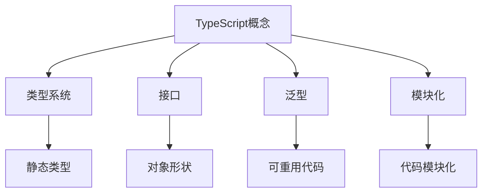

                 

在当今的Web开发领域中，JavaScript（JS）已经成为一种主流的编程语言。然而，随着时间的推移，开发者们发现JavaScript在某些方面存在局限性，特别是在类型安全和模块化方面。为了解决这些问题，TypeScript（TS）应运而生。TypeScript不仅继承了JavaScript的核心特性，而且在类型系统、模块化、泛型等方面进行了扩展和增强。可以说，TypeScript是JavaScript的一个超集，它旨在提升开发效率、代码质量和可维护性。

本文将探讨TypeScript与JavaScript之间的联系和区别，深入讲解TypeScript的核心概念、算法原理、数学模型和实际应用场景，并通过项目实践来展示TypeScript的强大功能。

## 1. 背景介绍

JavaScript自1995年诞生以来，已经成为了Web开发的核心语言。它具有简单易学、跨平台、灵活性强等特点，使开发者能够轻松地创建动态和交互式的网页。然而，随着时间的推移，JavaScript在类型安全和模块化方面逐渐暴露出一些问题。

类型安全是指程序在运行时能够确保数据类型的正确性。在JavaScript中，变量可以是任何类型，这虽然在某些情况下提供了灵活性，但也可能导致类型错误和运行时错误。模块化是指代码的分解和组织方式，以便更容易管理和复用代码。JavaScript早期版本的模块化支持较为薄弱，这给开发者带来了额外的负担。

为了解决这些问题，微软在2012年推出了TypeScript。TypeScript是一种编译型语言，它在JavaScript的基础上引入了静态类型系统、模块化机制、泛型等特性。通过TypeScript，开发者可以享受到静态类型带来的类型安全性和代码可维护性，同时仍然能够兼容现有的JavaScript代码库。

## 2. 核心概念与联系

### 2.1 TypeScript的基本概念

TypeScript的核心概念包括类型系统、接口、泛型、模块化等。

#### 2.1.1 类型系统

TypeScript引入了静态类型系统，这意味着在编译时就能确定变量和函数的参数类型。与动态类型系统（如JavaScript）相比，静态类型系统可以提供更好的类型安全性和性能优化。

#### 2.1.2 接口

接口是一种抽象的类型定义，用于描述对象的形状。接口不仅可以定义类型，还可以定义对象的结构和行为。通过接口，开发者可以更方便地进行代码的复用和扩展。

#### 2.1.3 泛型

泛型是一种允许编写可重用代码的机制，它可以处理不同类型的数据。TypeScript的泛型机制使得开发者能够编写更加灵活和通用的代码。

#### 2.1.4 模块化

TypeScript引入了模块化机制，这使得代码更加模块化、可重用和易于维护。通过模块，开发者可以更方便地管理代码和依赖关系。

### 2.2 TypeScript与JavaScript的联系

TypeScript与JavaScript有着紧密的联系。首先，TypeScript代码最终会编译成JavaScript代码，这意味着TypeScript与JavaScript在运行时是完全兼容的。其次，TypeScript的大部分语法与JavaScript相同，这使得开发者可以轻松地从JavaScript过渡到TypeScript。

### 2.3 Mermaid流程图

以下是TypeScript核心概念与联系的一个简化的Mermaid流程图：



## 3. 核心算法原理 & 具体操作步骤

### 3.1 算法原理概述

TypeScript的核心算法原理主要涉及类型检查和代码生成。在编译过程中，TypeScript会首先对代码进行类型检查，确保代码中的类型使用正确。然后，TypeScript会将TypeScript代码编译成JavaScript代码，以便在浏览器或其他JavaScript环境中运行。

### 3.2 算法步骤详解

#### 3.2.1 类型检查

类型检查是TypeScript的核心算法之一。在类型检查过程中，TypeScript会分析代码中的变量、函数和表达式，确定它们的数据类型。以下是一个简单的示例：

```typescript
function add(a: number, b: number): number {
  return a + b;
}

const result = add(2, "3"); // 报错：类型 "string" 与类型 "number" 不兼容。
```

在这个示例中，`add` 函数期望传入两个数值类型的参数，并返回一个数值类型的结果。当传入一个字符串类型的参数时，TypeScript会报错，因为字符串类型与数值类型不兼容。

#### 3.2.2 代码生成

代码生成是TypeScript的另一个核心算法。在类型检查完成后，TypeScript会生成相应的JavaScript代码。这个过程包括以下步骤：

1. 将TypeScript代码转换为抽象语法树（AST）。
2. 对AST进行类型检查。
3. 根据类型检查结果，生成JavaScript代码。

以下是一个简单的示例：

```typescript
// TypeScript代码
function add(a: number, b: number): number {
  return a + b;
}

// JavaScript代码
function add(a, b) {
  return a + b;
}
```

在这个示例中，TypeScript代码通过类型检查后，生成了对应的JavaScript代码。

### 3.3 算法优缺点

TypeScript的核心算法在提高代码质量和开发效率方面具有显著优势。以下是TypeScript算法的优缺点：

#### 优点：

1. 提高代码质量：类型检查有助于发现潜在的错误，减少运行时错误。
2. 提高开发效率：静态类型系统和模块化机制使得代码更易于维护和复用。
3. 与JavaScript兼容：TypeScript生成的JavaScript代码与JavaScript完全兼容，无需担心兼容性问题。

#### 缺点：

1. 学习曲线：对于JavaScript开发者来说，TypeScript的学习曲线可能相对较陡峭。
2. 编译时间：TypeScript代码需要编译成JavaScript代码，这可能导致编译时间较长。

### 3.4 算法应用领域

TypeScript在以下领域具有广泛的应用：

1. Web开发：TypeScript可以用于开发Web应用、Web组件和库。
2. 命令行工具：TypeScript可以用于开发命令行工具和脚本。
3. Node.js开发：TypeScript可以用于开发Node.js应用程序。

## 4. 数学模型和公式 & 详细讲解 & 举例说明

### 4.1 数学模型构建

TypeScript的类型系统可以看作是一个数学模型。在这个模型中，类型是一种抽象的数据类型，可以表示为集合。以下是一个简单的示例：

```typescript
type NumberType = 1 | 2 | 3 | 4 | 5;
type StringType = "Hello" | "World";
```

在这个示例中，`NumberType` 和 `StringType` 是两个自定义的类型，它们分别表示数字集合和字符串集合。

### 4.2 公式推导过程

TypeScript的类型系统支持多种运算符，包括联合运算符（`|`）、交集运算符（`&`）和补集运算符（`-`）。以下是一个简单的推导过程：

```typescript
type A = "Hello" | "World";
type B = "World" | "!";
type C = A & B; // C的结果为 "World"
type D = A | B; // D的结果为 "Hello" | "World" | "!"
type E = A - B; // E的结果为 "Hello"
```

在这个示例中，`C` 表示 `A` 和 `B` 的交集，即 `C` 包含的元素同时属于 `A` 和 `B`。`D` 表示 `A` 和 `B` 的并集，即 `D` 包含的元素属于 `A` 或 `B`。`E` 表示 `A` 和 `B` 的补集，即 `E` 包含的元素属于 `A` 但不属于 `B`。

### 4.3 案例分析与讲解

以下是一个实际的TypeScript类型推导案例：

```typescript
type Optional<T> = T | null;

function add<T extends string | number | boolean>(a: T, b: T): T {
  return a + b;
}

const result1 = add(1, 2); // 返回数字类型 3
const result2 = add("Hello", "World"); // 返回字符串类型 "HelloWorld"
const result3 = add(true, false); // 返回布尔类型 false
const result4: Optional<number> = add(1, null); // 返回可选数字类型 1
```

在这个示例中，`Optional<T>` 是一个自定义类型，表示 `T` 可以为 `T` 类型或 `null`。`add` 函数是一个泛型函数，它接受两个类型相同的参数，并返回它们的和。通过类型推导，我们可以得到不同的返回类型。

## 5. 项目实践：代码实例和详细解释说明

### 5.1 开发环境搭建

在开始使用TypeScript之前，需要搭建一个合适的开发环境。以下是一个简单的步骤：

1. 安装Node.js：从官网（https://nodejs.org/）下载并安装Node.js。
2. 安装TypeScript：通过npm命令安装TypeScript：

```bash
npm install -g typescript
```

3. 配置编辑器：推荐使用Visual Studio Code（简称VS Code）作为TypeScript的开发环境。可以从官网（https://code.visualstudio.com/）下载并安装VS Code，然后安装TypeScript插件。

### 5.2 源代码详细实现

以下是一个简单的TypeScript项目示例：

```typescript
// 定义一个接口
interface Person {
  name: string;
  age: number;
}

// 定义一个函数，用于添加年龄
function addAge(person: Person, age: number): Person {
  return { ...person, age: person.age + age };
}

// 定义一个函数，用于打印个人信息
function printPerson(person: Person): void {
  console.log(`Name: ${person.name}, Age: ${person.age}`);
}

// 创建一个Person对象
const person: Person = { name: "Alice", age: 30 };

// 添加5岁年龄
const updatedPerson = addAge(person, 5);

// 打印个人信息
printPerson(updatedPerson);
```

### 5.3 代码解读与分析

在这个示例中，我们定义了一个名为 `Person` 的接口，用于描述一个人的姓名和年龄。然后，我们定义了两个函数：`addAge` 和 `printPerson`。

- `addAge` 函数接受一个 `Person` 类型的参数和一个数字类型的年龄参数，返回一个新的 `Person` 对象，其年龄增加了指定的值。
- `printPerson` 函数接受一个 `Person` 类型的参数，并打印出该人的姓名和年龄。

最后，我们创建了一个 `Person` 对象，调用 `addAge` 函数为其添加5岁年龄，并调用 `printPerson` 函数打印个人信息。

### 5.4 运行结果展示

运行上述代码后，我们会在控制台看到以下输出：

```
Name: Alice, Age: 35
```

这表明我们成功地为 `Alice` 添加了5岁年龄，并正确地打印了个人信息。

## 6. 实际应用场景

TypeScript在实际应用场景中具有广泛的应用。以下是一些常见的应用场景：

1. **Web开发**：TypeScript可以用于开发各种Web应用，包括单页面应用（如React、Vue.js）、多页面应用（如Angular）和Web组件。
2. **Node.js开发**：TypeScript可以用于开发Node.js应用程序，特别是在需要大规模代码和模块化时。
3. **命令行工具**：TypeScript可以用于开发各种命令行工具和脚本，提高开发效率和代码质量。
4. **库和框架**：TypeScript可以用于开发大型库和框架，如React、Vue.js、Angular等。

### 6.1 Web开发

在Web开发中，TypeScript的主要应用场景包括：

- **单页面应用（SPA）**：如React、Vue.js等。TypeScript可以帮助开发者编写更加安全、可维护的代码，并提高开发效率。
- **多页面应用（MPA）**：如Angular等。TypeScript的静态类型系统和模块化机制使得代码更加易于维护和扩展。
- **Web组件**：TypeScript可以帮助开发者创建可重用、独立的Web组件，提高开发效率和代码质量。

### 6.2 Node.js开发

在Node.js开发中，TypeScript的主要应用场景包括：

- **后端服务**：TypeScript可以用于开发后端服务，如REST API、Web服务、数据处理等。TypeScript的静态类型系统和模块化机制使得代码更加易于维护和扩展。
- **数据管道**：TypeScript可以用于开发数据管道，如数据处理、转换、存储等。TypeScript的静态类型系统有助于确保数据处理过程的正确性。
- **自动化脚本**：TypeScript可以用于开发各种自动化脚本，如部署脚本、构建脚本等。TypeScript的静态类型系统可以提高代码质量和可维护性。

### 6.3 命令行工具

在命令行工具开发中，TypeScript的主要应用场景包括：

- **工具链**：TypeScript可以用于开发各种工具链，如构建工具（如Webpack、Rollup）、打包工具（如Parcel）、测试工具（如Jest）等。TypeScript的静态类型系统和模块化机制有助于提高开发效率和代码质量。
- **脚本**：TypeScript可以用于开发各种脚本，如部署脚本、监控脚本、日志分析脚本等。TypeScript的静态类型系统可以提高代码质量和可维护性。

### 6.4 未来应用展望

随着Web开发和Node.js开发的不断发展，TypeScript的未来应用前景非常广阔。以下是一些可能的未来应用方向：

- **云原生应用**：TypeScript可以用于开发云原生应用，如Kubernetes集群管理、容器编排等。TypeScript的静态类型系统和模块化机制有助于提高开发效率和代码质量。
- **物联网（IoT）**：TypeScript可以用于开发物联网应用，如智能家居、智能工厂等。TypeScript的跨平台特性和模块化机制使得代码更加易于维护和扩展。
- **人工智能（AI）**：TypeScript可以用于开发人工智能应用，如机器学习、深度学习等。TypeScript的静态类型系统和强大的类型系统有助于提高代码质量和可维护性。

## 7. 工具和资源推荐

### 7.1 学习资源推荐

- **官方文档**：TypeScript的官方文档（https://www.typescriptlang.org/）是学习TypeScript的最佳资源，涵盖了TypeScript的各个方面。
- **在线教程**：如MDN Web Docs（https://developer.mozilla.org/zh-CN/docs/Web/JavaScript/TypeScript）提供了丰富的TypeScript教程。
- **书籍**：《TypeScript Deep Dive》（https://basarat.gitbook.io/typescript/）是一本深受好评的TypeScript入门和进阶书籍。

### 7.2 开发工具推荐

- **Visual Studio Code**：一款强大的代码编辑器，支持TypeScript插件，提供代码补全、语法高亮、格式化等功能。
- **WebStorm**：一款专业的JavaScript和TypeScript开发工具，提供代码智能提示、静态分析、调试等功能。
- **JetBrains家族**：如IntelliJ IDEA、WebStorm等，这些IDE都支持TypeScript，并提供强大的开发工具和功能。

### 7.3 相关论文推荐

- **《TypeScript的设计与实现》**：这篇论文详细介绍了TypeScript的设计原理和实现细节。
- **《静态类型系统在JavaScript中的应用》**：这篇论文探讨了静态类型系统在JavaScript中的应用，以及TypeScript如何提升JavaScript的类型安全性和性能。

## 8. 总结：未来发展趋势与挑战

### 8.1 研究成果总结

自TypeScript推出以来，它已经在Web开发和Node.js开发中取得了显著的成功。TypeScript的静态类型系统、模块化机制和泛型特性为开发者带来了更高的代码质量和开发效率。此外，TypeScript与JavaScript的高度兼容性使得开发者可以无缝迁移现有代码。

### 8.2 未来发展趋势

随着Web开发和Node.js开发的不断发展，TypeScript的未来发展趋势非常乐观。以下是几个可能的发展方向：

- **更好的性能优化**：TypeScript将继续优化编译性能，提高代码运行效率。
- **更丰富的生态系统**：TypeScript将继续与其他编程语言和框架（如Python、Java等）集成，扩大其应用范围。
- **更广泛的支持**：TypeScript将继续扩展其对各种开发环境和工具的支持，如VS Code、WebStorm、JetBrains等。

### 8.3 面临的挑战

尽管TypeScript取得了显著的成功，但它仍然面临着一些挑战：

- **学习曲线**：TypeScript的学习曲线相对较陡峭，对于初学者来说可能有一定的难度。
- **兼容性问题**：尽管TypeScript与JavaScript具有很高的兼容性，但在某些情况下仍然可能遇到兼容性问题。
- **工具支持**：虽然TypeScript已经有了丰富的开发工具和资源，但仍然需要进一步改进和完善。

### 8.4 研究展望

TypeScript在未来的研究和发展中，可以从以下几个方面进行探索：

- **更完善的类型系统**：TypeScript可以进一步扩展其类型系统，提供更丰富的类型支持和类型推导功能。
- **更好的性能优化**：TypeScript可以继续优化编译性能，提高代码运行效率。
- **更广泛的应用场景**：TypeScript可以探索在更多领域（如云原生应用、物联网、人工智能等）的应用，提高其应用价值。

## 9. 附录：常见问题与解答

### 9.1 TypeScript与JavaScript的区别是什么？

TypeScript是JavaScript的一个超集，它继承了JavaScript的核心特性，并在类型系统、模块化、泛型等方面进行了扩展和增强。TypeScript提供静态类型检查、更丰富的类型系统和模块化机制，从而提高代码质量和开发效率。

### 9.2 TypeScript的类型系统如何工作？

TypeScript的类型系统包括原始类型、复合类型、函数类型、接口类型、泛型类型等。在编译过程中，TypeScript会对代码进行类型检查，确保变量和函数的参数类型正确。类型检查完成后，TypeScript会生成相应的JavaScript代码。

### 9.3 TypeScript如何提升开发效率？

TypeScript通过静态类型检查、更丰富的类型系统和模块化机制，提高代码质量和开发效率。静态类型检查有助于发现潜在的错误，减少运行时错误。更丰富的类型系统和模块化机制使得代码更易于维护和复用。

### 9.4 TypeScript与JavaScript的兼容性如何？

TypeScript与JavaScript具有很高的兼容性。TypeScript代码可以无缝编译成JavaScript代码，并在浏览器或其他JavaScript环境中运行。此外，TypeScript还提供了类型转换和类型兼容性机制，以支持从JavaScript到TypeScript的迁移。

----------------------------------------------------------------
### 作者署名

**作者：禅与计算机程序设计艺术 / Zen and the Art of Computer Programming**

