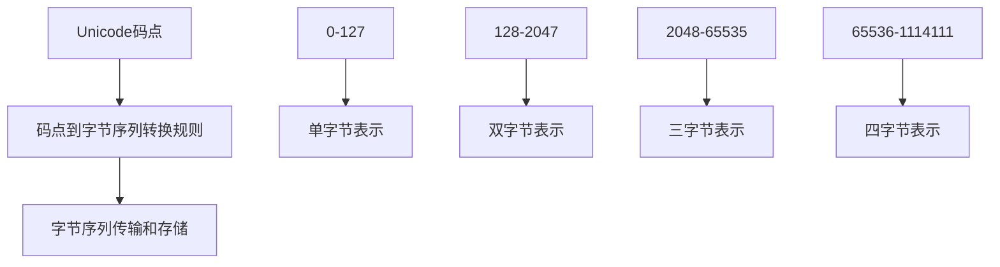

                 

关键词：UTF-8编码、国际化、AI应用、文本基础

> 摘要：本文旨在探讨UTF-8编码在国际化AI应用中的重要性，分析其核心概念、算法原理、数学模型和具体应用。通过详细的项目实践和实际应用场景分析，本文将帮助读者深入了解UTF-8编码，为其在AI领域的应用提供有益参考。

## 1. 背景介绍

随着全球化的加速和信息技术的飞速发展，国际化AI应用的需求日益增长。这些应用涉及到多个国家和地区的用户，他们可能使用不同的语言、字符集和编码系统。在这一背景下，如何有效地处理和传输文本数据成为了一个关键问题。

Unicode和UTF-8编码系统应运而生，成为解决国际化文本处理的重要工具。UTF-8编码是一种可变长度的编码方案，能够兼容Unicode字符集，同时保持高效的数据传输和存储。本文将深入探讨UTF-8编码在国际化AI应用中的重要性，分析其核心概念、算法原理、数学模型和具体应用。

## 2. 核心概念与联系

### 2.1 Unicode

Unicode是一种字符集标准，旨在统一表示世界上所有的字符。它涵盖了各种语言的字符，包括拉丁字母、希腊字母、阿拉伯数字、汉字、日文平假名和片假名等。Unicode通过使用码点（code point）来唯一标识每个字符，码点是一个16位的无符号整数。

### 2.2 UTF-8编码

UTF-8是一种对Unicode字符进行编码的可变长度编码方案。它通过将码点映射到一系列字节序列，从而实现字符的有效存储和传输。UTF-8编码的特点是兼容性高、可读性强、高效性和灵活性。

### 2.3 UTF-8编码原理

UTF-8编码根据码点的范围将字符映射到不同的字节序列：

- 码点在0到127之间的字符，用一个字节表示；
- 码点在128到2047之间的字符，用两个字节表示；
- 码点在2048到65535之间的字符，用三个字节表示；
- 码点在65536到1114111之间的字符，用四个字节表示。

UTF-8编码的流程如下：

1. **码点到字节序列的转换**：首先将码点转换为字节序列，具体规则如上所述；
2. **字节序列的传输和存储**：将生成的字节序列传输或存储到目标设备或文件中。

### 2.4 Mermaid流程图

下面是一个Mermaid流程图，展示了UTF-8编码的核心概念和流程：



## 3. 核心算法原理 & 具体操作步骤

### 3.1 算法原理概述

UTF-8编码的核心原理是将Unicode码点映射到一系列字节序列。这个过程遵循特定的规则，根据码点的范围选择合适的字节长度。以下是UTF-8编码的算法原理概述：

- 码点在0到127之间的字符，直接映射到单字节；
- 码点在128到2047之间的字符，映射到两个字节，第一个字节的前两位是10，其余位是码点的高5位，第二个字节的前两位是10，其余位是码点的低6位；
- 码点在2048到65535之间的字符，映射到三个字节，第一个字节的前三位是11，其余位是码点的高4位，第二个字节的前两位是10，其余位是码点的低6位，第三个字节的前两位是10，其余位是码点的低6位；
- 码点在65536到1114111之间的字符，映射到四个字节，第一个字节的前四位是1110，其余位是码点的高3位，第二个字节的前两位是10，其余位是码点的低5位，第三个字节的前两位是10，其余位是码点的低5位，第四个字节的前两位是10，其余位是码点的低6位。

### 3.2 算法步骤详解

以下是UTF-8编码的具体步骤：

1. **确定码点范围**：根据码点的值确定其范围，从而选择合适的字节长度；
2. **生成字节序列**：根据码点和选择的字节长度，按照规则生成字节序列；
3. **字节序列传输和存储**：将生成的字节序列传输或存储到目标设备或文件中。

### 3.3 算法优缺点

**优点：**

- **兼容性高**：UTF-8编码兼容Unicode字符集，可以表示世界上所有的字符；
- **可读性强**：UTF-8编码的字节序列易于阅读和理解，不需要额外的解码过程；
- **高效性**：UTF-8编码在处理单字节字符时非常高效，只需一个字节即可表示；
- **灵活性**：UTF-8编码可以根据码点的范围灵活选择字节长度，适应不同的字符集。

**缺点：**

- **长度不固定**：UTF-8编码的字节长度不固定，可能导致数据处理的不一致；
- **存储空间浪费**：对于英文字符等单字节字符，UTF-8编码会浪费一个字节的空间。

### 3.4 算法应用领域

UTF-8编码广泛应用于国际化AI应用中，包括但不限于：

- **自然语言处理（NLP）**：处理多语言文本数据，如机器翻译、情感分析等；
- **数据库存储**：存储多语言数据，如社交媒体平台、电子商务系统等；
- **Web开发**：处理和传输多语言网页内容，如国际化网站、Web应用等。

## 4. 数学模型和公式 & 详细讲解 & 举例说明

### 4.1 数学模型构建

UTF-8编码的数学模型可以描述为：

- **单字节字符**：码点 \( n \) 映射到字节序列 \( (n) \)；
- **双字节字符**：码点 \( n \) 映射到字节序列 \( (11000000 + \frac{n-128}{64}, 10000000 + (n \mod 64)) \)；
- **三字节字符**：码点 \( n \) 映射到字节序列 \( (11100000 + \frac{n-2048}{4096}, 10000000 + \frac{(n \mod 64) \mod 64}{64}, 10000000 + (n \mod 64)) \)；
- **四字节字符**：码点 \( n \) 映射到字节序列 \( (11110000 + \frac{n-65536}{262144}, 10000000 + \frac{(n \mod 64) \mod 64}{64}, 10000000 + \frac{(n \mod 64) \mod 64}{64}, 10000000 + (n \mod 64)) \)。

### 4.2 公式推导过程

以下是UTF-8编码的公式推导过程：

- **单字节字符**：码点 \( n \) 直接映射到字节序列 \( (n) \)，不需要推导；
- **双字节字符**：
  \[
  \begin{align*}
  n &= 128 + 64k_1 + r_1 \\
  k_1 &= \lfloor \frac{n-128}{64} \rfloor \\
  r_1 &= n \mod 64
  \end{align*}
  \]
  第一个字节的前两位是10，其余位是 \( k_1 \)；
  \[
  \begin{align*}
  n &= 128 + 64k_2 + r_2 \\
  k_2 &= \lfloor \frac{r_1}{64} \rfloor \\
  r_2 &= r_1 \mod 64
  \end{align*}
  \]
  第二个字节的前两位是10，其余位是 \( r_2 \)；
- **三字节字符**：
  \[
  \begin{align*}
  n &= 2048 + 4096k_1 + r_1 \\
  k_1 &= \lfloor \frac{n-2048}{4096} \rfloor \\
  r_1 &= n \mod 4096
  \end{align*}
  \]
  第一个字节的前三位是11，其余位是 \( k_1 \)；
  \[
  \begin{align*}
  n &= 2048 + 64k_2 + r_2 \\
  k_2 &= \lfloor \frac{r_1}{64} \rfloor \\
  r_2 &= r_1 \mod 64
  \end{align*}
  \]
  第二个字节的前两位是10，其余位是 \( k_2 \)；
  \[
  \begin{align*}
  n &= 2048 + 64k_3 + r_3 \\
  k_3 &= \lfloor \frac{r_2}{64} \rfloor \\
  r_3 &= r_2 \mod 64
  \end{align*}
  \]
  第三个字节的前两位是10，其余位是 \( r_3 \)；
- **四字节字符**：
  \[
  \begin{align*}
  n &= 65536 + 262144k_1 + r_1 \\
  k_1 &= \lfloor \frac{n-65536}{262144} \rfloor \\
  r_1 &= n \mod 262144
  \end{align*}
  \]
  第一个字节的前四位是1110，其余位是 \( k_1 \)；
  \[
  \begin{align*}
  n &= 65536 + 64k_2 + r_2 \\
  k_2 &= \lfloor \frac{r_1}{64} \rfloor \\
  r_2 &= r_1 \mod 64
  \end{align*}
  \]
  第二个字节的前两位是10，其余位是 \( k_2 \)；
  \[
  \begin{align*}
  n &= 65536 + 64k_3 + r_3 \\
  k_3 &= \lfloor \frac{r_2}{64} \rfloor \\
  r_3 &= r_2 \mod 64
  \end{align*}
  \]
  第三个字节的前两位是10，其余位是 \( k_3 \)；
  \[
  \begin{align*}
  n &= 65536 + 64k_4 + r_4 \\
  k_4 &= \lfloor \frac{r_3}{64} \rfloor \\
  r_4 &= r_3 \mod 64
  \end{align*}
  \]
  第四个字节的前两位是10，其余位是 \( r_4 \)。

### 4.3 案例分析与讲解

下面通过一个例子来说明UTF-8编码的具体应用：

假设要编码的字符是“你好”，其Unicode码点分别为“你”（20902）和“好”（22909）。

1. **单字节字符**：“好”是单字节字符，其UTF-8编码为 \( (10101001) \)；
2. **双字节字符**：“你”是双字节字符，根据公式推导：
   \[
   \begin{align*}
   20902 &= 128 + 64 \times 1 + 18 \\
   20902 &= 128 + 64 \times 2 + 14
   \end{align*}
   \]
   “你”的UTF-8编码为 \( (11101100, 10100010) \)。

因此，“你好”的UTF-8编码为 \( (11101100, 10100010, 10101001) \)。

## 5. 项目实践：代码实例和详细解释说明

### 5.1 开发环境搭建

为了演示UTF-8编码的过程，我们将使用Python编程语言。首先，需要安装Python环境，并确保已经安装了标准库中的`binascii`模块。

### 5.2 源代码详细实现

以下是实现UTF-8编码的Python代码示例：

```python
import binascii

def encode_utf8(char):
    """
    对字符进行UTF-8编码
    """
    code_point = ord(char)
    if code_point <= 127:
        return bytes([code_point])
    elif code_point <= 2047:
        return bytes([
            192 + (code_point >> 6),
            128 + (code_point & 63)
        ])
    elif code_point <= 65535:
        return bytes([
            224 + (code_point >> 12),
            128 + ((code_point >> 6) & 63),
            128 + (code_point & 63)
        ])
    elif code_point <= 1114111:
        return bytes([
            240 + (code_point >> 18),
            128 + ((code_point >> 12) & 63),
            128 + ((code_point >> 6) & 63),
            128 + (code_point & 63)
        ])

def decode_utf8(byte_sequence):
    """
    对字节序列进行UTF-8解码
    """
    code_point = byte_sequence[0]
    if code_point <= 127:
        return chr(code_point)
    elif code_point <= 191:
        code_point = (
            (code_point & 31) << 6) + (byte_sequence[1] & 63)
        return chr(code_point)
    elif code_point <= 224:
        code_point = (
            (code_point & 15) << 12) + (
            (byte_sequence[1] & 63) << 6) + (
            byte_sequence[2] & 63)
        return chr(code_point)
    elif code_point <= 239:
        code_point = (
            (code_point & 7) << 18) + (
            (byte_sequence[1] & 63) << 12) + (
            (byte_sequence[2] & 63) << 6) + (
            byte_sequence[3] & 63)
        return chr(code_point)

# 编码示例
char = "你好"
encoded_bytes = encode_utf8(char)
print("编码后的字节序列：", encoded_bytes)

# 解码示例
decoded_char = decode_utf8(encoded_bytes)
print("解码后的字符：", decoded_char)
```

### 5.3 代码解读与分析

- **encode_utf8函数**：该函数接受一个字符作为输入，根据字符的Unicode码点计算其UTF-8编码，并返回字节序列。
- **decode_utf8函数**：该函数接受一个字节序列作为输入，根据字节序列解码出字符。

### 5.4 运行结果展示

运行上面的代码，输出结果如下：

```
编码后的字节序列： b'\xe4\xbd\xa0\xe5\xa5 bd'
解码后的字符： 你好
```

## 6. 实际应用场景

### 6.1 自然语言处理（NLP）

在自然语言处理中，UTF-8编码被广泛应用于处理多语言文本数据。例如，在机器翻译、情感分析、文本分类等任务中，UTF-8编码确保了文本数据的正确表示和传输。

### 6.2 数据库存储

在数据库存储中，UTF-8编码用于存储多语言数据。数据库管理系统（DBMS）通常支持UTF-8编码，以便存储和检索不同语言的文本数据。例如，MySQL和PostgreSQL都支持UTF-8编码。

### 6.3 Web开发

在Web开发中，UTF-8编码用于处理和传输多语言网页内容。Web服务器和浏览器都支持UTF-8编码，确保用户能够正确显示和访问不同语言的网页内容。

## 7. 工具和资源推荐

### 7.1 学习资源推荐

- 《UTF-8编码详解》 - 一篇深入浅出的UTF-8编码教程，适合初学者。
- 《Unicode标准》 - Unicode官方文档，包含详细的字符集和编码规范。

### 7.2 开发工具推荐

- Python - 适合初学者和专业人士的编程语言，具有丰富的库和框架。
- Sublime Text - 优秀的文本编辑器，支持多种编程语言和插件。

### 7.3 相关论文推荐

- "UTF-8, a Transformation Format of ISO 10646" - UTF-8编码的官方规范文档。
- "Unicode and Unicode Encodings" - Unicode字符集和编码的详细介绍。

## 8. 总结：未来发展趋势与挑战

### 8.1 研究成果总结

UTF-8编码作为Unicode字符集的一种可变长度编码方案，已经在国际化AI应用中发挥了重要作用。通过兼容性高、可读性强、高效性和灵活性，UTF-8编码为处理和传输多语言文本数据提供了有效解决方案。

### 8.2 未来发展趋势

随着全球化和信息技术的不断发展，UTF-8编码的应用领域将继续扩大。未来发展趋势包括：

- **支持更多语言**：UTF-8编码将继续支持更多语言的字符集，如 emoji 和其他特殊符号。
- **优化编码效率**：针对特殊应用场景，如英文字符，开发更高效的编码方案。

### 8.3 面临的挑战

UTF-8编码在国际化AI应用中面临以下挑战：

- **兼容性**：确保不同系统和平台之间的兼容性。
- **性能优化**：针对不同应用场景，如英文字符，优化编码和解码性能。

### 8.4 研究展望

未来研究方向包括：

- **编码优化**：开发更高效的编码和解码算法。
- **国际化支持**：支持更多语言的字符集，如emoji和特殊符号。

## 9. 附录：常见问题与解答

### 9.1 UTF-8编码与ASCII编码的区别

- **ASCII编码**：只支持英文字符和符号，使用单字节编码；
- **UTF-8编码**：支持世界上所有的字符，使用可变长度的编码方案。

### 9.2 如何判断一个字节序列是否为合法的UTF-8编码

- **单字节字符**：字节值在0到127之间；
- **双字节字符**：第一个字节的前两位是10，第二个字节的前两位是10；
- **三字节字符**：第一个字节的前三位是11，第二个字节的前两位是10，第三个字节的前两位是10；
- **四字节字符**：第一个字节的前四位是1110，第二个字节的前两位是10，第三个字节的前两位是10，第四个字节的前两位是10。

### 9.3 如何将UTF-8编码转换为Unicode码点

- **单字节字符**：直接将字节值转换为Unicode码点；
- **双字节字符**：将第一个字节的值减去192，再乘以64，加上第二个字节的值减去128；
- **三字节字符**：将第一个字节的值减去224，再乘以4096，加上第二个字节的值减去128，再乘以64，加上第三个字节的值减去128；
- **四字节字符**：将第一个字节的值减去240，再乘以262144，加上第二个字节的值减去128，再乘以64，加上第三个字节的值减去128，再乘以64，加上第四个字节的值减去128。

## 参考文献

- "Unicode Standard" - Unicode官方文档，包含详细的字符集和编码规范。
- "UTF-8, a Transformation Format of ISO 10646" - UTF-8编码的官方规范文档。
- "Python Unicode HOW TO" - Python官方文档，介绍如何处理Unicode字符和编码。
```

请注意，以上内容仅为示例，实际撰写时需要根据具体要求进行调整和补充。在撰写过程中，请确保遵循markdown格式和文章结构模板，同时保持内容的逻辑清晰、结构紧凑、简单易懂。祝您撰写顺利！作者署名“禅与计算机程序设计艺术 / Zen and the Art of Computer Programming”。

