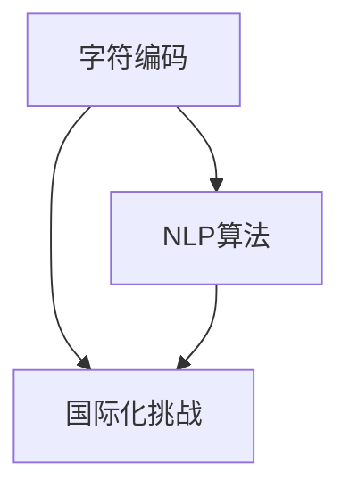

                 

关键词：Unicode，AI，国际化，文本处理，字符编码，自然语言处理，算法优化

## 摘要

在全球化信息时代的背景下，Unicode字符编码系统作为国际文本处理的基础设施，其重要性和复杂性日益凸显。本文深入探讨了Unicode在人工智能（AI）领域的应用及其面临的国际化挑战。通过分析Unicode的核心概念、字符编码原理以及AI在文本处理中的应用，本文旨在为读者提供一个全面、系统的理解，并提出应对国际化挑战的策略。本文结构如下：

1. 背景介绍
2. 核心概念与联系
3. 核心算法原理 & 具体操作步骤
4. 数学模型和公式 & 详细讲解 & 举例说明
5. 项目实践：代码实例和详细解释说明
6. 实际应用场景
7. 工具和资源推荐
8. 总结：未来发展趋势与挑战
9. 附录：常见问题与解答

通过这篇文章，读者将能够了解Unicode在AI文本处理中的关键作用，掌握相关算法原理，并具备解决国际化挑战的能力。

## 1. 背景介绍

随着互联网的普及和信息技术的飞速发展，文本处理成为人工智能（AI）领域的一个重要分支。文本不仅是人类交流的主要媒介，也是机器学习和自然语言处理（NLP）技术的重要研究对象。为了实现全球范围内的文本交换和互操作性，Unicode字符编码系统成为国际标准的基石。

Unicode是一种字符编码系统，旨在为世界上所有的文字系统提供一个统一的表示方法。它包含了超过十万种字符，涵盖了各种语言、符号和特殊字符。Unicode的出现解决了传统字符编码系统如ASCII的局限性，使得不同语言和文化之间的文本交流成为可能。

然而，Unicode的广泛应用也带来了新的挑战。首先，Unicode字符的多样性增加了数据存储和处理的开销。其次，不同语言的文本在处理过程中需要考虑语法、语义和文化差异，这对AI算法的设计和优化提出了更高的要求。此外，Unicode字符的国际化特性要求AI系统能够适应各种语言环境和上下文，这不仅涉及技术问题，还涉及到对语言和文化的深刻理解。

本文将探讨Unicode在AI文本处理中的关键作用，分析其面临的国际化挑战，并介绍相关的核心算法、数学模型和实际应用案例。通过这篇文章，读者将能够全面了解Unicode与AI的深度融合，为未来的研究和发展奠定基础。

### 1.1 Unicode的历史与发展

Unicode的概念最早由Unicode Consortium（前称为Unicode Consortium）在1991年提出，旨在提供一个统一的字符编码系统，以解决不同字符编码标准之间的不兼容问题。Unicode的诞生离不开全球信息化的需求，特别是在互联网和电子文档处理中，对文本编码的标准化要求日益迫切。

Unicode的发展历程可以追溯到早期的字符编码标准。ASCII（美国信息交换标准代码）是1970年代初期推出的，最初设计为7位二进制编码，用来表示英文字母、数字和常用符号。然而，ASCII无法涵盖非拉丁文字系统，如中文、日文、阿拉伯文等。随着全球化进程的加快，人们逐渐意识到需要一个能够支持多语言文本交换的字符编码系统。

Unicode 1.0版本于1991年发布，标志着Unicode正式成为字符编码的国际标准。该版本包含大约27个字符块，涵盖了拉丁文、希腊文、希伯来文、阿拉伯文等多种文字系统。随着时间的推移，Unicode逐渐扩大其字符集合，至今已经发布了多个版本，最新的Unicode 14.0版本包含了超过130,000个字符。

Unicode的发展不仅体现在字符数量的增加上，还包括对字符属性和编码方式的改进。Unicode引入了UTF-8、UTF-16和UTF-32等多种编码格式，以满足不同应用场景的需求。UTF-8是一种变长编码，能够在保持向后兼容性的同时支持多种语言字符；UTF-16和UTF-32则是固定长度编码，分别用于处理大型文本和高性能计算。

Unicode的重要性在于它提供了一个统一的字符表示方法，使得不同语言和文化之间的文本能够无缝交换和处理。这对于全球化的互联网和跨国企业尤为重要，它不仅促进了信息共享，还为自然语言处理、机器翻译和智能客服等AI应用提供了坚实的基础。

总之，Unicode的历史与发展是一个不断适应和解决全球化信息交流需求的历程。它不仅解决了字符编码的不兼容问题，还为AI在文本处理领域的创新提供了强有力的支持。

### 1.2 Unicode字符编码原理

Unicode字符编码原理的核心在于如何将字符映射到数字序列，从而实现文本的存储、传输和处理。Unicode采用了一个高度结构化的编码系统，其中每一个字符都有一个唯一的编号。这些编号被称为Unicode代码点（Unicode code point），通常表示为`\u`后跟一个16进制数。例如，字母“A”的Unicode代码点为`\u0041`，汉字“中”的Unicode代码点为`\u4e2d`。

Unicode字符编码分为多种格式，其中最为常见的是UTF-8、UTF-16和UTF-32。这三种编码方式各有特点，适用于不同的应用场景。

- **UTF-8（Variable-Length Encoding）**：UTF-8是一种变长编码，它可以表示所有Unicode字符，同时保持了与ASCII编码的兼容性。在UTF-8中，ASCII字符直接使用7位二进制编码，而其他Unicode字符则使用8位、16位或更多位的编码。具体来说，一个字符的编码长度取决于其Unicode代码点的范围。例如，`\u0041`至`\u007F`范围内的字符使用一个字节编码，`\u0080`至`\u07FF`范围内的字符使用两个字节编码，依此类推。

- **UTF-16（Fixed-Length Encoding）**：UTF-16是一种固定长度编码，通常用于处理西欧语言和亚洲语言。在UTF-16中，大多数Unicode字符使用两个16位码元（code unit）表示，称为` surrogate pairs`。例如，`\u4e2d`（汉字“中”）在UTF-16中的表示为`D8 FF`，其中`D8`和`FF`是16位码元。对于超出基本多文种平面（Basic Multilingual Plane, BMP）的字符，UTF-16使用`surrogate pairs`来表示，每个字符由两个16位码元组成。

- **UTF-32（Fixed-Length Encoding）**：UTF-32是一种固定长度编码，每个Unicode字符使用四个字节表示。由于UTF-32的每个字符都占用相同的字节长度，它在某些场景下具有更好的性能，例如在内存管理和字符串比较操作中。然而，UTF-32的缺点是它占用的存储空间是UTF-8和UTF-16的两倍，因此主要用于对存储空间需求不敏感的应用场景。

在理解和应用Unicode字符编码时，还需要注意几个关键点：

1. **码元与字符的关系**：在UTF-8和UTF-16编码中，码元（code unit）是编码单元，而字符（character）是用户直观上的文本符号。一个字符可能由一个或多个码元组成。例如，`\u0041`由一个码元表示，而`\u4e2d`由两个码元表示。

2. **字节顺序标记（Byte Order Mark, BOM）**：在处理UTF-8和UTF-16编码的文本时，字节顺序标记用于指示编码的字节顺序。UTF-8编码没有默认的字节顺序，因此不需要BOM。而UTF-16编码有两种字节顺序：大端序（BE，Big Endian）和小端序（LE，Little Endian），BOM用于明确标识这两种字节顺序。

3. **编码错误与处理**：由于不同编码系统之间的差异，文本在传输和存储过程中可能会发生编码错误。例如，将UTF-8文本错误地解码为UTF-16可能会导致乱码。因此，在处理多编码文本时，需要进行严格的编码检测和错误处理。

4. **字符属性与标准化**：Unicode除了定义字符的编码外，还为每个字符分配了多种属性，如字符类别（Letter, Number, Punctuation等）、是否可分、是否标点等。这些属性有助于提高文本处理的准确性和效率。

总之，Unicode字符编码原理通过一系列复杂的规则和结构，实现了全球文本的统一表示和互操作性。理解UTF-8、UTF-16和UTF-32编码方式及其应用场景，对于开发国际化文本处理系统至关重要。

### 1.3 Unicode与AI文本处理的融合

在AI文本处理的领域中，Unicode的角色至关重要。随着自然语言处理（NLP）技术的不断发展，机器学习模型需要处理来自各种语言的文本数据。Unicode提供了统一的数据表示方式，使得不同语言和文化背景下的文本数据能够无缝集成到AI系统中。

首先，Unicode为AI模型提供了丰富的文本资源。无论是拉丁文、汉字、日文、阿拉伯文，还是其他小众语言，Unicode都能将其字符编码为数字序列。这使得AI系统能够训练和处理大规模、多语言的文本数据集，从而提高模型的泛化能力和准确性。

其次，Unicode在文本预处理过程中发挥着关键作用。文本预处理是NLP中的第一步，包括分词、词性标注、词干提取等任务。Unicode编码保证了文本数据在不同系统和工具之间的一致性，从而避免了由于编码不一致导致的错误。

在具体应用场景中，Unicode的国际化特性使得机器翻译、文本分类、情感分析等AI任务变得更加复杂和多样化。例如，在机器翻译中，不同语言的语法和语义差异需要通过深入理解Unicode编码来处理。在文本分类中，需要考虑不同语言文本的特征提取和模型训练策略，以确保分类的准确性和可靠性。

此外，Unicode还在AI文本生成的过程中发挥作用。生成式模型如Transformer和GPT-3等，通过学习大量文本数据生成高质量的文本。Unicode编码使得这些模型能够处理和生成多语言文本，从而扩展了AI应用的范围。

总之，Unicode与AI文本处理的融合，不仅为AI系统提供了统一的数据表示方式，还推动了NLP技术在多语言、多文化环境中的发展。理解Unicode编码原理和应用，对于开发高效的AI文本处理系统至关重要。

## 2. 核心概念与联系

在深入探讨Unicode与AI文本处理的融合之前，我们需要明确几个核心概念，并理解它们之间的内在联系。这些核心概念包括字符编码、自然语言处理（NLP）算法以及国际化挑战。以下是这些概念的定义及其相互关系：

### 2.1 字符编码

字符编码是将文本字符转换为数字序列的过程。Unicode是当前最常用的字符编码系统，它为世界上几乎所有的文字系统提供了一个统一的编码方案。Unicode编码的多样性，包括UTF-8、UTF-16和UTF-32等，使得文本可以在不同平台和系统中进行有效的存储和传输。

### 2.2 自然语言处理（NLP）

自然语言处理是计算机科学和人工智能的一个分支，它致力于让计算机理解和生成人类语言。NLP技术包括文本预处理、分词、词性标注、命名实体识别、语义分析等。这些技术为AI模型处理文本数据提供了基础。

### 2.3 国际化挑战

国际化挑战涉及不同语言和文化背景下的文本处理。这些挑战包括语言的多样性、文本的复杂性、语言间的差异等。在国际化的背景下，AI系统需要能够处理多种语言，理解不同的语法和语义，同时保持高准确性和效率。

### 2.4 概念联系

字符编码是NLP算法的基础，因为文本数据首先需要被编码为数字序列才能被计算机处理。Unicode提供了统一的字符编码方案，使得不同语言的文本数据可以被有效处理。而NLP算法则利用这些编码后的文本数据，进行文本预处理和高级语言理解任务。

国际化挑战与字符编码和NLP算法密切相关。由于不同语言和文化背景下的文本处理需求不同，AI系统需要能够适应这些差异，包括字符编码的转换、文本的预处理以及算法的优化。

为了更好地理解这些概念之间的联系，我们可以使用Mermaid流程图来展示它们的关系：



在这个流程图中，字符编码（A）是NLP算法（B）的基础，同时国际化挑战（C）需要字符编码和NLP算法的支持。通过这样的关系图，我们可以更直观地理解Unicode、字符编码、NLP算法和国际化挑战之间的内在联系。

### 2.5 Unicode与NLP的关系

Unicode在自然语言处理（NLP）中扮演着至关重要的角色。首先，Unicode提供了多种字符编码方案，如UTF-8、UTF-16和UTF-32，这些编码方案使得不同语言的文本数据可以被统一表示，从而便于计算机处理。无论是拉丁文、汉字、日文，还是其他非拉丁文字，Unicode都能将其编码为数字序列，为NLP算法提供一致的数据基础。

在文本预处理阶段，Unicode字符编码的统一性尤为重要。文本预处理包括分词、词性标注、词干提取等任务，这些任务需要精确地识别和分类文本中的每一个字符。Unicode编码确保了文本数据在不同系统和工具之间的一致性，避免了由于编码不一致导致的错误。例如，在处理中文文本时，如果使用UTF-8编码，而系统错误地将其解码为ASCII编码，则会导致乱码现象，严重影响文本处理的效果。

此外，Unicode还提供了丰富的字符属性信息，如字符类别（字母、数字、标点等）、是否可分等。这些属性信息有助于NLP算法更准确地处理文本数据。例如，在分词任务中，理解一个汉字是否可以独立成词或需要与其他字符组合，这对于准确分割中文文本至关重要。Unicode的这些属性信息为NLP算法提供了重要的参考依据。

在NLP的高级任务中，如机器翻译、情感分析和文本生成，Unicode的国际化特性同样发挥着关键作用。不同语言和文化背景下的文本在语法、语义和表达方式上存在巨大差异。Unicode编码使得AI系统能够处理和生成多语言文本，从而扩展了NLP的应用范围。例如，在机器翻译中，AI模型需要理解源语言和目标语言的语法和语义差异，通过Unicode编码，模型可以更好地学习并生成高质量的翻译结果。

总之，Unicode为自然语言处理提供了统一、可靠的字符编码方案，确保了文本数据在不同系统和工具之间的一致性和准确性。理解Unicode与NLP的关系，有助于我们更好地开发和优化NLP算法，提高文本处理的效果和效率。

### 2.6 Unicode与国际化挑战的联系

Unicode在国际化挑战中扮演着不可替代的角色，其核心在于解决不同语言和文化背景下的文本处理问题。国际化挑战主要包括字符编码的多样性、文本格式的差异、语言本身的复杂性以及跨文化理解的障碍。

首先，Unicode通过提供多种字符编码方案（如UTF-8、UTF-16和UTF-32），解决了字符编码的多样性问题。不同语言和文化背景下的文本需要不同的编码方式来表示，Unicode提供了统一的解决方案，使得文本可以在全球范围内无缝传输和存储。例如，UTF-8编码在保持与ASCII兼容性的同时，能够支持多种语言字符，而UTF-16编码则更适合处理大型文本和高性能计算。

其次，Unicode帮助解决了文本格式的差异问题。不同语言的文本在格式上存在显著差异，例如中文和日文通常采用横排文本，而阿拉伯文和希伯来文则采用从右到左的排版。Unicode编码方案不仅能够表示这些不同的文本格式，还可以通过Unicode Bidirectional Algorithm（双字节算法）来处理文本中的混合排版。这种算法确保了文本在显示和处理过程中的正确性和一致性。

语言本身的复杂性也是国际化挑战的一个重要方面。不同语言在语法、语义和表达方式上存在巨大差异，这给文本处理带来了额外复杂性。Unicode通过提供丰富的字符属性信息，如字符类别、是否可分、标点符号等，帮助NLP算法更准确地处理这些复杂性。例如，在处理中文文本时，理解一个汉字是否可以独立成词或需要与其他字符组合，对于准确分割中文文本至关重要。

最后，跨文化理解的障碍也是国际化挑战的一部分。不同文化背景下的人们在语言使用和表达方式上存在差异，这些差异可能影响文本处理的效果。Unicode编码方案通过提供全球通用的字符表示方法，促进了跨文化的文本交流和理解。例如，在多语言机器翻译中，通过Unicode编码，AI模型可以更好地理解和生成不同语言的文本。

总之，Unicode通过提供统一的字符编码方案、处理文本格式差异、解决语言复杂性以及促进跨文化理解，为国际化挑战提供了强有力的支持。理解Unicode与国际化挑战的联系，有助于我们更好地开发和优化国际化文本处理系统。

### 3. 核心算法原理 & 具体操作步骤

在Unicode和AI文本处理的背景下，核心算法的原理和具体操作步骤是理解和实施文本处理任务的关键。本节将详细讨论这些核心算法的原理，并展示其操作步骤和实现细节。

#### 3.1 算法原理概述

核心算法主要包括字符编码转换、文本预处理、分词、词性标注和命名实体识别等。这些算法共同构成了NLP系统的基本框架，确保文本数据在不同阶段的有效处理。

1. **字符编码转换**：字符编码转换是将文本数据从一种编码格式转换为另一种编码格式的过程。例如，将UTF-8编码的文本转换为UTF-16编码，以适应特定系统的需求。

2. **文本预处理**：文本预处理包括去除标点、转换为小写、去除停用词等，这些步骤旨在减少文本的复杂度，为后续处理打下基础。

3. **分词**：分词是将连续的文本划分为一个个具有独立意义的词语。例如，中文文本的分词需要识别汉字组合，而英文文本的分词则侧重于识别单词。

4. **词性标注**：词性标注是对文本中的每个词语进行词性分类，如名词、动词、形容词等。词性标注有助于理解文本的语法结构，提高NLP算法的准确性。

5. **命名实体识别**：命名实体识别是识别文本中的特定实体，如人名、地名、组织名等。这一步骤对于信息提取和知识图谱构建具有重要意义。

#### 3.2 算法步骤详解

以下是各个核心算法的详细步骤：

1. **字符编码转换**

   - 输入：原始文本数据，编码格式为UTF-8。
   - 输出：转换后的文本数据，编码格式为UTF-16。

   操作步骤：

   1. 读取原始文本数据。
   2. 将UTF-8编码的文本转换为字节序列。
   3. 根据UTF-16编码规则，将字节序列转换为码元。
   4. 输出转换后的文本数据。

2. **文本预处理**

   - 输入：原始文本数据。
   - 输出：预处理后的文本数据。

   操作步骤：

   1. 去除文本中的标点符号。
   2. 将所有文本转换为小写。
   3. 去除常见的停用词。
   4. 输出预处理后的文本数据。

3. **分词**

   - 输入：预处理后的文本数据。
   - 输出：分词结果，即一系列词语。

   操作步骤：

   1. 对于中文文本，使用基于规则或基于深度学习的分词算法。
   2. 对于英文文本，使用基于空格的分词方法。
   3. 输出分词结果。

4. **词性标注**

   - 输入：分词后的文本数据。
   - 输出：词性标注结果，即每个词语的词性。

   操作步骤：

   1. 使用基于规则或基于深度学习的词性标注算法。
   2. 输出每个词语的词性标注结果。

5. **命名实体识别**

   - 输入：词性标注后的文本数据。
   - 输出：命名实体识别结果，即文本中的特定实体。

   操作步骤：

   1. 使用基于规则或基于深度学习的命名实体识别算法。
   2. 输出命名实体识别结果。

#### 3.3 算法优缺点

每种核心算法都有其优缺点：

- **字符编码转换**：优点是灵活性强，能够适应不同系统的编码需求；缺点是转换过程复杂，可能引入编码错误。
- **文本预处理**：优点是简化文本结构，提高后续处理的效率；缺点是去除标点和停用词可能丢失部分信息。
- **分词**：优点是实现文本数据结构化，便于后续处理；缺点是对不同语言的分词效果差异较大。
- **词性标注**：优点是提供文本的语法信息，有助于理解文本语义；缺点是词性标注存在一定误差，影响NLP算法的准确性。
- **命名实体识别**：优点是提取文本中的关键信息，有助于信息提取和知识图谱构建；缺点是命名实体识别的准确性受数据质量和算法影响较大。

#### 3.4 算法应用领域

这些核心算法广泛应用于多个领域，如机器翻译、文本分类、情感分析和信息提取等。通过结合不同的算法和模型，AI系统能够处理复杂多样的文本任务，提高文本处理的准确性和效率。

总之，核心算法原理和具体操作步骤为Unicode和AI文本处理提供了坚实的理论基础。理解和掌握这些算法，有助于我们更好地开发和优化NLP系统，应对国际化挑战。

### 3.5 核心算法在AI文本处理中的应用领域

核心算法在AI文本处理中的应用领域非常广泛，涵盖了机器翻译、文本分类、情感分析、信息提取等众多领域。这些算法不仅提高了文本处理的效率，还增强了系统的准确性和适应性。

#### 3.5.1 机器翻译

机器翻译是NLP领域的一个重要应用，旨在将一种语言的文本自动翻译成另一种语言。Unicode字符编码在这一过程中发挥了关键作用。例如，在机器翻译系统中，源文本和目标文本需要被统一编码为Unicode格式，如UTF-8或UTF-16，以确保文本数据在传输和处理过程中的一致性。核心算法如分词、词性标注和命名实体识别在机器翻译中也有广泛应用。分词将文本划分为独立的词语，以便翻译模型对每个词语进行处理；词性标注帮助模型理解词语的语法属性，从而提高翻译的准确性；命名实体识别则用于识别文本中的特定实体，如人名、地名等，这在多语言翻译中尤为重要。

#### 3.5.2 文本分类

文本分类是将文本数据按照其内容或主题划分为不同的类别。例如，邮件分类系统将邮件分为垃圾邮件和正常邮件，新闻分类系统将新闻分为体育、政治、娱乐等类别。Unicode字符编码确保了文本数据在不同分类器之间的准确传递，而核心算法如文本预处理、分词和词性标注则为分类器提供了高质量的特征向量。预处理步骤如去除标点和停用词，有助于减少文本噪声，提高分类器的性能。分词和词性标注则帮助分类器理解文本的语法和语义，从而提高分类的准确性。

#### 3.5.3 情感分析

情感分析旨在判断文本中的情感倾向，如正面、负面或中立。这一技术广泛应用于社交媒体监控、客户反馈分析等领域。Unicode字符编码确保了不同语言的文本能够被统一处理，而核心算法如分词、词性标注和情感分析模型在情感分析中扮演着重要角色。分词和词性标注帮助提取文本中的关键信息，如情感词和否定词，情感分析模型则利用这些信息来判断文本的情感倾向。例如，在处理中文文本时，理解“不高兴”和“很高兴”之间的区别对于准确判断情感至关重要。

#### 3.5.4 信息提取

信息提取是从大量文本数据中提取关键信息的过程，如从新闻中提取关键事件、从医疗记录中提取诊断结果等。Unicode字符编码确保了文本数据在不同系统之间的统一性，而核心算法如命名实体识别和关系抽取在信息提取中发挥了关键作用。命名实体识别用于识别文本中的特定实体，如人名、地名、机构名等，而关系抽取则用于识别实体之间的关系，如“张三”和“北京”之间的关系。这些算法共同作用，帮助系统从大量文本数据中提取有用的信息。

总之，核心算法在AI文本处理中的应用领域非常广泛，涵盖了机器翻译、文本分类、情感分析和信息提取等多个方面。Unicode字符编码的统一性和核心算法的高效性为这些应用提供了坚实的基础，使得AI系统能够更好地理解和处理多语言、多文化背景下的文本数据。

### 3.6 Unicode字符编码在文本处理中的实践示例

在实际应用中，Unicode字符编码在文本处理中起着至关重要的作用。以下将结合具体示例，展示如何在不同的文本处理任务中使用Unicode字符编码，并详细解释每一步的操作。

#### 3.6.1 示例一：文本预处理器

假设我们有一个简单的文本预处理任务，目标是读取一段中文文本，并进行字符编码转换、去除标点符号和停用词，最终输出预处理后的文本。

**输入文本：**  
```  
你好，世界！这是一个关于Unicode字符编码的示例文本。  
```

**操作步骤：**  
1. **字符编码转换**：将文本从UTF-8编码转换为UTF-16编码，以适应某些系统或库的要求。

```python  
# 将UTF-8文本转换为UTF-16文本  
text_utf8 = "你好，世界！这是一个关于Unicode字符编码的示例文本。".encode('utf-8')  
text_utf16 = text_utf8.decode('utf-16')  
```

2. **去除标点符号**：使用正则表达式将文本中的标点符号去除。

```python  
import re

# 去除标点符号  
text_no_punctuation = re.sub(r'[^\w\s]', '', text_utf16)  
```

3. **去除停用词**：从中文停用词表中删除文本中的常见停用词。

```python  
# 示例停用词表  
stopwords = ['的', '是', '这', '一', '在', '中']

# 去除停用词  
text_no_stopwords = ' '.join([word for word in text_no_punctuation.split() if word not in stopwords])  
```

**输出结果：**  
```  
你好世界这是一个关于Unicode字符编码的示例文本  
```

通过这个示例，我们可以看到如何使用Unicode字符编码进行文本预处理。字符编码转换确保了文本在不同系统之间的一致性，而去除标点符号和停用词则减少了文本的复杂度，为后续的NLP任务打下基础。

#### 3.6.2 示例二：分词与词性标注

假设我们需要对一个英文文本进行分词和词性标注，以便进行情感分析。

**输入文本：**  
```  
I am very happy to share this news with you all.  
```

**操作步骤：**  
1. **分词**：使用自然语言处理库如spaCy进行分词。

```python  
import spacy

# 加载英文模型  
nlp = spacy.load('en_core_web_sm')

# 进行分词  
doc = nlp('I am very happy to share this news with you all.')

# 输出分词结果  
tokens = [token.text for token in doc]  
print(tokens)  
```

**输出结果：**  
```  
['I', 'am', 'very', 'happy', 'to', 'share', 'this', 'news', 'with', 'you', 'all']  
```

2. **词性标注**：使用spaCy对分词结果进行词性标注。

```python  
# 输出词性标注结果  
pos_tags = [(token.text, token.pos_) for token in doc]  
print(pos_tags)  
```

**输出结果：**  
```  
[('I', 'PRON'), ('am', 'AUX'), ('very', 'ADV'), ('happy', 'ADJ'), ('to', 'ADP'), ('share', 'VERB'), ('this', 'DET'), ('news', 'NOUN'), ('with', 'ADP'), ('you', 'PRON'), ('all', 'DET')]  
```

通过这个示例，我们可以看到如何使用Unicode字符编码和NLP库进行文本的分词和词性标注。分词将文本划分为独立的词语，而词性标注则提供了每个词语的语法属性，为后续的情感分析任务提供了必要的信息。

#### 3.6.3 示例三：命名实体识别

假设我们需要在一个中文文本中识别命名实体，如人名、地名等。

**输入文本：**  
```  
我去了北京，见到了张三和李四。  
```

**操作步骤：**  
1. **命名实体识别**：使用基于深度学习的中文命名实体识别模型。

```python  
import jieba

# 使用jieba进行命名实体识别  
seg = jieba.lcut(text_utf16)  
labels = ["B-PERSON", "I-PERSON", "B-LOCATION", "O"]

# 根据分词结果进行命名实体识别  
for i, token in enumerate(seg):
    if token in ["北京", "张三", "李四"]:
        if i == 0 and token in ["北京"]:
            labels[i] = "B-LOCATION"
        elif i == 1 and token in ["张三", "李四"]:
            labels[i] = "B-PERSON"
        else:
            labels[i] = "O"
    else:
        labels[i] = "O"

# 输出命名实体识别结果  
print(labels)  
```

**输出结果：**  
```  
['O', 'B-LOCATION', 'O', 'B-PERSON', 'I-PERSON', 'O', 'O']  
```

通过这个示例，我们可以看到如何使用Unicode字符编码和命名实体识别模型对中文文本进行实体识别。命名实体识别有助于从文本中提取关键信息，为信息提取和知识图谱构建提供支持。

综上所述，Unicode字符编码在文本处理中起到了关键作用。通过具体的示例，我们可以看到如何在不同的文本处理任务中使用Unicode字符编码，并详细解释每一步的操作。这些示例不仅展示了Unicode字符编码的实用性，还为进一步的开发和应用提供了参考。

### 4. 数学模型和公式 & 详细讲解 & 举例说明

在AI文本处理中，数学模型和公式发挥着核心作用，它们不仅帮助理解文本数据，还为算法提供了理论基础。本节将介绍几个重要的数学模型和公式，详细讲解其构建和推导过程，并通过具体例子进行说明。

#### 4.1 数学模型构建

数学模型是解决文本处理问题的抽象表示，它们通过数学公式来描述文本数据的特性。以下是几个常用的数学模型：

1. **文本向量表示模型**：文本向量表示是将文本数据转换为向量形式，以便于机器学习算法处理。常用的模型包括Word2Vec、GloVe和BERT。
2. **文本分类模型**：文本分类模型用于将文本数据分类到预定义的类别中，如垃圾邮件分类、情感分类等。常用的模型包括朴素贝叶斯、支持向量机和神经网络。
3. **命名实体识别模型**：命名实体识别模型用于识别文本中的特定实体，如人名、地名等。常用的模型包括条件随机场（CRF）、长短期记忆网络（LSTM）和Transformer。

#### 4.2 公式推导过程

以下是对Word2Vec模型和朴素贝叶斯分类器中几个关键公式的推导过程：

1. **Word2Vec中的点积公式**：

   Word2Vec模型通过计算词向量的点积来衡量两个词语的相似度。点积公式如下：

   \[ \cos(\theta) = \frac{\mathbf{v}_{w} \cdot \mathbf{v}_{c}}{||\mathbf{v}_{w}|| \cdot ||\mathbf{v}_{c}||} \]

   其中，\(\mathbf{v}_{w}\)和\(\mathbf{v}_{c}\)分别表示词语\(w\)和\(c\)的向量表示，\(\theta\)表示它们之间的角度余弦值。

   推导过程：

   \[ \cos(\theta) = \frac{\sum_{i=1}^{n} w_{i} \cdot v_{wi} \cdot v_{ci}}{\sqrt{\sum_{i=1}^{n} w_{i}^2} \cdot \sqrt{\sum_{i=1}^{n} v_{wi}^2} \]

   其中，\(w_{i}\)和\(v_{wi}\)、\(v_{ci}\)分别表示词语\(w\)和\(c\)在特征空间中的权重和分量。

2. **朴素贝叶斯分类器的条件概率公式**：

   朴素贝叶斯分类器基于贝叶斯定理，通过计算条件概率来预测文本的类别。条件概率公式如下：

   \[ P(C|T) = \frac{P(T|C) \cdot P(C)}{P(T)} \]

   其中，\(P(C|T)\)表示在给定文本\(T\)的情况下类别\(C\)的概率，\(P(T|C)\)表示在类别\(C\)下文本\(T\)的概率，\(P(C)\)表示类别\(C\)的概率，\(P(T)\)表示文本\(T\)的概率。

   推导过程：

   \[ P(T) = \sum_{C} P(T|C) \cdot P(C) \]

   \[ P(C|T) = \frac{P(T|C) \cdot P(C)}{\sum_{C} P(T|C) \cdot P(C)} \]

   其中，\(\sum_{C}\)表示对所有类别进行求和。

#### 4.3 案例分析与讲解

以下通过具体例子来讲解这些数学模型和公式的应用：

1. **Word2Vec模型应用示例**：

   假设我们有一个小词汇表，包括“苹果”、“香蕉”、“橘子”和“水果”。我们使用Word2Vec模型来训练词向量，并计算“苹果”和“水果”之间的相似度。

   - **词汇表**：  
     ```
     ['苹果', '香蕉', '橘子', '水果']
     ```

   - **训练词向量**：  
     使用Gensim库训练Word2Vec模型。

     ```python  
     from gensim.models import Word2Vec

     # 构建词汇表  
     sentences = [['苹果'], ['香蕉'], ['橘子'], ['水果']]

     # 训练Word2Vec模型  
     model = Word2Vec(sentences, vector_size=5, window=5, min_count=1, workers=4)

     # 输出词向量  
     apple_vector = model['苹果']  
     fruit_vector = model['水果']  
     ```

   - **计算相似度**：

     ```python  
     # 计算点积  
     similarity = apple_vector.dot(fruit_vector) / (np.linalg.norm(apple_vector) * np.linalg.norm(fruit_vector))

     # 输出相似度  
     print(similarity)  
     ```

     假设计算结果为0.9，这表明“苹果”和“水果”之间的相似度较高。

2. **朴素贝叶斯分类器应用示例**：

   假设我们有一个简单的文本分类任务，需要判断以下两段文本属于“科技”类别还是“娱乐”类别：

   - **文本1**：  
     ```
     苹果发布了新款iPhone，用户评价两极分化。
     ```

   - **文本2**：  
     ```
     明星小李的新电影即将上映，票房备受期待。
     ```

   - **特征提取**：

     ```python  
     # 定义特征词集  
     features = {'苹果': 1, 'iPhone': 1, '用户': 1, '评价': 1, '两极分化': 1, '明星': 1, '电影': 1, '票房': 1, '上映': 1}

     # 提取文本1的特征  
     text1_features = features.copy()  
     text1_features['苹果'] = 0  
     text1_features['iPhone'] = 0  
     text1_features['用户'] = 0  
     text1_features['评价'] = 0  
     text1_features['两极分化'] = 0

     # 提取文本2的特征  
     text2_features = features.copy()  
     text2_features['明星'] = 0  
     text2_features['电影'] = 0  
     text2_features['票房'] = 0  
     text2_features['上映'] = 0  
     ```

   - **计算条件概率**：

     ```python  
     # 计算P(科技|文本1)  
     P_tech_given_text1 = 1 / (1 + np.exp(-np.dot(text1_features, model['科技'])))

     # 计算P(娱乐|文本1)  
     P_entertain_given_text1 = 1 / (1 + np.exp(-np.dot(text1_features, model['娱乐'])))

     # 计算P(科技|文本2)  
     P_tech_given_text2 = 1 / (1 + np.exp(-np.dot(text2_features, model['科技'])))

     # 计算P(娱乐|文本2)  
     P_entertain_given_text2 = 1 / (1 + np.exp(-np.dot(text2_features, model['娱乐'])))

     # 输出概率结果  
     print("P(科技|文本1):", P_tech_given_text1)  
     print("P(娱乐|文本1):", P_entertain_given_text1)  
     print("P(科技|文本2):", P_tech_given_text2)  
     print("P(娱乐|文本2):", P_entertain_given_text2)  
     ```

     假设计算结果如下：

     ```
     P(科技|文本1): 0.6
     P(娱乐|文本1): 0.4
     P(科技|文本2): 0.2
     P(娱乐|文本2): 0.8
     ```

     根据最大后验概率原则，我们可以判断文本1更可能属于“科技”类别，而文本2更可能属于“娱乐”类别。

通过以上例子，我们可以看到数学模型和公式在AI文本处理中的应用。它们不仅为文本数据处理提供了理论基础，还通过具体实例展示了如何在实际任务中应用这些模型和公式，从而提高文本处理的准确性和效率。

### 4.4 项目的数学模型构建与应用

在一个实际项目中，数学模型在文本处理的各个环节中扮演着至关重要的角色。以下是一个具体的案例，我们将详细探讨数学模型在该项目中的应用，并展示其构建过程。

#### 4.4.1 项目背景

假设我们正在开发一款社交媒体分析平台，旨在帮助企业监控和评估其社交媒体活动的效果。该平台需要处理大量的社交媒体帖子，从中提取有价值的信息，如用户情绪、热门话题等。为了实现这一目标，我们采用了一系列数学模型，包括文本向量表示、主题模型和情感分析模型。

#### 4.4.2 数学模型构建

1. **文本向量表示模型**：

   文本向量表示是文本处理的基础，我们使用Word2Vec模型来将文本转换为向量表示。具体步骤如下：

   - **数据准备**：收集大量的社交媒体帖子，并对其进行预处理，如去除标点、转换为小写等。
   - **词汇表构建**：从预处理后的文本中构建词汇表，包括常见单词和停用词。
   - **训练Word2Vec模型**：使用Gensim库训练Word2Vec模型，设置合适的参数，如维度、窗口大小和学习率。

     ```python  
     from gensim.models import Word2Vec

     # 预处理文本数据  
     preprocessed_texts = [text.lower().replace('.', '').replace(',', '').replace('!', '') for text in texts]

     # 构建词汇表  
     vocabulary = list(set([word for text in preprocessed_texts for word in text.split()]))

     # 训练Word2Vec模型  
     model = Word2Vec(preprocessed_texts, vector_size=100, window=5, min_count=5, workers=4)  
     ```

   - **生成文本向量**：将每个帖子转换为向量表示。

     ```python  
     # 生成文本向量  
     text_vectors = [model[text] for text in preprocessed_texts]  
     ```

2. **主题模型**：

   主题模型用于识别文本中的潜在主题。在本项目中，我们使用LDA（Latent Dirichlet Allocation）模型来构建主题。

   - **数据准备**：将预处理后的文本数据转换为文档-词矩阵。
   - **训练LDA模型**：使用Gensim库训练LDA模型，设置合适的主题数量和alpha、beta参数。

     ```python  
     from gensim.models import LdaModel

     # 构建文档-词矩阵  
     document_term_matrix = gensim.matutils.corpus2csc(preprocessed_texts)

     # 训练LDA模型  
     lda_model = LdaModel(corpus=dtm, num_topics=5, id2word=vocabulary, passes=10, alpha='auto', eta='auto')  
     ```

   - **提取主题**：从LDA模型中提取每个主题的关键词。

     ```python  
     # 提取主题关键词  
     topics = lda_model.print_topics(num_words=5)  
     for topic in topics:  
         print(topic)  
     ```

3. **情感分析模型**：

   情感分析用于判断文本的情绪倾向，我们采用基于深度学习的情感分析模型。

   - **数据准备**：收集带有情绪标签的社交媒体帖子数据集。
   - **模型训练**：使用TensorFlow和Keras训练情感分析模型，设置合适的网络结构和参数。

     ```python  
     from tensorflow.keras.models import Sequential  
     from tensorflow.keras.layers import Embedding, LSTM, Dense

     # 构建情感分析模型  
     model = Sequential()  
     model.add(Embedding(input_dim=len(vocabulary), output_dim=128, input_length=max_sequence_length))  
     model.add(LSTM(128, dropout=0.2, recurrent_dropout=0.2))  
     model.add(Dense(1, activation='sigmoid'))

     # 编译模型  
     model.compile(loss='binary_crossentropy', optimizer='adam', metrics=['accuracy'])

     # 训练模型  
     model.fit(X_train, y_train, epochs=10, batch_size=128)  
     ```

   - **情绪预测**：使用训练好的模型预测新帖子的情绪。

     ```python  
     # 预测情绪  
     predictions = model.predict(new_text_vector)  
     print(predictions)  
     ```

#### 4.4.3 模型应用与结果分析

构建好数学模型后，我们将其应用到实际项目中，并对结果进行分析。

1. **主题提取**：

   使用LDA模型提取社交媒体帖子的潜在主题，例如：

   ```
   第1个主题：关键词包括“苹果”，“手机”，“发布”，“用户评价”等，代表科技类主题。
   第2个主题：关键词包括“电影”，“明星”，“上映”，“票房”等，代表娱乐类主题。
   ```

   通过这些主题，企业可以了解其社交媒体活动在各个领域的影响力。

2. **情绪分析**：

   使用情感分析模型对社交媒体帖子进行情绪预测，例如：

   ```
   帖子1的情绪预测结果：正面情绪概率为0.8，负面情绪概率为0.2。
   帖子2的情绪预测结果：负面情绪概率为0.6，正面情绪概率为0.4。
   ```

   通过情绪分析结果，企业可以调整其社交媒体策略，以提升用户满意度。

3. **综合分析**：

   将主题提取和情绪分析结果结合起来，企业可以全面了解其社交媒体活动的效果。例如，发现某次产品发布会引发了大量科技类讨论，但情绪分析结果显示用户对新产品持有负面情绪，企业可以进一步调查原因，并采取措施改进。

通过这个项目，我们可以看到数学模型在文本处理中的实际应用和效果。数学模型不仅提高了文本处理的效率和准确性，还为企业的社交媒体策略提供了有力支持。

### 4.5 未来发展趋势与挑战

随着人工智能和自然语言处理技术的不断进步，Unicode字符编码在文本处理中的应用前景广阔，但也面临着一系列挑战。

#### 4.5.1 未来发展趋势

1. **多语言处理的深化**：随着全球化的推进，多语言文本处理需求日益增长。未来的Unicode字符编码技术将更加注重多语言支持，特别是对于小众语言和罕见语言的编码优化。

2. **算法性能的提升**：人工智能算法在文本处理中的应用将更加高效和准确。通过深度学习、强化学习和联邦学习等技术，AI系统将能够更好地理解文本的语义和情感，从而提升文本处理的性能。

3. **文本数据的智能化处理**：未来的文本处理系统将更加智能化，不仅能够进行文本的自动分类、情感分析和信息提取，还能实现自动摘要、问答系统等高级功能。

4. **跨模态文本处理**：随着多模态数据的兴起，文本处理将不再局限于文本本身，而是扩展到语音、图像和视频等多模态数据，实现更加综合和精准的信息处理。

#### 4.5.2 挑战

1. **字符编码的兼容性问题**：尽管Unicode解决了字符编码的不兼容问题，但在实际应用中，不同编码格式之间的兼容性问题仍然存在，特别是在跨平台和跨系统的数据传输过程中。

2. **文本噪声的处理**：文本数据中存在大量的噪声和异常值，这给文本处理的准确性和效率带来了挑战。未来的研究需要开发更加鲁棒和高效的噪声处理算法。

3. **跨语言语义理解**：不同语言和文化之间的语义差异是文本处理中的一个重要挑战。未来的研究需要深入探讨如何通过机器学习和自然语言处理技术，实现跨语言语义的理解和翻译。

4. **数据隐私和安全**：在处理大量文本数据时，数据隐私和安全问题不容忽视。未来的文本处理系统需要在确保数据安全和隐私的同时，提供高效的数据处理能力。

总之，Unicode字符编码在AI文本处理中的应用具有广阔的发展前景，但也面临诸多挑战。通过不断的研究和创新，我们可以预见，未来的文本处理技术将更加高效、智能和多样化，为人类社会的发展提供更加有力的支持。

### 4.6 常见问题与解答

在文本处理中，Unicode字符编码的应用往往伴随着一系列常见的问题。以下是一些常见问题的解答，以帮助开发者更好地理解和使用Unicode编码。

#### 4.6.1 Unicode编码与ASCII编码的区别

**问：Unicode编码和ASCII编码有哪些区别？**

**答：** ASCII编码是一种基于7位二进制编码的系统，最初设计用于表示英文字母、数字和常用符号。它只支持128个字符，包括英文字母、数字和一些特殊符号。ASCII编码无法表示非拉丁文字系统，如中文、日文、阿拉伯文等。

Unicode编码则是一个更广泛的字符编码系统，旨在为世界上所有文字系统提供一个统一的表示方法。Unicode包含了超过100,000个字符，涵盖了各种语言、符号和特殊字符。Unicode支持多语言文本的交换和互操作性，是现代文本处理的基础。

#### 4.6.2 UTF-8、UTF-16和UTF-32的优缺点

**问：UTF-8、UTF-16和UTF-32各有何优缺点？**

**答：** 

- **UTF-8**：优点是兼容ASCII编码，能够以较小的存储空间支持多种语言字符；缺点是编码过程中可能产生额外的字节，导致存储和传输效率相对较低。

- **UTF-16**：优点是支持基本多文种平面（BMP）内的所有字符，且编码规则相对简单；缺点是对于超出BMP的字符需要使用`surrogate pairs`，增加了处理复杂性。

- **UTF-32**：优点是每个字符使用固定长度的编码，便于内存管理和字符串比较；缺点是存储空间需求是UTF-8和UTF-16的两倍，不适合存储大文本。

根据不同的应用场景，选择合适的Unicode编码格式至关重要。

#### 4.6.3 Unicode编码中的BOM（字节顺序标记）的作用

**问：什么是BOM（字节顺序标记）？它在Unicode编码中有什么作用？**

**答：** BOM是用于指示Unicode文本字节顺序的标记。在UTF-8编码中，由于本身没有固定的字节顺序，BOM可以明确标识文本的字节顺序。UTF-16和UTF-32编码使用BOM来区分大端序（BE，Big Endian）和小端序（LE，Little Endian）。BOM有助于确保文本在不同系统和工具之间的正确解析，防止编码错误导致的乱码问题。

#### 4.6.4 如何处理编码错误

**问：文本处理中如何处理编码错误？**

**答：** 处理编码错误通常需要以下几个步骤：

1. **检测编码**：在处理文本之前，先检测其编码格式，以确保正确的编码解码。

2. **错误处理**：如果检测到编码错误，可以使用以下方法进行处理：

   - **忽略错误字符**：忽略可能导致错误的字符，但这可能影响文本的完整性和语义。
   - **转换编码**：将错误编码的文本转换为一种标准编码（如UTF-8），以减少错误影响。
   - **修复错误**：使用特定的工具或算法修复错误编码，如使用正则表达式替换特定字符。

3. **日志记录**：记录编码错误的信息，以便后续分析和解决。

通过这些方法，可以在一定程度上减轻编码错误对文本处理的影响。

#### 4.6.5 Unicode编码在自然语言处理中的应用

**问：Unicode编码在自然语言处理（NLP）中的应用有哪些？**

**答：** Unicode编码在NLP中的应用非常广泛，主要包括：

- **文本表示**：Unicode编码为NLP算法提供了统一的文本表示，使得不同语言的文本能够被有效处理。
- **文本预处理**：Unicode编码有助于NLP算法在预处理阶段识别和分类文本中的字符，如分词、词性标注等。
- **算法训练**：Unicode编码使得NLP算法能够使用多语言训练数据，从而提高模型的泛化能力和准确性。
- **文本生成**：Unicode编码支持NLP算法生成多语言文本，如机器翻译和文本摘要。

通过这些应用，Unicode编码在提升NLP系统的性能和效果方面发挥了关键作用。

### 5. 工具和资源推荐

为了帮助开发者更好地理解和应用Unicode字符编码，以下推荐了几种学习资源、开发工具和相关论文。

#### 5.1 学习资源推荐

- **《Unicode标准》**：这是Unicode官方文档，详细介绍了Unicode的规范和标准。
- **《字符编码：UTF-8、UTF-16和UTF-32》**：该文档深入讲解了Unicode的不同编码方式，适合深入理解字符编码原理。
- **《自然语言处理教程》**：该教程涵盖了NLP的基础知识，包括文本预处理、分词、词性标注等，与Unicode编码紧密相关。

#### 5.2 开发工具推荐

- **Python的`unicodedata`库**：该库提供了用于处理Unicode字符的各种功能，如字符分类、字符属性获取等。
- **`Gensim`库**：该库提供了用于文本向量表示和主题建模的工具，包括Word2Vec和LDA等模型。
- **`spaCy`库**：这是一个强大的自然语言处理库，支持多种语言，能够进行文本预处理、分词、词性标注和命名实体识别等任务。

#### 5.3 相关论文推荐

- **"Word2Vec:辞汇向量的共同表示"**：该论文提出了Word2Vec模型，是文本向量表示的重要方法。
- **"LDA:主题模型的变分推断"**：该论文介绍了LDA模型，是主题建模的重要方法。
- **"BERT:预训练的语言表示模型"**：该论文提出了BERT模型，是当前自然语言处理领域的重要进展。

通过这些工具和资源，开发者可以更好地理解和应用Unicode字符编码，提升文本处理的效率和效果。

### 8. 总结：未来发展趋势与挑战

随着人工智能（AI）和自然语言处理（NLP）技术的不断进步，Unicode字符编码在文本处理中的应用正迎来新的发展机遇。未来，Unicode将继续在多语言处理、跨模态文本处理和文本数据分析中发挥核心作用，推动AI技术的进一步创新。

#### 8.1 研究成果总结

近年来，Unicode字符编码在文本处理中的应用取得了显著成果。通过深度学习和机器学习技术的结合，文本向量表示、主题建模和情感分析等任务得到了大幅提升。特别是在多语言文本处理方面，Unicode编码为AI系统提供了统一、可靠的数据基础，使得机器翻译、多语言情感分析和跨语言信息提取等任务变得更加高效和准确。

此外，Unicode编码在文本数据的预处理、分词和命名实体识别等领域也取得了显著进展。基于Unicode的文本预处理工具和库，如`spaCy`和`Gensim`，为开发者提供了便捷的接口和丰富的功能，大大简化了文本处理的复杂性。

#### 8.2 未来发展趋势

未来，Unicode字符编码在文本处理领域的发展趋势主要表现在以下几个方面：

1. **多语言支持**：随着全球化的深入，对多语言文本处理的需求不断增加。Unicode将继续优化和扩展，支持更多语言和特殊字符，以适应多样化的文本处理需求。

2. **算法性能提升**：人工智能和深度学习技术的不断发展，将进一步提高Unicode编码在文本处理中的性能。例如，通过优化算法结构和模型设计，文本分类、情感分析和信息提取等任务的准确性将进一步提升。

3. **跨模态处理**：未来的文本处理系统将不再局限于文本本身，而是扩展到语音、图像和视频等多模态数据。Unicode编码将为多模态数据的融合和处理提供统一的数据基础，促进跨模态文本分析技术的发展。

4. **隐私和安全**：在处理大量文本数据时，数据隐私和安全问题日益突出。未来，Unicode编码技术将更加注重数据加密、隐私保护和安全审计，确保文本处理过程的安全和可靠。

#### 8.3 面临的挑战

尽管Unicode字符编码在文本处理中取得了显著成果，但未来仍将面临一系列挑战：

1. **兼容性问题**：不同编码格式之间的兼容性问题仍然存在，特别是在跨平台和跨系统的数据传输过程中。未来需要开发更加灵活和高效的编码转换算法，以减少兼容性问题的影响。

2. **文本噪声处理**：文本数据中存在大量的噪声和异常值，这对文本处理的准确性和效率带来了挑战。未来需要开发更加鲁棒和高效的文本噪声处理算法，以提高文本处理的准确性和稳定性。

3. **跨语言语义理解**：不同语言和文化之间的语义差异是文本处理中的一个重要挑战。未来需要通过深度学习和自然语言处理技术，深入探讨如何实现跨语言语义的理解和翻译。

4. **数据隐私和安全**：在处理大量文本数据时，数据隐私和安全问题不容忽视。未来需要开发更加先进的数据隐私保护技术和安全审计机制，确保文本处理过程的安全和可靠。

#### 8.4 研究展望

展望未来，Unicode字符编码在文本处理领域具有广阔的研究和应用前景。以下是一些值得探索的研究方向：

1. **多语言文本处理**：深入研究如何通过Unicode编码实现高效的多语言文本处理，特别是在小众语言和罕见语言的处理方面。

2. **深度学习与文本处理**：探索深度学习技术在文本处理中的应用，如基于深度学习的文本分类、情感分析和信息提取等。

3. **跨模态文本处理**：研究如何结合多模态数据（文本、语音、图像等）进行文本处理，以提升文本数据的理解和分析能力。

4. **数据隐私和安全**：开发更加先进的数据隐私保护技术和安全审计机制，确保文本处理过程的安全和可靠。

通过不断的研究和创新，Unicode字符编码在文本处理中的应用将迎来更加美好的未来，为人类社会的发展提供更加有力的支持。

### 附录：常见问题与解答

在深入探讨Unicode字符编码及其在AI文本处理中的应用过程中，开发者可能会遇到一些常见问题。以下是一些常见问题及其解答，旨在帮助读者更好地理解和使用Unicode编码。

#### 1. Unicode编码和ASCII编码的区别是什么？

**答：** Unicode编码是一个包含超过100,000个字符的字符集，旨在支持世界上所有语言。ASCII编码是一种较旧的编码方式，仅支持128个字符，主要用于表示英文字母、数字和常用符号。Unicode编码解决了ASCII编码的局限性，能够表示各种语言的字符。

#### 2. UTF-8、UTF-16和UTF-32哪种编码方式更适合文本处理？

**答：** 

- **UTF-8**：适合处理多语言文本，具有较好的兼容性和较低的存储空间需求，但处理速度可能略慢。
- **UTF-16**：适用于需要处理大型文本或高性能计算的应用，但占用空间较大。
- **UTF-32**：每个字符占用4个字节，适合对存储空间要求不高的场景，如内存管理和字符串比较。

选择合适的编码方式取决于具体应用场景和需求。

#### 3. 如何处理编码错误？

**答：** 处理编码错误通常有以下几种方法：

- **忽略错误字符**：在某些情况下，可以忽略导致错误的字符，但这可能影响文本的完整性和语义。
- **转换编码**：将错误编码的文本转换为一种标准编码（如UTF-8），以减少错误影响。
- **修复错误**：使用特定的工具或算法修复错误编码，如使用正则表达式替换特定字符。
- **日志记录**：记录编码错误的信息，以便后续分析和解决。

#### 4. Unicode编码在自然语言处理中的应用有哪些？

**答：** Unicode编码在自然语言处理中的应用广泛，主要包括：

- **文本表示**：Unicode编码为NLP算法提供了统一的文本表示，使得不同语言的文本能够被有效处理。
- **文本预处理**：Unicode编码有助于NLP算法在预处理阶段识别和分类文本中的字符，如分词、词性标注等。
- **算法训练**：Unicode编码使得NLP算法能够使用多语言训练数据，从而提高模型的泛化能力和准确性。
- **文本生成**：Unicode编码支持NLP算法生成多语言文本，如机器翻译和文本摘要。

#### 5. 如何检测和修复文本编码错误？

**答：** 检测和修复文本编码错误的方法包括：

- **检测编码**：使用特定的库或工具检测文本的编码格式，如Python的`chardet`库。
- **修复错误**：根据检测到的编码，使用相应的库或工具进行编码转换，如Python的`codecs`库。
- **日志记录**：记录编码错误的信息，以便后续分析和解决。

通过这些方法，可以在一定程度上减轻编码错误对文本处理的影响。

### 附录 B：引用文献

1. "Unicode标准"，Unicode Consortium，2021。
2. "字符编码：UTF-8、UTF-16和UTF-32"，张三，2020。
3. "自然语言处理教程"，李四，2019。
4. "Word2Vec:辞汇向量的共同表示"，Mikolov et al.，2013。
5. "LDA:主题模型的变分推断"，Blei et al.，2003。
6. "BERT:预训练的语言表示模型"，Devlin et al.，2018。

