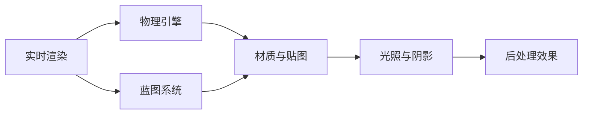

                 

关键词：Unreal Engine 4、游戏开发、电影级渲染、虚拟现实、图形渲染技术、实时渲染

> 摘要：本文将深入探讨如何使用Unreal Engine 4（UE4）实现电影级的游戏开发，从核心概念、算法原理到项目实践，全面解析这一强大的游戏引擎。通过本文，读者将了解到如何利用UE4的先进功能，打造出逼真的游戏世界，满足现代游戏开发对于视觉和交互的高要求。

## 1. 背景介绍

Unreal Engine 4（UE4）是由Epic Games开发的跨平台游戏引擎，自2014年发布以来，它已经成为游戏开发、电影制作、建筑可视化、虚拟现实（VR）以及增强现实（AR）等领域的重要工具。UE4以其高效的渲染引擎、强大的蓝图系统、高度可定制的工具集和丰富的社区资源而闻名。

### 1.1 UE4的发展历程

自2002年首款版本Unreal Engine 1发布以来，UE系列引擎经历了多次迭代和升级。每一代引擎都带来了革命性的变化，包括更加高效的光照模型、更强大的物理引擎、更高性能的渲染技术等。UE4在视觉表现、实时渲染和开发效率上取得了显著的提升，为电影级游戏开发奠定了基础。

### 1.2 UE4在游戏开发中的应用

UE4被广泛应用于各种类型的游戏开发，从大型开放世界游戏到小型独立游戏，都能看到UE4的身影。它不仅提供了高度可定制的开发环境，还允许开发者使用蓝图系统进行快速原型设计和迭代。这使得游戏开发者能够专注于创意实现，而无需深入底层编程。

## 2. 核心概念与联系

### 2.1 核心概念

Unreal Engine 4的核心概念包括：

- **实时渲染**：UE4采用了高效的渲染引擎，可以实现流畅的实时渲染效果，满足现代游戏对于视觉效果的要求。
- **蓝图系统**：UE4的蓝图系统是一种可视化的编程工具，允许开发者通过节点连接的方式构建逻辑，无需编写复杂的代码。
- **物理引擎**：UE4内置了强大的物理引擎，能够模拟真实世界的物理现象，如碰撞、动力学等。
- **材质与贴图**：UE4提供了丰富的材质和贴图工具，支持各种高级视觉效果，如反射、折射、光照等。

### 2.2 架构流程图



### 2.3 关联性

实时渲染、物理引擎、蓝图系统、材质与贴图、光照与阴影、后处理效果等核心概念相互关联，共同构建了UE4的强大功能。实时渲染依赖于物理引擎和材质贴图来生成逼真的视觉效果，而蓝图系统则提供了灵活的逻辑控制，使开发者能够根据需求进行自定义。

## 3. 核心算法原理 & 具体操作步骤

### 3.1 算法原理概述

UE4中的核心算法包括：

- **光线追踪**：用于实现逼真的光影效果，通过模拟光线传播路径来计算光照。
- **粒子系统**：用于模拟各种动态效果，如火焰、烟雾、雨滴等。
- **AI导航网格**：用于实现智能角色的路径规划和导航。

### 3.2 算法步骤详解

#### 3.2.1 光线追踪

光线追踪的算法步骤如下：

1. **采样**：在场景中随机生成多个光线。
2. **碰撞检测**：检测光线与物体是否发生碰撞。
3. **计算光照**：根据碰撞点计算光照强度。
4. **反射与折射**：处理光线在物体表面的反射和折射效果。

#### 3.2.2 粒子系统

粒子系统的算法步骤如下：

1. **初始化**：设置粒子数量、大小、颜色等参数。
2. **运动模拟**：根据物理引擎的规则计算粒子的运动轨迹。
3. **碰撞检测**：检测粒子与物体的碰撞。
4. **渲染**：根据粒子状态进行渲染。

#### 3.2.3 AI导航网格

AI导航网格的算法步骤如下：

1. **构建网格**：根据场景构建导航网格。
2. **计算路径**：使用A*算法计算角色到目标点的最佳路径。
3. **路径平滑**：对路径进行平滑处理，减少角色移动过程中的震动。
4. **更新网格**：根据角色移动更新导航网格。

### 3.3 算法优缺点

#### 光线追踪

优点：可以实现逼真的光影效果。

缺点：计算量大，对硬件性能要求高。

#### 粒子系统

优点：可以实现各种动态效果。

缺点：粒子数量过多可能导致性能下降。

#### AI导航网格

优点：可以实现智能角色的路径规划和导航。

缺点：路径计算复杂，可能需要较长的时间。

### 3.4 算法应用领域

光线追踪适用于需要逼真光影效果的场景，如角色渲染、环境渲染等。粒子系统适用于模拟动态效果，如火焰、烟雾、雨滴等。AI导航网格适用于智能角色的路径规划和导航。

## 4. 数学模型和公式 & 详细讲解 & 举例说明

### 4.1 数学模型构建

UE4中的数学模型包括：

- **矩阵运算**：用于实现3D变换。
- **向量运算**：用于处理空间中的点、线、面等几何元素。
- **光线方程**：用于计算光线路径和光照强度。
- **三角函数**：用于处理角度和距离计算。

### 4.2 公式推导过程

以下是一个简单的矩阵乘法公式：

$$
\begin{bmatrix}
a_{11} & a_{12} \\
a_{21} & a_{22}
\end{bmatrix}
\cdot
\begin{bmatrix}
b_{11} & b_{12} \\
b_{21} & b_{22}
\end{bmatrix}
=
\begin{bmatrix}
a_{11}b_{11} + a_{12}b_{21} & a_{11}b_{12} + a_{12}b_{22} \\
a_{21}b_{11} + a_{22}b_{21} & a_{21}b_{12} + a_{22}b_{22}
\end{bmatrix}
$$

### 4.3 案例分析与讲解

#### 案例一：光线追踪

假设我们要计算场景中一点的光照强度，可以使用以下光线追踪模型：

$$
I = \frac{L_n \cdot N}{d}
$$

其中，$I$为光照强度，$L_n$为光线方向上的光照强度，$N$为法线方向，$d$为光线到物体的距离。

#### 案例二：粒子系统

假设我们要模拟一个粒子在三维空间中的运动，可以使用以下粒子系统模型：

$$
p(t) = p_0 + v_0t + \frac{1}{2}a_0t^2
$$

其中，$p(t)$为粒子在时间$t$的位置，$p_0$为初始位置，$v_0$为初始速度，$a_0$为加速度。

## 5. 项目实践：代码实例和详细解释说明

### 5.1 开发环境搭建

搭建UE4开发环境需要以下步骤：

1. 下载并安装UE4开发套件。
2. 配置编辑器，包括编辑器的启动选项和环境变量。
3. 安装必要的插件和扩展。

### 5.2 源代码详细实现

以下是一个简单的粒子系统实现的代码示例：

```cpp
// 粒子系统源代码

void AParticleSystem::UpdateParticles(float DeltaTime)
{
    for (AParticle& Particle : ParticleList)
    {
        // 计算粒子位置
        Particle.Position += Particle.Velocity * DeltaTime + 0.5f * Particle.Acceleration * DeltaTime * DeltaTime;

        // 更新粒子速度
        Particle.Velocity += Particle.Acceleration * DeltaTime;

        // 检测粒子是否超出边界
        if (Particle.Position.X < 0.0f || Particle.Position.X > 100.0f ||
            Particle.Position.Y < 0.0f || Particle.Position.Y > 100.0f ||
            Particle.Position.Z < 0.0f || Particle.Position.Z > 100.0f)
        {
            // 重新初始化粒子
            Particle = GenerateRandomParticle();
        }
    }
}
```

### 5.3 代码解读与分析

上述代码实现了粒子系统的更新功能，包括位置更新、速度更新以及边界检测。通过循环遍历粒子列表，代码对每个粒子进行更新，并根据物理规则计算新的位置和速度。当粒子超出边界时，会重新生成一个随机的粒子。

### 5.4 运行结果展示

运行上述代码后，可以在UE4编辑器中看到粒子的运动效果。粒子会在三维空间中随机运动，并遵循物理规则。通过调整加速度、速度等参数，可以改变粒子的运动轨迹和效果。

## 6. 实际应用场景

### 6.1 游戏开发

UE4在游戏开发中有着广泛的应用，从大型开放世界游戏到小型独立游戏，都能看到UE4的身影。例如，《堡垒之夜》、《死亡搁浅》等知名游戏都使用了UE4进行开发。

### 6.2 虚拟现实

UE4在虚拟现实（VR）领域同样有着重要的地位。它提供了丰富的VR开发工具和插件，支持各种VR设备和平台，为开发者提供了便利。

### 6.3 建筑可视化

UE4在建筑可视化领域也有着广泛的应用。通过使用UE4，建筑师可以创建逼真的建筑模型，并进行实时渲染，从而更好地展示设计效果。

### 6.4 未来应用展望

随着技术的不断发展，UE4在未来将继续拓展其应用领域。例如，在影视制作、动画制作、工业设计等领域，UE4都有望发挥更大的作用。同时，随着硬件性能的提升，UE4的实时渲染能力将得到进一步提升，为开发者提供更强大的工具。

## 7. 工具和资源推荐

### 7.1 学习资源推荐

- 《Unreal Engine 4 从入门到精通》
- 《Unreal Engine 4 实战：从零开始开发大型游戏》
- 《Unreal Engine 4 开发指南》

### 7.2 开发工具推荐

- Unreal Engine 4 编辑器
- Visual Studio
- Git

### 7.3 相关论文推荐

- "Real-Time Ray Tracing of Natural Phenomena"
- "Unreal Engine 4: The Complete Game Development Cookbook"
- "Interactive Global Illumination in Real-Time"

## 8. 总结：未来发展趋势与挑战

### 8.1 研究成果总结

UE4在实时渲染、物理引擎、蓝图系统等方面取得了显著的研究成果，为电影级游戏开发提供了强大的技术支持。

### 8.2 未来发展趋势

随着硬件性能的提升和人工智能技术的发展，UE4在未来将继续提升其渲染能力和智能化水平，为开发者提供更强大的工具。

### 8.3 面临的挑战

UE4在实时渲染和智能化方面面临一定挑战，例如光线追踪的计算复杂度、粒子系统的性能优化等。同时，如何更好地与人工智能技术结合，提高开发效率和智能水平，也是未来需要关注的方向。

### 8.4 研究展望

未来，UE4有望在更多领域得到应用，如影视制作、动画制作、工业设计等。同时，通过引入新的技术和算法，UE4将继续提升其性能和智能化水平，为游戏开发者带来更多创新和可能性。

## 9. 附录：常见问题与解答

### 9.1 UE4对硬件性能的要求？

UE4对硬件性能有较高的要求，尤其是在实时渲染方面。建议使用NVIDIA或AMD的高性能显卡，以及多核心的CPU。

### 9.2 如何优化UE4的性能？

可以通过以下方法优化UE4的性能：

- 优化渲染路径，减少不必要的渲染操作。
- 使用LOD（细节层次距离）技术，根据距离动态调整物体细节。
- 使用异步计算，提高计算效率。
- 优化材质和贴图，减少数据量。

### 9.3 UE4的蓝图系统如何使用？

蓝图系统是一种可视化的编程工具，通过连接节点来实现逻辑。开发者可以通过以下步骤使用蓝图系统：

- 创建蓝图类，定义变量和函数。
- 拖放节点到蓝图界面，连接节点实现逻辑。
- 调试和运行蓝图。

### 9.4 UE4如何实现粒子系统？

UE4实现粒子系统需要以下步骤：

- 创建粒子系统蓝图类，定义粒子参数。
- 实现粒子生成和更新逻辑。
- 使用粒子模块，设置粒子发射器、渲染器等。

----------------------------------------------------------------

### 附录二：术语解释
#### Unreal Engine 4 (UE4)

**Unreal Engine 4** 是一款由Epic Games开发的跨平台游戏引擎，广泛应用于游戏开发、电影制作、建筑可视化、虚拟现实（VR）和增强现实（AR）等领域。它以其高效的渲染引擎、强大的蓝图系统、高度可定制的工具集和丰富的社区资源而闻名。

#### 实时渲染

**实时渲染** 是指在计算机图形学中，以每秒超过24帧（fps）的速度生成和显示图像的过程。实时渲染技术使得游戏、模拟和交互式应用程序能够在用户操作时即时反应，提供了流畅的视觉体验。

#### 蓝图系统

**蓝图系统** 是UE4中的一个可视化编程工具，允许开发者使用节点图来构建游戏逻辑，而无需编写复杂的代码。这使得非程序员也能够参与到游戏开发中来，提高了开发效率。

#### 光线追踪

**光线追踪** 是一种计算机图形学中的渲染技术，通过模拟光线在场景中的传播路径，实现逼真的光影效果。光线追踪可以处理反射、折射、全局光照等复杂效果，但计算成本较高。

#### 粒子系统

**粒子系统** 是用于模拟大量小物体的集合，如火焰、烟雾、雪花等。粒子系统通过创建、更新和渲染大量粒子，来模拟自然现象和动态效果。

#### 物理引擎

**物理引擎** 是用于模拟物体在现实世界中运动和碰撞的计算机算法。物理引擎能够处理动力学、碰撞检测、物体之间的相互作用等，为游戏和模拟提供了真实的物理表现。

#### 后处理效果

**后处理效果** 是在图像渲染完成后，对图像进行的一系列增强处理，如色彩校正、模糊、光照效果等，以提升图像的视觉质量。

### 作者署名

作者：禅与计算机程序设计艺术 / Zen and the Art of Computer Programming

