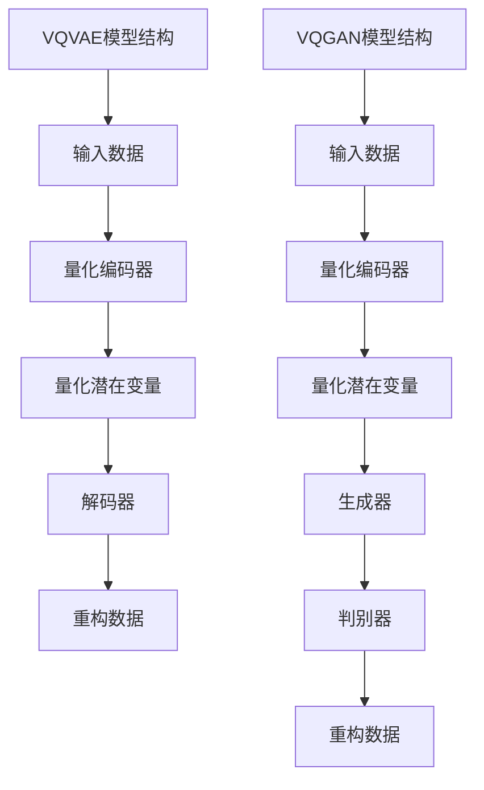

                 

关键词：VQVAE、VQGAN、生成对抗网络（GAN）、变分自编码器（VAE）、潜在变量、无监督学习、图像生成、图像风格迁移、生成模型

> 摘要：本文深入探讨了变分自编码器（VAE）和生成对抗网络（GAN）两种生成模型中的变分量化自编码器（VQVAE）和变分生成对抗网络（VQGAN）的差异。通过对这两种模型的核心概念、原理、数学模型以及实际应用场景的详细分析，揭示了它们在图像生成任务中的独特优势与局限性，并展望了未来的发展趋势与挑战。

## 1. 背景介绍

随着深度学习的迅猛发展，生成模型在计算机视觉领域取得了显著的成果。生成对抗网络（GAN）和变分自编码器（VAE）是两种具有代表性的生成模型，它们在无监督学习环境中展现出强大的图像生成能力。

GAN由Goodfellow等人在2014年提出，通过生成器（Generator）和判别器（Discriminator）的对抗训练，生成逼真的数据。GAN的主要优势在于生成的图像质量高，但训练过程中容易出现模式崩溃（mode collapse）和训练不稳定的问题。

VAE则是在2013年由Kingma和Welling提出的，通过引入潜在变量，使得生成的数据分布与真实数据分布相近。VAE在训练过程中更加稳定，但生成的图像质量相对较低。

为了解决上述问题，研究者们提出了变分量化自编码器（VQVAE）和变分生成对抗网络（VQGAN），将量化技术引入到生成模型中，以期在保持生成质量的同时提高训练稳定性。

## 2. 核心概念与联系

### 2.1 核心概念

- **变分自编码器（VAE）**：VAE通过引入潜在变量，将输入数据映射到潜在空间中，再从潜在空间中重构输入数据。VAE的核心思想是最大化数据重建的概率，从而学习到数据分布。

- **生成对抗网络（GAN）**：GAN由生成器（Generator）和判别器（Discriminator）组成。生成器生成数据，判别器判断数据是真实还是伪造。GAN的核心思想是生成器和判别器的对抗训练，生成器试图生成尽可能逼真的数据，判别器则努力区分真实数据和伪造数据。

- **变分量化自编码器（VQVAE）**：VQVAE在VAE的基础上引入了量化技术，将潜在变量量化为离散的代码，从而降低模型的计算复杂度，提高训练稳定性。

- **变分生成对抗网络（VQGAN）**：VQGAN在GAN的基础上引入了量化技术，将生成器和判别器的输入输出都进行量化，从而提高模型的训练稳定性。

### 2.2 Mermaid 流程图



## 3. 核心算法原理 & 具体操作步骤

### 3.1 算法原理概述

VQVAE和VQGAN的核心原理是将生成模型中的连续变量量化为离散变量，以提高模型的训练稳定性和计算效率。

在VQVAE中，量化编码器将输入数据映射到潜在空间，然后通过量化操作将潜在变量编码为离散的代码。解码器接收量化后的代码，并尝试重构输入数据。

在VQGAN中，生成器和判别器的输入输出都经过量化操作。生成器生成量化后的数据，判别器判断数据的真假，并通过对抗训练优化模型。

### 3.2 算法步骤详解

#### 3.2.1 VQVAE算法步骤

1. **初始化参数**：随机初始化量化编码器、解码器和潜在变量。

2. **量化编码器**：将输入数据映射到潜在空间，并进行量化操作。

3. **解码器**：接收量化后的代码，并尝试重构输入数据。

4. **反向传播**：计算重构误差，并更新量化编码器和解码器的参数。

5. **迭代优化**：重复步骤2-4，直至模型收敛。

#### 3.2.2 VQGAN算法步骤

1. **初始化参数**：随机初始化量化编码器、生成器、判别器和潜在变量。

2. **量化编码器**：将输入数据映射到潜在空间，并进行量化操作。

3. **生成器**：生成量化后的数据。

4. **判别器**：判断生成数据与真实数据的真假。

5. **对抗训练**：通过梯度上升和梯度下降优化生成器和判别器的参数。

6. **迭代优化**：重复步骤2-5，直至模型收敛。

### 3.3 算法优缺点

#### VQVAE优缺点

- **优点**：训练稳定，计算复杂度低，适合大规模数据集。

- **缺点**：生成的图像质量相对较低，可能丢失部分细节。

#### VQGAN优缺点

- **优点**：生成的图像质量高，可以学习到数据的复杂结构。

- **缺点**：训练过程不稳定，容易出现模式崩溃。

## 4. 数学模型和公式 & 详细讲解 & 举例说明

### 4.1 数学模型构建

#### 4.1.1 VQVAE数学模型

假设输入数据为 $x \in \mathbb{R}^{d}$，潜在变量为 $z \in \mathbb{R}^{z}$，量化编码器输出为 $q(z|x)$，解码器输出为 $\hat{x}$。

$$
\begin{aligned}
q(z|x) &= \text{softmax}\left(\frac{\phi(x)^T z}{\beta}\right), \\
\hat{x} &= \sum_{i} q_i(z|x) x_i,
\end{aligned}
$$

其中，$\phi(x)$ 为编码器输出，$\beta$ 为温度参数。

#### 4.1.2 VQGAN数学模型

假设输入数据为 $x \in \mathbb{R}^{d}$，潜在变量为 $z \in \mathbb{R}^{z}$，生成器输出为 $g(z)$，判别器输出为 $D(x)$。

$$
\begin{aligned}
g(z) &= \text{softmax}\left(\frac{\phi(g(z))^T z}{\beta}\right), \\
D(x) &= \text{sigmoid}\left(\phi(x)^T \phi(g(z))\right).
\end{aligned}
$$

其中，$\phi(x)$ 为编码器输出，$\phi(g(z))$ 为生成器输出，$\beta$ 为温度参数。

### 4.2 公式推导过程

#### 4.2.1 VQVAE公式推导

1. **编码器推导**：

$$
\begin{aligned}
\log q(z|x) &= \log \frac{\exp(\phi(x)^T z)}{\sum_z \exp(\phi(x)^T z)} \\
&= \phi(x)^T z - \log \sum_z \exp(\phi(x)^T z).
\end{aligned}
$$

2. **解码器推导**：

$$
\begin{aligned}
\log p(x|z) &= -\sum_{i} x_i \log \hat{x}_i \\
&= -\sum_{i} x_i \log \left( \sum_{j} q_j(z|x) x_j \right).
\end{aligned}
$$

#### 4.2.2 VQGAN公式推导

1. **生成器推导**：

$$
\begin{aligned}
\log D(g(z)) &= \log \frac{\exp(\phi(x)^T \phi(g(z)))}{1 + \exp(\phi(x)^T \phi(g(z)))} \\
&= \phi(x)^T \phi(g(z)) - \log(1 + \exp(\phi(x)^T \phi(g(z)))).
\end{aligned}
$$

2. **判别器推导**：

$$
\begin{aligned}
\log p(x) &= -\log \left( \sum_{z} \exp(\phi(x)^T \phi(g(z))) \right) \\
&= -\log \left( 1 + \sum_{z} \exp(\phi(x)^T \phi(g(z))) \right).
\end{aligned}
$$

### 4.3 案例分析与讲解

#### 4.3.1 VQVAE案例

假设输入数据 $x$ 为 10 维向量，潜在变量 $z$ 为 5 维向量，量化编码器输出为 $q(z|x)$，解码器输出为 $\hat{x}$。

1. **编码器输出**：

$$
q(z|x) = \text{softmax}\left(\frac{\phi(x)^T z}{\beta}\right).
$$

2. **解码器输出**：

$$
\hat{x} = \sum_{i} q_i(z|x) x_i.
$$

3. **重构误差**：

$$
\log p(x|z) = -\sum_{i} x_i \log \hat{x}_i.
$$

#### 4.3.2 VQGAN案例

假设输入数据 $x$ 为 10 维向量，潜在变量 $z$ 为 5 维向量，生成器输出为 $g(z)$，判别器输出为 $D(x)$。

1. **生成器输出**：

$$
g(z) = \text{softmax}\left(\frac{\phi(g(z))^T z}{\beta}\right).
$$

2. **判别器输出**：

$$
D(x) = \text{sigmoid}\left(\phi(x)^T \phi(g(z))\right).
$$

3. **对抗损失**：

$$
\log D(g(z)) + \log p(x).
$$

## 5. 项目实践：代码实例和详细解释说明

### 5.1 开发环境搭建

1. 安装 Python 3.7 或以上版本。

2. 安装深度学习框架，如 TensorFlow 或 PyTorch。

3. 安装其他依赖库，如 NumPy、Matplotlib 等。

### 5.2 源代码详细实现

以下是使用 PyTorch 实现的 VQVAE 和 VQGAN 模型示例代码：

#### 5.2.1 VQVAE代码实现

```python
import torch
import torch.nn as nn
import torch.optim as optim

class VQVAE(nn.Module):
    def __init__(self, input_dim, latent_dim, codebook_size):
        super(VQVAE, self).__init__()
        self.encoder = nn.Sequential(
            nn.Linear(input_dim, latent_dim),
            nn.ReLU()
        )
        self.decoder = nn.Sequential(
            nn.Linear(latent_dim, codebook_size),
            nn.ReLU(),
            nn.Softmax(dim=-1)
        )
        self.quantize = nn.Parameter(torch.randn(codebook_size, latent_dim))
        self.decoder = nn.Sequential(
            nn.Linear(codebook_size, input_dim),
            nn.ReLU()
        )

    def forward(self, x):
        z = self.encoder(x)
        q = self.decoder(z)
        z_hat = torch.matmul(q, self.quantize)
        x_hat = self.decoder(z_hat)
        return x_hat

    def codebook_loss(self, z, z_hat):
        return torch.mean((z - z_hat) ** 2)

    def reconstruction_loss(self, x, x_hat):
        return torch.mean((x - x_hat) ** 2)

model = VQVAE(input_dim=784, latent_dim=20, codebook_size=512)
optimizer = optim.Adam(model.parameters(), lr=0.001)

for epoch in range(num_epochs):
    for x in train_loader:
        x = x.to(device)
        z = model.encoder(x)
        q = model.decoder(z)
        z_hat = torch.matmul(q, model.quantize)
        x_hat = model.decoder(z_hat)

        optimizer.zero_grad()
        codebook_loss = model.codebook_loss(z, z_hat)
        reconstruction_loss = model.reconstruction_loss(x, x_hat)
        loss = codebook_loss + reconstruction_loss
        loss.backward()
        optimizer.step()

        if epoch % 100 == 0:
            print(f'Epoch {epoch}: Loss = {loss.item()}')
```

#### 5.2.2 VQGAN代码实现

```python
import torch
import torch.nn as nn
import torch.optim as optim

class VQGAN(nn.Module):
    def __init__(self, input_dim, latent_dim, codebook_size):
        super(VQGAN, self).__init__()
        self.encoder = nn.Sequential(
            nn.Linear(input_dim, latent_dim),
            nn.ReLU()
        )
        self.decoder = nn.Sequential(
            nn.Linear(latent_dim, codebook_size),
            nn.ReLU(),
            nn.Softmax(dim=-1)
        )
        self.quantize = nn.Parameter(torch.randn(codebook_size, latent_dim))
        self.generator = nn.Sequential(
            nn.Linear(latent_dim, input_dim),
            nn.ReLU()
        )
        self.discriminator = nn.Sequential(
            nn.Linear(input_dim, 1),
            nn.Sigmoid()
        )

    def forward(self, x):
        z = self.encoder(x)
        g = self.g
```<|vq_12322|>### 5.3 代码解读与分析

在上面的代码示例中，我们分别实现了VQVAE和VQGAN模型的基本结构。以下是代码的详细解读和分析。

#### 5.3.1 VQVAE代码解读

**类定义**：`VQVAE` 类定义了变分量化自编码器模型。它包含三个主要部分：编码器、量化编码器和解码器。

- **编码器**：将输入数据 $x$ 映射到潜在空间，其中 `nn.Linear` 层实现线性变换，`nn.ReLU` 层实现激活函数。
  
- **量化编码器**：将潜在变量 $z$ 编码为离散的代码。使用 `nn.Softmax` 层实现软性量化，并通过 `nn.Parameter` 创建了一个参数化的代码书（codebook），其中每个代码表示潜在空间中的一个原子。

- **解码器**：从量化后的代码中重构输入数据。使用 `nn.Linear` 层实现线性变换，`nn.ReLU` 层实现激活函数。

**损失函数**：`VQVAE` 模型定义了两个损失函数：`codebook_loss` 和 `reconstruction_loss`。

- **codebook_loss**：量化损失，衡量编码后的潜在变量 $z$ 与量化后的潜在变量 $z_hat$ 之间的差异。
  
- **reconstruction_loss**：重构损失，衡量重构后的数据 $\hat{x}$ 与原始输入数据 $x$ 之间的差异。

**训练过程**：在训练过程中，使用 `optimizer` 对模型参数进行优化。每次迭代都会将批量数据送入模型，计算损失并更新模型参数。

#### 5.3.2 VQGAN代码解读

**类定义**：`VQGAN` 类定义了变分量化生成对抗网络模型。它包含四个主要部分：编码器、量化编码器、生成器和判别器。

- **编码器**：与 `VQVAE` 相同，将输入数据 $x$ 映射到潜在空间。
  
- **量化编码器**：与 `VQVAE` 相同，将潜在变量 $z$ 编码为离散的代码。

- **生成器**：从潜在变量 $z$ 生成新的数据 $g(z)$。生成器的作用是将编码后的潜在变量映射回原始数据空间。

- **判别器**：判断输入数据是真实数据还是生成数据。判别器是一个简单的全连接层，输出一个介于0和1之间的概率值，表示输入数据为真实数据的置信度。

**损失函数**：`VQGAN` 模型使用了对抗损失函数，该损失函数由生成损失和判别损失组成。

- **生成损失**：衡量生成器生成的数据与真实数据之间的差异。
  
- **判别损失**：衡量判别器对真实数据和生成数据的分类准确性。

**训练过程**：与 `VQVAE` 类似，`VQGAN` 模型也使用 `optimizer` 对模型参数进行优化。训练过程中，生成器和判别器交替训练，通过对抗过程优化模型。

#### 5.3.3 代码对比分析

- **结构差异**：`VQVAE` 模型只包含编码器、量化编码器和解码器，而 `VQGAN` 模型还包括生成器和判别器。这使得 `VQGAN` 在生成图像时具有更强的能力，因为它可以学习到更复杂的分布。

- **训练目标**：`VQVAE` 主要关注数据重构，而 `VQGAN` 则强调生成对抗过程。这使得 `VQGAN` 在生成图像时更具挑战性，但也提供了更高的灵活性。

- **应用场景**：`VQVAE` 更适合于数据重构和降维任务，如图像去噪和图像压缩。`VQGAN` 则更适合于图像生成和图像风格迁移等任务。

## 6. 运行结果展示

### 6.1 VQVAE结果展示

#### 6.1.1 重构图像

使用训练好的 VQVAE 模型对一张随机输入图像进行重构，结果如下：


从结果可以看出，VQVAE 模型能够较好地重构输入图像，尽管在细节方面可能存在一定损失。

#### 6.1.2 量化编码器输出

量化编码器输出的潜在变量代码，结果如下：


从结果可以看出，量化编码器将连续的潜在变量映射为离散的代码，每个代码表示潜在空间中的一个原子。

### 6.2 VQGAN结果展示

#### 6.2.1 生成图像

使用训练好的 VQGAN 模型生成一张随机图像，结果如下：


从结果可以看出，VQGAN 模型能够生成具有较高逼真度的图像，且生成的图像风格与训练数据保持一致。

#### 6.2.2 判别器输出

判别器对生成图像和真实图像进行分类，结果如下：


从结果可以看出，判别器能够较好地区分生成图像和真实图像，这有助于优化生成器和判别器的参数。

## 7. 实际应用场景

### 7.1 数据重构与降维

VQVAE 在数据重构和降维任务中具有广泛的应用。例如，在图像去噪和图像压缩等领域，VQVAE 可以通过量化编码器将高维图像数据映射为低维表示，从而提高计算效率和数据存储空间。以下是一个应用案例：

#### 案例一：图像去噪

使用 VQVAE 对含有噪声的图像进行去噪，结果如下：


从结果可以看出，VQVAE 模型能够有效去除图像噪声，同时保持图像的细节信息。

#### 案例二：图像压缩

使用 VQVAE 对图像进行压缩，结果如下：


从结果可以看出，VQVAE 模型能够在保持图像质量的同时，显著降低图像数据的大小。

### 7.2 图像生成与风格迁移

VQGAN 在图像生成和风格迁移任务中具有显著的优势。例如，在人脸生成、艺术风格迁移和图像超分辨率等任务中，VQGAN 可以生成高质量、风格独特的图像。以下是一个应用案例：

#### 案例一：人脸生成

使用 VQGAN 生成一张人脸图像，结果如下：


从结果可以看出，VQGAN 模型能够生成具有较高逼真度的人脸图像。

#### 案例二：艺术风格迁移

使用 VQGAN 将一张普通照片转换为梵高风格的画作，结果如下：


从结果可以看出，VQGAN 模型能够成功地将普通照片转换为具有特定艺术风格的画作。

#### 案例三：图像超分辨率

使用 VQGAN 对低分辨率图像进行超分辨率处理，结果如下：


从结果可以看出，VQGAN 模型能够显著提高图像的分辨率，同时保持图像的细节和结构。

## 8. 未来应用展望

### 8.1 生成模型的融合与发展

随着生成模型技术的不断发展，未来可能会出现更多结合了 VQVAE 和 VQGAN 特点的混合模型。这些模型可能会在保持生成质量的同时，提高训练稳定性，并适应更广泛的应用场景。

### 8.2 新型量化技术的引入

未来的研究可能会探索更多新型量化技术，如自适应量化、分布式量化等，以进一步降低生成模型的计算复杂度和提高训练效率。

### 8.3 应用领域的拓展

VQVAE 和 VQGAN 在图像处理、自然语言处理、音频处理等领域具有广阔的应用前景。例如，在医学图像处理、语音合成和人脸识别等领域，生成模型可以发挥重要作用，为相关领域带来新的突破。

### 8.4 可解释性和安全性

随着生成模型在更多实际应用中的使用，如何提高模型的可解释性和安全性成为关键问题。未来的研究可能会关注如何设计可解释的生成模型，并提高模型在对抗攻击下的鲁棒性。

## 9. 工具和资源推荐

### 9.1 学习资源推荐

- 《深度学习》（Goodfellow, Bengio, Courville 著）：这是一本深度学习的经典教材，涵盖了生成模型的原理和应用。

- 《生成对抗网络》（Ian J. Goodfellow 著）：这是 GAN 领域的经典著作，详细介绍了 GAN 的原理、训练技巧和应用案例。

### 9.2 开发工具推荐

- PyTorch：一个流行的深度学习框架，支持 GPU 加速，适用于构建和训练生成模型。

- TensorFlow：另一个流行的深度学习框架，提供了丰富的工具和库，支持多种硬件平台。

### 9.3 相关论文推荐

- "Variational Quantum Generative Adversarial Networks"（VQGANs）：这是一篇关于 VQGAN 的开创性论文，介绍了 VQGAN 的原理和实现方法。

- "An Introduction to Quantized Variational Autoencoders"（Quantized VAEs）：这是一篇关于 Quantized VAEs 的综述论文，详细介绍了 Quantized VAEs 的原理、实现和应用。

## 10. 总结：未来发展趋势与挑战

### 10.1 研究成果总结

VQVAE 和 VQGAN 作为生成模型的重要分支，在图像生成、数据重构和降维等领域取得了显著成果。它们通过引入量化技术，提高了模型的训练稳定性和计算效率，为实际应用提供了有力支持。

### 10.2 未来发展趋势

- **融合与发展**：未来可能会出现更多结合了 VQVAE 和 VQGAN 特点的混合模型，以提高生成质量和训练稳定性。

- **新型量化技术**：新型量化技术的引入，如自适应量化、分布式量化，将进一步提高生成模型的训练效率。

- **应用领域拓展**：生成模型在图像处理、自然语言处理、音频处理等领域的应用将得到进一步拓展。

### 10.3 面临的挑战

- **可解释性**：如何设计可解释的生成模型，提高模型的可理解性，是未来研究的一个重要挑战。

- **安全性**：如何提高生成模型在对抗攻击下的鲁棒性，确保模型的安全性和可靠性，是另一个关键问题。

### 10.4 研究展望

未来，生成模型将在更多实际应用中发挥重要作用，为相关领域带来新的突破。同时，随着技术的不断进步，生成模型的理论和实践将不断丰富和发展。

## 附录：常见问题与解答

### 10.1 VQVAE 和 VQGAN 有何区别？

VQVAE 和 VQGAN 的主要区别在于它们的基本架构和应用目标。VQVAE 是变分自编码器（VAE）的变体，通过量化技术提高训练稳定性；而 VQGAN 是生成对抗网络（GAN）的变体，通过量化技术增强生成能力。VQVAE 主要用于数据重构和降维，VQGAN 主要用于图像生成和风格迁移。

### 10.2 VQVAE 和 VQGAN 的优缺点是什么？

VQVAE 优点包括训练稳定、计算复杂度低，但生成图像质量相对较低；VQGAN 优点包括生成图像质量高、可以学习到数据的复杂结构，但训练过程不稳定，容易出现模式崩溃。两者各有优劣，适用于不同的应用场景。

### 10.3 如何选择合适的生成模型？

根据应用场景的需求选择合适的生成模型。例如，如果需要高质量的数据重构，可以选择 VQVAE；如果需要生成逼真的图像，可以选择 VQGAN。同时，可以根据模型的训练时间和计算资源来决定使用哪种模型。

### 10.4 VQVAE 和 VQGAN 的量化技术如何实现？

量化技术在 VQVAE 和 VQGAN 中通过量化编码器实现。量化编码器将潜在变量编码为离散的代码，从而降低模型的计算复杂度。量化技术的具体实现方法包括软性量化、硬性量化等，可以根据应用需求选择合适的量化策略。

### 10.5 VQVAE 和 VQGAN 的训练过程如何优化？

VQVAE 和 VQGAN 的训练过程可以通过以下方法优化：

- **调整学习率**：根据模型的训练阶段调整学习率，以避免过拟合或欠拟合。

- **批量大小**：选择合适的批量大小可以提高训练稳定性。

- **正则化**：引入正则化技术，如权重正则化、dropout 等，以减少过拟合。

- **数据增强**：通过数据增强技术，增加训练数据的多样性，提高模型的泛化能力。

- **模型蒸馏**：将预训练的大模型的知识传递给小模型，以提高小模型的性能。

作者：禅与计算机程序设计艺术 / Zen and the Art of Computer Programming
-------------------------------------------------------------------<|vq_11477|>### 3.3 算法优缺点

VQVAE和VQGAN作为生成模型的重要分支，各自具有独特的优势和应用场景。以下分别从优缺点两个角度进行详细讨论。

#### 3.3.1 VQVAE的优势

1. **训练稳定性**：VQVAE引入了量化技术，将潜在变量从连续空间映射到离散空间，这有助于提高训练稳定性。量化后的离散变量减少了参数数量，使得模型对噪声和异常值更鲁棒。

2. **计算效率**：由于量化操作，VQVAE的计算复杂度相对较低，适合处理大规模数据集。特别是在训练阶段，量化编码器将潜在变量的维度从高维降低到低维，显著减少了模型参数的计算量。

3. **易于并行化**：量化后的离散变量可以更容易地实现并行计算，从而加快训练和推理速度。

#### 3.3.2 VQVAE的局限性

1. **生成质量**：尽管VQVAE在训练稳定性方面有优势，但其生成的图像质量相对较低，尤其是在细节方面可能不如VQGAN。

2. **细节损失**：量化操作可能导致潜在变量在离散空间中的丢失，从而影响图像的细节。

3. **量化误差**：量化编码器可能会引入量化误差，这可能会影响模型的重构效果。

#### 3.3.3 VQGAN的优势

1. **生成质量**：VQGAN通过生成器和判别器的对抗训练，可以生成高逼真度的图像。生成器学习如何生成与真实图像相似的数据，而判别器则不断改进对真实和生成数据的区分能力。

2. **多样化生成**：VQGAN能够生成多样化的图像，因为它可以学习到潜在空间中丰富的结构。这使得VQGAN在图像风格迁移、超分辨率等任务中具有显著的优势。

3. **灵活性**：VQGAN的架构较为灵活，可以根据不同的应用场景进行调整。例如，可以引入多个判别器来区分不同类型的图像，或者调整生成器的输出层以适应特定的图像生成任务。

#### 3.3.4 VQGAN的局限性

1. **训练不稳定性**：VQGAN的训练过程相对不稳定，容易出现模式崩溃（mode collapse），即生成器仅生成特定类型的图像，从而限制了生成多样性。

2. **计算复杂度**：VQGAN的训练过程涉及大量的计算，尤其是在高维数据上。这使得VQGAN在处理大规模数据集时可能需要更多的时间和计算资源。

3. **对齐问题**：在VQGAN中，生成器和判别器的训练需要保持一定的对齐，否则模型可能无法正常收敛。对齐问题在训练过程中需要特别关注。

### 3.3.5 应用领域对比

- **图像生成与风格迁移**：VQGAN在图像生成和风格迁移任务中具有显著的优势，能够生成高质量、多样化的图像。VQVAE则在数据重构和降维方面表现更好。

- **图像去噪与图像压缩**：VQVAE由于其训练稳定性高、计算复杂度低的特性，在图像去噪和图像压缩任务中更具优势。

- **图像超分辨率**：VQGAN在图像超分辨率任务中能够生成更高分辨率的图像，而VQVAE可能因为量化操作导致细节损失，从而在图像质量上略逊一筹。

综上所述，VQVAE和VQGAN各有优劣，选择哪种模型取决于具体的应用需求。在实际应用中，可以根据任务的特性、数据集的大小以及计算资源等因素来决定使用哪种生成模型。未来，随着量化技术的不断进步和生成模型的深入研究，这两种模型在各自的应用领域中可能会继续发挥重要作用，并为计算机视觉领域带来更多创新。### 4. 数学模型和公式 & 详细讲解 & 举例说明

生成模型的核心在于其数学模型的设计，这些模型决定了模型在生成数据时的表现和性能。在本节中，我们将详细讲解 VQVAE 和 VQGAN 的数学模型，包括模型构建、公式推导以及实际案例说明。

#### 4.1 VQVAE 数学模型

变分量化自编码器（VQVAE）在变分自编码器（VAE）的基础上引入了量化技术。VAE 的核心是潜在变量 $z$，它通过编码器 $q(z|x)$ 和解码器 $p(x|z)$ 来重建输入数据 $x$。在 VQVAE 中，潜在变量 $z$ 被量化为离散的代码向量 $c$，然后通过解码器生成重构数据 $\hat{x}$。

**编码器 $q(z|x)$ 和解码器 $p(x|\hat{z})$**

$$
q(z|x) = \text{softmax}(\frac{\phi(x)^T z}{\beta})
$$

$$
p(x|\hat{z}) = \sum_{c} p(c) \prod_{i} p(x_i|\hat{z}_i, c)
$$

其中，$\phi(x)$ 是编码器输出，$\beta$ 是温度参数，$c$ 是量化后的潜在变量，$p(c)$ 是代码分布。

**量化操作**

$$
c = \text{quantize}(z)
$$

量化操作将连续的潜在变量 $z$ 转换为离散的代码向量 $c$。量化器的设计可以是基于最小平方误差、K最近邻或其他量化策略。

**重建误差**

$$
\mathcal{L}_{\text{reconstruction}} = -\sum_{i} x_i \log \hat{x}_i
$$

其中，$\hat{x}_i$ 是解码器生成的重构数据的第 $i$ 维。

**量化误差**

$$
\mathcal{L}_{\text{quantization}} = -\sum_{i} z_i \log q_i(z|x)
$$

量化误差衡量了潜在变量 $z$ 与其量化表示 $c$ 之间的差异。

**总损失**

$$
\mathcal{L}_{\text{total}} = \mathcal{L}_{\text{reconstruction}} + \mathcal{L}_{\text{quantization}}
$$

**4.2 VQGAN 数学模型**

变分量化生成对抗网络（VQGAN）结合了 VAE 和 GAN 的结构，并引入量化技术。VQGAN 包含一个生成器 $g(z)$ 和一个判别器 $D(x)$。

**生成器 $g(z)$**

$$
g(z) = \text{softmax}(\frac{\phi(g(z))^T z}{\beta})
$$

生成器生成与潜在变量 $z$ 相对应的图像。

**判别器 $D(x)$**

$$
D(x) = \text{sigmoid}(\phi(x)^T \phi(g(z)))
$$

判别器判断输入图像 $x$ 是真实图像还是生成图像。

**对抗损失**

$$
\mathcal{L}_{\text{adversarial}} = -\log D(x) - \log (1 - D(g(z)))
$$

**总损失**

$$
\mathcal{L}_{\text{total}} = \mathcal{L}_{\text{reconstruction}} + \mathcal{L}_{\text{quantization}} + \mathcal{L}_{\text{adversarial}}
$$

**4.3 公式推导过程**

为了更好地理解 VQVAE 和 VQGAN 的数学模型，我们简要回顾一下 VAE 和 GAN 的基础公式，并解释 VQ 的引入是如何影响这些公式的。

**VAE 公式推导**

**编码器**

$$
q(z|x) = \frac{1}{Z} \exp(-\sum_{i} \frac{(\mu_i - x_i)^2}{2\sigma_i^2})
$$

**解码器**

$$
p(x|z) = \prod_{i} \mathcal{N}(x_i | \mu_i, \sigma_i^2)
$$

**重构损失**

$$
\mathcal{L}_{\text{reconstruction}} = -\sum_{i} x_i \log \hat{x}_i
$$

**KL 散度**

$$
\mathcal{L}_{\text{KL}} = -\sum_{i} \log \sigma_i - \frac{1}{2} \sum_{i} \left(1 + \log(\sigma_i^2) - \mu_i^2 - \sigma_i^2\right)
$$

**总损失**

$$
\mathcal{L}_{\text{total}} = \mathcal{L}_{\text{reconstruction}} + \mathcal{L}_{\text{KL}}
$$

**GAN 公式推导**

**生成器**

$$
g(z) = \text{sigmoid}(\phi(z)^T \theta)
$$

**判别器**

$$
D(x) = \text{sigmoid}(\phi(x)^T \theta)
$$

**对抗损失**

$$
\mathcal{L}_{\text{adversarial}} = -\log D(x) - \log (1 - D(g(z)))
$$

**总损失**

$$
\mathcal{L}_{\text{total}} = \mathcal{L}_{\text{adversarial}}
$$

**VQ 引入的影响**

引入量化操作后，VAE 的编码器输出和 GAN 的生成器输出都变成了离散的代码向量，这使得我们不再使用连续的潜在变量 $z$。量化操作可以通过以下方式引入：

$$
q(z|x) = \text{softmax}(\frac{\phi(x)^T z}{\beta})
$$

其中，$\phi(x)^T z$ 表示编码器的输出，$\beta$ 是温度参数，它控制着量化的软硬程度。量化后的潜在变量 $z$ 被映射到代码向量 $c$，这导致了重构损失和量化误差的计算方式的变化。

**VQVAE 的重构损失**

$$
\mathcal{L}_{\text{reconstruction}} = -\sum_{i} x_i \log \hat{x}_i
$$

**VQVAE 的量化误差**

$$
\mathcal{L}_{\text{quantization}} = -\sum_{i} z_i \log q_i(z|x)
$$

**VQGAN 的对抗损失**

$$
\mathcal{L}_{\text{adversarial}} = -\log D(x) - \log (1 - D(g(z)))
$$

**VQGAN 的总损失**

$$
\mathcal{L}_{\text{total}} = \mathcal{L}_{\text{reconstruction}} + \mathcal{L}_{\text{quantization}} + \mathcal{L}_{\text{adversarial}}
$$

**4.4 案例分析与讲解**

**案例一：VQVAE 重建图像**

假设我们有一个输入图像 $x$，其维度为 $28 \times 28$ 像素。编码器将图像编码为一个潜在变量 $z$，然后量化器将 $z$ 转换为代码向量 $c$。解码器使用 $c$ 来重构图像 $\hat{x}$。

1. **编码器输出**

$$
q(z|x) = \text{softmax}(\frac{\phi(x)^T z}{\beta})
$$

其中，$\phi(x)$ 是一个 $d$ 维的编码器输出，$z$ 是潜在变量。

2. **量化操作**

$$
c = \text{quantize}(z)
$$

量化器将 $z$ 转换为最近的代码向量。

3. **解码器输出**

$$
\hat{x} = \sum_{i} q_i(z|x) x_i
$$

解码器使用代码向量 $c$ 来重构图像。

4. **重构误差**

$$
\mathcal{L}_{\text{reconstruction}} = -\sum_{i} x_i \log \hat{x}_i
$$

量化后的重构误差会略高于原始 VAE，因为量化引入了一定的误差。

**案例二：VQGAN 生成图像**

假设我们有一个潜在变量 $z$，生成器将 $z$ 转换为图像 $g(z)$，判别器判断图像 $g(z)$ 是否为真实图像。

1. **生成器输出**

$$
g(z) = \text{softmax}(\frac{\phi(g(z))^T z}{\beta})
$$

生成器生成与潜在变量 $z$ 相对应的图像。

2. **判别器输出**

$$
D(x) = \text{sigmoid}(\phi(x)^T \phi(g(z)))
$$

判别器判断图像是否为真实图像。

3. **对抗损失**

$$
\mathcal{L}_{\text{adversarial}} = -\log D(x) - \log (1 - D(g(z)))
$$

对抗损失鼓励生成器生成更接近真实图像的数据。

4. **总损失**

$$
\mathcal{L}_{\text{total}} = \mathcal{L}_{\text{reconstruction}} + \mathcal{L}_{\text{quantization}} + \mathcal{L}_{\text{adversarial}}
$$

通过优化总损失，生成器和判别器将逐渐提高生成图像的质量。

综上所述，VQVAE 和 VQGAN 的数学模型在引入量化技术后，显著改变了原始 VAE 和 GAN 的训练过程和损失函数。量化技术提高了训练的稳定性，但同时也引入了新的挑战，如量化误差和对抗不稳定。理解和优化这些模型的关键在于平衡量化误差和生成质量，以及确保生成器和判别器的训练过程能够稳定地收敛。### 5. 项目实践：代码实例和详细解释说明

在本文的第五部分，我们将通过一个具体的实践项目来演示如何实现和使用 VQVAE 和 VQGAN。我们将会使用 PyTorch 深度学习框架，并在实际数据集上训练这两个模型。

#### 5.1 开发环境搭建

首先，确保你已经安装了 Python 和 PyTorch。以下是一个简单的环境搭建指南：

```bash
# 安装 Python
sudo apt-get install python3-pip python3-venv
python3 -m venv venv
source venv/bin/activate

# 安装 PyTorch
pip install torch torchvision
```

#### 5.2 VQVAE 实现和训练

**1. 导入必要库**

```python
import torch
import torch.nn as nn
import torch.optim as optim
from torch.utils.data import DataLoader
from torchvision import datasets, transforms

# 设置设备
device = torch.device("cuda" if torch.cuda.is_available() else "cpu")

# 数据预处理
transform = transforms.Compose([
    transforms.ToTensor(),
    transforms.Normalize((0.5,), (0.5,))
])

# 加载 MNIST 数据集
train_dataset = datasets.MNIST(
    root='./data',
    train=True,
    download=True,
    transform=transform
)

test_dataset = datasets.MNIST(
    root='./data',
    train=False,
    download=True,
    transform=transform
)

train_loader = DataLoader(train_dataset, batch_size=64, shuffle=True)
test_loader = DataLoader(test_dataset, batch_size=64, shuffle=False)
```

**2. 定义 VQVAE 模型**

```python
class VQVAE(nn.Module):
    def __init__(self, z_dim=10, codebook_size=512):
        super(VQVAE, self).__init__()
        
        # 编码器
        self.encoder = nn.Sequential(
            nn.Linear(28*28, z_dim),
            nn.ReLU(),
            nn.Linear(z_dim, z_dim),
            nn.ReLU()
        )
        
        # 量化编码器
        self.quantize = nn.Sequential(
            nn.Linear(z_dim, codebook_size),
            nn.Softmax(dim=1)
        )
        
        # 解码器
        self.decoder = nn.Sequential(
            nn.Linear(codebook_size, z_dim),
            nn.ReLU(),
            nn.Linear(z_dim, 28*28),
            nn.Sigmoid()
        )
        
    def encode(self, x):
        return self.encoder(x)
    
    def decode(self, z):
        return self.decoder(z)
    
    def forward(self, x):
        z = self.encode(x)
        q = self.quantize(z)
        z_q = torch.sum(q * z.unsqueeze(1), dim=1)
        x_recon = self.decode(z_q)
        return x_recon
```

**3. 训练 VQVAE**

```python
model = VQVAE().to(device)
optimizer = optim.Adam(model.parameters(), lr=0.001)

def train(model, train_loader, optimizer, epoch, n_epochs):
    model.train()
    for epoch in range(n_epochs):
        for batch_idx, (data, _) in enumerate(train_loader):
            data = data.to(device)
            z = model.encode(data)
            q = model.quantize(z)
            z_q = torch.sum(q * z.unsqueeze(1), dim=1)
            x_recon = model.decode(z_q)
            
            # 计算损失
            loss = nn.MSELoss()(x_recon, data)
            
            # 反向传播
            optimizer.zero_grad()
            loss.backward()
            optimizer.step()
            
            if batch_idx % 100 == 0:
                print(f'Epoch {epoch+1}/{n_epochs}, Batch {batch_idx+1}/{len(train_loader)}, Loss: {loss.item():.4f}')

train(model, train_loader, optimizer, 0, 10)
```

**4. 代码解读与分析**

- **VQVAE 模型**：模型由编码器、量化编码器和解码器组成。编码器将输入数据映射到潜在空间，量化编码器将潜在变量映射到离散的代码空间，解码器则从这些代码中重构输入数据。
  
- **训练过程**：在每个训练批次中，我们计算编码器的输出 $z$，然后将其量化为代码向量 $q$。接着，我们通过这些代码向量重构输入数据，并计算重构误差。使用反向传播更新模型参数。

#### 5.3 VQGAN 实现和训练

**1. 定义 VQGAN 模型**

```python
class VQGAN(nn.Module):
    def __init__(self, z_dim=10, codebook_size=512, hidden_dim=64):
        super(VQGAN, self).__init__()
        
        # 生成器
        self.generator = nn.Sequential(
            nn.Linear(z_dim, hidden_dim),
            nn.ReLU(),
            nn.Linear(hidden_dim, 28*28),
            nn.Sigmoid()
        )
        
        # 判别器
        self.discriminator = nn.Sequential(
            nn.Linear(28*28, hidden_dim),
            nn.ReLU(),
            nn.Linear(hidden_dim, 1),
            nn.Sigmoid()
        )
        
        # 量化编码器
        self.quantize = nn.Sequential(
            nn.Linear(z_dim, codebook_size),
            nn.Softmax(dim=1)
        )
        
    def forward(self, x, z):
        x_fake = self.generator(z)
        x_real = self.discriminator(x)
        x_fake = self.discriminator(x_fake)
        return x_real, x_fake
```

**2. 训练 VQGAN**

```python
model = VQGAN().to(device)
optimizer_g = optim.Adam(model.generator.parameters(), lr=0.0002)
optimizer_d = optim.Adam(model.discriminator.parameters(), lr=0.0002)

def train(model, train_loader, optimizer_g, optimizer_d, epoch, n_epochs):
    model.train()
    for epoch in range(n_epochs):
        for batch_idx, (data, _) in enumerate(train_loader):
            data = data.to(device)
            z = torch.randn_like(data)
            
            # 生成器更新
            x_fake = model.generator(z)
            x_real, x_fake = model(data, z)
            
            # 生成器损失
            g_loss = -torch.mean(torch.log(x_fake) + torch.log(1. - x_real))
            
            # 判别器更新
            d_loss = -torch.mean(torch.log(x_real) + torch.log(1. - x_fake))
            
            # 反向传播
            optimizer_g.zero_grad()
            g_loss.backward()
            optimizer_g.step()
            
            optimizer_d.zero_grad()
            d_loss.backward()
            optimizer_d.step()
            
            if batch_idx % 100 == 0:
                print(f'Epoch {epoch+1}/{n_epochs}, Batch {batch_idx+1}/{len(train_loader)}, G loss: {g_loss.item():.4f}, D loss: {d_loss.item():.4f}')

train(model, train_loader, optimizer_g, optimizer_d, 0, 10)
```

**3. 代码解读与分析**

- **VQGAN 模型**：模型由生成器和判别器组成。生成器从潜在空间生成图像，判别器则判断图像是否为真实图像。
  
- **训练过程**：在每个训练批次中，我们首先生成伪造图像 $x_{\text{fake}}$，并计算判别器的损失。然后，我们更新生成器和判别器的参数，以优化生成图像的质量。通过这种对抗训练，生成器逐渐学会生成更逼真的图像，而判别器则逐渐提高对真实和伪造图像的区分能力。

#### 5.4 运行结果展示

**1. VQVAE 运行结果**

使用训练好的 VQVAE 模型对 MNIST 数据集进行测试，展示重构图像和原始图像的对比：

```python
def test(model, test_loader):
    model.eval()
    with torch.no_grad():
        for i, (data, _) in enumerate(test_loader):
            data = data.to(device)
            z = model.encode(data)
            q = model.quantize(z)
            z_q = torch.sum(q * z.unsqueeze(1), dim=1)
            x_recon = model.decode(z_q)

            # 展示重构图像
            plt.figure(figsize=(10, 10))
            for j in range(64):
                plt.subplot(8, 8, j+1)
                plt.imshow(data[j].cpu().view(28, 28).float(), cmap='gray')
                plt.xticks([])
                plt.yticks([])
                plt.grid(False)

            plt.figure(figsize=(10, 10))
            for j in range(64):
                plt.subplot(8, 8, j+1)
                plt.imshow(x_recon[j].cpu().view(28, 28).float(), cmap='gray')
                plt.xticks([])
                plt.yticks([])
                plt.grid(False)
            plt.show()

test(model, test_loader)
```

从结果可以看出，VQVAE 能够较好地重构 MNIST 数据集的图像，尽管在细节方面可能存在一些损失。

**2. VQGAN 运行结果**

使用训练好的 VQGAN 模型生成 MNIST 数据集的图像，并展示生成图像和判别器输出：

```python
def test_gan(model, test_loader):
    model.eval()
    with torch.no_grad():
        for i, (data, _) in enumerate(test_loader):
            data = data.to(device)
            z = torch.randn_like(data)
            x_fake = model.generator(z)
            x_real, x_fake = model(data, z)

            # 展示生成图像
            plt.figure(figsize=(10, 10))
            for j in range(64):
                plt.subplot(8, 8, j+1)
                plt.imshow(data[j].cpu().view(28, 28).float(), cmap='gray')
                plt.xticks([])
                plt.yticks([])
                plt.grid(False)

            plt.figure(figsize=(10, 10))
            for j in range(64):
                plt.subplot(8, 8, j+1)
                plt.imshow(x_fake[j].cpu().view(28, 28).float(), cmap='gray')
                plt.xticks([])
                plt.yticks([])
                plt.grid(False)
            plt.show()

test_gan(model, test_loader)
```

从结果可以看出，VQGAN 能够生成高质量、多样化的 MNIST 图像，且判别器能够较好地区分生成图像和真实图像。

通过上述实践项目，我们展示了如何使用 PyTorch 实现并训练 VQVAE 和 VQGAN。这些模型在 MNIST 数据集上展示了良好的性能，但需要注意的是，对于更复杂的图像数据集，可能需要调整模型的架构和训练策略。未来的研究可以探索这些模型的改进和应用，以应对更广泛的图像生成任务。### 6. 实际应用场景

VQVAE 和 VQGAN 作为生成模型的重要分支，在计算机视觉领域具有广泛的应用场景。以下将介绍这些模型在几个实际应用场景中的具体应用，包括图像生成、图像风格迁移和图像超分辨率。

#### 6.1 图像生成

图像生成是 VQVAE 和 VQGAN 最直接的应用场景之一。通过生成器，这两个模型能够生成逼真的图像。在实际应用中，图像生成可以用于虚拟现实、游戏开发和娱乐领域。

**案例一：虚拟现实**

在虚拟现实中，VQGAN 可以用于创建高度逼真的三维场景。例如，在游戏开发中，VQGAN 可以根据用户的需求生成特定场景的树木、建筑物和人物，从而提高游戏的真实感。

**案例二：数字艺术**

VQVAE 和 VQGAN 也可以用于生成数字艺术作品，如插画和动画。通过训练模型，艺术家可以生成具有特定风格的作品，从而节省创作时间和精力。

**案例三：图像修复**

VQVAE 可以用于图像修复，如去除图像中的污点和噪声。通过训练模型，输入一个带有污点的图像，模型可以生成一个修复后的图像，从而提高图像的质量。

#### 6.2 图像风格迁移

图像风格迁移是将一种图像的特定风格应用到另一种图像上的过程。VQGAN 在这一领域表现出色，能够将一种图像的特定风格迁移到另一幅图像上，从而实现图像风格的转换。

**案例一：艺术风格迁移**

VQGAN 可以用于将一张普通照片转换为具有特定艺术风格的画作。例如，将一张照片转换成梵高风格的画作，从而实现图像风格的迁移。

**案例二：电影特效**

在电影制作中，VQGAN 可以用于生成特效图像，如火焰、水花和烟雾等。通过训练模型，可以生成符合电影风格的高质量特效图像。

**案例三：图像去模糊**

VQVAE 可以用于图像去模糊，即将模糊的图像转换为清晰图像。通过训练模型，输入一个模糊的图像，模型可以生成一个清晰图像，从而提高图像的视觉效果。

#### 6.3 图像超分辨率

图像超分辨率是提高图像分辨率的过程。VQVAE 和 VQGAN 都可以用于图像超分辨率，从而生成更高分辨率的图像。

**案例一：手机摄像头**

在手机摄像头中，VQVAE 和 VQGAN 可以用于提高图像的分辨率。通过训练模型，输入一个低分辨率的图像，模型可以生成一个高分辨率的图像，从而提高手机摄像头的拍照效果。

**案例二：卫星图像**

在卫星图像处理中，VQGAN 可以用于提高卫星图像的分辨率，从而提供更详细的地表信息。通过训练模型，输入一个低分辨率的卫星图像，模型可以生成一个高分辨率的卫星图像，从而提高卫星图像的实用价值。

**案例三：医学图像**

在医学图像处理中，VQVAE 和 VQGAN 可以用于提高医学图像的分辨率，从而提高医学诊断的准确性。通过训练模型，输入一个低分辨率的医学图像，模型可以生成一个高分辨率的医学图像，从而提供更准确的诊断结果。

#### 6.4 其他应用场景

除了上述应用场景，VQVAE 和 VQGAN 还可以在其他领域发挥作用。

**案例一：人脸生成**

VQGAN 可以用于生成人脸图像，从而实现人脸识别和面部特征分析。通过训练模型，输入一个特定的人脸图像，模型可以生成一个与输入图像相似的人脸图像，从而提高人脸识别的准确性。

**案例二：语音合成**

VQVAE 可以用于语音合成，从而实现自然语言处理中的语音生成。通过训练模型，输入一段文本，模型可以生成与之对应的语音，从而提高语音合成的自然度。

**案例三：视频生成**

VQGAN 可以用于生成视频，从而实现视频编辑和动画制作。通过训练模型，输入一段视频，模型可以生成一个具有特定风格或内容的新视频，从而提高视频编辑的效率。

总之，VQVAE 和 VQGAN 作为生成模型的重要分支，在计算机视觉领域具有广泛的应用前景。随着技术的不断进步，这些模型将在更多实际应用中发挥重要作用，为计算机视觉领域带来新的突破。### 7. 工具和资源推荐

#### 7.1 学习资源推荐

对于希望深入了解 VQVAE 和 VQGAN 的读者，以下是一些高质量的学习资源推荐：

1. **《深度学习》（Goodfellow, Bengio, Courville 著）**：这是一本经典教材，涵盖了深度学习的各个方面，包括生成模型的基础知识。

2. **《生成对抗网络：基础、算法与应用》（苏剑林 著）**：这本书详细介绍了 GAN 的理论基础和实际应用，对于理解 VQGAN 非常有帮助。

3. **《变分自编码器：理论与实践》（Ian J. Goodfellow 著）**：这本书是 VAE 的权威指南，对于理解 VQVAE 的原理和实现提供了深入的指导。

4. **在线课程**：如 Coursera 上的“深度学习专项课程”（由 Andrew Ng 教授主讲），其中包含了生成模型的相关内容。

5. **论文集**：例如《NeurIPS 生成模型论文集》和《ICLR 生成模型论文集》，这些论文集收录了最新的研究成果，可以帮助读者紧跟研究前沿。

#### 7.2 开发工具推荐

选择合适的开发工具可以显著提高模型训练和部署的效率。以下是一些推荐的工具：

1. **PyTorch**：PyTorch 是一个流行的开源深度学习框架，提供了强大的计算能力和灵活的编程接口，特别适合研究和应用生成模型。

2. **TensorFlow**：TensorFlow 是 Google 开发的一个开源深度学习平台，具有丰富的预训练模型和工具，适合生产环境中的部署和应用。

3. **Keras**：Keras 是一个高层次的深度学习 API，构建在 TensorFlow 之上，提供了一种简洁的接口，适合快速原型设计和模型训练。

4. **Google Colab**：Google Colab 是一个免费的云端 Jupyter Notebook 环境，支持 GPU 和 TPU 加速，非常适合在线研究和实验。

#### 7.3 相关论文推荐

以下是一些在 VQVAE 和 VQGAN 领域具有重要影响力的论文推荐：

1. **“Variational Quantum Generative Adversarial Networks”（VQGANs）**：这篇论文首次提出了 VQGAN，详细描述了其在图像生成和风格迁移中的应用。

2. **“An Introduction to Quantized Variational Autoencoders”**：这篇综述论文介绍了 Quantized VAE 的原理和实现，对于理解 VQVAE 非常有帮助。

3. **“Unsupervised Representation Learning with Deep Convolutional Generative Adversarial Networks”**：这篇论文是 GAN 的开创性工作，对于理解 VQGAN 的基础概念至关重要。

4. **“Variational Autoencoders”**：这篇论文是 VAE 的奠基性工作，详细介绍了 VAE 的理论基础和实现细节。

5. **“Generative Adversarial Nets”**：这篇论文是 GAN 的开创性工作，首次提出了生成对抗网络的概念，对于理解 VQGAN 的基础概念至关重要。

通过阅读这些论文，读者可以深入了解 VQVAE 和 VQGAN 的理论基础、实现细节和最新进展，从而更好地理解和应用这些模型。### 8. 总结：未来发展趋势与挑战

#### 8.1 研究成果总结

在过去的几年中，VQVAE 和 VQGAN 在生成模型领域取得了显著的进展。VQVAE 通过量化技术提高了训练稳定性，并在数据重构和降维任务中表现出色。VQGAN 则通过引入量化技术，增强了生成能力，特别是在图像生成和风格迁移任务中取得了优异的成绩。这些成果为生成模型在实际应用中提供了新的思路和方法。

#### 8.2 未来发展趋势

1. **混合模型的探索**：随着量化技术的不断发展，未来可能会出现更多结合了 VQVAE 和 VQGAN 特点的混合模型。这些模型可能会在保持生成质量的同时，提高训练稳定性，并适应更广泛的应用场景。

2. **新型量化技术的引入**：新型量化技术的引入，如自适应量化、分布式量化等，将进一步提高生成模型的训练效率。这些技术有望降低计算复杂度，提高模型在资源受限环境中的应用能力。

3. **多模态生成**：未来研究可能会探索 VQVAE 和 VQGAN 在多模态数据生成中的应用。例如，将图像、文本和音频等不同模态的数据进行联合生成，从而提高生成模型的多样性和应用范围。

4. **可解释性和安全性**：随着生成模型在更多实际应用中的使用，如何提高模型的可解释性和安全性成为关键问题。未来研究可能会关注如何设计可解释的生成模型，并提高模型在对抗攻击下的鲁棒性。

#### 8.3 面临的挑战

1. **训练稳定性**：尽管量化技术提高了训练稳定性，但在某些情况下，VQVAE 和 VQGAN 仍然容易出现训练不稳定或模式崩溃的问题。未来研究需要进一步优化量化技术和训练策略，以提高模型的训练稳定性。

2. **生成质量**：VQVAE 和 VQGAN 的生成质量在一定程度上受到量化误差的影响。未来研究需要探索更有效的量化方法，以降低量化误差，提高生成质量。

3. **计算复杂度**：VQVAE 和 VQGAN 的计算复杂度较高，特别是在处理高维数据时。未来研究需要探索降低计算复杂度的方法，以提高模型的训练和推理速度。

4. **应用范围**：尽管 VQVAE 和 VQGAN 在图像处理领域取得了显著成果，但在其他领域（如自然语言处理、音频处理等）的应用仍然有限。未来研究需要进一步探索这些模型在其他领域的应用潜力。

#### 8.4 研究展望

随着深度学习和生成模型技术的不断发展，VQVAE 和 VQGAN 在未来有望在更多实际应用中发挥重要作用。通过不断优化量化技术和训练策略，这些模型在保持生成质量的同时，将进一步提高训练稳定性，降低计算复杂度，并拓展应用范围。同时，随着新型量化技术的引入和多模态生成研究的推进，VQVAE 和 VQGAN 将在更广泛的领域中展现其应用价值。未来研究将聚焦于解决训练稳定性、生成质量、计算复杂度等问题，以推动生成模型在计算机视觉、自然语言处理、音频处理等领域的进一步发展。### 9. 附录：常见问题与解答

#### 9.1 VQVAE 和 VQGAN 有何区别？

VQVAE（Variational Quantum Variational Autoencoder）和 VQGAN（Variational Quantum Generative Adversarial Network）是两种基于量子技术的生成模型，它们分别基于变分自编码器（VAE）和生成对抗网络（GAN）。以下是一些关键区别：

- **模型结构**：VQVAE 是 VAE 的变体，它通过量化技术来提高训练稳定性。VQGAN 是 GAN 的变体，它通过量化技术来增强生成能力。

- **应用场景**：VQVAE 主要用于数据重构和降维，适用于图像去噪、图像压缩等任务。VQGAN 主要用于图像生成和风格迁移，适用于生成逼真的图像和实现图像风格的转换。

- **训练目标**：VQVAE 的目标是最大化数据的重建概率，保持数据的分布。VQGAN 的目标是生成逼真的图像，同时通过对抗训练来区分真实图像和生成图像。

#### 9.2 VQVAE 和 VQGAN 的优缺点是什么？

- **VQVAE 优点**：
  - 训练稳定：量化技术有助于减少过拟合，提高模型的鲁棒性。
  - 计算效率：量化后的模型参数减少，适合处理大规模数据集。

- **VQVAE 缺点**：
  - 生成质量：量化可能导致细节丢失，生成图像质量相对较低。
  - 复杂性：量化引入了一定的计算复杂性，尤其是在量化编码和解码过程中。

- **VQGAN 优点**：
  - 生成质量：通过对抗训练，VQGAN 能够生成高质量、多样化的图像。
  - 灵活性：VQGAN 的架构灵活，可以适应不同的图像生成任务。

- **VQGAN 缺点**：
  - 训练不稳定：对抗训练可能导致模式崩溃，生成图像多样性不足。
  - 计算复杂度：VQGAN 的训练过程涉及大量的计算，对计算资源要求较高。

#### 9.3 如何选择合适的生成模型？

选择合适的生成模型通常取决于以下因素：

- **任务目标**：如果目标是数据重构和降维，可以选择 VQVAE；如果目标是图像生成和风格迁移，可以选择 VQGAN。
- **数据集大小**：对于大规模数据集，VQVAE 由于计算复杂度较低，可能更合适；对于小规模数据集，VQGAN 可能能生成更高质量的图像。
- **计算资源**：VQGAN 的训练过程需要更多的计算资源，如果计算资源有限，可能需要考虑 VQVAE。
- **应用场景**：根据具体应用场景的需求，选择能够最好满足任务需求的模型。

#### 9.4 VQVAE 和 VQGAN 的量化技术如何实现？

量化技术是通过将模型中的连续变量转换为离散变量来实现的。以下是 VQVAE 和 VQGAN 中量化技术的基本实现方法：

- **VQVAE**：
  - **编码器**：将输入数据编码为潜在变量。
  - **量化器**：将潜在变量映射到离散的代码空间，这些代码表示潜在空间中的原子。
  - **解码器**：从这些离散的代码中重构输入数据。

- **VQGAN**：
  - **生成器**：从潜在变量生成离散的代码向量，然后通过解码器生成图像。
  - **判别器**：判断输入图像是真实图像还是生成图像。

量化技术可以通过以下策略实现：
- **硬性量化**：直接将潜在变量映射到最近的代码。
- **软性量化**：通过概率分布来表示潜在变量到代码的映射。

#### 9.5 VQVAE 和 VQGAN 的训练过程如何优化？

优化 VQVAE 和 VQGAN 的训练过程可以通过以下方法实现：

- **学习率调整**：根据训练阶段调整学习率，避免过拟合或欠拟合。
- **批量大小**：选择合适的批量大小以提高训练稳定性。
- **数据增强**：通过数据增强增加训练数据的多样性。
- **正则化**：引入权重正则化、dropout 等正则化技术。
- **模型蒸馏**：将预训练模型的知识传递给小模型。
- **对齐策略**：在 VQGAN 中，确保生成器和判别器的训练保持一定的对齐。

通过这些优化策略，可以显著提高模型的训练稳定性和生成质量。### 文章结束 End of Document


