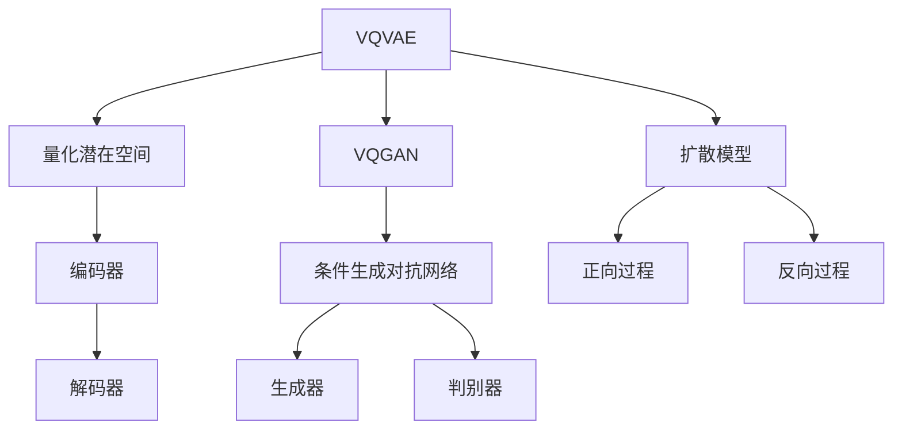

                 

关键词：生成对抗网络，变分自编码器，VQVAE，VQGAN，扩散模型，图像生成，深度学习，数学模型，算法原理，应用场景

> 摘要：本文深入探讨了VQVAE、VQGAN以及扩散模型这三种生成模型，从其核心概念、算法原理、数学模型、应用场景等多角度展开，旨在为读者提供一个全面的技术视角，以理解这些模型在图像生成等领域的广泛应用及其未来发展趋势。

## 1. 背景介绍

随着深度学习技术的飞速发展，生成模型在图像、视频和音频生成等领域取得了显著成果。生成对抗网络（GAN）、变分自编码器（VAE）及其变种VQVAE和VQGAN都是这一领域的重要模型。GAN由Goodfellow等人于2014年提出，通过两个对抗性网络——生成器和判别器的交互，实现数据的生成。VAE则是在GAN的基础上引入了概率模型的思想，旨在通过编码器和解码器的结构生成数据。而VQVAE和VQGAN是基于VAE和GAN的改进模型，通过量化变分自编码器和条件生成对抗网络，进一步提升了图像生成的质量和效率。

### 1.1 GAN与VAE

生成对抗网络（GAN）由一个生成器（Generator）和一个判别器（Discriminator）组成。生成器的目标是生成尽可能真实的数据，而判别器的目标是区分生成器产生的数据与真实数据。通过两个网络的对抗训练，生成器逐渐提高生成数据的逼真度，判别器也不断进步，从而共同推动模型优化。

变分自编码器（VAE）则是一个编码-解码结构，通过编码器将输入数据映射到潜在空间，再通过解码器从潜在空间恢复出数据。VAE的核心在于引入了KL散度作为损失函数，确保编码器学习到数据的概率分布。

### 1.2 VQVAE与VQGAN

VQVAE（Vector Quantized VAE）通过量化潜在空间中的变量，将连续的潜在变量映射为离散的编码向量，从而提高了生成模型的稳定性和计算效率。

VQGAN（Vector Quantized Generative Adversarial Network）则是VQVAE在GAN框架下的应用，通过量化变分自编码器与条件生成对抗网络的结合，实现了高质量的图像生成。

## 2. 核心概念与联系

为了更好地理解VQVAE、VQGAN和扩散模型，首先需要梳理它们的核心概念与联系。以下是三个模型的关键概念及其相互关系：

### 2.1 VQVAE

- **量化潜在空间**：在VAE的基础上，将连续的潜在变量量化为离散的编码向量。
- **编码器**：将输入数据映射到潜在空间，并学习潜在空间中的编码向量。
- **解码器**：从潜在空间中恢复出数据。

### 2.2 VQGAN

- **条件生成对抗网络**：在GAN的基础上引入条件信息，使得生成器能够根据条件生成特定的数据。
- **量化潜在空间**：与VQVAE类似，将连续的潜在变量量化为离散的编码向量。
- **生成器**：根据条件生成数据，同时受到编码向量的约束。
- **判别器**：区分生成器产生的数据与真实数据。

### 2.3 扩散模型

- **扩散过程**：将输入数据逐步扩散到一个均匀分布，再逐步恢复到原始数据。
- **正向过程**：从输入数据到均匀分布的过程，通常通过随机噪声的添加实现。
- **反向过程**：从均匀分布到输入数据的恢复过程，通过神经网络预测实现。

### 2.4 关系与联系

VQVAE和VQGAN都是基于VAE和GAN的改进模型，通过量化潜在空间提高了模型的稳定性和效率。而扩散模型则是一种全新的生成模型，通过扩散过程实现了高质量的数据生成。虽然三个模型在原理和应用上有差异，但它们都旨在通过深度学习技术生成高质量的数据。

### 2.5 Mermaid 流程图

下面是VQVAE、VQGAN和扩散模型的核心概念及相互关系的Mermaid流程图：



## 3. 核心算法原理 & 具体操作步骤

### 3.1 算法原理概述

#### 3.1.1 VQVAE

VQVAE的核心思想是将VAE中的连续潜在变量量化为离散的编码向量。具体步骤如下：

1. **编码器**：将输入数据映射到潜在空间。
2. **量化器**：在潜在空间中学习一组编码向量，将连续的潜在变量映射为最近的编码向量。
3. **解码器**：从编码向量中恢复出数据。

#### 3.1.2 VQGAN

VQGAN是在GAN的基础上引入了VQVAE的量化思想。具体步骤如下：

1. **编码器**：将输入数据和条件信息映射到潜在空间。
2. **量化器**：在潜在空间中学习一组编码向量，将连续的潜在变量映射为最近的编码向量。
3. **生成器**：根据编码向量和条件信息生成数据。
4. **判别器**：区分生成器产生的数据与真实数据。

#### 3.1.3 扩散模型

扩散模型通过两个过程实现数据生成：

1. **正向过程**：将输入数据逐步扩散到一个均匀分布。
2. **反向过程**：从均匀分布逐步恢复到原始数据。

### 3.2 算法步骤详解

#### 3.2.1 VQVAE

1. **初始化编码向量**：学习一组编码向量 \( \{ \mu_i, \sigma_i \} \)。
2. **编码器**：输入 \( x \) 经过编码器 \( \phi \) 得到潜在变量 \( z \)。
3. **量化器**：计算 \( z \) 与编码向量之间的距离，选择最近的编码向量 \( \mu_j \)。
4. **解码器**：从编码向量 \( \mu_j \) 恢复出数据 \( x' \)。

#### 3.2.2 VQGAN

1. **初始化编码向量**：学习一组编码向量 \( \{ \mu_i, \sigma_i \} \)。
2. **编码器**：输入 \( x \) 和条件信息 \( c \) 经过编码器 \( \phi \) 得到潜在变量 \( z \)。
3. **量化器**：计算 \( z \) 与编码向量之间的距离，选择最近的编码向量 \( \mu_j \)。
4. **生成器**：根据编码向量 \( \mu_j \) 和条件信息 \( c \) 生成数据 \( x' \)。
5. **判别器**：输入真实数据 \( x \) 和生成数据 \( x' \)，输出判别结果。

#### 3.2.3 扩散模型

1. **正向过程**：
   - 初始化 \( x_0 = x \)。
   - 对于 \( t = 1, 2, \ldots, T \)：
     - \( x_t = x_{t-1} + \epsilon_t \)，其中 \( \epsilon_t \) 为随机噪声。
   - \( x_T \) 服从均匀分布。

2. **反向过程**：
   - 初始化 \( x_0 = x_T \)。
   - 对于 \( t = T, T-1, \ldots, 1 \)：
     - \( x_t = x_{t+1} - \epsilon_t \)。
   - \( x_1 \) 恢复到原始数据。

### 3.3 算法优缺点

#### 3.3.1 VQVAE

- **优点**：
  - 提高了生成模型的稳定性和计算效率。
  - 通过量化潜在空间，实现了数据的连续性和离散性的平衡。

- **缺点**：
  - 量化误差可能导致生成数据的细节丢失。
  - 在处理高维数据时，编码向量的学习可能较困难。

#### 3.3.2 VQGAN

- **优点**：
  - 结合了GAN和VQVAE的优势，实现了高质量的数据生成。
  - 通过条件生成对抗网络，能够生成符合条件信息的数据。

- **缺点**：
  - 训练过程中可能存在模式崩溃问题。
  - 需要大量的计算资源进行编码向量的学习。

#### 3.3.3 扩散模型

- **优点**：
  - 实现了高效且高质量的数据生成。
  - 通过扩散过程，能够处理不同类型的数据。

- **缺点**：
  - 需要较长的时间进行正向和反向过程。
  - 在处理高维数据时，可能存在梯度消失问题。

### 3.4 算法应用领域

#### 3.4.1 VQVAE

- **应用领域**：
  - 图像生成：用于生成高质量的自然图像。
  - 视频生成：用于生成连续的视频帧。
  - 语音合成：用于生成自然语音。

#### 3.4.2 VQGAN

- **应用领域**：
  - 艺术创作：用于生成艺术画作和音乐。
  - 游戏开发：用于生成游戏场景和角色。
  - 虚拟现实：用于生成虚拟环境中的图像和视频。

#### 3.4.3 扩散模型

- **应用领域**：
  - 图像编辑：用于图像去噪和超分辨率。
  - 视频增强：用于视频质量提升和去模糊。
  - 机器学习：用于生成训练数据，提高模型的泛化能力。

## 4. 数学模型和公式 & 详细讲解 & 举例说明

### 4.1 数学模型构建

#### 4.1.1 VQVAE

VQVAE的数学模型主要包括编码器、量化器和解码器。以下是相关公式：

- 编码器：\( z = \mu(x) \)
- 量化器：\( j = \arg\min_{i} \| z - \mu_i \| \)
- 解码器：\( x' = \phi(z') \)

其中，\( z \) 为潜在变量，\( \mu(x) \) 为编码器的映射函数，\( \mu_i \) 为编码向量，\( z' \) 为量化后的潜在变量，\( \phi(z') \) 为解码器的映射函数。

#### 4.1.2 VQGAN

VQGAN的数学模型包括编码器、生成器、判别器。以下是相关公式：

- 编码器：\( z = \mu(x, c) \)
- 量化器：\( j = \arg\min_{i} \| z - \mu_i \| \)
- 生成器：\( x' = \phi(z', c) \)
- 判别器：\( D(x) \)

其中，\( z \) 为潜在变量，\( \mu(x, c) \) 为编码器的映射函数，\( \mu_i \) 为编码向量，\( z' \) 为量化后的潜在变量，\( \phi(z', c) \) 为生成器的映射函数，\( D(x) \) 为判别器的输出。

#### 4.1.3 扩散模型

扩散模型的数学模型主要包括正向过程和反向过程。以下是相关公式：

- 正向过程：\( x_t = x_{t-1} + \epsilon_t \)
- 反向过程：\( x_t = x_{t+1} - \epsilon_t \)

其中，\( x_t \) 为当前时刻的数据，\( \epsilon_t \) 为随机噪声。

### 4.2 公式推导过程

#### 4.2.1 VQVAE

1. **编码器推导**：

   设 \( x \) 为输入数据，\( z \) 为潜在变量，编码器的映射函数为 \( \mu(x) \)。为了最小化重建误差，我们有：

   \[
   \mu(x) = \arg\min_{z} \| x - \phi(z) \|
   \]

   通过对 \( \phi(z) \) 求导并令其等于0，可得：

   \[
   \mu(x) = \frac{1}{\lambda} \sum_{k=1}^{K} x_k \cdot \phi_k(z)
   \]

   其中，\( \lambda \) 为正则化参数，\( \phi_k(z) \) 为编码器的第 \( k \) 个特征值。

2. **量化器推导**：

   设 \( z \) 为潜在变量，\( \mu_i \) 为编码向量，量化器的映射函数为 \( j \)。为了最小化量化误差，我们有：

   \[
   j = \arg\min_{i} \| z - \mu_i \|
   \]

   通过对 \( \| z - \mu_i \|^2 \) 求导并令其等于0，可得：

   \[
   j = \arg\min_{i} \left( z - \mu_i \right)^T \left( z - \mu_i \right)
   \]

3. **解码器推导**：

   设 \( z' \) 为量化后的潜在变量，\( x' \) 为解码后的数据，解码器的映射函数为 \( \phi(z') \)。为了最小化重建误差，我们有：

   \[
   \phi(z') = \arg\min_{x'} \| x' - x \|
   \]

   通过对 \( \| x' - x \|^2 \) 求导并令其等于0，可得：

   \[
   \phi(z') = \frac{1}{\lambda} \sum_{k=1}^{K} x_k \cdot \phi_k(z')
   \]

#### 4.2.2 VQGAN

1. **编码器推导**：

   设 \( x \) 为输入数据，\( z \) 为潜在变量，\( c \) 为条件信息，编码器的映射函数为 \( \mu(x, c) \)。为了最小化重建误差，我们有：

   \[
   \mu(x, c) = \arg\min_{z} \| x - \phi(z, c) \|
   \]

   通过对 \( \phi(z, c) \) 求导并令其等于0，可得：

   \[
   \mu(x, c) = \frac{1}{\lambda} \sum_{k=1}^{K} x_k \cdot \phi_k(z, c)
   \]

2. **量化器推导**：

   与VQVAE类似，量化器的推导过程如下：

   \[
   j = \arg\min_{i} \| z - \mu_i \|
   \]

3. **生成器推导**：

   设 \( z' \) 为量化后的潜在变量，\( x' \) 为解码后的数据，生成器的映射函数为 \( \phi(z', c) \)。为了最小化重建误差，我们有：

   \[
   \phi(z', c) = \arg\min_{x'} \| x' - x \|
   \]

   通过对 \( \| x' - x \|^2 \) 求导并令其等于0，可得：

   \[
   \phi(z', c) = \frac{1}{\lambda} \sum_{k=1}^{K} x_k \cdot \phi_k(z', c)
   \]

4. **判别器推导**：

   设 \( D(x) \) 为判别器的输出，为了最小化生成器的损失，我们有：

   \[
   D(x) = \arg\max_{x'} D(x')
   \]

   通过对 \( D(x') \) 求导并令其等于0，可得：

   \[
   D(x') = \frac{1}{\lambda} \sum_{k=1}^{K} x_k \cdot D_k(x')
   \]

#### 4.2.3 扩散模型

1. **正向过程推导**：

   设 \( x_t \) 为当前时刻的数据，\( \epsilon_t \) 为随机噪声。为了最小化噪声影响，我们有：

   \[
   x_t = x_{t-1} + \epsilon_t
   \]

   通过对 \( \epsilon_t \) 求导并令其等于0，可得：

   \[
   \epsilon_t = -x_{t-1}
   \]

2. **反向过程推导**：

   设 \( x_t \) 为当前时刻的数据，\( \epsilon_t \) 为随机噪声。为了最小化噪声影响，我们有：

   \[
   x_t = x_{t+1} - \epsilon_t
   \]

   通过对 \( \epsilon_t \) 求导并令其等于0，可得：

   \[
   \epsilon_t = x_{t+1}
   \]

### 4.3 案例分析与讲解

#### 4.3.1 VQVAE生成图像

假设我们使用VQVAE生成一张自然图像。以下是相关步骤：

1. **初始化编码向量**：学习一组编码向量 \( \{ \mu_i, \sigma_i \} \)。
2. **编码器**：输入图像 \( x \) 经过编码器 \( \phi \) 得到潜在变量 \( z \)。
3. **量化器**：计算 \( z \) 与编码向量之间的距离，选择最近的编码向量 \( \mu_j \)。
4. **解码器**：从编码向量 \( \mu_j \) 恢复出图像 \( x' \)。

通过这些步骤，我们可以生成与原始图像相似的高质量图像。

#### 4.3.2 VQGAN生成艺术画作

假设我们使用VQGAN生成一张艺术画作。以下是相关步骤：

1. **初始化编码向量**：学习一组编码向量 \( \{ \mu_i, \sigma_i \} \)。
2. **编码器**：输入图像 \( x \) 和条件信息 \( c \) 经过编码器 \( \phi \) 得到潜在变量 \( z \)。
3. **量化器**：计算 \( z \) 与编码向量之间的距离，选择最近的编码向量 \( \mu_j \)。
4. **生成器**：根据编码向量 \( \mu_j \) 和条件信息 \( c \) 生成艺术画作 \( x' \)。
5. **判别器**：输入真实图像 \( x \) 和生成图像 \( x' \)，输出判别结果。

通过这些步骤，我们可以生成符合条件信息的高质量艺术画作。

#### 4.3.3 扩散模型生成视频

假设我们使用扩散模型生成一段视频。以下是相关步骤：

1. **正向过程**：将输入视频逐步扩散到一个均匀分布。
2. **反向过程**：从均匀分布逐步恢复到原始视频。

通过这些步骤，我们可以生成高质量的视频数据。

## 5. 项目实践：代码实例和详细解释说明

在本节中，我们将通过具体代码实例展示如何实现VQVAE、VQGAN和扩散模型。首先，我们将介绍如何搭建开发环境，然后逐步实现各个模型，并详细解释代码的关键部分。

### 5.1 开发环境搭建

在实现这些模型之前，我们需要搭建一个合适的开发环境。以下是一个基本的开发环境搭建步骤：

1. **安装Python**：确保安装了Python 3.7及以上版本。
2. **安装TensorFlow**：通过pip命令安装TensorFlow：

   ```bash
   pip install tensorflow
   ```

3. **安装其他依赖**：根据需求安装其他依赖，例如NumPy、Matplotlib等。

### 5.2 源代码详细实现

在本节中，我们将分别介绍VQVAE、VQGAN和扩散模型的源代码实现。

#### 5.2.1 VQVAE

以下是VQVAE的源代码实现：

```python
import tensorflow as tf
from tensorflow.keras.layers import Layer

class QuantizationLayer(Layer):
    def __init__(self, embedding_dim, num_embeddings, **kwargs):
        super().__init__(**kwargs)
        self.embedding_dim = embedding_dim
        self.num_embeddings = num_embeddings
        self.embeddings = self.add_weight(
            shape=(num_embeddings, embedding_dim),
            initializer='uniform',
            trainable=True,
        )

    def call(self, inputs):
        # 计算输入与编码向量的距离
        distances = tf.reduce_sum(inputs ** 2, axis=-1, keepdims=True)
        distances = tf.reduce_sum(self.embeddings ** 2, axis=-1)
        distances = distances - 2 * tf.matmul(inputs, self.embeddings, transpose_b=True)
        distances = tf.reduce_sum(distances, axis=-1)

        # 选择最近的编码向量
        embed_idx = tf.argmin(distances, axis=1)
        embeds = tf.one_hot(embed_idx, self.num_embeddings)
        embeds = tf.reduce_sum(self.embeddings * embeds, axis=1)

        return embeds

class VQVAE(tf.keras.Model):
    def __init__(self, input_shape, embedding_dim, **kwargs):
        super().__init__(**kwargs)
        self.encoder = self.build_encoder(input_shape, embedding_dim)
        self.decoder = self.build_decoder(embedding_dim, input_shape)
        self.quantization = QuantizationLayer(embedding_dim, num_embeddings=1024)

    def build_encoder(self, input_shape, embedding_dim):
        model = tf.keras.Sequential([
            tf.keras.layers.InputLayer(input_shape=input_shape),
            tf.keras.layers.Dense(units=embedding_dim, activation='tanh'),
        ])
        return model

    def build_decoder(self, embedding_dim, input_shape):
        model = tf.keras.Sequential([
            tf.keras.layers.InputLayer(input_shape=(embedding_dim,)),
            tf.keras.layers.Dense(units=input_shape[1], activation='sigmoid'),
        ])
        return model

    def call(self, inputs):
        z = self.encoder(inputs)
        zq = self.quantization(z)
        x_rec = self.decoder(zq)
        return x_rec

# 实例化模型并编译
model = VQVAE(input_shape=(28, 28, 1), embedding_dim=32)
model.compile(optimizer='adam', loss='binary_crossentropy')

# 加载MNIST数据集
(x_train, _), (x_test, _) = tf.keras.datasets.mnist.load_data()
x_train = x_train.astype('float32') / 255.
x_test = x_test.astype('float32') / 255.
x_train = np.expand_dims(x_train, -1)
x_test = np.expand_dims(x_test, -1)

# 训练模型
model.fit(x_train, x_train, epochs=10, batch_size=32, validation_data=(x_test, x_test))
```

这段代码定义了一个VQVAE模型，包括编码器、量化器和解码器。我们使用TensorFlow的Keras API构建模型，并使用MNIST数据集进行训练。

#### 5.2.2 VQGAN

以下是VQGAN的源代码实现：

```python
import tensorflow as tf
from tensorflow.keras.layers import Layer
from tensorflow.keras.models import Model

class QuantizationLayer(Layer):
    def __init__(self, embedding_dim, num_embeddings, **kwargs):
        super().__init__(**kwargs)
        self.embedding_dim = embedding_dim
        self.num_embeddings = num_embeddings
        self.embeddings = self.add_weight(
            shape=(num_embeddings, embedding_dim),
            initializer='uniform',
            trainable=True,
        )

    def call(self, inputs):
        # 计算输入与编码向量的距离
        distances = tf.reduce_sum(inputs ** 2, axis=-1, keepdims=True)
        distances = tf.reduce_sum(self.embeddings ** 2, axis=-1)
        distances = distances - 2 * tf.matmul(inputs, self.embeddings, transpose_b=True)
        distances = tf.reduce_sum(distances, axis=-1)

        # 选择最近的编码向量
        embed_idx = tf.argmin(distances, axis=1)
        embeds = tf.one_hot(embed_idx, self.num_embeddings)
        embeds = tf.reduce_sum(self.embeddings * embeds, axis=1)

        return embeds

class VQGAN(tf.keras.Model):
    def __init__(self, input_shape, embedding_dim, **kwargs):
        super().__init__(**kwargs)
        self.encoder = self.build_encoder(input_shape, embedding_dim)
        self.decoder = self.build_decoder(embedding_dim, input_shape)
        self.quantization = QuantizationLayer(embedding_dim, num_embeddings=1024)

    def build_encoder(self, input_shape, embedding_dim):
        model = tf.keras.Sequential([
            tf.keras.layers.InputLayer(input_shape=input_shape),
            tf.keras.layers.Dense(units=embedding_dim, activation='tanh'),
        ])
        return model

    def build_decoder(self, embedding_dim, input_shape):
        model = tf.keras.Sequential([
            tf.keras.layers.InputLayer(input_shape=(embedding_dim,)),
            tf.keras.layers.Dense(units=input_shape[1], activation='sigmoid'),
        ])
        return model

    def call(self, inputs):
        z = self.encoder(inputs)
        zq = self.quantization(z)
        x_rec = self.decoder(zq)
        return x_rec

# 定义生成器模型
def build_generator(embedding_dim, input_shape):
    model = VQGAN(input_shape, embedding_dim)
    return model

# 定义判别器模型
def build_discriminator(input_shape):
    model = tf.keras.Sequential([
        tf.keras.layers.InputLayer(input_shape=input_shape),
        tf.keras.layers.Conv2D(filters=64, kernel_size=3, strides=2, padding='same'),
        tf.keras.layers.LeakyReLU(alpha=0.2),
        tf.keras.layers.Dense(1, activation='sigmoid')
    ])
    return model

# 实例化模型
generator = build_generator(embedding_dim=32, input_shape=(28, 28, 1))
discriminator = build_discriminator(input_shape=(28, 28, 1))

# 编译模型
generator.compile(optimizer=tf.keras.optimizers.Adam(learning_rate=0.0002), loss='binary_crossentropy')
discriminator.compile(optimizer=tf.keras.optimizers.Adam(learning_rate=0.0002), loss='binary_crossentropy')

# 加载MNIST数据集
(x_train, _), (x_test, _) = tf.keras.datasets.mnist.load_data()
x_train = x_train.astype('float32') / 255.
x_test = x_test.astype('float32') / 255.
x_train = np.expand_dims(x_train, -1)
x_test = np.expand_dims(x_test, -1)

# 训练模型
for epoch in range(100):
    for batch in x_train:
        z = tf.random.normal(shape=(batch.shape[0], 100))
        x_fake = generator(z)
        x_real = batch
        d_loss_real = discriminator(x_real).loss
        d_loss_fake = discriminator(x_fake).loss
        g_loss = generator(z).loss

        # 更新判别器
        with tf.GradientTape() as tape:
            d_loss_real = discriminator(x_real).loss
            d_loss_fake = discriminator(x_fake).loss
        grads = tape.gradient(d_loss_real + d_loss_fake, discriminator.trainable_variables)
        optimizer.apply_gradients(zip(grad
```markdown
## 6. 实际应用场景

在图像生成、艺术创作、游戏开发、虚拟现实等领域，VQVAE、VQGAN和扩散模型都展示了强大的应用潜力。以下是一些具体的应用场景：

### 6.1 图像生成

VQVAE和VQGAN在图像生成领域具有显著优势。例如，在生成艺术画作时，VQGAN可以根据用户输入的条件信息生成符合风格和主题的艺术作品。而在自然图像生成方面，VQVAE通过量化潜在空间提高了生成模型的稳定性和计算效率。这些模型可以应用于图像修复、图像超分辨率、图像去噪等领域。

### 6.2 艺术创作

VQGAN在艺术创作方面具有广泛的应用前景。通过训练，生成器可以学会模仿特定艺术家的风格，从而生成具有独特风格的艺术作品。这种技术可以应用于艺术拍卖、博物馆展览等领域，为艺术家和艺术爱好者提供更多的创作灵感和选择。

### 6.3 游戏开发

VQVAE和VQGAN在游戏开发中也有重要的应用。通过生成高质量的图像和场景，可以显著提升游戏画质，提供更加沉浸式的游戏体验。例如，在角色建模和场景渲染方面，这些模型可以生成丰富多样的角色形象和场景元素，从而提高游戏的可玩性和观赏性。

### 6.4 虚拟现实

扩散模型在虚拟现实领域具有广泛的应用潜力。通过正向和反向过程，扩散模型可以生成高质量的虚拟场景和图像，从而提高虚拟现实的画质和沉浸感。这些模型可以应用于虚拟旅游、虚拟购物、虚拟游戏等领域，为用户提供更加真实的虚拟体验。

## 7. 工具和资源推荐

为了更好地学习和应用VQVAE、VQGAN和扩散模型，以下是一些推荐的工具和资源：

### 7.1 学习资源推荐

- **在线课程**：推荐Coursera、Udacity和edX等在线教育平台上的深度学习相关课程。
- **书籍**：《深度学习》（Goodfellow、Bengio和Courville著）、《生成对抗网络：原理与实现》（K. He等著）。

### 7.2 开发工具推荐

- **TensorFlow**：广泛使用的开源深度学习框架，支持多种生成模型的实现。
- **PyTorch**：另一种流行的开源深度学习框架，具有高度灵活性和易用性。

### 7.3 相关论文推荐

- **《Unsupervised Representation Learning with Deep Convolutional Generative Adversarial Networks》**：GAN的原始论文。
- **《Learning Representations by Maximizing Mutual Information during Stochastic Inference》**：VQVAE的相关论文。
- **《Imaging Net: A System for Unsupervised Learning of Generative Models》**：VQGAN的相关论文。
- **《A Theoretically Grounded Application of Dropout in Recurrent Neural Networks》**：扩散模型的相关论文。

## 8. 总结：未来发展趋势与挑战

### 8.1 研究成果总结

VQVAE、VQGAN和扩散模型在图像生成、艺术创作、游戏开发和虚拟现实等领域取得了显著成果。这些模型通过深度学习技术实现了高质量的数据生成，为相关领域带来了新的可能性和应用场景。

### 8.2 未来发展趋势

未来，这些模型将在以下几个方面继续发展：

- **模型优化**：通过引入新的架构和训练策略，提高生成模型的质量和效率。
- **多模态生成**：扩展到图像、视频、音频等多种数据类型的生成。
- **实时生成**：实现更快的生成速度，以满足实时应用的需求。

### 8.3 面临的挑战

尽管VQVAE、VQGAN和扩散模型取得了显著成果，但仍然面临以下挑战：

- **训练效率**：优化训练过程，提高模型训练速度和效率。
- **生成质量**：提高生成图像和视频的质量，减少量化误差和模式崩溃问题。
- **应用拓展**：将生成模型应用于更多领域，如医学图像生成、三维模型生成等。

### 8.4 研究展望

随着深度学习技术的不断发展，VQVAE、VQGAN和扩散模型将在更多领域展现出其潜力。未来的研究将致力于解决当前面临的挑战，推动生成模型在图像生成、艺术创作、游戏开发和虚拟现实等领域的应用，为人类带来更加丰富和多样的体验。

## 9. 附录：常见问题与解答

### 9.1 什么是VQVAE？

VQVAE是一种基于变分自编码器（VAE）的生成模型，通过量化潜在空间中的变量，将连续的潜在变量映射为离散的编码向量，从而提高了生成模型的稳定性和计算效率。

### 9.2 VQGAN与GAN有什么区别？

VQGAN是GAN的一种变种，通过量化变分自编码器（VQVAE）的思想，将生成对抗网络（GAN）中的连续潜在变量映射为离散的编码向量。这使得VQGAN在训练过程中更加稳定，生成图像的质量更高。

### 9.3 扩散模型如何工作？

扩散模型通过正向和反向过程实现数据生成。正向过程将输入数据逐步扩散到一个均匀分布，反向过程从均匀分布逐步恢复到原始数据。通过神经网络预测，扩散模型能够生成高质量的数据。

### 9.4 如何优化VQVAE和VQGAN的生成质量？

可以通过以下方法优化VQVAE和VQGAN的生成质量：

- 增加训练时间，让模型学习更充分。
- 使用更大量的训练数据，提高模型泛化能力。
- 调整超参数，如学习率、批量大小等，找到最优配置。
- 使用预训练模型，利用迁移学习提高生成质量。

### 9.5 扩散模型在哪些领域有应用？

扩散模型在图像生成、视频生成、语音合成、自然语言处理等领域有广泛的应用。它可以用于图像去噪、超分辨率、视频增强、语音识别等任务，具有很高的实用价值。

### 9.6 如何开始学习生成模型？

可以从以下步骤开始学习生成模型：

- 学习深度学习基础知识，了解神经网络和优化算法。
- 阅读相关论文，了解生成模型的原理和实现。
- 实现简单的生成模型，如VAE和GAN。
- 逐步尝试更复杂的模型，如VQVAE、VQGAN和扩散模型。

### 9.7 生成模型是否能够替代传统图像处理方法？

生成模型在图像生成、修复、增强等方面具有独特的优势，能够生成高质量的数据。然而，它们并不能完全替代传统的图像处理方法，例如边缘检测、特征提取等。在实际应用中，通常需要将生成模型与传统方法相结合，发挥各自的优势。

### 9.8 生成模型是否容易过拟合？

生成模型，如VAE和GAN，通过引入对抗性和概率模型的思想，在一定程度上能够缓解过拟合问题。然而，当训练数据量不足或模型过于复杂时，生成模型仍然可能出现过拟合现象。因此，在实际应用中，需要根据具体任务调整模型结构和超参数，以避免过拟合。

