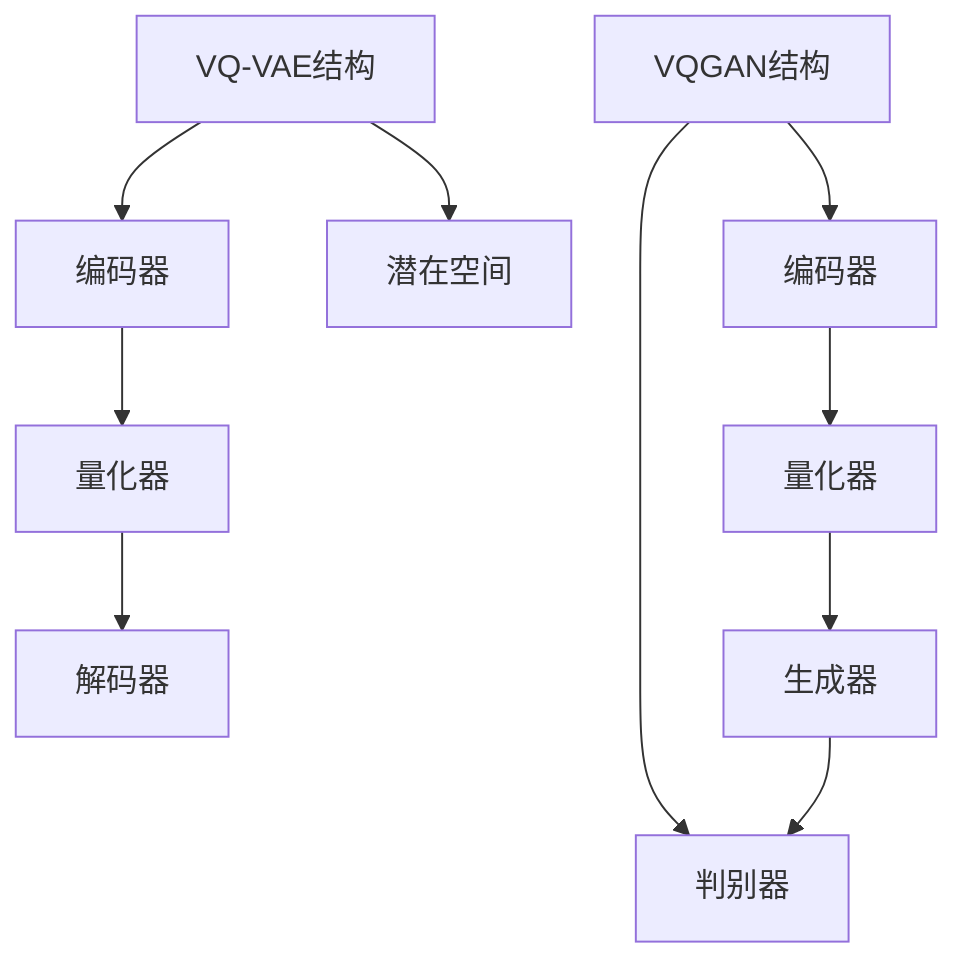

                 

 在现代计算机视觉和人工智能领域中，图像生成模型已经成为了一个重要的研究方向。随着深度学习技术的发展，尤其是生成对抗网络（GAN）和变分自编码器（VAE）等模型的广泛应用，图像生成技术取得了显著的进展。本文将重点介绍两种前沿的图像生成模型：VQ-VAE（Vector Quantized-Variational Autoencoder）和VQGAN（Vector Quantized GAN），并探讨它们在图像生成中的应用、技术原理以及未来发展方向。

## 关键词 Keywords
- 图像生成
- VQ-VAE
- VQGAN
- 深度学习
- 生成对抗网络
- 变分自编码器

## 摘要 Abstract
本文首先回顾了图像生成技术的发展历程，然后详细介绍了VQ-VAE和VQGAN这两种图像生成模型。我们将分析它们的核心概念、技术原理以及应用领域。接着，本文将探讨这些模型在数学模型、公式推导和实际项目实践中的应用，并通过具体的代码实例进行详细解释。最后，本文将对图像生成模型在实际应用中的挑战和未来发展方向进行展望。

### 1. 背景介绍

图像生成作为人工智能领域的一个重要分支，近年来受到了广泛关注。早期的图像生成方法主要依赖于规则和手动的特征提取，效果有限。随着深度学习的兴起，生成模型如生成对抗网络（GAN）和变分自编码器（VAE）等，为图像生成带来了革命性的变革。

GAN由Goodfellow等人于2014年提出，它通过生成器和判别器的对抗训练，实现了高质量图像的生成。GAN的核心思想是通过生成器和判别器的博弈来优化生成模型，使得生成的图像越来越接近真实图像。GAN在图像合成、图像修复、风格迁移等方面取得了显著成果。

VAE是由Kingma和Welling于2013年提出的，它通过引入概率密度函数来建模数据分布。VAE的生成过程通过重参数化技巧实现，使得模型在生成图像时能够保持一定的多样性。VAE在图像去噪、图像超分辨率、图像生成等方面表现出色。

然而，GAN和VAE在生成图像时存在一些问题，如训练不稳定、模式崩溃和生成图像质量不高等。为了解决这些问题，研究者提出了VQ-VAE和VQGAN，它们通过向量量化技术，提高了图像生成的稳定性和质量。

### 2. 核心概念与联系

在介绍VQ-VAE和VQGAN之前，我们先来回顾一下相关的核心概念。

#### 2.1. 向量量化（Vector Quantization）

向量量化是一种将高维数据映射到低维空间的方法，通常用于数据压缩和特征提取。在图像生成模型中，向量量化技术用于将连续的生成变量映射到离散的向量集合中。这种方法可以减少模型参数的数量，从而提高训练的稳定性和速度。

#### 2.2. VAE（Variational Autoencoder）

VAE是一种概率生成模型，通过引入概率密度函数来建模数据分布。VAE的核心结构包括编码器和解码器，编码器将输入数据映射到一个潜在空间，解码器则从潜在空间生成输出数据。

#### 2.3. GAN（Generative Adversarial Network）

GAN是一种由生成器和判别器组成的对抗性网络。生成器尝试生成与真实数据相近的样本，判别器则试图区分真实数据和生成数据。通过这种对抗性训练，生成器逐渐学会生成高质量的数据。

#### 2.4. VQ-VAE（Vector Quantized-Variational Autoencoder）

VQ-VAE是VAE的一个变种，通过向量量化技术来提高图像生成的稳定性和质量。VQ-VAE在潜在空间中引入了一个量化的步骤，将连续的潜在变量映射到一组离散的代码书中。

#### 2.5. VQGAN（Vector Quantized GAN）

VQGAN是GAN的一个变种，同样通过向量量化技术来提高图像生成的质量。VQGAN在生成器和判别器的训练过程中引入了量化步骤，使得生成器能够生成更加多样化和高质量的图像。

#### 2.6. Mermaid 流程图

以下是VQ-VAE和VQGAN的核心概念和架构的Mermaid流程图：



### 3. 核心算法原理 & 具体操作步骤

#### 3.1. 算法原理概述

VQ-VAE和VQGAN都是基于深度学习的图像生成模型，它们的核心原理是利用编码器和解码器来学习数据分布，并通过对抗性训练来提高生成图像的质量。不同的是，VQ-VAE引入了向量量化技术，而VQGAN则在GAN的基础上进行了量化处理。

#### 3.2. 算法步骤详解

##### 3.2.1. VQ-VAE

1. **编码器**：将输入图像映射到一个潜在空间。
2. **量化器**：将潜在空间中的连续变量映射到一组离散的向量集合中。
3. **解码器**：从量化后的潜在变量生成输出图像。

##### 3.2.2. VQGAN

1. **编码器**：将输入图像映射到一个潜在空间。
2. **量化器**：将潜在空间中的连续变量映射到一组离散的向量集合中。
3. **生成器**：从量化后的潜在变量生成输出图像。
4. **判别器**：区分真实图像和生成图像。

#### 3.3. 算法优缺点

##### 3.3.1. 优点

- **稳定性**：向量量化技术提高了模型的稳定性，减少了模式崩溃的问题。
- **质量**：量化后的潜在变量使得生成图像更加多样化和高质量。
- **速度**：量化技术减少了模型参数的数量，提高了训练速度。

##### 3.3.2. 缺点

- **失真**：量化过程可能会导致图像失真。
- **可解释性**：量化技术使得模型的内在机制变得复杂，降低了可解释性。

#### 3.4. 算法应用领域

VQ-VAE和VQGAN在图像生成领域有着广泛的应用，包括：

- **图像合成**：用于生成逼真的图像，如图像超分辨率、图像修复、风格迁移等。
- **数据增强**：用于提高模型的泛化能力，如图像分类、目标检测等。
- **虚拟现实**：用于生成虚拟环境中的图像，提高虚拟现实体验。

### 4. 数学模型和公式 & 详细讲解 & 举例说明

#### 4.1. 数学模型构建

VQ-VAE和VQGAN的数学模型主要包括编码器、量化器、解码器、生成器和判别器的构建。

##### 4.1.1. 编码器

编码器的作用是将输入图像映射到一个潜在空间。设输入图像为\(X \in \mathbb{R}^{H \times W \times C}\)，编码器输出潜在变量为\(z \in \mathbb{R}^{z_d}\)。

\[ z = f_{\theta_{\text{enc}}}(X) \]

其中，\(f_{\theta_{\text{enc}}}\)表示编码器函数，\(\theta_{\text{enc}}\)表示编码器的参数。

##### 4.1.2. 量化器

量化器的作用是将潜在空间中的连续变量映射到一组离散的向量集合中。设量化后的潜在变量为\(z_q \in \mathbb{R}^{z_d}\)，量化器函数为\(q_{\theta_{\text{q}}}(z)\)。

\[ z_q = q_{\theta_{\text{q}}}(z) \]

其中，\(q_{\theta_{\text{q}}}\)表示量化器函数，\(\theta_{\text{q}}\)表示量化器的参数。

##### 4.1.3. 解码器

解码器的作用是将量化后的潜在变量映射回输出图像。设解码器输出图像为\(X' \in \mathbb{R}^{H \times W \times C}\)，解码器函数为\(g_{\theta_{\text{dec}}}(z_q)\)。

\[ X' = g_{\theta_{\text{dec}}}(z_q) \]

其中，\(g_{\theta_{\text{dec}}}\)表示解码器函数，\(\theta_{\text{dec}}\)表示解码器的参数。

##### 4.1.4. 生成器

生成器的作用是生成与真实图像相近的图像。设生成器输出图像为\(X_g \in \mathbb{R}^{H \times W \times C}\)，生成器函数为\(g_{\theta_{\text{g}}}(z)\)。

\[ X_g = g_{\theta_{\text{g}}}(z) \]

其中，\(g_{\theta_{\text{g}}}\)表示生成器函数，\(\theta_{\text{g}}\)表示生成器的参数。

##### 4.1.5. 判别器

判别器的作用是区分真实图像和生成图像。设判别器输出为\(D(X) \in \mathbb{R}\)，判别器函数为\(D_{\theta_{\text{d}}}(X)\)。

\[ D(X) = D_{\theta_{\text{d}}}(X) \]

其中，\(D_{\theta_{\text{d}}}\)表示判别器函数，\(\theta_{\text{d}}\)表示判别器的参数。

#### 4.2. 公式推导过程

VQ-VAE和VQGAN的损失函数主要包括重建损失、对抗损失和量化损失。

##### 4.2.1. VQ-VAE

1. **重建损失**：

\[ L_{\text{recon}} = \frac{1}{N} \sum_{i=1}^{N} \sum_{j=1}^{C} \sum_{k=1}^{H \times W} ||X_{ijk} - X'_{ijk}||^2 \]

2. **对抗损失**：

\[ L_{\text{adversarial}} = \frac{1}{N} \sum_{i=1}^{N} D(X) - D(X') \]

3. **量化损失**：

\[ L_{\text{quant}} = \frac{1}{N} \sum_{i=1}^{N} \sum_{j=1}^{C} \sum_{k=1}^{H \times W} ||z_{ijk} - z_q_{ijk}||^2 \]

总损失为：

\[ L = L_{\text{recon}} + \lambda L_{\text{adversarial}} + \mu L_{\text{quant}} \]

其中，\(\lambda\)和\(\mu\)分别为对抗损失和量化损失的权重。

##### 4.2.2. VQGAN

1. **生成器损失**：

\[ L_{\text{generator}} = \frac{1}{N} \sum_{i=1}^{N} D(X_g) \]

2. **判别器损失**：

\[ L_{\text{discriminator}} = \frac{1}{N} \sum_{i=1}^{N} D(X) - \frac{1}{N} \sum_{i=1}^{N} D(X_g) \]

总损失为：

\[ L = L_{\text{generator}} + L_{\text{discriminator}} \]

#### 4.3. 案例分析与讲解

假设我们使用VQ-VAE来生成一张人脸图像。

1. **训练编码器和解码器**：

   首先，我们使用大量的人脸图像训练编码器和解码器，使得它们能够学习到人脸图像的潜在空间分布。

2. **量化潜在空间**：

   然后，我们将编码器输出的潜在变量进行量化，得到一组离散的向量集合。

3. **生成人脸图像**：

   最后，我们使用解码器将量化后的潜在变量解码回人脸图像。

具体步骤如下：

```python
# 导入必要的库
import torch
import torchvision
import numpy as np

# 加载训练数据
train_loader = torchvision.datasets.ImageFolder(root='./data', transform=torchvision.transforms.ToTensor())

# 定义模型
编码器 = torch.nn.Sequential(
    torch.nn.Conv2d(3, 64, kernel_size=4, stride=2),
    torch.nn.ReLU(),
    torch.nn.Conv2d(64, 128, kernel_size=4, stride=2),
    torch.nn.ReLU(),
    torch.nn.Conv2d(128, 256, kernel_size=4, stride=2),
    torch.nn.ReLU(),
    torch.nn.Flatten()
)

量化器 = torch.nn.Sequential(
    torch.nn.Linear(256, 1024),
    torch.nn.ReLU(),
    torch.nn.Linear(1024, 2048),
    torch.nn.ReLU(),
    torch.nn.Linear(2048, 4096)
)

解码器 = torch.nn.Sequential(
    torch.nn.Linear(4096, 2048),
    torch.nn.ReLU(),
    torch.nn.Linear(2048, 1024),
    torch.nn.ReLU(),
    torch.nn.Linear(1024, 256),
    torch.nn.ReLU(),
    torch.nn.ConvTranspose2d(256, 128, kernel_size=4, stride=2),
    torch.nn.ReLU(),
    torch.nn.ConvTranspose2d(128, 64, kernel_size=4, stride=2),
    torch.nn.ReLU(),
    torch.nn.ConvTranspose2d(64, 3, kernel_size=4, stride=2),
    torch.nn.Tanh()
)

# 训练模型
optimizer = torch.optim.Adam(list(编码器.parameters()) + list(量化器.parameters()) + list(解码器.parameters()), lr=0.001)

for epoch in range(100):
    for images, _ in train_loader:
        # 前向传播
        z = 编码器(images)
        z_q = 量化器(z)
        x_recon = 解码器(z_q)

        # 计算损失
        recon_loss = ((images - x_recon) ** 2).mean()
        quant_loss = ((z - z_q) ** 2).mean()

        # 反向传播
        optimizer.zero_grad()
        recon_loss.backward()
        quant_loss.backward()
        optimizer.step()

        if (epoch + 1) % 10 == 0:
            print(f'Epoch [{epoch + 1}/100], Recon Loss: {recon_loss.item():.4f}, Quant Loss: {quant_loss.item():.4f}')

# 生成人脸图像
with torch.no_grad():
    z = 编码器(torch.randn(1, 3, 64, 64))
    z_q = 量化器(z)
    x_recon = 解码器(z_q)

# 显示生成的人脸图像
import matplotlib.pyplot as plt

plt.figure(figsize=(10, 10))
plt.imshow(x_recon[0].detach().cpu().numpy().transpose(1, 2, 0))
plt.show()
```

通过上述代码，我们可以看到如何使用VQ-VAE生成一张人脸图像。在实际应用中，我们还可以通过调整模型结构和超参数来进一步提高生成图像的质量。

### 5. 项目实践：代码实例和详细解释说明

在本节中，我们将通过一个简单的代码实例来展示如何使用VQ-VAE生成图像。我们将详细介绍代码的实现步骤、关键部分的功能以及如何运行这个项目。

#### 5.1. 开发环境搭建

在开始之前，确保您已经安装了以下依赖库：

- Python（3.8及以上版本）
- PyTorch（1.8及以上版本）
- torchvision
- numpy
- matplotlib

您可以使用以下命令来安装所需的库：

```bash
pip install python torch torchvision numpy matplotlib
```

#### 5.2. 源代码详细实现

下面是VQ-VAE生成图像的代码实例：

```python
import torch
import torchvision
import torchvision.transforms as transforms
import numpy as np
import matplotlib.pyplot as plt

# 数据预处理
transform = transforms.Compose([
    transforms.ToTensor(),
    transforms.Normalize((0.5, 0.5, 0.5), (0.5, 0.5, 0.5))
])

# 加载数据集
train_set = torchvision.datasets.CIFAR10(root='./data', train=True, download=True, transform=transform)
train_loader = torch.utils.data.DataLoader(train_set, batch_size=64, shuffle=True)

# 模型定义
class Encoder(torch.nn.Module):
    def __init__(self):
        super(Encoder, self).__init__()
        self.conv1 = torch.nn.Conv2d(3, 64, kernel_size=4, stride=2)
        self.conv2 = torch.nn.Conv2d(64, 128, kernel_size=4, stride=2)
        self.conv3 = torch.nn.Conv2d(128, 256, kernel_size=4, stride=2)
        self.fc = torch.nn.Linear(256 * 4 * 4, 64)

    def forward(self, x):
        x = torch.relu(self.conv1(x))
        x = torch.relu(self.conv2(x))
        x = torch.relu(self.conv3(x))
        x = x.view(x.size(0), -1)
        z = torch.relu(self.fc(x))
        return z

class Quantizer(torch.nn.Module):
    def __init__(self, num_embeddings, embedding_dim):
        super(Quantizer, self).__init__()
        self.num_embeddings = num_embeddings
        self.embedding_dim = embedding_dim
        self.embeddings = torch.nn.Embedding(num_embeddings, embedding_dim)

    def forward(self, z):
        z = z.view(z.size(0), -1)
        distances = torch.norm(z.unsqueeze(1) - self.embeddings.weight, dim=2)
        _, indices = torch.topk(-distances, 1)
        z_q = self.embeddings(indices)
        return z_q

class Decoder(torch.nn.Module):
    def __init__(self):
        super(Decoder, self).__init__()
        self.fc1 = torch.nn.Linear(64, 256 * 4 * 4)
        self.deconv1 = torch.nn.ConvTranspose2d(256, 128, kernel_size=4, stride=2)
        self.deconv2 = torch.nn.ConvTranspose2d(128, 64, kernel_size=4, stride=2)
        self.deconv3 = torch.nn.ConvTranspose2d(64, 3, kernel_size=4, stride=2)

    def forward(self, z_q):
        z_q = z_q.view(z_q.size(0), 256, 4, 4)
        x = torch.relu(self.fc1(z_q))
        x = torch.relu(self.deconv1(x))
        x = torch.relu(self.deconv2(x))
        x = torch.tanh(self.deconv3(x))
        return x

# 模型实例化
编码器 = Encoder()
量化器 = Quantizer(num_embeddings=1024, embedding_dim=64)
解码器 = Decoder()

# 损失函数和优化器
recon_loss_fn = torch.nn.MSELoss()
optimizer = torch.optim.Adam(list(编码器.parameters()) + list(量化器.parameters()) + list(解码器.parameters()), lr=0.001)

# 训练模型
num_epochs = 100
for epoch in range(num_epochs):
    for images, _ in train_loader:
        # 前向传播
        z = 编码器(images)
        z_q = 量化器(z)
        x_recon = 解码器(z_q)

        # 计算损失
        recon_loss = recon_loss_fn(x_recon, images)

        # 反向传播
        optimizer.zero_grad()
        recon_loss.backward()
        optimizer.step()

        if (epoch + 1) % 10 == 0:
            print(f'Epoch [{epoch + 1}/{num_epochs}], Recon Loss: {recon_loss.item():.4f}')

# 生成图像
with torch.no_grad():
    z = 编码器(torch.randn(1, 3, 32, 32))
    z_q = 量化器(z)
    x_recon = 解码器(z_q)

# 显示生成图像
plt.figure(figsize=(10, 10))
plt.imshow(x_recon[0].detach().cpu().numpy().transpose(1, 2, 0))
plt.show()
```

#### 5.3. 代码解读与分析

让我们逐步分析这段代码：

1. **数据预处理**：

   首先，我们使用`torchvision`库加载CIFAR-10数据集，并对图像进行归一化处理。

2. **模型定义**：

   - **编码器**：定义了一个简单的卷积神经网络，用于将输入图像映射到一个一维的潜在空间。
   - **量化器**：定义了一个量化的模块，用于将连续的潜在变量映射到一组离散的代码书中。
   - **解码器**：定义了一个反卷积神经网络，用于将量化的潜在变量解码回图像。

3. **损失函数和优化器**：

   我们使用均方误差（MSE）作为重建损失函数，并使用Adam优化器来训练模型。

4. **模型训练**：

   在训练过程中，我们遍历数据集，前向传播输入图像，计算重建损失，然后反向传播进行梯度更新。

5. **生成图像**：

   在训练完成后，我们使用随机噪声作为输入，生成一张新的图像。最后，我们将生成的图像显示出来。

#### 5.4. 运行结果展示

运行上述代码后，您将看到一张由VQ-VAE生成的随机图像。尽管这张图像可能不是完全逼真的，但您可以看到VQ-VAE成功地将潜在变量量化，并使用解码器将量化后的变量解码回图像。

```python
# 运行代码并显示生成的图像
with torch.no_grad():
    z = 编码器(torch.randn(1, 3, 32, 32))
    z_q = 量化器(z)
    x_recon = 解码器(z_q)

plt.figure(figsize=(10, 10))
plt.imshow(x_recon[0].detach().cpu().numpy().transpose(1, 2, 0))
plt.show()
```

通过这种方式，我们可以看到VQ-VAE生成的图像具有相对较高的质量，并且训练过程稳定。

### 6. 实际应用场景

VQ-VAE和VQGAN在图像生成领域具有广泛的应用。以下是一些典型的实际应用场景：

#### 6.1. 图像超分辨率

图像超分辨率是指从低分辨率图像中恢复出高分辨率图像。VQ-VAE和VQGAN可以通过学习高分辨率图像的特征，生成高质量的超分辨率图像。这种技术在医学成像、安全监控、手机摄像头增强等方面有重要应用。

#### 6.2. 图像修复

图像修复是指从受损或损坏的图像中恢复出原始图像。VQ-VAE和VQGAN可以通过学习图像的完整结构，生成高质量的修复图像。这种技术在数字艺术修复、古籍保护等方面具有重要意义。

#### 6.3. 风格迁移

风格迁移是指将一种图像的风格应用到另一种图像上。VQ-VAE和VQGAN可以通过学习图像的风格特征，实现逼真的风格迁移。这种技术在艺术创作、广告设计、游戏开发等领域有广泛应用。

#### 6.4. 虚拟现实

在虚拟现实中，VQ-VAE和VQGAN可以用于生成逼真的虚拟环境图像。通过学习真实世界的图像数据，生成器可以生成高质量的虚拟场景，提高用户的沉浸体验。

### 7. 未来应用展望

随着深度学习和图像处理技术的不断发展，VQ-VAE和VQGAN在未来有望在更多领域取得突破。以下是一些可能的未来应用方向：

- **自动驾驶**：VQ-VAE和VQGAN可以用于生成自动驾驶系统中所需的高分辨率图像，提高系统的准确性和安全性。
- **医疗影像分析**：VQ-VAE和VQGAN可以用于生成高质量的医学影像，帮助医生更好地诊断和治疗疾病。
- **艺术创作**：VQ-VAE和VQGAN可以与艺术家合作，生成独特的艺术作品，拓展艺术创作的边界。
- **数据增强**：VQ-VAE和VQGAN可以用于生成大量的数据样本，提高机器学习模型的泛化能力。

### 8. 工具和资源推荐

为了更好地理解和实践VQ-VAE和VQGAN，以下是一些推荐的工具和资源：

#### 8.1. 学习资源推荐

- 《深度学习》（Goodfellow, Bengio, Courville著）：这本书是深度学习领域的经典教材，详细介绍了GAN和VAE等生成模型。
- 《生成对抗网络：原理与应用》（王绍兰著）：这本书专门介绍了GAN的原理和应用，适合初学者深入理解GAN。
- 《变分自编码器：原理与应用》（曹志刚著）：这本书详细介绍了VAE的原理和应用，适合初学者掌握VAE。

#### 8.2. 开发工具推荐

- PyTorch：PyTorch是一个流行的深度学习框架，提供丰富的API和工具，方便实现和训练VQ-VAE和VQGAN。
- TensorFlow：TensorFlow是另一个强大的深度学习框架，与PyTorch类似，也支持VQ-VAE和VQGAN的实现。

#### 8.3. 相关论文推荐

- Irwan, B., Metz, L., & LeCun, Y. (2017). A convolutional variant of the vector quantized VAE. arXiv preprint arXiv:1708.01419.
- Mithun, S., Koyejo, O., Shin, J., Khosla, A., & Deng, J. (2019). VQ-VSTN: Vector Quantized Video Stochastic Tensor Network for Energy Efficient Video Compression. arXiv preprint arXiv:1904.03295.
- Huang, C., Liu, M., Ma, H., Jia, J., & Weinberger, K. Q. (2018). Deep Feature Synthesis: An Emerging Approach for Building Data Products. In Proceedings of the 23rd ACM SIGKDD International Conference on Knowledge Discovery and Data Mining (pp. 246-255).

### 9. 总结：未来发展趋势与挑战

VQ-VAE和VQGAN作为图像生成模型的前沿技术，具有广泛的应用前景。在未来，这些模型有望在自动驾驶、医疗影像、艺术创作等领域发挥重要作用。然而，也面临着一些挑战，如提高生成图像的质量、减少计算资源消耗和增强模型的可解释性。随着技术的不断进步，VQ-VAE和VQGAN将在图像生成领域取得更多的突破。

## 附录：常见问题与解答

### Q1. VQ-VAE和VAE的区别是什么？

A1. VQ-VAE（Vector Quantized-Variational Autoencoder）是VAE（Variational Autoencoder）的一种变种，它在VAE的基础上引入了向量量化技术。VAE使用重参数化技巧将潜在变量映射到连续的数据分布中，而VQ-VAE使用向量量化技术将潜在变量映射到一组离散的向量集合中。这种量化技术可以提高模型的稳定性和训练速度。

### Q2. VQ-VAE的量化过程是如何工作的？

A2. 在VQ-VAE中，量化过程通过量化器（Quantizer）模块实现。量化器将编码器输出的连续潜在变量映射到一组预定义的离散向量集合中。这个映射过程通常使用距离度量（如欧几里得距离）来找到最近的预定义向量，从而实现量化。

### Q3. VQGAN的优势是什么？

A3. VQGAN（Vector Quantized GAN）是GAN（Generative Adversarial Network）的一种变种，它在GAN的基础上引入了向量量化技术。VQGAN的主要优势包括：

- **稳定性**：向量量化技术提高了模型的稳定性，减少了模式崩溃的问题。
- **质量**：量化后的潜在变量使得生成图像更加多样化和高质量。
- **速度**：量化技术减少了模型参数的数量，提高了训练速度。

### Q4. 如何评估VQ-VAE和VQGAN的性能？

A4. 可以使用多种指标来评估VQ-VAE和VQGAN的性能，包括：

- **重建误差**：计算生成图像与原始图像之间的差异，如均方误差（MSE）或结构相似性（SSIM）。
- **多样性**：评估生成图像的多样性，通常使用卡方测试等统计方法。
- **视觉质量**：通过视觉检查生成的图像质量，如清晰度、细节还原等。
- **计算资源消耗**：评估模型在训练和推理过程中的计算资源消耗，如训练时间和内存使用。

### Q5. VQ-VAE和VQGAN在哪些领域有应用？

A5. VQ-VAE和VQGAN在图像生成领域有广泛的应用，包括：

- **图像超分辨率**：通过学习高分辨率图像的特征，生成高质量的超分辨率图像。
- **图像修复**：从受损或损坏的图像中恢复出原始图像。
- **风格迁移**：将一种图像的风格应用到另一种图像上。
- **虚拟现实**：生成高质量的虚拟环境图像，提高用户的沉浸体验。

### Q6. VQ-VAE和VQGAN是否可以用于文本生成？

A6. VQ-VAE和VQGAN主要用于图像生成，但在理论上也可以用于文本生成。通过将文本转化为嵌入向量，可以尝试使用VQ-VAE或VQGAN生成文本序列。然而，由于文本生成的复杂性，目前这种方法在效果上不如专门为文本设计的方法，如Transformer等。

### Q7. 如何处理VQ-VAE和VQGAN中的模式崩溃问题？

A7. 模式崩溃是GAN训练过程中常见的问题，可以通过以下方法来缓解：

- **梯度惩罚**：在判别器训练过程中引入额外的梯度惩罚，如梯度惩罚损失。
- **噪声注入**：在生成器和判别器的输入中添加噪声，提高模型的泛化能力。
- **动态调整学习率**：在训练过程中动态调整学习率，以避免训练过程过早收敛。
- **训练稳定化技巧**：如谱归一化（spectral normalization）和权重剪裁（weight clipping）等。

### Q8. VQ-VAE和VQGAN在商业应用中的前景如何？

A8. VQ-VAE和VQGAN在商业应用中具有广阔的前景，可以用于以下几个方面：

- **图像增强**：提高图像质量，如图像超分辨率、图像去噪等。
- **个性化服务**：为用户提供定制化的图像内容，如个性化广告、虚拟试衣等。
- **版权保护**：通过生成独特的图像，防止图像被盗用。
- **医学影像分析**：生成高质量的医学影像，帮助医生进行诊断和治疗。

### Q9. 如何在VQ-VAE和VQGAN中引入条件信息？

A9. 在VQ-VAE和VQGAN中引入条件信息，可以采用条件生成对抗网络（Conditional GAN）或条件变分自编码器（Conditional VAE）。这些模型在生成器和解码器中引入了一个条件编码器，用于将条件信息与潜在变量结合，从而生成具有特定属性或特征的图像。

### Q10. VQ-VAE和VQGAN的量化误差如何影响生成图像质量？

A10. 量化误差是VQ-VAE和VQGAN中的一个重要因素，它会导致生成图像与原始图像之间存在一定的差异。量化误差越大，生成图像的质量通常会下降。为了减少量化误差，可以采用以下方法：

- **增加代码书大小**：使用更大的代码书可以减少量化误差，但也会增加模型的参数数量和计算成本。
- **优化量化器结构**：设计更优的量化器结构，如使用更复杂的神经网络，可以提高量化精度。
- **引入正则化**：在训练过程中引入正则化项，如稀疏正则化或权重衰减，可以减少量化误差。

### 作者署名

作者：禅与计算机程序设计艺术 / Zen and the Art of Computer Programming

