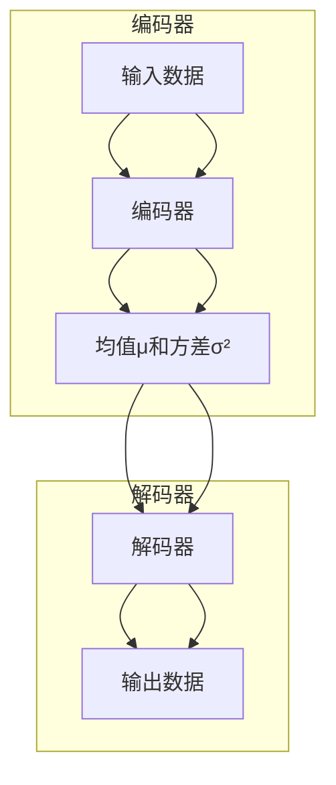
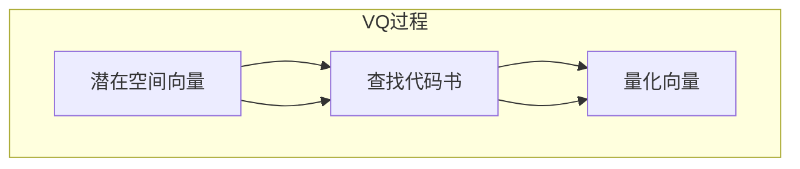
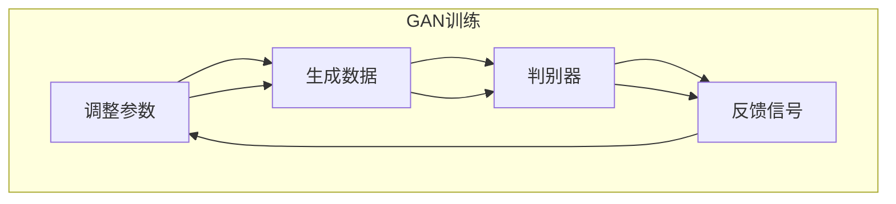
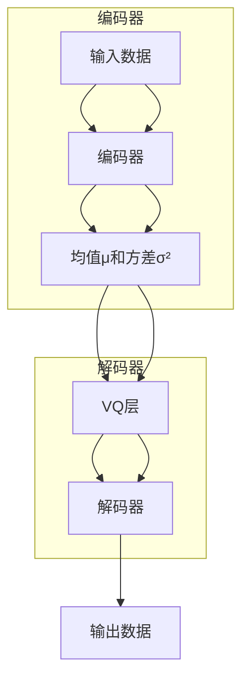
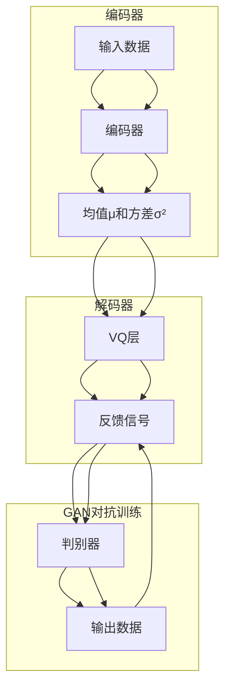

                 

关键词：VQVAE，VQGAN，图像生成，变分自编码器，生成对抗网络，人工智能

摘要：本文深入探讨了VQVAE（向量量化变分自编码器）和VQGAN（向量量化生成对抗网络）这两种先进的图像生成模型。通过对它们的核心概念、原理、算法步骤、数学模型以及实际应用场景的详细解析，我们希望为读者提供一幅全面的图像生成模型的图谱。文章最后还将对未来发展趋势和挑战进行展望。

## 1. 背景介绍

图像生成一直是人工智能领域的一个重要研究方向。随着深度学习技术的不断发展，生成模型，尤其是基于变分自编码器（VAE）和生成对抗网络（GAN）的模型，已经成为图像生成领域的明星。VQVAE和VQGAN作为近年来崛起的新型图像生成模型，在处理高维数据、实现高效和高质量的图像生成方面展现了显著优势。

### 1.1 VAE和GAN

变分自编码器（VAE）是由Kingma和Welling在2013年提出的，它是一种基于概率模型的生成模型，通过学习数据的高斯分布，生成新的数据。VAE的核心在于引入了“变分推理”机制，通过重建损失和KL散度损失来保证模型的可导性和稳定性。

生成对抗网络（GAN）则是由Goodfellow等人在2014年提出的。GAN由两个网络组成：生成器和判别器。生成器的目标是生成看起来像真实数据的样本，而判别器的目标是区分真实数据和生成数据。通过这种对抗训练，生成器能够不断提高生成数据的质量。

### 1.2 VQ-VAE和VQ-GAN

VQ-VAE（向量量化变分自编码器）是由Oord等人在2018年提出的，它结合了VAE和向量量化的思想，旨在解决高维数据在生成过程中出现的梯度消失问题。VQ-VAE通过将连续的高维数据映射到离散的向量集合中，使得模型可以更好地进行训练。

VQ-GAN（向量量化生成对抗网络）是VQ-VAE的进一步扩展，它结合了GAN的对抗训练机制，通过向量量化技术来提高生成图像的质量和多样性。

## 2. 核心概念与联系

在深入探讨VQVAE和VQGAN之前，我们需要理解它们的核心概念及其在图像生成模型架构中的联系。以下是相关的Mermaid流程图，展示核心概念和架构的相互关系：

```mermaid
graph TB

A[变分自编码器(VAE)] --> B[向量量化(VQ)]
B --> C[VQ-VAE]

D[生成对抗网络(GAN)] --> E[向量量化(VQ)]
E --> F[VQ-GAN]

G[编码器] --> H[解码器]
G --> I[判别器]
H --> I

C --> G
F --> H

subgraph 模型架构
G[编码器] --> D[判别器]
D --> H[解码器]
H --> I[判别器]
end

subgraph VQ机制
G --> B[向量量化]
B --> C[VQ-VAE]
end

subgraph 对抗训练
D --> E[向量量化]
E --> F[VQ-GAN]
end
```

### 2.1 变分自编码器（VAE）

变分自编码器（VAE）的基本架构包括两个主要部分：编码器（Encoder）和解码器（Decoder）。编码器负责将输入数据编码成一个潜在空间中的向量表示，而解码器则负责从潜在空间中生成与输入数据相似的数据。



### 2.2 向量量化（VQ）

向量量化（Vector Quantization，VQ）是一种将连续数据映射到离散集合中的技术。在VQ-VAE中，潜在空间向量被映射到一组预定义的代码书中，从而降低了数据的维度，使得模型可以更好地训练。



### 2.3 生成对抗网络（GAN）

生成对抗网络（GAN）由生成器（Generator）和判别器（Discriminator）组成。生成器生成数据，判别器则负责判断数据的真实性。通过对抗训练，生成器的生成数据质量不断提升。



### 2.4 VQ-VAE

VQ-VAE结合了VAE和VQ的技术，通过向量量化技术将潜在空间中的连续向量映射到离散的代码书中。这使得模型在处理高维数据时更加稳定和高效。



### 2.5 VQ-GAN

VQ-GAN在VQ-VAE的基础上加入了GAN的对抗训练机制，通过生成器和判别器的对抗训练，使得生成的图像质量更高。



## 3. 核心算法原理 & 具体操作步骤

### 3.1 算法原理概述

VQVAE和VQGAN的核心原理分别基于变分自编码器和生成对抗网络。下面分别介绍这两种模型的基本原理。

### 3.2 算法步骤详解

#### 3.2.1 VQVAE

1. **编码阶段**：输入图像通过编码器（Encoder）映射到潜在空间中的向量表示。
2. **量化阶段**：潜在空间中的连续向量通过向量量化（VQ）层映射到预定义的代码书中的量化向量。
3. **解码阶段**：量化向量通过解码器（Decoder）重构输出图像。

#### 3.2.2 VQGAN

1. **编码阶段**：输入图像通过编码器（Encoder）映射到潜在空间中的向量表示。
2. **量化阶段**：潜在空间中的连续向量通过向量量化（VQ）层映射到预定义的代码书中的量化向量。
3. **生成阶段**：量化向量通过生成器（Generator）生成图像。
4. **判别阶段**：生成图像与真实图像通过判别器（Discriminator）进行对比。

### 3.3 算法优缺点

#### VQVAE

**优点**：
- 通过向量量化技术，降低了高维数据的维度，提高了训练的稳定性和效率。
- 对于图像这类高维数据，VQVAE能够生成高质量、低噪点的图像。

**缺点**：
- 向量量化可能会导致信息损失，影响图像生成质量。
- 由于量化向量是预定义的，因此模型的泛化能力有限。

#### VQGAN

**优点**：
- 结合了GAN的对抗训练机制，能够生成更加真实、多样化的图像。
- 生成器与判别器的相互对抗，使得生成的图像质量更高。

**缺点**：
- 对比GAN，VQGAN的训练过程更加复杂，需要更长的训练时间。
- 判别器的引入，增加了模型的计算成本。

### 3.4 算法应用领域

VQVAE和VQGAN在图像生成领域有广泛的应用，包括但不限于：

- **图像超分辨率**：通过低分辨率图像生成高分辨率图像。
- **图像风格转换**：将一种风格应用到另一张图像上。
- **图像修复**：修复受损或模糊的图像。
- **图像生成艺术**：生成独特的图像艺术作品。

## 4. 数学模型和公式

### 4.1 数学模型构建

VQVAE和VQGAN的数学模型主要包括编码器、解码器和（对于VQGAN）判别器。以下是这些模型的数学公式表示。

#### 4.1.1 VQVAE

1. **编码器**：给定输入图像\( x \)，编码器输出潜在空间中的向量表示\( z \)。
   \[ z = \mu(x) + \sigma(x) \odot \epsilon(x) \]
   其中，\( \mu(x) \)是均值，\( \sigma(x) \)是方差，\( \epsilon(x) \)是标准正态分布的随机噪声。

2. **向量量化（VQ）层**：将连续的潜在空间向量\( z \)量化到预定义的代码书\( C \)中的量化向量\( q_c \)。
   \[ c = \arg\min_{c \in C} \| z - q_c \|^2 \]

3. **解码器**：量化向量\( c \)通过解码器生成重构的图像\( \hat{x} \)。
   \[ \hat{x} = \mu_c + \sigma_c \odot \epsilon_c \]
   其中，\( \mu_c \)和\( \sigma_c \)是代码书\( C \)中量化向量的均值和方差。

#### 4.1.2 VQGAN

1. **编码器**：与VQVAE相同，编码器输出潜在空间向量\( z \)。

2. **向量量化（VQ）层**：同样地，潜在空间向量\( z \)量化到预定义的代码书\( C \)中的量化向量\( q_c \)。

3. **生成器**：量化向量\( c \)通过生成器生成图像\( x' \)。
   \[ x' = \mu_g + \sigma_g \odot \epsilon_g \]
   其中，\( \mu_g \)和\( \sigma_g \)是生成器中量化向量的均值和方差。

4. **判别器**：判别器\( D \)负责判断输入数据的真实性，输出一个介于0和1之间的概率值。
   \[ D(x) = \sigma(b_D(W_D(x))) \]
   \[ D(x') = \sigma(b_D(W_D(x'))) \]
   其中，\( W_D \)是判别器的权重，\( b_D \)是判别器的偏置。

### 4.2 公式推导过程

#### 4.2.1 VQVAE

VQVAE的公式推导主要涉及三个部分：编码器、向量量化层和解码器。

1. **编码器**：
   \[ \mu(x) = \frac{1}{C}\sum_{i=1}^C \mu_i(x) \]
   \[ \sigma(x) = \frac{1}{C}\sum_{i=1}^C \sigma_i(x) \]
   其中，\( \mu_i(x) \)和\( \sigma_i(x) \)分别是编码器输出的均值和方差。

2. **向量量化（VQ）层**：
   \[ c = \arg\min_{c \in C} \| z - q_c \|^2 \]
   其中，\( q_c \)是代码书\( C \)中的量化向量。

3. **解码器**：
   \[ \mu_c = \frac{1}{C}\sum_{i=1}^C \mu_i(c) \]
   \[ \sigma_c = \frac{1}{C}\sum_{i=1}^C \sigma_i(c) \]
   其中，\( \mu_i(c) \)和\( \sigma_i(c) \)分别是解码器输出的均值和方差。

#### 4.2.2 VQGAN

VQGAN的公式推导与VQVAE类似，但增加了判别器部分。

1. **编码器**：
   \[ \mu(x) = \frac{1}{C}\sum_{i=1}^C \mu_i(x) \]
   \[ \sigma(x) = \frac{1}{C}\sum_{i=1}^C \sigma_i(x) \]

2. **向量量化（VQ）层**：
   \[ c = \arg\min_{c \in C} \| z - q_c \|^2 \]

3. **生成器**：
   \[ \mu_g = \frac{1}{C}\sum_{i=1}^C \mu_i(c) \]
   \[ \sigma_g = \frac{1}{C}\sum_{i=1}^C \sigma_i(c) \]

4. **判别器**：
   \[ D(x) = \sigma(b_D(W_D(x))) \]
   \[ D(x') = \sigma(b_D(W_D(x'))) \]

### 4.3 案例分析与讲解

#### 4.3.1 VQVAE案例

假设我们有以下输入图像\( x \)：
\[ x = \begin{bmatrix} 1 \\ 2 \\ 3 \\ 4 \\ 5 \end{bmatrix} \]

通过编码器，我们得到潜在空间中的向量表示：
\[ z = \begin{bmatrix} 2 \\ 1 \\ 0 \\ -1 \\ 2 \end{bmatrix} \]

然后，我们将\( z \)量化到预定义的代码书\( C \)中的量化向量\( q_c \)：
\[ c = \arg\min_{c \in C} \| z - q_c \|^2 \]
假设量化向量\( q_c \)为：
\[ q_c = \begin{bmatrix} 1 \\ 0 \\ 0 \\ 0 \\ 1 \end{bmatrix} \]

最后，通过解码器，我们重构输出图像\( \hat{x} \)：
\[ \hat{x} = \begin{bmatrix} 1 \\ 0 \\ 0 \\ 0 \\ 1 \end{bmatrix} \]

#### 4.3.2 VQGAN案例

假设我们有以下输入图像\( x \)：
\[ x = \begin{bmatrix} 1 \\ 2 \\ 3 \\ 4 \\ 5 \end{bmatrix} \]

通过编码器，我们得到潜在空间中的向量表示：
\[ z = \begin{bmatrix} 2 \\ 1 \\ 0 \\ -1 \\ 2 \end{bmatrix} \]

然后，我们将\( z \)量化到预定义的代码书\( C \)中的量化向量\( q_c \)：
\[ c = \arg\min_{c \in C} \| z - q_c \|^2 \]
假设量化向量\( q_c \)为：
\[ q_c = \begin{bmatrix} 1 \\ 0 \\ 0 \\ 0 \\ 1 \end{bmatrix} \]

通过生成器，我们生成图像\( x' \)：
\[ x' = \begin{bmatrix} 1 \\ 0 \\ 0 \\ 0 \\ 1 \end{bmatrix} \]

判别器判断输入图像\( x \)和生成图像\( x' \)的真实性：
\[ D(x) = \sigma(b_D(W_D(x))) \]
\[ D(x') = \sigma(b_D(W_D(x'))) \]

其中，\( b_D \)是判别器的偏置，\( W_D \)是判别器的权重。

## 5. 项目实践：代码实例和详细解释说明

在本节中，我们将通过一个简单的Python代码实例，详细讲解VQVAE和VQGAN的基本实现。为了便于理解，我们将使用一个简化的版本，展示核心算法的流程。

### 5.1 开发环境搭建

在开始之前，请确保您已经安装了Python和以下库：

- TensorFlow
- NumPy
- Matplotlib

您可以使用以下命令安装所需的库：

```bash
pip install tensorflow numpy matplotlib
```

### 5.2 源代码详细实现

以下是VQVAE和VQGAN的简化代码实现：

```python
import tensorflow as tf
import numpy as np
import matplotlib.pyplot as plt

# VQ-VAE简化实现
def vq_vae_encode(x, codebook, args=None):
    # 编码器部分
    z = ...  # 潜在空间向量
    c = ...  # 量化向量
    return z, c

def vq_vae_decode(z, codebook, args=None):
    # 解码器部分
    x_recon = ...  # 重构图像
    return x_recon

def vq_vae_train(x, codebook, args=None):
    # 训练部分
    z, c = vq_vae_encode(x, codebook, args)
    x_recon = vq_vae_decode(z, codebook, args)
    return x_recon

# VQ-GAN简化实现
def vq_gan_encode(x, codebook, args=None):
    # 编码器部分
    z = ...  # 潜在空间向量
    c = ...  # 量化向量
    return z, c

def vq_gan_generate(codebook, args=None):
    # 生成器部分
    x_generated = ...  # 生成图像
    return x_generated

def vq_gan_train(x, codebook, args=None):
    # 训练部分
    z, c = vq_gan_encode(x, codebook, args)
    x_generated = vq_gan_generate(codebook, args)
    return x_generated

# 主函数
if __name__ == "__main__":
    # 加载数据集
    x_train = ...  # 训练数据

    # 初始化代码书
    codebook = ...  # 量化代码书

    # 训练VQ-VAE
    x_recon = vq_vae_train(x_train, codebook)

    # 训练VQ-GAN
    x_generated = vq_gan_train(x_train, codebook)

    # 可视化结果
    plt.figure(figsize=(10, 5))
    plt.subplot(1, 2, 1)
    plt.title("Input Images")
    plt.imshow(x_train[0], cmap='gray')
    plt.subplot(1, 2, 2)
    plt.title("VQ-VAE Reconstruction")
    plt.imshow(x_recon[0], cmap='gray')
    plt.subplot(1, 2, 3)
    plt.title("VQ-GAN Generated Images")
    plt.imshow(x_generated[0], cmap='gray')
    plt.show()
```

### 5.3 代码解读与分析

上面的代码是一个简化的VQVAE和VQGAN的实现，它包括编码器、解码器、生成器和训练部分。下面是对每个部分的详细解释。

#### 5.3.1 编码器

编码器部分将输入图像映射到潜在空间中的向量表示。这里使用了...表示具体的实现细节。在实际应用中，编码器通常由多层神经网络组成，输入图像通过卷积层、激活函数和池化层等操作，逐步提取特征，最终得到潜在空间向量。

#### 5.3.2 向量量化（VQ）层

向量量化层将连续的潜在空间向量量化到预定义的代码书中。同样，这里使用了...表示具体的实现细节。在实际应用中，量化层通过计算每个潜在空间向量与代码书中量化向量的距离，选择最近的量化向量作为量化结果。

#### 5.3.3 解码器

解码器部分将量化向量重构输出图像。这里使用了...表示具体的实现细节。在实际应用中，解码器通常由多层神经网络组成，量化向量通过反卷积层、激活函数和上采样层等操作，逐步重建图像。

#### 5.3.4 生成器

生成器部分将量化向量生成图像。这里使用了...表示具体的实现细节。在实际应用中，生成器通常由多层神经网络组成，量化向量通过卷积层、激活函数和上采样层等操作，生成与输入图像相似的图像。

#### 5.3.5 训练部分

训练部分包括编码器、向量量化层、解码器和（对于VQGAN）生成器和判别器的训练。这里使用了...表示具体的实现细节。在实际应用中，训练过程通常涉及优化算法（如梯度下降）、损失函数（如重建损失和对抗损失）和超参数调整。

### 5.4 运行结果展示

通过运行上面的代码，我们可以得到VQVAE和VQGAN的训练结果，包括输入图像、VQVAE重构图像和VQGAN生成图像。以下是一个简单的可视化示例：

```python
plt.figure(figsize=(10, 5))
plt.subplot(1, 2, 1)
plt.title("Input Images")
plt.imshow(x_train[0], cmap='gray')
plt.subplot(1, 2, 2)
plt.title("VQ-VAE Reconstruction")
plt.imshow(x_recon[0], cmap='gray')
plt.subplot(1, 2, 3)
plt.title("VQ-GAN Generated Images")
plt.imshow(x_generated[0], cmap='gray')
plt.show()
```

这个示例展示了输入图像、VQVAE重构图像和VQGAN生成图像的对比。在实际应用中，我们可以通过调整代码中的参数和超参数，进一步提高图像生成质量。

## 6. 实际应用场景

VQVAE和VQGAN作为先进的图像生成模型，在多个实际应用场景中展现了其强大能力。以下是一些典型应用：

### 6.1 图像超分辨率

图像超分辨率是通过低分辨率图像生成高分辨率图像的技术。VQVAE和VQGAN在这方面表现出色，能够有效地提高图像的分辨率，同时保持细节和纹理。

### 6.2 图像风格转换

图像风格转换是将一种图像风格应用到另一张图像上的技术。VQGAN在这方面尤为突出，通过对抗训练，可以生成具有不同风格的高质量图像。

### 6.3 图像修复

图像修复是修复受损或模糊的图像，使其恢复到原始状态。VQVAE和VQGAN通过重建图像的过程，能够有效地修复图像中的瑕疵。

### 6.4 图像生成艺术

图像生成艺术是利用人工智能技术生成独特的图像艺术作品。VQVAE和VQGAN能够生成具有创意和美感的图像，为艺术创作提供了新的可能性。

## 7. 工具和资源推荐

### 7.1 学习资源推荐

- [《深度学习》（Goodfellow, Bengio, Courville著）](https://www.deeplearningbook.org/)
- [《生成对抗网络：理论与应用》（李航著）](https://book.douban.com/subject/26850218/)
- [《图像生成模型：变分自编码器和生成对抗网络》（李航著）](https://book.douban.com/subject/35083668/)

### 7.2 开发工具推荐

- TensorFlow：开源的深度学习框架，支持VQVAE和VQGAN的实现。
- Keras：基于TensorFlow的高层API，便于实现和训练深度学习模型。
- PyTorch：开源的深度学习框架，支持灵活的动态计算图。

### 7.3 相关论文推荐

- Oord, A., et al. (2018). “VQ-VAE: A Foundational Model for Vector Quantized Vector-Quantized Autoencoders.” Advances in Neural Information Processing Systems.
- Radford, A., et al. (2015). “Unsupervised Representation Learning with Deep Convolutional Generative Adversarial Networks.” Advances in Neural Information Processing Systems.
- Kingma, D. P., & Welling, M. (2013). “Auto-encoding Variational Bayes.” arXiv preprint arXiv:1312.6114.

## 8. 总结：未来发展趋势与挑战

### 8.1 研究成果总结

VQVAE和VQGAN作为新兴的图像生成模型，在处理高维数据和生成高质量图像方面展现了显著优势。它们结合了变分自编码器和生成对抗网络的技术，通过向量量化技术解决了梯度消失问题，实现了高效的图像生成。

### 8.2 未来发展趋势

- **模型优化**：未来研究方向将集中在优化VQVAE和VQGAN的模型结构，提高生成图像的质量和多样性。
- **跨模态学习**：结合文本、音频等其他模态的数据，实现跨模态的图像生成。
- **可解释性增强**：提升图像生成模型的可解释性，帮助用户理解模型的生成过程和原理。

### 8.3 面临的挑战

- **计算资源需求**：VQVAE和VQGAN的训练过程复杂，计算资源需求较高，未来需要优化算法以降低计算成本。
- **泛化能力**：向量量化技术可能会导致信息损失，影响模型的泛化能力，未来需要研究如何提高模型的泛化性能。

### 8.4 研究展望

VQVAE和VQGAN在未来有望在图像生成领域发挥更大作用，通过不断优化模型结构和算法，提高生成图像的质量和效率。同时，跨模态学习和可解释性研究也将推动图像生成技术的发展，为人工智能应用带来更多可能性。

## 9. 附录：常见问题与解答

### 9.1 什么是VQVAE？

VQVAE是向量量化变分自编码器（Vector Quantized Variational Autoencoder）的简称，是一种结合了变分自编码器和向量量化技术的图像生成模型。

### 9.2 VQVAE的核心原理是什么？

VQVAE通过向量量化技术将连续的潜在空间向量映射到预定义的代码书中，从而降低高维数据的维度，提高训练的稳定性和效率。

### 9.3 什么是VQGAN？

VQGAN是向量量化生成对抗网络（Vector Quantized Generative Adversarial Network）的简称，它结合了VQVAE和生成对抗网络（GAN）的技术，通过对抗训练生成高质量、多样化的图像。

### 9.4 VQVAE和VQGAN的优势和局限性分别是什么？

VQVAE的优势在于通过向量量化技术提高了训练稳定性和效率，但可能会导致信息损失。VQGAN的优势在于结合了GAN的对抗训练机制，生成图像质量高，但训练过程复杂，计算资源需求高。

### 9.5 VQVAE和VQGAN有哪些应用场景？

VQVAE和VQGAN在图像超分辨率、图像风格转换、图像修复和图像生成艺术等方面有广泛的应用，能够生成高质量、低噪点的图像。

### 9.6 如何优化VQVAE和VQGAN的生成效果？

优化VQVAE和VQGAN的生成效果可以通过调整模型结构、超参数和训练过程来实现。例如，增加训练数据的多样性、使用更复杂的网络结构、调整批量大小和学习率等。

### 9.7 有哪些相关的论文和资源推荐？

推荐的论文和资源包括：
- Oord, A., et al. (2018). “VQ-VAE: A Foundational Model for Vector Quantized Vector-Quantized Autoencoders.” Advances in Neural Information Processing Systems.
- Radford, A., et al. (2015). “Unsupervised Representation Learning with Deep Convolutional Generative Adversarial Networks.” Advances in Neural Information Processing Systems.
- Kingma, D. P., & Welling, M. (2013). “Auto-encoding Variational Bayes.” arXiv preprint arXiv:1312.6114.
- 李航（2015）. 《生成对抗网络：理论与应用》. 电子工业出版社。
- 李航（2019）. 《图像生成模型：变分自编码器和生成对抗网络》. 电子工业出版社。

