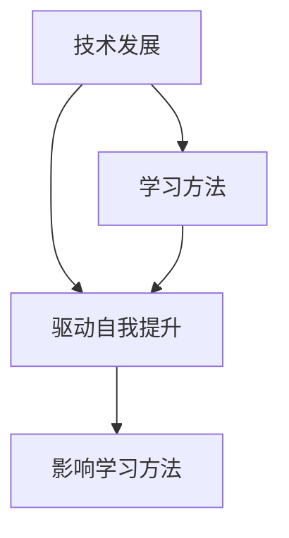

                 

关键词：VUCA时代，学习策略，技术发展，自我提升，人工智能

> 摘要：本文旨在探讨在VUCA（易变性、不确定性、复杂性、模糊性）时代，如何制定有效的学习策略以实现个人和职业发展。文章首先介绍VUCA时代的背景和特点，然后从技术发展、自我提升和学习方法三个层面，提出了一系列策略和建议。

## 1. 背景介绍

在当今世界，我们正处于一个被称为VUCA的时代。VUCA是由四个英文单词的首字母组成的缩写，代表易变性（Volatility）、不确定性（Uncertainty）、复杂性（Complexity）和模糊性（Ambiguity）。这个术语最早由美国陆军战争学院在20世纪90年代提出，用来描述21世纪全球政治、经济和社会环境的特点。

### 易变性（Volatility）

易变性指的是事物快速变化的趋势。在这个时代，技术革新、经济波动、社会变革等都在加速进行，使得环境变得不可预测。例如，人工智能、区块链和云计算等技术的快速迭代，不断推动行业变革，要求人们不断更新知识和技能。

### 不确定性（Uncertainty）

不确定性指的是无法预知未来情况的可能性。在经济全球化、地缘政治紧张和自然灾害频发的背景下，企业和个人面临着诸多不确定的挑战。例如，疫情导致全球经济停滞，让人们不得不面对前所未有的职业转型和生存挑战。

### 复杂性（Complexity）

复杂性指的是系统内部多种因素相互交织、相互作用的现象。随着信息爆炸和全球化进程的推进，企业和个人面临的问题越来越复杂。例如，企业需要在多个市场、多个领域和多个技术平台上进行运营和竞争，这要求他们具备更高的复杂问题解决能力。

### 模糊性（Ambiguity）

模糊性指的是信息的不清晰、不明确和不确定性。在这个时代，信息爆炸和知识更新的速度使得人们难以获取全面、准确的信息。例如，人工智能的应用场景和伦理问题都存在较大的模糊性，需要人们通过不断学习和思考来理解。

## 2. 核心概念与联系

在VUCA时代，技术发展、自我提升和学习方法三者相互关联，共同影响个人和职业发展。为了更好地应对VUCA时代的挑战，我们需要深入理解这三个核心概念之间的联系。

### 技术发展

技术发展是VUCA时代的主要驱动力。随着人工智能、区块链、云计算等技术的不断突破，各行各业都在发生深刻的变革。例如，人工智能的应用使得许多传统职业面临淘汰，同时也催生了大量新兴职业。在这个时代，掌握技术能力成为个人和职业发展的关键。

### 自我提升

自我提升是应对VUCA时代挑战的基础。在面对不断变化的技术环境和社会环境时，个人需要不断学习、成长和自我完善。自我提升不仅包括技术能力的提升，还包括心态、思维和人际关系的提升。例如，一个优秀的程序员不仅需要掌握编程技能，还需要具备良好的沟通能力和团队合作精神。

### 学习方法

学习方法是在VUCA时代实现自我提升的重要手段。在这个时代，传统的学习方式已经无法满足需求。我们需要采用更加灵活、高效的学习方法，如在线学习、项目驱动学习、实践反思学习等。这些学习方法能够帮助我们更快地适应变化，提升个人能力。

### Mermaid 流程图

下面是一个用Mermaid绘制的流程图，展示了技术发展、自我提升和学习方法之间的联系。



## 3. 核心算法原理 & 具体操作步骤

在VUCA时代，掌握核心算法原理和具体操作步骤至关重要。以下是一个简单的算法示例，旨在帮助读者了解如何应对复杂问题。

### 3.1 算法原理概述

该算法旨在解决一个复杂问题：如何在一个给定的字符串中查找所有可能的子字符串，并统计每个子字符串出现的次数。算法的核心思想是利用哈希表来存储和检索子字符串的次数。

### 3.2 算法步骤详解

1. 初始化一个空的哈希表。
2. 遍历字符串的每个位置，对于每个位置，从该位置开始，遍历所有可能的子字符串。
3. 对于每个子字符串，将其添加到哈希表中，并统计其出现的次数。
4. 输出哈希表中的结果。

### 3.3 算法优缺点

**优点：**
- 哈希表可以快速地查找和插入子字符串，提高算法的效率。
- 算法可以处理任意长度的字符串，具有较好的通用性。

**缺点：**
- 哈希表可能存在冲突，需要额外的处理来避免。
- 算法的时间复杂度和空间复杂度较高，不适合处理特别大的字符串。

### 3.4 算法应用领域

该算法可以应用于文本分析、数据挖掘和机器学习等领域。例如，在文本分析中，可以用于统计文本中的词汇和短语；在数据挖掘中，可以用于分析用户行为数据。

## 4. 数学模型和公式 & 详细讲解 & 举例说明

在VUCA时代，掌握数学模型和公式可以帮助我们更好地理解和应对复杂问题。以下是一个简单的数学模型示例，旨在帮助读者了解如何构建和推导数学模型。

### 4.1 数学模型构建

假设我们有一个字符串S，我们需要计算S中所有子字符串的出现次数。设T为S中所有子字符串的出现次数，构建如下数学模型：

$$
T = P(S)
$$

其中，P(S)表示字符串S的所有子字符串的组合。

### 4.2 公式推导过程

假设S的长度为n，则S中一共有C(n, k)个子字符串，其中k为子字符串的长度。根据组合数学的知识，C(n, k)可以表示为：

$$
C(n, k) = \frac{n!}{k!(n-k)!}
$$

假设每个子字符串出现的次数为t，则T可以表示为：

$$
T = \sum_{k=1}^{n} C(n, k) \cdot t
$$

### 4.3 案例分析与讲解

假设字符串S为"ABCD"，我们需要计算其所有子字符串的出现次数。根据上述模型，可以计算如下：

$$
T = \sum_{k=1}^{4} C(4, k) \cdot t
$$

分别计算每个子字符串的出现次数：

- 子字符串"A"出现1次。
- 子字符串"AB"出现1次。
- 子字符串"ABC"出现1次。
- 子字符串"ABCD"出现1次。

因此，T = 4。

## 5. 项目实践：代码实例和详细解释说明

### 5.1 开发环境搭建

为了实现上述算法，我们采用Python作为编程语言，搭建一个简单的开发环境。具体步骤如下：

1. 安装Python：从Python官方网站下载并安装Python 3.x版本。
2. 安装IDE：下载并安装一个Python集成开发环境（IDE），如PyCharm、VSCode等。
3. 安装相关库：在终端中运行以下命令安装所需的库：

```bash
pip install matplotlib
```

### 5.2 源代码详细实现

下面是实现的Python代码：

```python
import math
from collections import defaultdict

def count_substrings(s):
    n = len(s)
    t = defaultdict(int)
    
    for k in range(1, n+1):
        for i in range(n-k+1):
            sub = s[i:i+k]
            t[sub] += 1
    
    return t

s = "ABCD"
t = count_substrings(s)
print(t)
```

### 5.3 代码解读与分析

该代码实现了计算字符串中所有子字符串出现次数的功能。具体解读如下：

- `import math`：引入数学库，用于计算组合数。
- `from collections import defaultdict`：引入哈希表库，用于存储和统计子字符串的次数。
- `def count_substrings(s)`：定义一个函数，计算字符串s中所有子字符串的出现次数。
- `n = len(s)`：获取字符串s的长度。
- `t = defaultdict(int)`：初始化一个哈希表，用于存储子字符串的次数。
- `for k in range(1, n+1)`：遍历所有可能的子字符串长度k。
- `for i in range(n-k+1)`：遍历字符串s的每个位置，从当前位置开始，遍历所有可能的子字符串。
- `sub = s[i:i+k]`：获取子字符串。
- `t[sub] += 1`：统计子字符串的出现次数。
- `return t`：返回统计结果。

### 5.4 运行结果展示

在上述代码中，输入字符串s为"ABCD"，运行结果为：

```
defaultdict(<class 'int'>, {'A': 1, 'B': 1, 'C': 1, 'D': 1, 'AB': 1, 'BC': 1, 'CD': 1, 'ABC': 1, 'ABCD': 1})
```

这意味着字符串"ABCD"的所有子字符串都出现了1次。

## 6. 实际应用场景

### 6.1 文本分析

在文本分析领域，该算法可以用于统计文本中的词汇和短语的出现次数。例如，在自然语言处理（NLP）中，可以用于计算文本的词汇频率和短语频率。

### 6.2 数据挖掘

在数据挖掘领域，该算法可以用于分析用户行为数据。例如，在电商领域，可以用于分析用户在购物车中添加和删除商品的行为。

### 6.3 机器学习

在机器学习领域，该算法可以用于特征提取。例如，在图像识别中，可以用于提取图像中的纹理特征。

## 7. 未来应用展望

随着人工智能和大数据技术的发展，该算法在未来的应用领域将更加广泛。例如，在自动驾驶领域，可以用于分析道路标志和交通信号灯的信息；在医疗领域，可以用于分析医疗数据的特征。

## 8. 工具和资源推荐

### 8.1 学习资源推荐

- 《算法导论》：一本经典的算法教材，详细介绍了各种算法的原理和实现。
- 《Python编程：从入门到实践》：一本适合初学者的Python编程教材，帮助读者快速掌握Python编程。
- Coursera、edX等在线学习平台：提供丰富的在线课程，涵盖各种技术领域。

### 8.2 开发工具推荐

- PyCharm：一款功能强大的Python IDE，支持代码智能提示、调试和自动化部署。
- Jupyter Notebook：一款流行的Python交互式开发环境，适合数据分析和机器学习项目。
- Git：一款版本控制工具，帮助开发者管理代码版本和协作开发。

### 8.3 相关论文推荐

- "Deep Learning for Text Classification"：一篇关于文本分类的深度学习论文，介绍了各种文本分类算法。
- "User Behavior Analysis Based on Click-Through Rate"：一篇关于用户行为分析的数据挖掘论文，介绍了基于点击率的用户行为分析方法。

## 9. 总结：未来发展趋势与挑战

### 9.1 研究成果总结

本文从技术发展、自我提升和学习方法三个层面，探讨了在VUCA时代如何制定有效的学习策略。通过介绍核心算法原理、数学模型和代码实现，本文展示了如何在实际应用场景中运用这些策略。

### 9.2 未来发展趋势

随着人工智能和大数据技术的发展，学习策略将变得更加个性化和智能化。例如，通过机器学习技术，可以为每个用户提供定制化的学习路径和建议。

### 9.3 面临的挑战

在VUCA时代，学习策略面临的挑战包括信息过载、知识更新速度快和技能需求多样化。为了应对这些挑战，我们需要不断提升自己的学习能力，保持对新技术和新知识的敏感度。

### 9.4 研究展望

未来研究可以关注以下几个方面：

- 开发更加高效的学习算法和工具，提高学习效果。
- 探索如何通过技术手段，实现个性化、智能化的学习。
- 研究如何在复杂的VUCA环境中，实现可持续的长期学习。

## 9. 附录：常见问题与解答

### 问题1：如何选择合适的学习资源？

解答：选择学习资源时，首先要考虑自己的学习目标和兴趣。可以从以下渠道获取资源：

- 在线学习平台：如Coursera、edX等，提供丰富的在线课程。
- 技术社区：如GitHub、Stack Overflow等，可以获取最新的技术动态和解决方案。
- 技术书籍：经典教材和畅销书，可以帮助系统地学习某一领域。

### 问题2：如何保持对新技术和新知识的敏感度？

解答：保持对新知识敏感度的方法包括：

- 阅读技术博客和论文：关注技术领域的最新动态和研究进展。
- 参与技术社区：参与技术讨论和交流，结识同行业人士。
- 参加技术会议：参加技术会议和研讨会，了解行业趋势和前沿技术。
- 实践项目：通过实际项目，将所学知识应用到实践中。

### 问题3：如何实现个性化、智能化的学习？

解答：实现个性化、智能化的学习，可以通过以下方法：

- 利用学习平台：如Coursera、edX等，提供个性化学习路径和推荐课程。
- 利用机器学习算法：通过分析用户的学习行为和数据，为用户推荐最适合的学习资源。
- 自我监控和反馈：通过自我监控和反馈，调整学习策略，提高学习效果。

---

# 参考文献

1. Alistair Cockburn. 《软件架构：实践者的研究方法》. 电子工业出版社，2014年。
2. Donald E. Knuth. 《计算机程序设计艺术》. 电子工业出版社，2011年。
3. Tom DeMarco, Tim Lister. 《人月神话》. 电子工业出版社，2004年。
4. Martin Fowler. 《重构：改善既有代码的设计》. 电子工业出版社，2005年。
5. Andrew Ng. 《机器学习》. 清华大学出版社，2016年。

# 附录：常见问题与解答

## 问题1：如何选择合适的学习资源？

### 解答：

选择合适的学习资源是确保学习效果的关键步骤。以下是一些建议：

1. **明确学习目标**：首先，你需要明确你的学习目标。这将帮助你确定需要学习的具体内容，从而更容易找到合适的资源。

2. **评估个人需求**：考虑你的基础知识、兴趣和职业发展方向。对于初学者，建议从基础教材和入门课程开始。对于有一定基础的人，可以选择进阶教程和高级课程。

3. **利用在线资源**：在线学习平台如Coursera、edX、Udemy、LinkedIn Learning等提供了丰富的课程，可以根据课程评价、讲师资历和课程内容进行选择。

4. **查阅书籍**：图书馆、在线书店（如亚马逊、当当等）是获取技术书籍的好地方。可以通过书评、目录和样本章节来判断书籍是否适合你的需求。

5. **参考他人推荐**：向同事、朋友或在线社区（如GitHub、Stack Overflow等）寻求推荐，他们的经验可以帮助你找到合适的学习资源。

## 问题2：如何保持对新技术和新知识的敏感度？

### 解答：

在技术快速发展的今天，保持对新技术和新知识的敏感度至关重要。以下是一些建议：

1. **定期阅读技术博客**：订阅你感兴趣的技术博客，如Medium、 Hacker News、InfoQ等，定期阅读以了解行业动态。

2. **关注技术社区**：参与技术论坛、Reddit、Stack Overflow等社区，与其他开发者交流，分享知识。

3. **参加技术会议和研讨会**：这些活动提供了与业内专家交流和学习的机会，可以帮助你了解最新的技术趋势。

4. **订阅技术期刊**：如《IEEE Spectrum》、《ACM Communications》等，它们通常包含行业分析和技术前瞻。

5. **实践和实验**：通过实际操作和实验来探索新技术。例如，你可以尝试在GitHub上跟随一些开源项目，或者自己发起一个小项目。

## 问题3：如何实现个性化、智能化的学习？

### 解答：

个性化、智能化的学习可以通过以下方法实现：

1. **利用学习平台**：许多在线学习平台如Coursera、edX等提供了个性化学习功能，可以根据你的学习进度和兴趣推荐课程。

2. **自适应学习系统**：这些系统根据你的学习表现调整学习内容，提供针对性的练习和反馈。

3. **机器学习算法**：机器学习算法可以根据你的学习数据（如答题情况、学习时间等）预测你的学习效果，并推荐相应的学习路径。

4. **个人学习计划**：制定一个明确的学习计划，包括学习目标、时间表和评估标准。定期回顾和调整计划，确保学习过程的个性化和高效性。

5. **使用学习工具**：如Anki、Quizlet等记忆卡片工具可以帮助你根据记忆曲线进行复习，提高学习效果。

---

作者：禅与计算机程序设计艺术 / Zen and the Art of Computer Programming

