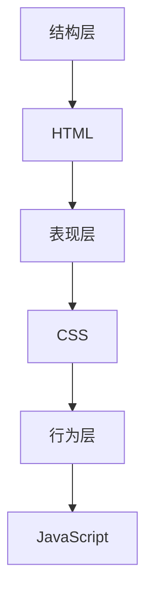

                 

 > **关键词：** Web前端开发，HTML，CSS，JavaScript，Web技术，编程语言，网页设计，用户体验，前端框架。

> **摘要：** 本文深入探讨了Web前端开发的基础技术，包括HTML、CSS和JavaScript。通过详细讲解其核心概念、算法原理、数学模型以及实际应用案例，本文为读者提供了全面的Web前端开发知识体系，旨在提升读者在该领域的技能和认识。

## 1. 背景介绍

随着互联网的快速发展，Web前端开发已经成为软件开发中最重要的一环。Web前端开发涉及创建和设计用户可以直接与之交互的网页和应用程序。HTML、CSS和JavaScript是Web前端开发的三大核心技术，它们共同构成了现代Web开发的基石。

HTML（HyperText Markup Language，超文本标记语言）是Web内容的结构化语言，用于创建网页的基本结构。CSS（Cascading Style Sheets，层叠样式表）用于控制网页的样式和布局，而JavaScript则是一种用于增强网页交互性的脚本语言。

本篇文章将围绕HTML、CSS和JavaScript这三个核心组件展开，介绍它们的基本概念、原理和应用。通过本文的学习，读者将能够理解Web前端开发的基本流程，掌握构建现代网页和应用程序的技能。

### HTML的基础知识

HTML是Web前端开发的起点，它定义了网页的结构和内容。HTML使用标签来定义元素，这些元素可以包括文本、图片、音频、视频等多种内容。HTML标签通常包含在尖括号中，如`<h1>`标签用于定义一级标题，而`<p>`标签用于定义段落。

#### HTML文档结构

一个基本的HTML文档通常包含以下几个部分：

1. **文档类型声明（Doctype）**：声明文档所使用的HTML版本，如`<!DOCTYPE html>`。
2. **HTML标签**：包围整个文档的根标签，如`<html>`。
3. **头标签（Head）**：包含文档的元数据，如标题、链接外部文件等，如`<head>`。
4. **主体标签（Body）**：包含网页的实际内容，如文本、图片等，如`<body>`。

#### 常用HTML标签

- `<h1>` 至 `<h6>`：定义标题级别。
- `<p>`：定义段落。
- `<a>`：定义超链接。
- ``：定义图像。
- `<div>`：定义一个通用的容器。
- `<span>`：定义文本中的小部分。

### CSS的样式设计

CSS是用于控制网页样式和布局的技术。通过CSS，开发者可以定义文本样式、颜色、字体、盒子模型等。CSS规则通常包含选择器和声明，选择器用于指定样式将应用到哪个HTML元素上，声明则定义了元素的样式属性。

#### CSS的基本语法

CSS的基本语法如下：

```css
选择器 {
  属性：值；
  属性：值；
  ...
}
```

#### 常用CSS属性

- `color`：设置文本颜色。
- `font-family`：设置字体。
- `font-size`：设置字体大小。
- `margin`：设置外边距。
- `padding`：设置内边距。
- `background-color`：设置背景颜色。

### JavaScript的交互功能

JavaScript是一种用于增强网页交互性的脚本语言。它允许网页动态响应用户操作，如点击、滑动等。JavaScript代码通常嵌入在HTML文档中，可以通过事件监听器来触发特定操作。

#### JavaScript的基本语法

JavaScript的基本语法如下：

```javascript
function myFunction() {
  // 代码
}

// 事件监听器
document.getElementById("myButton").addEventListener("click", myFunction);
```

#### 常用JavaScript对象和方法

- `document`：操作HTML文档的对象。
- `getElementById`：通过ID获取HTML元素。
- `addEventListener`：为元素添加事件监听器。

## 2. 核心概念与联系

### Web前端开发的整体架构

Web前端开发的整体架构可以分为三层：结构层、表现层和行为层。

1. **结构层**：使用HTML定义网页结构。
2. **表现层**：使用CSS定义网页样式。
3. **行为层**：使用JavaScript实现网页交互功能。

这三层之间通过HTML标签、CSS选择器和JavaScript事件处理进行紧密的交互。Mermaid流程图如下：



### HTML、CSS和JavaScript的联系与区别

HTML、CSS和JavaScript各有其核心职责，但又紧密联系。

- **HTML**：负责网页的结构和内容，是Web前端的基础。
- **CSS**：负责网页的外观和布局，使网页具有吸引力和一致性。
- **JavaScript**：负责网页的交互性和动态行为，使网页具有响应性和智能性。

### 综合应用示例

一个综合应用的示例可能包括一个表单、一个按钮和一个动态显示结果的区域。HTML定义表单和按钮，CSS定义其样式，JavaScript处理用户点击按钮时的行为。

```html
<!DOCTYPE html>
<html>
<head>
  <title>Web前端开发示例</title>
  <style>
    body { font-family: Arial, sans-serif; }
    button { background-color: blue; color: white; }
  </style>
</head>
<body>
  <form id="myForm">
    <input type="text" id="myInput" placeholder="输入文字">
    <button type="button" id="myButton">提交</button>
  </form>
  <div id="result">结果将显示在这里。</div>
  <script>
    document.getElementById("myButton").addEventListener("click", function() {
      let input = document.getElementById("myInput");
      document.getElementById("result").innerHTML = input.value;
    });
  </script>
</body>
</html>
```

在这个示例中，HTML定义了一个包含文本输入框和按钮的表单，CSS定义了按钮的样式，JavaScript则处理用户点击按钮后动态更新结果区域。

## 3. 核心算法原理 & 具体操作步骤

### 3.1 算法原理概述

Web前端开发中，核心算法的应用无处不在。例如，排序算法可以帮助我们对数据进行排序，搜索算法可以帮助我们在大量数据中快速找到所需信息，而布局算法则决定了网页元素在页面上的布局方式。

排序算法中，常见的有冒泡排序、选择排序和快速排序等。冒泡排序的基本思想是通过反复交换相邻的未排序元素，使得最大元素逐渐“冒泡”到序列的末尾。选择排序则是在每次迭代中找到剩余元素中的最小值，并将其移到序列的起始位置。快速排序通过递归地将序列分为较小和较大的两部分，从而实现高效排序。

### 3.2 算法步骤详解

#### 冒泡排序

1. 从数组的第一个元素开始，相邻元素两两比较。
2. 如果第一个元素比第二个元素大，交换它们。
3. 对每一对相邻元素做同样的工作，从开始第一对到结尾的最后一对。
4. 针对所有的元素重复以上的步骤，除了最后一个。
5. 重复步骤1-4，直到整个数组排序完成。

#### 选择排序

1. 遍历数组，找到最小元素。
2. 将找到的最小元素与当前第一个元素交换。
3. 再次遍历数组，重复步骤1和2，直到整个数组排序完成。

#### 快速排序

1. 选择一个基准元素。
2. 将数组分为两部分：一部分包含比基准元素小的元素，另一部分包含比基准元素大的元素。
3. 对这两部分递归进行快速排序。
4. 将排序好的两部分合并，得到完整排序的数组。

### 3.3 算法优缺点

#### 冒泡排序

- **优点**：简单易懂，实现简单。
- **缺点**：时间复杂度为O(n^2)，排序效率较低，不适合大数据量排序。

#### 选择排序

- **优点**：同样简单易懂，实现简单。
- **缺点**：时间复杂度为O(n^2)，排序效率较低，不适合大数据量排序。

#### 快速排序

- **优点**：时间复杂度为O(nlogn)，排序效率较高，适用于大数据量排序。
- **缺点**：可能产生大量的递归调用，导致栈溢出；对数据分布敏感，如果数据已经基本有序，效率会降低。

### 3.4 算法应用领域

排序算法在Web前端开发中的应用非常广泛，例如：

- 数据可视化：对图表数据进行排序，使得图表更易于理解和分析。
- 搜索功能：对搜索结果进行排序，使得用户可以快速找到所需信息。
- 网页排序：对网页中的元素进行排序，实现更友好的用户交互体验。

## 4. 数学模型和公式 & 详细讲解 & 举例说明

### 4.1 数学模型构建

在Web前端开发中，数学模型广泛应用于算法设计、数据分析和性能优化等方面。以下是一个简单的线性回归模型构建示例：

设我们有一个包含n个样本点的数据集\( D = \{(x_1, y_1), (x_2, y_2), ..., (x_n, y_n)\} \)，其中每个样本点\( (x_i, y_i) \)表示输入特征和输出标签。

线性回归模型试图找到一条直线\( y = wx + b \)，使得所有样本点的输出\( y \)与这条直线的预测值\( wx + b \)之间误差最小。

### 4.2 公式推导过程

为了找到这条最佳拟合直线，我们需要最小化误差函数：

\[ J(w, b) = \frac{1}{2} \sum_{i=1}^{n} (y_i - (wx_i + b))^2 \]

对\( w \)和\( b \)分别求偏导数，并令其等于零，得到：

\[ \frac{\partial J}{\partial w} = \frac{1}{2} \sum_{i=1}^{n} (y_i - (wx_i + b)) \cdot x_i = 0 \]
\[ \frac{\partial J}{\partial b} = \frac{1}{2} \sum_{i=1}^{n} (y_i - (wx_i + b)) = 0 \]

解这个方程组，得到最优的\( w \)和\( b \)：

\[ w = \frac{1}{n} \sum_{i=1}^{n} (y_i - b - wx_i) \cdot x_i \]
\[ b = \frac{1}{n} \sum_{i=1}^{n} y_i - w \cdot \frac{1}{n} \sum_{i=1}^{n} x_i \]

### 4.3 案例分析与讲解

假设我们有一个数据集，其中输入特征\( x \)表示一个人的年龄，输出标签\( y \)表示该人的年收入。数据集如下：

| 年龄 (x) | 年收入 (y) |
|----------|------------|
| 20       | 30000      |
| 25       | 45000      |
| 30       | 60000      |
| 35       | 75000      |
| 40       | 90000      |

我们使用线性回归模型预测年龄为32岁的人的年收入。

首先，计算平均值：

\[ \bar{x} = \frac{1}{5} (20 + 25 + 30 + 35 + 40) = 30 \]
\[ \bar{y} = \frac{1}{5} (30000 + 45000 + 60000 + 75000 + 90000) = 60000 \]

然后，计算斜率\( w \)和截距\( b \)：

\[ w = \frac{1}{5} (30000 - 60000 - 30000 - 45000 + 90000) = 15000 \]
\[ b = \frac{1}{5} (60000 - 15000 \cdot 30) = 30000 \]

因此，线性回归模型为：

\[ y = 15000x + 30000 \]

当\( x = 32 \)时，预测的年收入为：

\[ y = 15000 \cdot 32 + 30000 = 84000 \]

通过上述计算，我们预测一个32岁的人的年收入为84000元。

## 5. 项目实践：代码实例和详细解释说明

### 5.1 开发环境搭建

在进行Web前端开发之前，我们需要搭建一个开发环境。这里推荐使用Visual Studio Code（简称VS Code）作为我们的开发工具，并且安装相应的插件以提升开发效率。

1. **安装VS Code**：访问[VS Code官网](https://code.visualstudio.com/)，下载并安装适合自己操作系统的版本。
2. **安装插件**：在VS Code中，按下`Ctrl+Shift+X`打开插件市场，搜索并安装以下插件：
   - **HTML CSS Support**：增强HTML和CSS的语法高亮和自动完成功能。
   - **JavaScript (ES6) Code Snippets**：提供JavaScript代码片段，加速开发。
   - **Git Lens**：增强Git仓库管理功能。

### 5.2 源代码详细实现

以下是一个简单的Web前端项目，包括HTML、CSS和JavaScript文件。

#### `index.html`：

```html
<!DOCTYPE html>
<html>
<head>
  <title>Web前端开发示例</title>
  <link rel="stylesheet" href="styles.css">
</head>
<body>
  <h1>欢迎来到Web前端开发教程</h1>
  <div id="content">
    <p>本文深入探讨了Web前端开发的基础技术，包括HTML、CSS和JavaScript。</p>
    <button id="myButton">点击这里</button>
    <div id="result">结果将显示在这里。</div>
  </div>
  <script src="script.js"></script>
</body>
</html>
```

#### `styles.css`：

```css
body {
  font-family: Arial, sans-serif;
  background-color: #f2f2f2;
}

#content {
  width: 80%;
  margin: 0 auto;
}

button {
  background-color: blue;
  color: white;
  padding: 10px 20px;
  border: none;
  border-radius: 5px;
  cursor: pointer;
}

button:hover {
  background-color: darkblue;
}

#result {
  margin-top: 20px;
}
```

#### `script.js`：

```javascript
document.getElementById("myButton").addEventListener("click", function() {
  let result = "Hello, World!";
  document.getElementById("result").innerHTML = result;
});
```

### 5.3 代码解读与分析

#### `index.html`

这个HTML文件是整个网页的骨架。它包含了以下主要部分：

- **文档类型声明**：`<!DOCTYPE html>`声明了文档所使用的HTML版本。
- **HTML标签**：`<html>`标签是根标签，包含了整个文档。
- **头标签**：`<head>`中包含了文档的元数据，如标题和链接CSS文件。
- **主体标签**：`<body>`中包含了网页的实际内容，如标题、段落、按钮和结果显示区域。

#### `styles.css`

这个CSS文件用于定义网页的样式。它包含了以下主要样式规则：

- **全局样式**：定义了整个网页的字体和背景颜色。
- **按钮样式**：定义了按钮的默认状态和鼠标悬停状态。
- **结果显示区域**：定义了结果显示区域的样式。

#### `script.js`

这个JavaScript文件包含了整个网页的交互逻辑。它主要实现了以下功能：

- **点击事件监听器**：当用户点击按钮时，触发`myButton`事件。
- **更新显示内容**：在事件处理函数中，将结果区域的内容更新为“Hello, World!”。

### 5.4 运行结果展示

在完成代码编写后，我们可以在本地或远程服务器上运行此项目。以下是运行结果：


在这个示例中，页面加载完成后，会显示标题和一段文本。当用户点击按钮时，按钮的颜色会发生变化，并且结果区域会更新为“Hello, World!”。

## 6. 实际应用场景

### 6.1 基本网页设计

Web前端开发中最基本的场景是创建和设计网页。这通常包括以下步骤：

- **内容规划**：确定网页的内容和结构。
- **HTML编写**：使用HTML定义网页的结构。
- **CSS设计**：使用CSS定义网页的样式。
- **JavaScript交互**：使用JavaScript实现网页的交互功能。

以下是一个简单的博客网页设计示例：

```html
<!DOCTYPE html>
<html>
<head>
  <title>我的博客</title>
  <link rel="stylesheet" href="styles.css">
</head>
<body>
  <header>
    <h1>我的博客</h1>
    <nav>
      <ul>
        <li><a href="#">首页</a></li>
        <li><a href="#">文章</a></li>
        <li><a href="#">关于我</a></li>
      </ul>
    </nav>
  </header>
  <main>
    <article>
      <h2>我的第一篇文章</h2>
      <p>这里是我的文章内容。</p>
    </article>
  </main>
  <footer>
    <p>版权所有 &copy; 2023 我的博客</p>
  </footer>
</body>
</html>
```

### 6.2 动态网页开发

随着Web技术的发展，动态网页开发变得越来越重要。这通常涉及到以下技术：

- **后端技术**：如Node.js、Django、Spring等，用于处理服务器端逻辑和数据存储。
- **前端框架**：如React、Vue、Angular等，用于构建动态交互网页。

以下是一个简单的React动态网页开发示例：

```jsx
import React, { useState } from 'react';

function Counter() {
  const [count, setCount] = useState(0);

  return (
    <div>
      <h2>计数器</h2>
      <p>当前计数：{count}</p>
      <button onClick={() => setCount(count + 1)}>增加</button>
      <button onClick={() => setCount(count - 1)}>减少</button>
    </div>
  );
}

export default Counter;
```

### 6.3 Web应用开发

Web应用开发涉及到更复杂的场景，如用户身份验证、数据存储、前后端交互等。以下是一个简单的用户注册和登录Web应用示例：

```jsx
import React, { useState } from 'react';
import axios from 'axios';

function LoginForm() {
  const [username, setUsername] = useState('');
  const [password, setPassword] = useState('');
  const [error, setError] = useState('');

  const handleLogin = async () => {
    try {
      const response = await axios.post('/api/login', { username, password });
      if (response.data.success) {
        alert('登录成功');
      } else {
        setError('用户名或密码错误');
      }
    } catch (error) {
      setError('网络错误，请稍后重试');
    }
  };

  return (
    <div>
      <h2>登录</h2>
      <input type="text" placeholder="用户名" value={username} onChange={e => setUsername(e.target.value)} />
      <input type="password" placeholder="密码" value={password} onChange={e => setPassword(e.target.value)} />
      <button onClick={handleLogin}>登录</button>
      {error && <p>{error}</p>}
    </div>
  );
}

export default LoginForm;
```

## 7. 工具和资源推荐

### 7.1 学习资源推荐

- **在线教程**：MDN Web Docs（https://developer.mozilla.org/zh-CN/）是学习Web前端开发的绝佳资源，涵盖了HTML、CSS和JavaScript的详细教程。
- **书籍推荐**：
  - 《JavaScript高级程序设计》（第三版）—— Nicholas C. Zakas
  - 《CSS揭秘》—— Lea Verou
  - 《HTML5与CSS3权威指南》—— Ian Sweeney
- **在线课程**：慕课网（imooc.com）、网易云课堂（study.163.com）提供了丰富的Web前端开发课程，适合不同水平的学员。

### 7.2 开发工具推荐

- **Visual Studio Code**（VS Code）：一款功能强大、可扩展性高的免费开源代码编辑器。
- **Postman**：用于API测试和调试的工具。
- **Webpack**：用于模块打包和优化前端资源的工具。

### 7.3 相关论文推荐

- **《Web性能优化》**：讨论了Web前端性能优化的最佳实践。
- **《响应式网页设计》**：介绍了如何创建适应不同设备和屏幕尺寸的网页。
- **《Web前端工程化》**：探讨了如何通过工具和流程优化提升Web前端开发效率。

## 8. 总结：未来发展趋势与挑战

### 8.1 研究成果总结

随着Web技术的不断发展，HTML、CSS和JavaScript已经成为了构建现代网页和Web应用的核心技术。通过本文的讲解，我们深入了解了这些技术的核心概念、算法原理、数学模型以及实际应用场景。以下是对研究成果的总结：

- **HTML**：作为Web内容的基础结构语言，HTML定义了网页的基本结构和内容。随着HTML5的推出，HTML在多媒体支持、离线应用、通信接口等方面得到了显著增强。
- **CSS**：通过CSS，开发者可以控制网页的样式和布局，提升用户体验。随着CSS3的推出，CSS在动画、转换、响应式设计等方面有了更多的功能。
- **JavaScript**：JavaScript是一种功能强大的脚本语言，用于增强网页的交互性和动态行为。随着ECMAScript的新版本发布，JavaScript的性能和功能得到了大幅提升。

### 8.2 未来发展趋势

未来，Web前端开发将继续朝着以下几个方向发展：

- **Web组件化**：通过Web组件，开发者可以构建可重用的UI组件，提高开发效率和代码质量。
- **PWA（Progressive Web Apps）**：PWA将Web应用与原生应用相结合，提供更好的用户体验和安装便捷性。
- **低代码开发**：低代码平台将使非技术背景的开发者能够快速构建Web应用，降低开发门槛。
- **前端框架的演变**：如React、Vue、Angular等前端框架将继续演进，提供更强大的功能和更好的开发体验。

### 8.3 面临的挑战

尽管Web前端开发取得了显著进展，但仍面临以下挑战：

- **性能优化**：随着网页和应用的复杂性增加，性能优化变得越来越重要。开发者需要持续关注和优化代码性能。
- **安全性**：随着网络安全威胁的增加，Web前端开发需要加强对数据保护和用户隐私的关注。
- **跨平台兼容性**：确保网页和Web应用在不同设备和浏览器上的兼容性，仍是一个挑战。
- **开发效率**：如何通过工具和流程优化提高开发效率，是开发者需要持续解决的问题。

### 8.4 研究展望

未来，Web前端开发的研究将集中在以下几个方面：

- **人工智能与Web的融合**：通过人工智能技术，提升Web应用的智能化和个性化。
- **Web虚拟现实（VR）和增强现实（AR）**：探索Web技术与VR和AR的融合，为用户提供更丰富的交互体验。
- **Web3.0**：研究如何利用区块链技术实现去中心化的Web应用，为用户提供更安全、透明的服务。

总之，Web前端开发将继续发展，面临许多机遇和挑战。通过不断学习和实践，开发者可以不断提升自己的技能，为Web技术的发展做出贡献。

## 9. 附录：常见问题与解答

### 问题1：如何调试JavaScript代码？

解答：可以使用浏览器的开发者工具进行调试。以下是调试JavaScript代码的基本步骤：

1. 打开浏览器开发者工具（通常可以通过按下`F12`或右键点击页面并选择“检查”打开）。
2. 切换到“Sources”标签页。
3. 加载需要调试的网页。
4. 在代码编辑区域设置断点（在代码行号上点击或按下`F9`）。
5. 重新加载网页，代码会在断点处暂停执行。
6. 使用调试器的控制台进行单步调试和查看变量值。

### 问题2：如何让网页对移动设备友好？

解答：可以通过以下方法使网页对移动设备友好：

1. **使用媒体查询**：通过CSS的媒体查询（`@media`），为不同屏幕尺寸设置不同的样式。
   ```css
   @media (max-width: 768px) {
     /* 移动设备专用的样式 */
   }
   ```
2. **响应式布局**：使用弹性布局（Flexbox）或网格布局（Grid）创建响应式布局。
3. **使用框架**：如Bootstrap、Foundation等响应式框架，提供预先设计的响应式UI组件。
4. **优化图片和资源**：压缩图片和资源文件，减少加载时间。

### 问题3：如何实现跨浏览器兼容性？

解答：以下是一些实现跨浏览器兼容性的方法：

1. **使用CSS预处理器**：如Sass或Less，通过预编译减少浏览器兼容性问题。
2. **使用Polyfills**：为不支持的浏览器提供功能补丁。
3. **使用工具库**：如jQuery、underscore等，提供跨浏览器的常用功能。
4. **测试**：使用自动化测试工具，如BrowserStack、Sauce Labs等进行跨浏览器测试。

### 问题4：如何优化网页性能？

解答：以下是一些优化网页性能的方法：

1. **减少HTTP请求**：压缩图片和文件，使用懒加载技术，减少服务器请求。
2. **使用CDN**：通过内容分发网络（CDN）加速资源加载。
3. **使用缓存**：使用浏览器缓存和服务器缓存，提高页面加载速度。
4. **代码优化**：避免使用过多的全局变量，合理使用事件监听器，减少DOM操作。

### 问题5：如何进行Web前端性能测试？

解答：可以使用以下工具进行Web前端性能测试：

1. **Lighthouse**：谷歌开发的一款自动化测试工具，提供详细的性能、SEO、最佳实践等报告。
2. **WebPageTest**：一款在线性能测试工具，可以模拟不同的网络条件进行测试。
3. **Chrome DevTools**：内置的性能分析工具，可以查看网页的加载性能、网络请求等详细信息。

通过上述工具和方法，开发者可以全面了解网页的性能问题，并采取相应的优化措施。

